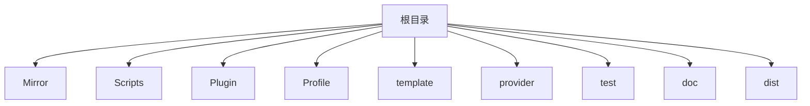
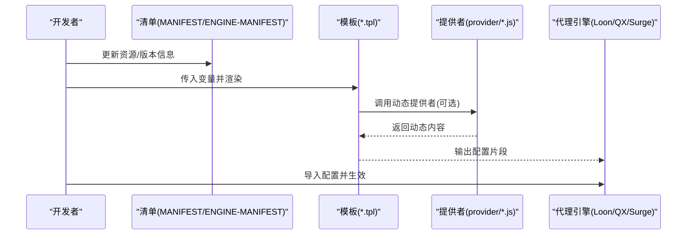
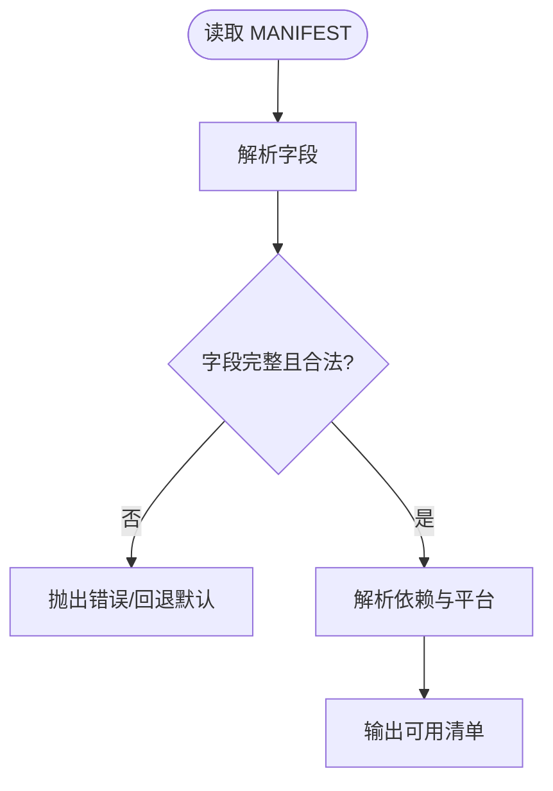
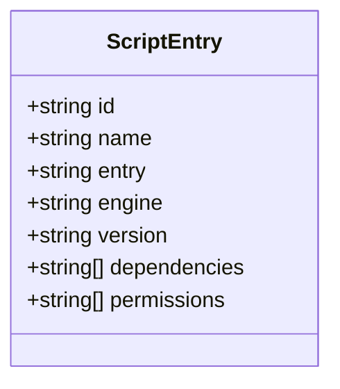
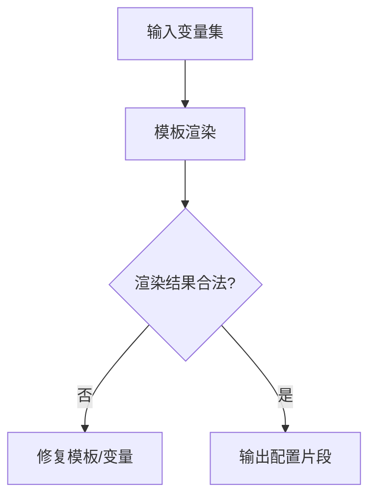
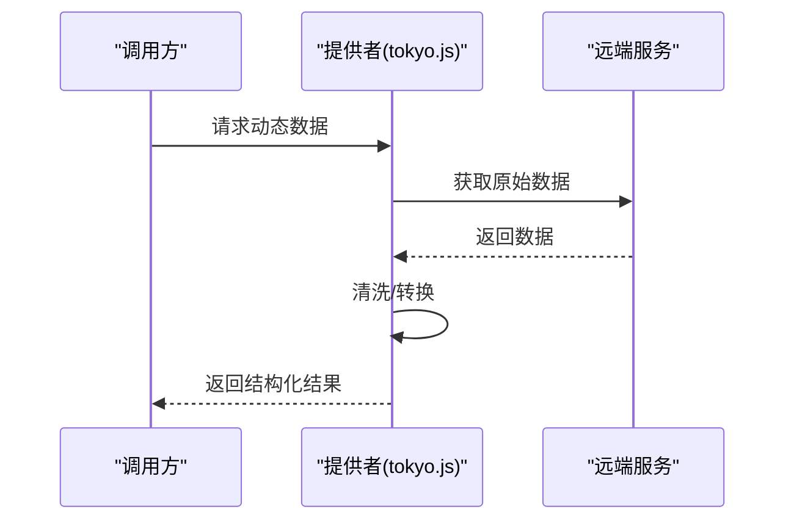
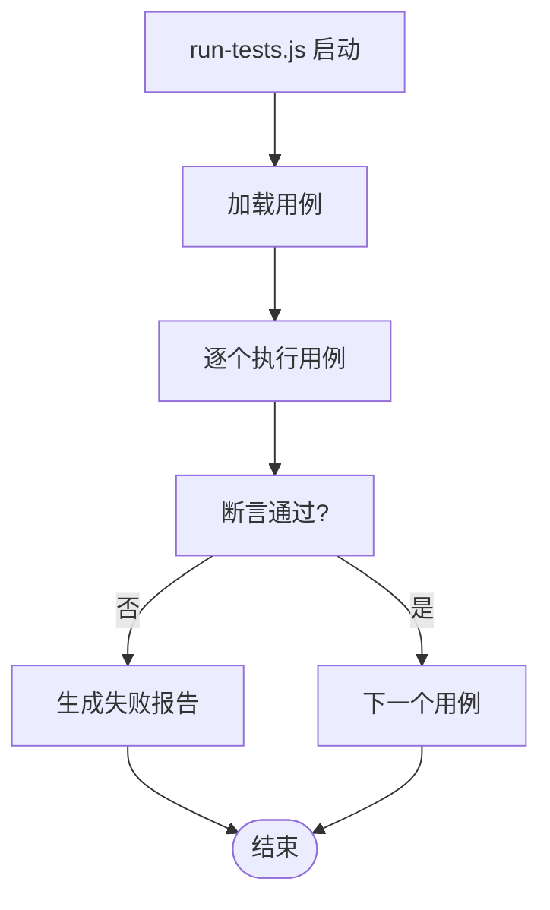
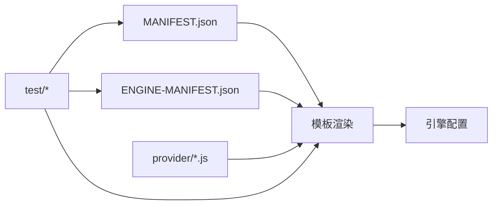

# API参考

<cite>
**本文档引用的文件**   
- [README.md](file://README.md)
- [package.json](file://package.json)
- [surgio.conf.js](file://surgio.conf.js)
- [eslint.config.mjs](file://eslint.config.mjs)
- [Mirror/MANIFEST.json](file://Mirror/MANIFEST.json)
- [Scripts/ENGINE-MANIFEST.json](file://Scripts/ENGINE-MANIFEST.json)
- [provider/tokyo.js](file://provider/tokyo.js)
- [template/loon.tpl](file://template/loon.tpl)
- [template/quantumultx.tpl](file://template/quantumultx.tpl)
- [template/surge.tpl](file://template/surge.tpl)
- [test/harness.js](file://test/harness.js)
- [test/run-tests.js](file://test/run-tests.js)
</cite>

## 目录
1. [简介](#简介)
2. [项目结构](#项目结构)
3. [核心组件](#核心组件)
4. [架构总览](#架构总览)
5. [详细组件分析](#详细组件分析)
6. [依赖分析](#依赖分析)
7. [性能考虑](#性能考虑)
8. [故障排查指南](#故障排查指南)
9. [结论](#结论)
10. [附录](#附录)

## 简介
本仓库是一个面向网络代理与脚本生态的配置与规则集合，提供多引擎（Loon、Quantumult X、Surge）的模板与插件、脚本清单、镜像清单以及测试与构建相关配置。该文档聚焦于“API参考”，从工程角度梳理对外暴露的配置接口、模板变量、清单结构与测试/构建工具链的调用约定，帮助开发者快速集成与扩展。

## 项目结构
仓库采用按功能域划分的目录组织方式：
- Mirror：镜像清单与脚本资源
- Scripts：引擎脚本与脚本清单
- Plugin：各应用插件
- Profile：不同代理客户端的配置文件
- template：生成配置的模板
- provider：动态提供者示例
- test：测试框架与用例
- doc：文档与审计记录

**章节来源**
- [README.md](file://README.md)
- [package.json](file://package.json)

## 核心组件
- 镜像清单（MANIFEST）：定义镜像源、版本、校验等元数据，供分发与验证使用
- 脚本清单（ENGINE-MANIFEST）：定义脚本名称、入口、依赖、版本等，供引擎加载
- 模板系统（*.tpl）：用于生成 Loon、Quantumult X、Surge 的配置片段
- 提供者（provider/*.js）：动态生成规则或数据的示例实现
- 测试框架（test/*）：统一的测试运行器与断言工具

**章节来源**
- [Mirror/MANIFEST.json](file://Mirror/MANIFEST.json)
- [Scripts/ENGINE-MANIFEST.json](file://Scripts/ENGINE-MANIFEST.json)
- [template/loon.tpl](file://template/loon.tpl)
- [template/quantumultx.tpl](file://template/quantumultx.tpl)
- [template/surge.tpl](file://template/surge.tpl)
- [provider/tokyo.js](file://provider/tokyo.js)
- [test/harness.js](file://test/harness.js)
- [test/run-tests.js](file://test/run-tests.js)

## 架构总览
整体流程围绕“清单驱动 + 模板渲染 + 规则/脚本注入”展开：
- 清单文件声明资源与依赖
- 模板根据变量生成目标引擎配置
- 提供者按需产出动态内容
- 测试保障清单与模板的正确性

**图表来源**
- [Mirror/MANIFEST.json](file://Mirror/MANIFEST.json)
- [Scripts/ENGINE-MANIFEST.json](file://Scripts/ENGINE-MANIFEST.json)
- [template/loon.tpl](file://template/loon.tpl)
- [template/quantumultx.tpl](file://template/quantumultx.tpl)
- [template/surge.tpl](file://template/surge.tpl)
- [provider/tokyo.js](file://provider/tokyo.js)

## 详细组件分析

### 镜像清单 API（Mirror/MANIFEST.json）
- 用途：描述镜像源、版本、校验、更新策略等
- 关键字段建议：
  - name：镜像名
  - version：版本号
  - url：下载地址
  - hash：完整性校验值
  - platforms：支持平台
  - scripts：关联脚本列表
- 使用场景：CDN 校验、增量更新、依赖解析

**图表来源**
- [Mirror/MANIFEST.json](file://Mirror/MANIFEST.json)

**章节来源**
- [Mirror/MANIFEST.json](file://Mirror/MANIFEST.json)

### 脚本清单 API（Scripts/ENGINE-MANIFEST.json）
- 用途：为各引擎提供脚本注册、版本、入口与依赖
- 关键字段建议：
  - id：脚本唯一标识
  - name：显示名
  - entry：入口路径
  - engine：目标引擎
  - version：脚本版本
  - dependencies：依赖项
  - permissions：权限声明
- 使用场景：脚本安装、升级、权限检查

**图表来源**
- [Scripts/ENGINE-MANIFEST.json](file://Scripts/ENGINE-MANIFEST.json)

**章节来源**
- [Scripts/ENGINE-MANIFEST.json](file://Scripts/ENGINE-MANIFEST.json)

### 模板系统 API（template/*.tpl）
- 用途：基于变量渲染生成 Loon、Quantumult X、Surge 的配置片段
- 常见变量：
  - 域名白名单/黑名单
  - 规则集开关
  - 代理节点选择
  - 调试开关
- 最佳实践：
  - 变量命名统一、避免冲突
  - 条件分支清晰、可维护
  - 对缺失变量设置默认值

**图表来源**
- [template/loon.tpl](file://template/loon.tpl)
- [template/quantumultx.tpl](file://template/quantumultx.tpl)
- [template/surge.tpl](file://template/surge.tpl)

**章节来源**
- [template/loon.tpl](file://template/loon.tpl)
- [template/quantumultx.tpl](file://template/quantumultx.tpl)
- [template/surge.tpl](file://template/surge.tpl)

### 提供者 API（provider/*.js）
- 用途：在运行时或构建时动态生成规则/数据
- 典型职责：
  - 拉取远程数据
  - 过滤与转换
  - 输出结构化结果
- 注意事项：
  - 超时与重试
  - 缓存策略
  - 错误降级

**图表来源**
- [provider/tokyo.js](file://provider/tokyo.js)

**章节来源**
- [provider/tokyo.js](file://provider/tokyo.js)

### 测试框架 API（test/*）
- 用途：统一运行测试用例、断言与报告
- 关键文件：
  - harness.js：测试断言与工具
  - run-tests.js：测试入口与并行执行
- 使用建议：
  - 每个清单/模板提供对应用例
  - 失败时输出详细上下文
  - 支持本地与CI环境一致

**图表来源**
- [test/harness.js](file://test/harness.js)
- [test/run-tests.js](file://test/run-tests.js)

**章节来源**
- [test/harness.js](file://test/harness.js)
- [test/run-tests.js](file://test/run-tests.js)

## 依赖分析
- 清单与模板强耦合：清单变更需同步模板变量
- 提供者与清单解耦：通过清单引用提供者产物
- 测试覆盖清单与模板：确保一致性

**图表来源**
- [Mirror/MANIFEST.json](file://Mirror/MANIFEST.json)
- [Scripts/ENGINE-MANIFEST.json](file://Scripts/ENGINE-MANIFEST.json)
- [template/loon.tpl](file://template/loon.tpl)
- [template/quantumultx.tpl](file://template/quantumultx.tpl)
- [template/surge.tpl](file://template/surge.tpl)
- [provider/tokyo.js](file://provider/tokyo.js)
- [test/harness.js](file://test/harness.js)
- [test/run-tests.js](file://test/run-tests.js)

**章节来源**
- [package.json](file://package.json)
- [eslint.config.mjs](file://eslint.config.mjs)

## 性能考虑
- 清单校验与解析：
  - 预校验字段，减少后续处理开销
  - 缓存已解析结果，避免重复IO
- 模板渲染：
  - 批量渲染，减少上下文切换
  - 惰性加载未启用模块
- 提供者：
  - 连接池与并发控制
  - 响应缓存与失效策略
- 测试：
  - 并行执行用例，缩短反馈时间
  - 只重跑受影响用例

[本节为通用指导，不直接分析具体文件]

## 故障排查指南
- 清单字段缺失或类型错误：
  - 检查 MANIFEST/ENGINE-MANIFEST 必填字段
  - 使用测试用例定位问题
- 模板渲染失败：
  - 确认变量存在且有默认值
  - 查看渲染中间产物
- 提供者异常：
  - 增加日志与超时重试
  - 降级到静态数据
- 测试失败：
  - 查看断言输出与堆栈
  - 复现最小用例

**章节来源**
- [test/harness.js](file://test/harness.js)
- [test/run-tests.js](file://test/run-tests.js)

## 结论
本仓库以清单与模板为核心，结合提供者与测试框架，形成可扩展、可验证的配置与脚本生态。遵循本文档的接口约定与最佳实践，可高效集成与迭代。

[本节为总结，不直接分析具体文件]

## 附录
- 版本兼容性与弃用说明：
  - 清单与模板应声明版本范围
  - 弃用字段保留过渡期并提供迁移指引
- 客户端集成示例：
  - 将生成的配置片段导入 Loon/QX/Surge
  - 通过清单管理脚本安装与升级
- SDK 使用说明：
  - 使用测试框架进行本地验证
  - 在 CI 中自动化清单与模板校验

[本节为补充说明，不直接分析具体文件]