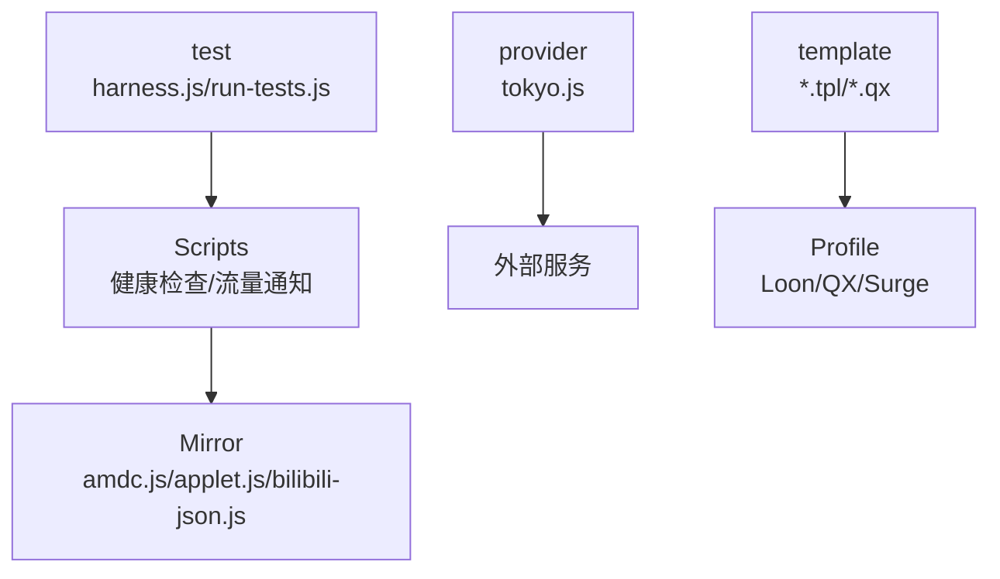
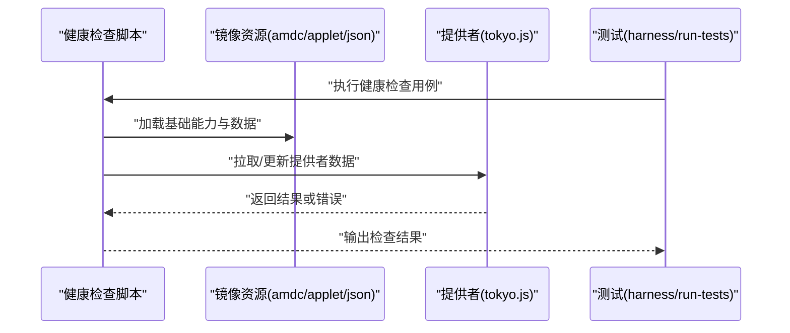
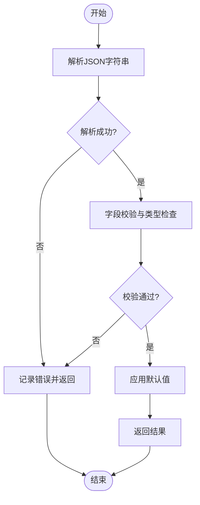
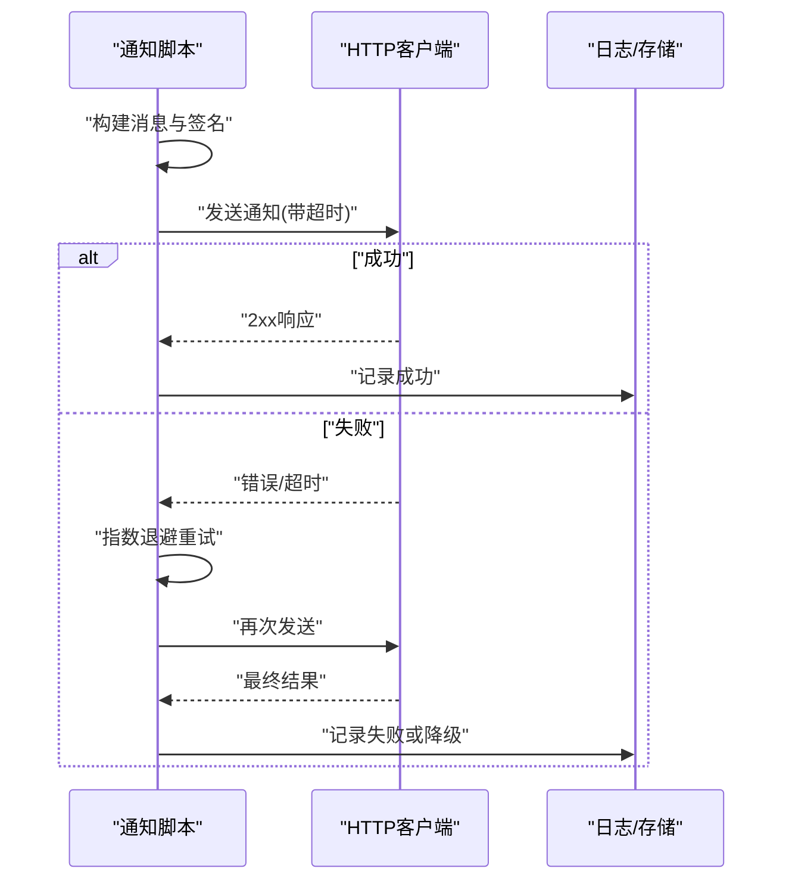
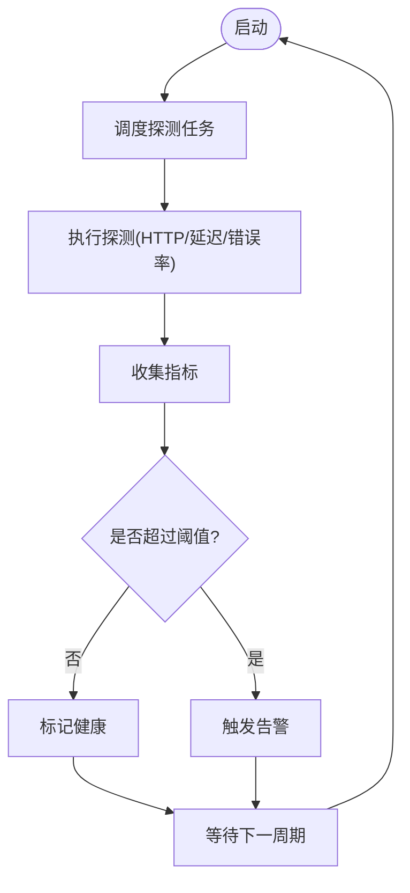
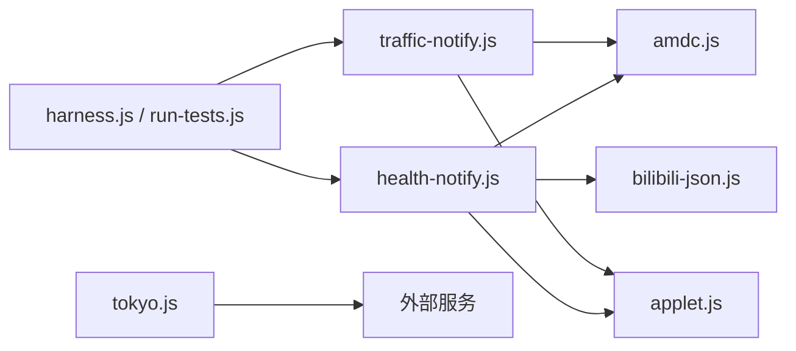

# 工具API

<cite>
**本文引用的文件**   
- [README.md](file://README.md)
- [package.json](file://package.json)
- [eslint.config.mjs](file://eslint.config.mjs)
- [surgio.conf.js](file://surgio.conf.js)
- [Scripts/health-notify.js](file://Scripts/health-notify.js)
- [Scripts/traffic-notify.js](file://Scripts/traffic-notify.js)
- [Mirror/amdc.js](file://Mirror/amdc.js)
- [Mirror/applet.js](file://Mirror/applet.js)
- [Mirror/bilibili-json.js](file://Mirror/bilibili-json.js)
- [provider/tokyo.js](file://provider/tokyo.js)
- [test/harness.js](file://test/harness.js)
- [test/run-tests.js](file://test/run-tests.js)
</cite>

## 目录
1. [简介](#简介)
2. [项目结构](#项目结构)
3. [核心组件](#核心组件)
4. [架构总览](#架构总览)
5. [详细组件分析](#详细组件分析)
6. [依赖关系分析](#依赖关系分析)
7. [性能考虑](#性能考虑)
8. [故障排查指南](#故障排查指南)
9. [结论](#结论)
10. [附录](#附录)

## 简介
本仓库是一个面向网络配置与脚本生态的集合，包含规则、插件、脚本与模板等。本文聚焦“工具API”：对仓库中用于JSON解析、通知系统、健康检查等通用能力进行系统化文档化，覆盖接口规范、参数校验、错误处理与性能优化实践，并提供使用场景示例与常见问题解决方案，帮助开发者快速集成与扩展。

## 项目结构
仓库采用按功能域组织的方式：
- Scripts：运行时脚本（如健康检查与流量通知）
- Mirror：第三方或内嵌资源（含JS辅助库与JSON数据）
- provider：动态提供者脚本
- test：测试框架与用例
- template：模板与片段
- Profile：不同客户端的配置描述
- .github/workflows：CI/CD流水线

图表来源
- [Scripts/health-notify.js](file://Scripts/health-notify.js)
- [Scripts/traffic-notify.js](file://Scripts/traffic-notify.js)
- [Mirror/amdc.js](file://Mirror/amdc.js)
- [Mirror/applet.js](file://Mirror/applet.js)
- [Mirror/bilibili-json.js](file://Mirror/bilibili-json.js)
- [provider/tokyo.js](file://provider/tokyo.js)
- [test/harness.js](file://test/harness.js)
- [test/run-tests.js](file://test/run-tests.js)

章节来源
- [README.md](file://README.md)
- [package.json](file://package.json)

## 核心组件
本节概述工具API的核心能力与职责边界：
- JSON解析与校验：提供统一的解析入口、错误定位与默认值策略
- 通知系统：封装消息发送、重试与降级逻辑
- 健康检查：周期性探测、阈值判定与告警上报
- 提供者与镜像资源：按需加载、缓存与容错

章节来源
- [Scripts/health-notify.js](file://Scripts/health-notify.js)
- [Scripts/traffic-notify.js](file://Scripts/traffic-notify.js)
- [Mirror/amdc.js](file://Mirror/amdc.js)
- [Mirror/applet.js](file://Mirror/applet.js)
- [Mirror/bilibili-json.js](file://Mirror/bilibili-json.js)
- [provider/tokyo.js](file://provider/tokyo.js)

## 架构总览
工具API以“脚本层 + 资源层 + 测试层”分层协作：
- 脚本层：健康检查与流量通知脚本作为调用入口
- 资源层：amdc.js、applet.js、bilibili-json.js提供基础能力与数据
- 测试层：harness.js与run-tests.js保障稳定性与回归

图表来源
- [Scripts/health-notify.js](file://Scripts/health-notify.js)
- [Mirror/amdc.js](file://Mirror/amdc.js)
- [Mirror/applet.js](file://Mirror/applet.js)
- [Mirror/bilibili-json.js](file://Mirror/bilibili-json.js)
- [provider/tokyo.js](file://provider/tokyo.js)
- [test/harness.js](file://test/harness.js)
- [test/run-tests.js](file://test/run-tests.js)

## 详细组件分析

### JSON解析与校验工具
目标
- 统一JSON解析入口，避免重复实现
- 提供结构化错误信息（位置、类型、缺失字段）
- 支持默认值合并与可选字段校验

关键行为
- 输入验证：类型、必填字段、枚举值范围
- 解析流程：字符串→对象→校验→默认值填充
- 错误处理：捕获语法错误、类型不匹配、缺失字段并返回结构化错误

最佳实践
- 在入口处进行最小必要校验，减少后续分支复杂度
- 对大对象使用增量校验，避免全量深拷贝
- 将错误分类为可恢复与不可恢复两类，便于上层决策

章节来源
- [Mirror/bilibili-json.js](file://Mirror/bilibili-json.js)
- [Mirror/amdc.js](file://Mirror/amdc.js)
- [Mirror/applet.js](file://Mirror/applet.js)

#### JSON解析流程图

图表来源
- [Mirror/bilibili-json.js](file://Mirror/bilibili-json.js)
- [Mirror/amdc.js](file://Mirror/amdc.js)
- [Mirror/applet.js](file://Mirror/applet.js)

### 通知系统
目标
- 封装消息发送、重试、降级与日志
- 支持多种通道（如HTTP回调、本地日志）
- 提供幂等性与去重机制

关键行为
- 构建请求体：标准化字段、签名与时间戳
- 发送策略：指数退避重试、超时控制、失败回退
- 状态管理：成功/失败/重试次数/最后尝试时间

最佳实践
- 对敏感字段进行脱敏处理
- 使用队列批量发送以降低网络开销
- 设置合理的超时与最大重试次数

章节来源
- [Scripts/traffic-notify.js](file://Scripts/traffic-notify.js)
- [Scripts/health-notify.js](file://Scripts/health-notify.js)

#### 通知发送时序图

图表来源
- [Scripts/traffic-notify.js](file://Scripts/traffic-notify.js)
- [Scripts/health-notify.js](file://Scripts/health-notify.js)

### 健康检查
目标
- 周期性探测关键服务可用性
- 基于阈值判断健康状态并触发告警
- 聚合多源指标，提供统一视图

关键行为
- 探测任务：HTTP可达性、延迟、错误率
- 判定逻辑：连续失败次数、阈值比较
- 告警上报：通过通知系统推送

最佳实践
- 使用独立线程或事件循环调度，避免阻塞主流程
- 对慢查询设置超时与熔断
- 提供开关与权重调节，支持灰度与健康分

章节来源
- [Scripts/health-notify.js](file://Scripts/health-notify.js)

#### 健康检查流程图

图表来源
- [Scripts/health-notify.js](file://Scripts/health-notify.js)

### 提供者与镜像资源
目标
- 按需加载提供者数据与镜像资源
- 提供缓存、版本管理与回退策略
- 支持热更新与一致性校验

关键行为
- 加载顺序：本地优先→远程回退→缓存命中
- 一致性校验：哈希或版本号比对
- 错误回退：降级到默认配置或空集

章节来源
- [provider/tokyo.js](file://provider/tokyo.js)
- [Mirror/amdc.js](file://Mirror/amdc.js)
- [Mirror/applet.js](file://Mirror/applet.js)
- [Mirror/bilibili-json.js](file://Mirror/bilibili-json.js)

## 依赖关系分析
- 脚本层依赖镜像资源与提供者
- 测试层驱动脚本执行并断言结果
- ESLint与配置文件保障代码质量

图表来源
- [Scripts/health-notify.js](file://Scripts/health-notify.js)
- [Scripts/traffic-notify.js](file://Scripts/traffic-notify.js)
- [Mirror/amdc.js](file://Mirror/amdc.js)
- [Mirror/applet.js](file://Mirror/applet.js)
- [Mirror/bilibili-json.js](file://Mirror/bilibili-json.js)
- [provider/tokyo.js](file://provider/tokyo.js)
- [test/harness.js](file://test/harness.js)
- [test/run-tests.js](file://test/run-tests.js)

章节来源
- [eslint.config.mjs](file://eslint.config.mjs)
- [surgio.conf.js](file://surgio.conf.js)

## 性能考虑
- 解析优化：避免重复解析，缓存已校验对象；对大对象使用流式或分块处理
- 网络优化：连接复用、超时与重试上限、并发限制与背压
- 内存管理：及时释放临时对象，避免全局污染；使用弱引用缓存热点数据
- 调度优化：批处理与节流，降低频繁I/O与CPU抖动

[本节为通用指导，无需特定文件来源]

## 故障排查指南
常见问题与解决思路
- JSON解析失败：检查字符串编码、BOM头、尾逗号与注释；定位错误行号与列号
- 通知发送失败：确认网络连通、代理设置、签名与时间戳；查看重试日志与降级路径
- 健康检查误报：调整阈值与采样窗口；增加探针多样性与权重
- 提供者更新异常：校验版本一致性；回滚到上一稳定版本

章节来源
- [test/harness.js](file://test/harness.js)
- [test/run-tests.js](file://test/run-tests.js)

## 结论
本工具API围绕JSON解析、通知系统与健康检查三大能力，形成稳定的脚本层与资源层协作模式。通过统一的校验、错误处理与性能优化策略，提升整体可靠性与可维护性。建议在实际使用中遵循参数校验、幂等设计与可观测性原则，并结合测试框架持续回归。

[本节为总结性内容，无需特定文件来源]

## 附录
- 环境变量与配置项：建议在顶层配置文件集中管理，避免硬编码
- 日志规范：统一级别、格式与采集方式，便于追踪问题
- 安全建议：敏感信息加密存储，传输层启用TLS，最小权限原则

[本节为补充说明，无需特定文件来源]