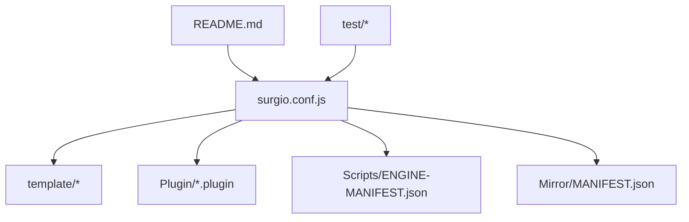
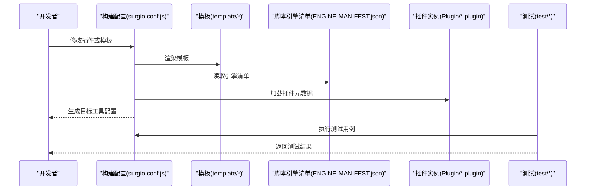
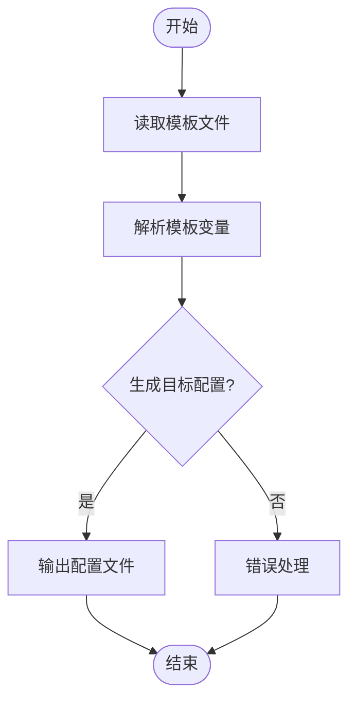
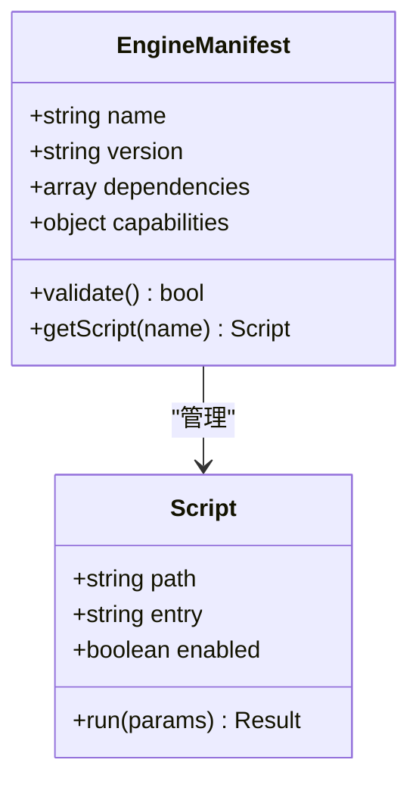
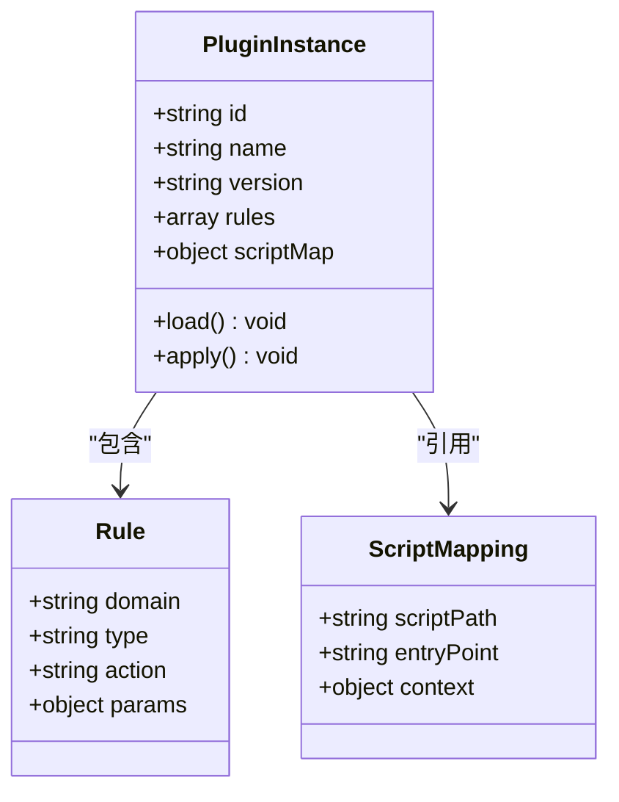
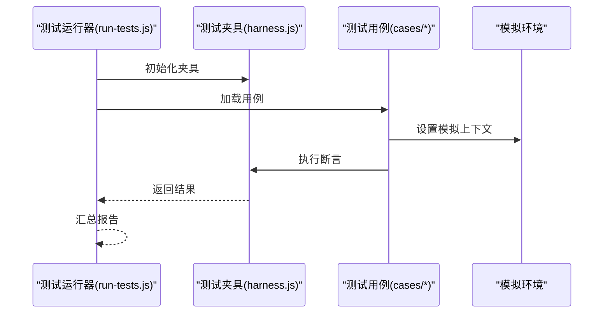
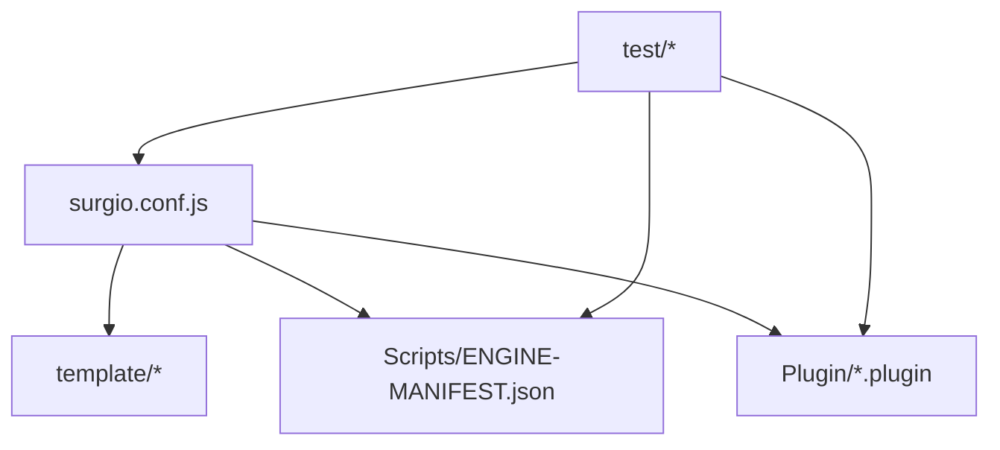

# 插件API

<cite>
**本文档引用的文件**   
- [README.md](file://README.md)
- [package.json](file://package.json)
- [surgio.conf.js](file://surgio.conf.js)
- [template/loon.tpl](file://template/loon.tpl)
- [template/quantumultx.tpl](file://template/quantumultx.tpl)
- [template/surge.tpl](file://template/surge.tpl)
- [Plugin/bilibili.plugin](file://Plugin/bilibili.plugin)
- [Plugin/wechat.plugin](file://Plugin/wechat.plugin)
- [Plugin/notify.plugin](file://Plugin/notify.plugin)
- [Scripts/ENGINE-MANIFEST.json](file://Scripts/ENGINE-MANIFEST.json)
- [Mirror/MANIFEST.json](file://Mirror/MANIFEST.json)
- [test/harness.js](file://test/harness.js)
- [test/run-tests.js](file://test/run-tests.js)
</cite>

## 目录
1. [简介](#简介)
2. [项目结构](#项目结构)
3. [核心组件](#核心组件)
4. [架构总览](#架构总览)
5. [详细组件分析](#详细组件分析)
6. [依赖关系分析](#依赖关系分析)
7. [性能考虑](#性能考虑)
8. [故障排查指南](#故障排查指南)
9. [结论](#结论)
10. [附录](#附录)

## 简介
本仓库提供面向网络工具（如 Surge、Quantumult X、Loon）的插件与脚本生态，包含插件模板、脚本引擎清单、测试框架以及构建与发布工作流。本文档聚焦“插件API”：定义插件开发接口、生命周期管理、扩展点机制、配置格式、事件系统与钩子函数使用方法，并给出最佳实践、安全注意事项、性能优化建议、示例与调试指南。

## 项目结构
仓库采用按功能域组织的方式：
- Plugin：各应用插件的定义与规则集合
- Scripts：脚本引擎与运行时清单
- Mirror：镜像与资源解析脚本
- template：不同工具的模板（Loon、Quantumult X、Surge）
- test：测试用例与运行器
- surgio.conf.js：构建与生成入口配置
- README.md：项目说明与使用说明

图表来源
- [README.md](file://README.md)
- [surgio.conf.js](file://surgio.conf.js)
- [template/loon.tpl](file://template/loon.tpl)
- [template/quantumultx.tpl](file://template/quantumultx.tpl)
- [template/surge.tpl](file://template/surge.tpl)
- [Plugin/bilibili.plugin](file://Plugin/bilibili.plugin)
- [Scripts/ENGINE-MANIFEST.json](file://Scripts/ENGINE-MANIFEST.json)
- [Mirror/MANIFEST.json](file://Mirror/MANIFEST.json)
- [test/harness.js](file://test/harness.js)
- [test/run-tests.js](file://test/run-tests.js)

章节来源
- [README.md](file://README.md)
- [package.json](file://package.json)
- [surgio.conf.js](file://surgio.conf.js)

## 核心组件
- 插件模板系统：为不同工具（Loon、Quantumult X、Surge）提供统一模板，便于生成一致的插件配置与脚本注入。
- 脚本引擎清单：集中声明脚本能力、版本与依赖，供构建与校验使用。
- 插件实例：每个 .plugin 文件描述一个应用的插件元数据、规则与脚本映射。
- 测试框架：提供统一的测试夹具与运行器，用于验证插件与脚本行为。

章节来源
- [template/loon.tpl](file://template/loon.tpl)
- [template/quantumultx.tpl](file://template/quantumultx.tpl)
- [template/surge.tpl](file://template/surge.tpl)
- [Scripts/ENGINE-MANIFEST.json](file://Scripts/ENGINE-MANIFEST.json)
- [Plugin/bilibili.plugin](file://Plugin/bilibili.plugin)
- [Plugin/wechat.plugin](file://Plugin/wechat.plugin)
- [Plugin/notify.plugin](file://Plugin/notify.plugin)
- [test/harness.js](file://test/harness.js)
- [test/run-tests.js](file://test/run-tests.js)

## 架构总览
插件系统由“模板 + 清单 + 插件实例 + 测试”构成，通过构建配置将模板与清单合并生成目标工具的可用配置。

图表来源
- [surgio.conf.js](file://surgio.conf.js)
- [template/loon.tpl](file://template/loon.tpl)
- [template/quantumultx.tpl](file://template/quantumultx.tpl)
- [template/surge.tpl](file://template/surge.tpl)
- [Scripts/ENGINE-MANIFEST.json](file://Scripts/ENGINE-MANIFEST.json)
- [Plugin/bilibili.plugin](file://Plugin/bilibili.plugin)
- [test/harness.js](file://test/harness.js)
- [test/run-tests.js](file://test/run-tests.js)

## 详细组件分析

### 插件模板系统
- 作用：为 Loon、Quantumult X、Surge 分别提供模板，统一插件结构与字段命名，确保生成的配置一致且可维护。
- 关键点：
  - 模板变量：在模板中声明占位符，构建时替换为插件元数据。
  - 条件分支：根据目标工具选择不同语法片段。
  - 脚本注入：将脚本路径与规则绑定到插件配置中。

图表来源
- [template/loon.tpl](file://template/loon.tpl)
- [template/quantumultx.tpl](file://template/quantumultx.tpl)
- [template/surge.tpl](file://template/surge.tpl)

章节来源
- [template/loon.tpl](file://template/loon.tpl)
- [template/quantumultx.tpl](file://template/quantumultx.tpl)
- [template/surge.tpl](file://template/surge.tpl)

### 脚本引擎清单
- 作用：集中声明脚本名称、版本、依赖与能力，供构建与校验使用。
- 关键点：
  - 版本管理：确保脚本与引擎兼容。
  - 依赖声明：避免循环依赖与缺失依赖。
  - 能力标记：标识脚本是否支持特定功能（如拦截、重写、通知）。

图表来源
- [Scripts/ENGINE-MANIFEST.json](file://Scripts/ENGINE-MANIFEST.json)

章节来源
- [Scripts/ENGINE-MANIFEST.json](file://Scripts/ENGINE-MANIFEST.json)

### 插件实例
- 作用：描述单个应用的插件元数据、规则与脚本映射。
- 关键点：
  - 元数据：名称、版本、作者、描述等。
  - 规则集：域名匹配、请求/响应重写、拦截策略。
  - 脚本映射：将脚本与规则关联，指定触发条件。

图表来源
- [Plugin/bilibili.plugin](file://Plugin/bilibili.plugin)
- [Plugin/wechat.plugin](file://Plugin/wechat.plugin)
- [Plugin/notify.plugin](file://Plugin/notify.plugin)

章节来源
- [Plugin/bilibili.plugin](file://Plugin/bilibili.plugin)
- [Plugin/wechat.plugin](file://Plugin/wechat.plugin)
- [Plugin/notify.plugin](file://Plugin/notify.plugin)

### 测试框架
- 作用：提供统一的测试夹具与运行器，验证插件与脚本行为。
- 关键点：
  - 夹具：模拟目标环境（如网络请求、环境变量）。
  - 运行器：批量执行测试用例并汇总结果。
  - 断言：检查插件加载、规则生效、脚本调用是否正确。

图表来源
- [test/run-tests.js](file://test/run-tests.js)
- [test/harness.js](file://test/harness.js)

章节来源
- [test/harness.js](file://test/harness.js)
- [test/run-tests.js](file://test/run-tests.js)

## 依赖关系分析
插件系统依赖模板、清单与测试框架，构建配置作为中枢协调各组件。

图表来源
- [surgio.conf.js](file://surgio.conf.js)
- [template/loon.tpl](file://template/loon.tpl)
- [template/quantumultx.tpl](file://template/quantumultx.tpl)
- [template/surge.tpl](file://template/surge.tpl)
- [Scripts/ENGINE-MANIFEST.json](file://Scripts/ENGINE-MANIFEST.json)
- [Plugin/bilibili.plugin](file://Plugin/bilibili.plugin)
- [test/harness.js](file://test/harness.js)
- [test/run-tests.js](file://test/run-tests.js)

章节来源
- [surgio.conf.js](file://surgio.conf.js)
- [Scripts/ENGINE-MANIFEST.json](file://Scripts/ENGINE-MANIFEST.json)
- [Plugin/bilibili.plugin](file://Plugin/bilibili.plugin)
- [test/harness.js](file://test/harness.js)
- [test/run-tests.js](file://test/run-tests.js)

## 性能考虑
- 模板渲染：缓存已渲染模板，避免重复解析。
- 脚本加载：按需加载脚本，减少内存占用。
- 规则匹配：使用高效数据结构（如前缀树）加速域名匹配。
- 并发控制：限制并行任务数，避免阻塞主线程。
- 日志采样：在高负载场景下降低日志频率。

[本节为通用指导，不直接分析具体文件]

## 故障排查指南
- 模板渲染失败：检查模板变量是否完整、语法是否正确。
- 脚本加载异常：确认脚本路径、入口点与环境变量。
- 规则未生效：检查规则优先级、匹配条件与作用域。
- 测试失败：查看测试夹具状态、模拟环境与断言逻辑。

章节来源
- [test/harness.js](file://test/harness.js)
- [test/run-tests.js](file://test/run-tests.js)

## 结论
本插件API以模板为中心，结合脚本引擎清单与插件实例，形成可扩展、可测试的插件生态。通过统一的构建配置与测试框架，开发者可以高效地创建、验证与维护插件。遵循最佳实践与安全规范，可进一步提升系统的稳定性与性能。

[本节为总结性内容，不直接分析具体文件]

## 附录
- 插件开发最佳实践：
  - 明确职责边界，保持插件单一功能。
  - 使用模板变量统一管理配置差异。
  - 编写单元测试覆盖关键路径。
- 安全考虑：
  - 输入校验与输出转义，防止注入攻击。
  - 最小权限原则，限制脚本访问范围。
  - 定期更新依赖，修复已知漏洞。
- 性能优化建议：
  - 避免频繁I/O操作，使用缓存策略。
  - 合理拆分任务，提升并发效率。
  - 监控关键指标，定位瓶颈。

[本节为通用指导，不直接分析具体文件]