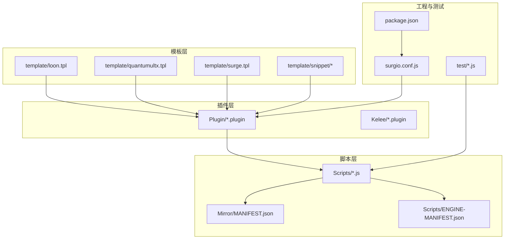
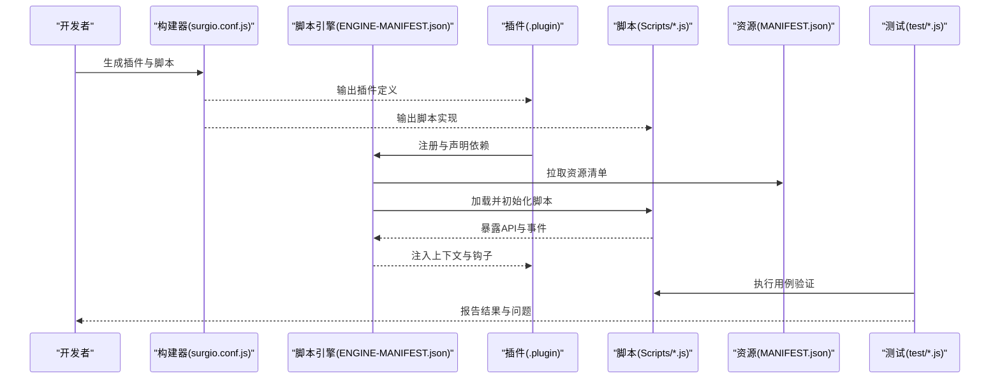
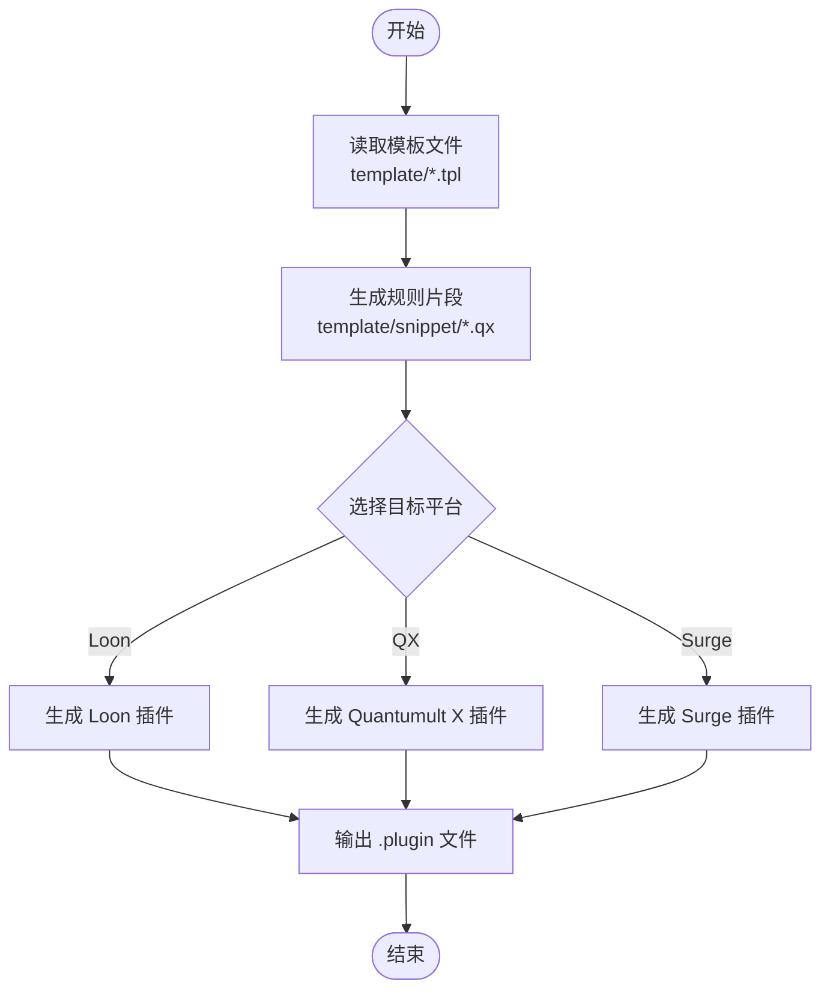
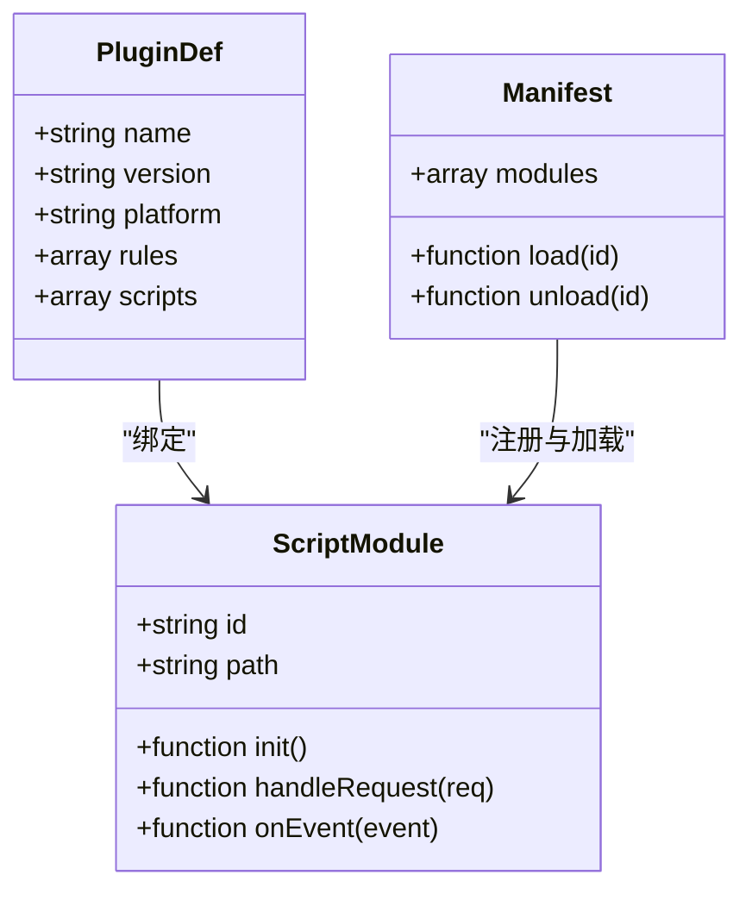
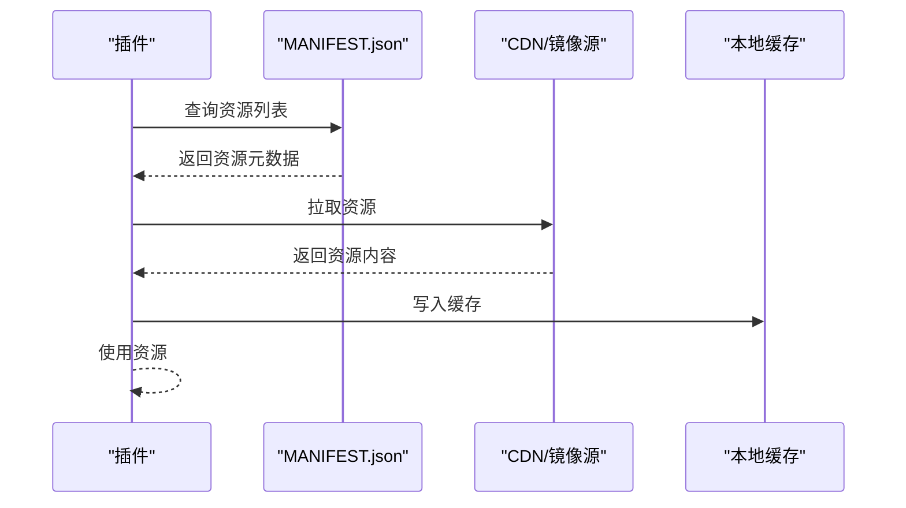
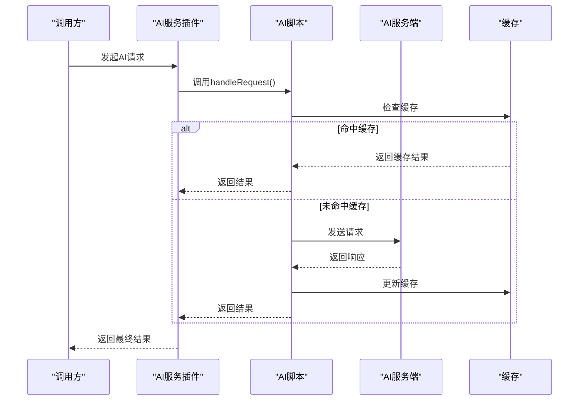
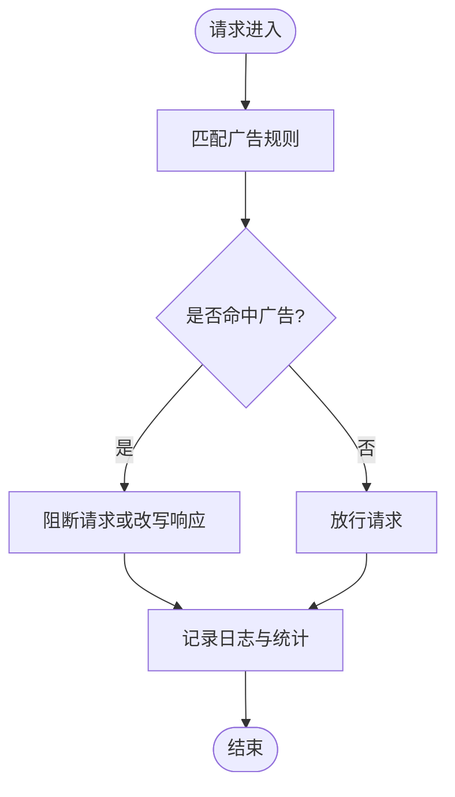
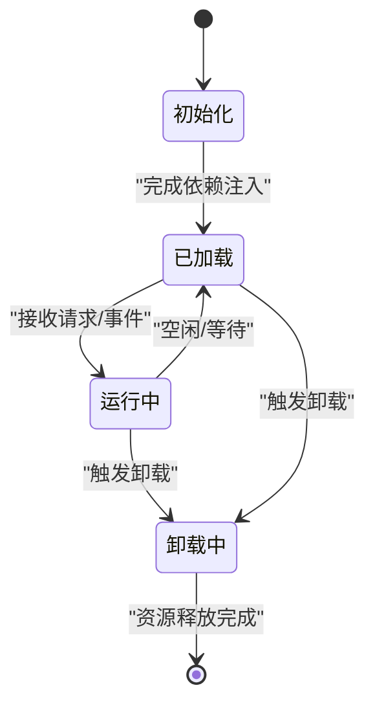
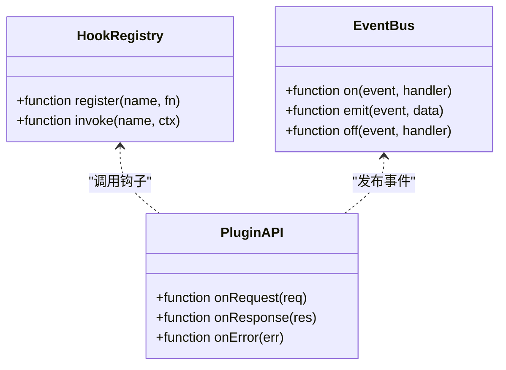
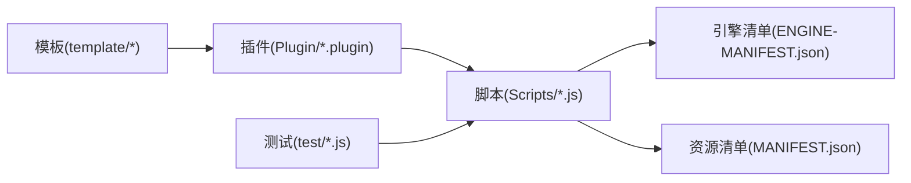

# 插件开发指南

<cite>
**本文引用的文件**   
- [README.md](file://README.md)
- [package.json](file://package.json)
- [surgio.conf.js](file://surgio.conf.js)
- [template/loon.tpl](file://template/loon.tpl)
- [template/quantumultx.tpl](file://template/quantumultx.tpl)
- [template/surge.tpl](file://template/surge.tpl)
- [template/snippet/ai-services.qx](file://template/snippet/ai-services.qx)
- [template/snippet/ai-services.tpl](file://template/snippet/ai-services.tpl)
- [template/snippet/bank-ad-reject.qx](file://template/snippet/bank-ad-reject.qx)
- [template/snippet/bank-ad-reject.tpl](file://template/snippet/bank-ad-reject.tpl)
- [template/snippet/developer.qx](file://template/snippet/developer.qx)
- [template/snippet/developer.tpl](file://template/snippet/developer.tpl)
- [template/snippet/social.qx](file://template/snippet/social.qx)
- [template/snippet/social.tpl](file://template/snippet/social.tpl)
- [template/snippet/streaming.qx](file://template/snippet/streaming.qx)
- [template/snippet/streaming.tpl](file://template/snippet/streaming.tpl)
- [Plugin/ai.plugin](file://Plugin/ai.plugin)
- [Plugin/amap.plugin](file://Plugin/amap.plugin)
- [Plugin/bilibili.plugin](file://Plugin/bilibili.plugin)
- [Plugin/netease.plugin](file://Plugin/netease.plugin)
- [Plugin/notify.plugin](file://Plugin/notify.plugin)
- [Plugin/sub-store.plugin](file://Plugin/sub-store.plugin)
- [Scripts/ENGINE-MANIFEST.json](file://Scripts/ENGINE-MANIFEST.json)
- [Mirror/MANIFEST.json](file://Mirror/MANIFEST.json)
- [Kelee/Prevent_DNS_Leaks.plugin](file://Kelee/Prevent_DNS_Leaks.plugin)
- [Kelee/YouTube_remove_ads.plugin](file://Kelee/YouTube_remove_ads.plugin)
- [test/harness.js](file://test/harness.js)
- [test/run-tests.js](file://test/run-tests.js)
</cite>

## 目录
1. [简介](#简介)
2. [项目结构](#项目结构)
3. [核心组件](#核心组件)
4. [架构总览](#架构总览)
5. [详细组件分析](#详细组件分析)
6. [依赖分析](#依赖分析)
7. [性能考虑](#性能考虑)
8. [故障排查指南](#故障排查指南)
9. [结论](#结论)
10. [附录](#附录)

## 简介
本指南面向希望在本仓库中开发“插件”的开发者，涵盖插件的基本结构、文件格式规范、开发环境搭建、生命周期管理（初始化、加载、运行、卸载）、API接口与事件系统、钩子函数使用方式，并提供AI服务插件与广告拦截插件等完整示例。同时包含调试技巧、错误处理与性能优化建议，帮助你在Loon、Quantumult X、Surge等代理工具生态中高效构建稳定可靠的插件。

## 项目结构
仓库采用“模板 + 脚本 + 清单 + 测试”的组织方式：
- template：各平台（Loon、Quantumult X、Surge）的通用模板与片段模板，用于生成插件配置与脚本骨架
- Plugin：以 .plugin 为后缀的插件定义，通常包含元数据与规则映射
- Scripts：JS 脚本实现，配合引擎清单进行加载与管理
- Mirror：第三方或聚合资源，含 MANIFEST 清单与脚本片段
- Kelee：示例插件（如DNS泄露防护、YouTube广告拦截）
- test：测试框架与用例，用于验证脚本行为与兼容性
- surgio.conf.js：构建与发布相关配置
- package.json：工程依赖与脚本命令

图表来源
- [template/loon.tpl](file://template/loon.tpl)
- [template/quantumultx.tpl](file://template/quantumultx.tpl)
- [template/surge.tpl](file://template/surge.tpl)
- [template/snippet/ai-services.qx](file://template/snippet/ai-services.qx)
- [template/snippet/bank-ad-reject.qx](file://template/snippet/bank-ad-reject.qx)
- [Plugin/ai.plugin](file://Plugin/ai.plugin)
- [Plugin/bilibili.plugin](file://Plugin/bilibili.plugin)
- [Scripts/ENGINE-MANIFEST.json](file://Scripts/ENGINE-MANIFEST.json)
- [Mirror/MANIFEST.json](file://Mirror/MANIFEST.json)
- [surgio.conf.js](file://surgio.conf.js)
- [package.json](file://package.json)
- [test/harness.js](file://test/harness.js)
- [test/run-tests.js](file://test/run-tests.js)

章节来源
- [README.md](file://README.md)
- [package.json](file://package.json)
- [surgio.conf.js](file://surgio.conf.js)

## 核心组件
- 模板系统：通过 Loon/Quantumult X/Surge 模板与片段模板快速生成插件结构与规则
- 插件定义：.plugin 文件描述插件名称、版本、适用平台、规则与脚本绑定
- 脚本引擎：Scripts 下的 JS 脚本由 ENGINE-MANIFEST.json 统一注册与加载
- 资源清单：Mirror/MANIFEST.json 提供外部资源索引，供插件按需拉取
- 测试框架：基于 Node.js 的测试套件，确保脚本在目标环境中可执行且行为正确

章节来源
- [template/loon.tpl](file://template/loon.tpl)
- [template/quantumultx.tpl](file://template/quantumultx.tpl)
- [template/surge.tpl](file://template/surge.tpl)
- [Plugin/ai.plugin](file://Plugin/ai.plugin)
- [Scripts/ENGINE-MANIFEST.json](file://Scripts/ENGINE-MANIFEST.json)
- [Mirror/MANIFEST.json](file://Mirror/MANIFEST.json)
- [test/harness.js](file://test/harness.js)
- [test/run-tests.js](file://test/run-tests.js)

## 架构总览
插件体系围绕“模板生成 -> 插件定义 -> 脚本执行 -> 资源加载 -> 测试验证”的闭环展开。不同代理工具的插件格式存在差异，但整体流程一致：
- 初始化：解析插件清单与模板，准备运行时上下文
- 加载：根据 ENGINE-MANIFEST.json 与 MANIFEST.json 加载脚本与资源
- 运行：响应网络请求或事件，执行脚本逻辑并返回结果
- 卸载：释放资源、清理状态、注销钩子

图表来源
- [surgio.conf.js](file://surgio.conf.js)
- [Scripts/ENGINE-MANIFEST.json](file://Scripts/ENGINE-MANIFEST.json)
- [Mirror/MANIFEST.json](file://Mirror/MANIFEST.json)
- [Plugin/ai.plugin](file://Plugin/ai.plugin)
- [test/harness.js](file://test/harness.js)
- [test/run-tests.js](file://test/run-tests.js)

## 详细组件分析

### 模板系统与插件骨架
- 模板文件负责生成不同平台的插件骨架与规则片段，保证跨平台一致性
- 片段模板（snippet）提供常见场景的模板，如 AI 服务、银行广告拦截、开发者工具、社交应用、流媒体等
- 通过模板变量替换，快速生成适配 Loon、Quantumult X、Surge 的配置

图表来源
- [template/loon.tpl](file://template/loon.tpl)
- [template/quantumultx.tpl](file://template/quantumultx.tpl)
- [template/surge.tpl](file://template/surge.tpl)
- [template/snippet/ai-services.qx](file://template/snippet/ai-services.qx)
- [template/snippet/bank-ad-reject.qx](file://template/snippet/bank-ad-reject.qx)
- [template/snippet/developer.qx](file://template/snippet/developer.qx)
- [template/snippet/social.qx](file://template/snippet/social.qx)
- [template/snippet/streaming.qx](file://template/snippet/streaming.qx)

章节来源
- [template/loon.tpl](file://template/loon.tpl)
- [template/quantumultx.tpl](file://template/quantumultx.tpl)
- [template/surge.tpl](file://template/surge.tpl)
- [template/snippet/ai-services.qx](file://template/snippet/ai-services.qx)
- [template/snippet/bank-ad-reject.qx](file://template/snippet/bank-ad-reject.qx)
- [template/snippet/developer.qx](file://template/snippet/developer.qx)
- [template/snippet/social.qx](file://template/snippet/social.qx)
- [template/snippet/streaming.qx](file://template/snippet/streaming.qx)

### 插件定义与脚本绑定
- .plugin 文件作为插件入口，声明插件元数据、规则与脚本绑定关系
- 脚本位于 Scripts 目录，按功能模块组织，便于管理与复用
- ENGINE-MANIFEST.json 统一注册脚本模块，提供加载顺序与依赖声明

图表来源
- [Plugin/ai.plugin](file://Plugin/ai.plugin)
- [Plugin/bilibili.plugin](file://Plugin/bilibili.plugin)
- [Scripts/ENGINE-MANIFEST.json](file://Scripts/ENGINE-MANIFEST.json)

章节来源
- [Plugin/ai.plugin](file://Plugin/ai.plugin)
- [Plugin/bilibili.plugin](file://Plugin/bilibili.plugin)
- [Scripts/ENGINE-MANIFEST.json](file://Scripts/ENGINE-MANIFEST.json)

### 资源清单与外部依赖
- Mirror/MANIFEST.json 提供外部资源索引，插件可按需拉取
- 脚本通过清单获取资源路径与版本信息，避免硬编码
- 构建阶段可将资源打包到插件包内，提升离线可用性

图表来源
- [Mirror/MANIFEST.json](file://Mirror/MANIFEST.json)

章节来源
- [Mirror/MANIFEST.json](file://Mirror/MANIFEST.json)

### 示例插件：AI服务插件
- 使用 ai-services.qx 与 ai-services.tpl 生成插件骨架
- 脚本实现与服务端交互、鉴权、缓存与错误重试
- 通过事件系统上报调用统计与异常

图表来源
- [template/snippet/ai-services.qx](file://template/snippet/ai-services.qx)
- [template/snippet/ai-services.tpl](file://template/snippet/ai-services.tpl)
- [Plugin/ai.plugin](file://Plugin/ai.plugin)

章节来源
- [template/snippet/ai-services.qx](file://template/snippet/ai-services.qx)
- [template/snippet/ai-services.tpl](file://template/snippet/ai-services.tpl)
- [Plugin/ai.plugin](file://Plugin/ai.plugin)

### 示例插件：广告拦截插件
- 使用 bank-ad-reject.qx 与 bank-ad-reject.tpl 生成银行类广告拦截插件
- 规则匹配域名与请求头，动态改写响应体或阻断请求
- 支持白名单与灰度策略，避免误伤正常业务

图表来源
- [template/snippet/bank-ad-reject.qx](file://template/snippet/bank-ad-reject.qx)
- [template/snippet/bank-ad-reject.tpl](file://template/snippet/bank-ad-reject.tpl)

章节来源
- [template/snippet/bank-ad-reject.qx](file://template/snippet/bank-ad-reject.qx)
- [template/snippet/bank-ad-reject.tpl](file://template/snippet/bank-ad-reject.tpl)

### 生命周期管理：初始化、加载、运行、卸载
- 初始化：解析插件清单与模板，建立上下文与环境变量
- 加载：根据 ENGINE-MANIFEST.json 加载脚本模块，初始化依赖
- 运行：响应请求与事件，执行业务逻辑并返回结果
- 卸载：释放资源、清理状态、注销钩子与定时器

章节来源
- [Scripts/ENGINE-MANIFEST.json](file://Scripts/ENGINE-MANIFEST.json)
- [Mirror/MANIFEST.json](file://Mirror/MANIFEST.json)

### API接口、事件系统与钩子函数
- API接口：插件通过脚本暴露统一的请求处理与事件回调接口
- 事件系统：支持网络事件、定时任务、系统通知等扩展点
- 钩子函数：在请求前后、响应处理、错误恢复等关键节点插入自定义逻辑

图表来源
- [Scripts/ENGINE-MANIFEST.json](file://Scripts/ENGINE-MANIFEST.json)

章节来源
- [Scripts/ENGINE-MANIFEST.json](file://Scripts/ENGINE-MANIFEST.json)

### 开发环境与搭建
- 安装 Node.js 与必要依赖
- 使用 package.json 中的脚本命令进行构建与测试
- 通过 surgio.conf.js 配置构建参数与发布目标

章节来源
- [package.json](file://package.json)
- [surgio.conf.js](file://surgio.conf.js)

### 调试技巧与错误处理
- 启用详细日志与堆栈跟踪，定位脚本执行路径
- 使用测试框架模拟请求与事件，验证边界条件
- 捕获异常并降级处理，避免影响主流程

章节来源
- [test/harness.js](file://test/harness.js)
- [test/run-tests.js](file://test/run-tests.js)

### 性能优化建议
- 缓存热点数据与响应，减少重复请求
- 异步处理耗时操作，避免阻塞主线程
- 合理拆分脚本模块，按需加载与卸载

章节来源
- [Scripts/ENGINE-MANIFEST.json](file://Scripts/ENGINE-MANIFEST.json)
- [Mirror/MANIFEST.json](file://Mirror/MANIFEST.json)

## 依赖分析
插件与脚本、清单、模板之间的依赖关系如下：
- 插件依赖模板生成规则与脚本骨架
- 脚本依赖 ENGINE-MANIFEST.json 进行模块注册
- 资源依赖 MANIFEST.json 进行索引与拉取
- 测试依赖测试框架与用例集

图表来源
- [template/loon.tpl](file://template/loon.tpl)
- [template/quantumultx.tpl](file://template/quantumultx.tpl)
- [template/surge.tpl](file://template/surge.tpl)
- [Plugin/ai.plugin](file://Plugin/ai.plugin)
- [Scripts/ENGINE-MANIFEST.json](file://Scripts/ENGINE-MANIFEST.json)
- [Mirror/MANIFEST.json](file://Mirror/MANIFEST.json)
- [test/harness.js](file://test/harness.js)
- [test/run-tests.js](file://test/run-tests.js)

章节来源
- [surgio.conf.js](file://surgio.conf.js)
- [package.json](file://package.json)

## 性能考虑
- 使用连接池与HTTP客户端复用，降低握手开销
- 对大响应体进行分块处理与流式传输
- 避免在热路径中进行同步I/O与复杂计算
- 合理设置超时与重试策略，提升鲁棒性

[本节为通用指导，不直接分析具体文件]

## 故障排查指南
- 检查插件清单与模板变量是否正确替换
- 确认脚本模块在 ENGINE-MANIFEST.json 中已注册
- 查看测试用例输出与日志，定位失败原因
- 使用断点与逐步执行，验证关键逻辑分支

章节来源
- [test/harness.js](file://test/harness.js)
- [test/run-tests.js](file://test/run-tests.js)

## 结论
本指南系统梳理了插件开发的完整流程，从模板生成、插件定义、脚本实现到测试验证，覆盖生命周期管理、API与事件系统、钩子函数使用以及性能优化与故障排查。遵循本文档的实践建议，可在多平台代理生态中高效构建稳定、可扩展的插件。

## 附录
- 示例插件参考：
  - AI服务插件：template/snippet/ai-services.* 与 Plugin/ai.plugin
  - 广告拦截插件：template/snippet/bank-ad-reject.* 与 Kelee/YouTube_remove_ads.plugin
  - DNS泄露防护：Kelee/Prevent_DNS_Leaks.plugin
- 其他插件示例：Plugin/*.plugin 与 Scripts/*.js

章节来源
- [template/snippet/ai-services.qx](file://template/snippet/ai-services.qx)
- [template/snippet/bank-ad-reject.qx](file://template/snippet/bank-ad-reject.qx)
- [Plugin/ai.plugin](file://Plugin/ai.plugin)
- [Kelee/Prevent_DNS_Leaks.plugin](file://Kelee/Prevent_DNS_Leaks.plugin)
- [Kelee/YouTube_remove_ads.plugin](file://Kelee/YouTube_remove_ads.plugin)