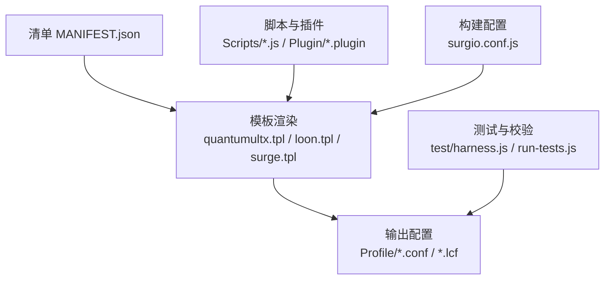
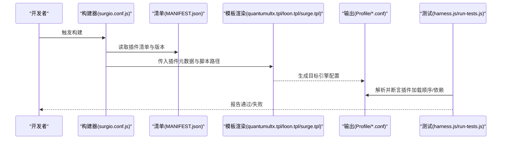
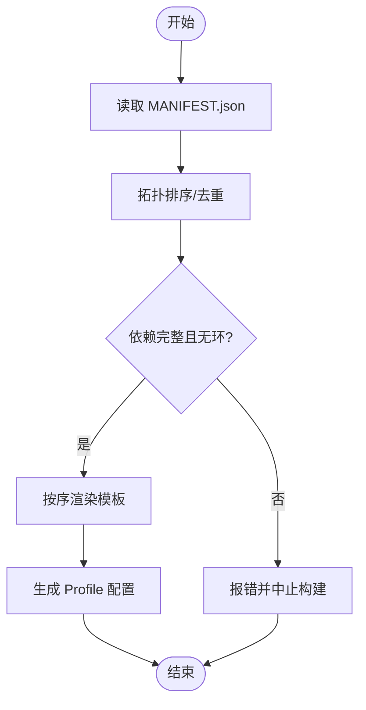
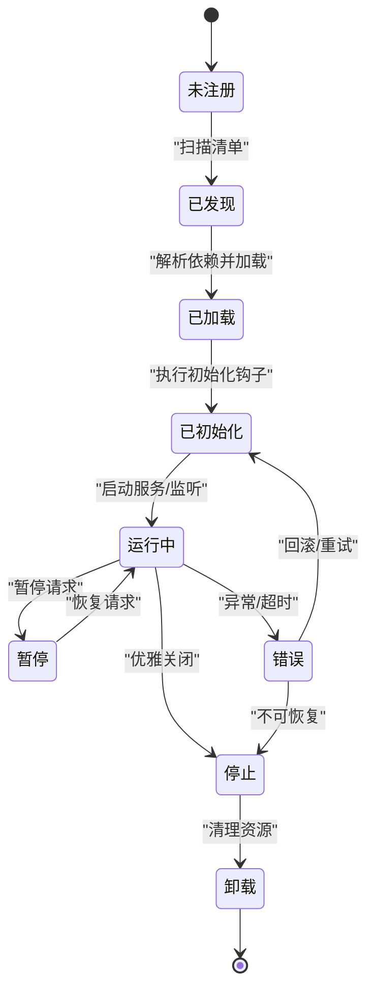
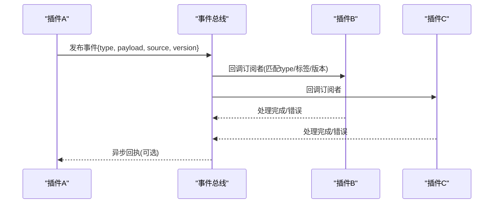
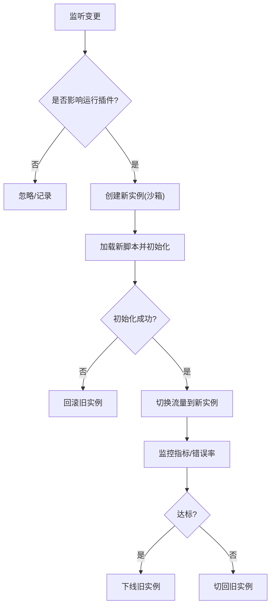
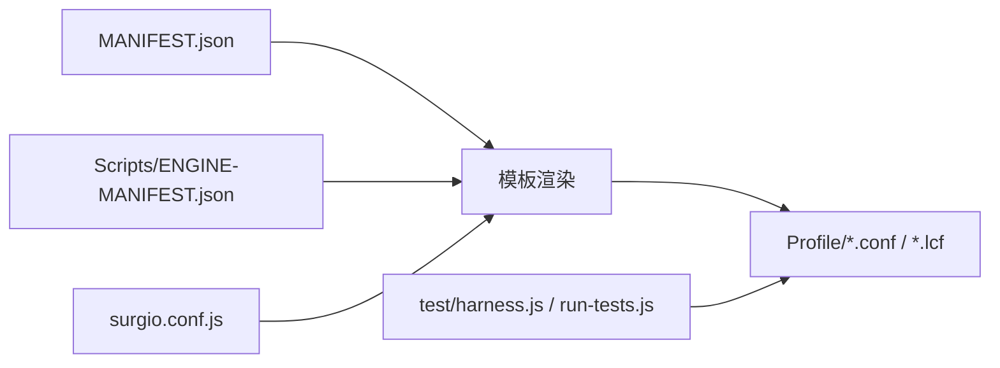

# 插件生命周期管理

<cite>
**本文引用的文件**   
- [README.md](file://README.md)
- [package.json](file://package.json)
- [surgio.conf.js](file://surgio.conf.js)
- [Mirrors/MANIFEST.json](file://Mirror/MANIFEST.json)
- [Scripts/ENGINE-MANIFEST.json](file://Scripts/ENGINE-MANIFEST.json)
- [template/quantumultx.tpl](file://template/quantumultx.tpl)
- [template/loon.tpl](file://template/loon.tpl)
- [template/surge.tpl](file://template/surge.tpl)
- [Profile/QX.conf](file://Profile/QX.conf)
- [Profile/Loon.lcf](file://Profile/Loon.lcf)
- [Profile/Surge.conf](file://Profile/Surge.conf)
- [test/harness.js](file://test/harness.js)
- [test/run-tests.js](file://test/run-tests.js)
</cite>

## 目录
1. [简介](#简介)
2. [项目结构](#项目结构)
3. [核心组件](#核心组件)
4. [架构总览](#架构总览)
5. [详细组件分析](#详细组件分析)
6. [依赖关系分析](#依赖关系分析)
7. [性能考量](#性能考量)
8. [故障排查指南](#故障排查指南)
9. [结论](#结论)
10. [附录](#附录)

## 简介
本文件围绕“插件生命周期管理”展开，结合仓库中的清单、模板与配置文件，系统性说明插件的加载顺序、依赖管理与版本控制机制；记录插件状态转换、错误恢复与资源清理流程；阐述插件间通信（事件总线）设计与消息传递协议；并给出热重载、动态更新与灰度发布的实现思路。同时提供生命周期监控、日志记录与性能分析的落地方法，帮助读者在现有工程基础上构建或扩展可靠的插件体系。

## 项目结构
该仓库采用“多引擎适配 + 清单驱动 + 模板生成”的组织方式：
- 插件定义与脚本：Plugin、Mirror、Scripts 等目录存放各平台插件与脚本。
- 清单与元数据：MANIFEST.json 用于描述插件集合、版本与依赖。
- 模板与配置：template/* 为不同代理引擎的模板；Profile/* 为最终生成的配置。
- 构建与测试：surgio.conf.js、test/* 负责校验与运行测试。

图表来源
- [Mirrors/MANIFEST.json](file://Mirror/MANIFEST.json)
- [template/quantumultx.tpl](file://template/quantumultx.tpl)
- [template/loon.tpl](file://template/loon.tpl)
- [template/surge.tpl](file://template/surge.tpl)
- [surgio.conf.js](file://surgio.conf.js)
- [Profile/QX.conf](file://Profile/QX.conf)
- [Profile/Loon.lcf](file://Profile/Loon.lcf)
- [Profile/Surge.conf](file://Profile/Surge.conf)
- [test/harness.js](file://test/harness.js)
- [test/run-tests.js](file://test/run-tests.js)

章节来源
- [README.md](file://README.md)
- [package.json](file://package.json)
- [surgio.conf.js](file://surgio.conf.js)
- [Mirrors/MANIFEST.json](file://Mirror/MANIFEST.json)
- [Scripts/ENGINE-MANIFEST.json](file://Scripts/ENGINE-MANIFEST.json)
- [template/quantumultx.tpl](file://template/quantumultx.tpl)
- [template/loon.tpl](file://template/loon.tpl)
- [template/surge.tpl](file://template/surge.tpl)
- [Profile/QX.conf](file://Profile/QX.conf)
- [Profile/Loon.lcf](file://Profile/Loon.lcf)
- [Profile/Surge.conf](file://Profile/Surge.conf)
- [test/harness.js](file://test/harness.js)
- [test/run-tests.js](file://test/run-tests.js)

## 核心组件
- 清单与版本控制
  - MANIFEST.json 集中声明插件集合、版本、来源与依赖，是加载顺序与版本控制的权威来源。
  - ENGINE-MANIFEST.json 针对脚本引擎的元数据，便于按引擎维度进行加载与隔离。
- 模板与配置生成
  - quantumultx.tpl、loon.tpl、surge.tpl 将清单与脚本映射为目标引擎的配置片段，确保插件在不同引擎下的行为一致。
  - Profile/* 为最终产物，供代理引擎直接消费。
- 构建与测试
  - surgio.conf.js 定义构建规则与插件扫描策略。
  - test/harness.js、run-tests.js 提供用例执行与断言框架，支撑插件加载与生命周期验证。

章节来源
- [Mirrors/MANIFEST.json](file://Mirror/MANIFEST.json)
- [Scripts/ENGINE-MANIFEST.json](file://Scripts/ENGINE-MANIFEST.json)
- [template/quantumultx.tpl](file://template/quantumultx.tpl)
- [template/loon.tpl](file://template/loon.tpl)
- [template/surge.tpl](file://template/surge.tpl)
- [Profile/QX.conf](file://Profile/QX.conf)
- [Profile/Loon.lcf](file://Profile/Loon.lcf)
- [Profile/Surge.conf](file://Profile/Surge.conf)
- [surgio.conf.js](file://surgio.conf.js)
- [test/harness.js](file://test/harness.js)
- [test/run-tests.js](file://test/run-tests.js)

## 架构总览
下图展示从清单到配置的端到端流程，以及测试与校验如何介入生命周期。

图表来源
- [surgio.conf.js](file://surgio.conf.js)
- [Mirrors/MANIFEST.json](file://Mirror/MANIFEST.json)
- [template/quantumultx.tpl](file://template/quantumultx.tpl)
- [template/loon.tpl](file://template/loon.tpl)
- [template/surge.tpl](file://template/surge.tpl)
- [Profile/QX.conf](file://Profile/QX.conf)
- [Profile/Loon.lcf](file://Profile/Loon.lcf)
- [Profile/Surge.conf](file://Profile/Surge.conf)
- [test/harness.js](file://test/harness.js)
- [test/run-tests.js](file://test/run-tests.js)

## 详细组件分析

### 清单驱动的加载顺序与依赖管理
- 加载顺序
  - 以 MANIFEST.json 中声明的顺序为准，构建器按序遍历并注入模板，保证依赖插件先于被依赖插件加载。
  - 若存在跨模块依赖，应在清单中标注依赖关系，构建阶段进行拓扑排序，避免循环依赖。
- 依赖管理
  - 使用显式依赖字段声明插件间的强依赖与弱依赖；构建时校验依赖完整性，缺失则阻断生成。
  - 对脚本级依赖（如公共库）在 ENGINE-MANIFEST.json 中统一声明，减少重复引入。
- 版本控制
  - 清单内维护插件版本号与来源地址；构建器可基于语义化版本进行兼容检查与锁定。
  - 支持按环境切换版本分支（如 dev/stable），通过条件编译或模板变量注入。

图表来源
- [Mirrors/MANIFEST.json](file://Mirror/MANIFEST.json)
- [Scripts/ENGINE-MANIFEST.json](file://Scripts/ENGINE-MANIFEST.json)
- [template/quantumultx.tpl](file://template/quantumultx.tpl)
- [template/loon.tpl](file://template/loon.tpl)
- [template/surge.tpl](file://template/surge.tpl)
- [surgio.conf.js](file://surgio.conf.js)

章节来源
- [Mirrors/MANIFEST.json](file://Mirror/MANIFEST.json)
- [Scripts/ENGINE-MANIFEST.json](file://Scripts/ENGINE-MANIFEST.json)
- [surgio.conf.js](file://surgio.conf.js)

### 模板与多引擎适配
- 模板职责
  - 将清单中的插件元数据转换为各引擎可用的配置片段，屏蔽差异。
  - 支持条件渲染（按开关、标签、环境）控制插件启用与加载顺序。
- 输出产物
  - Profile/QX.conf、Profile/Loon.lcf、Profile/Surge.conf 由模板渲染得到，可直接被对应引擎加载。
- 最佳实践
  - 模板中仅做格式转换与参数注入，业务逻辑集中在清单与脚本中。
  - 对引擎特有能力使用可选块包裹，避免不兼容。

章节来源
- [template/quantumultx.tpl](file://template/quantumultx.tpl)
- [template/loon.tpl](file://template/loon.tpl)
- [template/surge.tpl](file://template/surge.tpl)
- [Profile/QX.conf](file://Profile/QX.conf)
- [Profile/Loon.lcf](file://Profile/Loon.lcf)
- [Profile/Surge.conf](file://Profile/Surge.conf)

### 插件状态机与生命周期
- 状态定义
  - 未注册、已发现、已加载、已初始化、运行中、暂停、停止、卸载、错误。
- 关键流程
  - 加载：解析清单与脚本，建立依赖图，按序加载。
  - 初始化：执行初始化钩子，准备上下文与资源。
  - 运行：响应事件与请求，维持运行时状态。
  - 暂停/恢复：按需冻结与解冻，释放非关键资源。
  - 卸载：清理定时器、网络句柄、内存引用，释放外部资源。
  - 错误恢复：捕获异常，降级或回滚至上一稳定状态。
- 监控与日志
  - 在每个状态转换处打点，记录耗时与错误码；聚合上报以便分析。

[本图为概念性状态机，不直接映射具体源码文件]

### 插件间通信与事件总线
- 设计要点
  - 中心化事件总线：所有插件通过事件名订阅/发布，解耦调用方与被调用方。
  - 消息协议：定义统一的 payload 结构（类型、时间戳、来源插件、负载、版本）。
  - 路由与过滤：支持按标签、版本范围、环境筛选订阅者。
- 安全与稳定性
  - 限流与熔断：防止风暴式事件导致雪崩。
  - 幂等与去抖：同一事件多次触发需合并或忽略。
  - 审计与追踪：每个事件携带 traceId，便于链路追踪。
- 典型场景
  - 广告拦截插件向 UI 插件发送拦截统计事件。
  - 网络插件向通知插件发送流量告警事件。

[本图为概念性事件总线交互，不直接映射具体源码文件]

### 热重载、动态更新与灰度发布
- 热重载
  - 监听清单与脚本变更，增量更新受影响插件，保持运行态最小中断。
  - 支持沙箱隔离与快照回滚，失败自动回退。
- 动态更新
  - 远程拉取新版本清单与脚本，校验签名与哈希后替换。
  - 支持按用户分组或白名单下发。
- 灰度发布
  - 基于标签或比例分流，逐步放量；观察指标后全量或回滚。
  - 与事件总线联动，收集灰度期指标与错误率。

[本图为概念性热重载流程，不直接映射具体源码文件]

### 生命周期监控、日志与性能分析
- 监控
  - 采集状态转换次数、平均耗时、错误率、内存占用、事件吞吐。
  - 暴露健康检查接口，供编排系统探测。
- 日志
  - 结构化日志：包含插件ID、事件类型、耗时、堆栈摘要。
  - 分级输出：调试、信息、警告、错误，按插件隔离。
- 性能分析
  - 热点函数采样、慢查询定位、GC 与内存泄漏检测。
  - 与事件总线关联，形成调用链视图。

[本节为通用指导，不直接分析具体文件]

## 依赖关系分析
- 清单到模板再到配置的依赖链清晰，构建器串联各环节。
- 测试套件对输出配置进行解析与断言，保障加载顺序与依赖正确性。

图表来源
- [Mirrors/MANIFEST.json](file://Mirror/MANIFEST.json)
- [Scripts/ENGINE-MANIFEST.json](file://Scripts/ENGINE-MANIFEST.json)
- [surgio.conf.js](file://surgio.conf.js)
- [template/quantumultx.tpl](file://template/quantumultx.tpl)
- [template/loon.tpl](file://template/loon.tpl)
- [template/surge.tpl](file://template/surge.tpl)
- [Profile/QX.conf](file://Profile/QX.conf)
- [Profile/Loon.lcf](file://Profile/Loon.lcf)
- [Profile/Surge.conf](file://Profile/Surge.conf)
- [test/harness.js](file://test/harness.js)
- [test/run-tests.js](file://test/run-tests.js)

章节来源
- [Mirrors/MANIFEST.json](file://Mirror/MANIFEST.json)
- [Scripts/ENGINE-MANIFEST.json](file://Scripts/ENGINE-MANIFEST.json)
- [surgio.conf.js](file://surgio.conf.js)
- [template/quantumultx.tpl](file://template/quantumultx.tpl)
- [template/loon.tpl](file://template/loon.tpl)
- [template/surge.tpl](file://template/surge.tpl)
- [Profile/QX.conf](file://Profile/QX.conf)
- [Profile/Loon.lcf](file://Profile/Loon.lcf)
- [Profile/Surge.conf](file://Profile/Surge.conf)
- [test/harness.js](file://test/harness.js)
- [test/run-tests.js](file://test/run-tests.js)

## 性能考量
- 构建阶段
  - 并行渲染模板，缓存中间结果，减少重复计算。
  - 增量构建：仅重新生成受影响的配置片段。
- 运行阶段
  - 事件总线批量处理与背压控制，避免阻塞主线程。
  - 插件隔离：沙箱化执行，限制资源访问与内存上限。
- 存储与IO
  - 清单与脚本本地缓存，校验通过后生效。
  - 日志异步落盘，避免同步IO影响性能。

[本节为通用指导，不直接分析具体文件]

## 故障排查指南
- 常见问题
  - 依赖缺失或版本冲突：检查 MANIFEST.json 与 ENGINE-MANIFEST.json 的依赖声明与版本约束。
  - 模板渲染失败：核对模板语法与变量注入是否正确。
  - 插件初始化异常：查看插件日志与事件总线错误回调。
  - 热重载回滚：确认沙箱初始化与切换逻辑是否健壮。
- 诊断步骤
  - 启用调试日志，定位状态转换与错误堆栈。
  - 使用测试套件复现问题，缩小范围。
  - 对比健康检查指标，识别瓶颈与异常点。

章节来源
- [test/harness.js](file://test/harness.js)
- [test/run-tests.js](file://test/run-tests.js)

## 结论
通过清单驱动与模板渲染，本项目实现了跨引擎一致的插件加载与配置生成。结合事件总线与状态机，可构建高内聚、低耦合的插件生态。建议进一步完善依赖拓扑校验、灰度发布与监控告警，以提升系统的可靠性与可观测性。

[本节为总结性内容，不直接分析具体文件]

## 附录
- 术语
  - 清单：描述插件集合、版本与依赖的元数据文件。
  - 模板：将清单转换为目标引擎配置的模板文件。
  - 事件总线：插件间通信的中心化消息通道。
  - 灰度发布：分批次、可控地发布新版本以降低风险。
- 参考文件
  - 清单与脚本元数据：[Mirrors/MANIFEST.json](file://Mirror/MANIFEST.json)、[Scripts/ENGINE-MANIFEST.json](file://Scripts/ENGINE-MANIFEST.json)
  - 模板与输出：[template/quantumultx.tpl](file://template/quantumultx.tpl)、[template/loon.tpl](file://template/loon.tpl)、[template/surge.tpl](file://template/surge.tpl)、[Profile/QX.conf](file://Profile/QX.conf)、[Profile/Loon.lcf](file://Profile/Loon.lcf)、[Profile/Surge.conf](file://Profile/Surge.conf)
  - 构建与测试：[surgio.conf.js](file://surgio.conf.js)、[test/harness.js](file://test/harness.js)、[test/run-tests.js](file://test/run-tests.js)