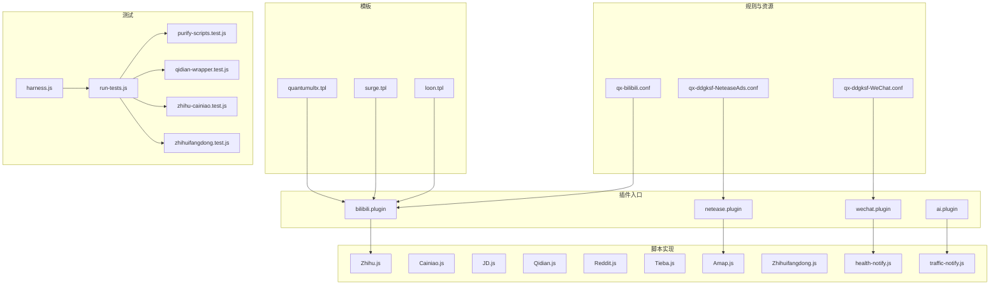
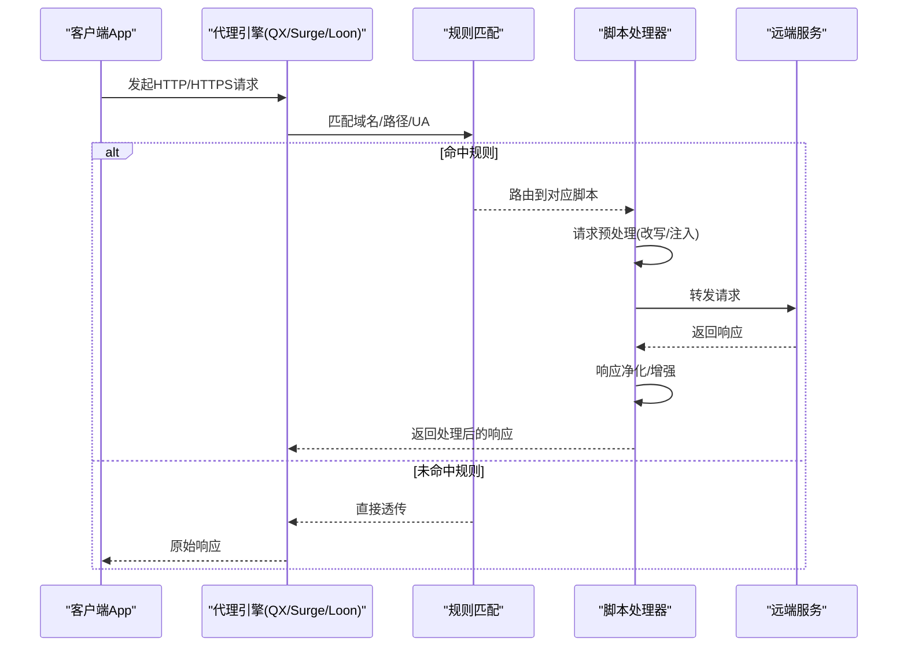
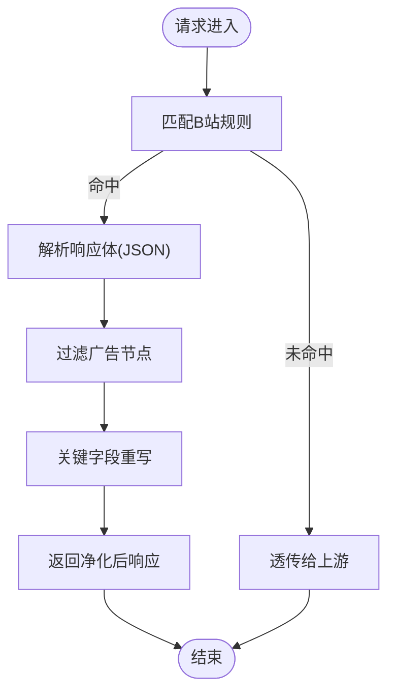
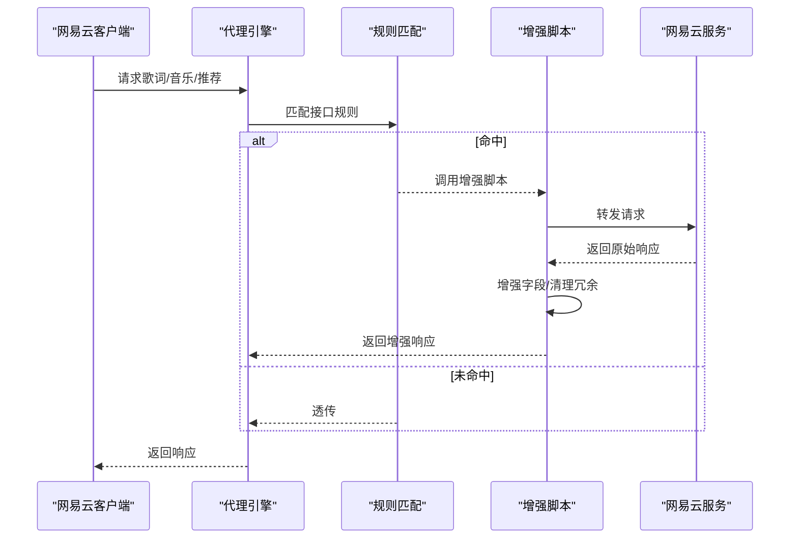
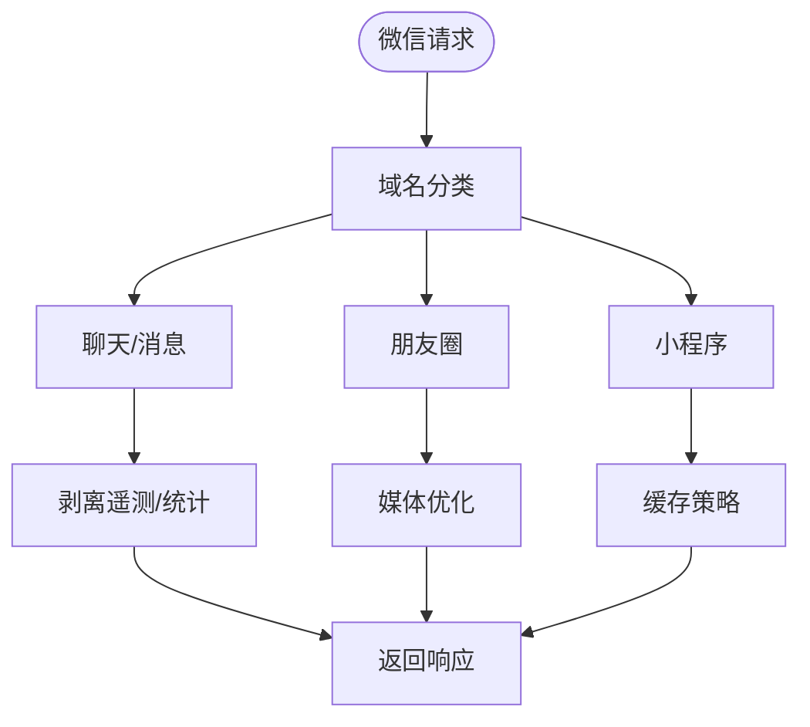
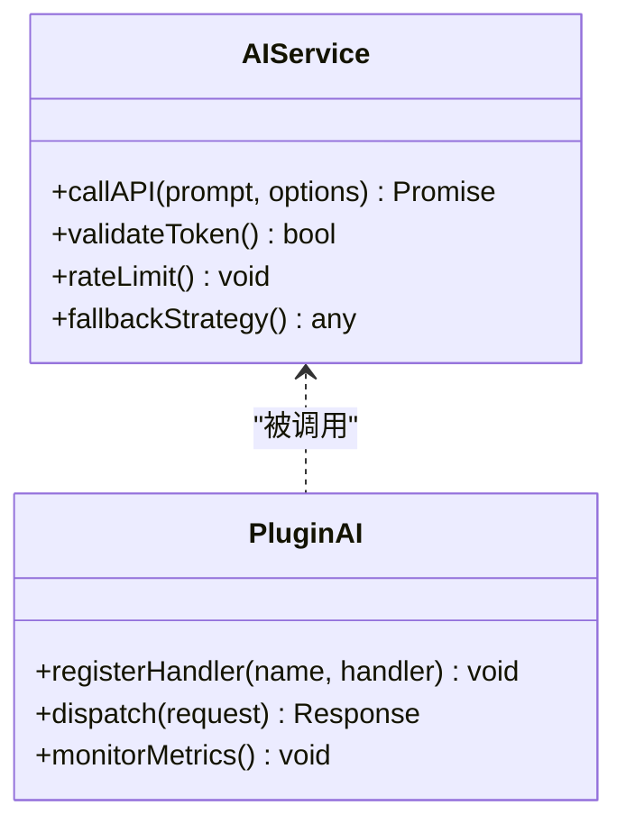
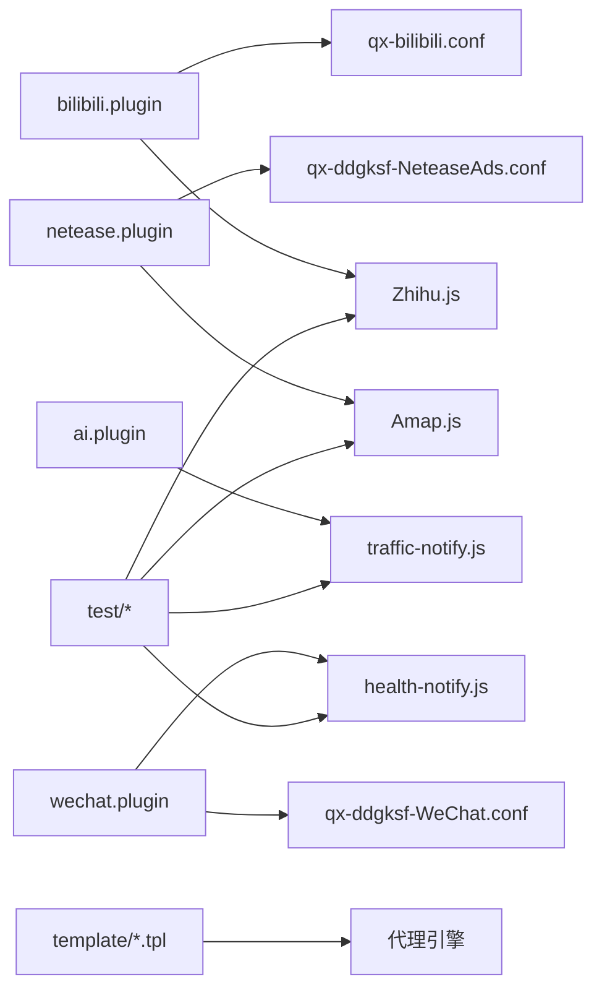

# 插件示例集合

<cite>
**本文档引用的文件**   
- [README.md](file://README.md)
- [package.json](file://package.json)
- [surgio.conf.js](file://surgio.conf.js)
- [Plugin/bilibili.plugin](file://Plugin/bilibili.plugin)
- [Plugin/netease.plugin](file://Plugin/netease.plugin)
- [Plugin/wechat.plugin](file://Plugin/wechat.plugin)
- [Plugin/ai.plugin](file://Plugin/ai.plugin)
- [Scripts/Amap.js](file://Scripts/Amap.js)
- [Scripts/Cainiao.js](file://Scripts/Cainiao.js)
- [Scripts/JD.js](file://Scripts/JD.js)
- [Scripts/Qidian.js](file://Scripts/Qidian.js)
- [Scripts/Reddit.js](file://Scripts/Reddit.js)
- [Scripts/Tieba.js](file://Scripts/Tieba.js)
- [Scripts/Zhihu.js](file://Scripts/Zhihu.js)
- [Scripts/Zhihuifangdong.js](file://Scripts/Zhihuifangdong.js)
- [Scripts/health-notify.js](file://Scripts/health-notify.js)
- [Scripts/traffic-notify.js](file://Scripts/traffic-notify.js)
- [Mirror/qx-bilibili.conf](file://Mirror/qx-bilibili.conf)
- [Mirror/qx-ddgksf-NeteaseAds.conf](file://Mirror/qx-ddgksf-NeteaseAds.conf)
- [Mirror/qx-ddgksf-WeChat.conf](file://Mirror/qx-ddgksf-WeChat.conf)
- [template/quantumultx.tpl](file://template/quantumultx.tpl)
- [template/surge.tpl](file://template/surge.tpl)
- [template/loon.tpl](file://template/loon.tpl)
- [test/harness.js](file://test/harness.js)
- [test/run-tests.js](file://test/run-tests.js)
- [test/cases/purify-scripts.test.js](file://test/cases/purify-scripts.test.js)
- [test/cases/qidian-wrapper.test.js](file://test/cases/qidian-wrapper.test.js)
- [test/cases/zhihu-cainiao.test.js](file://test/cases/zhihu-cainiao.test.js)
- [test/cases/zhihuifangdong.test.js](file://test/cases/zhihuifangdong.test.js)
</cite>

## 目录
1. [简介](#简介)
2. [项目结构](#项目结构)
3. [核心组件](#核心组件)
4. [架构总览](#架构总览)
5. [详细组件分析](#详细组件分析)
6. [依赖关系分析](#依赖关系分析)
7. [性能考量](#性能考量)
8. [故障排查指南](#故障排查指南)
9. [结论](#结论)
10. [附录](#附录)

## 简介
本仓库是一个面向网络增强与体验优化的“插件示例集合”，围绕 B 站去广告、网易云音乐增强、微信相关功能、AI 服务集成等主题，提供多平台（Quantumult X、Surge、Loon）的脚本与规则配置。每个插件以 .plugin 或 .js 的形式组织，配套测试用例、模板与构建工作流，便于快速复用、扩展与分发。

## 项目结构
仓库采用按“能力域”划分的模块化结构：
- Plugin：各应用域插件入口（如 bilibili、netease、wechat、ai 等）
- Scripts：具体脚本实现（JS），用于请求拦截、数据净化、通知等
- Mirror：第三方规则与资源（含 QX 规则集与 JS 工具）
- template：不同平台的模板（QX/Surge/Loon）
- test：统一测试框架与用例
- Profile：平台配置文件样例
- doc：文档与审计记录
- .github/workflows：CI/CD 流水线

图表来源
- [Plugin/bilibili.plugin](file://Plugin/bilibili.plugin)
- [Plugin/netease.plugin](file://Plugin/netease.plugin)
- [Plugin/wechat.plugin](file://Plugin/wechat.plugin)
- [Plugin/ai.plugin](file://Plugin/ai.plugin)
- [Scripts/Amap.js](file://Scripts/Amap.js)
- [Scripts/Cainiao.js](file://Scripts/Cainiao.js)
- [Scripts/JD.js](file://Scripts/JD.js)
- [Scripts/Qidian.js](file://Scripts/Qidian.js)
- [Scripts/Reddit.js](file://Scripts/Reddit.js)
- [Scripts/Tieba.js](file://Scripts/Tieba.js)
- [Scripts/Zhihu.js](file://Scripts/Zhihu.js)
- [Scripts/Zhihuifangdong.js](file://Scripts/Zhihuifangdong.js)
- [Scripts/health-notify.js](file://Scripts/health-notify.js)
- [Scripts/traffic-notify.js](file://Scripts/traffic-notify.js)
- [Mirror/qx-bilibili.conf](file://Mirror/qx-bilibili.conf)
- [Mirror/qx-ddgksf-NeteaseAds.conf](file://Mirror/qx-ddgksf-NeteaseAds.conf)
- [Mirror/qx-ddgksf-WeChat.conf](file://Mirror/qx-ddgksf-WeChat.conf)
- [template/quantumultx.tpl](file://template/quantumultx.tpl)
- [template/surge.tpl](file://template/surge.tpl)
- [template/loon.tpl](file://template/loon.tpl)
- [test/harness.js](file://test/harness.js)
- [test/run-tests.js](file://test/run-tests.js)
- [test/cases/purify-scripts.test.js](file://test/cases/purify-scripts.test.js)
- [test/cases/qidian-wrapper.test.js](file://test/cases/qidian-wrapper.test.js)
- [test/cases/zhihu-cainiao.test.js](file://test/cases/zhihu-cainiao.test.js)
- [test/cases/zhihuifangdong.test.js](file://test/cases/zhihuifangdong.test.js)

章节来源
- [README.md](file://README.md)
- [package.json](file://package.json)
- [surgio.conf.js](file://surgio.conf.js)

## 核心组件
- 插件入口（.plugin）：声明插件元信息、依赖脚本与规则、启用开关与版本信息，作为平台加载的统一入口。
- 脚本实现（.js）：针对具体 App 的请求/响应处理逻辑，包括去广告、数据净化、功能增强、通知上报等。
- 规则与资源（*.conf/*.list）：域名/IP 匹配、分流策略、UA/Host 改写等。
- 模板（*.tpl）：为不同平台生成最终配置，保证一致性与可移植性。
- 测试（test/*）：统一的测试运行器与用例，覆盖脚本净化、包装器、跨脚本协作等场景。

章节来源
- [Plugin/bilibili.plugin](file://Plugin/bilibili.plugin)
- [Plugin/netease.plugin](file://Plugin/netease.plugin)
- [Plugin/wechat.plugin](file://Plugin/wechat.plugin)
- [Plugin/ai.plugin](file://Plugin/ai.plugin)
- [Scripts/Amap.js](file://Scripts/Amap.js)
- [Scripts/Cainiao.js](file://Scripts/Cainiao.js)
- [Scripts/JD.js](file://Scripts/JD.js)
- [Scripts/Qidian.js](file://Scripts/Qidian.js)
- [Scripts/Reddit.js](file://Scripts/Reddit.js)
- [Scripts/Tieba.js](file://Scripts/Tieba.js)
- [Scripts/Zhihu.js](file://Scripts/Zhihu.js)
- [Scripts/Zhihuifangdong.js](file://Scripts/Zhihuifangdong.js)
- [Scripts/health-notify.js](file://Scripts/health-notify.js)
- [Scripts/traffic-notify.js](file://Scripts/traffic-notify.js)
- [Mirror/qx-bilibili.conf](file://Mirror/qx-bilibili.conf)
- [Mirror/qx-ddgksf-NeteaseAds.conf](file://Mirror/qx-ddgksf-NeteaseAds.conf)
- [Mirror/qx-ddgksf-WeChat.conf](file://Mirror/qx-ddgksf-WeChat.conf)
- [template/quantumultx.tpl](file://template/quantumultx.tpl)
- [template/surge.tpl](file://template/surge.tpl)
- [template/loon.tpl](file://template/loon.tpl)
- [test/harness.js](file://test/harness.js)
- [test/run-tests.js](file://test/run-tests.js)
- [test/cases/purify-scripts.test.js](file://test/cases/purify-scripts.test.js)
- [test/cases/qidian-wrapper.test.js](file://test/cases/qidian-wrapper.test.js)
- [test/cases/zhihu-cainiao.test.js](file://test/cases/zhihu-cainiao.test.js)
- [test/cases/zhihuifangdong.test.js](file://test/cases/zhihuifangdong.test.js)

## 架构总览
整体采用“插件入口 + 脚本实现 + 规则资源 + 平台模板”的分层架构。插件负责声明与装配，脚本负责业务逻辑，规则负责流量治理，模板负责跨平台输出。测试贯穿开发流程，保障稳定性。

图表来源
- [Mirror/qx-bilibili.conf](file://Mirror/qx-bilibili.conf)
- [Mirror/qx-ddgksf-NeteaseAds.conf](file://Mirror/qx-ddgksf-NeteaseAds.conf)
- [Mirror/qx-ddgksf-WeChat.conf](file://Mirror/qx-ddgksf-WeChat.conf)
- [template/quantumultx.tpl](file://template/quantumultx.tpl)
- [template/surge.tpl](file://template/surge.tpl)
- [template/loon.tpl](file://template/loon.tpl)

## 详细组件分析

### B 站去广告插件（bilibili）
- 设计思路：通过规则命中 B 站广告域名与接口，交由脚本对响应进行净化，移除冗余字段与广告片段，提升加载速度与观看体验。
- 实现要点：
  - 规则层：基于域名/路径的正则匹配，区分视频、动态、直播等场景。
  - 脚本层：解析 JSON 响应，过滤广告节点，必要时重写关键键值。
  - 兼容层：适配不同版本的 API 结构与字段变化。
- 扩展点：新增广告位类型、增加 A/B 实验开关、接入灰度策略。

图表来源
- [Mirror/qx-bilibili.conf](file://Mirror/qx-bilibili.conf)
- [Plugin/bilibili.plugin](file://Plugin/bilibili.plugin)
- [Scripts/Zhihu.js](file://Scripts/Zhihu.js)

章节来源
- [Mirror/qx-bilibili.conf](file://Mirror/qx-bilibili.conf)
- [Plugin/bilibili.plugin](file://Plugin/bilibili.plugin)

### 网易云音乐增强插件（netease）
- 设计思路：在保留原功能基础上，增强音质选择、歌词展示、播放列表优化等体验；同时屏蔽不必要的统计与广告请求。
- 实现要点：
  - 规则层：拦截音乐下载、歌词、推荐等接口。
  - 脚本层：增强响应数据结构，补充缺失字段，清理无用日志。
  - 兼容性：针对不同地区与版本做差异化处理。
- 扩展点：新增音源切换、离线缓存策略、个性化推荐权重调整。

图表来源
- [Mirror/qx-ddgksf-NeteaseAds.conf](file://Mirror/qx-ddgksf-NeteaseAds.conf)
- [Plugin/netease.plugin](file://Plugin/netease.plugin)

章节来源
- [Mirror/qx-ddgksf-NeteaseAds.conf](file://Mirror/qx-ddgksf-NeteaseAds.conf)
- [Plugin/netease.plugin](file://Plugin/netease.plugin)

### 微信相关功能插件（wechat）
- 设计思路：针对微信生态的隐私保护与功能增强，如屏蔽遥测、精简不必要请求、优化图片/视频加载。
- 实现要点：
  - 规则层：识别微信域名与子域，区分聊天、朋友圈、小程序等场景。
  - 脚本层：按需剥离遥测与广告，压缩或替换媒体资源。
  - 安全：避免破坏登录态与消息完整性。
- 扩展点：新增小程序加速、朋友圈图片优化、企业微信支持。

图表来源
- [Mirror/qx-ddgksf-WeChat.conf](file://Mirror/qx-ddgksf-WeChat.conf)
- [Plugin/wechat.plugin](file://Plugin/wechat.plugin)
- [Scripts/health-notify.js](file://Scripts/health-notify.js)

章节来源
- [Mirror/qx-ddgksf-WeChat.conf](file://Mirror/qx-ddgksf-WeChat.conf)
- [Plugin/wechat.plugin](file://Plugin/wechat.plugin)

### AI 服务集成插件（ai）
- 设计思路：将 AI 能力（如智能搜索、内容摘要、翻译）以插件形式集成，供其他脚本或用户调用。
- 实现要点：
  - 统一接口：定义标准化的输入输出格式。
  - 鉴权与限流：支持 Token 管理与速率限制。
  - 错误回退：当 AI 服务不可用时降级为本地规则或缓存。
- 扩展点：多模型路由、结果缓存、异步任务队列。

图表来源
- [Plugin/ai.plugin](file://Plugin/ai.plugin)
- [Scripts/traffic-notify.js](file://Scripts/traffic-notify.js)

章节来源
- [Plugin/ai.plugin](file://Plugin/ai.plugin)

### 其他脚本示例（地图、电商、社区等）
- 地图（Amap.js）：定位与路线优化，屏蔽广告与遥测。
- 电商（JD.js）：价格追踪、优惠券聚合、活动页净化。
- 社区（Reddit.js、Tieba.js、Zhihu.js）：内容净化、评论折叠、反爬绕过。
- 工具（Cainiao.js、Zhihuifangdong.js）：物流查询增强、租房信息清洗。
- 通知（health-notify.js、traffic-notify.js）：健康检查与流量统计上报。

章节来源
- [Scripts/Amap.js](file://Scripts/Amap.js)
- [Scripts/Cainiao.js](file://Scripts/Cainiao.js)
- [Scripts/JD.js](file://Scripts/JD.js)
- [Scripts/Qidian.js](file://Scripts/Qidian.js)
- [Scripts/Reddit.js](file://Scripts/Reddit.js)
- [Scripts/Tieba.js](file://Scripts/Tieba.js)
- [Scripts/Zhihu.js](file://Scripts/Zhihu.js)
- [Scripts/Zhihuifangdong.js](file://Scripts/Zhihuifangdong.js)
- [Scripts/health-notify.js](file://Scripts/health-notify.js)
- [Scripts/traffic-notify.js](file://Scripts/traffic-notify.js)

## 依赖关系分析
- 插件与脚本：.plugin 声明依赖的 .js 脚本与规则，形成“入口-实现”的松耦合关系。
- 规则与脚本：规则决定脚本触发时机与范围，脚本专注数据处理。
- 模板与平台：模板抽象平台差异，统一生成最终配置。
- 测试与脚本：测试用例覆盖脚本净化、包装器、跨脚本协作等关键路径。

图表来源
- [Plugin/bilibili.plugin](file://Plugin/bilibili.plugin)
- [Plugin/netease.plugin](file://Plugin/netease.plugin)
- [Plugin/wechat.plugin](file://Plugin/wechat.plugin)
- [Plugin/ai.plugin](file://Plugin/ai.plugin)
- [Mirror/qx-bilibili.conf](file://Mirror/qx-bilibili.conf)
- [Mirror/qx-ddgksf-NeteaseAds.conf](file://Mirror/qx-ddgksf-NeteaseAds.conf)
- [Mirror/qx-ddgksf-WeChat.conf](file://Mirror/qx-ddgksf-WeChat.conf)
- [template/quantumultx.tpl](file://template/quantumultx.tpl)
- [template/surge.tpl](file://template/surge.tpl)
- [template/loon.tpl](file://template/loon.tpl)
- [test/harness.js](file://test/harness.js)
- [test/run-tests.js](file://test/run-tests.js)
- [test/cases/purify-scripts.test.js](file://test/cases/purify-scripts.test.js)
- [test/cases/qidian-wrapper.test.js](file://test/cases/qidian-wrapper.test.js)
- [test/cases/zhihu-cainiao.test.js](file://test/cases/zhihu-cainiao.test.js)
- [test/cases/zhihuifangdong.test.js](file://test/cases/zhihuifangdong.test.js)

章节来源
- [surgio.conf.js](file://surgio.conf.js)
- [package.json](file://package.json)

## 性能考量
- 规则粒度：尽量精确匹配域名与路径，减少误命中导致的脚本开销。
- 脚本效率：避免频繁正则与深度递归，优先使用哈希查找与增量更新。
- 缓存策略：对静态资源与热点数据实施本地缓存，降低重复请求。
- 并发控制：对 AI 服务等外部调用进行限流与重试，防止雪崩。
- 内存占用：及时释放临时对象，避免大对象常驻内存。

[本节为通用指导，不直接分析具体文件]

## 故障排查指南
- 常见问题
  - 规则未命中：检查域名/路径正则是否覆盖目标接口。
  - 脚本报错：查看控制台日志，确认 JSON 结构与字段变更。
  - 平台兼容：核对模板与引擎版本差异。
  - 权限问题：确认 HTTPS 解密与证书信任。
- 调试技巧
  - 开启详细日志，定位请求链路。
  - 使用最小化规则集复现问题。
  - 隔离脚本，逐步缩小范围。
- 测试验证
  - 运行测试套件，确保净化逻辑稳定。
  - 模拟异常响应，验证回退策略。

章节来源
- [test/harness.js](file://test/harness.js)
- [test/run-tests.js](file://test/run-tests.js)
- [test/cases/purify-scripts.test.js](file://test/cases/purify-scripts.test.js)
- [test/cases/qidian-wrapper.test.js](file://test/cases/qidian-wrapper.test.js)
- [test/cases/zhihu-cainiao.test.js](file://test/cases/zhihu-cainiao.test.js)
- [test/cases/zhihuifangdong.test.js](file://test/cases/zhihuifangdong.test.js)

## 结论
本插件集合以清晰的模块划分与完善的测试体系，提供了从 B 站去广告、网易云增强、微信优化到 AI 集成的完整示例。通过规则与脚本解耦、模板化输出与 CI/CD 支撑，开发者可快速复用并扩展新能力，满足多样化场景需求。

[本节为总结性内容，不直接分析具体文件]

## 附录
- 打包与分发
  - 使用模板生成多平台配置，确保一致性。
  - 版本号与变更日志随插件发布，便于回溯。
- 版本管理
  - 语义化版本控制，标注兼容矩阵。
  - 灰度发布与回滚策略。
- 最佳实践
  - 单一职责：每个插件聚焦一个领域。
  - 可观测性：埋点与指标上报。
  - 安全性：最小权限与敏感信息脱敏。

[本节为通用指导，不直接分析具体文件]