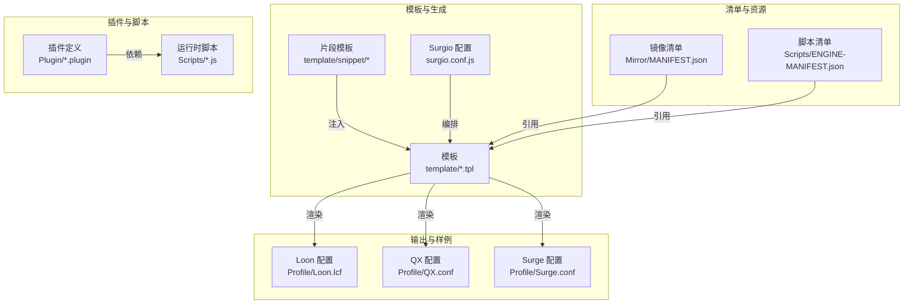
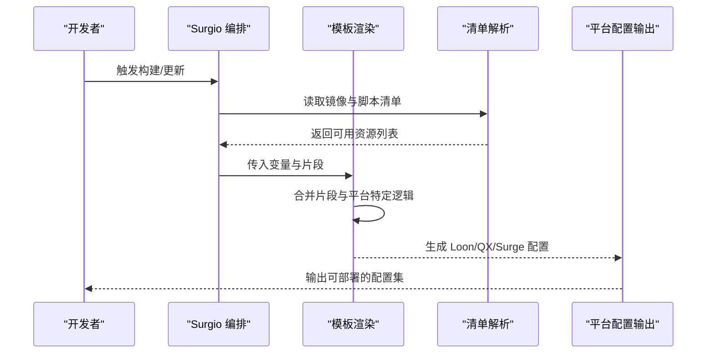
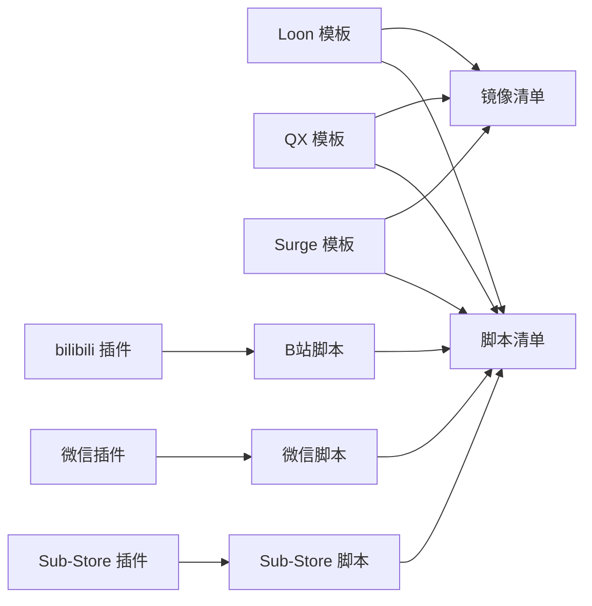

# 插件配置系统

<cite>
**本文档引用的文件**
- [README.md](file://README.md)
- [surgio.conf.js](file://surgio.conf.js)
- [template/loon.tpl](file://template/loon.tpl)
- [template/quantumultx.tpl](file://template/quantumultx.tpl)
- [template/surge.tpl](file://template/surge.tpl)
- [Profile/Loon.lcf](file://Profile/Loon.lcf)
- [Profile/QX.conf](file://Profile/QX.conf)
- [Profile/Surge.conf](file://Profile/Surge.conf)
- [Mirror/MANIFEST.json](file://Mirror/MANIFEST.json)
- [Scripts/ENGINE-MANIFEST.json](file://Scripts/ENGINE-MANIFEST.json)
- [plugin/bilibili.plugin](file://Plugin/bilibili.plugin)
- [plugin/wechat.plugin](file://Plugin/wechat.plugin)
- [plugin/sub-store.plugin](file://Plugin/sub-store.plugin)
- [template/snippet/ai-services.qx](file://template/snippet/ai-services.qx)
- [template/snippet/bank-ad-reject.qx](file://template/snippet/bank-ad-reject.qx)
- [template/snippet/developer.qx](file://template/snippet/developer.qx)
- [template/snippet/social.qx](file://template/snippet/social.qx)
- [template/snippet/streaming.qx](file://template/snippet/streaming.qx)
- [test/cases/purify-scripts.test.js](file://test/cases/purify-scripts.test.js)
- [test/harness.js](file://test/harness.js)
- [test/run-tests.js](file://test/run-tests.js)
</cite>

## 目录
1. [简介](#简介)
2. [项目结构](#项目结构)
3. [核心组件](#核心组件)
4. [架构总览](#架构总览)
5. [详细组件分析](#详细组件分析)
6. [依赖关系分析](#依赖关系分析)
7. [性能考虑](#性能考虑)
8. [故障排除指南](#故障排除指南)
9. [结论](#结论)
10. [附录](#附录)

## 简介
本文件面向“插件配置系统”的完整文档，覆盖以下目标：
- 插件配置文件格式、参数定义与默认值设置
- 多平台（Loon、Quantumult X、Surge）配置语法差异与兼容性处理
- 配置验证机制、环境变量支持与动态配置更新
- 配置模板使用方法与自定义最佳实践
- 常见配置场景示例与故障排除

本仓库采用“模板 + 清单 + 脚本 + 规则”的组合方式，为 Loon、Quantumult X、Surge 三大代理客户端提供统一的插件与规则管理能力。通过模板化生成与清单驱动，实现跨平台一致性与可维护性。

## 项目结构
整体结构围绕“模板生成、清单管理、脚本与规则、测试与校验”四大方向组织：
- template：各平台模板与片段模板，用于生成最终配置文件
- Profile：已生成的平台配置文件样例
- Scripts：运行时脚本与引擎清单
- Mirror：镜像资源与清单
- Plugin：插件定义（不同平台后缀）
- test：测试用例与运行器
- surgio.conf.js：Surgio 构建配置，统一编排规则与脚本

图表来源
- [template/loon.tpl](file://template/loon.tpl)
- [template/quantumultx.tpl](file://template/quantumultx.tpl)
- [template/surge.tpl](file://template/surge.tpl)
- [surgio.conf.js](file://surgio.conf.js)
- [Mirror/MANIFEST.json](file://Mirror/MANIFEST.json)
- [Scripts/ENGINE-MANIFEST.json](file://Scripts/ENGINE-MANIFEST.json)
- [Profile/Loon.lcf](file://Profile/Loon.lcf)
- [Profile/QX.conf](file://Profile/QX.conf)
- [Profile/Surge.conf](file://Profile/Surge.conf)

章节来源
- [README.md](file://README.md)
- [surgio.conf.js](file://surgio.conf.js)

## 核心组件
- 模板系统
  - 平台模板：Loon、Quantumult X、Surge 各自模板负责生成对应平台的配置文件
  - 片段模板：按功能域（如 AI、银行广告拦截、开发者、社交、流媒体）提供可插拔片段
- 清单系统
  - 镜像清单：集中管理镜像资源与版本
  - 脚本清单：声明脚本引擎与可用脚本集合
- 插件定义
  - 以 .plugin 结尾的文件描述插件元数据与依赖
- 构建与编排
  - Surgio 配置统一编排规则、脚本与模板，输出多平台配置

章节来源
- [template/loon.tpl](file://template/loon.tpl)
- [template/quantumultx.tpl](file://template/quantumultx.tpl)
- [template/surge.tpl](file://template/surge.tpl)
- [Mirror/MANIFEST.json](file://Mirror/MANIFEST.json)
- [Scripts/ENGINE-MANIFEST.json](file://Scripts/ENGINE-MANIFEST.json)
- [Plugin/bilibili.plugin](file://Plugin/bilibili.plugin)
- [Plugin/wechat.plugin](file://Plugin/wechat.plugin)
- [Plugin/sub-store.plugin](file://Plugin/sub-store.plugin)

## 架构总览
下图展示从模板与清单到多平台配置的生成流程，以及插件与脚本的依赖关系。

图表来源
- [surgio.conf.js](file://surgio.conf.js)
- [template/loon.tpl](file://template/loon.tpl)
- [template/quantumultx.tpl](file://template/quantumultx.tpl)
- [template/surge.tpl](file://template/surge.tpl)
- [Mirror/MANIFEST.json](file://Mirror/MANIFEST.json)
- [Scripts/ENGINE-MANIFEST.json](file://Scripts/ENGINE-MANIFEST.json)

## 详细组件分析

### 模板系统与片段模板
- 平台模板职责
  - 定义各平台头部、全局开关、模块引入、规则与脚本挂载点
  - 支持条件分支与变量替换，适配不同平台特性
- 片段模板
  - 按功能域拆分，便于按需启用或禁用
  - 提供 .qx 与 .tpl 两种形式，分别用于 QX 直接引用与模板注入
- 使用建议
  - 新增功能优先以片段形式提供，避免修改主模板
  - 保持片段内聚，减少跨片段耦合

章节来源
- [template/loon.tpl](file://template/loon.tpl)
- [template/quantumultx.tpl](file://template/quantumultx.tpl)
- [template/surge.tpl](file://template/surge.tpl)
- [template/snippet/ai-services.qx](file://template/snippet/ai-services.qx)
- [template/snippet/bank-ad-reject.qx](file://template/snippet/bank-ad-reject.qx)
- [template/snippet/developer.qx](file://template/snippet/developer.qx)
- [template/snippet/social.qx](file://template/snippet/social.qx)
- [template/snippet/streaming.qx](file://template/snippet/streaming.qx)

### 清单系统与资源管理
- 镜像清单
  - 集中管理镜像地址、版本与校验信息
  - 供模板渲染时注入，确保资源一致性
- 脚本清单
  - 声明脚本引擎能力与脚本集合
  - 控制脚本加载顺序与依赖关系

章节来源
- [Mirror/MANIFEST.json](file://Mirror/MANIFEST.json)
- [Scripts/ENGINE-MANIFEST.json](file://Scripts/ENGINE-MANIFEST.json)

### 插件定义与依赖
- 插件文件格式
  - 以 .plugin 结尾，包含插件名称、版本、依赖脚本与平台兼容信息
- 依赖管理
  - 插件可声明对脚本或外部资源的依赖
  - 构建阶段根据依赖解析并注入到模板

章节来源
- [Plugin/bilibili.plugin](file://Plugin/bilibili.plugin)
- [Plugin/wechat.plugin](file://Plugin/wechat.plugin)
- [Plugin/sub-store.plugin](file://Plugin/sub-store.plugin)

### 构建编排与多平台输出
- Surgio 编排
  - 统一入口，协调模板、清单与插件
  - 输出 Loon、QX、Surge 三套配置
- 平台差异处理
  - 在模板层进行条件判断与语法转换
  - 保证同一份源在不同平台下的等价行为

章节来源
- [surgio.conf.js](file://surgio.conf.js)
- [Profile/Loon.lcf](file://Profile/Loon.lcf)
- [Profile/QX.conf](file://Profile/QX.conf)
- [Profile/Surge.conf](file://Profile/Surge.conf)

### 配置验证与测试
- 验证机制
  - 通过测试用例校验脚本净化与插件集成
  - 运行器统一执行测试并汇总结果
- 测试范围
  - 脚本净化、插件包装、环境隔离等

章节来源
- [test/cases/purify-scripts.test.js](file://test/cases/purify-scripts.test.js)
- [test/harness.js](file://test/harness.js)
- [test/run-tests.js](file://test/run-tests.js)

## 依赖关系分析
下图展示模板、清单、插件与脚本之间的依赖关系。

图表来源
- [template/loon.tpl](file://template/loon.tpl)
- [template/quantumultx.tpl](file://template/quantumultx.tpl)
- [template/surge.tpl](file://template/surge.tpl)
- [Mirror/MANIFEST.json](file://Mirror/MANIFEST.json)
- [Scripts/ENGINE-MANIFEST.json](file://Scripts/ENGINE-MANIFEST.json)
- [Plugin/bilibili.plugin](file://Plugin/bilibili.plugin)
- [Plugin/wechat.plugin](file://Plugin/wechat.plugin)
- [Plugin/sub-store.plugin](file://Plugin/sub-store.plugin)

章节来源
- [surgio.conf.js](file://surgio.conf.js)

## 性能考虑
- 模板渲染
  - 尽量将稳定内容放入片段，减少每次渲染的计算量
  - 使用条件分支避免不必要的模块加载
- 清单解析
  - 缓存清单结果，避免重复 IO
  - 增量更新仅处理变更的资源
- 脚本加载
  - 控制脚本数量与大小，按需加载
  - 合理划分脚本职责，降低运行时开销

[本节为通用指导，不直接分析具体文件]

## 故障排除指南
- 常见问题定位
  - 检查模板变量是否正确注入
  - 确认清单中资源路径与版本是否有效
  - 核对插件依赖是否满足
- 验证与调试
  - 运行测试套件，查看失败用例日志
  - 逐步禁用片段，缩小问题范围
- 回滚策略
  - 保留历史配置快照，快速回退
  - 使用清单版本锁定，避免上游变更影响

章节来源
- [test/cases/purify-scripts.test.js](file://test/cases/purify-scripts.test.js)
- [test/harness.js](file://test/harness.js)
- [test/run-tests.js](file://test/run-tests.js)

## 结论
本插件配置系统通过模板化与清单驱动，实现了 Loon、Quantumult X、Surge 的统一管理与多平台兼容。借助片段化与插件化设计，用户可按需组合功能，提升可维护性与扩展性。配合测试与验证机制，保障配置质量与稳定性。

[本节为总结，不直接分析具体文件]

## 附录
- 多平台配置语法差异要点
  - Loon：关注 .lcf 结构与模块声明
  - Quantumult X：关注 .conf 语法与脚本引用
  - Surge：关注 .conf 与规则段落的写法
- 环境变量与动态更新
  - 在模板层注入环境变量，控制功能开关与资源地址
  - 结合清单版本与远程资源，实现动态更新
- 最佳实践
  - 新增功能优先以片段形式提供
  - 保持插件与脚本的最小依赖
  - 使用清单锁定版本，确保一致性

[本节为概念性说明，不直接分析具体文件]