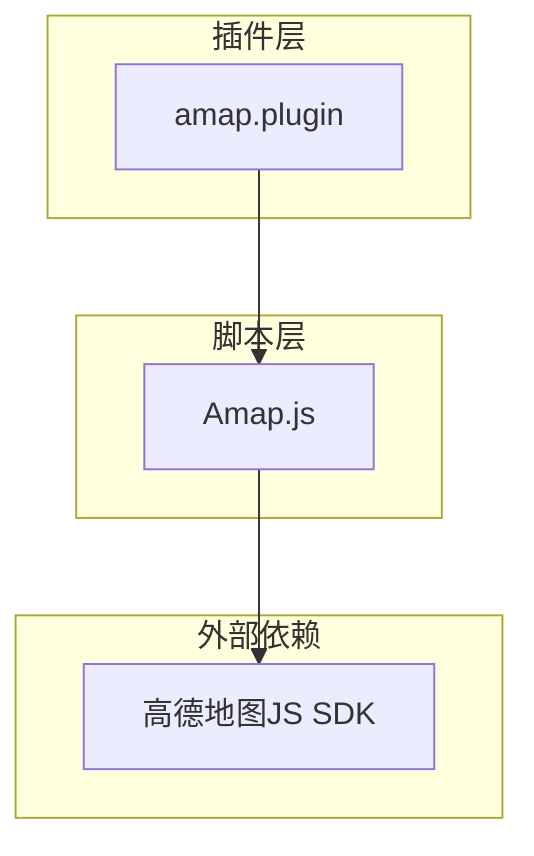
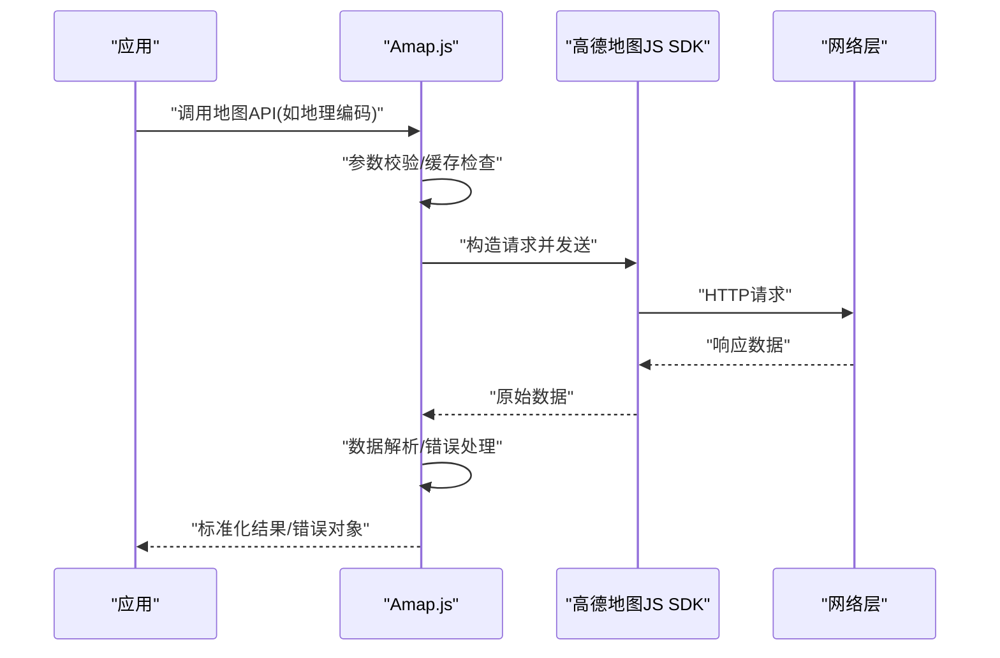
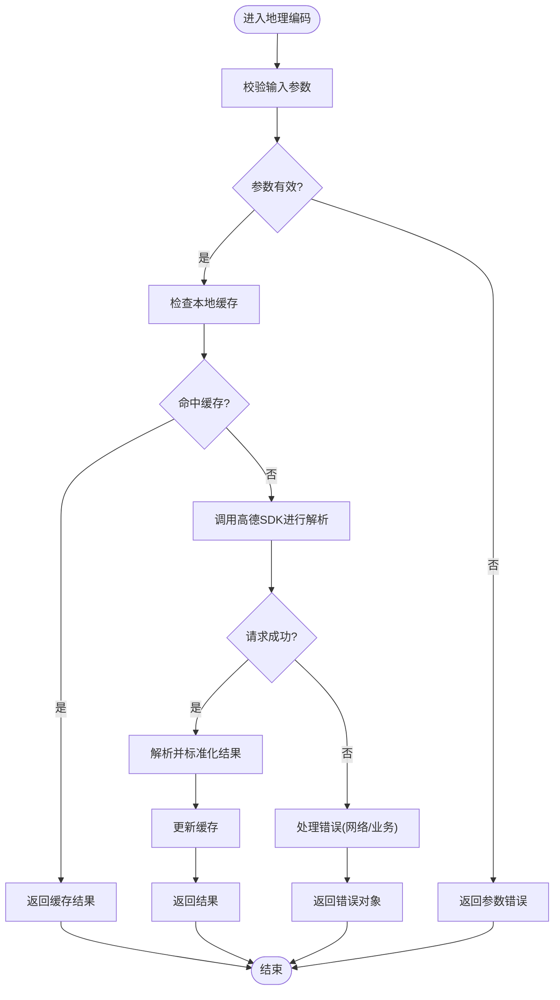
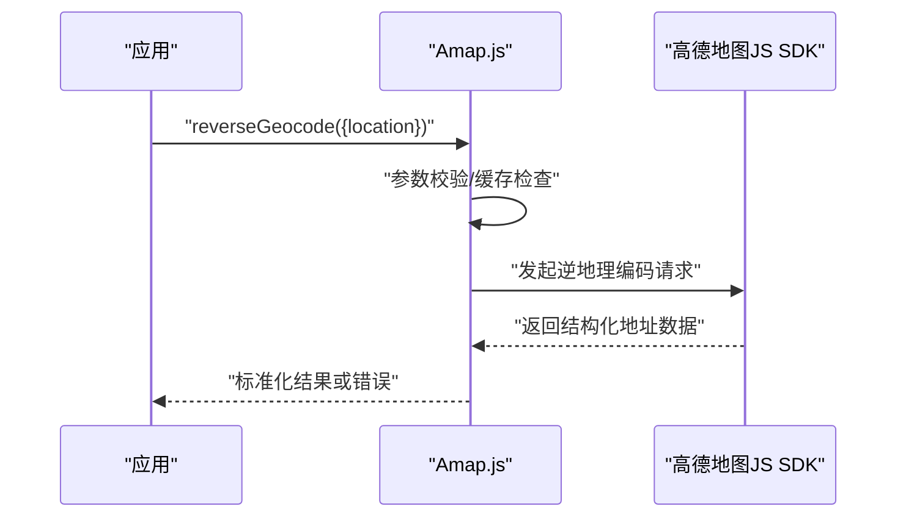
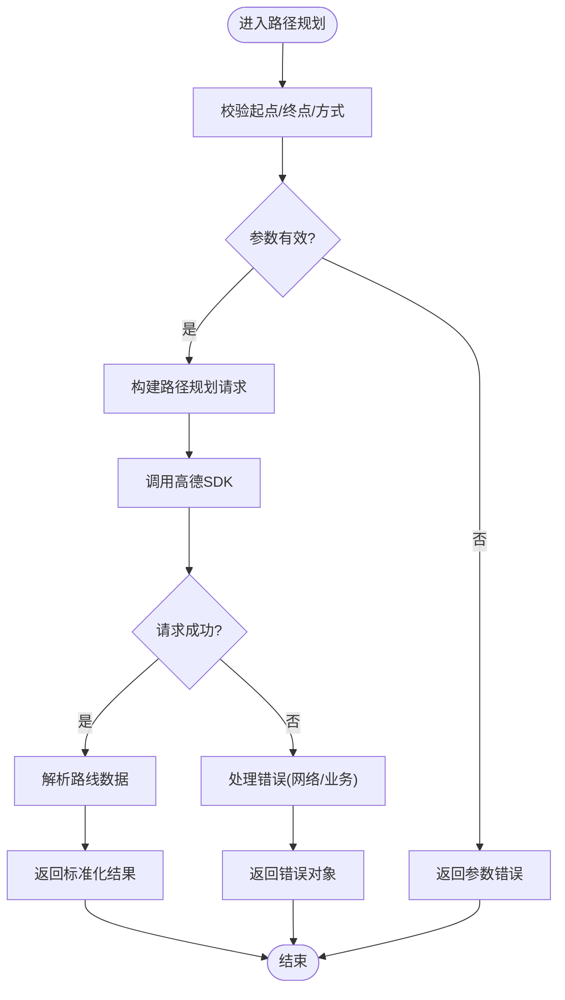
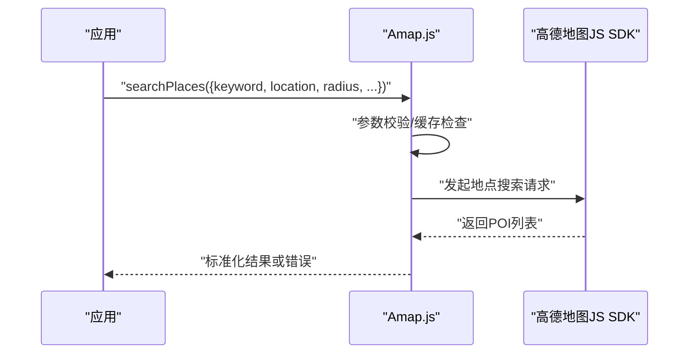
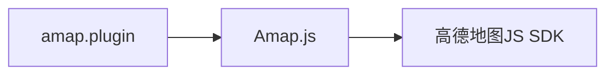

# 地图服务API

<cite>
**本文档引用的文件**   
- [Amap.js](file://Scripts/Amap.js)
- [amap.plugin](file://Plugin/amap.plugin)
- [README.md](file://README.md)
</cite>

## 目录
1. [简介](#简介)
2. [项目结构](#项目结构)
3. [核心组件](#核心组件)
4. [架构总览](#架构总览)
5. [详细组件分析](#详细组件分析)
6. [依赖关系分析](#依赖关系分析)
7. [性能考虑](#性能考虑)
8. [故障排查指南](#故障排查指南)
9. [结论](#结论)
10. [附录](#附录)

## 简介
本文件为“地图服务API”的详细技术文档，聚焦于 Amap.js 中实现的地图相关接口，包括地理编码、逆地理编码、路径规划、地点搜索等。文档将说明各接口的参数类型、返回值格式与错误处理机制，并提供调用示例（以代码片段路径替代具体代码内容），解释与高德地图SDK的集成方式以及性能优化建议。

## 项目结构
本项目采用脚本化插件模式组织地图能力：
- Scripts/Amap.js：地图服务脚本实现，封装对高德地图JS API的调用，提供统一的JavaScript接口。
- Plugin/amap.plugin：适配/注入配置或运行时环境，用于在宿主环境中启用地图脚本。
- README.md：项目总体说明与使用说明。

图表来源 
- [Amap.js](file://Scripts/Amap.js)
- [amap.plugin](file://Plugin/amap.plugin)

章节来源
- [README.md](file://README.md)

## 核心组件
- 地理编码（地址→坐标）
- 逆地理编码（坐标→地址）
- 路径规划（驾车/公交/步行/骑行）
- 地点搜索（关键字/周边/范围）

上述功能由 Amap.js 统一暴露，内部通过高德地图JS SDK提供的Web服务或地图API完成数据获取与渲染。

章节来源
- [Amap.js](file://Scripts/Amap.js)

## 架构总览
整体调用链路如下：应用侧调用 Amap.js 暴露的方法；Amap.js 负责参数校验、请求构建、并发控制与结果转换；最终通过高德地图JS SDK发起网络请求并返回结构化数据。

图表来源 
- [Amap.js](file://Scripts/Amap.js)

## 详细组件分析

### 地理编码（Geocoding）
- 功能：将文本地址转换为经纬度坐标。
- 典型参数
  - address: string，待解析的地址字符串
  - city: string?，城市限定（可选）
  - extensions: string?，返回字段扩展（可选）
- 返回值
  - 成功：包含经纬度、精度、格式化地址等字段的对象
  - 失败：错误码与错误信息对象
- 错误处理
  - 网络异常：超时、断网重试策略
  - 业务异常：非法地址、无结果、配额限制
- 调用示例（路径）
  - 参考：[Amap.js](file://Scripts/Amap.js)

图表来源 
- [Amap.js](file://Scripts/Amap.js)

章节来源
- [Amap.js](file://Scripts/Amap.js)

### 逆地理编码（Reverse Geocoding）
- 功能：将经纬度坐标转换为结构化地址信息。
- 典型参数
  - location: {lat, lng}，目标坐标
  - radius: number?，搜索半径（可选）
  - extensions: string?，返回字段扩展（可选）
- 返回值
  - 成功：包含省市区、街道、POI等字段的对象
  - 失败：错误码与错误信息对象
- 错误处理
  - 坐标越界、无匹配地址、配额限制
- 调用示例（路径）
  - 参考：[Amap.js](file://Scripts/Amap.js)

图表来源 
- [Amap.js](file://Scripts/Amap.js)

章节来源
- [Amap.js](file://Scripts/Amap.js)

### 路径规划（Routing）
- 功能：根据起点、终点与出行方式计算路线。
- 典型参数
  - origin: {lat, lng}，起点坐标
  - destination: {lat, lng}，终点坐标
  - type: string，出行方式（驾车/公交/步行/骑行）
  - waypoints: Array<{lat,lng}>?，途经点（可选）
  - extensions: string?，返回字段扩展（可选）
- 返回值
  - 成功：包含路段、距离、耗时、导航提示等的对象
  - 失败：错误码与错误信息对象
- 错误处理
  - 起点/终点不可达、道路封闭、配额限制
- 调用示例（路径）
  - 参考：[Amap.js](file://Scripts/Amap.js)

图表来源 
- [Amap.js](file://Scripts/Amap.js)

章节来源
- [Amap.js](file://Scripts/Amap.js)

### 地点搜索（Place Search）
- 功能：按关键字、周边或区域搜索POI。
- 典型参数
  - keyword: string?，关键字（可选）
  - location: {lat, lng}?，中心点（可选）
  - radius: number?，搜索半径（可选）
  - city: string?，城市限定（可选）
  - types: string?，POI分类（可选）
  - extensions: string?，返回字段扩展（可选）
- 返回值
  - 成功：POI列表及分页信息
  - 失败：错误码与错误信息对象
- 错误处理
  - 关键字为空、无结果、配额限制
- 调用示例（路径）
  - 参考：[Amap.js](file://Scripts/Amap.js)

图表来源 
- [Amap.js](file://Scripts/Amap.js)

章节来源
- [Amap.js](file://Scripts/Amap.js)

### 与高德地图SDK的集成方式
- 初始化与加载
  - 按需加载高德地图JS SDK，确保密钥与版本配置正确。
- 模块选择
  - 仅引入所需模块（如地理编码、路径规划、地点搜索），减少体积。
- 请求封装
  - 统一封装请求头、签名、重试与超时策略。
- 错误映射
  - 将SDK错误码映射为统一错误对象，便于上层处理。

章节来源
- [Amap.js](file://Scripts/Amap.js)
- [amap.plugin](file://Plugin/amap.plugin)

## 依赖关系分析
- Amap.js 依赖高德地图JS SDK的网络与地图能力。
- amap.plugin 负责在宿主环境中注入与启用 Amap.js。
- 外部依赖主要为高德地图服务（地理编码、逆地理编码、路径规划、地点搜索）。

图表来源 
- [Amap.js](file://Scripts/Amap.js)
- [amap.plugin](file://Plugin/amap.plugin)

章节来源
- [Amap.js](file://Scripts/Amap.js)
- [amap.plugin](file://Plugin/amap.plugin)

## 性能考虑
- 缓存策略
  - 对地理编码与逆地理编码结果做短期缓存，避免重复请求。
- 请求合并与去抖
  - 对频繁触发的地点搜索进行去抖与批量合并。
- 按需加载
  - 仅在需要时加载高德地图JS SDK与对应模块。
- 错误重试与退避
  - 对网络异常实施指数退避重试，避免雪崩。
- 资源瘦身
  - 仅引入必要模块，关闭不必要的调试输出。

## 故障排查指南
- 常见问题
  - 未初始化SDK：确认插件已加载且密钥配置正确。
  - 网络异常：检查超时设置与重试策略。
  - 配额限制：监控调用量，必要时降级或限流。
- 定位方法
  - 查看错误对象中的错误码与消息。
  - 开启调试日志，观察请求与响应。
- 恢复措施
  - 重试失败请求，切换备用域名或CDN。
  - 降低请求频率，启用缓存。

章节来源
- [Amap.js](file://Scripts/Amap.js)

## 结论
Amap.js 在高德地图JS SDK之上提供了统一的地图服务API，涵盖地理编码、逆地理编码、路径规划与地点搜索等核心能力。通过合理的参数校验、缓存、重试与错误映射，能够稳定地为上层应用提供服务。建议在集成时遵循按需加载、请求合并与错误退避等最佳实践，以获得更好的性能与用户体验。

## 附录
- 调用示例（路径）
  - 地理编码：[Amap.js](file://Scripts/Amap.js)
  - 逆地理编码：[Amap.js](file://Scripts/Amap.js)
  - 路径规划：[Amap.js](file://Scripts/Amap.js)
  - 地点搜索：[Amap.js](file://Scripts/Amap.js)
- 集成要点
  - 插件启用：[amap.plugin](file://Plugin/amap.plugin)
  - 项目说明：[README.md](file://README.md)