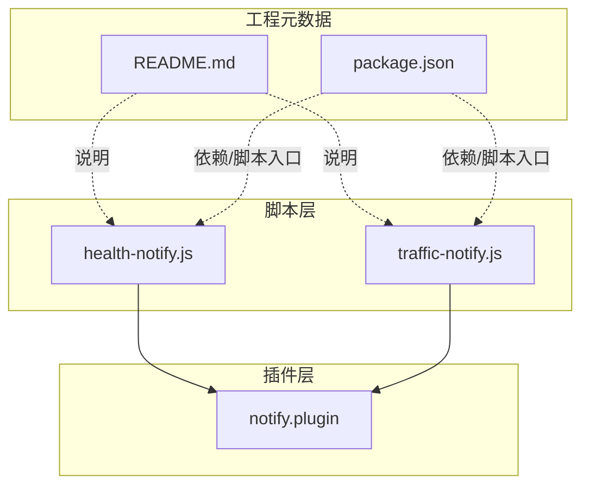
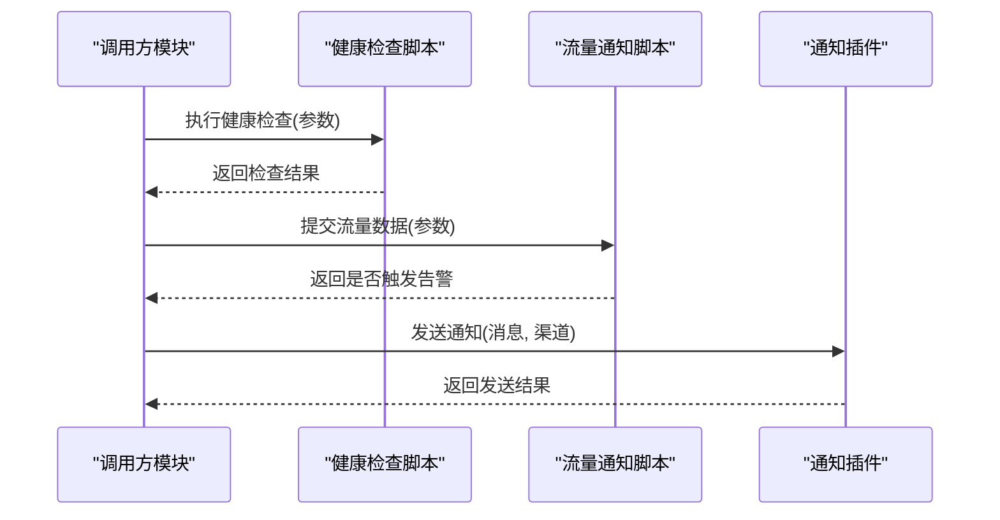
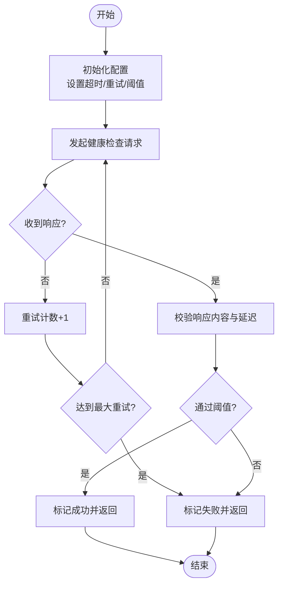
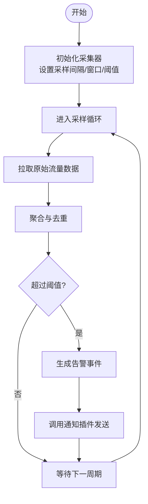
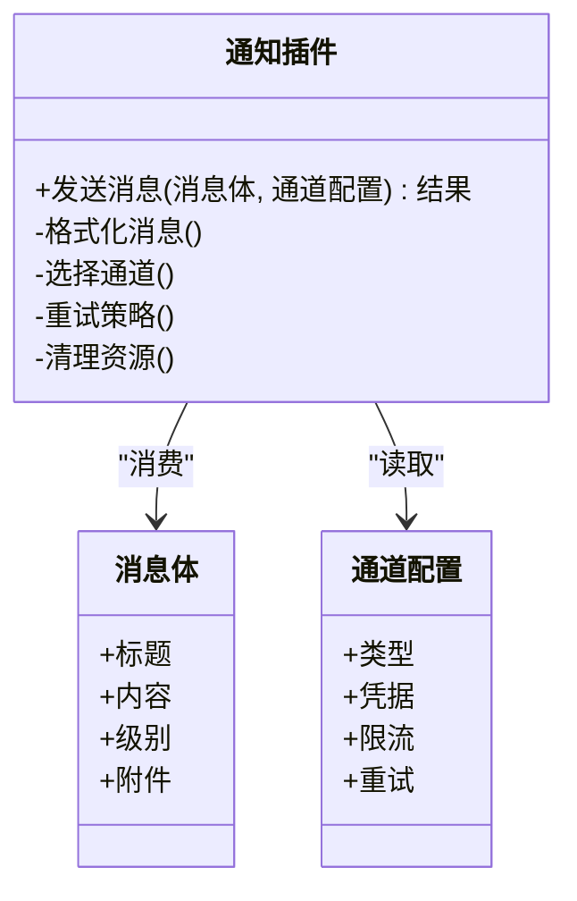
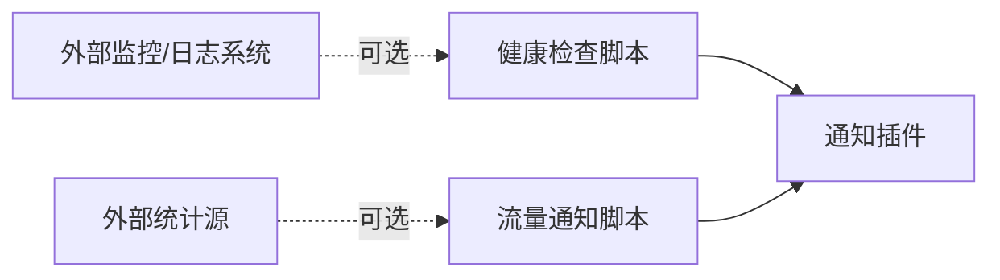

# 工具类API

<cite>
**本文档引用的文件**   
- [health-notify.js](file://Scripts/health-notify.js)
- [traffic-notify.js](file://Scripts/traffic-notify.js)
- [notify.plugin](file://Plugin/notify.plugin)
- [README.md](file://README.md)
- [package.json](file://package.json)
</cite>

## 目录
1. [简介](#简介)
2. [项目结构](#项目结构)
3. [核心组件](#核心组件)
4. [架构总览](#架构总览)
5. [详细组件分析](#详细组件分析)
6. [依赖关系分析](#依赖关系分析)
7. [性能考量](#性能考量)
8. [故障排查指南](#故障排查指南)
9. [结论](#结论)
10. [附录](#附录)

## 简介
本文件面向“工具类API”的文档化目标，聚焦健康检查与流量通知等通用能力。内容涵盖：
- 接口定义与使用方式（通知发送、状态监控、数据收集）
- 配置项与扩展点说明
- 集成示例（如何在其他模块中调用）
- 生命周期管理与资源清理机制
- 常见问题与排错建议

本仓库为脚本与规则集合，工具类以脚本形式提供，便于在各类代理或脚本引擎中复用。

## 项目结构
与工具类API相关的核心位置如下：
- Scripts 目录：健康检查与流量通知脚本
- Plugin 目录：通知插件入口，用于统一触发通知行为
- README 与 package.json：项目说明与依赖信息

图表来源
- [health-notify.js](file://Scripts/health-notify.js)
- [traffic-notify.js](file://Scripts/traffic-notify.js)
- [notify.plugin](file://Plugin/notify.plugin)
- [README.md](file://README.md)
- [package.json](file://package.json)

章节来源
- [README.md](file://README.md)
- [package.json](file://package.json)

## 核心组件
- 健康检查工具（health-notify.js）
  - 职责：周期性或按需发起健康检查，上报结果并触发通知
  - 关键能力：请求构造、重试策略、超时控制、结果判定、通知回调
- 流量通知工具（traffic-notify.js）
  - 职责：采集流量统计、阈值判断、告警与通知
  - 关键能力：数据采集、聚合计算、阈值比较、通知回调
- 通知插件（notify.plugin）
  - 职责：统一封装通知发送逻辑，屏蔽底层差异
  - 关键能力：消息格式化、渠道选择、错误处理、幂等性

章节来源
- [health-notify.js](file://Scripts/health-notify.js)
- [traffic-notify.js](file://Scripts/traffic-notify.js)
- [notify.plugin](file://Plugin/notify.plugin)

## 架构总览
工具类采用“脚本 + 插件”的分层设计：
- 脚本层负责业务逻辑（健康检查、流量采集、阈值判断）
- 插件层负责通知能力的统一接入与输出
- 外部通过脚本暴露的函数进行集成，无需关心通知细节

图表来源
- [health-notify.js](file://Scripts/health-notify.js)
- [traffic-notify.js](file://Scripts/traffic-notify.js)
- [notify.plugin](file://Plugin/notify.plugin)

## 详细组件分析

### 健康检查工具（health-notify.js）
- 功能要点
  - 支持按端点或域名进行可达性与延迟检测
  - 内置重试与退避策略，避免瞬时抖动误报
  - 可配置超时、最大重试次数、成功阈值
  - 结果回调用于联动通知或其他监控链路
- 典型用法
  - 初始化配置对象（超时、重试、阈值等）
  - 调用检查函数，传入目标地址与期望指标
  - 根据返回结果决定是否触发通知或记录日志
- 配置选项
  - 超时时间、重试次数、退避策略、阈值判定条件
  - 自定义校验器（例如对响应体关键字段进行断言）
- 扩展点
  - 自定义网络请求实现（适配不同运行时）
  - 自定义结果处理器（如上报到监控系统）
- 生命周期与资源清理
  - 启动时建立必要的连接池或定时器
  - 退出时释放定时器、关闭连接、清空缓存
  - 异常路径确保资源回收，避免泄漏

图表来源
- [health-notify.js](file://Scripts/health-notify.js)

章节来源
- [health-notify.js](file://Scripts/health-notify.js)

### 流量通知工具（traffic-notify.js）
- 功能要点
  - 采集上行/下行流量、连接数、错误率等指标
  - 支持周期采样与增量统计，避免重复计数
  - 阈值比较后生成告警事件
  - 与通知插件对接，统一发送告警消息
- 典型用法
  - 初始化采集器（指定采集源、采样间隔）
  - 定期拉取统计数据并进行聚合
  - 超过阈值时触发告警回调
- 配置选项
  - 采样间隔、窗口大小、阈值、去重策略
  - 自定义指标映射与过滤规则
- 扩展点
  - 自定义数据源适配器（适配不同引擎的统计接口）
  - 自定义告警路由（按级别或标签分发）
- 生命周期与资源清理
  - 启动时注册定时任务与监听器
  - 停止时取消定时任务、释放内存、持久化中间状态
  - 异常恢复：崩溃后从最近快照恢复

图表来源
- [traffic-notify.js](file://Scripts/traffic-notify.js)

章节来源
- [traffic-notify.js](file://Scripts/traffic-notify.js)

### 通知插件（notify.plugin）
- 功能要点
  - 统一消息格式与渲染模板
  - 支持多通道（如系统通知、IM、邮件等）
  - 内置失败重试与降级策略
- 典型用法
  - 构建消息体（标题、内容、级别、附件）
  - 指定目标通道与接收人
  - 调用发送接口并处理返回结果
- 配置选项
  - 通道凭据、限流策略、重试次数、模板变量
- 扩展点
  - 新增通道适配器
  - 自定义消息渲染器
- 生命周期与资源清理
  - 启动时加载通道配置与模板
  - 关闭时释放HTTP客户端、断开长连接、清理队列

图表来源
- [notify.plugin](file://Plugin/notify.plugin)

章节来源
- [notify.plugin](file://Plugin/notify.plugin)

## 依赖关系分析
- 脚本与插件耦合度低：脚本仅依赖通知插件的统一接口
- 外部依赖最小化：尽量使用运行时原生能力，减少第三方库引入
- 可扩展性强：通过适配器模式替换数据源与通道实现

图表来源
- [health-notify.js](file://Scripts/health-notify.js)
- [traffic-notify.js](file://Scripts/traffic-notify.js)
- [notify.plugin](file://Plugin/notify.plugin)

章节来源
- [health-notify.js](file://Scripts/health-notify.js)
- [traffic-notify.js](file://Scripts/traffic-notify.js)
- [notify.plugin](file://Plugin/notify.plugin)

## 性能考量
- 健康检查
  - 合理设置超时与重试，避免雪崩
  - 并发控制与连接复用
  - 结果缓存与去抖
- 流量采集
  - 增量统计与滑动窗口，降低内存占用
  - 批量上报与合并，减少IO压力
  - 采样降频与自适应调整
- 通知发送
  - 异步发送与队列缓冲
  - 限流与退避，防止被上游限制
  - 失败快速失败与降级

[本节为通用指导，不直接分析具体文件]

## 故障排查指南
- 健康检查失败
  - 检查网络连通性与DNS解析
  - 确认超时与重试配置是否合理
  - 查看响应码与响应体关键字段
- 流量统计异常
  - 核对数据源接口与字段映射
  - 检查窗口大小与采样间隔
  - 验证阈值与告警规则
- 通知发送失败
  - 校验通道凭据与权限
  - 查看限流与重试策略
  - 检查消息模板变量是否完整

章节来源
- [health-notify.js](file://Scripts/health-notify.js)
- [traffic-notify.js](file://Scripts/traffic-notify.js)
- [notify.plugin](file://Plugin/notify.plugin)

## 结论
本工具类API以脚本与插件解耦的方式，提供了稳定的健康检查与流量通知能力。通过清晰的配置项与扩展点，可在不同运行环境中快速集成与定制。建议在集成时关注生命周期管理、资源清理与异常恢复，以确保长期稳定运行。

[本节为总结性内容，不直接分析具体文件]

## 附录
- 集成示例（概念性步骤）
  - 在模块初始化阶段加载健康检查与流量采集器
  - 配置阈值、超时、重试等参数
  - 订阅健康检查与流量告警回调，调用通知插件发送消息
  - 在应用退出时调用清理接口，释放资源
- 参考文件
  - 健康检查脚本：[health-notify.js](file://Scripts/health-notify.js)
  - 流量通知脚本：[traffic-notify.js](file://Scripts/traffic-notify.js)
  - 通知插件：[notify.plugin](file://Plugin/notify.plugin)
  - 项目说明：[README.md](file://README.md)
  - 工程依赖：[package.json](file://package.json)