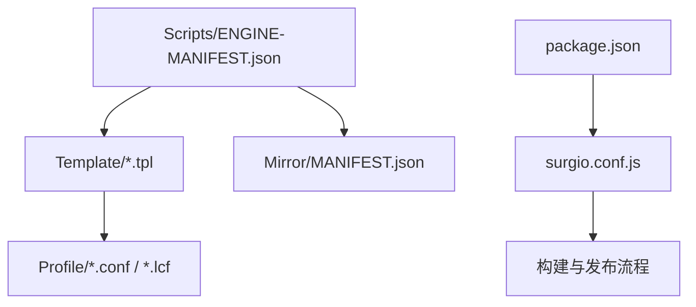
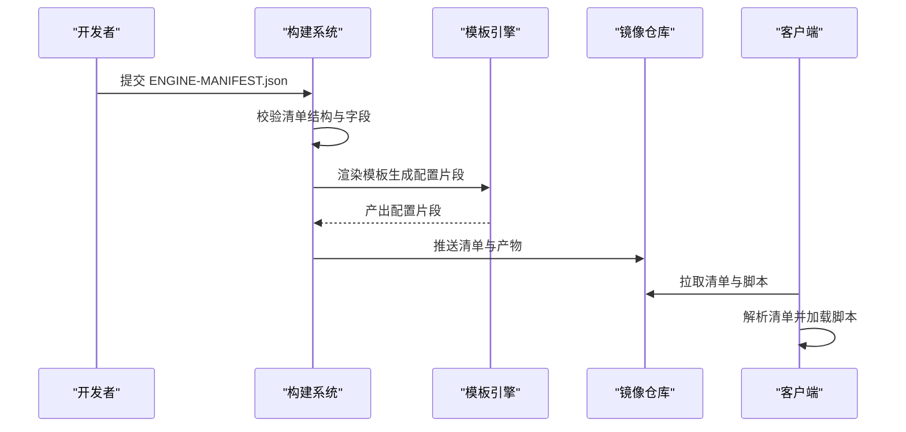
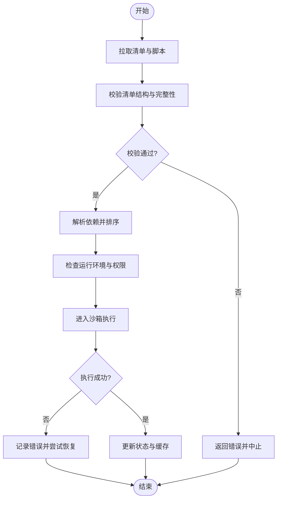
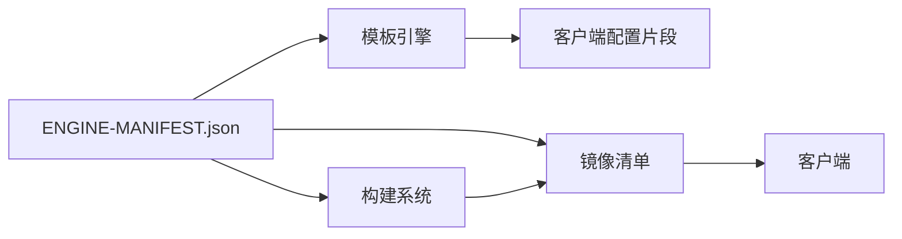

# 引擎清单API

<cite>
**本文档引用的文件**
- [Scripts/ENGINE-MANIFEST.json](file://Scripts/ENGINE-MANIFEST.json)
- [README.md](file://README.md)
- [package.json](file://package.json)
- [surgio.conf.js](file://surgio.conf.js)
- [template/quantumultx.tpl](file://template/quantumultx.tpl)
- [template/loon.tpl](file://template/loon.tpl)
- [template/surge.tpl](file://template/surge.tpl)
- [Mirror/MANIFEST.json](file://Mirror/MANIFEST.json)
</cite>

## 目录
1. [简介](#简介)
2. [项目结构](#项目结构)
3. [核心组件](#核心组件)
4. [架构总览](#架构总览)
5. [详细组件分析](#详细组件分析)
6. [依赖关系分析](#依赖关系分析)
7. [性能考虑](#性能考虑)
8. [故障排查指南](#故障排查指南)
9. [结论](#结论)
10. [附录](#附录)

## 简介
本文件为“引擎清单API”的权威文档，聚焦于 ENGINE-MANIFEST.json 的完整结构定义与使用规范。内容涵盖脚本元数据格式、版本管理策略、依赖关系声明以及引擎解析与加载机制，并提供字段含义、数据类型与校验规则说明。同时给出如何正确配置脚本清单的实践要点，以及与模板生成器、镜像仓库等组件的集成方式。

## 项目结构
本项目采用按功能域划分的目录组织方式：
- Scripts：存放脚本与引擎清单（ENGINE-MANIFEST.json）
- Template：各代理客户端（Quantumult X、Loon、Surge）的配置模板
- Mirror：镜像站点清单与资源
- Profile：客户端配置文件
- Provider：动态提供者脚本
- Test：测试用例与运行脚本
- Doc：文档与审计记录

图表来源
- [Scripts/ENGINE-MANIFEST.json](file://Scripts/ENGINE-MANIFEST.json)
- [template/quantumultx.tpl](file://template/quantumultx.tpl)
- [template/loon.tpl](file://template/loon.tpl)
- [template/surge.tpl](file://template/surge.tpl)
- [Mirror/MANIFEST.json](file://Mirror/MANIFEST.json)
- [package.json](file://package.json)
- [surgio.conf.js](file://surgio.conf.js)

章节来源
- [README.md](file://README.md)
- [package.json](file://package.json)
- [surgio.conf.js](file://surgio.conf.js)

## 核心组件
- ENGINE-MANIFEST.json：脚本清单的核心描述文件，定义脚本集合、元数据、版本与依赖、入口与加载策略。
- 模板文件（*.tpl）：将清单中的脚本映射到不同客户端的配置片段，实现多端适配。
- 镜像清单（Mirror/MANIFEST.json）：用于镜像站点的索引与分发，与主清单协同保证一致性。
- 构建与发布（package.json、surgio.conf.js）：驱动清单校验、模板渲染与产物输出。

章节来源
- [Scripts/ENGINE-MANIFEST.json](file://Scripts/ENGINE-MANIFEST.json)
- [template/quantumultx.tpl](file://template/quantumultx.tpl)
- [template/loon.tpl](file://template/loon.tpl)
- [template/surge.tpl](file://template/surge.tpl)
- [Mirror/MANIFEST.json](file://Mirror/MANIFEST.json)
- [package.json](file://package.json)
- [surgio.conf.js](file://surgio.conf.js)

## 架构总览
清单驱动的脚本分发与加载流程如下：
- 维护者更新 ENGINE-MANIFEST.json，提交变更
- 构建系统读取清单并执行校验
- 模板引擎根据清单生成各客户端配置片段
- 产物推送到镜像站点，供客户端拉取与安装
- 客户端在运行时解析清单，按需加载脚本

图表来源
- [Scripts/ENGINE-MANIFEST.json](file://Scripts/ENGINE-MANIFEST.json)
- [template/quantumultx.tpl](file://template/quantumultx.tpl)
- [template/loon.tpl](file://template/loon.tpl)
- [template/surge.tpl](file://template/surge.tpl)
- [Mirror/MANIFEST.json](file://Mirror/MANIFEST.json)
- [package.json](file://package.json)
- [surgio.conf.js](file://surgio.conf.js)

## 详细组件分析

### ENGINE-MANIFEST.json 结构定义
该清单文件是脚本集的描述契约，建议包含以下顶层字段与子对象：
- 基本信息
  - name：清单名称（字符串，必填）
  - version：清单版本号（语义化版本，必填）
  - description：清单描述（字符串，可选）
  - author：作者信息（字符串，可选）
  - homepage：主页链接（URL，可选）
  - license：许可证（字符串，可选）
  - updated_at：更新时间（ISO 8601 时间戳，必填）
- 脚本条目数组 scripts
  - id：脚本唯一标识（字符串，必填，字母数字与连字符）
  - name：脚本名称（字符串，必填）
  - description：脚本描述（字符串，可选）
  - version：脚本版本（语义化版本，必填）
  - entry：入口路径或模块名（字符串，必填）
  - type：脚本类型（如 js/qx/loon/surge，必填）
  - platform：支持平台（字符串或数组，可选）
  - tags：标签（字符串数组，可选）
  - dependencies：依赖声明（对象或数组，可选）
    - 对象形式：{ "@scope/name": "^1.2.3" }
    - 数组形式：[ "dep-id", ... ]
  - peerDependencies：对等依赖（同 dependencies，可选）
  - optionalDependencies：可选依赖（同 dependencies，可选）
  - requires：运行时要求（对象，可选）
    - engine：引擎版本范围（字符串，可选）
    - min_version：最低客户端版本（字符串，可选）
  - permissions：权限声明（对象，可选）
    - network：网络访问（布尔，可选）
    - location：位置服务（布尔，可选）
    - storage：本地存储（布尔，可选）
  - metadata：扩展元数据（对象，可选）
    - icon：图标URL（字符串，可选）
    - category：分类（字符串，可选）
    - keywords：关键词（字符串数组，可选）
  - integrity：完整性校验（字符串，可选）
  - dist：分发信息（对象，可选）
    - url：下载地址（URL，必填当存在 dist）
    - size：文件大小（整数，可选）
    - sha256：SHA256 校验值（字符串，可选）
- 版本与兼容性
  - engines：支持的引擎列表（对象，可选）
    - quantumult_x：版本范围（字符串，可选）
    - loon：版本范围（字符串，可选）
    - surge：版本范围（字符串，可选）
- 安全与合规
  - security_policy：安全策略（对象，可选）
    - allow_remote_scripts：是否允许远程脚本（布尔，可选）
    - allowed_domains：允许的域名白名单（字符串数组，可选）
    - sandbox：沙箱模式（枚举，可选）
- 元信息与索引
  - index：索引键（字符串，可选）
  - checksum：清单校验和（字符串，可选）
  - schema：JSON Schema 地址（URL，可选）

字段验证规则（摘要）
- 必填字段缺失将导致清单无效
- 版本必须遵循语义化版本规范
- URL 必须可解析且可达
- 依赖 ID 必须唯一且无循环依赖
- 权限声明需与实际行为一致
- 完整性校验值需与分发文件匹配

章节来源
- [Scripts/ENGINE-MANIFEST.json](file://Scripts/ENGINE-MANIFEST.json)

### 脚本元数据格式与示例
- 每个脚本条目应提供清晰的 id、name、version、entry、type 等基础信息
- 通过 dependencies 声明内部或外部依赖，确保加载顺序与可用性
- 使用 requires 限定运行环境，避免不兼容的客户端或引擎版本
- 使用 permissions 明确权限边界，便于安全审查与用户授权
- 使用 integrity 与 dist 保障下载完整性与可追溯性

章节来源
- [Scripts/ENGINE-MANIFEST.json](file://Scripts/ENGINE-MANIFEST.json)

### 版本管理与变更策略
- 清单版本升级需保持向后兼容，除非破坏性变更
- 脚本版本独立于清单版本，但受清单中 requires 约束
- 推荐使用语义化版本进行增量与破坏性变更控制
- 每次发布应更新 updated_at 与 checksum，便于缓存失效与校验

章节来源
- [Scripts/ENGINE-MANIFEST.json](file://Scripts/ENGINE-MANIFEST.json)

### 依赖关系声明与解析
- 依赖声明支持对象与数组两种形式，推荐对象形式以精确控制版本范围
- 解析时需构建依赖图，检测循环依赖与冲突
- 对等依赖需在宿主环境中显式提供
- 可选依赖失败不应阻断主流程，但需记录警告

章节来源
- [Scripts/ENGINE-MANIFEST.json](file://Scripts/ENGINE-MANIFEST.json)

### 加载机制与执行流程
- 客户端拉取清单后，先校验结构与完整性
- 根据 entry 定位脚本入口，解析 dependencies 并按拓扑排序加载
- 检查 requires 与 permissions，必要时提示用户授权
- 执行前进行沙箱隔离与安全策略校验
- 执行结果回写状态，支持热重载与错误恢复

图表来源
- [Scripts/ENGINE-MANIFEST.json](file://Scripts/ENGINE-MANIFEST.json)

### 与模板与客户端的集成
- 模板文件将清单中的脚本映射为各客户端的配置片段
- 清单中的 type、platform、permissions 影响模板渲染逻辑
- 构建系统根据清单生成多端配置，确保一致性
- 镜像清单与主清单同步，保证分发链路可靠

章节来源
- [template/quantumultx.tpl](file://template/quantumultx.tpl)
- [template/loon.tpl](file://template/loon.tpl)
- [template/surge.tpl](file://template/surge.tpl)
- [Mirror/MANIFEST.json](file://Mirror/MANIFEST.json)

### 与构建与发布的集成
- package.json 定义脚本命令与依赖
- surgio.conf.js 配置构建参数与发布目标
- 构建流程包括清单校验、模板渲染、产物打包与上传

章节来源
- [package.json](file://package.json)
- [surgio.conf.js](file://surgio.conf.js)

## 依赖关系分析
清单与模板、镜像、构建系统的依赖关系如下：
- ENGINE-MANIFEST.json 被构建系统与模板引擎消费
- 模板文件依赖清单中的脚本元数据生成配置片段
- 镜像清单与主清单保持同步，供客户端拉取
- 构建系统依赖 package.json 与 surgio.conf.js 完成流水线

图表来源
- [Scripts/ENGINE-MANIFEST.json](file://Scripts/ENGINE-MANIFEST.json)
- [template/quantumultx.tpl](file://template/quantumultx.tpl)
- [template/loon.tpl](file://template/loon.tpl)
- [template/surge.tpl](file://template/surge.tpl)
- [Mirror/MANIFEST.json](file://Mirror/MANIFEST.json)
- [package.json](file://package.json)
- [surgio.conf.js](file://surgio.conf.js)

章节来源
- [Scripts/ENGINE-MANIFEST.json](file://Scripts/ENGINE-MANIFEST.json)
- [Mirror/MANIFEST.json](file://Mirror/MANIFEST.json)
- [package.json](file://package.json)
- [surgio.conf.js](file://surgio.conf.js)

## 性能考虑
- 清单解析应在内存中进行，避免频繁磁盘IO
- 依赖解析可使用拓扑排序与缓存，减少重复计算
- 大清单分块加载与懒加载，提升首屏速度
- 完整性校验使用增量校验，降低带宽消耗
- 模板渲染并行化，缩短构建时间

## 故障排查指南
常见问题与处理建议：
- 清单校验失败：检查必填字段、版本格式、URL可达性与完整性校验值
- 依赖冲突：识别循环依赖与版本不兼容，调整依赖声明
- 权限不足：确认 permissions 与实际行为一致，必要时申请授权
- 加载失败：检查 entry 路径、dist 下载与完整性校验
- 模板渲染异常：核对 type、platform、permissions 与模板逻辑匹配

章节来源
- [Scripts/ENGINE-MANIFEST.json](file://Scripts/ENGINE-MANIFEST.json)

## 结论
ENGINE-MANIFEST.json 作为脚本清单的核心契约，定义了脚本元数据、版本管理、依赖关系与加载机制。通过严格的字段校验与安全的执行环境，确保脚本在多端的一致性与可靠性。结合模板与镜像体系，形成完整的清单驱动分发与执行闭环。

## 附录
- 最佳实践
  - 使用语义化版本管理清单与脚本
  - 明确权限声明与安全策略
  - 提供完整性校验与可追溯的分发信息
  - 保持清单与镜像同步，避免不一致
- 参考文件
  - README.md：项目概览与使用说明
  - package.json：构建与依赖配置
  - surgio.conf.js：构建与发布配置
  - template/*.tpl：客户端模板
  - Mirror/MANIFEST.json：镜像清单

章节来源
- [README.md](file://README.md)
- [package.json](file://package.json)
- [surgio.conf.js](file://surgio.conf.js)
- [template/quantumultx.tpl](file://template/quantumultx.tpl)
- [template/loon.tpl](file://template/loon.tpl)
- [template/surge.tpl](file://template/surge.tpl)
- [Mirror/MANIFEST.json](file://Mirror/MANIFEST.json)