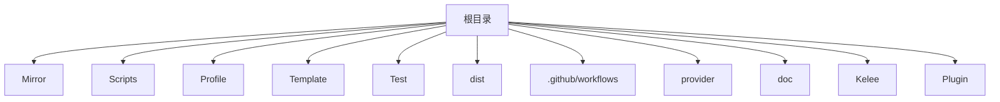
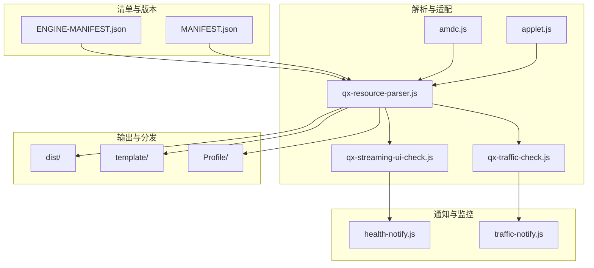
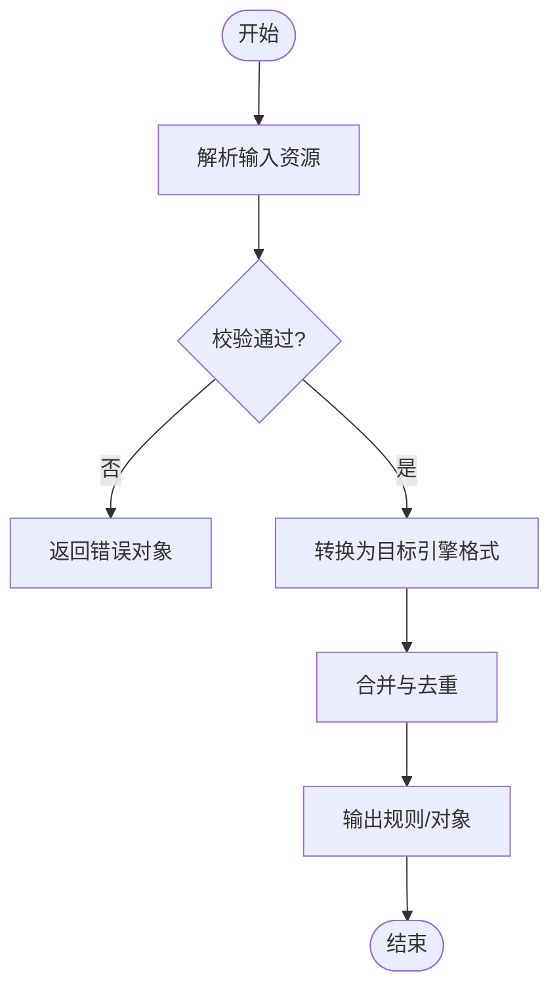
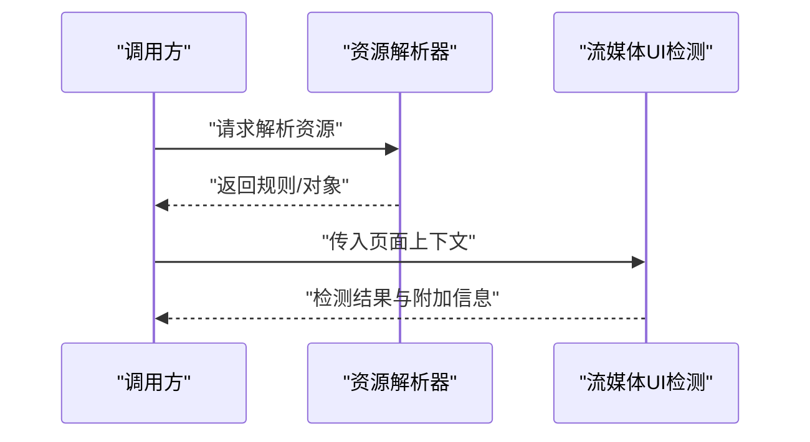
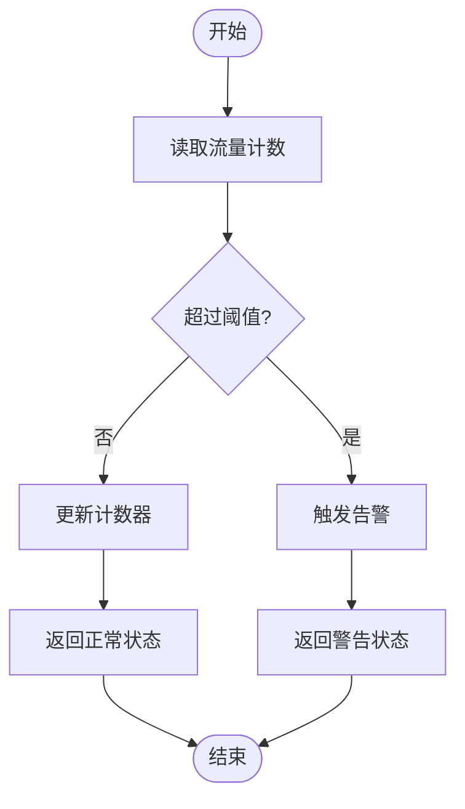
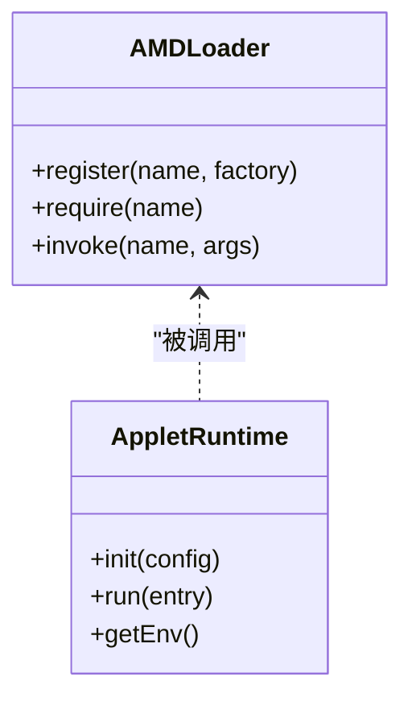
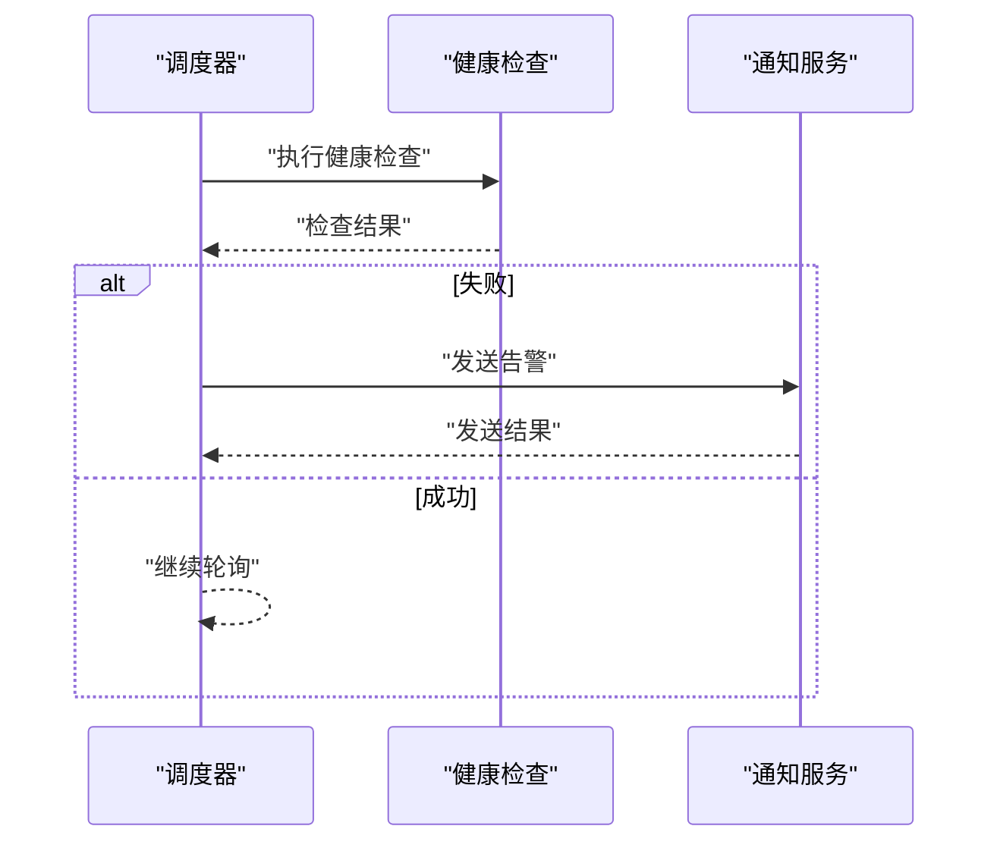
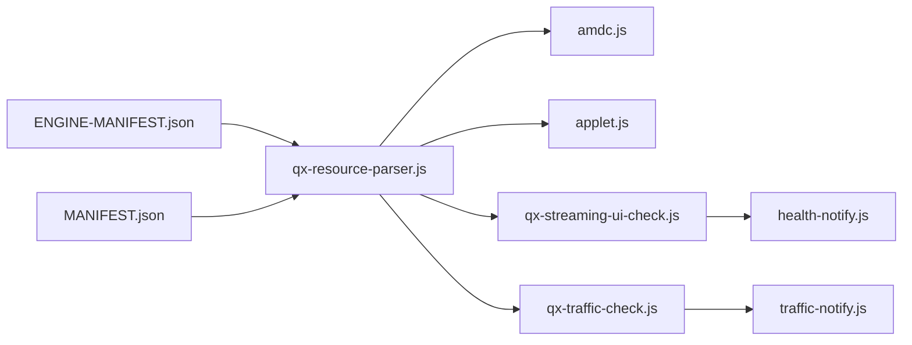

# 核心API

<cite>
**本文档引用的文件**   
- [README.md](file://README.md)
- [package.json](file://package.json)
- [surgio.conf.js](file://surgio.conf.js)
- [ENGINE-MANIFEST.json](file://Scripts/ENGINE-MANIFEST.json)
- [amdc.js](file://Mirror/amdc.js)
- [applet.js](file://Mirror/applet.js)
- [bilibili-json.js](file://Mirror/bilibili-json.js)
- [qx-resource-parser.js](file://Mirror/rules/qx-resource-parser.js)
- [qx-streaming-ui-check.js](file://Mirror/rules/qx-streaming-ui-check.js)
- [qx-traffic-check.js](file://Mirror/rules/qx-traffic-check.js)
- [health-notify.js](file://Scripts/health-notify.js)
- [traffic-notify.js](file://Scripts/traffic-notify.js)
- [MANIFEST.json](file://Mirror/MANIFEST.json)
</cite>

## 目录
1. [简介](#简介)
2. [项目结构](#项目结构)
3. [核心组件](#核心组件)
4. [架构总览](#架构总览)
5. [详细组件分析](#详细组件分析)
6. [依赖关系分析](#依赖关系分析)
7. [性能考虑](#性能考虑)
8. [故障排查指南](#故障排查指南)
9. [结论](#结论)
10. [附录](#附录)

## 简介
本仓库是一个面向网络工具与脚本生态的配置与规则集合，包含多引擎（如 Surge、Quantumult X、Loon）的规则与插件、脚本资源解析与校验、以及健康与流量通知等能力。核心目标是为开发者提供统一的配置入口、脚本运行环境与可复用的规则/脚本模块，并通过清单与模板实现跨引擎的兼容与分发。

## 项目结构
- 顶层配置文件：定义构建、测试、发布流程与工程元信息。
- Mirror：集中存放规则、脚本与清单，供各引擎使用。
- Scripts：具体业务脚本与健康/流量通知逻辑。
- Profile：不同引擎的配置文件示例。
- Template：模板文件用于生成各引擎配置。
- Test：单元测试与测试驱动。

**图表来源** 
- [package.json:1-200](file://package.json#L1-L200)
- [surgio.conf.js:1-200](file://surgio.conf.js#L1-L200)

**章节来源**
- [package.json:1-200](file://package.json#L1-L200)
- [surgio.conf.js:1-200](file://surgio.conf.js#L1-L200)

## 核心组件
- 清单与版本管理
  - ENGINE-MANIFEST.json：声明脚本引擎、版本与依赖关系。
  - MANIFEST.json：镜像资源的索引与版本策略。
- 规则与脚本解析器
  - qx-resource-parser.js：通用资源解析与转换。
  - qx-streaming-ui-check.js：流媒体UI检测逻辑。
  - qx-traffic-check.js：流量统计与阈值判断。
- 运行时与适配层
  - amdc.js：模块化加载与依赖注入。
  - applet.js：小程序/轻量应用适配封装。
- 通知与监控
  - health-notify.js：健康检查与告警。
  - traffic-notify.js：流量用量提醒。

**章节来源**
- [ENGINE-MANIFEST.json:1-200](file://Scripts/ENGINE-MANIFEST.json#L1-L200)
- [MANIFEST.json:1-200](file://Mirror/MANIFEST.json#L1-L200)
- [qx-resource-parser.js:1-200](file://Mirror/rules/qx-resource-parser.js#L1-L200)
- [qx-streaming-ui-check.js:1-200](file://Mirror/rules/qx-streaming-ui-check.js#L1-L200)
- [qx-traffic-check.js:1-200](file://Mirror/rules/qx-traffic-check.js#L1-L200)
- [amdc.js:1-200](file://Mirror/amdc.js#L1-L200)
- [applet.js:1-200](file://Mirror/applet.js#L1-L200)
- [health-notify.js:1-200](file://Scripts/health-notify.js#L1-L200)
- [traffic-notify.js:1-200](file://Scripts/traffic-notify.js#L1-L200)

## 架构总览
整体采用“清单驱动 + 规则/脚本解析 + 通知”的分层架构。清单负责版本与依赖声明；解析器将统一格式转换为各引擎可用规则；通知模块基于运行时状态触发告警。

**图表来源** 
- [ENGINE-MANIFEST.json:1-200](file://Scripts/ENGINE-MANIFEST.json#L1-L200)
- [MANIFEST.json:1-200](file://Mirror/MANIFEST.json#L1-L200)
- [qx-resource-parser.js:1-200](file://Mirror/rules/qx-resource-parser.js#L1-L200)
- [qx-streaming-ui-check.js:1-200](file://Mirror/rules/qx-streaming-ui-check.js#L1-L200)
- [qx-traffic-check.js:1-200](file://Mirror/rules/qx-traffic-check.js#L1-L200)
- [amdc.js:1-200](file://Mirror/amdc.js#L1-L200)
- [applet.js:1-200](file://Mirror/applet.js#L1-L200)
- [health-notify.js:1-200](file://Scripts/health-notify.js#L1-L200)
- [traffic-notify.js:1-200](file://Scripts/traffic-notify.js#L1-L200)

## 详细组件分析

### 清单与版本管理
- 作用
  - 统一声明脚本/插件的版本、依赖与兼容性范围。
  - 为构建与分发提供权威数据源。
- 关键对象与字段
  - engine：引擎标识（如 QX、Surge、Loon）。
  - version：语义化版本号。
  - dependencies：依赖列表与版本约束。
  - scripts：脚本入口与参数约定。
- 错误处理
  - 版本不匹配时拒绝加载或降级。
  - 缺失依赖时给出明确错误码与提示。

**章节来源**
- [ENGINE-MANIFEST.json:1-200](file://Scripts/ENGINE-MANIFEST.json#L1-L200)
- [MANIFEST.json:1-200](file://Mirror/MANIFEST.json#L1-L200)

### 资源解析器（qx-resource-parser.js）
- 职责
  - 解析统一资源描述，转换为各引擎规则格式。
  - 合并去重、条件分支展开、变量替换。
- 输入/输出
  - 输入：统一资源描述对象（含类型、域名、路径、动作等）。
  - 输出：引擎特定规则字符串或结构化对象。
- 复杂度
  - 时间复杂度与资源规模线性相关；缓存命中后接近常数时间。
- 错误处理
  - 非法语法返回错误对象；缺失字段进行回退默认值。

**图表来源** 
- [qx-resource-parser.js:1-200](file://Mirror/rules/qx-resource-parser.js#L1-L200)

**章节来源**
- [qx-resource-parser.js:1-200](file://Mirror/rules/qx-resource-parser.js#L1-L200)

### 流媒体UI检测（qx-streaming-ui-check.js）
- 职责
  - 根据页面特征判定是否为流媒体UI，并返回检测结果。
- 输入/输出
  - 输入：页面上下文（URL、UA、DOM片段等）。
  - 输出：布尔结果与附加信息（如平台、清晰度）。
- 错误处理
  - 上下文缺失时返回未知状态；异常捕获并记录日志。

**图表来源** 
- [qx-resource-parser.js:1-200](file://Mirror/rules/qx-resource-parser.js#L1-L200)
- [qx-streaming-ui-check.js:1-200](file://Mirror/rules/qx-streaming-ui-check.js#L1-L200)

**章节来源**
- [qx-streaming-ui-check.js:1-200](file://Mirror/rules/qx-streaming-ui-check.js#L1-L200)

### 流量检测（qx-traffic-check.js）
- 职责
  - 统计与阈值判断，触发告警或限流策略。
- 输入/输出
  - 输入：当前流量计数、周期、阈值配置。
  - 输出：状态码、剩余配额、建议动作。
- 错误处理
  - 计数异常重置；阈值配置缺失时使用安全默认值。

**图表来源** 
- [qx-traffic-check.js:1-200](file://Mirror/rules/qx-traffic-check.js#L1-L200)

**章节来源**
- [qx-traffic-check.js:1-200](file://Mirror/rules/qx-traffic-check.js#L1-L200)

### 运行时与适配层（amdc.js, applet.js）
- amdc.js
  - 提供模块加载、依赖注入与生命周期钩子。
  - 支持同步与异步模块注册。
- applet.js
  - 封装轻量应用环境，屏蔽差异并提供统一接口。
  - 暴露基础IO、存储与网络能力。

**图表来源** 
- [amdc.js:1-200](file://Mirror/amdc.js#L1-L200)
- [applet.js:1-200](file://Mirror/applet.js#L1-L200)

**章节来源**
- [amdc.js:1-200](file://Mirror/amdc.js#L1-L200)
- [applet.js:1-200](file://Mirror/applet.js#L1-L200)

### 通知与监控（health-notify.js, traffic-notify.js）
- health-notify.js
  - 周期性健康检查，失败时发送告警。
- traffic-notify.js
  - 基于流量阈值推送提醒。
- 错误处理
  - 网络不可用重试；消息队列满则丢弃并记录。

**图表来源** 
- [health-notify.js:1-200](file://Scripts/health-notify.js#L1-L200)
- [traffic-notify.js:1-200](file://Scripts/traffic-notify.js#L1-L200)

**章节来源**
- [health-notify.js:1-200](file://Scripts/health-notify.js#L1-L200)
- [traffic-notify.js:1-200](file://Scripts/traffic-notify.js#L1-L200)

## 依赖关系分析
- 清单驱动：ENGINE-MANIFEST.json 与 MANIFEST.json 决定脚本与规则的加载顺序与版本约束。
- 解析器依赖：资源解析器依赖运行时适配层提供的能力（如IO、网络）。
- 通知依赖：通知模块依赖系统通知通道与配置中心。

**图表来源** 
- [ENGINE-MANIFEST.json:1-200](file://Scripts/ENGINE-MANIFEST.json#L1-L200)
- [MANIFEST.json:1-200](file://Mirror/MANIFEST.json#L1-L200)
- [qx-resource-parser.js:1-200](file://Mirror/rules/qx-resource-parser.js#L1-L200)
- [amdc.js:1-200](file://Mirror/amdc.js#L1-L200)
- [applet.js:1-200](file://Mirror/applet.js#L1-L200)
- [qx-streaming-ui-check.js:1-200](file://Mirror/rules/qx-streaming-ui-check.js#L1-L200)
- [qx-traffic-check.js:1-200](file://Mirror/rules/qx-traffic-check.js#L1-L200)
- [health-notify.js:1-200](file://Scripts/health-notify.js#L1-L200)
- [traffic-notify.js:1-200](file://Scripts/traffic-notify.js#L1-L200)

**章节来源**
- [ENGINE-MANIFEST.json:1-200](file://Scripts/ENGINE-MANIFEST.json#L1-L200)
- [MANIFEST.json:1-200](file://Mirror/MANIFEST.json#L1-L200)
- [qx-resource-parser.js:1-200](file://Mirror/rules/qx-resource-parser.js#L1-L200)

## 性能考虑
- 解析器应启用缓存与增量更新，避免重复计算。
- 通知模块需具备背压与限流，防止风暴式告警。
- 清单校验应在构建期完成，减少运行时开销。

[本节为通用指导，无需引用具体文件]

## 故障排查指南
- 常见问题
  - 清单版本不匹配：检查 ENGINE-MANIFEST.json 与 MANIFEST.json 的版本约束。
  - 解析失败：确认输入资源结构完整且符合规范。
  - 通知未送达：检查通知通道权限与网络状态。
- 定位方法
  - 开启调试日志，关注错误码与堆栈。
  - 使用最小复现用例隔离问题。

**章节来源**
- [ENGINE-MANIFEST.json:1-200](file://Scripts/ENGINE-MANIFEST.json#L1-L200)
- [MANIFEST.json:1-200](file://Mirror/MANIFEST.json#L1-L200)
- [qx-resource-parser.js:1-200](file://Mirror/rules/qx-resource-parser.js#L1-L200)
- [health-notify.js:1-200](file://Scripts/health-notify.js#L1-L200)
- [traffic-notify.js:1-200](file://Scripts/traffic-notify.js#L1-L200)

## 结论
本项目以清单为核心，结合规则与脚本解析器、运行时适配与通知能力，形成一套可扩展、可分发的配置与脚本生态。通过严格的版本管理与错误处理机制，确保跨引擎兼容与稳定运行。

[本节为总结性内容，无需引用具体文件]

## 附录
- API 调用示例（概念性说明）
  - 同步调用：直接调用解析器函数，获取即时结果。
  - 异步调用：通过回调或 Promise 获取结果，适用于耗时操作。
- 版本兼容性策略
  - 语义化版本控制，主版本变更保持向后兼容。
  - 清单中声明最低兼容版本，构建期校验。

[本节为概念性说明，无需引用具体文件]