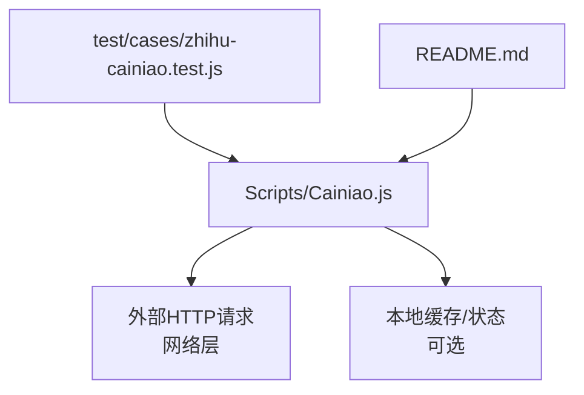
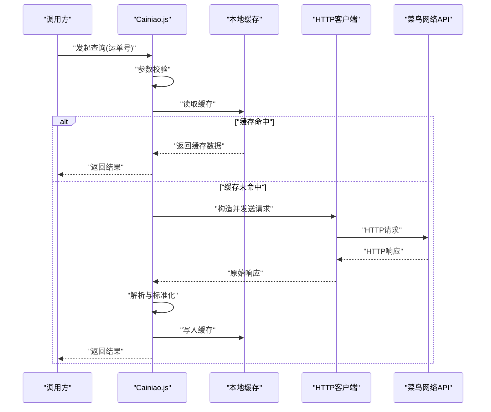
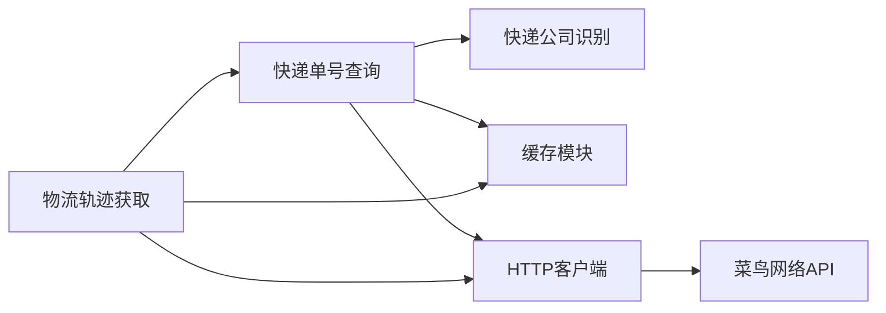

# 物流查询API

<cite>
**本文档引用的文件**
- [Cainiao.js](file://Scripts/Cainiao.js)
- [zhihu-cainiao.test.js](file://test/cases/zhihu-cainiao.test.js)
- [README.md](file://README.md)
</cite>

## 目录
1. [简介](#简介)
2. [项目结构](#项目结构)
3. [核心组件](#核心组件)
4. [架构总览](#架构总览)
5. [详细组件分析](#详细组件分析)
6. [依赖关系分析](#依赖关系分析)
7. [性能考虑](#性能考虑)
8. [故障排查指南](#故障排查指南)
9. [结论](#结论)
10. [附录](#附录)

## 简介
本文件面向需要集成菜鸟物流查询能力的开发者，聚焦于 Scripts/Cainiao.js 中实现的物流查询接口。内容涵盖快递单号查询、物流轨迹获取、快递公司识别等能力；对每个函数的参数要求、响应数据结构与异常处理进行说明；并提供调用示例与结果解析方法。同时解释与菜鸟网络API的对接方式以及数据缓存策略，帮助读者快速、稳定地实现物流信息查询功能。

## 项目结构
本项目采用脚本化组织方式，与物流查询相关的核心代码位于 Scripts/Cainiao.js，测试用例位于 test/cases/zhihu-cainiao.test.js。整体结构以“脚本+规则+配置”为主，便于在多种代理/脚本引擎中复用。

图表来源
- [Cainiao.js](file://Scripts/Cainiao.js)
- [zhihu-cainiao.test.js](file://test/cases/zhihu-cainiao.test.js)
- [README.md](file://README.md)

章节来源
- [README.md](file://README.md)

## 核心组件
- 快递单号查询：根据运单号返回基础包裹信息（如快递公司、当前状态、预计送达时间等）。
- 物流轨迹获取：按时间顺序返回物流节点详情（揽收、运输、派送、签收等）。
- 快递公司识别：基于运单号前缀或第三方接口识别快递公司编码与名称。
- 错误处理：网络异常、超时、非法输入、上游服务不可用等场景的统一处理与降级策略。
- 缓存策略：对热点查询结果进行短期缓存，降低重复请求与上游压力。

章节来源
- [Cainiao.js](file://Scripts/Cainiao.js)

## 架构总览
下图展示了从调用方到菜鸟网络的端到端流程，包括参数校验、缓存命中、HTTP请求、响应解析与缓存写入等环节。

图表来源
- [Cainiao.js](file://Scripts/Cainiao.js)

## 详细组件分析

### 快递单号查询
- 功能概述：输入快递单号，返回包裹基础信息与当前状态。
- 参数要求：
  - 运单号：必填，字符串，长度与格式需符合主流快递公司规范。
  - 可选参数：快递公司编码（若提供可跳过识别步骤）、是否强制刷新缓存等。
- 响应数据结构：
  - 包裹基础信息：快递公司、运单号、当前状态、更新时间等。
  - 状态码与消息：用于判断成功与否及失败原因。
- 异常处理：
  - 输入校验失败：返回明确的错误码与提示。
  - 网络异常/超时：重试策略与降级返回。
  - 上游服务异常：统一封装错误对象，便于上层处理。
- 缓存策略：
  - 对相同运单号的查询结果设置较短TTL，避免频繁请求。
  - 支持强制刷新以获取最新状态。

章节来源
- [Cainiao.js](file://Scripts/Cainiao.js)

### 物流轨迹获取
- 功能概述：根据运单号拉取并按时间排序返回物流轨迹节点。
- 参数要求：
  - 运单号：必填。
  - 可选：分页参数（页码、每页条数）、过滤条件（仅显示有效节点）。
- 响应数据结构：
  - 轨迹列表：包含时间、地点、描述、状态等字段。
  - 元数据：总条数、是否有下一页等。
- 异常处理：
  - 空轨迹：返回空列表与提示信息。
  - 部分节点缺失：保留可用节点并记录警告。
  - 上游限流/错误：退避重试与错误上报。
- 缓存策略：
  - 轨迹数据TTL略长于基础信息，减少重复拉取。
  - 增量更新：仅在必要时合并新节点。

章节来源
- [Cainiao.js](file://Scripts/Cainiao.js)

### 快递公司识别
- 功能概述：通过运单号前缀或第三方接口识别快递公司编码与名称。
- 参数要求：
  - 运单号：必填。
  - 可选：地区/国家代码（影响某些公司编码规则）。
- 响应数据结构：
  - 快递公司编码、名称、图标URL（如有）、置信度等。
- 异常处理：
  - 无法识别：返回未知标识与兜底逻辑。
  - 多候选结果：按置信度排序并返回最佳匹配。
- 缓存策略：
  - 常见运单号前缀映射可本地缓存，提升识别速度。

章节来源
- [Cainiao.js](file://Scripts/Cainiao.js)

### 错误处理与降级
- 错误分类：
  - 客户端错误：参数非法、缺少必要字段。
  - 网络错误：连接失败、DNS解析失败、超时。
  - 服务端错误：上游限流、鉴权失败、业务异常。
- 处理策略：
  - 重试与退避：指数退避与最大重试次数限制。
  - 降级返回：在不可用时返回默认值或友好提示。
  - 日志与监控：记录关键路径的错误码与耗时。

章节来源
- [Cainiao.js](file://Scripts/Cainiao.js)

### 数据缓存策略
- 缓存层级：
  - 内存缓存：短TTL，适合高频查询。
  - 持久化缓存（可选）：跨进程/重启后仍有效。
- 缓存键生成：
  - 基于运单号与查询类型组合，确保唯一性。
- 失效与更新：
  - TTL到期自动失效。
  - 支持主动刷新与批量清理。
- 一致性保障：
  - 写时更新，读时优先命中缓存。
  - 冲突场景下以最近写入为准。

章节来源
- [Cainiao.js](file://Scripts/Cainiao.js)

### 与菜鸟网络API的对接方式
- 请求构造：
  - 使用标准HTTP/HTTPS协议，遵循菜鸟API签名与鉴权规范。
  - 合理设置超时与重试策略。
- 响应解析：
  - 将上游JSON转换为内部统一模型，屏蔽差异。
  - 字段映射与缺省值处理。
- 安全与合规：
  - 敏感信息加密传输。
  - 遵守速率限制与配额管理。

章节来源
- [Cainiao.js](file://Scripts/Cainiao.js)

### 调用示例与结果解析
- 基本调用流程：
  - 准备运单号与可选参数。
  - 调用查询函数并处理返回值。
  - 解析响应中的状态与数据字段。
- 结果解析要点：
  - 检查状态码与消息字段。
  - 遍历轨迹节点并渲染展示。
  - 处理边界情况（无轨迹、部分缺失）。
- 参考测试用例：
  - 可通过测试用例了解典型输入输出与异常分支。

章节来源
- [zhihu-cainiao.test.js](file://test/cases/zhihu-cainiao.test.js)
- [Cainiao.js](file://Scripts/Cainiao.js)

## 依赖关系分析
- 模块内依赖：
  - 查询模块依赖识别模块与缓存模块。
  - 轨迹模块依赖查询模块的结果。
- 外部依赖：
  - HTTP客户端用于与菜鸟网络通信。
  - 可能的第三方识别服务作为备选。
- 耦合与解耦：
  - 通过统一接口与数据模型降低耦合。
  - 错误与日志抽象为通用组件。

图表来源
- [Cainiao.js](file://Scripts/Cainiao.js)

章节来源
- [Cainiao.js](file://Scripts/Cainiao.js)

## 性能考虑
- 缓存命中率优化：合理设置TTL与缓存键策略。
- 并发控制：限制并发请求数量，避免上游限流。
- 超时与重试：设置合理的超时时间与退避策略。
- 数据压缩：在网络层启用压缩以减少带宽占用。
- 懒加载与分页：按需加载轨迹节点，减少首屏延迟。

[本节为通用指导，不直接分析具体文件]

## 故障排查指南
- 常见问题定位：
  - 参数校验失败：检查运单号格式与必填字段。
  - 网络异常：检查DNS、代理与证书配置。
  - 上游错误：查看错误码与消息，确认鉴权与配额。
- 调试建议：
  - 开启详细日志，记录请求与响应。
  - 使用测试用例复现问题。
  - 逐步隔离缓存与网络层影响。
- 恢复策略：
  - 重试与降级。
  - 清空异常缓存项。
  - 切换备用识别服务。

章节来源
- [Cainiao.js](file://Scripts/Cainiao.js)

## 结论
Cainiao.js 提供了完整的物流查询能力，覆盖快递单号查询、轨迹获取与公司识别等核心场景。通过统一的错误处理与缓存策略，能够在复杂网络环境下保持稳定与高效。建议在生产环境中结合监控与日志完善可观测性，并根据业务需求调整缓存TTL与重试策略。

[本节为总结性内容，不直接分析具体文件]

## 附录
- 术语表：
  - 运单号：快递公司分配的唯一包裹编号。
  - 轨迹节点：物流过程中的关键事件记录。
  - TTL：缓存存活时间。
- 参考资源：
  - 菜鸟网络API文档（外部链接，不在本仓库范围内）。
  - 测试用例中的输入输出样例。

[本节为补充信息，不直接分析具体文件]