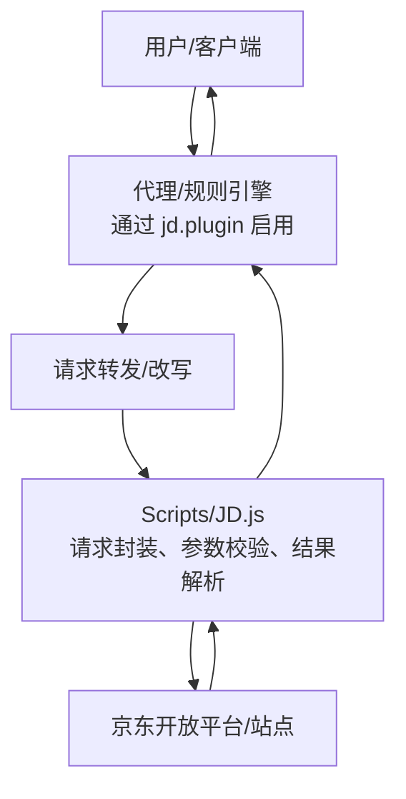
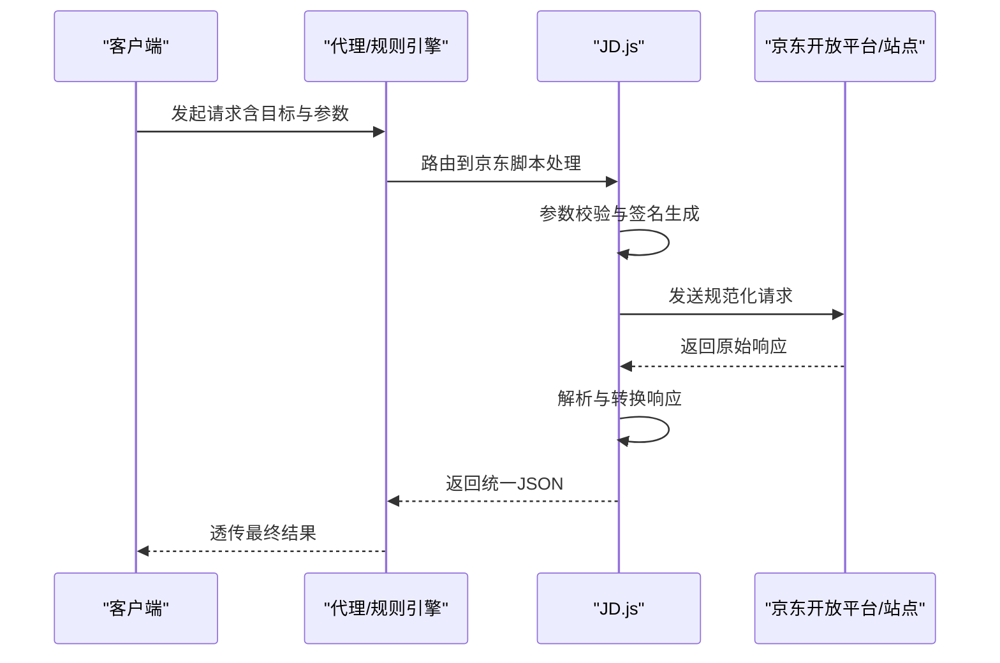
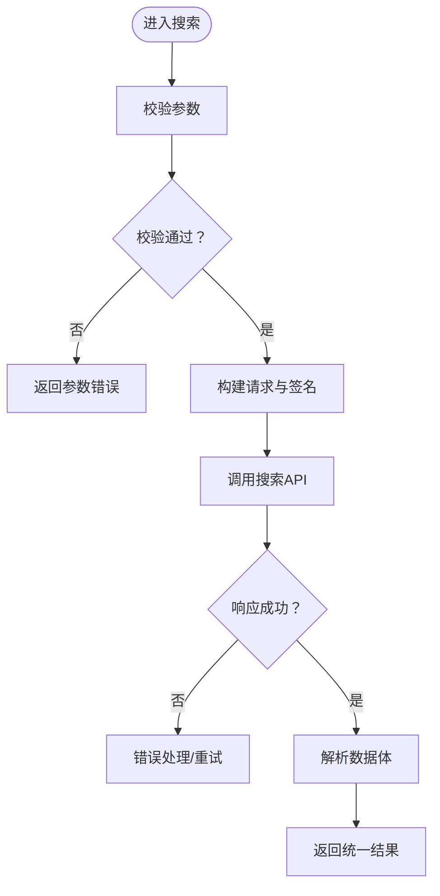
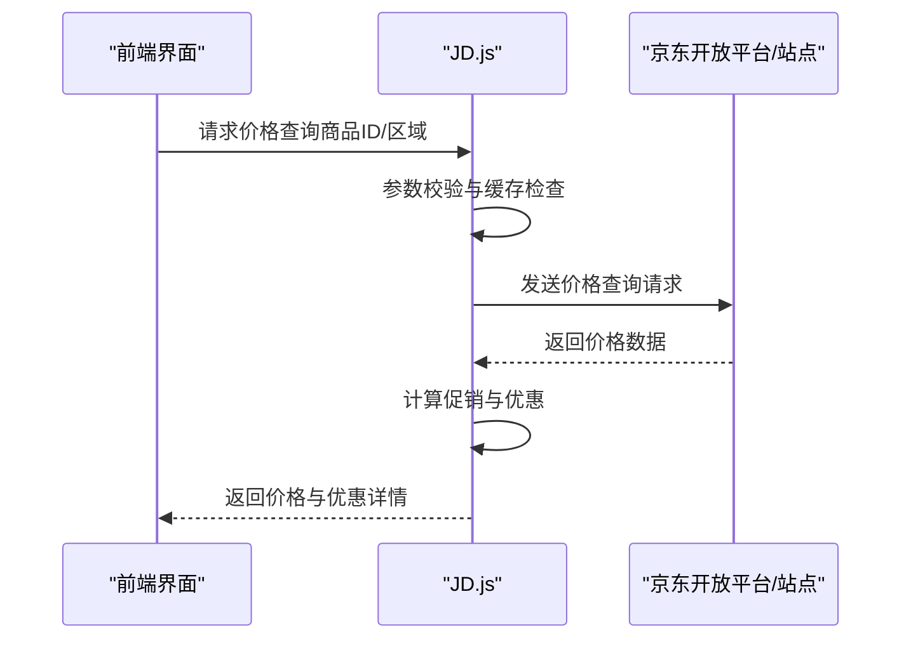
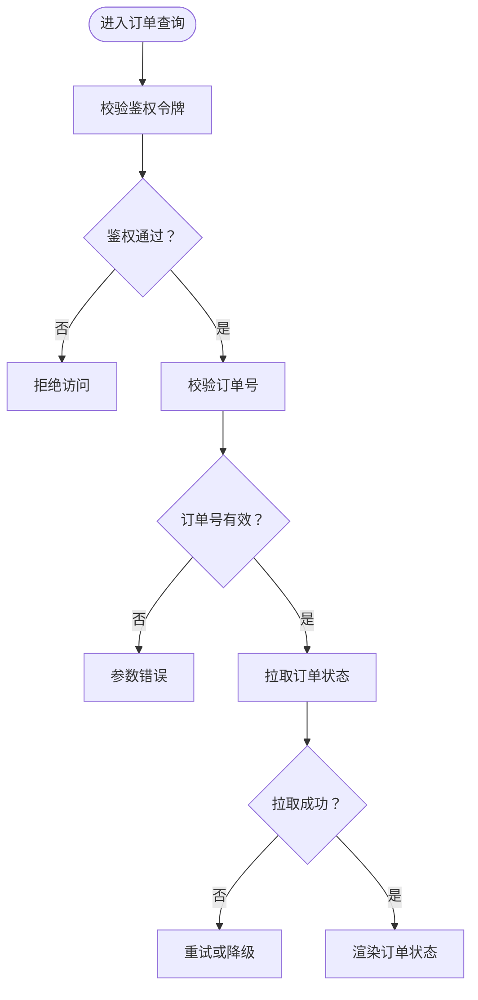
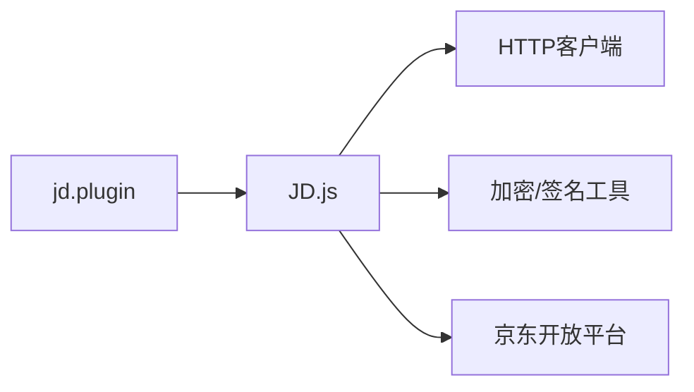

# 电商服务API

<cite>
**本文引用的文件**   
- [JD.js](file://Scripts/JD.js)
- [jd.plugin](file://Plugin/jd.plugin)
- [README.md](file://README.md)
</cite>

## 目录
1. [简介](#简介)
2. [项目结构](#项目结构)
3. [核心组件](#核心组件)
4. [架构总览](#架构总览)
5. [详细组件分析](#详细组件分析)
6. [依赖分析](#依赖分析)
7. [性能考虑](#性能考虑)
8. [故障排查指南](#故障排查指南)
9. [结论](#结论)
10. [附录](#附录)

## 简介
本文件面向使用与集成京东相关电商服务的开发者，聚焦于 Scripts/JD.js 中实现的京东接口能力，包括商品搜索、价格查询、订单状态获取等。文档将说明各接口的调用方式、参数校验要点、响应格式约定，并给出在 JavaScript 环境中的集成示例思路。同时解释与京东开放平台的对接机制与数据同步策略，帮助读者快速落地与稳定运行。

## 项目结构
本项目采用“脚本 + 插件”的组织方式：
- Scripts/JD.js：实现京东相关功能的核心脚本逻辑（请求封装、参数处理、结果解析、错误处理）。
- Plugin/jd.plugin：用于在代理/规则引擎中启用或配置京东相关行为（如域名映射、拦截、重定向等），配合脚本完成端到端能力。
- README.md：项目总体说明与使用说明。

图表来源
- [JD.js](file://Scripts/JD.js)
- [jd.plugin](file://Plugin/jd.plugin)

章节来源
- [README.md](file://README.md)

## 核心组件
- 请求封装层：统一发起 HTTP 请求，处理超时、重试、鉴权头、签名等通用逻辑。
- 参数校验层：对输入参数进行类型、范围、必填项校验，返回标准化错误信息。
- 业务逻辑层：按不同 API（商品搜索、价格查询、订单状态）组织调用流程与数据转换。
- 结果解析层：将上游响应转换为统一的 JSON 结构，便于上层消费。
- 错误处理层：捕获网络异常、业务错误码、限流降级等场景，提供可观测日志与降级策略。

章节来源
- [JD.js](file://Scripts/JD.js)

## 架构总览
下图展示了从客户端到京东开放平台的整体交互路径，以及 JD.js 在各环节的职责。

图表来源
- [JD.js](file://Scripts/JD.js)
- [jd.plugin](file://Plugin/jd.plugin)

## 详细组件分析

### 商品搜索接口
- 功能概述：根据关键词、类目、排序、分页等条件检索商品列表。
- 典型入参
  - 关键词：字符串，非空，长度限制
  - 类目ID：可选，数字
  - 排序：可选，枚举值
  - 页码/每页数量：可选，正整数
- 参数校验要点
  - 必填字段校验与类型检查
  - 数值范围边界校验
  - 特殊字符过滤与转义
- 响应格式
  - 统一结构：包含状态码、消息、数据体
  - 数据体：商品列表数组，每项包含 ID、标题、主图、价格区间、店铺信息等
- 调用示例（JavaScript）
  - 构造请求对象，设置必要头部与签名
  - 调用 JD.js 提供的搜索方法
  - 处理成功与失败分支，渲染列表

图表来源
- [JD.js](file://Scripts/JD.js)

章节来源
- [JD.js](file://Scripts/JD.js)

### 价格查询接口
- 功能概述：根据商品ID或SKU查询当前价格、促销价、优惠券可用性等。
- 典型入参
  - 商品ID/SKU：字符串或数字，必填
  - 区域/城市：可选，影响价格与库存
  - 会员等级/渠道：可选，影响折扣
- 参数校验要点
  - ID/SKU 唯一性与存在性校验
  - 区域编码合法性校验
- 响应格式
  - 统一结构：状态码、消息、数据体
  - 数据体：价格明细、促销信息、库存状态、优惠叠加规则
- 调用示例（JavaScript）
  - 组装查询参数与上下文
  - 调用价格查询方法
  - 展示价格与优惠信息

图表来源
- [JD.js](file://Scripts/JD.js)

章节来源
- [JD.js](file://Scripts/JD.js)

### 订单状态获取接口
- 功能概述：根据订单号或用户会话获取订单基本信息与状态流转。
- 典型入参
  - 订单号：字符串，必填
  - 用户标识/会话令牌：必填（视鉴权策略）
  - 时间范围：可选，用于筛选历史订单
- 参数校验要点
  - 订单号格式与存在性校验
  - 鉴权令牌有效性校验
- 响应格式
  - 统一结构：状态码、消息、数据体
  - 数据体：订单基础信息、物流状态、支付状态、售后状态
- 调用示例（JavaScript）
  - 携带鉴权头与订单号发起请求
  - 处理状态码与业务错误
  - 更新界面展示订单状态

图表来源
- [JD.js](file://Scripts/JD.js)

章节来源
- [JD.js](file://Scripts/JD.js)

### 与京东开放平台的对接机制
- 鉴权与签名
  - 使用平台要求的签名算法生成请求签名，确保请求完整性与身份可信。
  - 支持 Token 刷新与过期处理，避免频繁失效导致的失败。
- 域名与路由
  - 通过 jd.plugin 配置域名映射与拦截规则，将特定请求路由至 JD.js 处理。
  - 支持灰度发布与多环境切换（测试/生产）。
- 数据同步策略
  - 增量同步：基于时间戳或游标拉取变更数据，减少带宽与延迟。
  - 幂等设计：重复请求不产生副作用，保证一致性。
  - 缓存策略：热点数据本地缓存，设置合理 TTL 与失效策略。
  - 限流与退避：遵循平台 QPS 限制，指数退避与熔断保护。

章节来源
- [JD.js](file://Scripts/JD.js)
- [jd.plugin](file://Plugin/jd.plugin)

## 依赖分析
- 内部依赖
  - JD.js 依赖统一的请求封装与错误处理模块（若存在），提高复用性与一致性。
  - jd.plugin 负责在网络层将京东相关流量引导至 JD.js。
- 外部依赖
  - 京东开放平台 API：商品、价格、订单等接口。
  - 第三方工具库（如有）：加密、序列化、HTTP 客户端等。

图表来源
- [JD.js](file://Scripts/JD.js)
- [jd.plugin](file://Plugin/jd.plugin)

章节来源
- [JD.js](file://Scripts/JD.js)
- [jd.plugin](file://Plugin/jd.plugin)

## 性能考虑
- 请求合并与批处理：批量查询价格与订单，降低往返次数。
- 缓存与预取：热门商品与价格短期缓存；预测性预取提升体验。
- 连接复用与超时控制：合理设置超时与重试上限，避免雪崩。
- 压缩与传输优化：启用 gzip/br，减少 payload 大小。
- 监控与指标：记录成功率、延迟分布、错误码占比，辅助定位瓶颈。

[本节为通用指导，无需引用具体文件]

## 故障排查指南
- 常见问题
  - 参数校验失败：检查必填项、类型与范围。
  - 鉴权失败：确认 Token 是否过期、签名是否正确。
  - 限流/熔断：观察错误码与日志，调整频率与退避策略。
  - 网络异常：检查 DNS、代理、证书与超时设置。
- 诊断步骤
  - 开启调试日志，记录请求与响应摘要。
  - 复现最小用例，隔离问题域。
  - 对比上下游状态码与错误消息，定位根因。
  - 必要时回滚或切换到备用通道。

章节来源
- [JD.js](file://Scripts/JD.js)

## 结论
JD.js 提供了覆盖商品搜索、价格查询、订单状态获取等关键能力的京东电商服务接口。通过统一的参数校验、响应解析与错误处理机制，结合 jd.plugin 的网络层路由，能够稳定对接京东开放平台。建议在生产环境中完善监控、缓存与限流策略，保障高可用与良好用户体验。

[本节为总结性内容，无需引用具体文件]

## 附录
- 集成示例（JavaScript）
  - 初始化 JD.js 实例，注入必要的配置（鉴权、域名、超时等）。
  - 调用商品搜索方法，传入关键词与分页参数，处理返回的商品列表。
  - 调用价格查询方法，传入商品ID与区域，展示价格与优惠信息。
  - 调用订单状态方法，传入订单号与会话令牌，更新订单状态视图。
- 最佳实践
  - 严格参数校验与错误提示，提升健壮性。
  - 合理使用缓存与重试，平衡一致性与性能。
  - 关注平台限流与变更公告，及时适配。

[本节为概念性内容，无需引用具体文件]