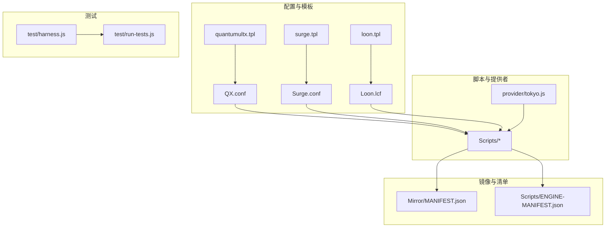
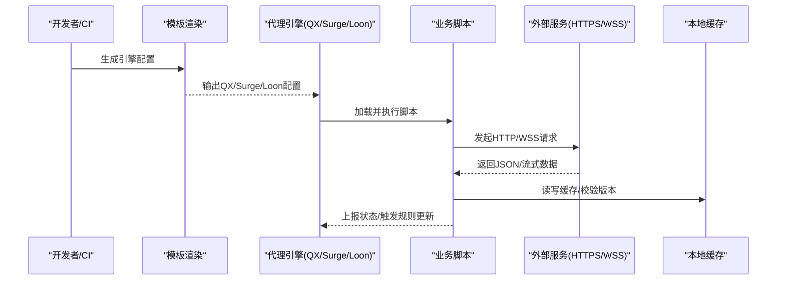
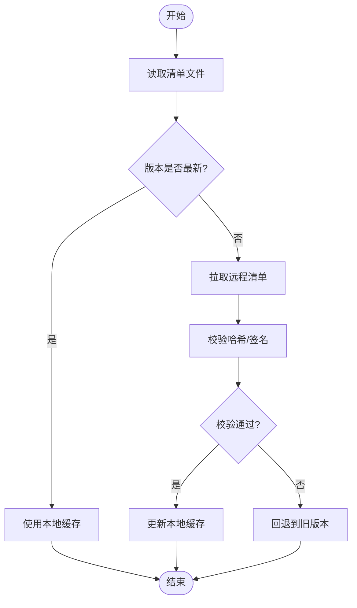
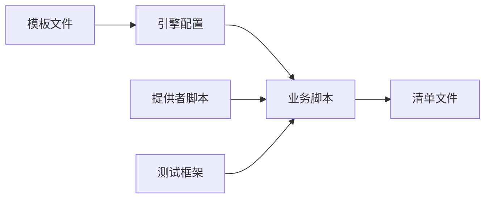

# 网络API

<cite>
**本文引用的文件**   
- [README.md](file://README.md)
- [package.json](file://package.json)
- [surgio.conf.js](file://surgio.conf.js)
- [Mirror/MANIFEST.json](file://Mirror/MANIFEST.json)
- [Scripts/ENGINE-MANIFEST.json](file://Scripts/ENGINE-MANIFEST.json)
- [Profile/QX.conf](file://Profile/QX.conf)
- [Profile/Surge.conf](file://Profile/Surge.conf)
- [Profile/Loon.lcf](file://Profile/Loon.lcf)
- [template/quantumultx.tpl](file://template/quantumultx.tpl)
- [template/surge.tpl](file://template/surge.tpl)
- [template/loon.tpl](file://template/loon.tpl)
- [provider/tokyo.js](file://provider/tokyo.js)
- [test/harness.js](file://test/harness.js)
- [test/run-tests.js](file://test/run-tests.js)
</cite>

## 目录
1. [简介](#简介)
2. [项目结构](#项目结构)
3. [核心组件](#核心组件)
4. [架构总览](#架构总览)
5. [详细组件分析](#详细组件分析)
6. [依赖关系分析](#依赖关系分析)
7. [性能考虑](#性能考虑)
8. [故障排查指南](#故障排查指南)
9. [结论](#结论)
10. [附录](#附录)

## 简介
本仓库是一个面向多代理引擎（Quantumult X、Surge、Loon）的规则与脚本分发系统。其“网络API”并非传统意义上的服务端HTTP API，而是通过配置模板、清单与脚本在客户端侧完成规则加载、资源拉取与状态上报等网络交互。本文档聚焦于：
- HTTP请求与WebSocket连接的使用场景与实现位置
- 请求构造与响应处理模式
- 错误重试机制与网络状态管理
- 认证授权、缓存策略与性能优化要点
- 最佳实践与调试技巧

## 项目结构
仓库采用“按功能域+引擎适配”的组织方式：
- Profile：各引擎的配置文件入口，定义规则与脚本引用
- Scripts：具体业务脚本，负责数据抓取、解析与上报
- Mirror：镜像清单与静态资源，供客户端拉取
- provider：动态提供者脚本，用于生成或更新规则
- template：模板文件，用于生成不同引擎的配置
- test：测试框架与用例，覆盖脚本行为与网络交互

图表来源
- [Profile/QX.conf](file://Profile/QX.conf)
- [Profile/Surge.conf](file://Profile/Surge.conf)
- [Profile/Loon.lcf](file://Profile/Loon.lcf)
- [template/quantumultx.tpl](file://template/quantumultx.tpl)
- [template/surge.tpl](file://template/surge.tpl)
- [template/loon.tpl](file://template/loon.tpl)
- [Scripts/ENGINE-MANIFEST.json](file://Scripts/ENGINE-MANIFEST.json)
- [Mirror/MANIFEST.json](file://Mirror/MANIFEST.json)
- [provider/tokyo.js](file://provider/tokyo.js)
- [test/harness.js](file://test/harness.js)
- [test/run-tests.js](file://test/run-tests.js)

章节来源
- [README.md](file://README.md)
- [package.json](file://package.json)

## 核心组件
- 配置模板与生成器：将通用模板渲染为各引擎可用配置，包含脚本引用、规则路径与网络参数
- 清单与版本管理：MANIFEST.json与ENGINE-MANIFEST.json描述资源版本、校验与更新策略
- 脚本执行环境：Scripts下脚本在各引擎内执行，发起HTTP请求、处理响应、进行本地缓存与上报
- 提供者脚本：provider/tokyo.js等动态生成规则内容，可能涉及远程数据源与缓存策略
- 测试框架：harness与runner提供网络请求模拟、断言与结果汇总

章节来源
- [template/quantumultx.tpl](file://template/quantumultx.tpl)
- [template/surge.tpl](file://template/surge.tpl)
- [template/loon.tpl](file://template/loon.tpl)
- [Mirror/MANIFEST.json](file://Mirror/MANIFEST.json)
- [Scripts/ENGINE-MANIFEST.json](file://Scripts/ENGINE-MANIFEST.json)
- [provider/tokyo.js](file://provider/tokyo.js)
- [test/harness.js](file://test/harness.js)
- [test/run-tests.js](file://test/run-tests.js)

## 架构总览
整体流程围绕“模板渲染→配置下发→脚本执行→网络请求→响应处理→缓存与上报”展开。

图表来源
- [template/quantumultx.tpl](file://template/quantumultx.tpl)
- [template/surge.tpl](file://template/surge.tpl)
- [template/loon.tpl](file://template/loon.tpl)
- [Scripts/ENGINE-MANIFEST.json](file://Scripts/ENGINE-MANIFEST.json)
- [Mirror/MANIFEST.json](file://Mirror/MANIFEST.json)

## 详细组件分析

### 清单与版本管理（MANIFEST）
- MANIFEST.json：集中声明镜像资源、版本号、校验值与更新策略，供脚本拉取与校验
- ENGINE-MANIFEST.json：针对各引擎的脚本清单，定义脚本名称、版本、依赖与执行条件

图表来源
- [Mirror/MANIFEST.json](file://Mirror/MANIFEST.json)
- [Scripts/ENGINE-MANIFEST.json](file://Scripts/ENGINE-MANIFEST.json)

章节来源
- [Mirror/MANIFEST.json](file://Mirror/MANIFEST.json)
- [Scripts/ENGINE-MANIFEST.json](file://Scripts/ENGINE-MANIFEST.json)

### 提供者脚本（provider/tokyo.js）
- 作用：动态生成或聚合规则内容，可能从远端数据源拉取并合并本地策略
- 关键点：网络请求封装、失败重试、缓存策略、增量更新

章节来源
- [provider/tokyo.js](file://provider/tokyo.js)

### 脚本执行与环境（Scripts）
- 脚本职责：发起HTTP请求、解析响应、写入本地缓存、上报健康状态与流量统计
- 常见模式：
  - 请求构造：统一设置超时、重试次数、UA与鉴权头
  - 响应处理：结构化解析、字段校验、降级策略
  - 缓存策略：基于时间戳与ETag/Last-Modified的强/弱缓存
  - 错误处理：区分网络错误、业务错误与超时，记录日志并上报

章节来源
- [Scripts/ENGINE-MANIFEST.json](file://Scripts/ENGINE-MANIFEST.json)

### 配置模板与生成（template/*.tpl）
- 模板作用：抽象通用配置片段，渲染出各引擎可用的完整配置
- 关注点：
  - 脚本引用与参数注入
  - 规则路径与镜像地址
  - 网络参数（超时、重试、缓存开关）

章节来源
- [template/quantumultx.tpl](file://template/quantumultx.tpl)
- [template/surge.tpl](file://template/surge.tpl)
- [template/loon.tpl](file://template/loon.tpl)

### 引擎配置入口（Profile/*.conf）
- QX.conf、Surge.conf、Loon.lcf：作为各引擎的入口，引用模板生成的内容与脚本
- 网络相关：定义规则匹配、脚本触发条件与代理转发

章节来源
- [Profile/QX.conf](file://Profile/QX.conf)
- [Profile/Surge.conf](file://Profile/Surge.conf)
- [Profile/Loon.lcf](file://Profile/Loon.lcf)

### 测试框架（test/harness.js, test/run-tests.js）
- harness：提供统一的测试上下文、网络请求模拟与断言工具
- runner：编排测试用例，汇总结果，支持并行执行

章节来源
- [test/harness.js](file://test/harness.js)
- [test/run-tests.js](file://test/run-tests.js)

## 依赖关系分析
- 模板与配置：模板文件被渲染为各引擎配置，依赖清单与脚本清单
- 脚本与清单：脚本依赖清单进行版本管理与资源定位
- 提供者与脚本：提供者脚本产出规则内容，供脚本消费
- 测试与脚本：测试框架模拟网络环境，验证脚本行为

图表来源
- [template/quantumultx.tpl](file://template/quantumultx.tpl)
- [template/surge.tpl](file://template/surge.tpl)
- [template/loon.tpl](file://template/loon.tpl)
- [Scripts/ENGINE-MANIFEST.json](file://Scripts/ENGINE-MANIFEST.json)
- [Mirror/MANIFEST.json](file://Mirror/MANIFEST.json)
- [provider/tokyo.js](file://provider/tokyo.js)
- [test/harness.js](file://test/harness.js)
- [test/run-tests.js](file://test/run-tests.js)

章节来源
- [package.json](file://package.json)

## 性能考虑
- 缓存策略
  - 强缓存：利用ETag/Last-Modified减少带宽与延迟
  - 弱缓存：基于时间戳的短期缓存，平衡实时性与性能
- 请求优化
  - 合理超时与重试：避免雪崩与无效等待
  - 并发控制：限制同时请求数，防止阻塞
- 资源瘦身
  - 按需加载：仅拉取必要规则与脚本
  - 增量更新：基于差异的清单与内容更新
- 监控与诊断
  - 指标上报：成功率、时延、错误码分布
  - 日志分级：关键路径打点，便于问题定位

[本节为通用指导，不直接分析具体文件]

## 故障排查指南
- 常见问题
  - 清单校验失败：检查哈希/签名与网络连通性
  - 脚本执行异常：查看引擎日志与脚本报错堆栈
  - 缓存污染：清理本地缓存并强制刷新清单
- 调试技巧
  - 启用详细日志：在脚本中增加请求/响应打印
  - 模拟网络：使用测试框架mock外部服务
  - 分步验证：先验证清单拉取，再验证脚本执行

章节来源
- [test/harness.js](file://test/harness.js)
- [test/run-tests.js](file://test/run-tests.js)

## 结论
本项目的“网络API”以配置模板、清单与脚本为核心，通过代理引擎在客户端侧完成网络交互。通过规范的清单管理、缓存策略与错误处理，实现了稳定高效的规则与资源分发。建议在实际使用中遵循本文的最佳实践，结合测试框架进行持续验证与优化。

[本节为总结性内容，不直接分析具体文件]

## 附录
- 术语说明
  - 清单：描述资源版本、校验与更新策略的元数据文件
  - 模板：可复用的配置片段，渲染为各引擎可用格式
  - 提供者：动态生成规则内容的脚本
- 参考文件
  - README.md：项目概述与使用说明
  - package.json：依赖与脚本命令

章节来源
- [README.md](file://README.md)
- [package.json](file://package.json)