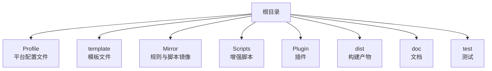
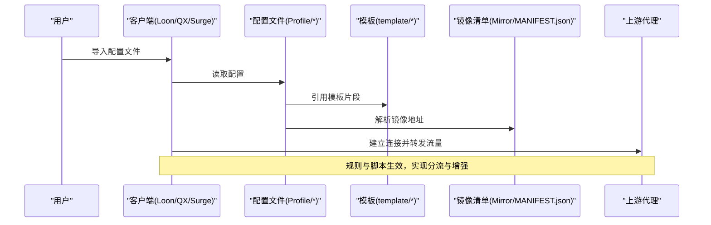
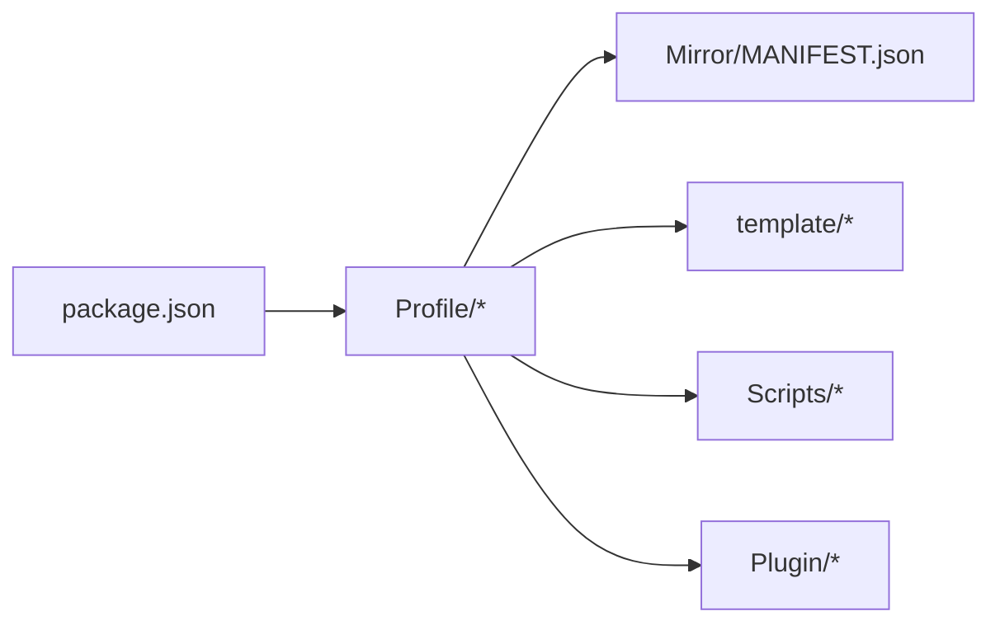

# 快速开始

<cite>
**本文引用的文件**   
- [README.md](file://README.md)
- [Profile/Loon.lcf](file://Profile/Loon.lcf)
- [Profile/QX.conf](file://Profile/QX.conf)
- [Profile/Surge.conf](file://Profile/Surge.conf)
- [template/loon.tpl](file://template/loon.tpl)
- [template/quantumultx.tpl](file://template/quantumultx.tpl)
- [template/surge.tpl](file://template/surge.tpl)
- [Mirror/MANIFEST.json](file://Mirror/MANIFEST.json)
- [package.json](file://package.json)
</cite>

## 目录
1. [简介](#简介)
2. [项目结构](#项目结构)
3. [核心组件](#核心组件)
4. [架构总览](#架构总览)
5. [详细组件分析](#详细组件分析)
6. [依赖分析](#依赖分析)
7. [性能注意事项](#性能注意事项)
8. [故障排除指南](#故障排除指南)
9. [结论](#结论)
10. [附录](#附录)

## 简介
本指南面向首次接触该配置管理项目的用户，目标是帮助你在最短时间内完成安装、基础配置与首次运行验证。内容涵盖：
- 平台适配：Loon、Quantumult X、Surge 的配置文件位置与导入方式
- 配置文件结构与关键选项说明
- 首次运行验证步骤
- 常见问题与解决方案

## 项目结构
仓库采用“按功能与平台分层”的组织方式：
- Profile：各平台的最终可导入配置文件（Loon、QX、Surge）
- template：模板文件，用于生成或校验不同平台的配置片段
- Mirror：规则与脚本镜像清单及资源
- Scripts：各类增强脚本
- Plugin：插件集合
- dist：构建产物（按需使用）
- doc：文档与审计记录
- test：测试用例与测试脚本

图表来源
- [Profile/Loon.lcf](file://Profile/Loon.lcf)
- [Profile/QX.conf](file://Profile/QX.conf)
- [Profile/Surge.conf](file://Profile/Surge.conf)
- [template/loon.tpl](file://template/loon.tpl)
- [template/quantumultx.tpl](file://template/quantumultx.tpl)
- [template/surge.tpl](file://template/surge.tpl)
- [Mirror/MANIFEST.json](file://Mirror/MANIFEST.json)

章节来源
- [README.md](file://README.md)

## 核心组件
- 平台配置文件
  - Loon：位于 Profile/Loon.lcf，用于在 Loon 中直接导入并启用规则、脚本与插件
  - Quantumult X：位于 Profile/QX.conf，包含 QX 所需的策略组、规则与脚本引用
  - Surge：位于 Profile/Surge.conf，包含 Surge 的策略组、规则与脚本引用
- 模板文件
  - template/loon.tpl、template/quantumultx.tpl、template/surge.tpl：提供各平台的基础结构与常用片段，便于扩展与维护
- 镜像清单
  - Mirror/MANIFEST.json：集中管理规则与脚本的镜像地址与版本信息，确保一致性

章节来源
- [Profile/Loon.lcf](file://Profile/Loon.lcf)
- [Profile/QX.conf](file://Profile/QX.conf)
- [Profile/Surge.conf](file://Profile/Surge.conf)
- [template/loon.tpl](file://template/loon.tpl)
- [template/quantumultx.tpl](file://template/quantumultx.tpl)
- [template/surge.tpl](file://template/surge.tpl)
- [Mirror/MANIFEST.json](file://Mirror/MANIFEST.json)

## 架构总览
整体流程：用户在目标设备导入对应平台的配置文件后，客户端根据配置加载规则、脚本与插件，并通过上游代理进行流量转发。镜像清单统一管理外部资源，保证规则与脚本的稳定获取。

图表来源
- [Profile/Loon.lcf](file://Profile/Loon.lcf)
- [Profile/QX.conf](file://Profile/QX.conf)
- [Profile/Surge.conf](file://Profile/Surge.conf)
- [template/loon.tpl](file://template/loon.tpl)
- [template/quantumultx.tpl](file://template/quantumultx.tpl)
- [template/surge.tpl](file://template/surge.tpl)
- [Mirror/MANIFEST.json](file://Mirror/MANIFEST.json)

## 详细组件分析

### Loon 快速开始
- 安装与导入
  - 在 Loon 中通过“订阅/导入”功能导入 Profile/Loon.lcf
  - 若需本地编辑，可将 Loon.lcf 复制到 Loon 的配置目录并重新加载
- 基本配置要点
  - 确认上游代理已正确设置
  - 检查规则与脚本是否成功加载
  - 如需自定义，参考 template/loon.tpl 的结构进行扩展
- 首次运行验证
  - 打开任意应用访问网络，观察是否按预期分流
  - 查看日志确认脚本与插件是否执行

章节来源
- [Profile/Loon.lcf](file://Profile/Loon.lcf)
- [template/loon.tpl](file://template/loon.tpl)

### Quantumult X 快速开始
- 安装与导入
  - 在 QX 中通过“订阅/导入”功能导入 Profile/QX.conf
  - 也可将 QX.conf 放入 QX 的配置目录并刷新
- 基本配置要点
  - 检查策略组与规则是否正确
  - 确认脚本路径与权限
  - 参考 template/quantumultx.tpl 进行片段扩展
- 首次运行验证
  - 访问常见网站与应用，验证分流与广告拦截效果
  - 查看 QX 日志确认脚本执行状态

章节来源
- [Profile/QX.conf](file://Profile/QX.conf)
- [template/quantumultx.tpl](file://template/quantumultx.tpl)

### Surge 快速开始
- 安装与导入
  - 在 Surge 中通过“订阅/导入”功能导入 Profile/Surge.conf
  - 或将 Surge.conf 放入 Surge 的配置目录并重新加载
- 基本配置要点
  - 确认策略组、规则与脚本引用无误
  - 检查上游代理与 DNS 设置
  - 参考 template/surge.tpl 进行片段扩展
- 首次运行验证
  - 访问目标站点与应用，验证分流与增强功能
  - 查看 Surge 日志确认脚本与规则生效

章节来源
- [Profile/Surge.conf](file://Profile/Surge.conf)
- [template/surge.tpl](file://template/surge.tpl)

### 配置文件结构与关键选项
- 通用结构
  - 策略组：定义流量路由的目标节点或直连
  - 规则：匹配域名/IP/ASN 等条件，决定走哪条策略
  - 脚本：注入行为增强（如去广告、数据增强）
  - 插件：扩展客户端能力（如特定应用优化）
- 关键选项
  - 上游代理：必须正确配置以保证连通性
  - 镜像地址：由 Mirror/MANIFEST.json 统一维护，避免硬编码
  - 调试开关：开启后可查看详细日志，便于定位问题

章节来源
- [Profile/Loon.lcf](file://Profile/Loon.lcf)
- [Profile/QX.conf](file://Profile/QX.conf)
- [Profile/Surge.conf](file://Profile/Surge.conf)
- [Mirror/MANIFEST.json](file://Mirror/MANIFEST.json)

### 镜像与资源管理
- MANIFEST.json 集中管理规则与脚本的镜像地址与版本
- 建议优先使用镜像源以提升稳定性与速度
- 当镜像不可用时，可在 MANIFEST.json 中切换备用地址

章节来源
- [Mirror/MANIFEST.json](file://Mirror/MANIFEST.json)

## 依赖分析
- 平台依赖
  - Loon、QX、Surge 各自对配置文件格式与脚本语法有差异，需分别维护
- 资源依赖
  - 规则与脚本通过 MANIFEST.json 管理，减少分散配置带来的不一致
- 构建与发布
  - package.json 提供脚本与工具链支持（如校验、部署），可按需使用

图表来源
- [Profile/Loon.lcf](file://Profile/Loon.lcf)
- [Profile/QX.conf](file://Profile/QX.conf)
- [Profile/Surge.conf](file://Profile/Surge.conf)
- [Mirror/MANIFEST.json](file://Mirror/MANIFEST.json)
- [template/loon.tpl](file://template/loon.tpl)
- [template/quantumultx.tpl](file://template/quantumultx.tpl)
- [template/surge.tpl](file://template/surge.tpl)
- [package.json](file://package.json)

章节来源
- [package.json](file://package.json)

## 性能注意事项
- 合理裁剪规则集：仅启用必要的规则与脚本，减少匹配开销
- 使用就近镜像：选择延迟更低的镜像源，提升下载与更新速度
- 控制脚本复杂度：避免过多或过重的脚本影响运行时性能
- 缓存与复用：尽量复用公共片段与模板，降低重复计算

[本节为通用指导，不直接分析具体文件]

## 故障排除指南
- 无法导入配置
  - 检查配置文件路径与权限
  - 确认客户端版本支持当前配置格式
- 规则未生效
  - 核对策略组与规则顺序
  - 检查上游代理连通性与 DNS 设置
- 脚本未执行
  - 确认脚本路径与权限
  - 查看客户端日志中的错误信息
- 镜像不可用
  - 在 MANIFEST.json 中切换到备用镜像地址
  - 检查网络环境是否能访问镜像源

章节来源
- [Mirror/MANIFEST.json](file://Mirror/MANIFEST.json)
- [Profile/Loon.lcf](file://Profile/Loon.lcf)
- [Profile/QX.conf](file://Profile/QX.conf)
- [Profile/Surge.conf](file://Profile/Surge.conf)

## 结论
通过本指南，你应已完成 Loon、Quantumult X、Surge 的安装与基础配置，并能进行首次运行验证。建议后续根据实际需求逐步扩展规则与脚本，同时关注镜像源的可用性与性能。

[本节为总结，不直接分析具体文件]

## 附录
- 推荐操作顺序
  - 导入对应平台的配置文件
  - 检查上游代理与 DNS
  - 验证规则与脚本生效
  - 根据需要扩展模板与镜像源
- 参考资料
  - 各平台官方文档
  - 仓库内 README 与文档目录

[本节为补充信息，不直接分析具体文件]