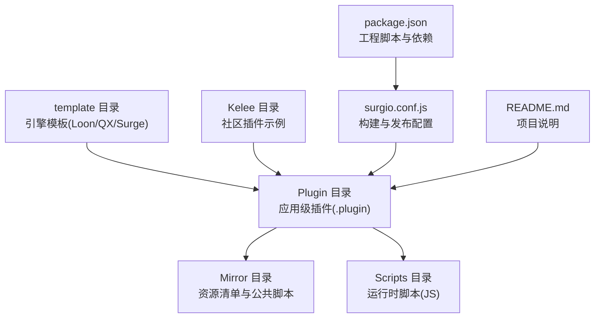
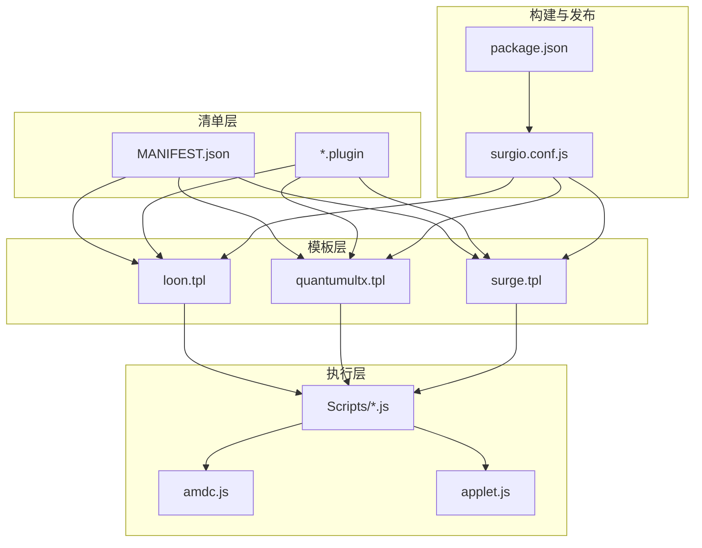
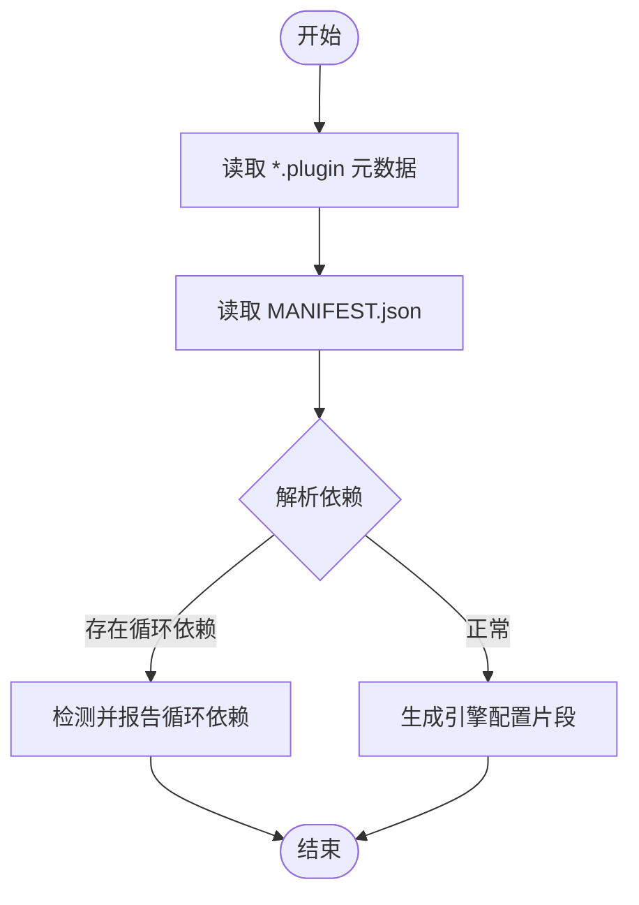
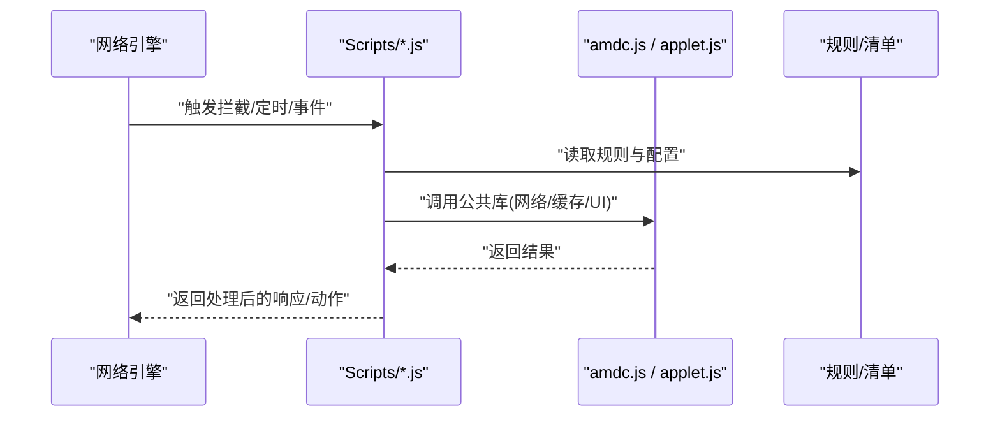
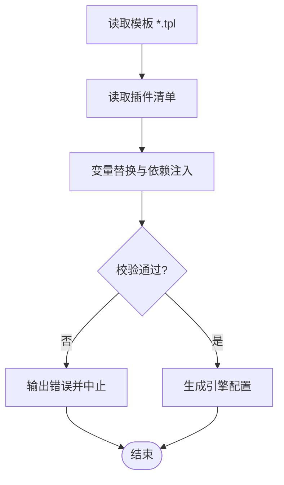
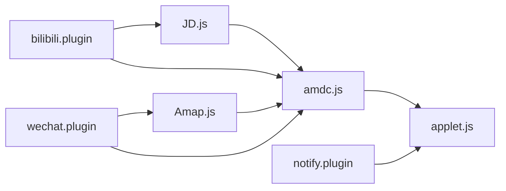

# 插件系统

<cite>
**本文引用的文件**   
- [README.md](file://README.md)
- [package.json](file://package.json)
- [surgio.conf.js](file://surgio.conf.js)
- [template/loon.tpl](file://template/loon.tpl)
- [template/quantumultx.tpl](file://template/quantumultx.tpl)
- [template/surge.tpl](file://template/surge.tpl)
- [Plugin/bilibili.plugin](file://Plugin/bilibili.plugin)
- [Plugin/wechat.plugin](file://Plugin/wechat.plugin)
- [Plugin/notify.plugin](file://Plugin/notify.plugin)
- [Mirror/MANIFEST.json](file://Mirror/MANIFEST.json)
- [Mirror/amdc.js](file://Mirror/amdc.js)
- [Mirror/applet.js](file://Mirror/applet.js)
- [Scripts/ENGINE-MANIFEST.json](file://Scripts/ENGINE-MANIFEST.json)
- [Scripts/JD.js](file://Scripts/JD.js)
- [Scripts/Amap.js](file://Scripts/Amap.js)
- [Kelee/Prevent_DNS_Leaks.plugin](file://Kelee/Prevent_DNS_Leaks.plugin)
- [Kelee/YouTube_remove_ads.plugin](file://Kelee/YouTube_remove_ads.plugin)
</cite>

## 目录
1. [简介](#简介)
2. [项目结构](#项目结构)
3. [核心组件](#核心组件)
4. [架构总览](#架构总览)
5. [详细组件分析](#详细组件分析)
6. [依赖关系分析](#依赖关系分析)
7. [性能考虑](#性能考虑)
8. [故障排查指南](#故障排查指南)
9. [结论](#结论)
10. [附录](#附录)

## 简介
本仓库围绕“插件系统”构建，提供面向 Loon、Quantumult X 与 Surge 三类网络工具的统一插件生态。其目标包括：
- 统一的插件定义与生命周期管理（加载、初始化、运行、卸载）
- 多引擎适配与规则脚本分发
- 插件间的依赖管理与冲突解决策略
- 开发模板、API 参考、调试与性能优化建议
- 现有插件的功能说明与使用方法

该文档从架构到实现细节，再到使用与排障，帮助开发者快速上手并高效维护插件生态。

## 项目结构
仓库采用按功能域与目标引擎分层组织的方式：
- Plugin：各应用级插件入口（.plugin），用于描述插件元数据、规则与脚本引用
- Mirror：镜像与资源清单（MANIFEST.json）、公共脚本（amdc.js、applet.js）等
- Scripts：运行时脚本（JS），由引擎执行，承载具体业务逻辑
- template：Loon、Quantumult X、Surge 的模板文件，用于生成或校验配置
- Kelee：社区贡献的独立插件示例
- surgio.conf.js：构建与发布相关配置
- package.json：工程依赖与脚本命令
- README.md：项目说明与使用说明

图表来源
- [surgio.conf.js:1-200](file://surgio.conf.js#L1-L200)
- [package.json:1-200](file://package.json#L1-L200)
- [template/loon.tpl:1-200](file://template/loon.tpl#L1-L200)
- [template/quantumultx.tpl:1-200](file://template/quantumultx.tpl#L1-L200)
- [template/surge.tpl:1-200](file://template/surge.tpl#L1-L200)

章节来源
- [README.md:1-200](file://README.md#L1-L200)
- [package.json:1-200](file://package.json#L1-L200)
- [surgio.conf.js:1-200](file://surgio.conf.js#L1-L200)

## 核心组件
- 插件定义与元数据
  - .plugin 文件作为插件入口，声明名称、版本、适用引擎、依赖与脚本路径等
  - MANIFEST.json 集中管理镜像资源与脚本清单，便于统一分发与更新
- 运行时脚本
  - Scripts/*.js 为实际执行逻辑，通常由引擎在请求拦截、定时任务或事件回调中调用
  - ENGINE-MANIFEST.json 描述脚本引擎能力与版本约束
- 模板与生成器
  - template/*.tpl 提供 Loon、QX、Surge 的配置模板，用于生成最终配置文件
  - surgio.conf.js 驱动构建流程，将模板与插件清单合并输出
- 公共库与工具
  - Mirror/amdc.js、Mirror/applet.js 提供通用能力（如模块加载、网络封装、UI 交互等）

章节来源
- [Mirror/MANIFEST.json:1-200](file://Mirror/MANIFEST.json#L1-L200)
- [Scripts/ENGINE-MANIFEST.json:1-200](file://Scripts/ENGINE-MANIFEST.json#L1-L200)
- [Mirror/amdc.js:1-200](file://Mirror/amdc.js#L1-L200)
- [Mirror/applet.js:1-200](file://Mirror/applet.js#L1-L200)
- [template/loon.tpl:1-200](file://template/loon.tpl#L1-L200)
- [template/quantumultx.tpl:1-200](file://template/quantumultx.tpl#L1-L200)
- [template/surge.tpl:1-200](file://template/surge.tpl#L1-L200)
- [surgio.conf.js:1-200](file://surgio.conf.js#L1-L200)

## 架构总览
插件系统采用“清单驱动 + 模板渲染 + 脚本执行”的分层架构：
- 清单层：MANIFEST.json 与 *.plugin 描述插件元数据、依赖与资源
- 模板层：*.tpl 根据清单与引擎差异生成最终配置
- 执行层：Scripts/*.js 在引擎中执行，完成请求拦截、数据处理与结果回写
- 工具层：amdc.js、applet.js 提供跨引擎兼容能力

图表来源
- [Mirror/MANIFEST.json:1-200](file://Mirror/MANIFEST.json#L1-L200)
- [template/loon.tpl:1-200](file://template/loon.tpl#L1-L200)
- [template/quantumultx.tpl:1-200](file://template/quantumultx.tpl#L1-L200)
- [template/surge.tpl:1-200](file://template/surge.tpl#L1-L200)
- [Scripts/ENGINE-MANIFEST.json:1-200](file://Scripts/ENGINE-MANIFEST.json#L1-L200)
- [Mirror/amdc.js:1-200](file://Mirror/amdc.js#L1-L200)
- [Mirror/applet.js:1-200](file://Mirror/applet.js#L1-L200)
- [surgio.conf.js:1-200](file://surgio.conf.js#L1-L200)
- [package.json:1-200](file://package.json#L1-L200)

## 详细组件分析

### 插件定义与清单（.plugin 与 MANIFEST.json）
- .plugin 文件负责声明插件基本信息、适用引擎、依赖项与脚本路径
- MANIFEST.json 集中管理资源与脚本清单，支持版本控制与增量更新
- 通过清单解析，构建器可生成不同引擎所需的配置片段

图表来源
- [Plugin/bilibili.plugin:1-200](file://Plugin/bilibili.plugin#L1-L200)
- [Plugin/wechat.plugin:1-200](file://Plugin/wechat.plugin#L1-L200)
- [Mirror/MANIFEST.json:1-200](file://Mirror/MANIFEST.json#L1-L200)

章节来源
- [Plugin/bilibili.plugin:1-200](file://Plugin/bilibili.plugin#L1-L200)
- [Plugin/wechat.plugin:1-200](file://Plugin/wechat.plugin#L1-L200)
- [Mirror/MANIFEST.json:1-200](file://Mirror/MANIFEST.json#L1-L200)

### 运行时脚本（Scripts/*.js）
- 脚本在引擎中执行，处理请求拦截、响应修改、定时任务与通知
- ENGINE-MANIFEST.json 描述脚本引擎能力，确保兼容性
- 典型流程：接收上下文 -> 解析请求/响应 -> 调用公共库 -> 返回处理结果

图表来源
- [Scripts/JD.js:1-200](file://Scripts/JD.js#L1-L200)
- [Scripts/Amap.js:1-200](file://Scripts/Amap.js#L1-L200)
- [Scripts/ENGINE-MANIFEST.json:1-200](file://Scripts/ENGINE-MANIFEST.json#L1-L200)
- [Mirror/amdc.js:1-200](file://Mirror/amdc.js#L1-L200)
- [Mirror/applet.js:1-200](file://Mirror/applet.js#L1-L200)

章节来源
- [Scripts/JD.js:1-200](file://Scripts/JD.js#L1-L200)
- [Scripts/Amap.js:1-200](file://Scripts/Amap.js#L1-L200)
- [Scripts/ENGINE-MANIFEST.json:1-200](file://Scripts/ENGINE-MANIFEST.json#L1-L200)
- [Mirror/amdc.js:1-200](file://Mirror/amdc.js#L1-L200)
- [Mirror/applet.js:1-200](file://Mirror/applet.js#L1-L200)

### 模板与构建（template/*.tpl 与 surgio.conf.js）
- 模板文件定义不同引擎的配置结构与语法差异
- surgio.conf.js 驱动构建流程，将插件清单与模板合并，输出最终配置
- 构建过程需保证模板变量替换、依赖注入与错误检查

图表来源
- [template/loon.tpl:1-200](file://template/loon.tpl#L1-L200)
- [template/quantumultx.tpl:1-200](file://template/quantumultx.tpl#L1-L200)
- [template/surge.tpl:1-200](file://template/surge.tpl#L1-L200)
- [surgio.conf.js:1-200](file://surgio.conf.js#L1-L200)

章节来源
- [template/loon.tpl:1-200](file://template/loon.tpl#L1-L200)
- [template/quantumultx.tpl:1-200](file://template/quantumultx.tpl#L1-L200)
- [template/surge.tpl:1-200](file://template/surge.tpl#L1-L200)
- [surgio.conf.js:1-200](file://surgio.conf.js#L1-L200)

### 公共库与工具（amdc.js、applet.js）
- amdc.js：模块加载与依赖管理，提供跨引擎兼容的 API
- applet.js：应用层工具，封装网络请求、缓存、UI 交互等常用能力
- 脚本应优先复用公共库，避免重复实现与不一致行为

章节来源
- [Mirror/amdc.js:1-200](file://Mirror/amdc.js#L1-L200)
- [Mirror/applet.js:1-200](file://Mirror/applet.js#L1-L200)

### 现有插件功能与用法
- bilibili.plugin：B站去广告与增强功能，依赖对应脚本与规则
- wechat.plugin：微信相关优化（如去广告、隐私保护），需配合脚本与规则
- notify.plugin：通知类插件，用于状态提醒与日志上报

章节来源
- [Plugin/bilibili.plugin:1-200](file://Plugin/bilibili.plugin#L1-L200)
- [Plugin/wechat.plugin:1-200](file://Plugin/wechat.plugin#L1-L200)
- [Plugin/notify.plugin:1-200](file://Plugin/notify.plugin#L1-L200)

### 社区插件示例（Kelee）
- Prevent_DNS_Leaks.plugin：DNS 泄漏防护，适用于多引擎
- YouTube_remove_ads.plugin：YouTube 去广告，依赖脚本与规则

章节来源
- [Kelee/Prevent_DNS_Leaks.plugin:1-200](file://Kelee/Prevent_DNS_Leaks.plugin#L1-L200)
- [Kelee/YouTube_remove_ads.plugin:1-200](file://Kelee/YouTube_remove_ads.plugin#L1-L200)

## 依赖关系分析
- 插件间依赖通过清单声明，构建时进行解析与校验
- 循环依赖检测与冲突解决策略需在构建阶段明确
- 脚本与公共库的版本兼容性由 ENGINE-MANIFEST.json 约束

图表来源
- [Plugin/bilibili.plugin:1-200](file://Plugin/bilibili.plugin#L1-L200)
- [Plugin/wechat.plugin:1-200](file://Plugin/wechat.plugin#L1-L200)
- [Plugin/notify.plugin:1-200](file://Plugin/notify.plugin#L1-L200)
- [Scripts/JD.js:1-200](file://Scripts/JD.js#L1-L200)
- [Scripts/Amap.js:1-200](file://Scripts/Amap.js#L1-L200)
- [Mirror/amdc.js:1-200](file://Mirror/amdc.js#L1-L200)
- [Mirror/applet.js:1-200](file://Mirror/applet.js#L1-L200)

章节来源
- [Mirror/MANIFEST.json:1-200](file://Mirror/MANIFEST.json#L1-L200)
- [Scripts/ENGINE-MANIFEST.json:1-200](file://Scripts/ENGINE-MANIFEST.json#L1-L200)

## 性能考虑
- 脚本执行效率：避免阻塞式 I/O，合理使用缓存与异步
- 内存占用：减少全局变量与重复对象创建，及时释放资源
- 网络请求：批量合并、超时与重试策略，降低延迟
- 模板渲染：预编译与增量更新，减少构建时间
- 公共库复用：统一实现，避免重复代码与不一致开销

[本节为通用指导，不直接分析具体文件]

## 故障排查指南
- 插件加载失败：检查 .plugin 元数据与 MANIFEST.json 一致性
- 脚本执行异常：查看 ENGINE-MANIFEST.json 能力约束与日志
- 依赖冲突：识别循环依赖与版本不匹配，调整依赖声明
- 模板生成错误：校验模板变量与构建配置
- 性能问题：定位热点脚本与频繁网络请求，优化逻辑

章节来源
- [Scripts/ENGINE-MANIFEST.json:1-200](file://Scripts/ENGINE-MANIFEST.json#L1-L200)
- [Mirror/MANIFEST.json:1-200](file://Mirror/MANIFEST.json#L1-L200)
- [surgio.conf.js:1-200](file://surgio.conf.js#L1-L200)

## 结论
本插件系统以清单驱动为核心，结合模板渲染与脚本执行，实现了跨引擎的统一插件生态。通过清晰的依赖管理与公共库复用，开发者可快速构建、测试与发布插件。建议遵循本文档的最佳实践，持续优化性能与稳定性。

[本节为总结性内容，不直接分析具体文件]

## 附录
- 插件开发模板：参考 template/*.tpl 与 PLUGIN 示例
- API 参考：基于 amdc.js 与 applet.js 提供的公共接口
- 调试建议：启用引擎日志，逐步验证脚本与模板
- 性能优化：监控热点路径，引入缓存与异步策略

[本节为补充信息，不直接分析具体文件]