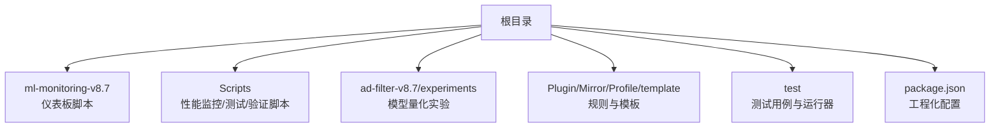
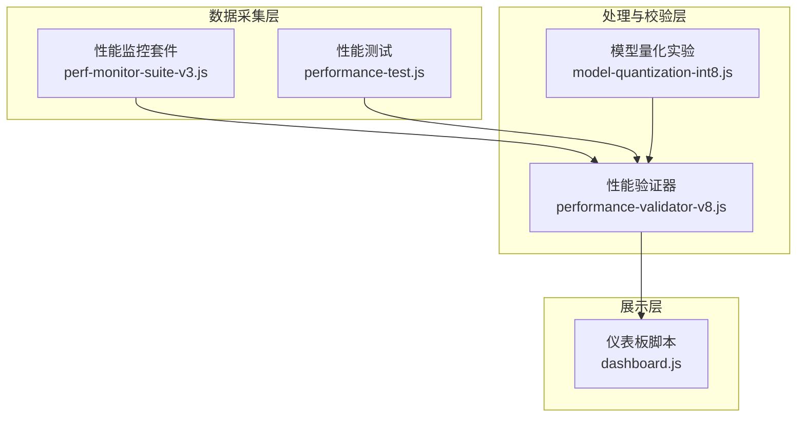
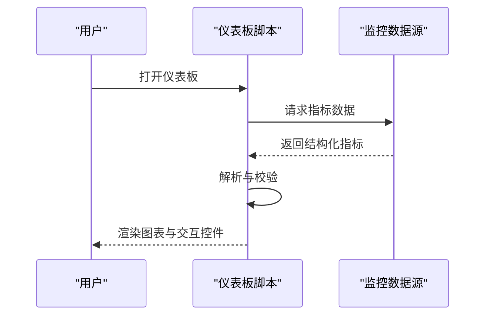
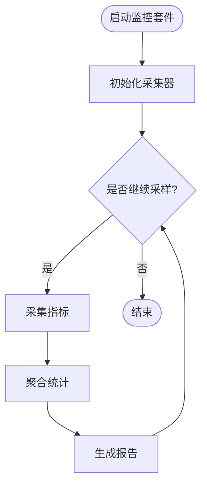
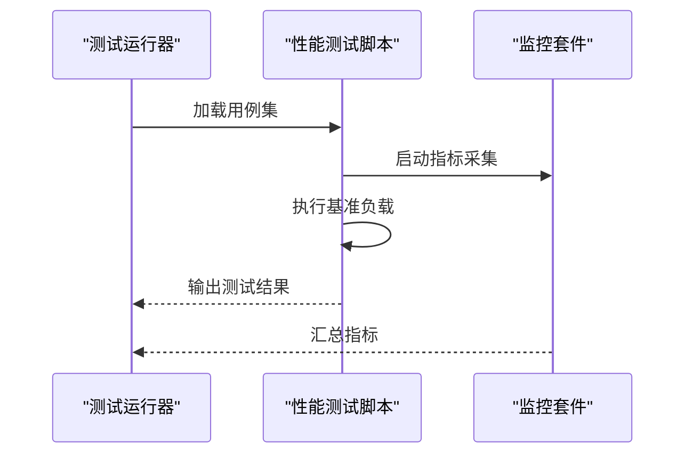
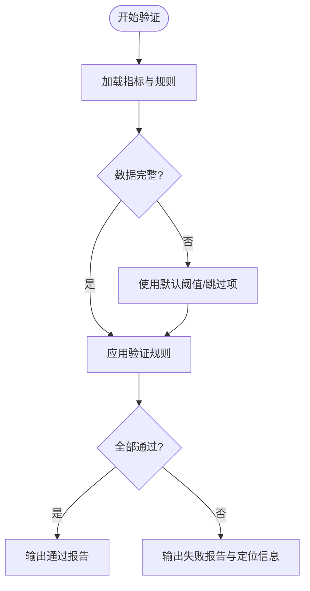
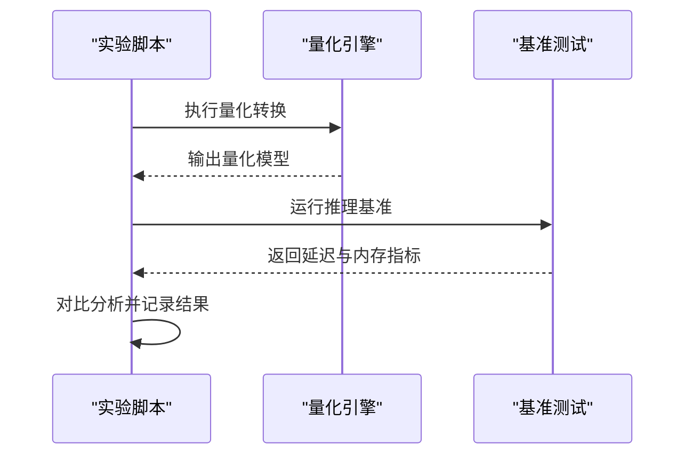
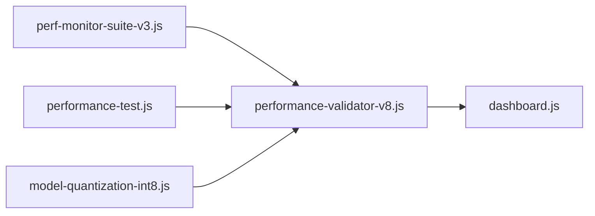

# 机器学习监控系统

<cite>
**本文档引用的文件**   
- [README.md](file://README.md)
- [package.json](file://package.json)
- [ml-monitoring-v8.7/dashboard.js](file://ml-monitoring-v8.7/dashboard.js)
- [Scripts/perf-monitor-suite-v3.js](file://Scripts/perf-monitor-suite-v3.js)
- [Scripts/performance-test.js](file://Scripts/performance-test.js)
- [Scripts/performance-validator-v8.js](file://Scripts/performance-validator-v8.js)
- [ad-filter-v8.7/experiments/model-quantization-int8.js](file://ad-filter-v8.7/experiments/model量化-int8.js)
</cite>

## 目录
1. [简介](#简介)
2. [项目结构](#项目结构)
3. [核心组件](#核心组件)
4. [架构总览](#架构总览)
5. [详细组件分析](#详细组件分析)
6. [依赖关系分析](#依赖关系分析)
7. [性能考量](#性能考量)
8. [故障排查指南](#故障排查指南)
9. [结论](#结论)
10. [附录](#附录)（如有需要）

## 简介
本仓库围绕“机器学习监控系统”的目标，提供面向网络与脚本运行环境的性能监控、验证与可视化能力。系统以 JavaScript/Node 生态为核心，结合脚本引擎与测试套件，形成从数据采集、指标校验到仪表板展示的闭环。文档旨在帮助读者快速理解系统架构、关键模块职责、数据流与集成点，并提供可操作的排障建议与优化方向。

## 项目结构
仓库采用按功能域划分的目录组织方式：
- ml-monitoring-v8.7：机器学习监控相关资源，包含仪表板脚本
- Scripts：性能监控、测试与验证脚本集合
- ad-filter-v8.7/experiments：模型量化等实验性代码
- Plugin、Mirror、Profile、template：规则与模板配置（与监控系统的集成场景相关）
- test：测试用例与测试运行器
- 根级配置文件：包管理与工程化配置

图表来源
- [README.md:1-200](file://README.md#L1-L200)
- [package.json:1-200](file://package.json#L1-L200)

章节来源
- [README.md:1-200](file://README.md#L1-L200)
- [package.json:1-200](file://package.json#L1-L200)

## 核心组件
- 仪表板脚本：提供监控数据的可视化入口与交互逻辑
- 性能监控套件：采集运行时指标、聚合统计并输出报告
- 性能测试与验证：构造基准负载、执行回归检查与合规校验
- 模型量化实验：探索推理加速与内存占用优化的可行性

章节来源
- [ml-monitoring-v8.7/dashboard.js:1-200](file://ml-monitoring-v8.7/dashboard.js#L1-L200)
- [Scripts/perf-monitor-suite-v3.js:1-200](file://Scripts/perf-monitor-suite-v3.js#L1-L200)
- [Scripts/performance-test.js:1-200](file://Scripts/performance-test.js#L1-L200)
- [Scripts/performance-validator-v8.js:1-200](file://Scripts/performance-validator-v8.js#L1-L200)
- [ad-filter-v8.7/experiments/model-quantization-int8.js:1-200](file://ad-filter-v8.7/experiments/model量化-int8.js#L1-L200)

## 架构总览
系统由“数据采集层—处理与校验层—展示层”构成，辅以“测试与实验”支撑持续改进。

图表来源
- [Scripts/perf-monitor-suite-v3.js:1-200](file://Scripts/perf-monitor-suite-v3.js#L1-L200)
- [Scripts/performance-test.js:1-200](file://Scripts/performance-test.js#L1-L200)
- [Scripts/performance-validator-v8.js:1-200](file://Scripts/performance-validator-v8.js#L1-L200)
- [ad-filter-v8.7/experiments/model-quantization-int8.js:1-200](file://ad-filter-v8.7/experiments/model量化-int8.js#L1-L200)
- [ml-monitoring-v8.7/dashboard.js:1-200](file://ml-monitoring-v8.7/dashboard.js#L1-L200)

## 详细组件分析

### 仪表板脚本（Dashboard）
- 职责：渲染监控指标、支持筛选与刷新、联动其他脚本的输出结果
- 关键流程：加载数据源 → 解析指标 → 渲染图表 → 用户交互更新视图
- 错误处理：数据缺失或格式异常时降级显示并提示

图表来源
- [ml-monitoring-v8.7/dashboard.js:1-200](file://ml-monitoring-v8.7/dashboard.js#L1-L200)

章节来源
- [ml-monitoring-v8.7/dashboard.js:1-200](file://ml-monitoring-v8.7/dashboard.js#L1-L200)

### 性能监控套件（Perf Monitor Suite）
- 职责：周期性采集 CPU、内存、I/O 等运行时指标，聚合统计并输出报告
- 关键流程：初始化采集器 → 启动采样循环 → 聚合指标 → 生成报告
- 错误处理：采样失败重试、阈值告警、日志记录

图表来源
- [Scripts/perf-monitor-suite-v3.js:1-200](file://Scripts/perf-monitor-suite-v3.js#L1-L200)

章节来源
- [Scripts/perf-monitor-suite-v3.js:1-200](file://Scripts/perf-monitor-suite-v3.js#L1-L200)

### 性能测试（Performance Test）
- 职责：构造基准负载，执行端到端测试，收集耗时与吞吐
- 关键流程：准备用例 → 执行测试 → 收集指标 → 对比基线
- 错误处理：用例跳过、超时保护、断言失败定位

图表来源
- [Scripts/performance-test.js:1-200](file://Scripts/performance-test.js#L1-L200)
- [Scripts/perf-monitor-suite-v3.js:1-200](file://Scripts/perf-monitor-suite-v3.js#L1-L200)

章节来源
- [Scripts/performance-test.js:1-200](file://Scripts/performance-test.js#L1-L200)

### 性能验证器（Performance Validator）
- 职责：对监控数据进行阈值校验、回归检测与合规性检查
- 关键流程：读取指标 → 应用规则 → 判定通过/失败 → 输出报告
- 错误处理：规则缺失、数据不完整时的回退策略

图表来源
- [Scripts/performance-validator-v8.js:1-200](file://Scripts/performance-validator-v8.js#L1-L200)

章节来源
- [Scripts/performance-validator-v8.js:1-200](file://Scripts/performance-validator-v8.js#L1-L200)

### 模型量化实验（Model Quantization Experiment）
- 职责：探索 INT8 量化对推理延迟与内存占用的影响
- 关键流程：加载模型 → 量化转换 → 基准测试 → 对比分析
- 错误处理：量化失败回退至原精度、兼容性检查

图表来源
- [ad-filter-v8.7/experiments/model-quantization-int8.js:1-200](file://ad-filter-v8.7/experiments/model量化-int8.js#L1-L200)

章节来源
- [ad-filter-v8.7/experiments/model-quantization-int8.js:1-200](file://ad-filter-v8.7/experiments/model量化-int8.js#L1-L200)

## 依赖关系分析
- 内部依赖：仪表板依赖监控套件与验证器的输出；测试套件依赖监控套件进行数据采集；验证器依赖统一指标格式
- 外部依赖：Node.js 运行时、文件系统读写、可能的网络请求（用于拉取远程指标或配置）
- 耦合与内聚：各脚本职责清晰，通过标准化中间数据解耦；仪表板仅消费数据，不直接参与采集与验证

图表来源
- [Scripts/perf-monitor-suite-v3.js:1-200](file://Scripts/perf-monitor-suite-v3.js#L1-L200)
- [Scripts/performance-test.js:1-200](file://Scripts/performance-test.js#L1-L200)
- [Scripts/performance-validator-v8.js:1-200](file://Scripts/performance-validator-v8.js#L1-L200)
- [ml-monitoring-v8.7/dashboard.js:1-200](file://ml-monitoring-v8.7/dashboard.js#L1-L200)
- [ad-filter-v8.7/experiments/model-quantization-int8.js:1-200](file://ad-filter-v8.7/experiments/model量化-int8.js#L1-L200)

章节来源
- [package.json:1-200](file://package.json#L1-L200)

## 性能考量
- 采样频率与开销平衡：合理设置采集间隔，避免高频采样导致额外开销
- 指标聚合策略：滑动窗口与分桶统计可降低存储与计算压力
- 验证规则调优：阈值需基于历史基线动态调整，减少误报
- 量化实验评估：关注精度损失与收益的权衡，建立回归基线

## 故障排查指南
- 指标缺失：检查采集器状态、权限与路径配置，确认数据源可用
- 验证失败：核对规则定义与指标格式，查看回退策略是否生效
- 仪表板无数据：确认数据源接口与解析逻辑，检查网络与缓存
- 量化失败：回退至原精度模型，检查兼容性与依赖库版本

章节来源
- [Scripts/perf-monitor-suite-v3.js:1-200](file://Scripts/perf-monitor-suite-v3.js#L1-L200)
- [Scripts/performance-validator-v8.js:1-200](file://Scripts/performance-validator-v8.js#L1-L200)
- [ml-monitoring-v8.7/dashboard.js:1-200](file://ml-monitoring-v8.7/dashboard.js#L1-L200)

## 结论
本监控系统以脚本化、可组合的方式实现数据采集、验证与可视化，便于快速迭代与扩展。通过明确的职责划分与标准化数据流，系统在保持灵活性的同时具备良好的可维护性。建议持续完善指标体系、优化验证规则，并结合量化实验推进推理性能提升。

## 附录
- 安装与运行：参考根级 README 与 package.json 中的脚本命令
- 扩展建议：新增监控维度时，优先在监控套件中扩展采集器，并在验证器中补充规则
- 最佳实践：为关键路径建立回归基线，定期复盘指标趋势与异常