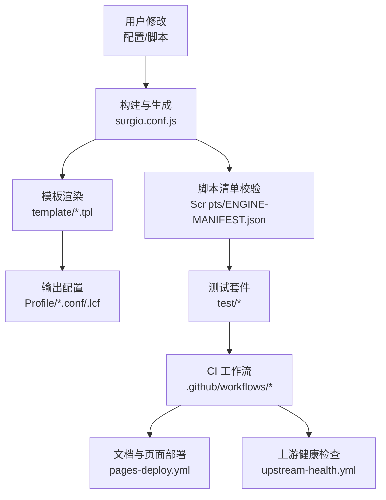
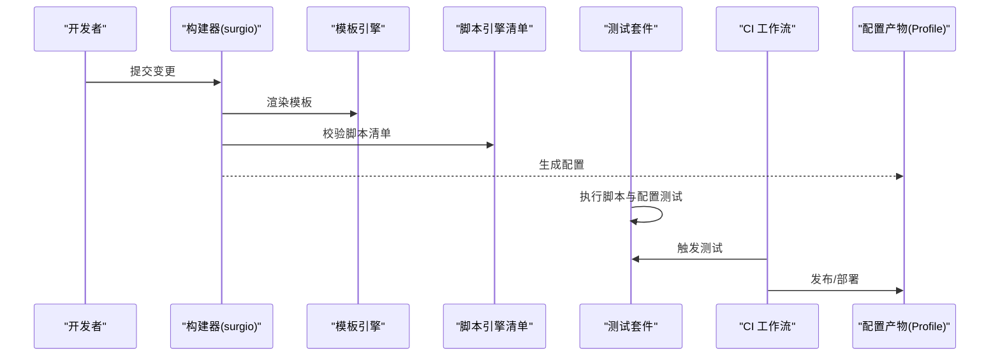
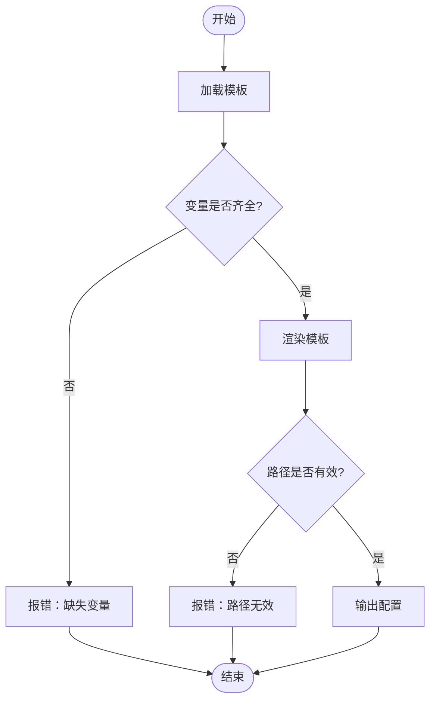
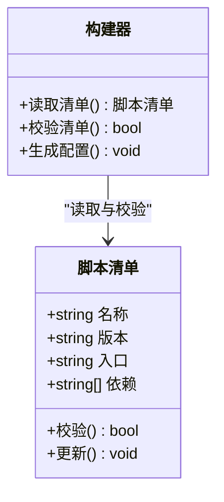
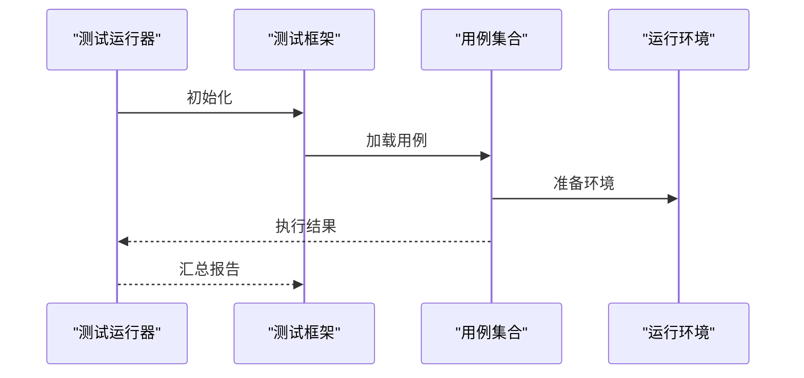
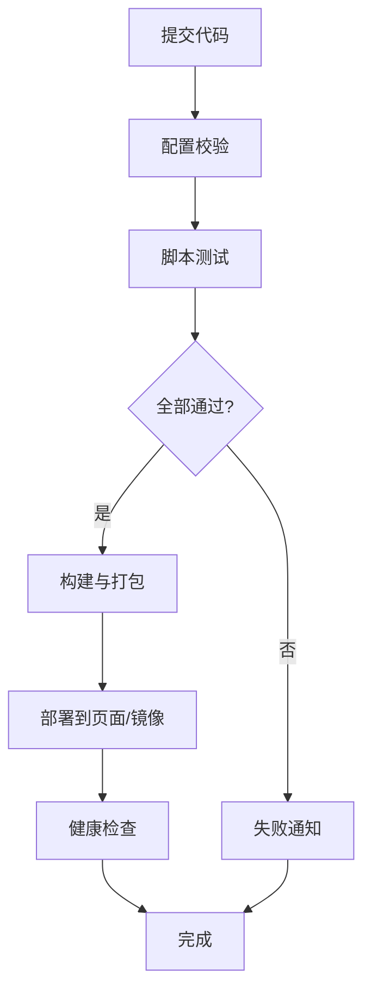
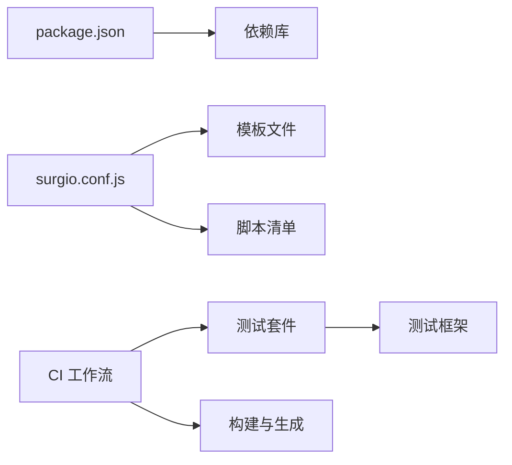

# 故障排除

<cite>
**本文引用的文件**   
- [README.md](file://README.md)
- [package.json](file://package.json)
- [surgio.conf.js](file://surgio.conf.js)
- [eslint.config.mjs](file://eslint.config.mjs)
- [Mirror/MANIFEST.json](file://Mirror/MANIFEST.json)
- [Scripts/ENGINE-MANIFEST.json](file://Scripts/ENGINE-MANIFEST.json)
- [Profile/Loon.lcf](file://Profile/Loon.lcf)
- [Profile/QX.conf](file://Profile/QX.conf)
- [Profile/Surge.conf](file://Profile/Surge.conf)
- [template/quantumultx.tpl](file://template/quantumultx.tpl)
- [template/loon.tpl](file://template/loon.tpl)
- [template/surge.tpl](file://template/surge.tpl)
- [test/run-tests.js](file://test/run-tests.js)
- [test/harness.js](file://test/harness.js)
- [test/cases/purify-scripts.test.js](file://test/cases/purify-scripts.test.js)
- [test/cases/qidian-wrapper.test.js](file://test/cases/qidian-wrapper.test.js)
- [test/cases/zhihu-cainiao.test.js](file://test/cases/zhihu-cainiao.test.js)
- [test/cases/zhihuifangdong.test.js](file://test/cases/zhihuifangdong.test.js)
- [.github/workflows/config-validate.yml](file://.github/workflows/config-validate.yml)
- [.github/workflows/script-tests.yml](file://.github/workflows/script-tests.yml)
- [.github/workflows/pages-deploy.yml](file://.github/workflows/pages-deploy.yml)
- [.github/workflows/upstream-health.yml](file://.github/workflows/upstream-health.yml)
</cite>

## 目录
1. [简介](#简介)
2. [项目结构](#项目结构)
3. [核心组件](#核心组件)
4. [架构总览](#架构总览)
5. [详细组件分析](#详细组件分析)
6. [依赖关系分析](#依赖关系分析)
7. [性能注意事项](#性能注意事项)
8. [故障排除指南](#故障排除指南)
9. [结论](#结论)
10. [附录](#附录)

## 简介
本指南面向配置与脚本管理项目的日常运维与排障，覆盖常见错误、诊断方法、日志与调试工具使用、性能问题定位与优化策略、社区支持与反馈渠道，以及紧急恢复与备份恢复操作。内容基于仓库中的配置文件、脚本清单、测试与工作流等实际材料整理而成，旨在帮助读者快速定位并解决问题。

## 项目结构
本项目围绕多代理客户端（Quantumult X、Loon、Surge）的配置生成与脚本分发展开，关键目录与职责如下：
- Profile：各客户端的配置文件模板或产物
- Scripts：运行时脚本与引擎清单
- Mirror：规则与资源清单、第三方插件与脚本
- template：用于生成配置的模板
- test：单元测试与测试运行器
- .github/workflows：CI/CD 工作流，包括配置校验、脚本测试、部署与健康检查
- surgio.conf.js：构建与生成配置的核心配置
- package.json：依赖与脚本命令定义

**图表来源** 
- [surgio.conf.js](file://surgio.conf.js)
- [template/quantumultx.tpl](file://template/quantumultx.tpl)
- [template/loon.tpl](file://template/loon.tpl)
- [template/surge.tpl](file://template/surge.tpl)
- [Scripts/ENGINE-MANIFEST.json](file://Scripts/ENGINE-MANIFEST.json)
- [test/run-tests.js](file://test/run-tests.js)
- [.github/workflows/config-validate.yml](file://.github/workflows/config-validate.yml)
- [.github/workflows/script-tests.yml](file://.github/workflows/script-tests.yml)
- [.github/workflows/pages-deploy.yml](file://.github/workflows/pages-deploy.yml)
- [.github/workflows/upstream-health.yml](file://.github/workflows/upstream-health.yml)

**章节来源**
- [README.md](file://README.md)
- [package.json](file://package.json)
- [surgio.conf.js](file://surgio.conf.js)

## 核心组件
- 配置生成器与模板系统：通过模板与清单驱动生成不同客户端的配置，保证一致性与可维护性
- 脚本引擎与清单：集中管理脚本版本、依赖与入口，便于校验与更新
- 测试套件：对脚本与配置进行自动化验证，确保变更质量
- CI/CD 工作流：在提交与合并时执行配置校验、脚本测试、部署与健康检查

**章节来源**
- [Scripts/ENGINE-MANIFEST.json](file://Scripts/ENGINE-MANIFEST.json)
- [Mirror/MANIFEST.json](file://Mirror/MANIFEST.json)
- [test/run-tests.js](file://test/run-tests.js)
- [test/harness.js](file://test/harness.js)
- [.github/workflows/config-validate.yml](file://.github/workflows/config-validate.yml)
- [.github/workflows/script-tests.yml](file://.github/workflows/script-tests.yml)
- [.github/workflows/pages-deploy.yml](file://.github/workflows/pages-deploy.yml)
- [.github/workflows/upstream-health.yml](file://.github/workflows/upstream-health.yml)

## 架构总览
下图展示了从源码到配置产物的整体流程，以及测试与 CI 的集成点。

**图表来源** 
- [surgio.conf.js](file://surgio.conf.js)
- [template/quantumultx.tpl](file://template/quantumultx.tpl)
- [Scripts/ENGINE-MANIFEST.json](file://Scripts/ENGINE-MANIFEST.json)
- [test/run-tests.js](file://test/run-tests.js)
- [.github/workflows/config-validate.yml](file://.github/workflows/config-validate.yml)
- [.github/workflows/script-tests.yml](file://.github/workflows/script-tests.yml)
- [.github/workflows/pages-deploy.yml](file://.github/workflows/pages-deploy.yml)

## 详细组件分析

### 配置模板与生成
- 模板文件负责为不同客户端生成对应语法与结构的配置
- 生成过程需确保模板变量正确、路径有效、依赖完整
- 常见问题包括模板语法错误、变量未定义、路径不匹配

**图表来源** 
- [template/quantumultx.tpl](file://template/quantumultx.tpl)
- [template/loon.tpl](file://template/loon.tpl)
- [template/surge.tpl](file://template/surge.tpl)
- [surgio.conf.js](file://surgio.conf.js)

**章节来源**
- [template/quantumultx.tpl](file://template/quantumultx.tpl)
- [template/loon.tpl](file://template/loon.tpl)
- [template/surge.tpl](file://template/surge.tpl)
- [surgio.conf.js](file://surgio.conf.js)

### 脚本引擎与清单
- 脚本清单集中声明脚本名称、版本、入口与依赖
- 构建时需校验清单完整性与一致性
- 常见问题包括清单缺失、版本冲突、入口不存在

**图表来源** 
- [Scripts/ENGINE-MANIFEST.json](file://Scripts/ENGINE-MANIFEST.json)
- [surgio.conf.js](file://surgio.conf.js)

**章节来源**
- [Scripts/ENGINE-MANIFEST.json](file://Scripts/ENGINE-MANIFEST.json)
- [surgio.conf.js](file://surgio.conf.js)

### 测试套件与用例
- 测试运行器统一执行用例，返回结果与覆盖率信息
- 用例覆盖脚本逻辑与配置生成路径
- 常见问题包括用例失败、环境不一致、依赖缺失

**图表来源** 
- [test/run-tests.js](file://test/run-tests.js)
- [test/harness.js](file://test/harness.js)
- [test/cases/purify-scripts.test.js](file://test/cases/purify-scripts.test.js)
- [test/cases/qidian-wrapper.test.js](file://test/cases/qidian-wrapper.test.js)
- [test/cases/zhihu-cainiao.test.js](file://test/cases/zhihu-cainiao.test.js)
- [test/cases/zhihuifangdong.test.js](file://test/cases/zhihuifangdong.test.js)

**章节来源**
- [test/run-tests.js](file://test/run-tests.js)
- [test/harness.js](file://test/harness.js)
- [test/cases/purify-scripts.test.js](file://test/cases/purify-scripts.test.js)
- [test/cases/qidian-wrapper.test.js](file://test/cases/qidian-wrapper.test.js)
- [test/cases/zhihu-cainiao.test.js](file://test/cases/zhihu-cainiao.test.js)
- [test/cases/zhihuifangdong.test.js](file://test/cases/zhihuifangdong.test.js)

### CI/CD 工作流
- 配置校验工作流确保配置语法与结构正确
- 脚本测试工作流保障脚本功能稳定
- 部署工作流将产物发布至目标平台
- 健康检查工作流监控上游服务状态

**图表来源** 
- [.github/workflows/config-validate.yml](file://.github/workflows/config-validate.yml)
- [.github/workflows/script-tests.yml](file://.github/workflows/script-tests.yml)
- [.github/workflows/pages-deploy.yml](file://.github/workflows/pages-deploy.yml)
- [.github/workflows/upstream-health.yml](file://.github/workflows/upstream-health.yml)

**章节来源**
- [.github/workflows/config-validate.yml](file://.github/workflows/config-validate.yml)
- [.github/workflows/script-tests.yml](file://.github/workflows/script-tests.yml)
- [.github/workflows/pages-deploy.yml](file://.github/workflows/pages-deploy.yml)
- [.github/workflows/upstream-health.yml](file://.github/workflows/upstream-health.yml)

## 依赖关系分析
- 构建依赖由包管理器统一管理，确保版本一致
- 模板与清单之间存在强耦合，变更需同步更新
- 测试与工作流依赖 Node.js 环境与网络可达性

**图表来源** 
- [package.json](file://package.json)
- [surgio.conf.js](file://surgio.conf.js)
- [Scripts/ENGINE-MANIFEST.json](file://Scripts/ENGINE-MANIFEST.json)
- [test/run-tests.js](file://test/run-tests.js)
- [.github/workflows/script-tests.yml](file://.github/workflows/script-tests.yml)

**章节来源**
- [package.json](file://package.json)
- [surgio.conf.js](file://surgio.conf.js)
- [Scripts/ENGINE-MANIFEST.json](file://Scripts/ENGINE-MANIFEST.json)
- [test/run-tests.js](file://test/run-tests.js)
- [.github/workflows/script-tests.yml](file://.github/workflows/script-tests.yml)

## 性能注意事项
- 模板渲染应避免重复计算与冗余变量替换
- 脚本清单校验应在构建早期进行，减少后续失败成本
- 测试套件应并行执行以提升效率，但需注意资源竞争
- CI 中缓存依赖与中间产物以缩短流水线时间

[本节为通用指导，不涉及具体文件分析]

## 故障排除指南

### 配置错误
- 症状：构建失败、配置无法加载、客户端启动异常
- 可能原因：模板语法错误、变量未定义、路径不正确、清单缺失
- 诊断步骤：
  - 检查模板文件的语法与变量引用
  - 确认清单文件中脚本与依赖存在且路径正确
  - 查看构建日志中的错误位置与上下文
- 解决方案：
  - 修正模板语法与变量定义
  - 补全缺失文件或更新路径
  - 重新运行构建与测试

**章节来源**
- [template/quantumultx.tpl](file://template/quantumultx.tpl)
- [template/loon.tpl](file://template/loon.tpl)
- [template/surge.tpl](file://template/surge.tpl)
- [Scripts/ENGINE-MANIFEST.json](file://Scripts/ENGINE-MANIFEST.json)
- [surgio.conf.js](file://surgio.conf.js)

### 脚本执行问题
- 症状：脚本无法加载、运行时错误、功能异常
- 可能原因：入口不存在、依赖缺失、版本不兼容、权限不足
- 诊断步骤：
  - 核对脚本清单中的入口与依赖
  - 检查运行环境的 Node.js 版本与模块可用性
  - 查看测试用例的执行结果与错误堆栈
- 解决方案：
  - 修复入口路径与依赖声明
  - 升级或降级依赖版本以匹配环境
  - 调整权限或运行方式

**章节来源**
- [Scripts/ENGINE-MANIFEST.json](file://Scripts/ENGINE-MANIFEST.json)
- [test/run-tests.js](file://test/run-tests.js)
- [test/harness.js](file://test/harness.js)

### 网络请求失败
- 症状：上游资源不可达、下载超时、镜像失效
- 可能原因：网络不通、DNS 解析失败、镜像地址变更、证书问题
- 诊断步骤：
  - 检查工作流中的健康检查任务与日志
  - 验证镜像地址与访问权限
  - 排查本地网络与代理设置
- 解决方案：
  - 更新镜像地址或切换可用源
  - 配置正确的 DNS 与代理
  - 确认证书链与信任根

**章节来源**
- [.github/workflows/upstream-health.yml](file://.github/workflows/upstream-health.yml)
- [Mirror/MANIFEST.json](file://Mirror/MANIFEST.json)

### 日志分析与调试工具
- 构建日志：关注错误行号与上下文，定位模板与清单问题
- 测试日志：查看用例失败详情与断言信息
- 工作流日志：检查 CI 阶段失败原因与重试建议
- 调试技巧：
  - 启用详细日志模式
  - 逐步执行构建与测试
  - 隔离问题范围，最小化复现

**章节来源**
- [test/run-tests.js](file://test/run-tests.js)
- [.github/workflows/config-validate.yml](file://.github/workflows/config-validate.yml)
- [.github/workflows/script-tests.yml](file://.github/workflows/script-tests.yml)

### 性能问题识别与优化
- 识别指标：构建耗时、测试时长、内存占用、网络延迟
- 优化策略：
  - 缓存依赖与中间产物
  - 并行执行测试与构建任务
  - 精简模板与清单，减少冗余
  - 使用更快的镜像源与 CDN
- 监控手段：
  - 工作流运行时间与成功率
  - 本地性能基准对比

**章节来源**
- [.github/workflows/pages-deploy.yml](file://.github/workflows/pages-deploy.yml)
- [package.json](file://package.json)

### 社区支持与问题反馈
- 讨论渠道：仓库 Issues、Pull Requests、文档评论
- 反馈格式：提供复现步骤、环境信息、日志片段
- 支持资源：README 中的说明、工作流示例、测试用例参考

**章节来源**
- [README.md](file://README.md)

### 紧急恢复与备份恢复
- 备份策略：定期备份配置、清单与模板，保留历史版本
- 恢复步骤：
  - 回滚到已知稳定的分支或标签
  - 重新生成配置并验证
  - 逐步应用变更，观察稳定性
- 预防措施：
  - 使用版本控制与分支保护
  - 在 CI 中强制校验与测试
  - 建立灰度发布与回滚机制

**章节来源**
- [surgio.conf.js](file://surgio.conf.js)
- [Scripts/ENGINE-MANIFEST.json](file://Scripts/ENGINE-MANIFEST.json)
- [template/quantumultx.tpl](file://template/quantumultx.tpl)

## 结论
本指南围绕配置与脚本管理的核心环节，提供了系统化的故障排除方法与优化建议。通过模板与清单的规范化管理、测试与工作流的自动化保障，以及完善的日志与监控体系，可有效降低问题发生率并提升恢复效率。建议在日常运维中遵循本指南的流程与最佳实践，确保系统的稳定性与可维护性。

## 附录
- 常用命令与脚本：参见包管理与构建脚本定义
- 模板语法参考：参见各客户端模板文件
- 测试用例参考：参见测试目录下的用例实现

[本节为补充信息，不涉及具体文件分析]