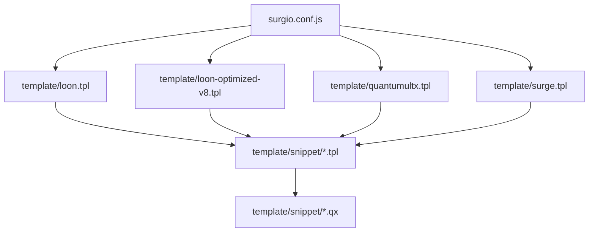
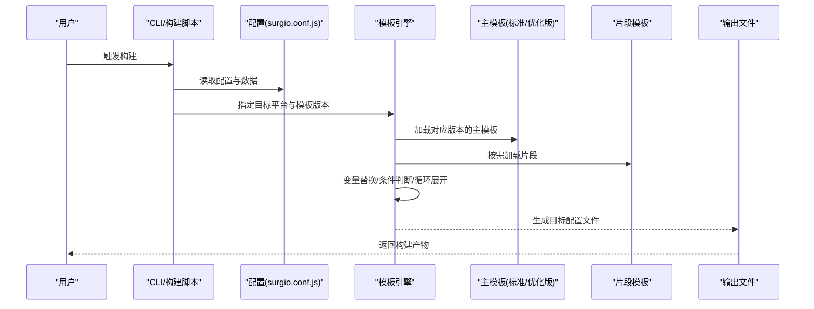
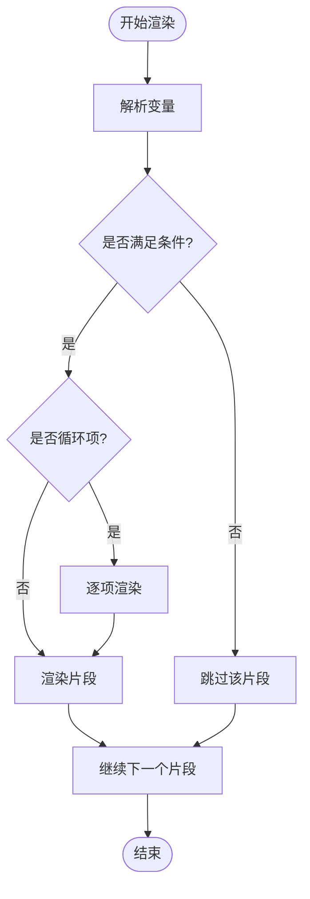
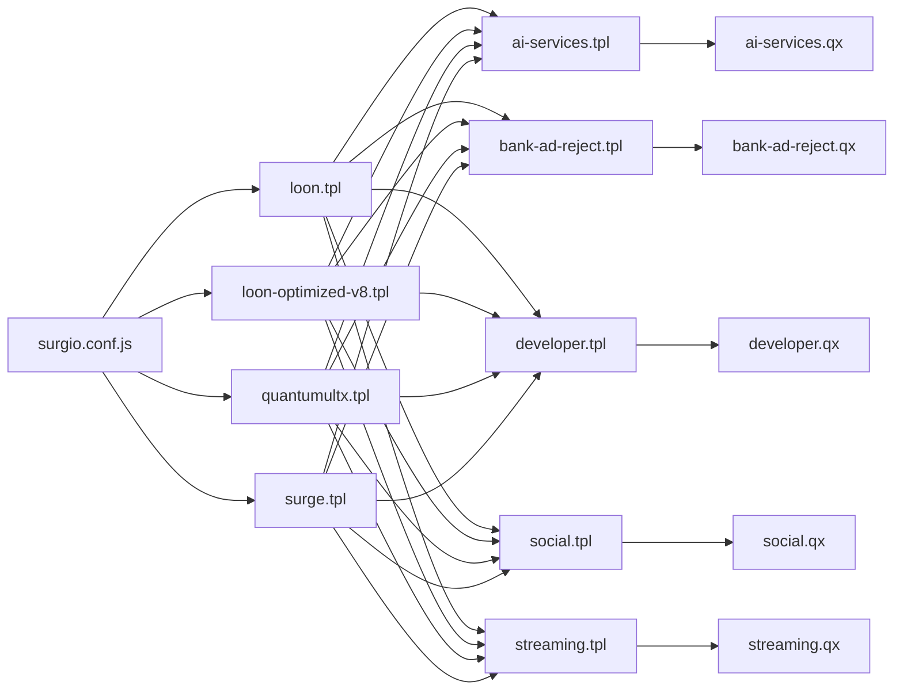

# 模板系统

<cite>
**本文引用的文件**   
- [surgio.conf.js](file://surgio.conf.js)
- [template/loon.tpl](file://template/loon.tpl)
- [template/loon-optimized-v8.tpl](file://template/loon-optimized-v8.tpl)
- [template/quantumultx.tpl](file://template/quantumultx.tpl)
- [template/surge.tpl](file://template/surge.tpl)
- [template/snippet/ai-services.qx](file://template/snippet/ai-services.qx)
- [template/snippet/ai-services.tpl](file://template/snippet/ai-services.tpl)
- [template/snippet/bank-ad-reject.qx](file://template/snippet/bank-ad-reject.qx)
- [template/snippet/bank-ad-reject.tpl](file://template/snippet/bank-ad-reject.tpl)
- [template/snippet/developer.qx](file://template/snippet/developer.qx)
- [template/snippet/developer.tpl](file://template/snippet/developer.tpl)
- [template/snippet/social.qx](file://template/snippet/social.qx)
- [template/snippet/social.tpl](file://template/snippet/social.tpl)
- [template/snippet/streaming.qx](file://template/snippet/streaming.qx)
- [template/snippet/streaming.tpl](file://template/snippet/streaming.tpl)
- [README.md](file://README.md)
</cite>

## 更新摘要
**所做更改**   
- 新增 loon-optimized-v8.tpl 模板文件，提供针对 v8.0 优化的配置模板支持
- 更新项目结构图以反映新模板文件
- 扩展主模板章节，包含优化版本模板的说明
- 更新依赖分析图表以包含新模板的引用关系

## 目录
1. [简介](#简介)
2. [项目结构](#项目结构)
3. [核心组件](#核心组件)
4. [架构总览](#架构总览)
5. [详细组件分析](#详细组件分析)
6. [依赖分析](#依赖分析)
7. [性能考虑](#性能考虑)
8. [故障排查指南](#故障排查指南)
9. [结论](#结论)
10. [附录](#附录)

## 简介
本仓库的模板系统用于将统一的配置源生成不同代理工具（Loon、Quantumult X、Surge）所需的配置文件。模板引擎负责：
- 解析模板与片段，渲染变量、条件分支与循环
- 组合多个片段以构建最终输出
- 支持继承式模板组织，便于复用与扩展
- 提供调试与性能优化手段，确保生成结果稳定高效

该文档面向使用者与维护者，既包含入门说明，也涵盖深入的技术细节与最佳实践。

## 项目结构
模板相关资源集中在 template 目录，按"主模板 + 片段"的方式组织：
- 主模板：针对各目标工具的完整配置文件模板，包括标准版和优化版
- 片段模板：可复用的规则块或脚本片段，供主模板按需引入

**图表来源**
- [surgio.conf.js](file://surgio.conf.js)
- [template/loon.tpl](file://template/loon.tpl)
- [template/loon-optimized-v8.tpl](file://template/loon-optimized-v8.tpl)
- [template/quantumultx.tpl](file://template/quantumultx.tpl)
- [template/surge.tpl](file://template/surge.tpl)
- [template/snippet/ai-services.tpl](file://template/snippet/ai-services.tpl)
- [template/snippet/bank-ad-reject.tpl](file://template/snippet/bank-ad-reject.tpl)
- [template/snippet/developer.tpl](file://template/snippet/developer.tpl)
- [template/snippet/social.tpl](file://template/snippet/social.tpl)
- [template/snippet/streaming.tpl](file://template/snippet/streaming.tpl)

**章节来源**
- [README.md](file://README.md)

## 核心组件
- 模板引擎入口：通过配置驱动加载并渲染模板
- 内置模板：为 Loon、Quantumult X、Surge 提供标准输出格式，其中 Loon 提供标准版和 v8.0 优化版两种选择
- 片段模板：按功能域划分的可复用片段（如 AI 服务、银行广告拦截、开发者工具、社交、流媒体等）
- 渲染管线：变量替换 → 条件判断 → 循环展开 → 片段合并 → 输出校验

**章节来源**
- [surgio.conf.js](file://surgio.conf.js)
- [template/loon.tpl](file://template/loon.tpl)
- [template/loon-optimized-v8.tpl](file://template/loon-optimized-v8.tpl)
- [template/quantumultx.tpl](file://template/quantumultx.tpl)
- [template/surge.tpl](file://template/surge.tpl)
- [template/snippet/ai-services.tpl](file://template/snippet/ai-services.tpl)
- [template/snippet/bank-ad-reject.tpl](file://template/snippet/bank-ad-reject.tpl)
- [template/snippet/developer.tpl](file://template/snippet/developer.tpl)
- [template/snippet/social.tpl](file://template/snippet/social.tpl)
- [template/snippet/streaming.tpl](file://template/snippet/streaming.tpl)

## 架构总览
模板系统的整体流程如下：
- 读取配置与数据源
- 选择目标平台模板（包括 Loon 的标准版和优化版）
- 加载片段并按需组合
- 执行渲染（变量、条件、循环）
- 输出并校验最终配置

**图表来源**
- [surgio.conf.js](file://surgio.conf.js)
- [template/loon.tpl](file://template/loon.tpl)
- [template/loon-optimized-v8.tpl](file://template/loon-optimized-v8.tpl)
- [template/quantumultx.tpl](file://template/quantumultx.tpl)
- [template/surge.tpl](file://template/surge.tpl)
- [template/snippet/ai-services.tpl](file://template/snippet/ai-services.tpl)
- [template/snippet/bank-ad-reject.tpl](file://template/snippet/bank-ad-reject.tpl)
- [template/snippet/developer.tpl](file://template/snippet/developer.tpl)
- [template/snippet/social.tpl](file://template/snippet/social.tpl)
- [template/snippet/streaming.tpl](file://template/snippet/streaming.tpl)

## 详细组件分析

### 主模板（Loon / Quantumult X / Surge）
- 职责：定义目标平台的完整配置结构与默认值
- 特点：
  - 使用统一变量占位符，由引擎在渲染阶段填充
  - 通过条件语句控制可选模块的开关
  - 通过循环结构批量生成规则条目
- 建议：
  - 保持模板与平台语法一致，避免跨平台差异导致渲染失败
  - 对可选模块设置合理的默认开关，减少运行时分支复杂度

**更新** Loon 现在提供两个版本的模板：标准的 loon.tpl 和针对 v8.0 优化的 loon-optimized-v8.tpl，用户可根据需要选择合适的版本

**章节来源**
- [template/loon.tpl](file://template/loon.tpl)
- [template/loon-optimized-v8.tpl](file://template/loon-optimized-v8.tpl)
- [template/quantumultx.tpl](file://template/quantumultx.tpl)
- [template/surge.tpl](file://template/surge.tpl)

### 片段模板（Snippet）
- 职责：按功能域拆分规则或脚本片段，提高复用性
- 常见分类：
  - AI 服务：ai-services
  - 银行广告拦截：bank-ad-reject
  - 开发者工具：developer
  - 社交网络：social
  - 流媒体：streaming
- 使用方式：
  - 在主模板中按需引入对应片段
  - 通过变量控制片段内规则的启用/禁用
  - 通过循环批量注入多条规则

**章节来源**
- [template/snippet/ai-services.tpl](file://template/snippet/ai-services.tpl)
- [template/snippet/bank-ad-reject.tpl](file://template/snippet/bank-ad-reject.tpl)
- [template/snippet/developer.tpl](file://template/snippet/developer.tpl)
- [template/snippet/social.tpl](file://template/snippet/social.tpl)
- [template/snippet/streaming.tpl](file://template/snippet/streaming.tpl)
- [template/snippet/ai-services.qx](file://template/snippet/ai-services.qx)
- [template/snippet/bank-ad-reject.qx](file://template/snippet/bank-ad-reject.qx)
- [template/snippet/developer.qx](file://template/snippet/developer.qx)
- [template/snippet/social.qx](file://template/snippet/social.qx)
- [template/snippet/streaming.qx](file://template/snippet/streaming.qx)

### 模板变量、条件与循环
- 变量：用于注入域名、端口、策略组名称等动态内容
- 条件：根据配置开关决定是否渲染某段规则或脚本
- 循环：遍历规则列表或脚本集合，批量生成条目

**图表来源**
- [surgio.conf.js](file://surgio.conf.js)
- [template/loon.tpl](file://template/loon.tpl)
- [template/loon-optimized-v8.tpl](file://template/loon-optimized-v8.tpl)
- [template/quantumultx.tpl](file://template/quantumultx.tpl)
- [template/surge.tpl](file://template/surge.tpl)
- [template/snippet/ai-services.tpl](file://template/snippet/ai-services.tpl)
- [template/snippet/bank-ad-reject.tpl](file://template/snippet/bank-ad-reject.tpl)
- [template/snippet/developer.tpl](file://template/snippet/developer.tpl)
- [template/snippet/social.tpl](file://template/snippet/social.tpl)
- [template/snippet/streaming.tpl](file://template/snippet/streaming.tpl)

### 模板继承与组合机制
- 继承：主模板作为基模板，片段模板作为子模块，通过引用实现组合
- 组合：按平台特性选择性引入片段，形成差异化输出
- 建议：
  - 将通用逻辑下沉到基模板，减少重复
  - 将平台特有逻辑放入片段，提升可维护性

**章节来源**
- [template/loon.tpl](file://template/loon.tpl)
- [template/loon-optimized-v8.tpl](file://template/loon-optimized-v8.tpl)
- [template/quantumultx.tpl](file://template/quantumultx.tpl)
- [template/surge.tpl](file://template/surge.tpl)
- [template/snippet/ai-services.tpl](file://template/snippet/ai-services.tpl)
- [template/snippet/bank-ad-reject.tpl](file://template/snippet/bank-ad-reject.tpl)
- [template/snippet/developer.tpl](file://template/snippet/developer.tpl)
- [template/snippet/social.tpl](file://template/snippet/social.tpl)
- [template/snippet/streaming.tpl](file://template/snippet/streaming.tpl)

### 内置模板使用方法
- 选择目标平台：在配置中指定 Loon、Quantumult X 或 Surge
- 选择模板版本：对于 Loon，可选择标准版或 v8.0 优化版
- 启用片段：在配置中开启所需片段开关
- 覆盖变量：通过配置覆盖默认变量值
- 验证输出：构建后检查生成的配置文件是否符合预期

**更新** Loon 模板现在提供两个版本选择：标准版适用于大多数场景，v8.0 优化版针对新版本进行了性能优化

**章节来源**
- [surgio.conf.js](file://surgio.conf.js)
- [template/loon.tpl](file://template/loon.tpl)
- [template/loon-optimized-v8.tpl](file://template/loon-optimized-v8.tpl)
- [template/quantumultx.tpl](file://template/quantumultx.tpl)
- [template/surge.tpl](file://template/surge.tpl)

### 自定义模板与片段
- 创建新片段：在 snippet 目录下新增 .tpl 与 .qx 文件，遵循命名规范
- 引入片段：在主模板中使用片段引用语法，传入必要变量
- 条件控制：通过配置开关控制片段是否参与渲染
- 循环注入：对片段内的规则进行批量生成，减少重复代码

**章节来源**
- [template/snippet/ai-services.tpl](file://template/snippet/ai-services.tpl)
- [template/snippet/bank-ad-reject.tpl](file://template/snippet/bank-ad-reject.tpl)
- [template/snippet/developer.tpl](file://template/snippet/developer.tpl)
- [template/snippet/social.tpl](file://template/snippet/social.tpl)
- [template/snippet/streaming.tpl](file://template/snippet/streaming.tpl)
- [template/snippet/ai-services.qx](file://template/snippet/ai-services.qx)
- [template/snippet/bank-ad-reject.qx](file://template/snippet/bank-ad-reject.qx)
- [template/snippet/developer.qx](file://template/snippet/developer.qx)
- [template/snippet/social.qx](file://template/snippet/social.qx)
- [template/snippet/streaming.qx](file://template/snippet/streaming.qx)

## 依赖分析
模板系统与配置驱动的依赖关系如下：
- surgio.conf.js 决定加载哪些主模板与片段
- 主模板依赖片段模板完成模块化组装
- 片段模板可能依赖 .qx 脚本文件（如 QX 专用脚本）

**图表来源**
- [surgio.conf.js](file://surgio.conf.js)
- [template/loon.tpl](file://template/loon.tpl)
- [template/loon-optimized-v8.tpl](file://template/loon-optimized-v8.tpl)
- [template/quantumultx.tpl](file://template/quantumultx.tpl)
- [template/surge.tpl](file://template/surge.tpl)
- [template/snippet/ai-services.tpl](file://template/snippet/ai-services.tpl)
- [template/snippet/bank-ad-reject.tpl](file://template/snippet/bank-ad-reject.tpl)
- [template/snippet/developer.tpl](file://template/snippet/developer.tpl)
- [template/snippet/social.tpl](file://template/snippet/social.tpl)
- [template/snippet/streaming.tpl](file://template/snippet/streaming.tpl)
- [template/snippet/ai-services.qx](file://template/snippet/ai-services.qx)
- [template/snippet/bank-ad-reject.qx](file://template/snippet/bank-ad-reject.qx)
- [template/snippet/developer.qx](file://template/snippet/developer.qx)
- [template/snippet/social.qx](file://template/snippet/social.qx)
- [template/snippet/streaming.qx](file://template/snippet/streaming.qx)

**章节来源**
- [surgio.conf.js](file://surgio.conf.js)

## 性能考虑
- 减少不必要的条件分支：尽量将复杂逻辑前置到配置层，降低模板渲染时的判断开销
- 合理使用循环：对大量规则使用循环批量生成，避免重复文本
- 缓存片段：对频繁使用的片段进行缓存，减少重复解析
- 增量构建：仅重新渲染变更的片段与主模板
- 输出校验：在构建阶段进行语法校验，尽早发现错误
- **优化模板选择**：对于 Loon 用户，推荐使用 v8.0 优化版模板以获得更好的性能表现

[本节为通用指导，不直接分析具体文件]

## 故障排查指南
常见问题与处理建议：
- 变量未定义：检查配置是否提供了必需变量，确保模板中的占位符与变量名一致
- 条件分支异常：确认配置开关是否正确，必要时增加日志定位
- 循环项缺失：检查数据源是否为空，确保循环体有至少一项
- 片段未生效：确认片段是否被正确引入，路径与文件名是否匹配
- 平台语法错误：对照目标平台文档，修正模板中的语法差异
- **模板版本问题**：如果使用的是 Loon v8.0+，建议使用 loon-optimized-v8.tpl 模板以获得最佳兼容性

**章节来源**
- [surgio.conf.js](file://surgio.conf.js)
- [template/loon.tpl](file://template/loon.tpl)
- [template/loon-optimized-v8.tpl](file://template/loon-optimized-v8.tpl)
- [template/quantumultx.tpl](file://template/quantumultx.tpl)
- [template/surge.tpl](file://template/surge.tpl)
- [template/snippet/ai-services.tpl](file://template/snippet/ai-services.tpl)
- [template/snippet/bank-ad-reject.tpl](file://template/snippet/bank-ad-reject.tpl)
- [template/snippet/developer.tpl](file://template/snippet/developer.tpl)
- [template/snippet/social.tpl](file://template/snippet/social.tpl)
- [template/snippet/streaming.tpl](file://template/snippet/streaming.tpl)

## 结论
模板系统通过"主模板 + 片段"的组织方式，实现了多平台配置的标准化与可复用化。借助变量、条件与循环，能够灵活地生成符合各平台语法的配置文件。Loon 模板现在提供标准版和 v8.0 优化版两个选择，满足不同版本需求。建议在开发过程中遵循模块化与最小化原则，结合调试与性能优化手段，持续提升构建质量与效率。

[本节为总结性内容，不直接分析具体文件]

## 附录
- 快速上手：
  - 在配置中选择目标平台与片段
  - 对于 Loon 用户，根据版本选择合适的模板（标准版或 v8.0 优化版）
  - 运行构建命令，查看输出文件
- 最佳实践：
  - 将通用逻辑下沉到基模板
  - 将平台特有逻辑放入片段
  - 使用变量与开关管理可选模块
  - 优先使用优化版模板以获得更好的性能
- 参考资源：
  - 各平台官方文档与语法规范
  - 仓库 README 中的使用说明

[本节为补充信息，不直接分析具体文件]