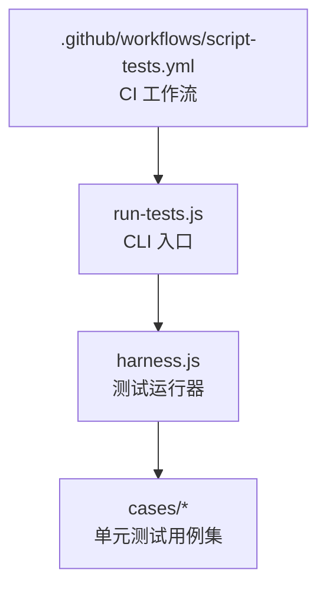
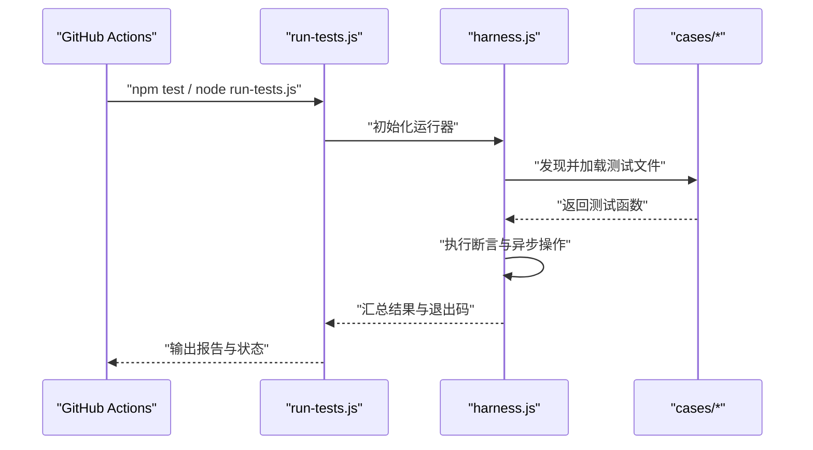
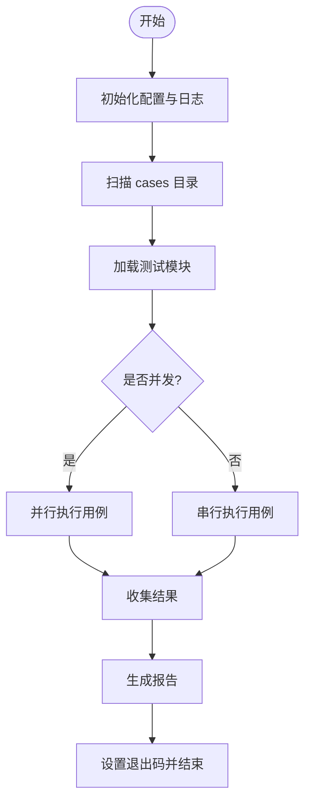
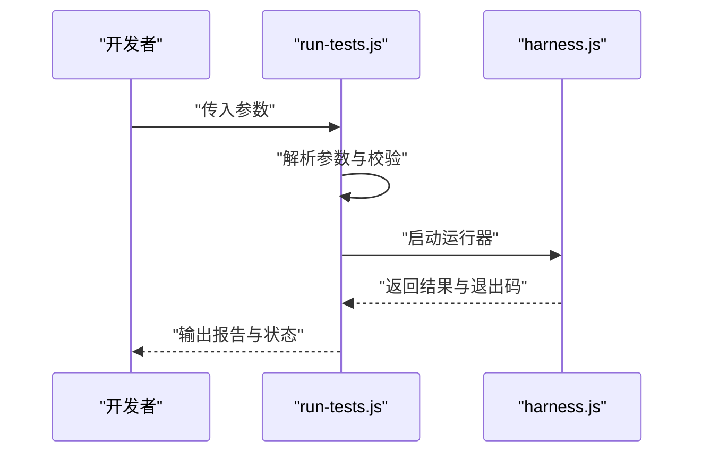
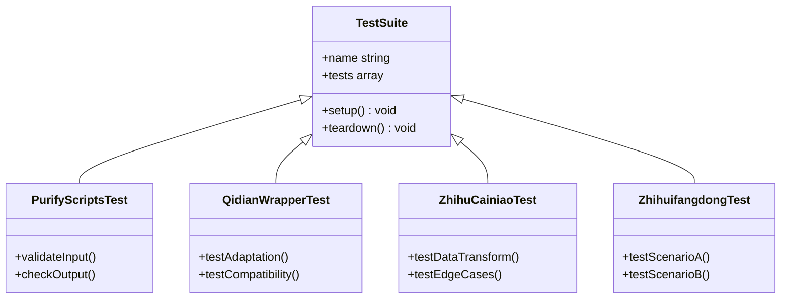
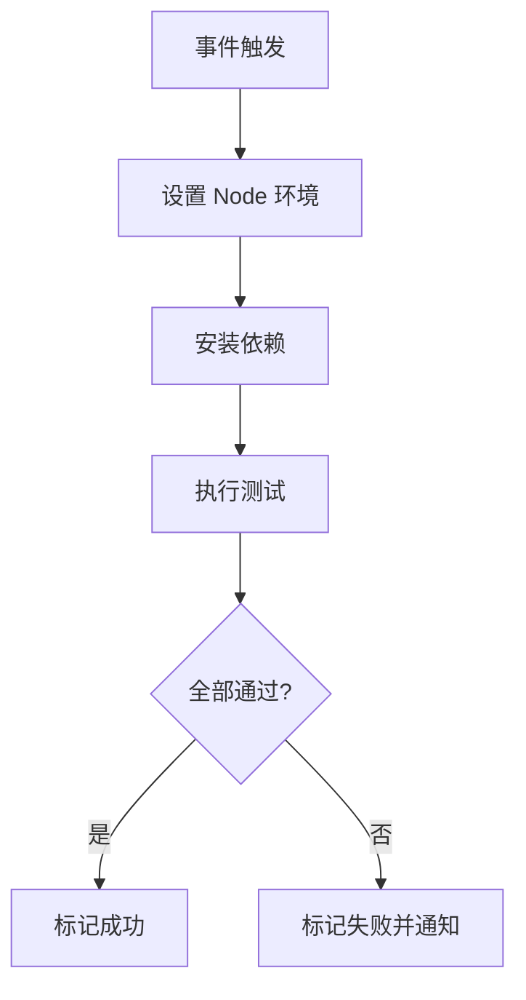
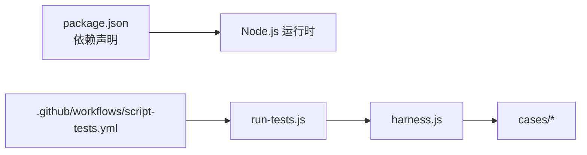

# 测试框架

<cite>
**本文引用的文件**   
- [package.json](file://package.json)
- [test/harness.js](file://test/harness.js)
- [test/run-tests.js](file://test/run-tests.js)
- [test/cases/purify-scripts.test.js](file://test/cases/purify-scripts.test.js)
- [test/cases/qidian-wrapper.test.js](file://test/cases/qidian-wrapper.test.js)
- [test/cases/zhihu-cainiao.test.js](file://test/cases/zhihu-cainiao.test.js)
- [test/cases/zhihuifangdong.test.js](file://test/cases/zhihuifangdong.test.js)
- [.github/workflows/script-tests.yml](file://.github/workflows/script-tests.yml)
</cite>

## 目录
1. [简介](#简介)
2. [项目结构](#项目结构)
3. [核心组件](#核心组件)
4. [架构总览](#架构总览)
5. [详细组件分析](#详细组件分析)
6. [依赖关系分析](#依赖关系分析)
7. [性能考虑](#性能考虑)
8. [故障排查指南](#故障排查指南)
9. [结论](#结论)
10. [附录](#附录)

## 简介
本仓库的测试框架基于 Node.js 与 JavaScript，采用“轻量运行器 + 用例集合”的组织方式。测试入口由 run-tests.js 提供，harness.js 负责统一加载、执行与结果汇总；具体业务逻辑的单元测试位于 test/cases 目录下，按功能模块划分。持续集成通过 GitHub Actions 的 script-tests.yml 触发脚本测试任务，确保代码变更后的自动化验证。

## 项目结构
测试相关目录与文件组织如下：
- test/
  - harness.js：测试运行器与结果聚合
  - run-tests.js：命令行入口，解析参数并启动运行器
  - cases/：各模块的测试用例集（单元测试）
    - purify-scripts.test.js
    - qidian-wrapper.test.js
    - zhihu-cainiao.test.js
    - zhihuifangdong.test.js
- .github/workflows/script-tests.yml：CI 中执行测试的工作流

**图表来源**
- [test/run-tests.js](file://test/run-tests.js)
- [test/harness.js](file://test/harness.js)
- [.github/workflows/script-tests.yml](file://.github/workflows/script-tests.yml)

**章节来源**
- [package.json](file://package.json)
- [test/harness.js](file://test/harness.js)
- [test/run-tests.js](file://test/run-tests.js)
- [.github/workflows/script-tests.yml](file://.github/workflows/script-tests.yml)

## 核心组件
- 运行器（harness.js）
  - 职责：发现并加载测试用例、顺序或并行执行、收集断言结果、输出报告、返回退出码
  - 关键点：统一的错误捕获、失败计数、可选的过滤与并发控制
- CLI 入口（run-tests.js）
  - 职责：解析命令行参数（如过滤用例、设置并发）、调用运行器、输出最终状态
- 用例集（test/cases/*.test.js）
  - 职责：针对具体脚本或功能的断言与行为验证
  - 规范：每个文件对应一个功能域，使用一致的命名与结构，便于扩展与维护

**章节来源**
- [test/harness.js](file://test/harness.js)
- [test/run-tests.js](file://test/run-tests.js)
- [test/cases/purify-scripts.test.js](file://test/cases/purify-scripts.test.js)
- [test/cases/qidian-wrapper.test.js](file://test/cases/qidian-wrapper.test.js)
- [test/cases/zhihu-cainiao.test.js](file://test/cases/zhihu-cainiao.test.js)
- [test/cases/zhihuifangdong.test.js](file://test/cases/zhihuifangdong.test.js)

## 架构总览
测试执行的整体流程如下：
- CI 触发 script-tests.yml 工作流
- 工作流安装依赖并调用 run-tests.js
- run-tests.js 解析参数后启动 harness.js
- harness.js 扫描 cases 目录，加载并执行每个测试文件
- 运行器汇总断言结果，生成报告并返回退出码（成功/失败）

**图表来源**
- [.github/workflows/script-tests.yml](file://.github/workflows/script-tests.yml)
- [test/run-tests.js](file://test/run-tests.js)
- [test/harness.js](file://test/harness.js)

## 详细组件分析

### 运行器（harness.js）
- 设计要点
  - 用例发现：遍历 test/cases 目录，匹配 *.test.js 文件
  - 执行策略：支持串行或并发执行，避免外部资源竞争
  - 结果收集：统计通过/失败数量，记录异常堆栈与消息
  - 报告输出：控制台摘要与可选的文件输出（如 JSON）
- 关键流程
  - 初始化配置（并发度、过滤规则）
  - 加载用例模块并调用其导出函数
  - 捕获断言失败与未处理异常
  - 汇总并输出结果，设置进程退出码

**图表来源**
- [test/harness.js](file://test/harness.js)

**章节来源**
- [test/harness.js](file://test/harness.js)

### CLI 入口（run-tests.js）
- 设计要点
  - 参数解析：支持 --filter、--concurrency、--report 等选项
  - 环境准备：打印 Node 版本、工作目录信息
  - 调用运行器：将参数传递给 harness.js 并获取退出码
- 典型用法
  - 本地调试：node test/run-tests.js --filter <用例名>
  - 全量执行：node test/run-tests.js
  - 指定并发：node test/run-tests.js --concurrency 4

**图表来源**
- [test/run-tests.js](file://test/run-tests.js)
- [test/harness.js](file://test/harness.js)

**章节来源**
- [test/run-tests.js](file://test/run-tests.js)

### 用例集（test/cases/*.test.js）
- 编写规范
  - 每个文件对应一个功能域，命名以 .test.js 结尾
  - 导出测试函数或对象，包含若干断言方法
  - 使用一致的断言风格（如相等、类型、边界条件）
  - 对异步操作进行正确等待与错误处理
- 示例用例
  - purify-scripts.test.js：脚本净化逻辑的输入输出验证
  - qidian-wrapper.test.js：包装器的适配与兼容性检查
  - zhihu-cainiao.test.js：跨服务数据转换的正确性
  - zhihuifangdong.test.js：特定场景下的行为验证

**图表来源**
- [test/cases/purify-scripts.test.js](file://test/cases/purify-scripts.test.js)
- [test/cases/qidian-wrapper.test.js](file://test/cases/qidian-wrapper.test.js)
- [test/cases/zhihu-cainiao.test.js](file://test/cases/zhihu-cainiao.test.js)
- [test/cases/zhihuifangdong.test.js](file://test/cases/zhihuifangdong.test.js)

**章节来源**
- [test/cases/purify-scripts.test.js](file://test/cases/purify-scripts.test.js)
- [test/cases/qidian-wrapper.test.js](file://test/cases/qidian-wrapper.test.js)
- [test/cases/zhihu-cainiao.test.js](file://test/cases/zhihu-cainiao.test.js)
- [test/cases/zhihuifangdong.test.js](file://test/cases/zhihuifangdong.test.js)

### 持续集成（script-tests.yml）
- 触发条件：推送或拉取请求到主分支时自动运行
- 步骤概览：
  - 设置 Node.js 环境
  - 安装依赖
  - 执行测试命令（调用 run-tests.js）
  - 上传测试结果（可选）
- 可配置项：
  - Node 版本矩阵
  - 缓存依赖以提升构建速度
  - 失败时的通知机制

**图表来源**
- [.github/workflows/script-tests.yml](file://.github/workflows/script-tests.yml)

**章节来源**
- [.github/workflows/script-tests.yml](file://.github/workflows/script-tests.yml)

## 依赖关系分析
- 运行时依赖
  - Node.js 运行时
  - 标准库与第三方模块（由 package.json 管理）
- 测试依赖
  - 运行器与用例之间为松耦合，通过文件约定与导出接口交互
- 外部集成
  - GitHub Actions 作为 CI 平台，驱动测试执行

**图表来源**
- [package.json](file://package.json)
- [test/run-tests.js](file://test/run-tests.js)
- [test/harness.js](file://test/harness.js)
- [.github/workflows/script-tests.yml](file://.github/workflows/script-tests.yml)

**章节来源**
- [package.json](file://package.json)
- [.github/workflows/script-tests.yml](file://.github/workflows/script-tests.yml)

## 性能考虑
- 并发执行：合理设置并发度以避免 I/O 竞争与内存峰值
- 用例隔离：每个用例独立初始化与清理，减少副作用
- 资源复用：对外部资源的连接与实例进行复用，降低开销
- 增量测试：通过过滤参数仅运行相关用例，缩短反馈时间

[本节为通用指导，不直接分析具体文件]

## 故障排查指南
- 常见问题
  - 用例加载失败：检查文件命名与导出格式是否符合约定
  - 断言失败：查看运行器输出的错误堆栈与上下文信息
  - 超时问题：增加超时阈值或优化异步操作
  - 并发冲突：降低并发度或修复共享状态
- 调试技巧
  - 使用 --filter 聚焦单个用例
  - 在运行器中添加详细日志
  - 利用 Node.js 调试器附加到进程
- 恢复步骤
  - 回滚最近变更
  - 清理依赖并重新安装
  - 在干净环境中复现问题

**章节来源**
- [test/harness.js](file://test/harness.js)
- [test/run-tests.js](file://test/run-tests.js)

## 结论
该测试框架以简洁的运行器与清晰的用例组织为核心，结合 GitHub Actions 实现自动化验证。通过统一的执行流程与报告机制，开发者可以快速定位问题并保证代码质量。建议继续完善覆盖率统计与更丰富的断言库集成，以进一步提升测试能力。

[本节为总结性内容，不直接分析具体文件]

## 附录
- 快速开始
  - 安装依赖：npm install
  - 运行测试：node test/run-tests.js
  - 过滤用例：node test/run-tests.js --filter <用例名>
- 扩展建议
  - 添加更多用例覆盖边界场景
  - 集成覆盖率工具（如 c8 或 istanbul）
  - 增强报告格式（HTML、Junit XML）

[本节为补充信息，不直接分析具体文件]