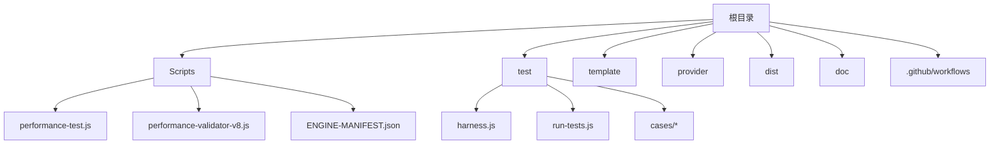
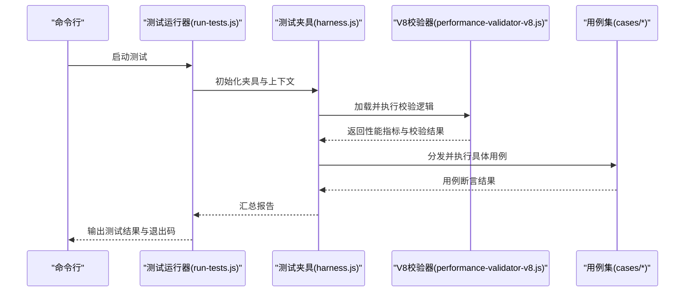
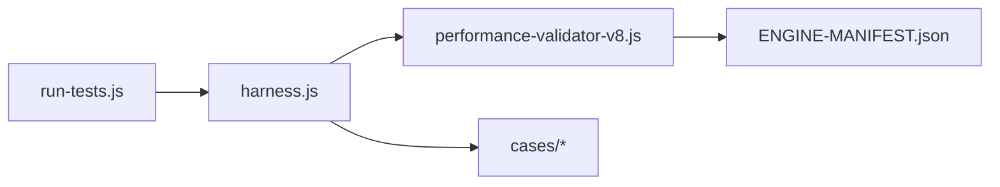

# 性能测试框架

<cite>
**本文引用的文件**   
- [README.md](file://README.md)
- [package.json](file://package.json)
- [Scripts/performance-test.js](file://Scripts/performance-test.js)
- [Scripts/performance-validator-v8.js](file://Scripts/performance-validator-v8.js)
- [test/harness.js](file://test/harness.js)
- [test/run-tests.js](file://test/run-tests.js)
- [test/cases/purify-scripts.test.js](file://test/cases/purify-scripts.test.js)
- [test/cases/qidian-wrapper.test.js](file://test/cases/qidian-wrapper.test.js)
- [test/cases/zhihu-cainiao.test.js](file://test/cases/zhihu-cainiao.test.js)
- [test/cases/zhihuifangdong.test.js](file://test/cases/zhihuifangdong.test.js)
- [Scripts/ENGINE-MANIFEST.json](file://Scripts/ENGINE-MANIFEST.json)
</cite>

## 目录
1. [简介](#简介)
2. [项目结构](#项目结构)
3. [核心组件](#核心组件)
4. [架构总览](#架构总览)
5. [详细组件分析](#详细组件分析)
6. [依赖关系分析](#依赖关系分析)
7. [性能考量](#性能考量)
8. [故障排查指南](#故障排查指南)
9. [结论](#结论)
10. [附录](#附录)

## 简介
本仓库围绕“性能测试框架”展开，提供脚本引擎（Loon、Quantumult X、Surge）下的性能校验与验证能力。核心目标包括：
- 对脚本进行 V8 环境下的性能验证与约束检查
- 统一测试用例组织与执行流程
- 为不同引擎的脚本提供一致的校验入口与报告输出
- 通过工程化手段保障脚本质量与稳定性

该框架以 Node.js 为运行基座，结合测试夹具与用例集合，形成从“定义—执行—验证—报告”的闭环。

## 项目结构
仓库采用按功能域划分的目录组织方式，关键目录与职责如下：
- Scripts：存放各脚本与性能相关工具（含性能测试与校验脚本、引擎清单等）
- test：测试夹具、测试运行器与各业务用例
- template：模板文件（供生成配置或脚本使用）
- provider：外部数据源或提供者脚本
- dist：构建产物目录
- doc：文档与审计记录
- .github/workflows：CI/CD 工作流

图表来源
- [Scripts/performance-test.js](file://Scripts/performance-test.js)
- [Scripts/performance-validator-v8.js](file://Scripts/performance-validator-v8.js)
- [Scripts/ENGINE-MANIFEST.json](file://Scripts/ENGINE-MANIFEST.json)
- [test/harness.js](file://test/harness.js)
- [test/run-tests.js](file://test/run-tests.js)

章节来源
- [README.md](file://README.md)
- [package.json](file://package.json)

## 核心组件
- 性能测试入口：用于触发性能相关的测试流程与结果汇总
- V8 性能校验器：在 V8 环境下对脚本进行性能指标采集与规则校验
- 测试夹具与运行器：封装测试生命周期、断言与报告输出
- 用例集合：覆盖多类脚本场景（如净化、包装器、跨应用联动等）
- 引擎清单：声明支持的脚本引擎及版本信息，便于运行时适配

章节来源
- [Scripts/performance-test.js](file://Scripts/performance-test.js)
- [Scripts/performance-validator-v8.js](file://Scripts/performance-validator-v8.js)
- [test/harness.js](file://test/harness.js)
- [test/run-tests.js](file://test/run-tests.js)
- [Scripts/ENGINE-MANIFEST.json](file://Scripts/ENGINE-MANIFEST.json)

## 架构总览
整体架构由“测试运行器—夹具—校验器—用例”构成，数据流向清晰，职责边界明确。

图表来源
- [test/run-tests.js](file://test/run-tests.js)
- [test/harness.js](file://test/harness.js)
- [Scripts/performance-validator-v8.js](file://Scripts/performance-validator-v8.js)

## 详细组件分析

### 性能测试入口（performance-test.js）
- 职责：作为性能测试的统一入口，协调校验器与用例执行，聚合结果并输出报告
- 关键点：
  - 参数解析与环境准备
  - 调用 V8 校验器获取性能数据
  - 驱动用例执行与断言
  - 生成结构化结果（成功/失败、指标摘要）

章节来源
- [Scripts/performance-test.js](file://Scripts/performance-test.js)

### V8 性能校验器（performance-validator-v8.js）
- 职责：在 V8 环境中执行脚本片段或完整脚本，采集性能指标并进行规则校验
- 关键点：
  - 沙箱隔离与资源限制
  - 指标采集（耗时、内存、CPU 占用等）
  - 规则匹配与阈值判定
  - 错误捕获与诊断信息输出

章节来源
- [Scripts/performance-validator-v8.js](file://Scripts/performance-validator-v8.js)

### 测试夹具与运行器（harness.js / run-tests.js）
- 职责：
  - harness.js：提供统一的测试上下文、断言库、报告收集与清理逻辑
  - run-tests.js：发现并编排用例，控制执行顺序与并发度，汇总最终结果
- 关键点：
  - 用例发现与过滤
  - 并行/串行执行策略
  - 超时与重试机制
  - 结果格式化与导出

章节来源
- [test/harness.js](file://test/harness.js)
- [test/run-tests.js](file://test/run-tests.js)

### 用例集合（cases/*）
- purify-scripts.test.js：针对脚本净化流程的性能与正确性验证
- qidian-wrapper.test.js：验证包装器在不同场景下的行为与性能
- zhihu-cainiao.test.js：跨应用联动的端到端场景验证
- zhihuifangdong.test.js：特定业务脚本的功能与性能回归

章节来源
- [test/cases/purify-scripts.test.js](file://test/cases/purify-scripts.test.js)
- [test/cases/qidian-wrapper.test.js](file://test/cases/qidian-wrapper.test.js)
- [test/cases/zhihu-cainiao.test.js](file://test/cases/zhihu-cainiao.test.js)
- [test/cases/zhihuifangdong.test.js](file://test/cases/zhihuifangdong.test.js)

### 引擎清单（ENGINE-MANIFEST.json）
- 职责：声明支持的脚本引擎、版本范围与特性标志，供运行时选择与适配
- 关键点：
  - 引擎标识与版本映射
  - 能力矩阵（是否支持 V8、沙箱、网络访问等）
  - 兼容性与降级策略

章节来源
- [Scripts/ENGINE-MANIFEST.json](file://Scripts/ENGINE-MANIFEST.json)

## 依赖关系分析
- 运行期依赖：Node.js 环境与必要的包管理工具
- 模块依赖：
  - 运行器依赖夹具与用例
  - 夹具依赖校验器与报告组件
  - 校验器依赖引擎清单与运行时能力检测
- 外部集成：
  - CI/CD 工作流可调用测试入口进行自动化验证
  - 模板与配置文件可用于生成测试环境

图表来源
- [test/run-tests.js](file://test/run-tests.js)
- [test/harness.js](file://test/harness.js)
- [Scripts/performance-validator-v8.js](file://Scripts/performance-validator-v8.js)
- [Scripts/ENGINE-MANIFEST.json](file://Scripts/ENGINE-MANIFEST.json)

章节来源
- [package.json](file://package.json)

## 性能考量
- 执行模型：建议根据用例类型选择并行或串行策略，避免 I/O 竞争
- 资源限制：在 V8 校验器中设置合理的内存与 CPU 上限，防止异常用例影响整体稳定性
- 指标采集：优先采集关键路径耗时与峰值内存，减少采样开销
- 缓存与复用：对公共依赖与中间结果进行缓存，缩短冷启动时间
- 报告优化：按需输出详细日志，默认仅输出摘要以降低 IO 压力

[本节为通用指导，不直接分析具体文件]

## 故障排查指南
- 常见问题定位：
  - 用例未找到：检查用例命名与发现规则
  - 校验器报错：确认引擎清单与运行时能力匹配
  - 超时失败：调整超时阈值或优化用例执行路径
- 调试建议：
  - 启用详细日志与堆栈跟踪
  - 逐步缩小用例范围，定位问题用例
  - 使用最小复现环境验证修复效果

章节来源
- [test/harness.js](file://test/harness.js)
- [test/run-tests.js](file://test/run-tests.js)
- [Scripts/performance-validator-v8.js](file://Scripts/performance-validator-v8.js)

## 结论
该性能测试框架通过清晰的职责划分与工程化手段，实现了脚本性能校验与用例执行的标准化流程。借助 V8 校验器与统一夹具，能够在多引擎环境下保持一致的验证体验。后续可进一步扩展指标维度、增强并发控制与报告可视化能力。

[本节为总结性内容，不直接分析具体文件]

## 附录
- 快速开始：
  - 安装依赖后，通过运行测试入口触发性能测试
  - 查看用例目录以了解覆盖范围
  - 根据需要调整校验阈值与执行策略
- 扩展指引：
  - 新增用例遵循现有命名与结构规范
  - 在引擎清单中补充新引擎或版本支持
  - 在夹具中扩展断言与报告格式

[本节为补充说明，不直接分析具体文件]