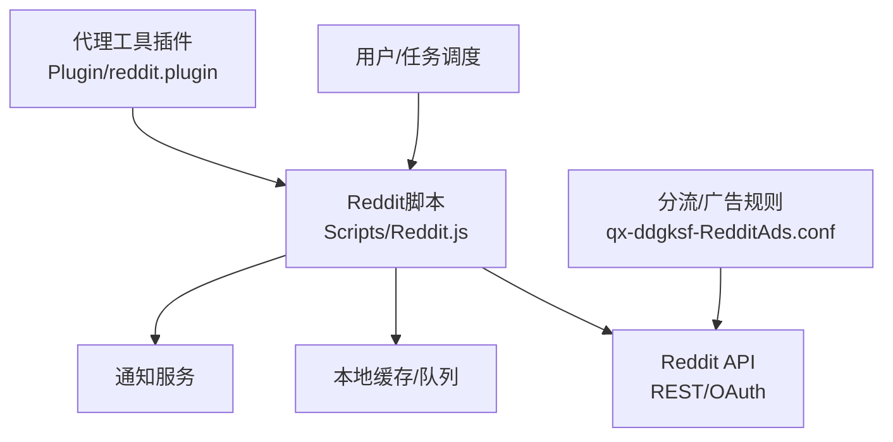
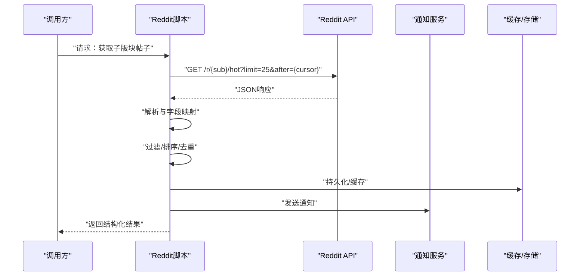
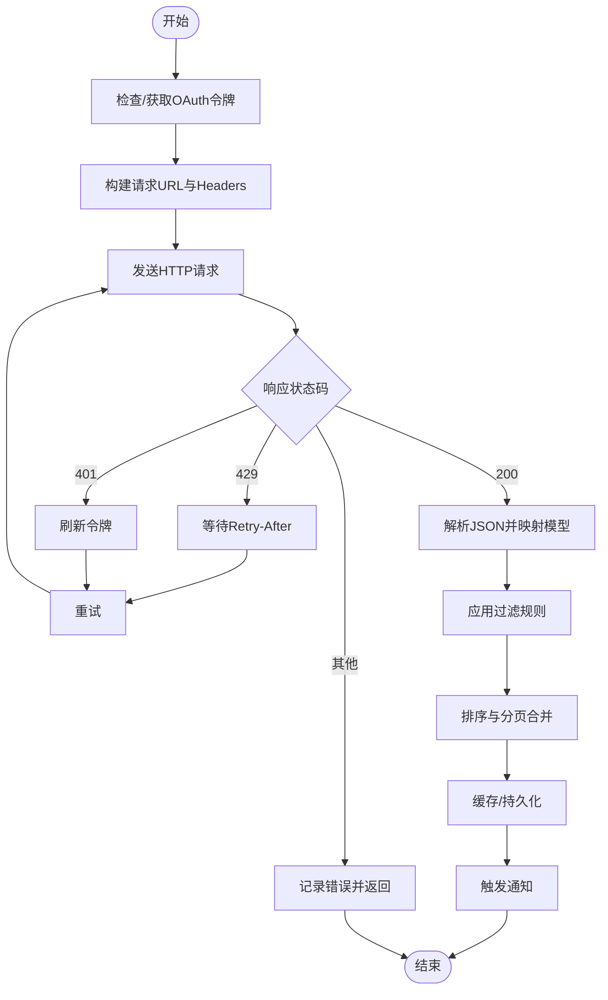
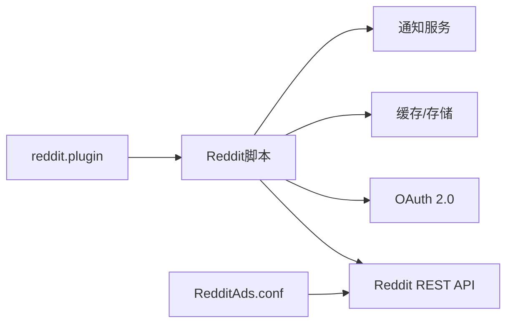

# Reddit脚本

<cite>
**本文引用的文件**   
- [README.md](file://README.md)
- [package.json](file://package.json)
- [Scripts/Reddit.js](file://Scripts/Reddit.js)
- [Plugin/reddit.plugin](file://Plugin/reddit.plugin)
- [Mirror/rules/qx-ddgksf-RedditAds.conf](file://Mirror/rules/qx-ddgksf-RedditAds.conf)
</cite>

## 目录
1. [简介](#简介)
2. [项目结构](#项目结构)
3. [核心组件](#核心组件)
4. [架构总览](#架构总览)
5. [详细组件分析](#详细组件分析)
6. [依赖关系分析](#依赖关系分析)
7. [性能考虑](#性能考虑)
8. [故障排查指南](#故障排查指南)
9. [结论](#结论)
10. [附录](#附录)

## 简介
本技术文档围绕仓库中的Reddit脚本与相关规则，系统性解析Reddit官方API使用方式、OAuth认证流程、REST调用模式，以及子版块内容获取、帖子排序机制、评论树处理等关键能力。同时给出反爬虫限制应对方案（速率控制、User-Agent轮换、代理池管理）、数据模型定义与字段映射、社区订阅管理与内容过滤规则、通知机制实现示例，以及错误恢复、重试策略与监控告警配置方法。读者可据此快速理解并扩展Reddit相关功能。

## 项目结构
本项目采用“脚本+插件+规则”的模块化组织方式：
- Scripts/Reddit.js：Reddit抓取与数据处理的核心脚本
- Plugin/reddit.plugin：在代理工具中启用的Reddit插件入口
- Mirror/rules/qx-ddgksf-RedditAds.conf：Reddit广告与流量分流规则
- README.md与package.json：项目说明与依赖清单

图表来源 
- [Scripts/Reddit.js](file://Scripts/Reddit.js)
- [Plugin/reddit.plugin](file://Plugin/reddit.plugin)
- [Mirror/rules/qx-ddgksf-RedditAds.conf](file://Mirror/rules/qx-ddgksf-RedditAds.conf)

章节来源
- [README.md](file://README.md)
- [package.json](file://package.json)

## 核心组件
- Reddit脚本（Scripts/Reddit.js）
  - 负责发起HTTP请求、处理响应、解析JSON、构建数据模型、执行过滤与排序、触发通知与持久化。
- 插件（Plugin/reddit.plugin）
  - 作为代理工具的加载入口，将Reddit相关域名与路径纳入脚本或规则处理链路。
- 规则（qx-ddgksf-RedditAds.conf）
  - 对Reddit域名的请求进行分流、去广告、缓存或重定向等策略配置。

章节来源
- [Scripts/Reddit.js](file://Scripts/Reddit.js)
- [Plugin/reddit.plugin](file://Plugin/reddit.plugin)
- [Mirror/rules/qx-ddgksf-RedditAds.conf](file://Mirror/rules/qx-ddgksf-RedditAds.conf)

## 架构总览
Reddit脚本整体遵循“采集→解析→治理→分发”的流水线：
- 采集层：通过OAuth鉴权访问Reddit REST API，按子版块与排序参数拉取帖子列表与详情。
- 解析层：标准化响应体为内部数据模型，统一字段类型与命名。
- 治理层：应用过滤规则（关键词、作者、子版块白名单/黑名单）、去重、分页合并。
- 分发层：写入缓存/数据库、推送通知、导出或转发到下游系统。

图表来源 
- [Scripts/Reddit.js](file://Scripts/Reddit.js)

## 详细组件分析

### Reddit脚本（Scripts/Reddit.js）
- 职责
  - 封装Reddit REST API调用（含OAuth令牌管理）
  - 解析JSON响应并转换为内部数据模型
  - 实现子版块内容获取、排序与分页
  - 处理评论树结构（扁平化与层级重建）
  - 应用过滤规则、去重与缓存策略
  - 触发通知与错误上报
- 关键流程
  - OAuth认证：客户端ID/密钥或令牌刷新，设置Authorization头
  - 请求构造：URL模板、查询参数（limit, before, after, sort）、Headers（User-Agent）
  - 响应处理：状态码判断、错误码映射、重试退避
  - 数据建模：Post、Comment、Subreddit、Author等实体字段映射
  - 过滤与排序：按热度、时间、评分等维度排序；按关键词/作者/子版块过滤
  - 评论树：将扁平评论列表按parent_id重建父子关系，支持深度限制
  - 通知：成功/失败事件上报，支持多通道（Webhook、邮件、IM）
- 错误与重试
  - 网络异常：指数退避+抖动
  - 限流（429）：读取Retry-After，等待后重试
  - 鉴权失败（401）：刷新令牌并重试一次
  - 业务错误（404/403）：记录日志并降级

图表来源 
- [Scripts/Reddit.js](file://Scripts/Reddit.js)

章节来源
- [Scripts/Reddit.js](file://Scripts/Reddit.js)

### 插件（Plugin/reddit.plugin）
- 作用
  - 在代理工具中启用Reddit相关域名与路径的处理逻辑
  - 将Reddit请求路由至脚本或规则引擎
- 典型配置项
  - 域名匹配：*.reddit.com、oauth.reddit.com、www.reddit.com
  - 路径匹配：/api/*、/r/*、/comments/*
  - 动作：脚本调用、规则分流、缓存命中

章节来源
- [Plugin/reddit.plugin](file://Plugin/reddit.plugin)

### 规则（qx-ddgksf-RedditAds.conf）
- 作用
  - 针对Reddit域名的广告拦截、资源替换、缓存与重定向
- 常见策略
  - 匹配广告域名并拒绝或替换
  - 静态资源缓存提升加载速度
  - 特定路径重定向到干净页面

章节来源
- [Mirror/rules/qx-ddgksf-RedditAds.conf](file://Mirror/rules/qx-ddgksf-RedditAds.conf)

## 依赖关系分析
- 外部依赖
  - Reddit官方REST API（/r/{sub}、/comments/{id}、/api/me等）
  - OAuth 2.0授权端点（/oauth/access_token、/oauth/token）
  - 通知服务（Webhook/邮件/IM）
  - 缓存/存储（内存缓存、Redis、SQLite等）
- 内部依赖
  - 脚本模块：请求封装、解析器、过滤器、排序器、评论树构建器、通知器
  - 插件与规则：域名/路径匹配与动作执行

图表来源 
- [Scripts/Reddit.js](file://Scripts/Reddit.js)
- [Plugin/reddit.plugin](file://Plugin/reddit.plugin)
- [Mirror/rules/qx-ddgksf-RedditAds.conf](file://Mirror/rules/qx-ddgksf-RedditAds.conf)

章节来源
- [Scripts/Reddit.js](file://Scripts/Reddit.js)
- [Plugin/reddit.plugin](file://Plugin/reddit.plugin)
- [Mirror/rules/qx-ddgksf-RedditAds.conf](file://Mirror/rules/qx-ddgksf-RedditAds.conf)

## 性能考虑
- 请求优化
  - 合理设置limit避免单次过大负载
  - 使用before/after游标分页，减少重复请求
  - 批量获取评论时限制深度与数量
- 缓存策略
  - 热点帖子与子版块列表短期缓存（TTL）
  - 评论树按需构建，避免全量展开
- 并发与限流
  - 控制并发数，避免触发Reddit限流
  - 指数退避+抖动重试，降低雪崩风险
- 资源清理
  - 定期清理过期缓存与临时文件
  - 监控内存占用与GC频率

[本节为通用指导，不直接分析具体文件]

## 故障排查指南
- 常见问题
  - 429 Too Many Requests：降低请求频率，增加退避间隔，检查是否未正确读取Retry-After
  - 401 Unauthorized：确认OAuth令牌有效性与有效期，必要时刷新令牌
  - 403 Forbidden：检查子版块权限与账号权限
  - 404 Not Found：校验子版块名称与帖子ID是否正确
- 调试建议
  - 开启详细日志，记录请求URL、Headers、响应体摘要
  - 使用抓包工具验证实际网络行为
  - 逐步缩小范围定位问题（单帖子/单子版块/单评论）
- 恢复策略
  - 自动重试与降级（返回部分数据或空结果）
  - 告警上报与人工介入阈值

章节来源
- [Scripts/Reddit.js](file://Scripts/Reddit.js)

## 结论
本仓库通过脚本、插件与规则的组合，构建了完整的Reddit数据采集与处理能力。基于Reddit官方REST API与OAuth认证，实现了子版块内容获取、排序与评论树处理，并通过过滤、缓存与通知形成闭环。配合反爬虫策略与错误恢复机制，可在稳定性的前提下高效运行。后续可扩展更多数据源与下游集成场景。

[本节为总结性内容，不直接分析具体文件]

## 附录

### Reddit官方API使用要点
- 基础端点
  - 子版块帖子：GET /r/{sub}/{sort}?limit=N&before={id}&after={id}
  - 帖子详情：GET /comments/{id}.json
  - 评论列表：GET /comments/{id}/comments.json
  - 用户信息：GET /api/me.json
- 排序参数
  - hot、new、top、rising、controversial
- 分页参数
  - limit、before、after
- 认证
  - OAuth 2.0：客户端凭据或令牌刷新，Authorization: Bearer {token}

章节来源
- [Scripts/Reddit.js](file://Scripts/Reddit.js)

### OAuth认证流程
- 步骤
  - 注册应用并获取客户端ID/密钥
  - 使用客户端凭据获取访问令牌
  - 在请求头中携带Authorization: Bearer {token}
  - 令牌过期前刷新并缓存
- 安全建议
  - 最小权限原则
  - 令牌加密存储
  - 敏感操作二次确认

章节来源
- [Scripts/Reddit.js](file://Scripts/Reddit.js)

### 数据模型定义与字段映射
- Post
  - id、title、author、subreddit、score、created_utc、url、thumbnail、num_comments、selftext、link_flair_text、is_video、over_18
- Comment
  - id、body、author、score、created_utc、parent_id、replies
- Subreddit
  - display_name、public_description、subscribers、icon_img
- Author
  - name、icon_img、link_karma、comment_karma
- 字段映射
  - 统一时间戳为UTC毫秒
  - 布尔值规范化（true/false）
  - 空值默认化处理

章节来源
- [Scripts/Reddit.js](file://Scripts/Reddit.js)

### 子版块内容获取与排序机制
- 获取流程
  - 选择子版块与排序方式
  - 构造请求URL与参数
  - 解析响应并构建Post列表
- 排序机制
  - hot：综合热度（评分、时间衰减）
  - new：发布时间倒序
  - top：时间窗口内最高分
  - rising：近期上升趋势
  - controversial：争议度（上下比接近）

章节来源
- [Scripts/Reddit.js](file://Scripts/Reddit.js)

### 评论树结构处理
- 扁平列表转树
  - 以parent_id建立父子关系
  - 限制最大深度避免无限递归
  - 支持按评分或时间排序子节点
- 性能优化
  - 按需加载深层评论
  - 缓存已构建的子树

章节来源
- [Scripts/Reddit.js](file://Scripts/Reddit.js)

### 反爬虫限制应对方案
- 速率控制
  - 全局QPS限制与令牌桶算法
  - 按子版块独立限速
- User-Agent轮换
  - 维护合法UA池，随机选择
  - 定期更新UA库
- 代理池管理
  - 多IP轮询与健康检查
  - 失败自动切换与隔离

章节来源
- [Scripts/Reddit.js](file://Scripts/Reddit.js)

### 社区订阅管理与内容过滤
- 订阅管理
  - 白名单/黑名单子版块
  - 订阅变更监听与增量同步
- 内容过滤
  - 关键词匹配（标题、正文、标签）
  - 作者过滤与信誉评分
  - 媒体类型过滤（图片/视频/链接）

章节来源
- [Scripts/Reddit.js](file://Scripts/Reddit.js)

### 通知机制实现示例
- 触发条件
  - 新帖到达、高赞评论、关键词命中
- 通道支持
  - Webhook、邮件、企业微信/钉钉/Slack
- 消息模板
  - 标题、摘要、链接、作者、子版块

章节来源
- [Scripts/Reddit.js](file://Scripts/Reddit.js)

### 错误恢复、重试策略与监控告警
- 错误分类
  - 网络错误、鉴权错误、限流错误、业务错误
- 重试策略
  - 指数退避+抖动
  - 最大重试次数与超时控制
- 监控告警
  - 成功率、延迟、错误率指标
  - 阈值告警与自动恢复

章节来源
- [Scripts/Reddit.js](file://Scripts/Reddit.js)