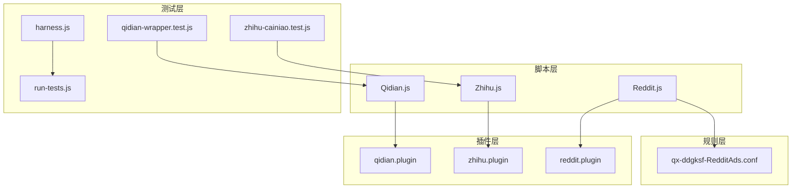
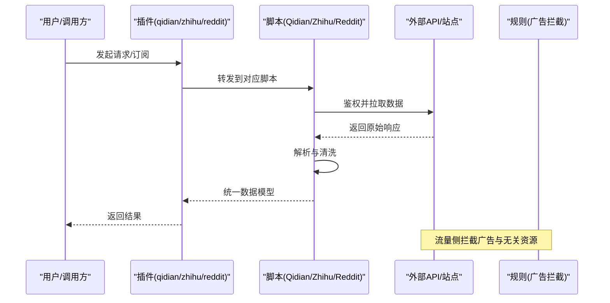
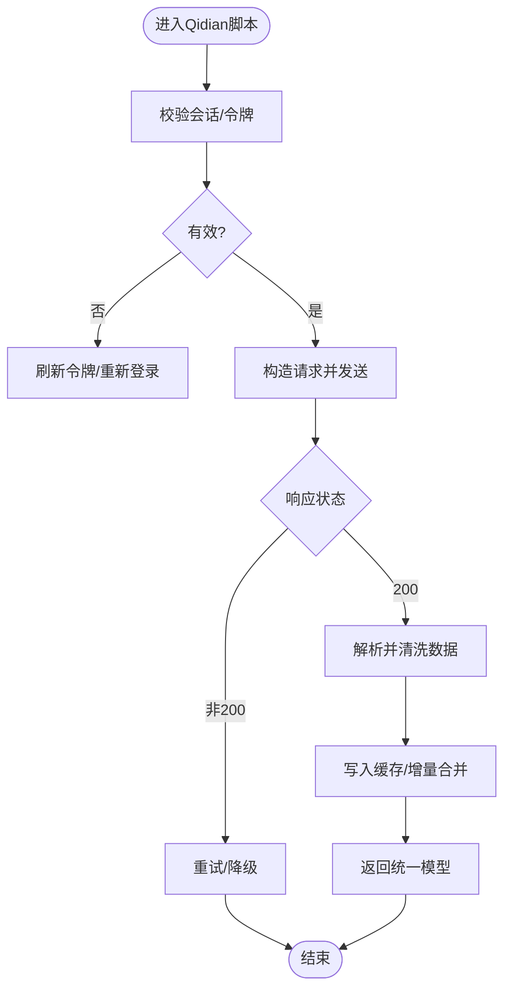
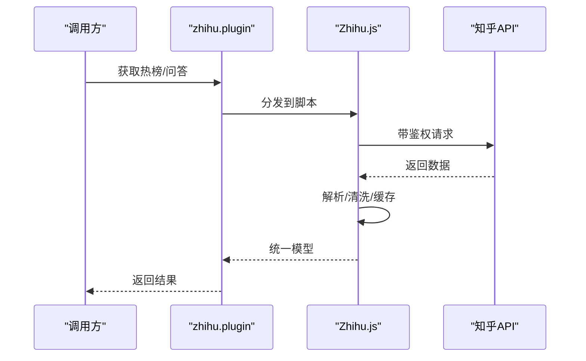
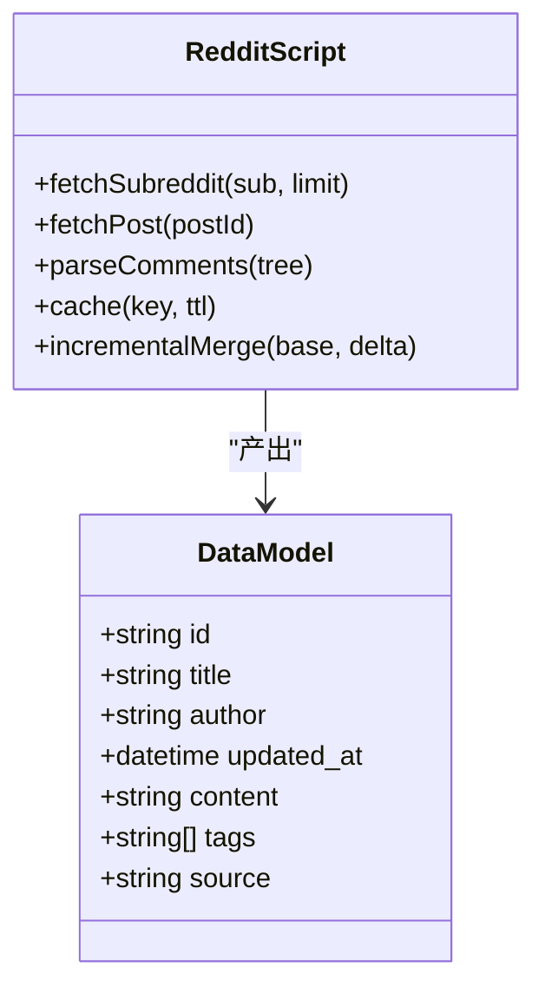
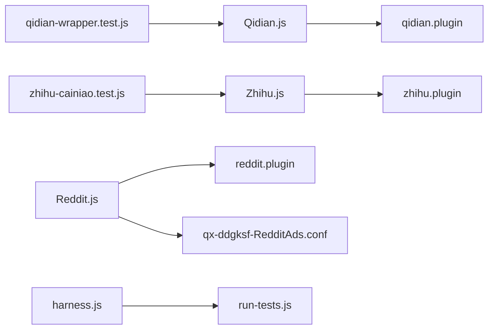

# 内容平台脚本

<cite>
**本文引用的文件**   
- [README.md](file://README.md)
- [package.json](file://package.json)
- [Scripts/Qidian.js](file://Scripts/Qidian.js)
- [Scripts/Zhihu.js](file://Scripts/Zhihu.js)
- [Scripts/Reddit.js](file://Scripts/Reddit.js)
- [Plugin/qidian.plugin](file://Plugin/qidian.plugin)
- [Plugin/zhihu.plugin](file://Plugin/zhihu.plugin)
- [Plugin/reddit.plugin](file://Plugin/reddit.plugin)
- [Mirror/rules/qx-ddgksf-RedditAds.conf](file://Mirror/rules/qx-ddgksf-RedditAds.conf)
- [test/cases/qidian-wrapper.test.js](file://test/cases/qidian-wrapper.test.js)
- [test/cases/zhihu-cainiao.test.js](file://test/cases/zhihu-cainiao.test.js)
- [test/harness.js](file://test/harness.js)
- [test/run-tests.js](file://test/run-tests.js)
</cite>

## 目录
1. [简介](#简介)
2. [项目结构](#项目结构)
3. [核心组件](#核心组件)
4. [架构总览](#架构总览)
5. [详细组件分析](#详细组件分析)
6. [依赖关系分析](#依赖关系分析)
7. [性能考量](#性能考量)
8. [故障排查指南](#故障排查指南)
9. [结论](#结论)
10. [附录](#附录)

## 简介
本仓库提供面向内容平台的脚本与规则集，覆盖起点中文网、知乎与Reddit等平台。目标包括：
- 统一的API集成抽象与数据模型定义
- 跨平台兼容（多代理/规则引擎）的适配层
- 反爬虫策略应对与内容过滤规则
- 缓存策略与增量更新机制
- 可测试性与稳定性保障

## 项目结构
仓库采用“脚本+插件+规则+测试”的分层组织方式：
- Scripts：各平台抓取与解析脚本（Qidian.js、Zhihu.js、Reddit.js）
- Plugin：面向不同代理/规则引擎的插件配置（qidian.plugin、zhihu.plugin、reddit.plugin）
- Mirror/rules：广告屏蔽与资源拦截规则（如Reddit广告规则）
- test：单元测试与用例，覆盖关键路径与边界场景
- 根级配置文件：package.json、README.md等

图表来源
- [Scripts/Qidian.js](file://Scripts/Qidian.js)
- [Scripts/Zhihu.js](file://Scripts/Zhihu.js)
- [Scripts/Reddit.js](file://Scripts/Reddit.js)
- [Plugin/qidian.plugin](file://Plugin/qidian.plugin)
- [Plugin/zhihu.plugin](file://Plugin/zhihu.plugin)
- [Plugin/reddit.plugin](file://Plugin/reddit.plugin)
- [Mirror/rules/qx-ddgksf-RedditAds.conf](file://Mirror/rules/qx-ddgksf-RedditAds.conf)
- [test/cases/qidian-wrapper.test.js](file://test/cases/qidian-wrapper.test.js)
- [test/cases/zhihu-cainiao.test.js](file://test/cases/zhihu-cainiao.test.js)
- [test/harness.js](file://test/harness.js)
- [test/run-tests.js](file://test/run-tests.js)

章节来源
- [README.md](file://README.md)
- [package.json](file://package.json)

## 核心组件
- 平台脚本（Qidian.js、Zhihu.js、Reddit.js）
  - 负责HTTP请求、鉴权、重试、限流、缓存、增量更新、内容解析与清洗
  - 输出统一的数据模型供上层消费
- 插件（qidian.plugin、zhihu.plugin、reddit.plugin）
  - 将脚本接入不同代理/规则引擎，完成路由、注入与响应改写
- 规则（qx-ddgksf-RedditAds.conf）
  - 针对特定平台的广告与无关资源进行拦截，提升体验与性能
- 测试（test/*）
  - 验证脚本行为、错误处理与兼容性

章节来源
- [Scripts/Qidian.js](file://Scripts/Qidian.js)
- [Scripts/Zhihu.js](file://Scripts/Zhihu.js)
- [Scripts/Reddit.js](file://Scripts/Reddit.js)
- [Plugin/qidian.plugin](file://Plugin/qidian.plugin)
- [Plugin/zhihu.plugin](file://Plugin/zhihu.plugin)
- [Plugin/reddit.plugin](file://Plugin/reddit.plugin)
- [Mirror/rules/qx-ddgksf-RedditAds.conf](file://Mirror/rules/qx-ddgksf-RedditAds.conf)
- [test/cases/qidian-wrapper.test.js](file://test/cases/qidian-wrapper.test.js)
- [test/cases/zhihu-cainiao.test.js](file://test/cases/zhihu-cainiao.test.js)

## 架构总览
整体采用“脚本-插件-规则-测试”分层架构：
- 脚本层实现跨平台一致的请求、鉴权、解析与数据模型
- 插件层对接具体运行环境（代理/规则引擎），暴露统一入口
- 规则层在流量侧拦截广告与不必要资源
- 测试层保证质量与回归

图表来源
- [Plugin/qidian.plugin](file://Plugin/qidian.plugin)
- [Plugin/zhihu.plugin](file://Plugin/zhihu.plugin)
- [Plugin/reddit.plugin](file://Plugin/reddit.plugin)
- [Scripts/Qidian.js](file://Scripts/Qidian.js)
- [Scripts/Zhihu.js](file://Scripts/Zhihu.js)
- [Scripts/Reddit.js](file://Scripts/Reddit.js)
- [Mirror/rules/qx-ddgksf-RedditAds.conf](file://Mirror/rules/qx-ddgksf-RedditAds.conf)

## 详细组件分析

### 起点中文网（Qidian）
- API集成与鉴权
  - 通过插件注入会话或令牌，脚本侧封装统一请求头与签名逻辑
  - 支持Cookie/Token轮换与失效重试
- 内容抓取与解析
  - 对列表页与详情页分别设计解析器，提取标题、作者、章节、更新时间等
  - 清洗HTML/JSON中的冗余字段与广告片段
- 反爬与限流
  - 指数退避重试、随机延迟、UA/Referer规范化
  - 失败阈值触发熔断与告警
- 缓存与增量更新
  - 基于时间戳与ETag/Last-Modified的缓存键
  - 增量拉取变更条目，合并去重后输出
- 数据模型
  - 统一字段：id、title、author、updated_at、content、tags、source
- 错误处理
  - 网络异常、解析失败、业务码非200等分类处理，抛出结构化错误

图表来源
- [Scripts/Qidian.js](file://Scripts/Qidian.js)
- [Plugin/qidian.plugin](file://Plugin/qidian.plugin)

章节来源
- [Scripts/Qidian.js](file://Scripts/Qidian.js)
- [Plugin/qidian.plugin](file://Plugin/qidian.plugin)
- [test/cases/qidian-wrapper.test.js](file://test/cases/qidian-wrapper.test.js)

### 知乎（Zhihu）
- API集成与鉴权
  - 使用Cookie/Token访问接口，必要时携带设备指纹或签名参数
  - 敏感接口增加二次校验与频率限制
- 内容抓取与解析
  - 问答、专栏、热榜等多端点聚合，统一为问答/文章模型
  - 去除广告、推广与无关UI元素
- 反爬与限流
  - 动态User-Agent池、请求间隔抖动、失败快速回退
- 缓存与增量更新
  - 热点数据短TTL缓存，长尾内容长TTL
  - 基于时间窗口的增量拉取
- 数据模型
  - 统一字段：id、type、title、author、updated_at、content、tags、source
- 错误处理
  - 区分网络错误、鉴权失败、业务错误，提供重试与降级策略

图表来源
- [Scripts/Zhihu.js](file://Scripts/Zhihu.js)
- [Plugin/zhihu.plugin](file://Plugin/zhihu.plugin)

章节来源
- [Scripts/Zhihu.js](file://Scripts/Zhihu.js)
- [Plugin/zhihu.plugin](file://Plugin/zhihu.plugin)
- [test/cases/zhihu-cainiao.test.js](file://test/cases/zhihu-cainiao.test.js)

### Reddit
- API集成与鉴权
  - 使用OAuth或内置令牌访问公共API，遵循速率限制
- 内容抓取与解析
  - 子版块、帖子、评论树的结构化解析
  - 过滤广告、推荐与无关元数据
- 反爬与限流
  - 遵守Reddit速率限制，指数退避与队列控制
- 缓存与增量更新
  - 热门内容短TTL，历史内容长TTL
  - 基于post_id与updated_at的增量合并
- 数据模型
  - 统一字段：id、title、author、updated_at、content、tags、source
- 错误处理
  - 429/5xx重试、超时降级、空结果兜底

图表来源
- [Scripts/Reddit.js](file://Scripts/Reddit.js)

章节来源
- [Scripts/Reddit.js](file://Scripts/Reddit.js)
- [Plugin/reddit.plugin](file://Plugin/reddit.plugin)
- [Mirror/rules/qx-ddgksf-RedditAds.conf](file://Mirror/rules/qx-ddgksf-RedditAds.conf)

### 统一接口抽象与数据模型
- 统一接口抽象
  - 所有脚本对外暴露一致的函数族：获取列表、获取详情、搜索、增量更新
  - 输入参数标准化（分页、排序、过滤条件）
  - 输出统一为DataModel，便于上层聚合与展示
- 数据模型定义
  - id：唯一标识
  - title：标题
  - author：作者/发布者
  - updated_at：更新时间
  - content：正文或摘要
  - tags：标签/分类
  - source：来源平台
- 错误处理框架
  - 网络错误、鉴权错误、解析错误、业务错误四类
  - 统一错误对象包含code、message、retryable、suggestion

章节来源
- [Scripts/Qidian.js](file://Scripts/Qidian.js)
- [Scripts/Zhihu.js](file://Scripts/Zhihu.js)
- [Scripts/Reddit.js](file://Scripts/Reddit.js)

### 跨平台兼容与插件适配
- 插件职责
  - 将脚本注册到不同代理/规则引擎
  - 处理请求注入、响应改写、环境变量注入
- 兼容要点
  - 统一入口函数名与参数约定
  - 针对不同引擎的差异做最小适配层
  - 日志与调试信息标准化

章节来源
- [Plugin/qidian.plugin](file://Plugin/qidian.plugin)
- [Plugin/zhihu.plugin](file://Plugin/zhihu.plugin)
- [Plugin/reddit.plugin](file://Plugin/reddit.plugin)

### 缓存策略与增量更新
- 缓存策略
  - 基于key的KV存储，支持TTL与过期清理
  - 热点数据短TTL，冷数据长TTL
- 增量更新
  - 以updated_at与ETag/Last-Modified作为变更信号
  - 合并去重，保留最新状态
- 一致性
  - 写前校验、写后校验，冲突时回滚或提示

章节来源
- [Scripts/Qidian.js](file://Scripts/Qidian.js)
- [Scripts/Zhihu.js](file://Scripts/Zhihu.js)
- [Scripts/Reddit.js](file://Scripts/Reddit.js)

### 反爬虫策略应对
- 通用策略
  - UA池、Referer规范、请求间隔抖动、失败重试
  - 限流与熔断，避免触发风控
- 平台特化
  - 起点：签名与Cookie校验
  - 知乎：设备指纹与二次校验
  - Reddit：速率限制与OAuth令牌管理

章节来源
- [Scripts/Qidian.js](file://Scripts/Qidian.js)
- [Scripts/Zhihu.js](file://Scripts/Zhihu.js)
- [Scripts/Reddit.js](file://Scripts/Reddit.js)

### 内容过滤与广告拦截
- 规则驱动
  - 通过规则文件拦截广告与无关资源
- 脚本内清洗
  - 正则与结构化解析结合，剔除广告、推广与噪声
- 效果评估
  - 覆盖率、误杀率、性能影响

章节来源
- [Mirror/rules/qx-ddgksf-RedditAds.conf](file://Mirror/rules/qx-ddgksf-RedditAds.conf)
- [Scripts/Reddit.js](file://Scripts/Reddit.js)

## 依赖关系分析
- 脚本与插件耦合度低，通过统一接口解耦
- 规则与脚本互补：规则在流量侧拦截，脚本在应用侧清洗
- 测试覆盖关键路径，降低回归风险

图表来源
- [Scripts/Qidian.js](file://Scripts/Qidian.js)
- [Scripts/Zhihu.js](file://Scripts/Zhihu.js)
- [Scripts/Reddit.js](file://Scripts/Reddit.js)
- [Plugin/qidian.plugin](file://Plugin/qidian.plugin)
- [Plugin/zhihu.plugin](file://Plugin/zhihu.plugin)
- [Plugin/reddit.plugin](file://Plugin/reddit.plugin)
- [Mirror/rules/qx-ddgksf-RedditAds.conf](file://Mirror/rules/qx-ddgksf-RedditAds.conf)
- [test/cases/qidian-wrapper.test.js](file://test/cases/qidian-wrapper.test.js)
- [test/cases/zhihu-cainiao.test.js](file://test/cases/zhihu-cainiao.test.js)
- [test/harness.js](file://test/harness.js)
- [test/run-tests.js](file://test/run-tests.js)

章节来源
- [package.json](file://package.json)
- [test/run-tests.js](file://test/run-tests.js)

## 性能考量
- 请求优化
  - 连接复用、并发控制、超时设置
- 解析优化
  - 流式解析、按需加载、减少内存占用
- 缓存命中
  - 合理TTL、热点预热、局部更新
- 监控与度量
  - 成功率、延迟、错误分布、缓存命中率

[本节为通用指导，不直接分析具体文件]

## 故障排查指南
- 常见问题
  - 鉴权失败：检查Cookie/Token有效性、有效期与权限
  - 解析失败：核对接口变更、字段映射与清洗规则
  - 限流/封禁：调整频率、退避策略与IP池
- 定位方法
  - 启用详细日志，记录请求/响应与中间状态
  - 使用测试用例复现问题，逐步缩小范围
- 恢复策略
  - 自动重试、降级到备用接口、回滚到缓存

章节来源
- [test/harness.js](file://test/harness.js)
- [test/run-tests.js](file://test/run-tests.js)

## 结论
本项目通过统一的脚本抽象、插件适配与规则拦截，实现了跨平台的内容抓取与解析能力。借助缓存与增量更新机制，提升了效率与稳定性；完善的测试与错误处理框架保障了可靠性。后续可继续扩展更多平台与增强反爬策略。

[本节为总结性内容，不直接分析具体文件]

## 附录
- 术语表
  - 插件：将脚本接入代理/规则引擎的适配层
  - 规则：用于拦截广告与无关资源的配置
  - 增量更新：仅拉取变更内容的更新机制
- 最佳实践
  - 保持接口稳定、数据模型一致
  - 严格错误分类与重试策略
  - 持续监控与自动化测试

[本节为补充信息，不直接分析具体文件]