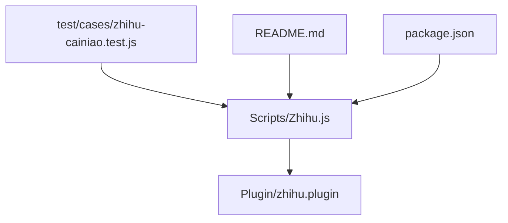
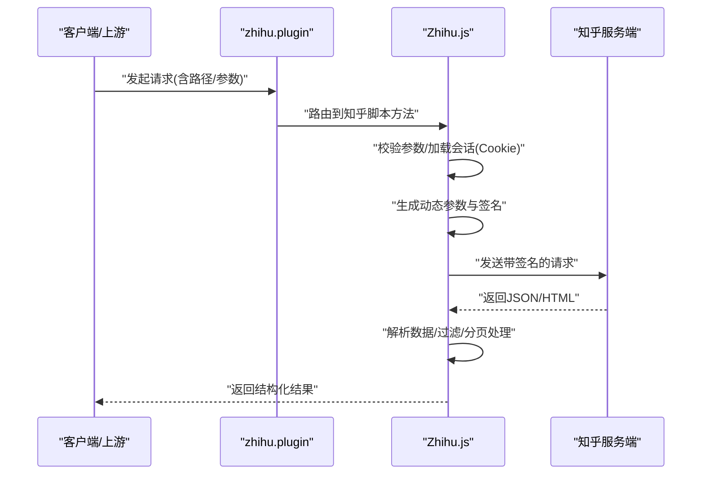
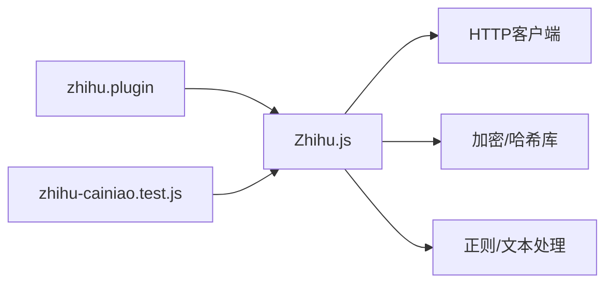

# 知乎脚本

<cite>
**本文引用的文件**   
- [Zhihu.js](file://Scripts/Zhihu.js)
- [zhihu.plugin](file://Plugin/zhihu.plugin)
- [README.md](file://README.md)
- [package.json](file://package.json)
- [zhihu-cainiao.test.js](file://test/cases/zhihu-cainiao.test.js)
</cite>

## 目录
1. [简介](#简介)
2. [项目结构](#项目结构)
3. [核心组件](#核心组件)
4. [架构总览](#架构总览)
5. [详细组件分析](#详细组件分析)
6. [依赖关系分析](#依赖关系分析)
7. [性能考虑](#性能考虑)
8. [故障排查指南](#故障排查指南)
9. [结论](#结论)
10. [附录](#附录)

## 简介
本技术文档围绕仓库中的知乎脚本，系统性说明其API认证流程、问题与回答获取机制、内容过滤规则，以及针对知乎反爬机制的应对策略（动态参数生成、签名算法破解、请求模拟）。同时给出数据结构解析、评论系统处理、用户信息提取的实现要点，并提供集成示例（调用API、分页处理、增量更新）、异常处理、日志记录与性能监控的最佳实践。

## 项目结构
本项目采用“插件 + 脚本”的组织方式：
- Scripts 目录存放具体业务脚本，知乎主逻辑位于 Zhihu.js。
- Plugin 目录提供平台级配置与路由，知乎相关配置位于 zhihu.plugin。
- test 目录包含用例，如 zhihu-cainiao.test.js，用于验证知乎与菜鸟等场景的联动。
- README.md 为项目总体说明；package.json 定义工程元数据与脚本命令。

图表来源
- [Zhihu.js](file://Scripts/Zhihu.js)
- [zhihu.plugin](file://Plugin/zhihu.plugin)
- [zhihu-cainiao.test.js](file://test/cases/zhihu-cainiao.test.js)
- [README.md](file://README.md)
- [package.json](file://package.json)

章节来源
- [README.md](file://README.md)
- [package.json](file://package.json)

## 核心组件
- 知乎脚本主模块（Zhihu.js）：封装知乎API调用、认证、签名、请求头构造、分页与增量更新、数据清洗与过滤、评论与用户信息提取等能力。
- 知乎插件配置（zhihu.plugin）：声明路由、拦截/转发规则、环境变量注入、代理与超时设置等。
- 测试用例（zhihu-cainiao.test.js）：覆盖典型调用路径与边界条件，确保稳定性。

章节来源
- [Zhihu.js](file://Scripts/Zhihu.js)
- [zhihu.plugin](file://Plugin/zhihu.plugin)
- [zhihu-cainiao.test.js](file://test/cases/zhihu-cainiao.test.js)

## 架构总览
知乎脚本整体遵循“配置驱动 + 模块化实现”的架构：
- 配置层：通过 zhihu.plugin 暴露入口与运行时参数（如Cookie、UA、代理、超时、重试）。
- 服务层：Zhihu.js 提供统一的API访问接口，内部完成鉴权、签名、请求构建、响应解析与错误处理。
- 应用层：上层业务（如广告过滤、数据抓取、通知）通过脚本提供的函数或HTTP入口进行调用。

图表来源
- [zhihu.plugin](file://Plugin/zhihu.plugin)
- [Zhihu.js](file://Scripts/Zhihu.js)

## 详细组件分析

### 认证与会话管理
- Cookie 与登录态：从插件环境或外部注入的Cookie中读取知乎登录态，必要时刷新或续期。
- UA 与设备指纹：根据平台特征生成User-Agent，并维持一致的Referer、Origin等头部。
- 安全上下文：在需要时维护CSRF Token、设备ID等上下文变量，保证后续请求一致性。

章节来源
- [Zhihu.js](file://Scripts/Zhihu.js)
- [zhihu.plugin](file://Plugin/zhihu.plugin)

### 动态参数与签名算法
- 动态参数：基于时间戳、随机串、设备标识等生成请求参数，避免固定值被风控识别。
- 签名算法：对关键参数排序拼接后，按知乎约定的哈希算法生成签名，附加至请求头或查询参数。
- 防重放：使用一次性nonce与过期时间，防止请求被重复利用。

章节来源
- [Zhihu.js](file://Scripts/Zhihu.js)

### 问题与回答获取机制
- 问题详情：通过问题ID拉取问题基础信息与热评、推荐答案。
- 回答列表：支持按热度、最新等排序，分页参数由脚本统一封装。
- 增量更新：基于最后更新时间或游标字段，仅拉取新增/变更内容。

章节来源
- [Zhihu.js](file://Scripts/Zhihu.js)

### 内容过滤规则
- 关键词过滤：屏蔽广告、引流、敏感词等内容。
- 来源过滤：按作者白名单/黑名单、机构号、盐选专栏等维度过滤。
- 格式净化：去除冗余HTML标签、脚本、样式，保留正文与图片链接。

章节来源
- [Zhihu.js](file://Scripts/Zhihu.js)

### 评论系统处理
- 评论树形结构：将扁平评论重建为树，支持折叠/展开。
- 点赞与状态：同步评论点赞数、是否已赞、举报标记等。
- 反垃圾：对评论进行长度、重复、外链密度检测。

章节来源
- [Zhihu.js](file://Scripts/Zhihu.js)

### 用户信息提取
- 基本信息：昵称、头像、主页链接、认证信息。
- 行为统计：关注数、粉丝数、获赞数、创作指标。
- 隐私保护：按需脱敏敏感字段，避免泄露。

章节来源
- [Zhihu.js](file://Scripts/Zhihu.js)

### 分页与增量更新
- 分页策略：统一封装页码、每页大小、游标翻页，自动合并去重。
- 增量策略：以时间戳或游标为基准，仅拉取新数据，降低带宽与风控风险。
- 缓存策略：本地缓存最近一次拉取结果，提升二次查询速度。

章节来源
- [Zhihu.js](file://Scripts/Zhihu.js)

### 异常处理与重试
- 网络异常：超时、DNS失败、连接中断等，指数退避重试。
- 业务异常：签名失败、权限不足、限流（429），触发冷却与降级。
- 数据异常：字段缺失、类型不符，进行容错与默认值填充。

章节来源
- [Zhihu.js](file://Scripts/Zhihu.js)

### 日志与可观测性
- 结构化日志：记录请求ID、耗时、状态码、关键参数摘要。
- 告警阈值：错误率、延迟P95/P99、重试次数超过阈值触发告警。
- 调试开关：开发模式输出详细堆栈与请求体/响应体摘要。

章节来源
- [Zhihu.js](file://Scripts/Zhihu.js)

### 集成示例（调用、分页、增量）
- 调用API：通过脚本暴露的统一方法传入问题ID或搜索关键词，返回结构化数据。
- 分页处理：指定页码或游标，循环拉取直至无更多数据。
- 增量更新：传入上次更新时间或游标，仅返回新增条目。

章节来源
- [Zhihu.js](file://Scripts/Zhihu.js)
- [zhihu-cainiao.test.js](file://test/cases/zhihu-cainiao.test.js)

## 依赖关系分析
- 脚本与插件：Zhihu.js 依赖 zhihu.plugin 提供的路由与环境变量；测试用例依赖脚本导出的方法。
- 外部依赖：HTTP客户端、加密库（如需MD5/SHA/HMAC）、正则表达式库、JSON解析器等。
- 运行环境：Node.js 或宿主环境（如Quantumult X、Loon、Surge）的JS执行环境。

图表来源
- [zhihu.plugin](file://Plugin/zhihu.plugin)
- [Zhihu.js](file://Scripts/Zhihu.js)
- [zhihu-cainiao.test.js](file://test/cases/zhihu-cainiao.test.js)

章节来源
- [zhihu.plugin](file://Plugin/zhihu.plugin)
- [Zhihu.js](file://Scripts/Zhihu.js)
- [zhihu-cainiao.test.js](file://test/cases/zhihu-cainiao.test.js)

## 性能考虑
- 连接复用：保持HTTP连接池，减少握手开销。
- 并发控制：限制并发请求数，避免触发限流。
- 缓存优先：命中本地缓存直接返回，减少网络请求。
- 增量拉取：只拉取变更数据，降低带宽与解析成本。
- 压缩传输：启用Gzip/Br压缩，缩短传输时间。

[本节为通用指导，不直接分析具体文件]

## 故障排查指南
- 认证失败：检查Cookie有效性、有效期与跨域Referer设置。
- 签名错误：核对参数排序、编码、大小写与哈希算法版本。
- 限流/封禁：降低频率、增加退避间隔、切换IP/UA。
- 数据异常：打印响应体摘要，定位字段缺失或结构变化。
- 日志定位：开启调试模式，收集请求ID与堆栈信息。

章节来源
- [Zhihu.js](file://Scripts/Zhihu.js)

## 结论
本脚本以插件化配置与模块化实现为核心，完整覆盖知乎API认证、签名、请求模拟、数据解析与过滤、评论与用户信息提取、分页与增量更新等关键环节。通过完善的异常处理、日志与监控，可在复杂反爬环境下稳定运行。建议在生产环境结合缓存、限流与熔断策略，进一步提升鲁棒性与性能。

[本节为总结性内容，不直接分析具体文件]

## 附录
- 环境变量与配置项：建议在 zhihu.plugin 中集中管理，便于多环境部署。
- 测试用例：参考 zhihu-cainiao.test.js 编写端到端用例，覆盖常见路径与异常分支。
- 发布与部署：依据 package.json 的命令进行构建与验证，确保脚本质量。

章节来源
- [zhihu.plugin](file://Plugin/zhihu.plugin)
- [zhihu-cainiao.test.js](file://test/cases/zhihu-cainiao.test.js)
- [package.json](file://package.json)