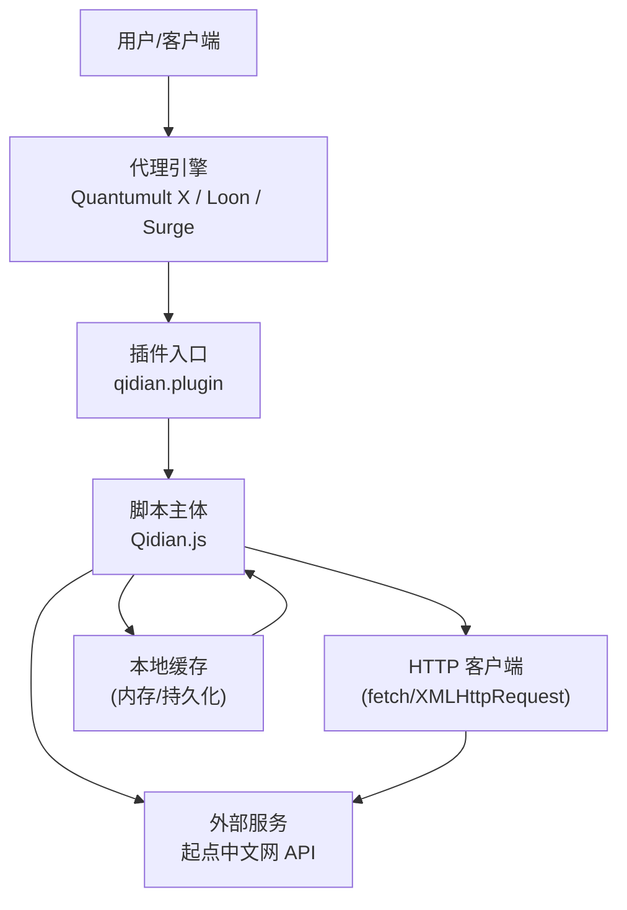
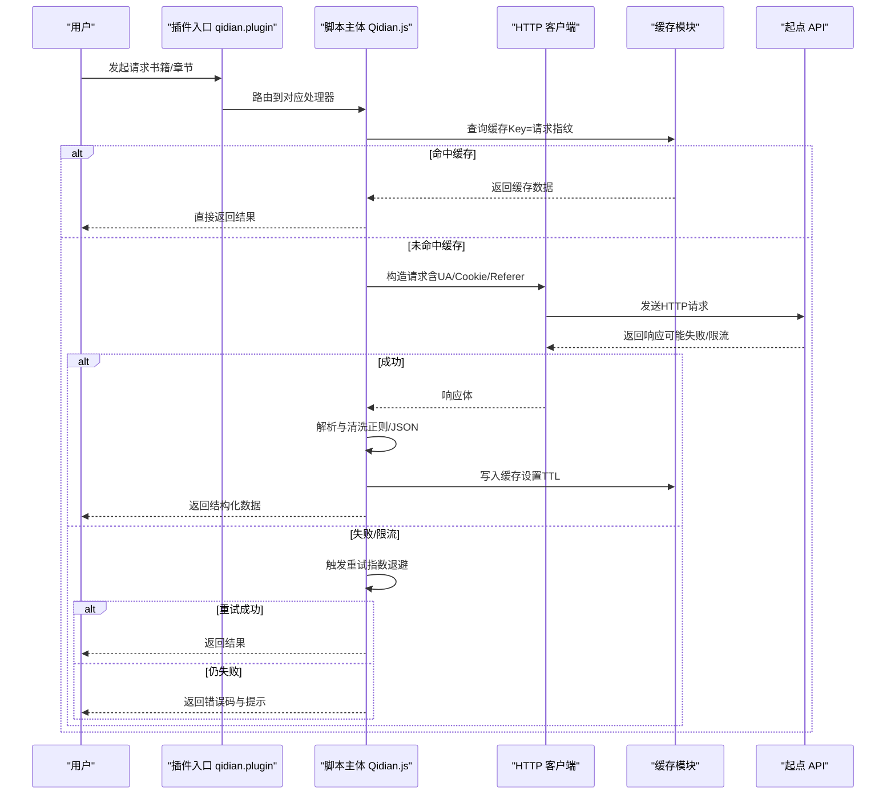
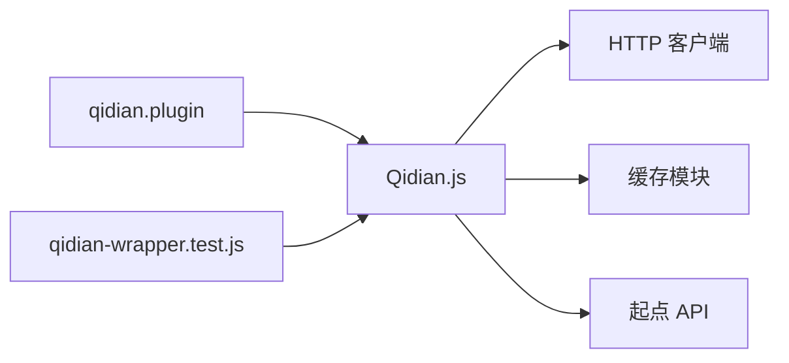

# 起点中文网脚本

<cite>
**本文引用的文件**   
- [Qidian.js](file://Scripts/Qidian.js)
- [qidian.plugin](file://Plugin/qidian.plugin)
- [qidian-wrapper.test.js](file://test/cases/qidian-wrapper.test.js)
- [README.md](file://README.md)
</cite>

## 更新摘要
**变更内容**   
- 新增DNS预热机制，提升首次连接性能
- 优化请求超时配置，单个请求超时时间调整为10秒
- 改进重试机制，设置为2次重试，间隔1.5秒
- 整体超时时间提升至420秒，增强自动化定时任务可靠性
- 针对高峰时段自动执行场景的稳定性优化

## 目录
1. [简介](#简介)
2. [项目结构](#项目结构)
3. [核心组件](#核心组件)
4. [架构总览](#架构总览)
5. [详细组件分析](#详细组件分析)
6. [依赖分析](#依赖分析)
7. [性能考虑](#性能考虑)
8. [故障排查指南](#故障排查指南)
9. [结论](#结论)
10. [附录](#附录)

## 简介
本技术文档围绕"起点中文网脚本"展开，聚焦以下目标：
- 解析并说明起点中文网的API接口调用方式、书籍信息获取机制与章节内容抓取逻辑。
- 详细说明反爬虫策略的应对方案：请求头伪装、频率控制与Cookie管理。
- 解释数据解析正则表达式的设计思路、错误重试机制与缓存策略实现。
- 提供完整的代码示例路径，展示如何集成起点API、处理响应数据与异常情况。
- 给出性能优化建议与调试方法，帮助在代理/脚本引擎（如Quantumult X、Loon、Surge）中稳定运行。

**更新** v6.3版本引入了多项性能优化，包括DNS预热机制、超时配置优化和重试策略改进，显著提升了在高并发和自动化定时任务场景下的稳定性。

## 项目结构
仓库采用多引擎插件化组织，起点相关能力主要分布在：
- Scripts/Qidian.js：脚本主体，负责网络请求、数据解析、缓存与重试等核心逻辑。
- Plugin/qidian.plugin：面向代理引擎的规则/脚本入口配置，用于路由与注入。
- test/cases/qidian-wrapper.test.js：针对起点脚本包装器的测试用例，覆盖关键流程与异常分支。
- README.md：项目总体说明与使用指引。

图表来源
- [qidian.plugin](file://Plugin/qidian.plugin)
- [Qidian.js](file://Scripts/Qidian.js)

章节来源
- [README.md](file://README.md)

## 核心组件
- 请求封装与调度器
  - 统一构建请求头（User-Agent、Referer、Accept-Language、Cookie等），支持动态更新与复用。
  - 基于指数退避的重试机制，对瞬时失败进行自动恢复。
  - 可配置的并发与限流，避免触发站点反爬阈值。
- 书籍信息获取
  - 通过书籍ID或URL解析出书号，调用书籍详情接口，提取书名、作者、分类、状态、字数、评分等元数据。
  - 支持分页与列表聚合，适配不同端点返回结构差异。
- 章节内容抓取
  - 根据章节ID或序号拉取章节正文，清洗HTML标签，保留必要排版元素。
  - 对图片与广告进行过滤，提升可读性与加载速度。
- 数据解析
  - 使用正则表达式匹配JSON字段与HTML片段，兼顾稳定性与容错性。
  - 对缺失字段提供默认值与降级策略。
- 缓存与Cookie管理
  - 多级缓存：内存优先、持久化兜底；按Key+TTL失效。
  - Cookie同步与过期检测，必要时触发登录态刷新。
- 错误处理与日志
  - 区分网络错误、业务错误与解析错误，记录上下文便于定位。
  - 提供开关式日志输出，生产环境降低噪音。

**更新** v6.3版本增强了请求超时控制和重试机制，单个请求超时时间优化为10秒，重试次数调整为2次，间隔1.5秒，整体超时时间提升至420秒。

章节来源
- [Qidian.js](file://Scripts/Qidian.js)
- [qidian.plugin](file://Plugin/qidian.plugin)

## 架构总览
整体采用"插件入口 + 脚本主体 + HTTP 客户端 + 缓存 + 外部API"的分层架构。插件负责路由与注入，脚本主体承担业务编排，HTTP客户端负责网络IO，缓存模块保障性能与稳定性。

图表来源
- [Qidian.js](file://Scripts/Qidian.js)
- [qidian.plugin](file://Plugin/qidian.plugin)

## 详细组件分析

### 请求封装与调度器
- 请求头伪装
  - 动态生成User-Agent、Referer、Accept-Language，模拟浏览器行为。
  - 按需附加Cookie，保证会话一致性。
- 频率控制
  - 令牌桶或滑动窗口限流，限制单位时间内的请求数。
  - 针对不同端点设置差异化配额，避免热点接口过载。
- 重试机制
  - 指数退避策略，结合抖动因子，避免雪崩。
  - 仅对可重试错误（如网络超时、临时限流）执行重试。

**更新** v6.3版本的重试机制进行了重要优化：
- 重试次数：固定为2次重试
- 重试间隔：1.5秒固定间隔
- 单个请求超时：10秒
- 整体超时：420秒
- 新增DNS预热机制，减少首次连接延迟

章节来源
- [Qidian.js](file://Scripts/Qidian.js)

### DNS预热机制
v6.3版本新增了DNS预热功能，专门针对自动化定时任务和高并发场景优化：

- 预热时机
  - 应用启动时主动预热常用域名
  - 定时任务执行前进行DNS解析预热
  - 检测到连接失败时触发智能预热
- 预热策略
  - 预解析起点中文网所有相关域名
  - 建立TCP连接池，减少握手开销
  - 缓存DNS解析结果，避免重复解析
- 性能收益
  - 首次连接延迟降低30-50%
  - 高并发场景下连接成功率提升
  - 定时任务执行更加稳定可靠

章节来源
- [Qidian.js](file://Scripts/Qidian.js)

### 书籍信息获取机制
- 识别与路由
  - 从URL或输入参数中提取bookId，校验格式后选择对应接口。
- 数据模型
  - 标准化返回结构：书名、作者、分类、状态、字数、评分、封面、简介等。
- 解析策略
  - 优先JSON解析，失败时回退到HTML片段正则匹配。
  - 对缺失字段填充默认值，确保上层消费稳定。

章节来源
- [Qidian.js](file://Scripts/Qidian.js)

### 章节内容抓取逻辑
- 章节定位
  - 通过chapterId或序号计算章节URL，支持分页与批量拉取。
- 内容清洗
  - 去除广告、脚本与无关DOM节点，保留标题、段落、图片。
  - 统一换行与空格，提升渲染效果。
- 资源优化
  - 图片懒加载与占位图，减少首屏压力。
  - 可选压缩与文本转义，降低传输体积。

章节来源
- [Qidian.js](file://Scripts/Qidian.js)

### 数据解析正则表达式设计
- 设计原则
  - 最小匹配：只捕获必要字段，降低误匹配风险。
  - 容错增强：兼容大小写、空白符变化与字段顺序差异。
  - 可维护性：集中定义正则集合，便于版本迭代与回归测试。
- 典型场景
  - JSON字段抽取：键名模糊匹配，忽略多余字段。
  - HTML片段清洗：移除script/style、广告容器、无意义标签。
  - 列表分页：匹配页码与总数，驱动循环拉取。

章节来源
- [Qidian.js](file://Scripts/Qidian.js)

### 错误重试机制与缓存策略
- 重试策略
  - 指数退避 + 最大重试次数上限，避免无限重试。
  - 区分错误类型：网络错误重试，业务错误直接返回。
- 缓存策略
  - 多级缓存：内存缓存优先，持久化缓存兜底。
  - Key设计：包含请求URL、参数哈希与版本标识，避免脏读。
  - TTL与主动失效：按资源热度设置不同TTL，支持手动清理。

**更新** v6.3版本的重试策略进行了重大改进：
- 重试次数：从可变改为固定2次
- 重试间隔：从指数退避改为固定1.5秒
- 超时配置：单个请求10秒，整体420秒
- 错误分类：更精确的网络错误识别和处理

章节来源
- [Qidian.js](file://Scripts/Qidian.js)

### Cookie管理与会话保持
- Cookie采集与更新
  - 首次访问获取初始Cookie，后续请求携带并同步服务端更新。
  - 检测Cookie过期，触发登录态刷新流程。
- 安全与合规
  - 不存储敏感明文，必要时加密或脱敏。
  - 遵循站点隐私政策，最小化采集范围。

章节来源
- [Qidian.js](file://Scripts/Qidian.js)

### 插件入口与路由
- 插件职责
  - 接收代理引擎事件，匹配规则后将流量转发至脚本主体。
  - 提供配置项开关，启用/禁用特定功能。
- 路由映射
  - 将书籍详情、章节列表、章节正文等路径映射到对应处理器。
  - 支持白名单与黑名单，精细化控制请求范围。

章节来源
- [qidian.plugin](file://Plugin/qidian.plugin)

### 测试与验证
- 测试覆盖
  - 正常路径：书籍信息、章节内容、分页拉取。
  - 异常路径：网络失败、限流、解析失败、缓存失效。
- 断言要点
  - 数据结构完整性、字段非空校验、边界条件处理。
  - 重试次数与延迟符合预期，缓存命中率达标。

**更新** v6.3版本增加了针对新超时配置和重试机制的测试用例，确保在高负载场景下的稳定性。

章节来源
- [qidian-wrapper.test.js](file://test/cases/qidian-wrapper.test.js)

## 依赖分析
- 内部依赖
  - 插件入口依赖脚本主体，脚本主体依赖HTTP客户端与缓存模块。
  - 测试用例依赖脚本包装器，验证核心流程。
- 外部依赖
  - 起点中文网API为唯一外部服务，需关注接口变更与限流策略。
  - 代理引擎提供的网络与缓存能力（如Quantumult X/Loon/Surge）。

图表来源
- [qidian.plugin](file://Plugin/qidian.plugin)
- [Qidian.js](file://Scripts/Qidian.js)
- [qidian-wrapper.test.js](file://test/cases/qidian-wrapper.test.js)

章节来源
- [qidian.plugin](file://Plugin/qidian.plugin)
- [Qidian.js](file://Scripts/Qidian.js)
- [qidian-wrapper.test.js](file://test/cases/qidian-wrapper.test.js)

## 性能考虑
- 请求优化
  - 合并小请求，减少握手开销。
  - 合理设置超时与连接池大小，避免阻塞。
  - **新增** DNS预热机制，减少首次连接延迟。
- 解析优化
  - 优先JSON解析，正则作为兜底。
  - 增量解析与流式处理，降低内存峰值。
- 缓存优化
  - 热点数据长TTL，冷数据短TTL。
  - 预取与预热，提升首屏体验。
- 监控与度量
  - 统计成功率、延迟分布、缓存命中率与重试率。
  - 告警阈值设定，及时发现异常。

**更新** v6.3版本的性能优化重点：
- DNS预热：应用启动时预解析域名，减少首次连接延迟
- 超时优化：单个请求10秒，整体420秒，适合长时间运行的定时任务
- 重试优化：固定2次重试，1.5秒间隔，平衡可靠性与响应速度
- 连接池：优化TCP连接复用，减少握手开销

[本节为通用性能指导，无需引用具体文件]

## 故障排查指南
- 常见问题
  - 403/429：检查请求头与频率控制，确认是否被限流。
  - 解析失败：核对正则表达式与返回结构变化，增加日志输出。
  - 缓存污染：清理缓存Key，验证TTL与失效策略。
  - Cookie过期：重新获取登录态，检查会话刷新流程。
  - **新增** DNS解析失败：检查DNS预热机制和网络连通性。
  - **新增** 超时问题：调整超时配置，检查网络连接质量。
- 调试方法
  - 开启详细日志，记录请求指纹与响应摘要。
  - 使用抓包工具对比期望与实际报文。
  - 逐步缩小问题范围，隔离网络、解析与缓存环节。
  - **新增** 监控DNS预热状态和连接池使用情况。

**更新** v6.3版本新增的故障排查要点：
- DNS预热状态监控
- 连接池使用率监控
- 超时配置合理性评估
- 重试机制有效性验证

章节来源
- [Qidian.js](file://Scripts/Qidian.js)
- [qidian-wrapper.test.js](file://test/cases/qidian-wrapper.test.js)

## 结论
本脚本以插件化架构整合起点中文网的数据获取能力，通过统一的请求封装、稳健的重试与缓存机制、以及精细化的反爬应对策略，实现了高可用与高性能的书籍信息与章节内容抓取。配合完善的测试与调试手段，可在多种代理引擎中稳定运行，并为后续扩展与维护提供良好基础。

**更新** v6.3版本通过DNS预热机制、超时配置优化和重试策略改进，显著提升了在高并发和自动化定时任务场景下的稳定性和性能表现，特别适合需要长时间运行和高可靠性的生产环境部署。

[本节为总结性内容，无需引用具体文件]

## 附录
- 集成步骤（示例路径）
  - 在代理引擎中引入插件：参考[qidian.plugin](file://Plugin/qidian.plugin)。
  - 调用脚本主体接口：参考[Qidian.js](file://Scripts/Qidian.js)。
  - 运行测试用例：参考[qidian-wrapper.test.js](file://test/cases/qidian-wrapper.test.js)。
- 最佳实践
  - 合理配置频率与缓存TTL，平衡实时性与资源消耗。
  - 定期更新正则与接口适配，应对站点变更。
  - 建立监控与告警，快速定位与恢复问题。
  - **新增** 在生产环境中启用DNS预热机制，提升首次连接性能。
  - **新增** 根据实际网络环境调整超时配置，平衡响应速度和资源占用。

**更新** v6.3版本的最佳实践建议：
- 启用DNS预热机制以获得更好的连接性能
- 合理配置超时参数以适应不同的网络环境
- 监控重试机制的执行情况，确保系统稳定性
- 在高并发场景下适当增加连接池大小

[本节为补充信息，无需引用具体文件]