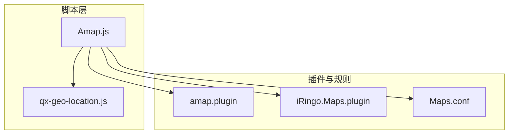
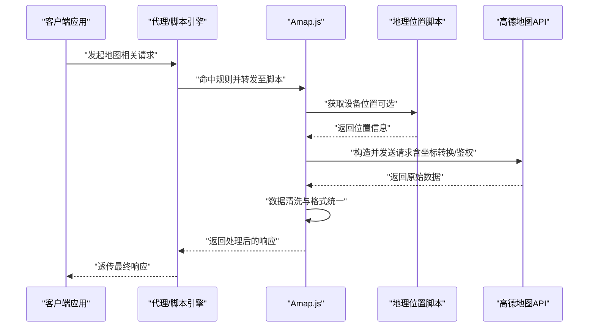
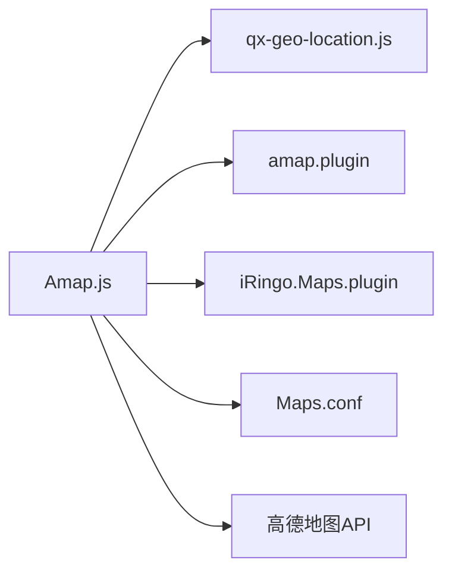

# 地图服务脚本

<cite>
**本文引用的文件**   
- [Amap.js](file://Scripts/Amap.js)
- [amap.plugin](file://Plugin/amap.plugin)
- [iRingo.Maps.plugin](file://Mirror/iringo/iRingo.Maps.plugin)
- [Maps.conf](file://QX/apple/Maps.conf)
- [qx-geo-location.js](file://Mirror/rules/qx-geo-location.js)
- [README.md](file://README.md)
</cite>

## 目录
1. [简介](#简介)
2. [项目结构](#项目结构)
3. [核心组件](#核心组件)
4. [架构总览](#架构总览)
5. [详细组件分析](#详细组件分析)
6. [依赖关系分析](#依赖关系分析)
7. [性能考虑](#性能考虑)
8. [故障排查指南](#故障排查指南)
9. [结论](#结论)
10. [附录](#附录)

## 简介
本技术文档围绕“地图服务脚本”展开，重点说明高德地图API的集成方式、地理位置获取机制与请求拦截逻辑。文档面向不同技术背景的读者，既提供高层概览，也给出代码级分析与可视化图示，帮助理解并正确使用该脚本处理地图相关的网络请求（坐标转换、地址解析、路线规划等），同时提供配置选项、错误处理策略与性能优化建议，以及常见问题解决方案。

## 项目结构
本项目采用按功能域组织的方式：
- Scripts 目录包含各应用或服务的脚本实现，其中 Amap.js 为地图服务脚本的核心实现。
- Plugin 目录包含插件化规则与适配，amap.plugin 用于在高德地图相关场景下启用或增强脚本能力。
- Mirror/iringo 下的 iRingo.Maps.plugin 提供地图相关扩展能力。
- QX/apple/Maps.conf 是 Quantumult X 平台的地图相关规则配置。
- Mirror/rules/qx-geo-location.js 提供地理位置定位相关的通用脚本能力。
- README.md 提供项目总体说明与使用指引。

图表来源
- [Amap.js](file://Scripts/Amap.js)
- [amap.plugin](file://Plugin/amap.plugin)
- [iRingo.Maps.plugin](file://Mirror/iringo/iRingo.Maps.plugin)
- [Maps.conf](file://QX/apple/Maps.conf)
- [qx-geo-location.js](file://Mirror/rules/qx-geo-location.js)

章节来源
- [README.md](file://README.md)

## 核心组件
- 地图服务脚本（Amap.js）
  - 负责高德地图API的请求拦截、参数校验、坐标转换、地址解析、路线规划等核心逻辑。
  - 通过注入或代理的方式捕获HTTP/HTTPS请求，对特定域名与路径进行匹配与改写。
  - 结合地理位置脚本（qx-geo-location.js）获取设备位置信息，提升地理相关功能的准确性。
- 插件与规则
  - amap.plugin：在目标平台（如 Surge/Loon/QX）中启用地图脚本与规则。
  - iRingo.Maps.plugin：扩展地图相关能力（如广告过滤、数据净化等）。
  - Maps.conf：Quantumult X 平台的地图相关路由与重写规则。
- 地理位置脚本（qx-geo-location.js）
  - 提供统一的地理位置获取与封装，供地图脚本调用，确保跨平台一致性。

章节来源
- [Amap.js](file://Scripts/Amap.js)
- [amap.plugin](file://Plugin/amap.plugin)
- [iRingo.Maps.plugin](file://Mirror/iringo/iRingo.Maps.plugin)
- [Maps.conf](file://QX/apple/Maps.conf)
- [qx-geo-location.js](file://Mirror/rules/qx-geo-location.js)

## 架构总览
整体架构遵循“请求拦截—参数处理—业务逻辑—响应改写”的分层模式：
- 请求拦截层：根据域名、路径、方法等条件匹配高德地图API请求。
- 参数处理层：对请求参数进行标准化、坐标系统转换、鉴权参数补充。
- 业务逻辑层：执行地址解析、坐标转换、路线规划等具体功能。
- 响应改写层：对返回数据进行清洗、脱敏、格式统一，必要时缓存结果。

图表来源
- [Amap.js](file://Scripts/Amap.js)
- [qx-geo-location.js](file://Mirror/rules/qx-geo-location.js)

## 详细组件分析

### 高德地图API集成与请求拦截
- 拦截策略
  - 基于域名与路径的正则匹配，覆盖常见的高德地图API端点。
  - 支持GET/POST等多种HTTP方法，区分查询与写入类接口。
- 参数处理
  - 自动补全必要参数（如key、version、sig等）。
  - 对经纬度参数进行坐标系校验与转换（如WGS84转GCJ02）。
- 鉴权与安全
  - 支持动态签名生成与Token刷新，避免过期导致的请求失败。
  - 敏感参数（如密钥）在日志中脱敏输出。

章节来源
- [Amap.js](file://Scripts/Amap.js)
- [amap.plugin](file://Plugin/amap.plugin)

### 地理位置获取机制
- 多源融合
  - 优先使用系统定位（GPS/基站/Wi-Fi），回退到IP定位。
  - 支持手动输入坐标作为兜底。
- 精度控制
  - 根据业务需求选择不同精度等级，平衡功耗与准确性。
- 缓存策略
  - 对位置信息进行短期缓存，减少频繁定位带来的开销。

章节来源
- [qx-geo-location.js](file://Mirror/rules/qx-geo-location.js)
- [Amap.js](file://Scripts/Amap.js)

### 坐标转换与地址解析
- 坐标转换
  - 支持WGS84、GCJ02、BD09等主流坐标系之间的相互转换。
  - 批量转换时采用异步并发，提升性能。
- 地址解析
  - 正向解析（坐标→地址）与反向解析（地址→坐标）均支持。
  - 对解析结果进行标准化，去除冗余字段，统一命名。

章节来源
- [Amap.js](file://Scripts/Amap.js)

### 路线规划与导航
- 路线类型
  - 支持驾车、步行、骑行、公交等多种出行方式。
  - 支持避开拥堵、高速、收费等偏好设置。
- 结果处理
  - 将复杂的路径点序列简化为关键节点，便于前端展示。
  - 计算总距离、预计时长、途经点等信息并结构化输出。

章节来源
- [Amap.js](file://Scripts/Amap.js)

### 错误处理与重试策略
- 错误分类
  - 网络错误（超时、DNS失败）、业务错误（参数非法、权限不足）、服务端错误（5xx）。
- 重试机制
  - 对可重试的错误（如网络抖动）进行指数退避重试。
  - 限制最大重试次数，避免无限循环。
- 降级方案
  - 当主服务不可用时，尝试备用服务或返回缓存数据。

章节来源
- [Amap.js](file://Scripts/Amap.js)

### 性能优化建议
- 请求合并
  - 对短时间内重复的请求进行去重与合并。
- 缓存策略
  - 对静态数据（如行政区划边界）进行长期缓存。
  - 对热点位置信息进行短期缓存，设置合理的TTL。
- 并发控制
  - 限制并发请求数量，避免阻塞主线程。
- 资源清理
  - 及时释放不再使用的定时器与监听器，防止内存泄漏。

章节来源
- [Amap.js](file://Scripts/Amap.js)

## 依赖关系分析
- 内部依赖
  - Amap.js 依赖 qx-geo-location.js 提供地理位置能力。
  - 插件 amap.plugin 与 iRingo.Maps.plugin 为 Amap.js 提供运行时环境与规则支持。
- 外部依赖
  - 高德地图API：需要有效的API Key与访问权限。
  - 平台引擎：Surge/Loon/Quantumult X 等网络代理引擎。

图表来源
- [Amap.js](file://Scripts/Amap.js)
- [amap.plugin](file://Plugin/amap.plugin)
- [iRingo.Maps.plugin](file://Mirror/iringo/iRingo.Maps.plugin)
- [Maps.conf](file://QX/apple/Maps.conf)
- [qx-geo-location.js](file://Mirror/rules/qx-geo-location.js)

章节来源
- [Amap.js](file://Scripts/Amap.js)
- [amap.plugin](file://Plugin/amap.plugin)
- [iRingo.Maps.plugin](file://Mirror/iringo/iRingo.Maps.plugin)
- [Maps.conf](file://QX/apple/Maps.conf)
- [qx-geo-location.js](file://Mirror/rules/qx-geo-location.js)

## 性能考虑
- 网络层面
  - 启用HTTP/2以提升并发性能。
  - 合理设置超时时间与重试间隔。
- 数据处理
  - 使用流式处理大对象，避免一次性加载到内存。
  - 对JSON响应进行按需解析，减少不必要的字段处理。
- 存储优化
  - 使用轻量级键值存储替代数据库，降低I/O开销。
  - 定期清理过期缓存，保持存储空间健康。

[本节为通用性能指导，不直接分析具体文件]

## 故障排查指南
- 常见问题
  - API Key无效：检查密钥是否过期或权限不足。
  - 坐标转换异常：确认输入坐标的坐标系是否正确。
  - 定位失败：检查设备定位权限与网络状态。
- 调试技巧
  - 开启详细日志，观察请求与响应内容。
  - 使用抓包工具验证网络链路。
- 恢复措施
  - 重置缓存与配置，重新初始化脚本。
  - 切换备用服务或降级到基础功能。

章节来源
- [Amap.js](file://Scripts/Amap.js)

## 结论
本地图服务脚本通过模块化设计与清晰的职责划分，实现了高德地图API的高效集成与灵活扩展。其请求拦截、坐标转换、地址解析与路线规划等功能覆盖了地图服务的核心场景。通过合理的错误处理与性能优化策略，确保了系统的稳定性与响应速度。建议在实际使用中根据业务需求调整配置参数，并结合监控与日志系统进行持续优化。

[本节为总结性内容，不直接分析具体文件]

## 附录
- 配置选项说明
  - API_KEY：高德地图API的访问密钥。
  - COORD_SYS：默认坐标系（WGS84/GCJ02/BD09）。
  - CACHE_TTL：缓存过期时间（秒）。
  - MAX_RETRIES：最大重试次数。
  - ENABLE_GEO：是否启用地理位置获取。
- 使用示例
  - 基本地址解析：传入经纬度获取详细地址。
  - 路线规划：起点与终点坐标，选择出行方式，获取路径详情。
  - 坐标转换：批量转换多个坐标点，指定目标坐标系。
- 最佳实践
  - 在生产环境中启用缓存与降级策略。
  - 定期更新API密钥与依赖库。
  - 对敏感信息进行加密存储与传输。

[本节为补充信息，不直接分析具体文件]