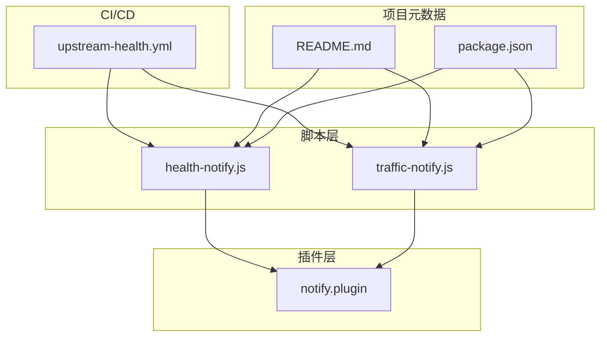
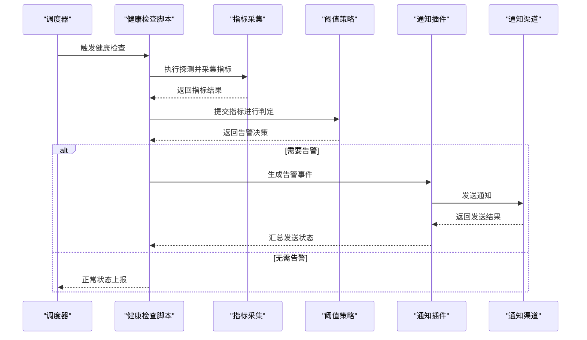
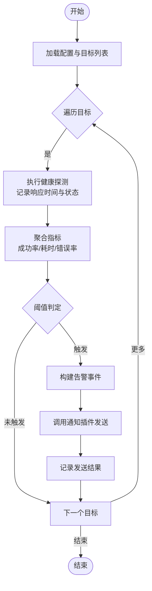
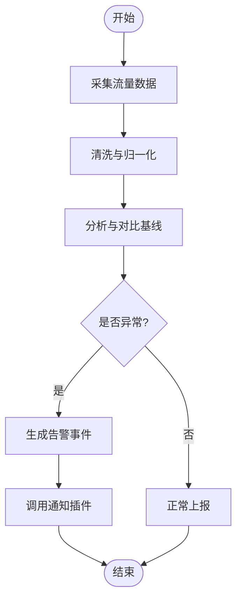
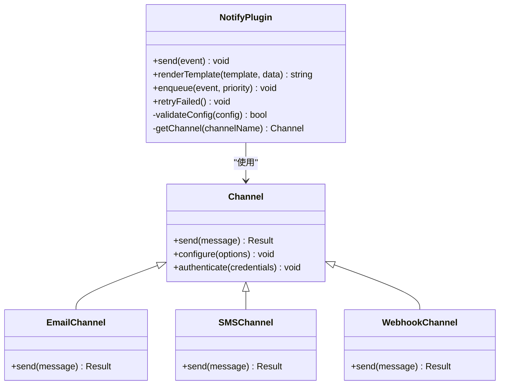
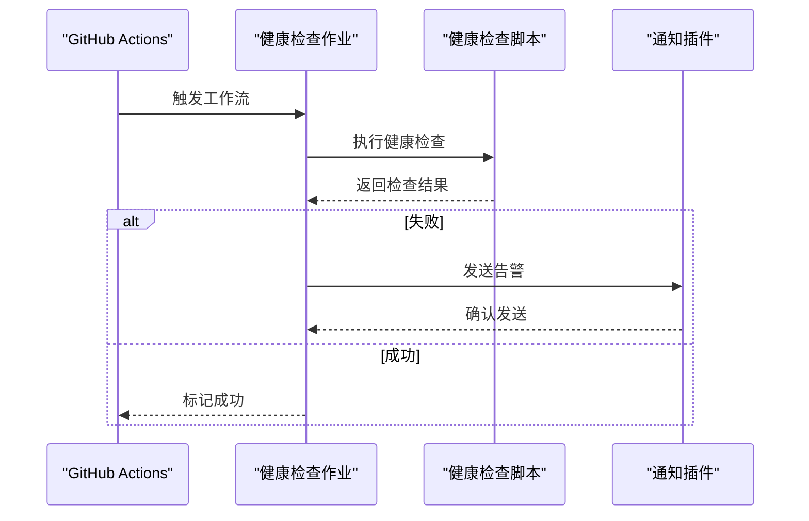
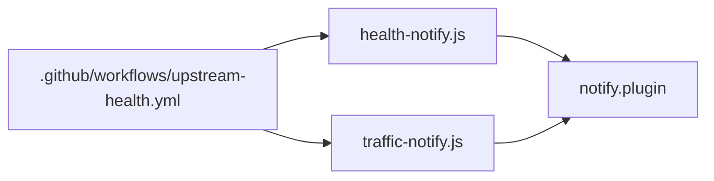

# 健康检查通知系统

<cite>
**本文引用的文件**   
- [health-notify.js](file://Scripts/health-notify.js)
- [traffic-notify.js](file://Scripts/traffic-notify.js)
- [notify.plugin](file://Plugin/notify.plugin)
- [upstream-health.yml](file://.github/workflows/upstream-health.yml)
- [README.md](file://README.md)
- [package.json](file://package.json)
</cite>

## 目录
1. [简介](#简介)
2. [项目结构](#项目结构)
3. [核心组件](#核心组件)
4. [架构总览](#架构总览)
5. [详细组件分析](#详细组件分析)
6. [依赖关系分析](#依赖关系分析)
7. [性能考量](#性能考量)
8. [故障诊断指南](#故障诊断指南)
9. [结论](#结论)
10. [附录](#附录)

## 简介
本技术文档面向“健康检查通知系统”，围绕服务健康状态检测、监控指标收集、告警触发逻辑、定时任务调度与轮询策略、阈值判断规则、通知渠道配置（邮件、短信、Webhook等）、消息模板定制、发送队列管理、故障诊断、日志分析方法、性能调优建议，以及与外部通知服务的集成方式、认证机制和错误处理策略进行全面说明。文档基于仓库中的脚本与配置文件进行梳理，力求为开发者与运维人员提供可操作的参考。

## 项目结构
仓库采用按功能域组织的方式：
- Scripts：包含健康检查与流量通知的脚本实现
- Plugin：包含插件化配置，如通知插件
- .github/workflows：包含上游健康检查工作流
- README、package.json：项目说明与依赖定义

图表来源
- [health-notify.js](file://Scripts/health-notify.js)
- [traffic-notify.js](file://Scripts/traffic-notify.js)
- [notify.plugin](file://Plugin/notify.plugin)
- [upstream-health.yml](file://.github/workflows/upstream-health.yml)
- [README.md](file://README.md)
- [package.json](file://package.json)

章节来源
- [README.md](file://README.md)
- [package.json](file://package.json)

## 核心组件
- 健康检查脚本：负责周期性探测目标服务健康状态，采集关键指标，依据阈值判定是否触发告警，并通过通知渠道上报。
- 流量通知脚本：用于统计与上报网络流量相关指标，辅助健康评估与容量规划。
- 通知插件：集中管理通知渠道配置、消息模板与发送队列，屏蔽底层差异，统一对外接口。
- CI 健康工作流：在持续集成环境中执行上游健康检查，确保流水线与依赖服务可用。

章节来源
- [health-notify.js](file://Scripts/health-notify.js)
- [traffic-notify.js](file://Scripts/traffic-notify.js)
- [notify.plugin](file://Plugin/notify.plugin)
- [upstream-health.yml](file://.github/workflows/upstream-health.yml)

## 架构总览
健康检查通知系统由“探测层—决策层—通知层”构成：
- 探测层：通过 HTTP/TCP/DNS 等方式对目标服务发起探测，记录响应时间、成功率、错误码等指标。
- 决策层：根据配置的阈值与策略（连续失败次数、环比变化、窗口统计）生成告警事件。
- 通知层：将告警事件路由到邮件、短信、Webhook 等渠道，支持去重、限流与重试。

图表来源
- [health-notify.js](file://Scripts/health-notify.js)
- [notify.plugin](file://Plugin/notify.plugin)
- [upstream-health.yml](file://.github/workflows/upstream-health.yml)

## 详细组件分析

### 健康检查脚本（health-notify.js）
- 职责：周期性地对目标服务执行健康探测，采集响应时间、可用性、错误率等指标；依据阈值策略判定是否产生告警；调用通知插件发送告警。
- 关键流程：
  - 初始化配置：读取目标列表、探测方法、超时与重试参数、阈值策略、通知渠道配置。
  - 探测执行：并发或串行发起请求，记录成功/失败、耗时、错误信息。
  - 指标聚合：计算窗口内的成功率、平均/分位响应时间、错误分布。
  - 阈值判定：基于连续失败次数、环比增长、绝对阈值等规则生成告警事件。
  - 通知发送：封装告警事件，交由通知插件统一处理。
- 错误处理：对网络异常、超时、解析失败等进行分类捕获，避免级联失败；支持退避重试与熔断保护。
- 性能优化：连接复用、批量探测、异步并发控制、缓存热点配置。

图表来源
- [health-notify.js](file://Scripts/health-notify.js)

章节来源
- [health-notify.js](file://Scripts/health-notify.js)

### 流量通知脚本（traffic-notify.js）
- 职责：采集网络流量指标（入站/出站带宽、连接数、请求量），用于容量评估与健康辅助判断。
- 关键流程：
  - 数据采集：从系统或代理层获取流量统计。
  - 指标清洗：过滤异常值、平滑噪声、归一化单位。
  - 阈值判定：结合历史基线与动态阈值，识别突发流量或异常下降。
  - 告警输出：将异常流量事件推送至通知插件。
- 错误处理：对采集失败、数据格式异常进行容错与降级，保证主流程稳定。
- 性能优化：采样与批处理、增量计算、内存限制与回收。

图表来源
- [traffic-notify.js](file://Scripts/traffic-notify.js)

章节来源
- [traffic-notify.js](file://Scripts/traffic-notify.js)

### 通知插件（notify.plugin）
- 职责：统一管理通知渠道（邮件、短信、Webhook）、消息模板、发送队列与重试策略。
- 关键能力：
  - 渠道适配：抽象不同渠道的发送接口，统一输入输出。
  - 模板渲染：支持变量替换、富文本/纯文本切换、多语言。
  - 队列管理：支持优先级、去重、限流、持久化与恢复。
  - 认证与安全：支持 API Key、OAuth、签名校验、TLS 加密。
  - 错误处理：分类错误码、指数退避重试、死信队列与人工介入。
- 配置项示例（概念性）：
  - 渠道列表：email、sms、webhook
  - 模板目录：message_templates
  - 队列参数：max_retries、retry_delay、batch_size
  - 安全参数：api_keys、signing_secret、tls_config

图表来源
- [notify.plugin](file://Plugin/notify.plugin)

章节来源
- [notify.plugin](file://Plugin/notify.plugin)

### CI 健康工作流（upstream-health.yml）
- 职责：在 GitHub Actions 中定期执行上游服务健康检查，确保依赖服务可用，并在失败时触发告警。
- 关键流程：
  - 触发条件：定时触发或 PR/Merge 事件。
  - 执行步骤：拉取代码、安装依赖、运行健康检查脚本、收集结果。
  - 结果处理：上传报告、标记失败、发送通知。
- 配置要点：环境变量注入、密钥管理、并行矩阵测试、缓存加速。

图表来源
- [upstream-health.yml](file://.github/workflows/upstream-health.yml)
- [health-notify.js](file://Scripts/health-notify.js)
- [notify.plugin](file://Plugin/notify.plugin)

章节来源
- [upstream-health.yml](file://.github/workflows/upstream-health.yml)

## 依赖关系分析
- 脚本与插件：健康检查与流量脚本依赖通知插件提供的统一发送接口。
- CI 与工作流：工作流驱动脚本执行，并将结果反馈给通知插件。
- 外部依赖：网络库、HTTP 客户端、模板引擎、队列存储（本地文件或外部消息队列）。

图表来源
- [health-notify.js](file://Scripts/health-notify.js)
- [traffic-notify.js](file://Scripts/traffic-notify.js)
- [notify.plugin](file://Plugin/notify.plugin)
- [upstream-health.yml](file://.github/workflows/upstream-health.yml)

章节来源
- [package.json](file://package.json)

## 性能考量
- 并发与限流：合理设置并发度与速率限制，避免对目标服务造成压力。
- 连接复用：启用 HTTP Keep-Alive、连接池，减少握手开销。
- 指标采样：对高频指标进行采样与聚合，降低存储与计算成本。
- 队列与背压：在高负载下使用队列缓冲，防止雪崩；实现背压与降级。
- 资源隔离：为健康检查与通知任务分配独立进程/线程，避免相互影响。
- 缓存策略：缓存热点配置与模板，减少重复解析与网络请求。

[本节为通用指导，不直接分析具体文件]

## 故障诊断指南
- 常见问题定位：
  - 网络连通性：检查 DNS、代理、防火墙、证书链。
  - 超时与重试：调整超时阈值与重试策略，观察失败模式。
  - 阈值误报：核对阈值配置与历史基线，避免静态阈值导致的误报。
  - 通知失败：验证渠道凭证、签名、TLS 配置与配额限制。
- 日志分析方法：
  - 结构化日志：记录请求 ID、目标、状态码、耗时、错误码。
  - 分级输出：DEBUG/INFO/WARN/ERROR，便于快速筛选。
  - 关联追踪：跨模块传递 trace_id，串联完整链路。
- 调试工具：
  - 抓包与探针：使用网络抓包与 APM 工具定位瓶颈。
  - 模拟环境：搭建最小可复现环境，隔离外部依赖。
- 回滚与应急：
  - 快速回滚：保留上一版本配置与镜像。
  - 降级策略：关闭非关键检查，优先保障核心服务。

章节来源
- [health-notify.js](file://Scripts/health-notify.js)
- [traffic-notify.js](file://Scripts/traffic-notify.js)
- [notify.plugin](file://Plugin/notify.plugin)

## 结论
健康检查通知系统通过“探测—决策—通知”的分层架构，实现了稳定的服务健康监控与告警能力。借助通知插件的统一抽象，系统能够灵活接入多种渠道，并提供可靠的队列管理与错误处理。配合 CI 工作流，可在持续集成环境中保障上游依赖的健康。通过合理的性能优化与故障诊断策略，系统能够在高负载与复杂环境下保持稳健运行。

[本节为总结性内容，不直接分析具体文件]

## 附录
- 配置项清单（概念性）：
  - 目标列表：名称、类型、地址、端口、协议
  - 探测参数：超时、重试次数、间隔、并发度
  - 阈值策略：连续失败次数、环比阈值、窗口大小
  - 通知渠道：邮件 SMTP、短信网关、Webhook URL
  - 模板配置：标题、正文、变量映射、语言
  - 队列参数：最大重试、退避策略、批次大小
- 最佳实践：
  - 分层阈值：基础阈值+动态基线，降低误报
  - 多渠道冗余：重要告警至少两个渠道
  - 灰度发布：逐步扩大检查范围，观察稳定性
  - 审计与合规：记录所有变更与操作，满足审计要求

[本节为补充信息，不直接分析具体文件]