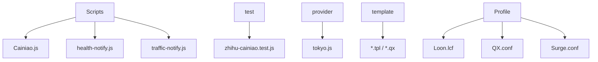
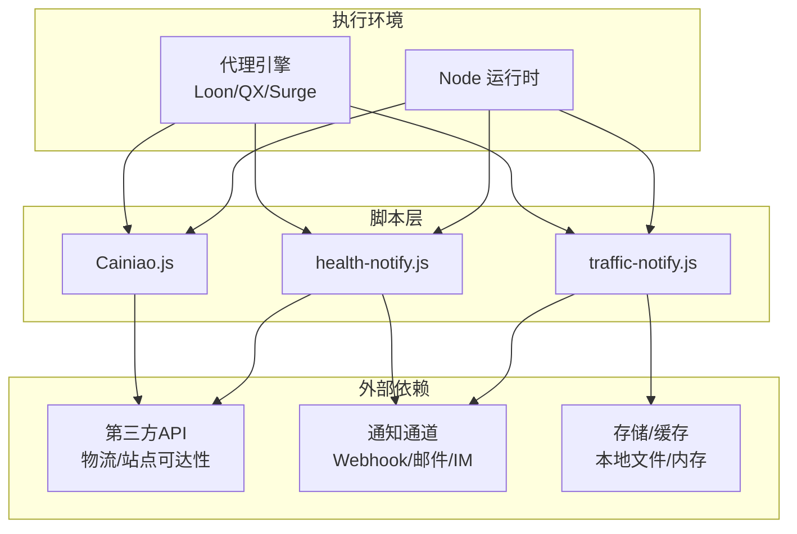
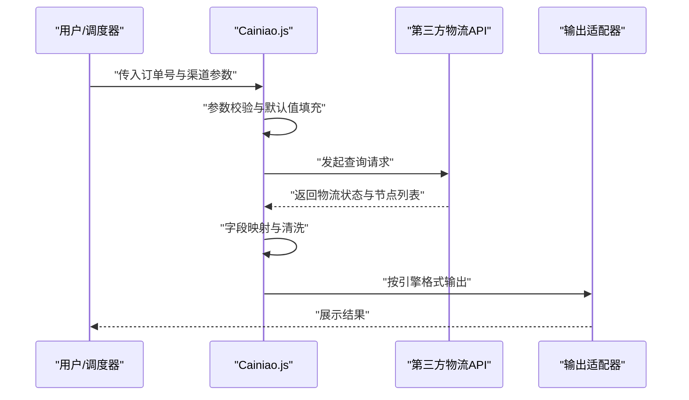
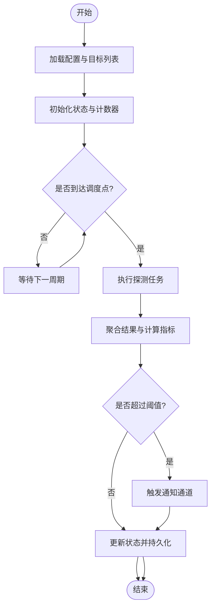
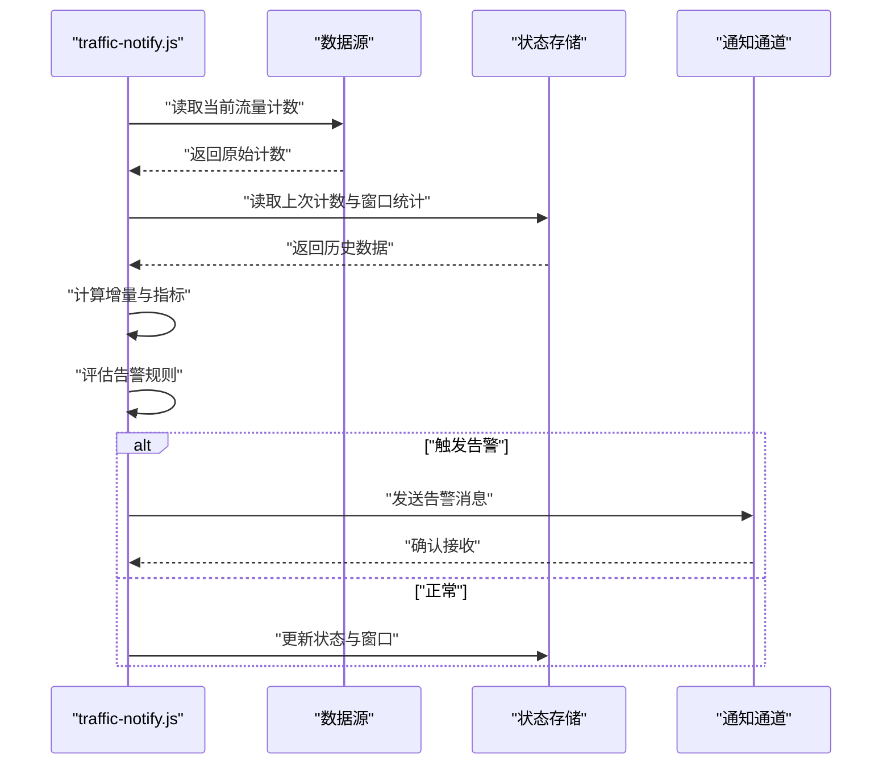
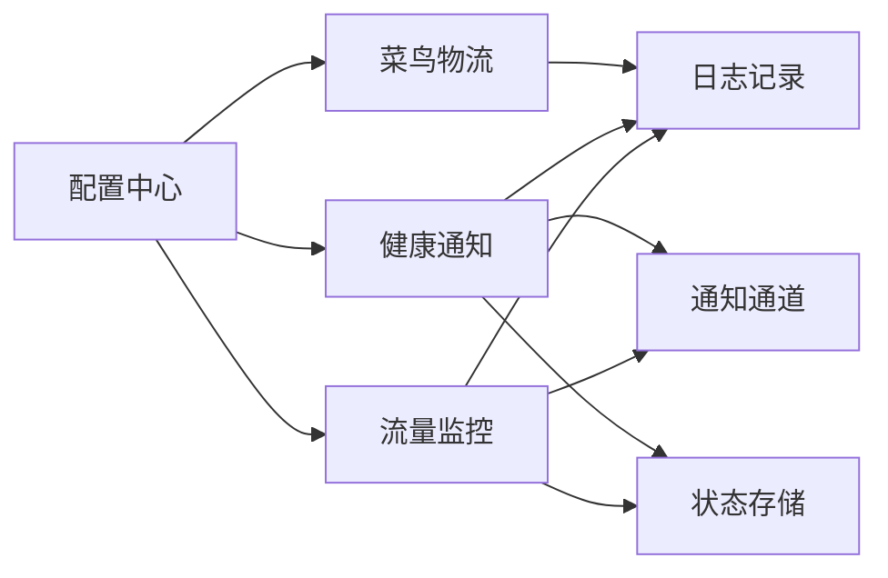
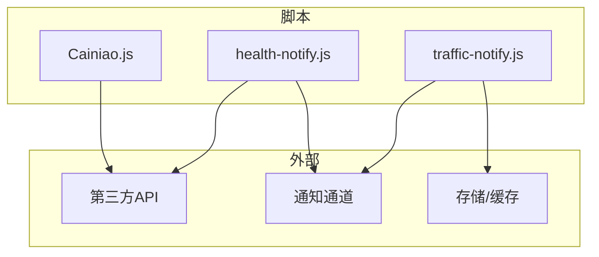

# 实用工具脚本

<cite>
**本文引用的文件**   
- [Scripts/Cainiao.js](file://Scripts/Cainiao.js)
- [Scripts/health-notify.js](file://Scripts/health-notify.js)
- [Scripts/traffic-notify.js](file://Scripts/traffic-notify.js)
- [README.md](file://README.md)
- [package.json](file://package.json)
- [surgio.conf.js](file://surgio.conf.js)
- [test/cases/zhihu-cainiao.test.js](file://test/cases/zhihu-cainiao.test.js)
</cite>

## 目录
1. [简介](#简介)
2. [项目结构](#项目结构)
3. [核心组件](#核心组件)
4. [架构总览](#架构总览)
5. [详细组件分析](#详细组件分析)
6. [依赖分析](#依赖分析)
7. [性能考虑](#性能考虑)
8. [故障排查指南](#故障排查指南)
9. [结论](#结论)
10. [附录](#附录)

## 简介
本仓库提供一组面向网络与系统运维的实用工具脚本，重点覆盖：
- 菜鸟物流查询：通过第三方接口获取物流状态，适配不同客户端环境（如 Loon、Quantumult X、Surge）。
- 健康通知：对上游服务或站点进行可达性检测，并在异常时触发通知。
- 流量监控：采集并上报设备/代理的流量统计，支持阈值告警与周期性同步。

这些脚本以轻量 JavaScript 实现，强调可配置、可测试、可观测，便于在多种代理引擎中复用与扩展。

## 项目结构
仓库采用“按功能域组织”的结构：
- Scripts：核心脚本集合，包含菜鸟物流、健康通知、流量监控等。
- test：单元测试与用例，保障脚本行为稳定。
- provider：外部数据源或规则提供者示例。
- template：模板与片段，用于生成配置文件。
- Profile：各代理引擎的配置文件样例。
- .github/workflows：CI/CD 流水线，涵盖校验、构建、部署与测试。

图表来源
- [Scripts/Cainiao.js](file://Scripts/Cainiao.js)
- [Scripts/health-notify.js](file://Scripts/health-notify.js)
- [Scripts/traffic-notify.js](file://Scripts/traffic-notify.js)
- [test/cases/zhihu-cainiao.test.js](file://test/cases/zhihu-cainiao.test.js)
- [provider/tokyo.js](file://provider/tokyo.js)
- [Profile/Loon.lcf](file://Profile/Loon.lcf)
- [Profile/QX.conf](file://Profile/QX.conf)
- [Profile/Surge.conf](file://Profile/Surge.conf)

章节来源
- [README.md](file://README.md)
- [package.json](file://package.json)
- [surgio.conf.js](file://surgio.conf.js)

## 核心组件
- 菜鸟物流查询（Cainiao.js）
  - 负责构造请求、解析响应、格式化输出，适配多引擎上下文。
  - 支持参数化配置（如订单号、渠道、回调格式），并提供错误处理与重试策略。
- 健康通知（health-notify.js）
  - 定时探测目标地址可用性，聚合结果并通过通知通道推送。
  - 内置退避与熔断逻辑，避免雪崩；支持白名单/黑名单与阈值控制。
- 流量监控（traffic-notify.js）
  - 读取本地或代理引擎暴露的流量指标，计算增量与累计值。
  - 支持阈值告警、周期上报、去抖与合并上报，降低噪声与负载。

章节来源
- [Scripts/Cainiao.js](file://Scripts/Cainiao.js)
- [Scripts/health-notify.js](file://Scripts/health-notify.js)
- [Scripts/traffic-notify.js](file://Scripts/traffic-notify.js)

## 架构总览
整体采用“脚本即服务”的轻量架构：每个脚本独立运行于代理引擎或 Node 环境中，通过统一配置与日志规范协作。

图表来源
- [Scripts/Cainiao.js](file://Scripts/Cainiao.js)
- [Scripts/health-notify.js](file://Scripts/health-notify.js)
- [Scripts/traffic-notify.js](file://Scripts/traffic-notify.js)

## 详细组件分析

### 菜鸟物流查询（Cainiao.js）
- 功能要点
  - 参数解析：订单号、快递公司、查询渠道、返回格式等。
  - 请求构造：根据引擎上下文选择合适 HTTP 库与头部策略。
  - 响应解析：兼容多版本 API 字段映射，提取关键状态与节点时间线。
  - 错误处理：网络异常、鉴权失败、限流与降级策略。
  - 输出适配：为不同引擎生成结构化结果（文本/JSON/富文本）。
- 数据流
  - 输入参数 → 请求封装 → 发送请求 → 解析响应 → 格式化输出
- 集成方式
  - 作为路由脚本被代理引擎调用，或在 Node 环境下由任务调度器触发。
- 配置项建议
  - 超时、重试次数、回退接口、缓存键、调试开关。
- 测试与验证
  - 使用测试用例模拟不同响应场景，确保解析健壮性。

图表来源
- [Scripts/Cainiao.js](file://Scripts/Cainiao.js)
- [test/cases/zhihu-cainiao.test.js](file://test/cases/zhihu-cainiao.test.js)

章节来源
- [Scripts/Cainiao.js](file://Scripts/Cainiao.js)
- [test/cases/zhihu-cainiao.test.js](file://test/cases/zhihu-cainiao.test.js)

### 健康通知（health-notify.js）
- 功能要点
  - 探测策略：HTTP HEAD/GET、TCP 连通性、DNS 解析检查。
  - 聚合与判定：按组统计成功率、延迟分位、连续失败次数。
  - 通知推送：达到阈值后触发 Webhook/邮件/IM 等通道。
  - 状态管理：维护最近探测结果、失败计数、冷却期。
  - 容错机制：指数退避、熔断、快速失败与恢复检测。
- 调度与同步
  - 支持 cron 表达式或固定间隔；批量探测时采用并发上限与队列。
  - 结果持久化到本地文件或内存缓存，供其他脚本读取。
- 配置项建议
  - 目标列表、分组策略、探测方法、超时、重试、阈值、通知通道、冷却时间。

图表来源
- [Scripts/health-notify.js](file://Scripts/health-notify.js)

章节来源
- [Scripts/health-notify.js](file://Scripts/health-notify.js)

### 流量监控（traffic-notify.js）
- 功能要点
  - 数据采集：从代理引擎或系统接口读取上行/下行字节数。
  - 指标计算：增量速率、累计总量、峰值与均值。
  - 告警规则：基于阈值、环比变化、趋势预测触发告警。
  - 上报策略：去抖、合并、批量上报，降低通道压力。
  - 状态管理：记录上次采样值、窗口统计、告警历史。
- 调度与同步
  - 固定间隔采样，支持动态调整采样频率。
  - 将指标写入本地缓存或上报至远端服务。
- 配置项建议
  - 数据源路径/接口、采样间隔、窗口大小、阈值、上报地址、认证信息。

图表来源
- [Scripts/traffic-notify.js](file://Scripts/traffic-notify.js)

章节来源
- [Scripts/traffic-notify.js](file://Scripts/traffic-notify.js)

### 概念总览
以下流程图展示了三个工具之间的协作关系与通用模式：
- 统一的配置加载与日志记录。
- 共享的状态管理与错误处理。
- 可扩展的通知与上报通道。

[此图为概念示意，不直接映射具体源码文件]

## 依赖分析
- 内部依赖
  - 脚本之间通过共享配置与状态文件解耦，避免强耦合。
  - 测试用例保证关键路径回归稳定。
- 外部依赖
  - 第三方 API（物流查询、站点可达性）。
  - 通知通道（Webhook、邮件、即时通讯）。
  - 存储介质（本地文件、内存缓存）。
- 潜在风险
  - 第三方限流与不稳定需引入重试与熔断。
  - 通知通道拥塞需具备降级与缓冲能力。

图表来源
- [Scripts/Cainiao.js](file://Scripts/Cainiao.js)
- [Scripts/health-notify.js](file://Scripts/health-notify.js)
- [Scripts/traffic-notify.js](file://Scripts/traffic-notify.js)

章节来源
- [package.json](file://package.json)
- [surgio.conf.js](file://surgio.conf.js)

## 性能考虑
- 并发与限流
  - 合理设置并发上限，避免压垮下游服务。
  - 对高频接口实施令牌桶或滑动窗口限流。
- 缓存与去抖
  - 对相同查询结果短期缓存，减少重复请求。
  - 对告警消息去抖与合并，降低通道压力。
- 资源占用
  - 控制内存占用与文件句柄数量，及时释放临时对象。
  - 使用流式处理大响应体，避免一次性加载。
- 可观测性
  - 记录关键指标（耗时、成功率、错误码分布）。
  - 定期导出统计摘要，便于容量规划与优化。

## 故障排查指南
- 常见问题定位
  - 网络异常：检查超时、重试、DNS 解析与证书有效性。
  - 鉴权失败：核对密钥、签名与有效期。
  - 限流与熔断：观察 429/5xx 比例，调整退避策略。
  - 通知失败：验证通道配置、配额与回执状态。
- 诊断手段
  - 开启调试日志，捕获请求/响应与中间状态。
  - 使用测试用例复现问题，逐步缩小范围。
  - 查看状态文件与缓存，确认数据一致性。
- 恢复策略
  - 自动重试与降级，必要时切换备用通道。
  - 人工介入时提供一键回滚与快照恢复。

章节来源
- [Scripts/health-notify.js](file://Scripts/health-notify.js)
- [Scripts/traffic-notify.js](file://Scripts/traffic-notify.js)

## 结论
本仓库的实用工具脚本以简洁、可配置、可观测为核心设计原则，覆盖物流查询、健康检测与流量监控三大场景。通过统一的配置、日志与状态管理机制，配合完善的测试与 CI/CD，能够在多引擎环境中稳定运行。建议在接入新服务时遵循相同的模式：明确输入输出、完善错误处理、强化可观测性与可测试性。

## 附录
- 配置参数说明（建议）
  - 通用
    - 超时：毫秒级超时阈值
    - 重试：最大重试次数与退避策略
    - 日志级别：debug/info/warn/error
    - 调试开关：启用详细日志与抓包
  - 菜鸟物流
    - 订单号、快递公司、查询渠道、返回格式
    - 缓存键、回退接口、鉴权信息
  - 健康通知
    - 目标列表、分组策略、探测方法
    - 阈值、冷却时间、通知通道配置
  - 流量监控
    - 数据源路径/接口、采样间隔、窗口大小
    - 阈值、上报地址、认证信息
- 定时任务调度
  - 使用 cron 表达式或固定间隔
  - 支持任务优先级与依赖顺序
- 状态管理
  - 最近探测结果、失败计数、冷却期
  - 上次采样值、窗口统计、告警历史
- 最佳实践
  - 幂等设计与重试安全
  - 敏感信息加密与最小权限
  - 全链路追踪与指标埋点