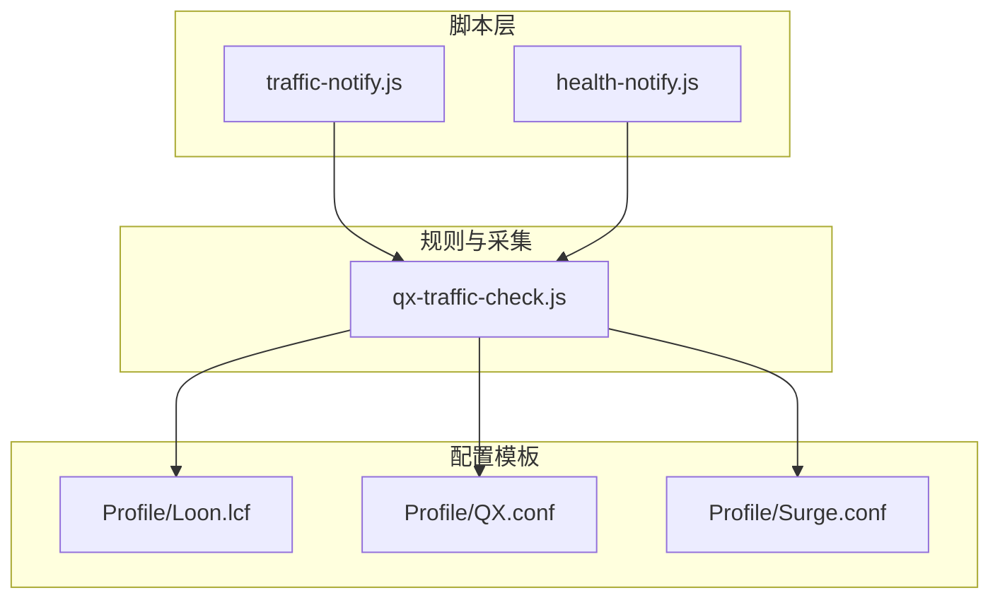
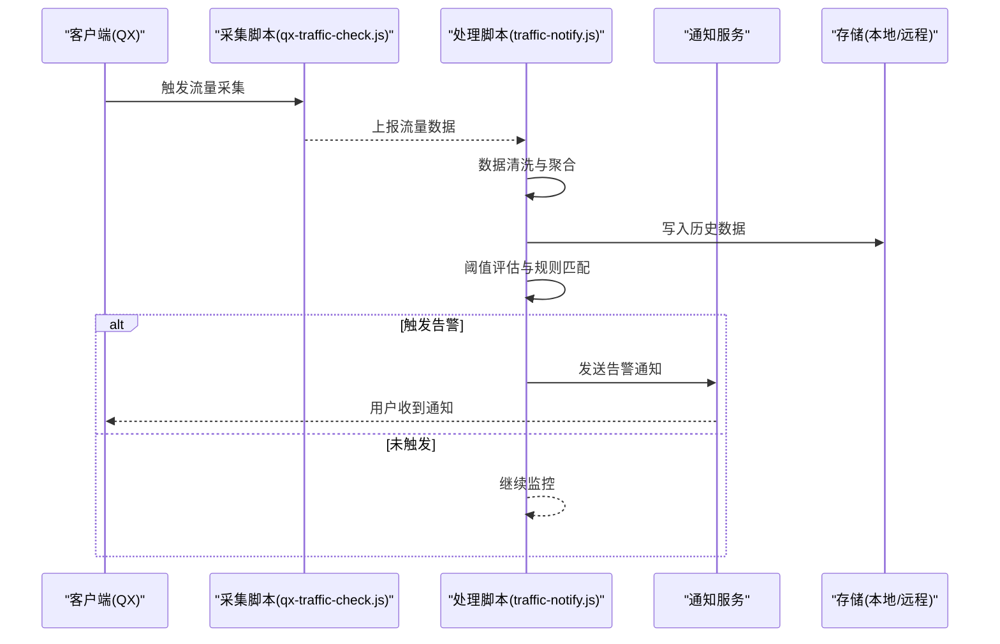
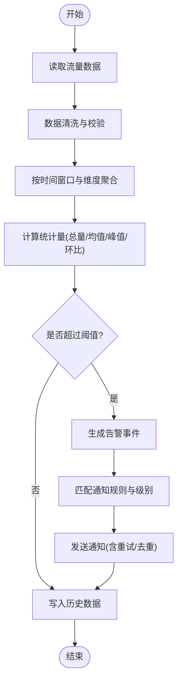
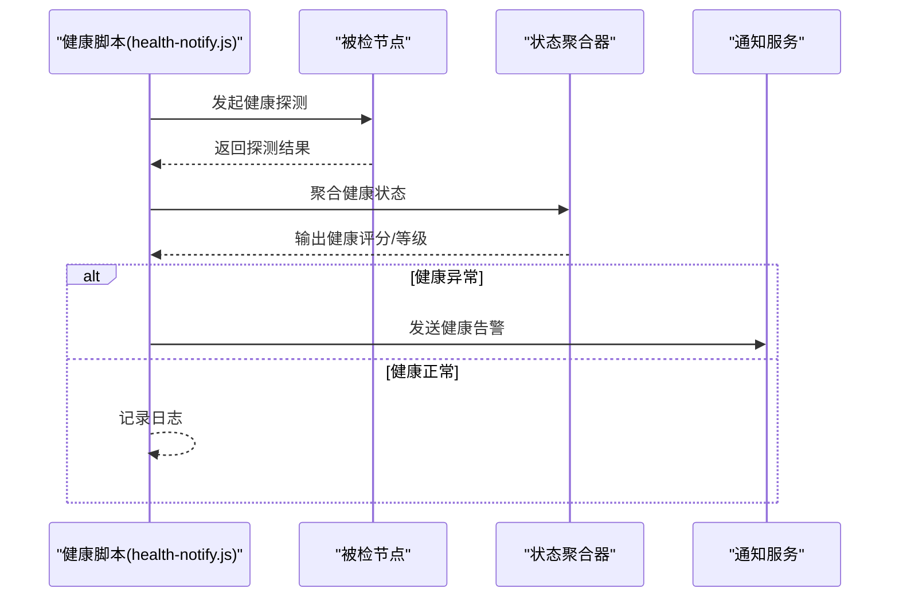
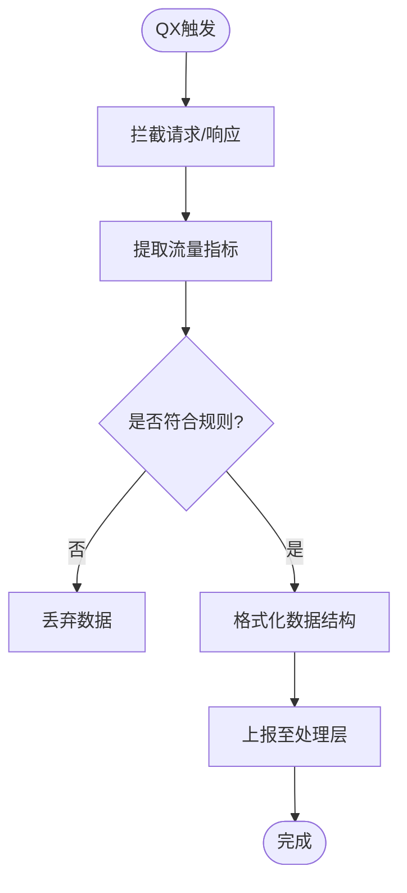
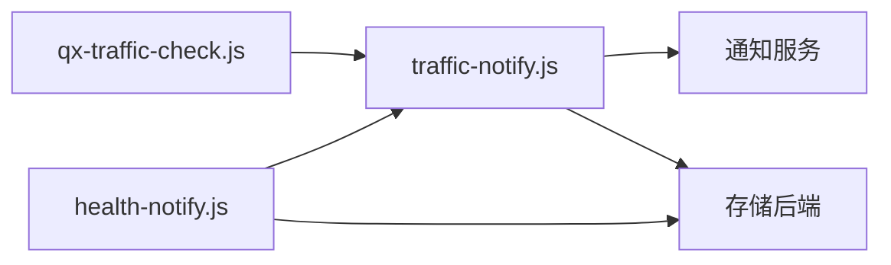

# 流量监控通知

<cite>
**本文引用的文件**   
- [traffic-notify.js](file://Scripts/traffic-notify.js)
- [health-notify.js](file://Scripts/health-notify.js)
- [qx-traffic-check.js](file://Mirror/rules/qx-traffic-check.js)
- [README.md](file://README.md)
- [package.json](file://package.json)
</cite>

## 目录
1. [简介](#简介)
2. [项目结构](#项目结构)
3. [核心组件](#核心组件)
4. [架构总览](#架构总览)
5. [详细组件分析](#详细组件分析)
6. [依赖关系分析](#依赖关系分析)
7. [性能考虑](#性能考虑)
8. [故障排查指南](#故障排查指南)
9. [结论](#结论)
10. [附录](#附录)

## 简介
本技术文档围绕“流量监控通知系统”的实现与使用展开，重点覆盖网络流量数据采集、统计分析、阈值监控与告警通知。结合仓库中的脚本与规则，说明流量计量算法、数据聚合策略、历史数据存储机制，以及监控规则配置、告警级别定义和通知推送逻辑。同时给出流量趋势分析、报表生成与可视化展示方案，记录与系统监控工具的集成方式、数据导出格式与性能优化技巧，并提供常见问题排查方法与最佳实践建议。

## 项目结构
该仓库采用按功能域组织的方式：
- Scripts：包含流量与健康相关的通知脚本，是系统的核心实现入口。
- Mirror/rules：包含 Quantumult X 的流量检测脚本与规则，用于在客户端侧采集与上报流量。
- Profile：各代理工具（Loon、Quantumult X、Surge）的配置模板，用于接入流量监控能力。
- Template：不同引擎的模板与片段，便于快速生成配置文件。
- Provider 与 Kelee/Mirror：插件与镜像资源，非本次主题核心。
- doc/test：文档与测试用例，辅助验证与迁移。

图表来源
- [traffic-notify.js](file://Scripts/traffic-notify.js)
- [health-notify.js](file://Scripts/health-notify.js)
- [qx-traffic-check.js](file://Mirror/rules/qx-traffic-check.js)
- [QX.conf](file://Profile/QX.conf)
- [Loon.lcf](file://Profile/Loon.lcf)
- [Surge.conf](file://Profile/Surge.conf)

章节来源
- [README.md](file://README.md)
- [package.json](file://package.json)

## 核心组件
- 流量通知脚本（traffic-notify.js）：负责周期性或事件触发式地采集流量指标、计算统计量、评估阈值并触发通知。
- 健康通知脚本（health-notify.js）：与流量脚本协同，提供节点健康状态检查与联动告警。
- 流量检测脚本（qx-traffic-check.js）：面向 Quantumult X 的流量采集与上报逻辑，作为数据采集端点。

章节来源
- [traffic-notify.js](file://Scripts/traffic-notify.js)
- [health-notify.js](file://Scripts/health-notify.js)
- [qx-traffic-check.js](file://Mirror/rules/qx-traffic-check.js)

## 架构总览
整体架构分为三层：
- 采集层：通过 Quantumult X 等客户端脚本采集流量数据，并按周期或事件上报。
- 处理层：接收上报数据，进行去重、聚合、统计与阈值判断，生成告警事件。
- 通知层：根据告警级别与规则，调用通知渠道（如 Webhook、邮件、IM 等）推送消息。

图表来源
- [qx-traffic-check.js](file://Mirror/rules/qx-traffic-check.js)
- [traffic-notify.js](file://Scripts/traffic-notify.js)

## 详细组件分析

### 流量通知脚本（traffic-notify.js）
职责与流程：
- 数据采集：从上游采集器获取流量指标（上行/下行、连接数、时延等）。
- 统计分析：计算单位时间内的总量、均值、峰值、环比/同比变化。
- 阈值监控：基于配置的阈值与规则进行判定，支持多级告警。
- 通知推送：将告警事件发送至通知渠道，支持重试与去重。
- 历史存储：将统计数据持久化，便于趋势分析与报表生成。

关键实现要点：
- 数据模型：统一封装流量指标字段，确保跨来源一致性。
- 聚合策略：支持按时间窗口（分钟/小时/天）与维度（域名/IP/应用）聚合。
- 阈值算法：支持静态阈值、动态基线（移动平均/分位数）与复合条件。
- 通知策略：支持多通道、分级路由、冷却时间与抑制规则。

图表来源
- [traffic-notify.js](file://Scripts/traffic-notify.js)

章节来源
- [traffic-notify.js](file://Scripts/traffic-notify.js)

### 健康通知脚本（health-notify.js）
职责与流程：
- 节点健康探测：对关键节点执行连通性与时延检测。
- 状态聚合：汇总多节点健康状态，识别异常模式。
- 联动告警：与流量告警联动，避免重复通知与误报。
- 通知推送：根据健康等级与规则推送告警。

图表来源
- [health-notify.js](file://Scripts/health-notify.js)

章节来源
- [health-notify.js](file://Scripts/health-notify.js)

### 流量检测脚本（qx-traffic-check.js）
职责与流程：
- 在 Quantumult X 中拦截流量事件，提取关键指标。
- 按规则过滤与分类，减少无关数据上报。
- 将结构化数据上报至处理层，支持批量与增量上报。

图表来源
- [qx-traffic-check.js](file://Mirror/rules/qx-traffic-check.js)

章节来源
- [qx-traffic-check.js](file://Mirror/rules/qx-traffic-check.js)

### 配置与模板（Profile/Template）
- Loon/Quantumult X/Surge 配置模板：用于启用流量采集与通知能力。
- 片段模板：提供常用规则与脚本片段，便于快速装配。

章节来源
- [Loon.lcf](file://Profile/Loon.lcf)
- [QX.conf](file://Profile/QX.conf)
- [Surge.conf](file://Profile/Surge.conf)

## 依赖关系分析
- 脚本间依赖：traffic-notify.js 依赖 qx-traffic-check.js 提供的数据；health-notify.js 与 traffic-notify.js 共享通知与存储接口。
- 外部依赖：通知渠道（Webhook/邮件/IM）、存储后端（本地文件或远程数据库）。
- 运行时依赖：Node.js 环境（若脚本以 Node 运行），或代理引擎内置 JS 运行时。

图表来源
- [qx-traffic-check.js](file://Mirror/rules/qx-traffic-check.js)
- [traffic-notify.js](file://Scripts/traffic-notify.js)
- [health-notify.js](file://Scripts/health-notify.js)

章节来源
- [package.json](file://package.json)

## 性能考虑
- 采集侧节流：在客户端脚本中对高频事件进行采样与合并，降低上报频率。
- 批处理与异步：处理层采用批量写入与异步通知，提升吞吐与降低阻塞。
- 内存管理：限制历史数据窗口大小，定期清理过期数据，避免内存膨胀。
- 缓存与去重：对重复告警进行去重与冷却，减少通知风暴。
- 并行计算：对多维度聚合采用并行计算，缩短统计延迟。

[本节为通用指导，不直接分析具体文件]

## 故障排查指南
常见问题与定位方法：
- 无数据上报：检查客户端脚本是否启用、规则是否匹配、网络可达性与权限。
- 告警缺失：核对阈值配置、时间窗口、维度过滤与通知路由。
- 通知失败：确认通知渠道凭证、回调地址、重试策略与限流。
- 性能问题：观察 CPU/内存占用、队列堆积与 I/O 瓶颈，调整批大小与并发度。
- 数据不一致：校验数据清洗与聚合逻辑，对比原始指标与聚合结果。

章节来源
- [traffic-notify.js](file://Scripts/traffic-notify.js)
- [health-notify.js](file://Scripts/health-notify.js)
- [qx-traffic-check.js](file://Mirror/rules/qx-traffic-check.js)

## 结论
本系统通过客户端采集、集中处理与多渠道通知，实现了端到端的流量监控与告警闭环。借助灵活的阈值规则与聚合策略，可满足不同场景下的监控需求。配合可视化与报表能力，可为运维与业务决策提供可靠依据。建议在部署时关注性能与稳定性，遵循最佳实践以降低误报与漏报风险。

[本节为总结性内容，不直接分析具体文件]

## 附录
- 监控规则配置建议：
  - 基础阈值：按带宽、连接数与时延设置静态阈值。
  - 动态基线：引入移动平均与分位数，适应流量波动。
  - 复合条件：组合多个指标与时间窗口，提高准确性。
- 告警级别定义：
  - 提示：轻微异常，无需立即干预。
  - 警告：中度异常，需关注与准备处置。
  - 严重：高度异常，需立即介入与恢复。
- 通知推送逻辑：
  - 多通道冗余：至少两个独立渠道。
  - 冷却与抑制：同一事件冷却期内不重复通知。
  - 路由与分级：按级别与维度选择合适渠道。
- 历史数据存储机制：
  - 本地文件：CSV/JSON 格式，便于离线分析。
  - 远程存储：时序数据库或对象存储，支持查询与归档。
- 流量趋势分析与报表：
  - 趋势图：日/周/月维度曲线与柱状图。
  - 报表：Top N 域名/IP、异常时段分布、告警统计。
  - 可视化：仪表盘与看板，支持钻取与筛选。
- 与系统监控工具集成：
  - 指标导出：Prometheus/OpenMetrics 格式。
  - 事件对接：SIEM/工单系统 API。
  - 日志采集：结构化日志与链路追踪。
- 数据导出格式：
  - CSV/JSON：适合报表与分析。
  - Parquet/ORC：适合大数据处理。
- 性能优化技巧：
  - 采样与降采样：在高并发场景下平衡精度与开销。
  - 索引与分区：按时间/维度分区，加速查询。
  - 压缩与归档：冷热数据分层存储。

[本节为概念性内容，不直接分析具体文件]