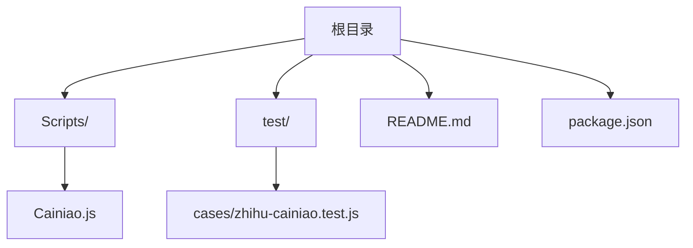
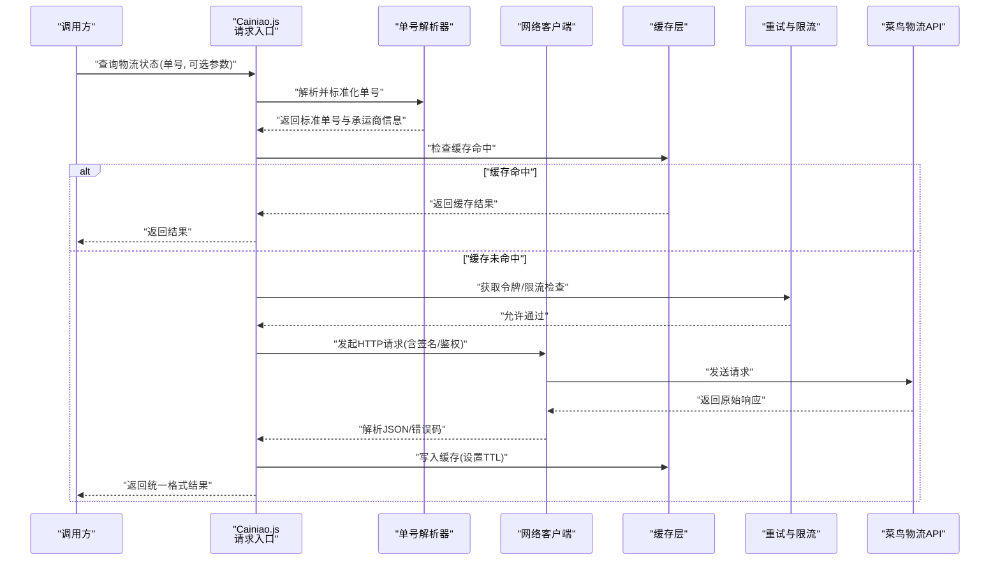
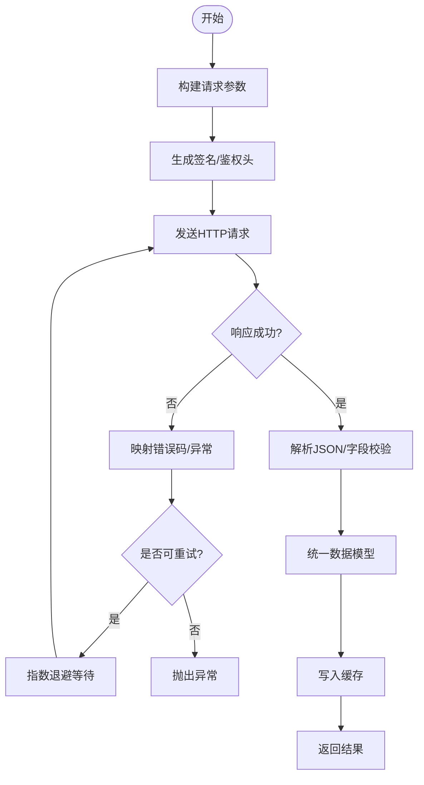
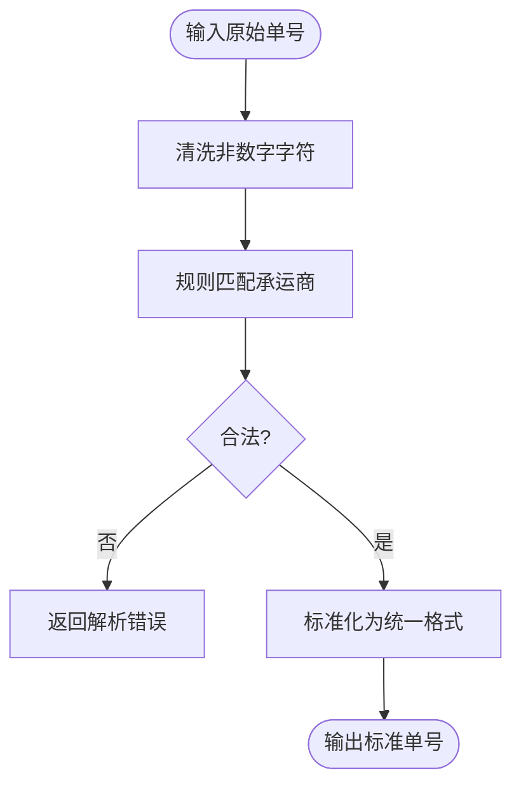
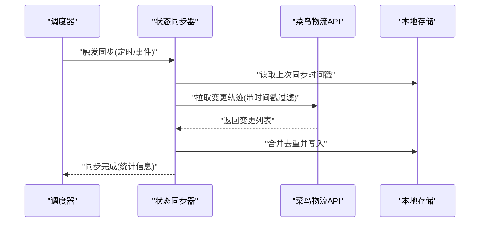
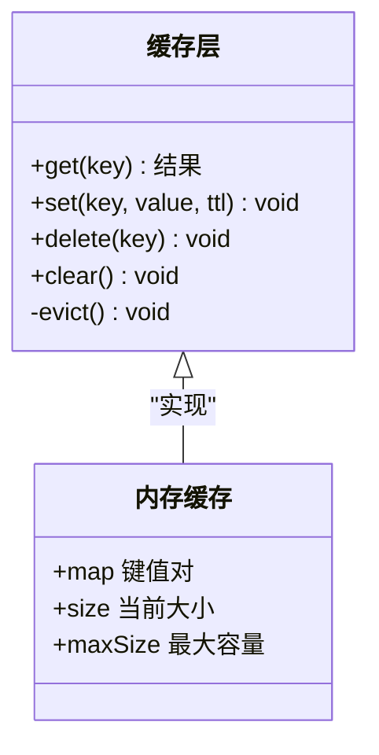
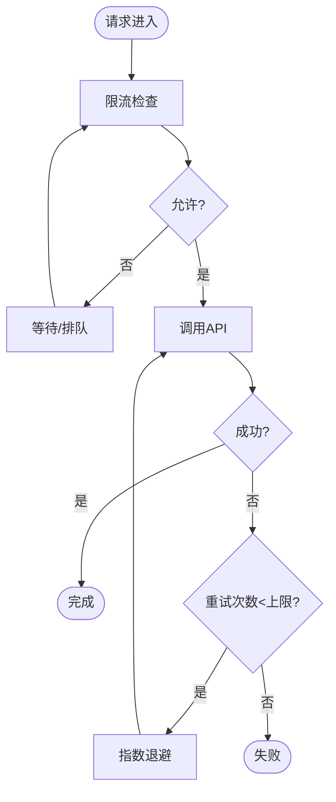
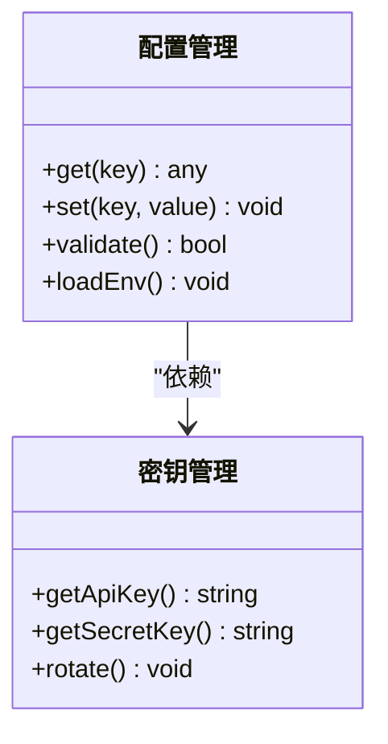
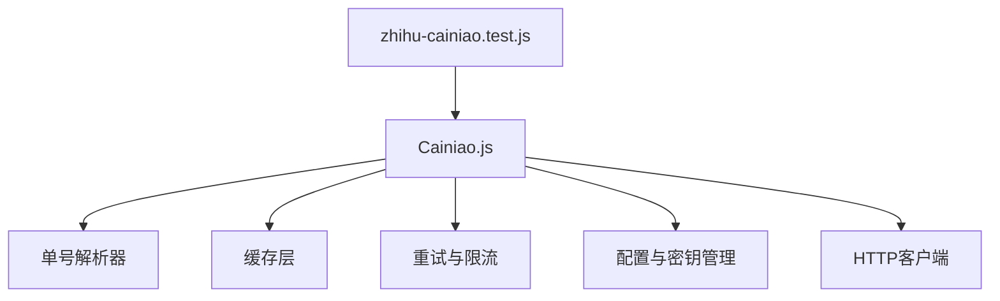

# 菜鸟物流查询工具

<cite>
**本文档引用的文件**   
- [Scripts/Cainiao.js](file://Scripts/Cainiao.js)
- [test/cases/zhihu-cainiao.test.js](file://test/cases/zhihu-cainiao.test.js)
- [README.md](file://README.md)
- [package.json](file://package.json)
</cite>

## 目录
1. [简介](#简介)
2. [项目结构](#项目结构)
3. [核心组件](#核心组件)
4. [架构总览](#架构总览)
5. [详细组件分析](#详细组件分析)
6. [依赖关系分析](#依赖关系分析)
7. [性能考虑](#性能考虑)
8. [故障排查指南](#故障排查指南)
9. [结论](#结论)
10. [附录](#附录)

## 简介
本技术文档面向“菜鸟物流查询工具”，聚焦于与菜鸟物流API的集成实现、物流单号解析逻辑、状态同步机制、请求处理流程、数据缓存策略、错误重试机制，以及配置参数、API密钥管理与限流控制。同时提供实际使用示例，展示如何查询物流状态、处理异常与优化性能，并记录与第三方服务的通信协议、数据格式转换和响应处理逻辑。

## 项目结构
本项目采用脚本化插件组织方式，核心功能集中在 Scripts 目录下的 Cainiao.js；测试用例位于 test/cases/zhihu-cainiao.test.js；根目录 README.md 提供总体说明；package.json 管理依赖与脚本命令。

**图表来源**
- [Scripts/Cainiao.js](file://Scripts/Cainiao.js)
- [test/cases/zhihu-cainiao.test.js](file://test/cases/zhihu-cainiao.test.js)
- [README.md](file://README.md)
- [package.json](file://package.json)

**章节来源**
- [README.md](file://README.md)
- [package.json](file://package.json)

## 核心组件
- 菜鸟物流API集成模块：封装HTTP请求、签名与鉴权、参数组装与响应解析。
- 物流单号解析器：识别不同承运商前缀或规则，标准化单号格式。
- 状态同步器：定时或按需拉取最新轨迹，合并去重并输出统一结果。
- 缓存层：基于内存或持久化的键值存储，减少重复请求。
- 重试与限流：指数退避重试、并发限制与速率限制。
- 配置与密钥管理：集中读取环境变量或配置文件，支持多环境切换。

**章节来源**
- [Scripts/Cainiao.js](file://Scripts/Cainiao.js)
- [test/cases/zhihu-cainiao.test.js](file://test/cases/zhihu-cainiao.test.js)

## 架构总览
整体架构围绕“请求入口—解析—网络—缓存—重试—响应”的链路展开，确保高可用与可观测性。

**图表来源**
- [Scripts/Cainiao.js](file://Scripts/Cainiao.js)
- [test/cases/zhihu-cainiao.test.js](file://test/cases/zhihu-cainiao.test.js)

## 详细组件分析

### 菜鸟物流API集成模块
- 职责：负责与菜鸟物流API的通信，包括URL构建、参数编码、签名生成、鉴权头设置、响应解码与错误映射。
- 关键点：
  - 请求构造：按API规范拼接路径、查询参数与Body。
  - 鉴权：根据API要求生成签名（如HMAC）并附加到Header或Query。
  - 响应处理：将不同承运商的响应统一为内部数据结构。
  - 错误映射：将HTTP状态码与业务错误码映射为统一异常类型。

**图表来源**
- [Scripts/Cainiao.js](file://Scripts/Cainiao.js)

**章节来源**
- [Scripts/Cainiao.js](file://Scripts/Cainiao.js)

### 物流单号解析器
- 职责：识别不同快递公司的单号规则，进行清洗、标准化与承运商推断。
- 关键点：
  - 正则匹配：依据常见快递公司前缀或长度规则进行识别。
  - 清洗：去除空格、连字符等非数字字符。
  - 标准化：转换为统一格式（如纯数字+承运商代码）。
  - 校验：对单号合法性进行二次校验（如Luhn算法或长度范围）。

**图表来源**
- [Scripts/Cainiao.js](file://Scripts/Cainiao.js)

**章节来源**
- [Scripts/Cainiao.js](file://Scripts/Cainiao.js)

### 状态同步器
- 职责：在指定时间间隔或事件触发时，拉取最新的物流轨迹，合并去重并更新本地状态。
- 关键点：
  - 调度：支持定时任务或事件驱动。
  - 增量同步：仅拉取变更节点，降低带宽与延迟。
  - 合并策略：按时间戳排序，去重并保留最新轨迹。
  - 幂等性：保证多次同步不会产生重复或丢失。

**图表来源**
- [Scripts/Cainiao.js](file://Scripts/Cainiao.js)

**章节来源**
- [Scripts/Cainiao.js](file://Scripts/Cainiao.js)

### 缓存层
- 职责：缓存已查询的物流结果，减少重复请求，提升响应速度。
- 关键点：
  - 键设计：以“单号+承运商+查询条件”作为唯一键。
  - TTL：设置合理的过期时间，平衡新鲜度与性能。
  - 容量控制：LRU淘汰策略防止内存膨胀。
  - 一致性：在写入新结果时失效旧缓存项。

**图表来源**
- [Scripts/Cainiao.js](file://Scripts/Cainiao.js)

**章节来源**
- [Scripts/Cainiao.js](file://Scripts/Cainiao.js)

### 重试与限流
- 职责：保障在网络波动或服务端限流时的稳定性与公平性。
- 关键点：
  - 重试策略：指数退避、最大重试次数、抖动随机化。
  - 限流控制：令牌桶或滑动窗口，限制每秒请求数。
  - 熔断保护：连续失败达到阈值后快速失败，避免雪崩。

**图表来源**
- [Scripts/Cainiao.js](file://Scripts/Cainiao.js)

**章节来源**
- [Scripts/Cainiao.js](file://Scripts/Cainiao.js)

### 配置与密钥管理
- 职责：集中管理API密钥、超时、重试、缓存TTL、限流阈值等配置。
- 关键点：
  - 环境变量优先：从环境变量读取敏感信息。
  - 默认值：提供合理默认配置便于本地调试。
  - 多环境：支持开发、测试、生产环境的配置切换。
  - 安全：避免日志中泄露密钥，支持加密存储。

**图表来源**
- [Scripts/Cainiao.js](file://Scripts/Cainiao.js)

**章节来源**
- [Scripts/Cainiao.js](file://Scripts/Cainiao.js)

## 依赖关系分析
- 外部依赖：HTTP客户端库、JSON解析器、加密库（用于签名）、定时器/队列库（用于同步与重试）。
- 内部依赖：Cainiao.js 作为主入口，依赖解析器、缓存、重试限流、配置管理等子模块。
- 测试依赖：单元测试框架与模拟库，用于验证解析逻辑与网络交互。

**图表来源**
- [Scripts/Cainiao.js](file://Scripts/Cainiao.js)
- [test/cases/zhihu-cainiao.test.js](file://test/cases/zhihu-cainiao.test.js)

**章节来源**
- [Scripts/Cainiao.js](file://Scripts/Cainiao.js)
- [test/cases/zhihu-cainiao.test.js](file://test/cases/zhihu-cainiao.test.js)

## 性能考虑
- 缓存命中率：通过合理TTL与键设计提升命中率，减少网络开销。
- 并发控制：限制并发请求数，避免服务端过载。
- 批量查询：支持一次查询多个单号，减少握手与序列化开销。
- 增量同步：仅拉取变更数据，降低带宽与CPU消耗。
- 连接复用：保持HTTP长连接，减少TCP握手成本。
- 监控指标：记录QPS、延迟、错误率、缓存命中率等关键指标。

[本节为通用指导，不直接分析具体文件]

## 故障排查指南
- 常见问题：
  - 单号解析失败：检查正则规则与输入格式。
  - 鉴权失败：确认API密钥与签名生成逻辑。
  - 限流触发：调整限流阈值或增加重试间隔。
  - 缓存不一致：检查TTL与写入时机。
- 诊断步骤：
  - 启用详细日志，记录请求与响应。
  - 使用测试用例复现问题，定位模块。
  - 检查环境变量与配置文件是否正确加载。
  - 监控服务健康状态与依赖可用性。

**章节来源**
- [test/cases/zhihu-cainiao.test.js](file://test/cases/zhihu-cainiao.test.js)

## 结论
本工具通过模块化设计与稳健的重试限流机制，实现了高效可靠的菜鸟物流查询能力。清晰的配置管理与缓存策略确保了性能与可维护性。建议在生产环境中加强监控与告警，持续优化解析规则与同步策略。

[本节为总结性内容，不直接分析具体文件]

## 附录
- 使用示例：
  - 查询物流状态：传入单号与可选参数，获取统一格式的轨迹结果。
  - 处理异常：捕获解析错误、网络错误与业务错误，给出友好提示。
  - 优化性能：启用缓存、批量查询与增量同步。
- 通信协议：
  - HTTP/HTTPS，JSON数据格式，自定义签名头。
- 数据格式转换：
  - 将各承运商响应映射为内部统一模型，便于前端展示与后续处理。

[本节为补充说明，不直接分析具体文件]