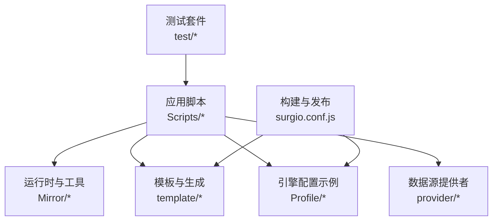
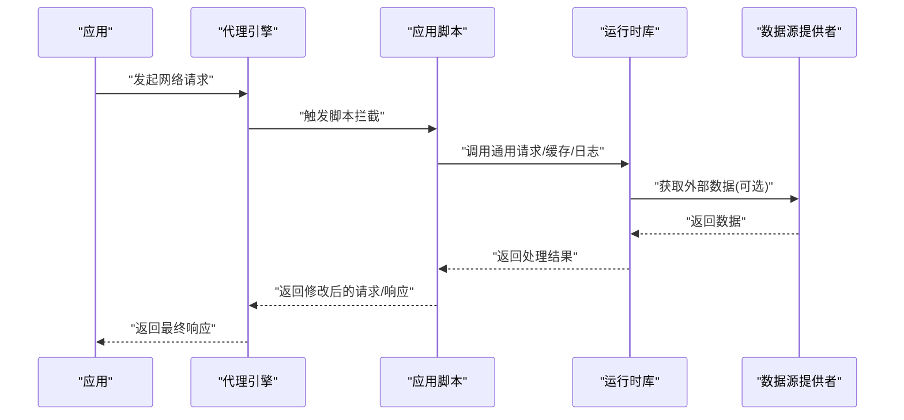
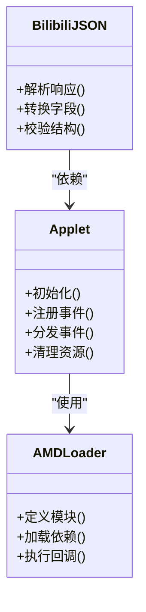
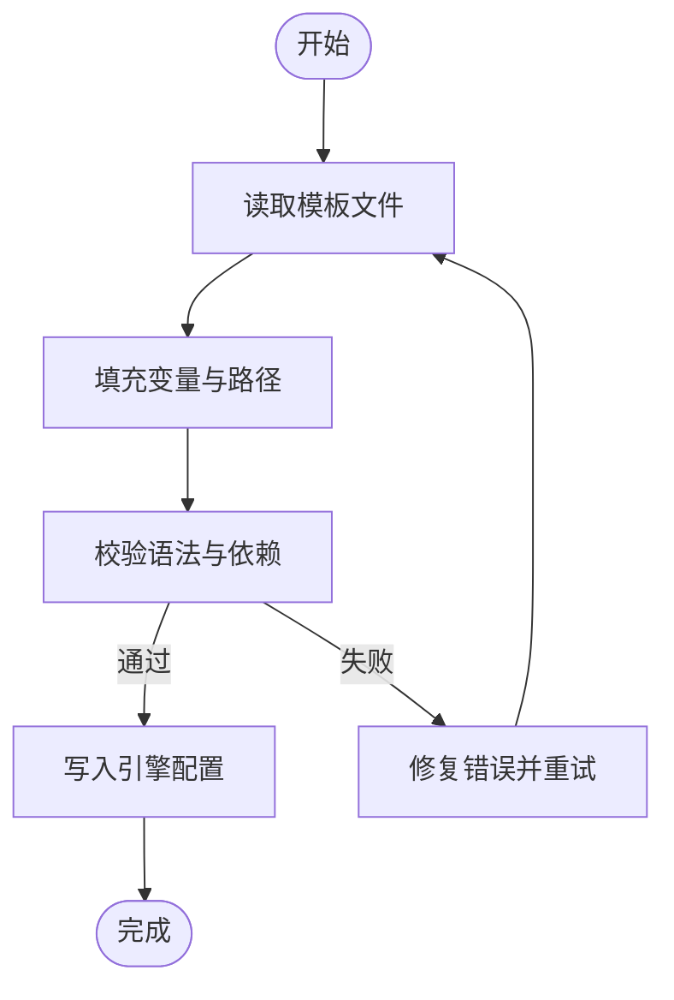
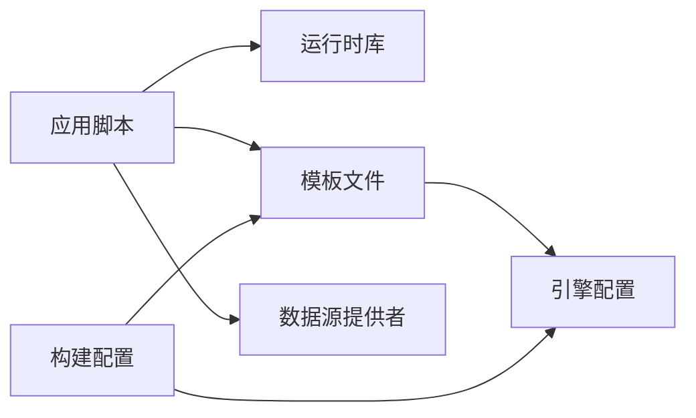

# 应用脚本

<cite>
**本文引用的文件**   
- [README.md](file://README.md)
- [package.json](file://package.json)
- [surgio.conf.js](file://surgio.conf.js)
- [Scripts/ENGINE-MANIFEST.json](file://Scripts/ENGINE-MANIFEST.json)
- [Mirror/MANIFEST.json](file://Mirror/MANIFEST.json)
- [Mirror/applet.js](file://Mirror/applet.js)
- [Mirror/amdc.js](file://Mirror/amdc.js)
- [Mirror/bilibili-json.js](file://Mirror/bilibili-json.js)
- [Scripts/Amap.js](file://Scripts/Amap.js)
- [Scripts/Cainiao.js](file://Scripts/Cainiao.js)
- [Scripts/JD.js](file://Scripts/JD.js)
- [Scripts/Qidian.js](file://Scripts/Qidian.js)
- [Scripts/Reddit.js](file://Scripts/Reddit.js)
- [Scripts/Tieba.js](file://Scripts/Tieba.js)
- [Scripts/Zhihu.js](file://Scripts/Zhihu.js)
- [Scripts/Zhihuifangdong.js](file://Scripts/Zhihuifangdong.js)
- [Scripts/health-notify.js](file://Scripts/health-notify.js)
- [Scripts/traffic-notify.js](file://Scripts/traffic-notify.js)
- [provider/tokyo.js](file://provider/tokyo.js)
- [template/loon.tpl](file://template/loon.tpl)
- [template/quantumultx.tpl](file://template/quantumultx.tpl)
- [template/surge.tpl](file://template/surge.tpl)
- [Profile/Loon.lcf](file://Profile/Loon.lcf)
- [Profile/QX.conf](file://Profile/QX.conf)
- [Profile/Surge.conf](file://Profile/Surge.conf)
- [test/harness.js](file://test/harness.js)
- [test/run-tests.js](file://test/run-tests.js)
</cite>

## 目录
1. [简介](#简介)
2. [项目结构](#项目结构)
3. [核心组件](#核心组件)
4. [架构总览](#架构总览)
5. [详细组件分析](#详细组件分析)
6. [依赖分析](#依赖分析)
7. [性能考虑](#性能考虑)
8. [故障排查指南](#故障排查指南)
9. [结论](#结论)
10. [附录](#附录)

## 简介
本仓库提供面向网络代理与规则引擎（如 Surge、Quantumult X、Loon）的应用脚本模块，覆盖广告拦截、数据净化、通知与健康检查等能力。通过统一的清单与模板机制，将各应用的脚本与配置进行集中管理、生成与分发，并配套测试与持续集成流程，确保脚本质量与可维护性。

## 项目结构
- Scripts：各应用的具体脚本实现，按应用维度组织，便于独立维护与扩展。
- Mirror：通用运行时与工具库，包含清单、资源解析与跨平台适配逻辑。
- Profile：不同代理引擎的配置文件示例，用于演示如何引入脚本与规则。
- template：各引擎的脚本注入模板，支持一键生成或更新配置片段。
- provider：外部数据源提供者，用于动态内容或地理位置相关能力。
- test：单元测试与测试运行器，保障脚本行为正确性。
- surgio.conf.js：Surgio 构建配置，统一编排脚本与规则的发布流程。
- package.json：工程依赖与脚本命令定义。
- README.md：项目说明与使用说明。

图表来源
- [surgio.conf.js:1-200](file://surgio.conf.js#L1-L200)
- [template/loon.tpl:1-200](file://template/loon.tpl#L1-L200)
- [template/quantumultx.tpl:1-200](file://template/quantumultx.tpl#L1-L200)
- [template/surge.tpl:1-200](file://template/surge.tpl#L1-L200)
- [Profile/Loon.lcf:1-200](file://Profile/Loon.lcf#L1-L200)
- [Profile/QX.conf:1-200](file://Profile/QX.conf#L1-L200)
- [Profile/Surge.conf:1-200](file://Profile/Surge.conf#L1-L200)

章节来源
- [README.md:1-200](file://README.md#L1-L200)
- [package.json:1-200](file://package.json#L1-L200)
- [surgio.conf.js:1-200](file://surgio.conf.js#L1-L200)

## 核心组件
- 脚本清单与引擎适配
  - 引擎清单：集中声明支持的脚本、版本与依赖关系，便于构建与校验。
  - 运行时库：提供通用的请求封装、响应处理、缓存与日志能力，降低重复代码。
- 模板与配置生成
  - 模板：为不同代理引擎提供标准化注入片段，减少手工配置错误。
  - 配置示例：展示如何在各引擎中启用脚本与规则。
- 数据源与提供者
  - 外部数据源：按需加载地理位置、IP 信息等，增强脚本能力。
- 测试与质量保障
  - 测试框架：针对关键脚本编写用例，保证接口稳定与行为一致。

章节来源
- [Scripts/ENGINE-MANIFEST.json:1-200](file://Scripts/ENGINE-MANIFEST.json#L1-L200)
- [Mirror/MANIFEST.json:1-200](file://Mirror/MANIFEST.json#L1-L200)
- [Mirror/applet.js:1-200](file://Mirror/applet.js#L1-L200)
- [Mirror/amdc.js:1-200](file://Mirror/amdc.js#L1-L200)
- [template/loon.tpl:1-200](file://template/loon.tpl#L1-L200)
- [template/quantumultx.tpl:1-200](file://template/quantumultx.tpl#L1-L200)
- [template/surge.tpl:1-200](file://template/surge.tpl#L1-L200)
- [Profile/Loon.lcf:1-200](file://Profile/Loon.lcf#L1-L200)
- [Profile/QX.conf:1-200](file://Profile/QX.conf#L1-L200)
- [Profile/Surge.conf:1-200](file://Profile/Surge.conf#L1-L200)

## 架构总览
整体架构围绕“脚本 + 运行时 + 模板 + 配置”展开：
- 应用脚本负责业务逻辑（请求拦截、数据净化、通知等）。
- 运行时库提供通用能力（HTTP 封装、缓存、日志、错误处理）。
- 模板与配置生成将脚本与规则注入到目标引擎。
- 数据源提供者按需扩展能力（如地理位置、IP API）。
- 测试套件保障脚本质量与兼容性。

图表来源
- [Mirror/applet.js:1-200](file://Mirror/applet.js#L1-L200)
- [Mirror/amdc.js:1-200](file://Mirror/amdc.js#L1-L200)
- [provider/tokyo.js:1-200](file://provider/tokyo.js#L1-L200)

## 详细组件分析

### 应用脚本概览
- 地图与出行类
  - 高德地图脚本：优化定位与地图资源加载，屏蔽无关请求。
  - 菜鸟脚本：过滤物流追踪中的冗余数据与广告。
- 电商与内容类
  - 京东脚本：净化商品页与活动页面数据，提升加载速度。
  - 起点读书脚本：去除阅读页广告与推荐干扰。
  - Reddit 脚本：屏蔽社区广告与追踪请求。
  - 贴吧脚本：净化帖子列表与详情页数据。
  - 知乎脚本：去除首页与回答页广告，优化信息流。
  - 知了房东脚本：过滤租房信息中的推广与无效内容。
- 健康与流量通知
  - 健康通知脚本：定期检测服务状态并推送通知。
  - 流量通知脚本：统计流量使用情况并提醒阈值。

章节来源
- [Scripts/Amap.js:1-200](file://Scripts/Amap.js#L1-L200)
- [Scripts/Cainiao.js:1-200](file://Scripts/Cainiao.js#L1-L200)
- [Scripts/JD.js:1-200](file://Scripts/JD.js#L1-L200)
- [Scripts/Qidian.js:1-200](file://Scripts/Qidian.js#L1-L200)
- [Scripts/Reddit.js:1-200](file://Scripts/Reddit.js#L1-L200)
- [Scripts/Tieba.js:1-200](file://Scripts/Tieba.js#L1-L200)
- [Scripts/Zhihu.js:1-200](file://Scripts/Zhihu.js#L1-L200)
- [Scripts/Zhihuifangdong.js:1-200](file://Scripts/Zhihuifangdong.js#L1-L200)
- [Scripts/health-notify.js:1-200](file://Scripts/health-notify.js#L1-L200)
- [Scripts/traffic-notify.js:1-200](file://Scripts/traffic-notify.js#L1-L200)

### 运行时与工具库
- applet.js：提供应用级生命周期管理、事件分发与基础能力封装。
- amdc.js：模块化依赖管理与加载器，简化脚本间依赖。
- bilibili-json.js：B站 JSON 数据处理工具，用于特定格式解析与转换。

图表来源
- [Mirror/applet.js:1-200](file://Mirror/applet.js#L1-L200)
- [Mirror/amdc.js:1-200](file://Mirror/amdc.js#L1-L200)
- [Mirror/bilibili-json.js:1-200](file://Mirror/bilibili-json.js#L1-L200)

章节来源
- [Mirror/applet.js:1-200](file://Mirror/applet.js#L1-L200)
- [Mirror/amdc.js:1-200](file://Mirror/amdc.js#L1-L200)
- [Mirror/bilibili-json.js:1-200](file://Mirror/bilibili-json.js#L1-L200)

### 模板与配置生成
- 模板文件：为 Loon、Quantumult X、Surge 提供标准注入片段，包含脚本路径、匹配规则与参数。
- 配置示例：在 Profile 目录下展示如何启用脚本与规则，便于快速上手。

图表来源
- [template/loon.tpl:1-200](file://template/loon.tpl#L1-L200)
- [template/quantumultx.tpl:1-200](file://template/quantumultx.tpl#L1-L200)
- [template/surge.tpl:1-200](file://template/surge.tpl#L1-L200)
- [Profile/Loon.lcf:1-200](file://Profile/Loon.lcf#L1-L200)
- [Profile/QX.conf:1-200](file://Profile/QX.conf#L1-L200)
- [Profile/Surge.conf:1-200](file://Profile/Surge.conf#L1-L200)

章节来源
- [template/loon.tpl:1-200](file://template/loon.tpl#L1-L200)
- [template/quantumultx.tpl:1-200](file://template/quantumultx.tpl#L1-L200)
- [template/surge.tpl:1-200](file://template/surge.tpl#L1-L200)
- [Profile/Loon.lcf:1-200](file://Profile/Loon.lcf#L1-L200)
- [Profile/QX.conf:1-200](file://Profile/QX.conf#L1-L200)
- [Profile/Surge.conf:1-200](file://Profile/Surge.conf#L1-L200)

### 数据源提供者
- tokyo.js：提供东京地区相关的数据或服务接口，可用于地理位置或时区相关功能。

章节来源
- [provider/tokyo.js:1-200](file://provider/tokyo.js#L1-L200)

### 测试与质量保障
- harness.js：测试夹具与断言工具，统一测试环境。
- run-tests.js：测试运行器，批量执行用例并输出结果。

章节来源
- [test/harness.js:1-200](file://test/harness.js#L1-L200)
- [test/run-tests.js:1-200](file://test/run-tests.js#L1-L200)

## 依赖分析
- 脚本与运行时：应用脚本依赖运行时库提供的 HTTP、缓存、日志等能力。
- 模板与配置：模板依赖变量与路径，生成各引擎的配置片段。
- 数据源：脚本按需调用数据源提供者，增强功能。
- 构建与发布：surgio.conf.js 统一管理脚本与规则的构建与发布。

图表来源
- [surgio.conf.js:1-200](file://surgio.conf.js#L1-L200)
- [template/loon.tpl:1-200](file://template/loon.tpl#L1-L200)
- [template/quantumultx.tpl:1-200](file://template/quantumultx.tpl#L1-L200)
- [template/surge.tpl:1-200](file://template/surge.tpl#L1-L200)
- [provider/tokyo.js:1-200](file://provider/tokyo.js#L1-L200)

章节来源
- [surgio.conf.js:1-200](file://surgio.conf.js#L1-L200)
- [package.json:1-200](file://package.json#L1-L200)

## 性能考虑
- 缓存策略：合理使用本地缓存，减少重复请求与解析开销。
- 请求合并：对高频小请求进行合并，降低网络开销。
- 异步处理：避免阻塞主线程，提升响应速度。
- 资源精简：移除无用字段与冗余数据，减小传输体积。

## 故障排查指南
- 常见问题
  - 脚本未生效：检查模板注入是否正确，确认引擎配置已启用脚本。
  - 请求被拦截：核对匹配规则与域名白名单，避免误拦截。
  - 数据解析失败：检查 JSON 结构与字段映射，确保与上游接口一致。
  - 通知不触发：确认定时任务与权限设置，检查日志输出。
- 调试建议
  - 开启详细日志，定位问题阶段。
  - 使用测试用例复现问题，逐步缩小范围。
  - 对比正常与异常响应，找出差异点。

章节来源
- [Scripts/health-notify.js:1-200](file://Scripts/health-notify.js#L1-L200)
- [Scripts/traffic-notify.js:1-200](file://Scripts/traffic-notify.js#L1-L200)
- [test/harness.js:1-200](file://test/harness.js#L1-L200)
- [test/run-tests.js:1-200](file://test/run-tests.js#L1-L200)

## 结论
本仓库通过统一的脚本、运行时、模板与配置管理机制，为多代理引擎提供了可扩展、易维护的应用脚本解决方案。借助测试与持续集成，确保了脚本质量与稳定性。开发者可基于现有扩展点快速定制新脚本或增强现有功能。

## 附录
- 集成配置示例
  - 在 Loon 中启用脚本：参考 Profile/Loon.lcf 中的脚本注入与规则配置。
  - 在 Quantumult X 中启用脚本：参考 Profile/QX.conf 中的脚本路径与参数设置。
  - 在 Surge 中启用脚本：参考 Profile/Surge.conf 中的脚本模块与匹配规则。
- 自定义开发指南
  - 新增脚本：在 Scripts 目录下创建新文件，遵循运行时接口规范。
  - 扩展运行时：在 Mirror 中添加通用能力，供脚本复用。
  - 更新模板：在 template 中调整注入片段，确保兼容各引擎。
  - 添加数据源：在 provider 中实现新的数据提供者，并在脚本中按需调用。
  - 编写测试：在 test 中为新脚本编写用例，确保行为正确。

章节来源
- [Profile/Loon.lcf:1-200](file://Profile/Loon.lcf#L1-L200)
- [Profile/QX.conf:1-200](file://Profile/QX.conf#L1-L200)
- [Profile/Surge.conf:1-200](file://Profile/Surge.conf#L1-L200)
- [template/loon.tpl:1-200](file://template/loon.tpl#L1-L200)
- [template/quantumultx.tpl:1-200](file://template/quantumultx.tpl#L1-L200)
- [template/surge.tpl:1-200](file://template/surge.tpl#L1-L200)
- [Scripts/ENGINE-MANIFEST.json:1-200](file://Scripts/ENGINE-MANIFEST.json#L1-L200)
- [Mirror/MANIFEST.json:1-200](file://Mirror/MANIFEST.json#L1-L200)