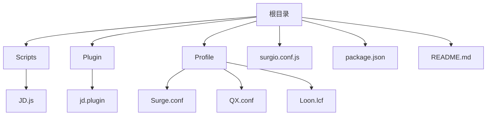
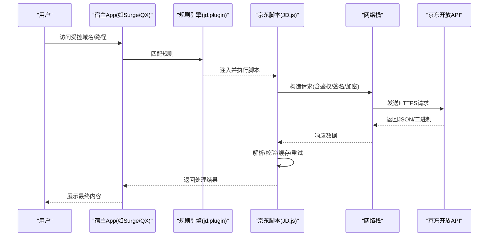
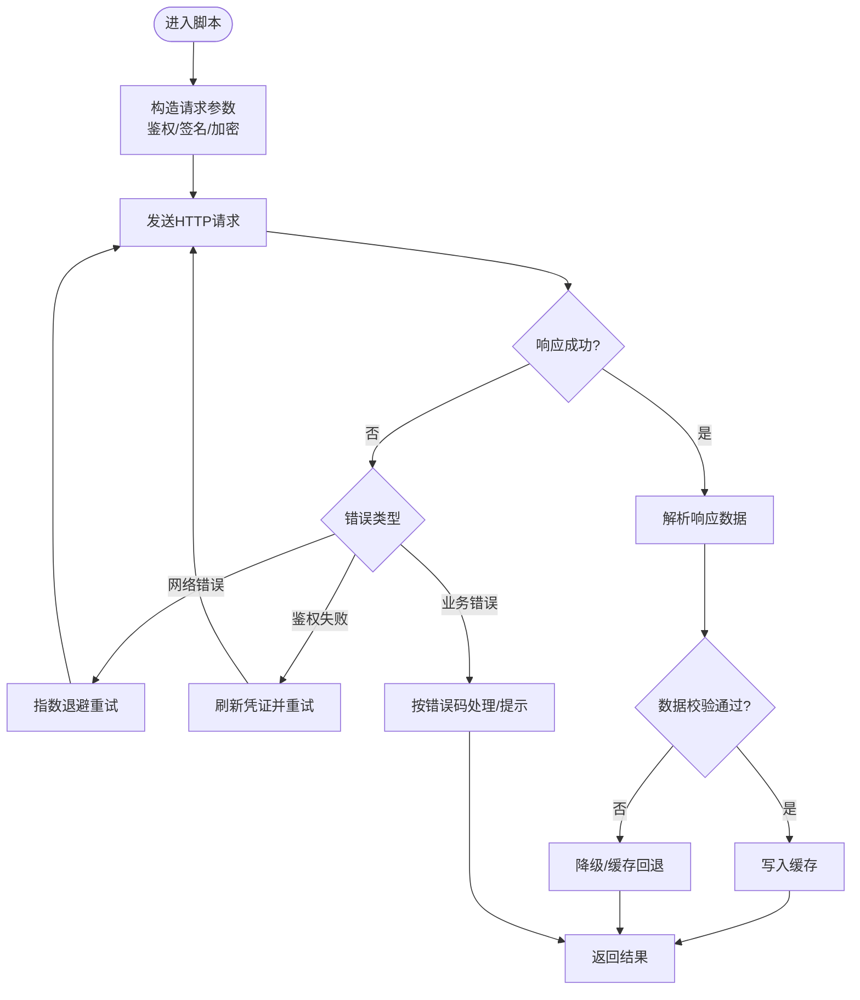
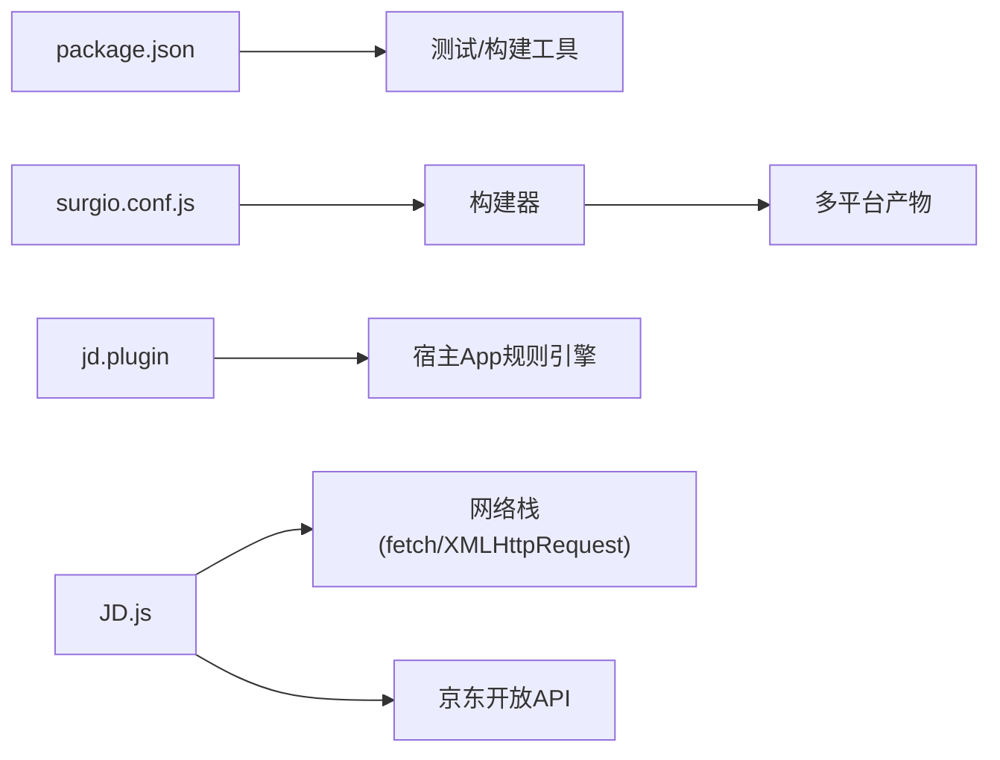

# 电商应用脚本

<cite>
**本文引用的文件**   
- [README.md](file://README.md)
- [package.json](file://package.json)
- [Scripts/JD.js](file://Scripts/JD.js)
- [Plugin/jd.plugin](file://Plugin/jd.plugin)
- [surgio.conf.js](file://surgio.conf.js)
</cite>

## 目录
1. [简介](#简介)
2. [项目结构](#项目结构)
3. [核心组件](#核心组件)
4. [架构总览](#架构总览)
5. [详细组件分析](#详细组件分析)
6. [依赖分析](#依赖分析)
7. [性能考虑](#性能考虑)
8. [故障排查指南](#故障排查指南)
9. [结论](#结论)
10. [附录](#附录)

## 简介
本仓库提供面向移动端网络工具（如 Surge、Quantumult X、Loon）的插件与脚本集合，其中包含针对京东生态的脚本与规则。本文聚焦于“电商应用脚本”的技术文档，围绕京东API集成方式、商品数据获取机制、订单处理逻辑展开说明，并解释脚本如何与服务端通信（身份验证、数据加密、请求签名等安全机制），同时给出接口文档、参数说明、响应格式定义以及异常处理、重试机制与性能监控的实现要点。

## 项目结构
本项目采用“脚本 + 插件 + 配置”的分层组织方式：
- Scripts：各平台脚本实现，包含京东相关脚本 JD.js
- Plugin：各平台插件描述与路由/拦截规则，包含 jd.plugin
- Profile：不同工具的配置文件（Surge、QX、Loon）
- surgio.conf.js：统一构建与分发配置
- package.json：工程依赖与脚本命令
- README.md：项目概览与使用说明

图表来源
- [surgio.conf.js](file://surgio.conf.js)
- [package.json](file://package.json)
- [README.md](file://README.md)

章节来源
- [README.md](file://README.md)
- [package.json](file://package.json)
- [surgio.conf.js](file://surgio.conf.js)

## 核心组件
- 京东脚本（Scripts/JD.js）：负责在客户端侧发起HTTP请求、构造签名、处理响应、缓存与重试等。
- 京东插件（Plugin/jd.plugin）：声明式规则，用于流量拦截、重定向或注入脚本到目标域名。
- 构建与分发（surgio.conf.js）：聚合脚本与规则，生成各平台可用产物。
- 工程配置（package.json）：定义依赖、测试与发布流程。

章节来源
- [Scripts/JD.js](file://Scripts/JD.js)
- [Plugin/jd.plugin](file://Plugin/jd.plugin)
- [surgio.conf.js](file://surgio.conf.js)
- [package.json](file://package.json)

## 架构总览
整体架构遵循“客户端脚本 + 网络拦截 + 服务端API”的模式：
- 客户端脚本通过JS运行时发起HTTP请求
- 插件根据域名/路径将流量导向脚本处理
- 脚本完成鉴权、签名、加解密后调用京东开放API
- 返回数据经解析后供上层业务使用

图表来源
- [Plugin/jd.plugin](file://Plugin/jd.plugin)
- [Scripts/JD.js](file://Scripts/JD.js)

## 详细组件分析

### 京东脚本（Scripts/JD.js）
职责与能力：
- 请求构造：组装URL、Header、Body，设置Content-Type、Accept、User-Agent等
- 身份认证：携带Cookie/Token/Session等凭据，必要时刷新会话
- 安全机制：计算请求签名、时间戳、随机串；对敏感字段进行加密或脱敏
- 数据获取：分页拉取商品列表、详情、价格、库存、评价等
- 订单处理：查询订单状态、发货信息、物流轨迹、售后进度
- 错误处理：区分网络错误、业务错误、限流与鉴权失败，触发重试或降级
- 缓存策略：本地缓存热点数据，减少重复请求
- 性能监控：记录耗时、成功率、错误码分布，便于定位问题

关键流程（示例）：
- 商品搜索/列表：按关键词、类目、排序、分页参数拉取
- 商品详情：按SKU/SPU获取详情、价格、促销、库存
- 订单查询：按订单号、时间范围、状态筛选
- 物流查询：按运单号获取轨迹

图表来源
- [Scripts/JD.js](file://Scripts/JD.js)

章节来源
- [Scripts/JD.js](file://Scripts/JD.js)

### 京东插件（Plugin/jd.plugin）
职责与能力：
- 域名与路径匹配：识别京东相关域名与API路径
- 流量重定向：将匹配到的请求交由脚本处理
- 规则优先级：控制与其他规则的冲突与覆盖关系
- 调试开关：开启日志、抓包、断点等调试能力

典型行为：
- 匹配 /api/* 或特定子域，转发至 JD.js
- 过滤静态资源，避免误拦截
- 支持白名单/黑名单，精细化控制

章节来源
- [Plugin/jd.plugin](file://Plugin/jd.plugin)

### 构建与分发（surgio.conf.js）
职责与能力：
- 聚合脚本与规则，生成多平台产物
- 版本管理与依赖更新
- 自动化测试与发布流水线入口

章节来源
- [surgio.conf.js](file://surgio.conf.js)

### 工程配置（package.json）
职责与能力：
- 定义开发、测试、构建命令
- 管理第三方依赖与ESLint等工具链
- 提供测试用例入口与运行脚本

章节来源
- [package.json](file://package.json)

## 依赖分析
- 脚本依赖宿主环境提供的网络能力（如 fetch/XMLHttpRequest）
- 插件依赖宿主App的规则引擎解析能力
- 构建系统依赖Node.js与相关工具链

图表来源
- [package.json](file://package.json)
- [surgio.conf.js](file://surgio.conf.js)
- [Plugin/jd.plugin](file://Plugin/jd.plugin)
- [Scripts/JD.js](file://Scripts/JD.js)

章节来源
- [package.json](file://package.json)
- [surgio.conf.js](file://surgio.conf.js)
- [Plugin/jd.plugin](file://Plugin/jd.plugin)
- [Scripts/JD.js](file://Scripts/JD.js)

## 性能考虑
- 请求合并与批处理：批量拉取商品/订单，减少往返次数
- 缓存策略：LRU/TTL缓存热点数据，降低重复请求
- 重试与退避：指数退避+抖动，避免雪崩
- 超时与熔断：设置合理超时，失败快速失败
- 压缩与分页：启用Gzip/Br，合理使用分页参数
- 监控与埋点：统计延迟、成功率、错误码分布，辅助优化

[本节为通用指导，不直接分析具体文件]

## 故障排查指南
常见问题与定位步骤：
- 鉴权失败：检查Cookie/Token是否过期，确认刷新流程
- 签名错误：核对时间戳、随机串、参数顺序与编码
- 限流/封禁：观察错误码与频率，调整请求间隔
- 数据不一致：对比缓存与在线数据，强制刷新
- 性能问题：查看耗时分布，定位慢接口

建议的日志与诊断：
- 记录请求头、签名参数、响应体摘要
- 输出重试次数、退避间隔、错误码
- 提供最小可复现用例与网络抓包

章节来源
- [Scripts/JD.js](file://Scripts/JD.js)

## 结论
本项目的电商脚本以模块化方式实现京东API集成，结合插件与构建系统，形成从流量拦截到数据处理的一体化方案。通过完善的鉴权、签名、加密、重试与监控机制，确保在高并发与不稳定网络环境下稳定运行。后续可进一步扩展更多品类与场景，提升数据质量与用户体验。

[本节为总结性内容，不直接分析具体文件]

## 附录

### API接口文档（基于脚本行为的归纳）
说明：以下为常见接口的抽象定义，实际字段以京东官方为准。

- 商品搜索/列表
  - 方法：GET/POST
  - 路径：/api/search（示例）
  - 必填参数：keyword、page、pageSize、sort
  - 可选参数：category、priceRange、brand、filters
  - 响应字段：items[]、total、hasMore、requestId
  - 错误码：401鉴权失败、429限流、500服务端错误

- 商品详情
  - 方法：GET/POST
  - 路径：/api/item/detail（示例）
  - 必填参数：skuId/spuId
  - 可选参数：fields、region、currency
  - 响应字段：item、price、stock、promotions、images[]、specs{}

- 订单查询
  - 方法：GET/POST
  - 路径：/api/order/list（示例）
  - 必填参数：orderId/timeRange/status
  - 可选参数：page、pageSize、extendFields
  - 响应字段：orders[]、total、hasMore

- 物流查询
  - 方法：GET/POST
  - 路径：/api/logistics/track（示例）
  - 必填参数：trackingNo
  - 可选参数：carrier、lang
  - 响应字段：tracks[]、status、eta

注意：
- 所有请求需携带鉴权信息与签名
- 敏感字段需加密传输
- 分页与限流需遵循官方规范

[本节为概念性接口定义，不直接映射具体代码文件]

### 安全机制说明
- 身份验证：Cookie/Token/Session，必要时自动刷新
- 数据加密：对称/非对称加密，敏感字段单独加密
- 请求签名：时间戳、随机串、参数排序、HMAC/MD5/SHA
- 防重放：nonce、timestamp、序列号
- 权限控制：最小权限原则，按需申请接口权限

[本节为通用安全实践，不直接分析具体文件]

### 异常处理与重试机制
- 分类：网络错误、业务错误、鉴权失败、限流、超时
- 策略：指数退避、抖动、最大重试次数、熔断
- 降级：缓存回退、默认值、友好提示
- 监控：错误率、延迟分位、重试次数、熔断状态

章节来源
- [Scripts/JD.js](file://Scripts/JD.js)

### 性能监控与可观测性
- 指标：QPS、延迟、成功率、错误码分布、缓存命中率
- 采集：请求级埋点、异步上报、采样策略
- 告警：阈值告警、趋势分析、根因定位
- 工具：日志聚合、链路追踪、APM

[本节为通用监控实践，不直接分析具体文件]