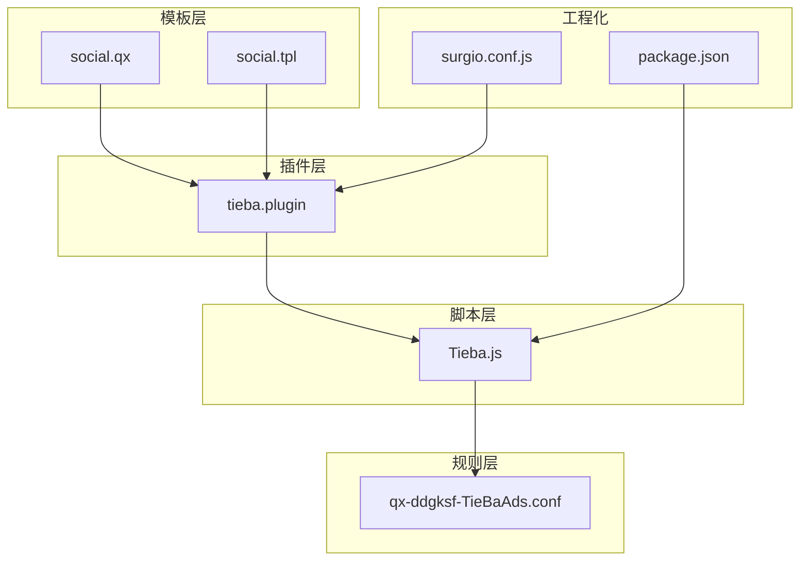
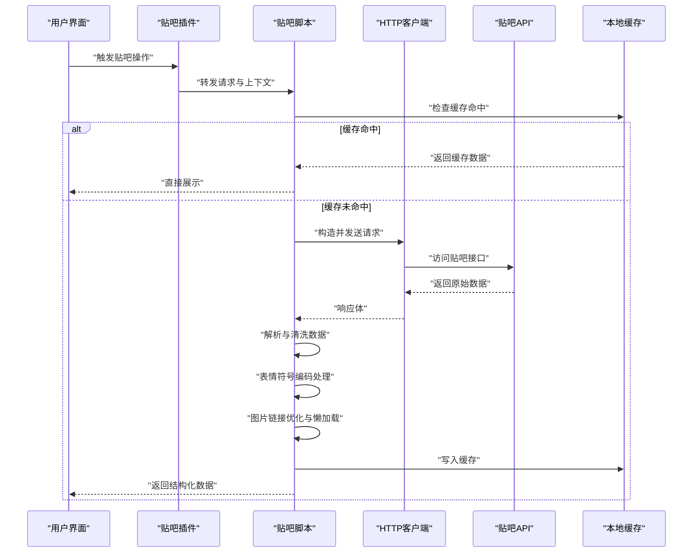
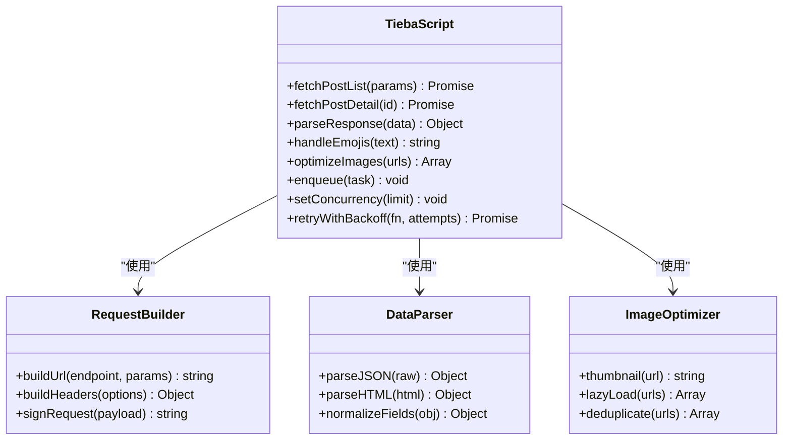
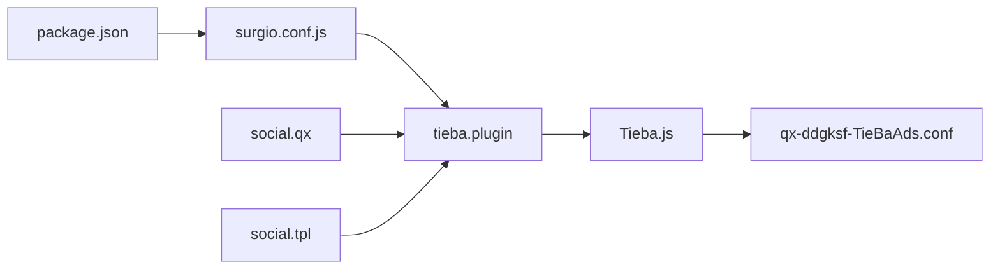

# 社交应用脚本

<cite>
**本文档引用的文件**   
- [README.md](file://README.md)
- [package.json](file://package.json)
- [Scripts/Tieba.js](file://Scripts/Tieba.js)
- [Plugin/tieba.plugin](file://Plugin/tieba.plugin)
- [Mirror/rules/qx-ddgksf-TieBaAds.conf](file://Mirror/rules/qx-ddgksf-TieBaAds.conf)
- [template/snippet/social.qx](file://template/snippet/social.qx)
- [template/snippet/social.tpl](file://template/snippet/social.tpl)
- [surgio.conf.js](file://surgio.conf.js)
</cite>

## 目录
1. [简介](#简介)
2. [项目结构](#项目结构)
3. [核心组件](#核心组件)
4. [架构总览](#架构总览)
5. [详细组件分析](#详细组件分析)
6. [依赖关系分析](#依赖关系分析)
7. [性能考量](#性能考量)
8. [故障排查指南](#故障排查指南)
9. [结论](#结论)
10. [附录](#附录)

## 简介
本技术文档面向社交应用脚本，重点围绕贴吧API集成、帖子抓取机制与用户交互逻辑展开。文档从系统架构、数据流、处理逻辑、异常恢复、并发控制与内存优化等维度进行系统化说明，并提供反爬虫策略应对、请求频率限制与异常恢复的配置方法。读者无需深入代码即可理解整体设计思路与落地方案。

## 项目结构
本项目采用“插件 + 脚本 + 规则”的组合方式：
- 插件层（Plugin）：用于在代理/脚本引擎中启用特定功能模块，如贴吧插件。
- 脚本层（Scripts）：实现具体业务逻辑，包括贴吧脚本。
- 规则层（Mirror/rules）：提供广告过滤、资源拦截与重定向规则，包含贴吧相关规则。
- 模板层（template）：提供不同平台的配置模板与片段，便于快速生成配置文件。
- 工程化与测试（test、.github/workflows、eslint.config.mjs、package.json）：保障质量与可维护性。

图表来源
- [Plugin/tieba.plugin](file://Plugin/tieba.plugin)
- [Scripts/Tieba.js](file://Scripts/Tieba.js)
- [Mirror/rules/qx-ddgksf-TieBaAds.conf](file://Mirror/rules/qx-ddgksf-TieBaAds.conf)
- [template/snippet/social.qx](file://template/snippet/social.qx)
- [template/snippet/social.tpl](file://template/snippet/social.tpl)
- [package.json](file://package.json)
- [surgio.conf.js](file://surgio.conf.js)

章节来源
- [README.md](file://README.md)
- [package.json](file://package.json)

## 核心组件
- 贴吧脚本（Tieba.js）：负责贴吧API调用、帖子列表抓取、内容解析、表情符号编码处理、图片加载优化、消息队列管理、并发控制与异常恢复。
- 贴吧插件（tieba.plugin）：在代理/脚本引擎中注册路由与拦截点，将网络请求转发至脚本处理。
- 贴吧规则（qx-ddgksf-TieBaAds.conf）：定义贴吧相关的广告拦截、资源替换与重定向策略，减少无效请求与带宽消耗。
- 模板（social.qx / social.tpl）：提供社交平台通用配置片段，便于在不同平台快速启用贴吧能力。
- 工程化配置（package.json / surgio.conf.js）：管理依赖、构建流程与部署策略，确保脚本与插件的一致性。

章节来源
- [Scripts/Tieba.js](file://Scripts/Tieba.js)
- [Plugin/tieba.plugin](file://Plugin/tieba.plugin)
- [Mirror/rules/qx-ddgksf-TieBaAds.conf](file://Mirror/rules/qx-ddgksf-TieBaAds.conf)
- [template/snippet/social.qx](file://template/snippet/social.qx)
- [template/snippet/social.tpl](file://template/snippet/social.tpl)
- [package.json](file://package.json)
- [surgio.conf.js](file://surgio.conf.js)

## 架构总览
贴吧脚本通过插件注入到代理/脚本引擎，拦截并处理贴吧相关请求。请求进入后，脚本根据URL与参数判断操作类型（如获取帖子列表、详情、评论），随后执行以下流程：
- 构造请求：封装必要的头部、签名与分页参数。
- 发送请求：使用内置或第三方HTTP客户端发起网络请求。
- 解析响应：对JSON或HTML进行结构化解析，提取帖子元数据与正文。
- 数据处理：处理表情符号编码、图片链接转换与懒加载优化。
- 结果返回：将处理后的数据返回给上层UI或缓存层。

图表来源
- [Scripts/Tieba.js](file://Scripts/Tieba.js)
- [Plugin/tieba.plugin](file://Plugin/tieba.plugin)

## 详细组件分析

### 贴吧脚本（Tieba.js）
- API集成方式：统一封装请求函数，支持GET/POST、分页参数、签名生成与重试策略。
- 帖子抓取机制：基于关键词、吧名或ID拉取帖子列表，按时间或热度排序；详情页抓取正文、楼层与评论。
- 用户交互逻辑：监听用户操作（翻页、搜索、收藏、评论），将动作转化为API调用并更新UI状态。
- 数据结构处理：识别贴吧特有的字段（如楼层ID、作者信息、回复数、点赞数），进行规范化输出。
- 表情符号编码：将服务端返回的表情占位符转换为前端可渲染的标识或图片URL。
- 图片加载优化：对大图进行缩略图优先加载，结合懒加载与去重策略降低带宽占用。
- 消息队列管理：将异步任务（如批量下载、评论发布）入队，按优先级与速率限制调度执行。
- 并发控制：使用令牌桶或信号量控制并发请求数，避免触发服务端限流。
- 内存优化：及时释放大对象引用，使用流式解析与分块处理，避免一次性加载过多数据。
- 异常恢复：捕获网络错误、解析失败与服务端异常，实施指数退避重试与降级策略。

章节来源
- [Scripts/Tieba.js](file://Scripts/Tieba.js)

#### 类与方法关系（概念示意）

图表来源
- [Scripts/Tieba.js](file://Scripts/Tieba.js)

### 贴吧插件（tieba.plugin）
- 作用：在代理/脚本引擎中注册贴吧相关的路由与拦截点，将匹配到的请求转发给脚本处理。
- 行为：根据域名与路径匹配贴吧API与静态资源，必要时进行重定向或注入脚本上下文。
- 配置：支持开关切换、调试日志与白名单/黑名单管理。

章节来源
- [Plugin/tieba.plugin](file://Plugin/tieba.plugin)

### 贴吧规则（qx-ddgksf-TieBaAds.conf）
- 作用：拦截贴吧广告、追踪脚本与无用资源，提升加载速度与用户体验。
- 行为：对匹配的资源进行丢弃、替换为空白或指向本地占位图。
- 扩展：可按吧名或页面类型精细化控制，减少误伤。

章节来源
- [Mirror/rules/qx-ddgksf-TieBaAds.conf](file://Mirror/rules/qx-ddgksf-TieBaAds.conf)

### 模板（social.qx / social.tpl）
- 作用：提供社交平台通用配置片段，便于在不同平台快速启用贴吧能力。
- 内容：包含插件启用、脚本注入、规则加载与基础环境变量设置。

章节来源
- [template/snippet/social.qx](file://template/snippet/social.qx)
- [template/snippet/social.tpl](file://template/snippet/social.tpl)

### 工程化配置（package.json / surgio.conf.js）
- package.json：管理依赖、脚本命令与测试用例，确保开发环境一致性。
- surgio.conf.js：定义构建与部署策略，保证插件与脚本版本同步。

章节来源
- [package.json](file://package.json)
- [surgio.conf.js](file://surgio.conf.js)

## 依赖关系分析
- 插件与脚本：插件作为入口，将请求路由到脚本；脚本依赖HTTP客户端与解析器。
- 脚本与规则：脚本利用规则减少无效请求，提升性能；规则与脚本共同维护用户体验。
- 模板与插件：模板简化配置，使插件在不同平台快速生效。
- 工程化与产物：构建流程确保脚本与插件版本一致，便于部署与维护。

图表来源
- [package.json](file://package.json)
- [surgio.conf.js](file://surgio.conf.js)
- [Plugin/tieba.plugin](file://Plugin/tieba.plugin)
- [Scripts/Tieba.js](file://Scripts/Tieba.js)
- [Mirror/rules/qx-ddgksf-TieBaAds.conf](file://Mirror/rules/qx-ddgksf-TieBaAds.conf)
- [template/snippet/social.qx](file://template/snippet/social.qx)
- [template/snippet/social.tpl](file://template/snippet/social.tpl)

章节来源
- [package.json](file://package.json)
- [surgio.conf.js](file://surgio.conf.js)
- [Plugin/tieba.plugin](file://Plugin/tieba.plugin)
- [Scripts/Tieba.js](file://Scripts/Tieba.js)
- [Mirror/rules/qx-ddgksf-TieBaAds.conf](file://Mirror/rules/qx-ddgksf-TieBaAds.conf)
- [template/snippet/social.qx](file://template/snippet/social.qx)
- [template/snippet/social.tpl](file://template/snippet/social.tpl)

## 性能考量
- 请求频率限制：通过令牌桶或滑动窗口算法限制每秒请求数，避免触发服务端限流。
- 并发控制：限制同时进行的请求数量，防止资源争用与内存峰值过高。
- 缓存策略：对热点帖子与列表进行短期缓存，减少重复请求。
- 图片优化：缩略图优先、懒加载与去重，降低带宽与渲染压力。
- 内存管理：及时释放大对象，使用流式解析与分块处理，避免OOM。
- 降级策略：当API不可用时，返回空数据或提示用户稍后再试，保持应用可用性。

[本节为通用指导，不直接分析具体文件]

## 故障排查指南
- 常见问题：
  - 请求被限流：检查频率限制与并发配置，适当增加退避间隔。
  - 解析失败：确认服务端响应格式变化，更新解析逻辑。
  - 图片无法加载：验证CDN可达性与防盗链策略，必要时替换为可用镜像。
  - 表情显示异常：核对表情映射表与编码转换逻辑。
- 调试建议：
  - 开启插件与脚本的调试日志，定位请求与响应细节。
  - 使用规则工具验证拦截与重定向是否正确。
  - 逐步缩小问题范围，隔离网络、解析与渲染环节。

章节来源
- [Scripts/Tieba.js](file://Scripts/Tieba.js)
- [Plugin/tieba.plugin](file://Plugin/tieba.plugin)
- [Mirror/rules/qx-ddgksf-TieBaAds.conf](file://Mirror/rules/qx-ddgksf-TieBaAds.conf)

## 结论
本技术方案通过插件、脚本与规则的协同，实现了贴吧API的高效集成与稳定抓取。借助消息队列、并发控制与内存优化，系统在复杂网络环境下仍能保持良好性能与用户体验。反爬虫策略与异常恢复机制进一步提升了鲁棒性。建议在持续迭代中关注服务端变更与性能指标，及时调整策略以适配新需求。

[本节为总结性内容，不直接分析具体文件]

## 附录
- 配置示例：参考模板中的社交平台片段，快速启用贴吧能力。
- 最佳实践：合理设置缓存过期时间、图片压缩比例与重试次数。
- 扩展方向：支持多吧聚合、个性化推荐与离线阅读。

[本节为补充信息，不直接分析具体文件]