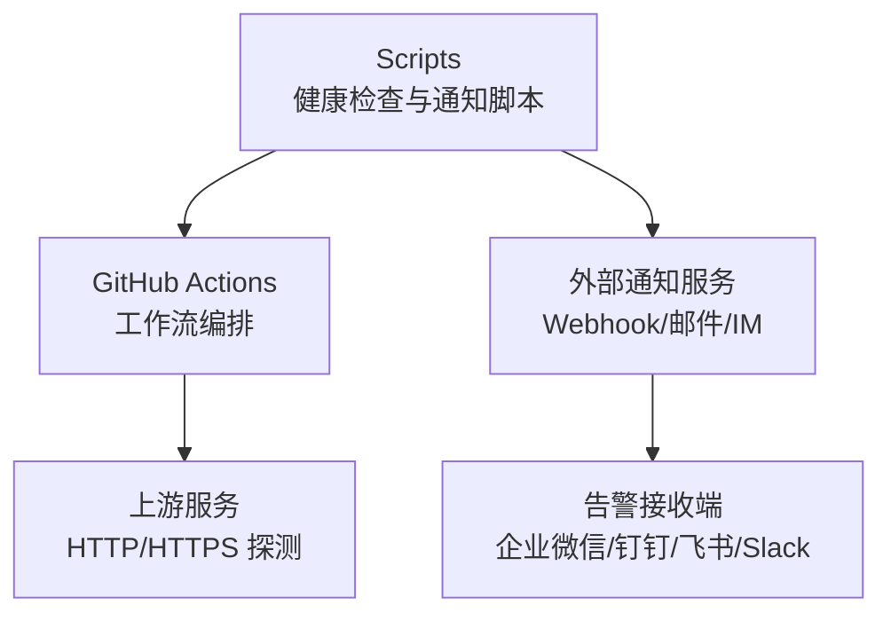
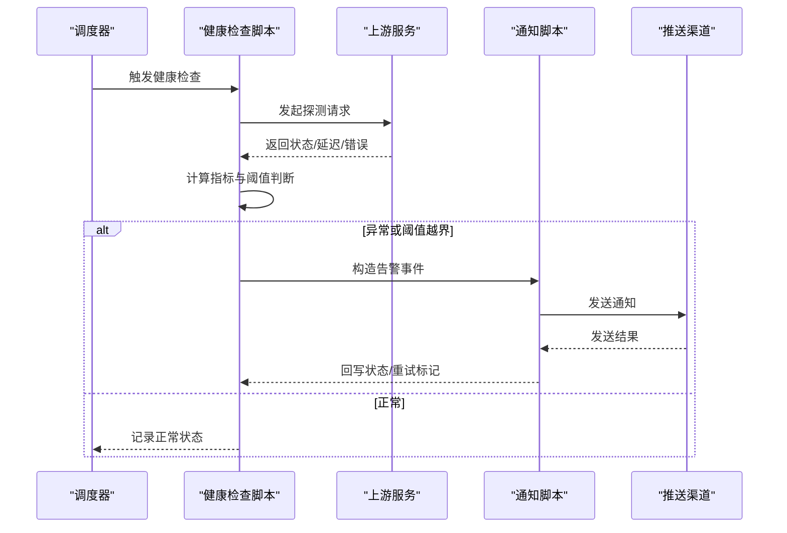
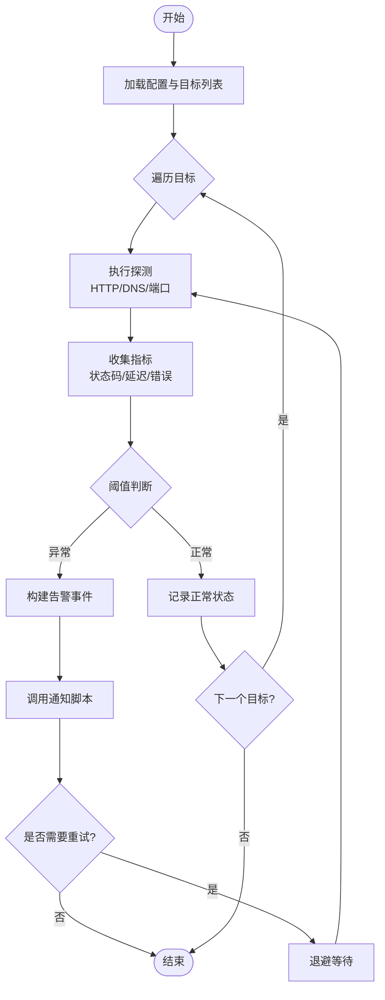
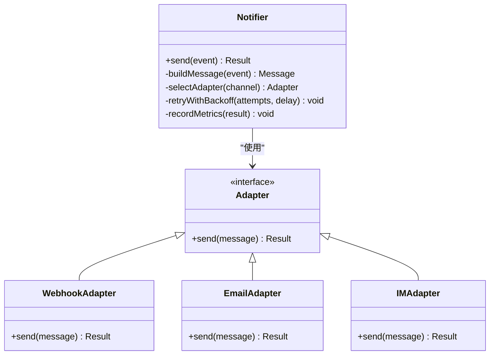

# 健康检查通知

<cite>
**本文引用的文件**   
- [health-notify.js](file://Scripts/health-notify.js)
- [traffic-notify.js](file://Scripts/traffic-notify.js)
- [README.md](file://README.md)
- [upstream-health.yml](file://.github/workflows/upstream-health.yml)
- [script-tests.yml](file://.github/workflows/script-tests.yml)
- [ENGINE-MANIFEST.json](file://Scripts/ENGINE-MANIFEST.json)
</cite>

## 目录
1. [简介](#简介)
2. [项目结构](#项目结构)
3. [核心组件](#核心组件)
4. [架构总览](#架构总览)
5. [详细组件分析](#详细组件分析)
6. [依赖关系分析](#依赖关系分析)
7. [性能考虑](#性能考虑)
8. [故障排查指南](#故障排查指南)
9. [结论](#结论)
10. [附录](#附录)

## 简介
本技术文档围绕健康检查与通知脚本，系统化说明健康检查的实现原理、检测指标与阈值配置、通知机制与消息格式、推送渠道集成、错误处理策略、重试逻辑与性能监控。文档同时提供可操作的配置示例与故障排查指南，帮助读者快速理解并落地使用。

## 项目结构
仓库采用按功能域划分的目录组织方式：
- Scripts：包含健康检查与流量通知等脚本实现
- .github/workflows：包含上游健康检查与工作流编排
- README：项目概览与使用说明
- ENGINE-MANIFEST.json：脚本引擎清单与元数据

[此图为概念性结构图，不直接映射具体源码文件]

## 核心组件
- 健康检查脚本：负责周期性或触发式对目标进行可达性与可用性探测，汇总结果并触发通知。
- 通知脚本：封装消息构建与多渠道推送能力，支持失败重试与幂等控制。
- 工作流编排：在 CI/CD 中调度健康检查任务，统一采集与上报状态。
- 引擎清单：声明脚本运行环境与依赖，便于管理与校验。

章节来源
- [README.md](file://README.md)
- [ENGINE-MANIFEST.json](file://Scripts/ENGINE-MANIFEST.json)

## 架构总览
健康检查通知系统由“探测层—聚合层—通知层—渠道层”构成：
- 探测层：通过 HTTP/HTTPS 请求、端口连通性或 DNS 解析等方式验证目标可用性。
- 聚合层：统计成功率、延迟、错误码分布，计算阈值是否越界。
- 通知层：根据规则生成结构化消息，选择推送渠道并执行发送。
- 渠道层：对接 Webhook、邮件、即时通讯等第三方平台。

图表来源
- [health-notify.js](file://Scripts/health-notify.js)
- [traffic-notify.js](file://Scripts/traffic-notify.js)
- [upstream-health.yml](file://.github/workflows/upstream-health.yml)

章节来源
- [upstream-health.yml](file://.github/workflows/upstream-health.yml)

## 详细组件分析

### 健康检查脚本（health-notify.js）
职责与流程
- 定义检测目标与探测方法（HTTP 状态码、响应时间、DNS 解析、端口连通性等）。
- 执行探测并收集指标（成功/失败、延迟、错误类型）。
- 基于阈值判定是否触发告警（如连续失败次数、平均延迟上限、错误率阈值）。
- 将告警事件传递给通知脚本，附带上下文信息（目标、时间、指标、环境标签）。

关键设计点
- 指标采集：对每个目标维护最近 N 次探测结果，用于滑动窗口统计。
- 阈值策略：支持全局阈值与目标级覆盖；支持分级告警（警告/严重）。
- 去重与抑制：同一目标的重复告警在一定时间内合并，避免风暴。
- 可观测性：输出结构化日志，便于后续分析与审计。

图表来源
- [health-notify.js](file://Scripts/health-notify.js)

章节来源
- [health-notify.js](file://Scripts/health-notify.js)

### 通知脚本（traffic-notify.js）
职责与流程
- 接收健康检查脚本的告警事件，构建标准化消息体。
- 根据渠道配置选择推送通道（Webhook、邮件、IM 等）。
- 执行发送，处理网络异常与业务错误，支持重试与降级。
- 记录发送结果与耗时，供监控与审计。

关键设计点
- 消息模板：统一的 JSON 结构，包含标题、内容、级别、目标、时间戳、链接等字段。
- 渠道适配：为不同渠道提供适配器，屏蔽差异。
- 重试策略：指数退避 + 最大重试次数；失败时写入死信队列或本地持久化。
- 幂等控制：基于事件 ID 去重，防止重复推送。

图表来源
- [traffic-notify.js](file://Scripts/traffic-notify.js)

章节来源
- [traffic-notify.js](file://Scripts/traffic-notify.js)

### 工作流编排（upstream-health.yml）
职责与流程
- 定时或事件触发健康检查任务。
- 拉取脚本与依赖，执行探测与通知。
- 收集结果并上传到制品库或报告平台。
- 失败时触发告警或回滚策略。

关键设计点
- 环境变量注入：敏感信息与渠道密钥通过 Secrets 管理。
- 并行执行：多目标并发探测，缩短整体耗时。
- 结果聚合：汇总各目标状态，生成统一报告。

章节来源
- [upstream-health.yml](file://.github/workflows/upstream-health.yml)

### 脚本引擎清单（ENGINE-MANIFEST.json）
职责与内容
- 声明脚本名称、版本、运行环境、入口文件与依赖。
- 提供校验与加载机制，确保脚本一致性。

章节来源
- [ENGINE-MANIFEST.json](file://Scripts/ENGINE-MANIFEST.json)

## 依赖关系分析
- health-notify.js 依赖通知脚本 traffic-notify.js 完成消息推送。
- upstream-health.yml 作为编排入口，驱动健康检查任务的执行与结果上报。
- 通知脚本依赖外部渠道适配器（Webhook/邮件/IM），通过配置动态选择。

图表来源
- [health-notify.js](file://Scripts/health-notify.js)
- [traffic-notify.js](file://Scripts/traffic-notify.js)
- [upstream-health.yml](file://.github/workflows/upstream-health.yml)

章节来源
- [health-notify.js](file://Scripts/health-notify.js)
- [traffic-notify.js](file://Scripts/traffic-notify.js)
- [upstream-health.yml](file://.github/workflows/upstream-health.yml)

## 性能考虑
- 并发探测：对多目标并行执行，减少端到端延迟。
- 超时与限流：设置合理的请求超时与并发上限，避免资源耗尽。
- 缓存与复用：连接池与 DNS 缓存降低重复开销。
- 指标采样：对高频指标进行采样与降采样，减轻存储压力。
- 异步通知：非阻塞发送，失败时落盘重试，保障主流程稳定。

[本节为通用性能建议，不直接分析具体文件]

## 故障排查指南
常见问题与定位步骤
- 探测失败
  - 检查目标可达性与证书有效性
  - 查看超时与重试配置是否合理
  - 确认网络出口与代理设置
- 通知未送达
  - 校验渠道密钥与权限
  - 检查消息模板字段是否完整
  - 查看重试与退避策略是否生效
- 告警风暴
  - 启用去重与抑制窗口
  - 调整阈值与分级策略
  - 增加静默期与合并规则
- 性能问题
  - 观察并发与超时配置
  - 检查 I/O 瓶颈与磁盘占用
  - 评估指标采样与存储策略

章节来源
- [health-notify.js](file://Scripts/health-notify.js)
- [traffic-notify.js](file://Scripts/traffic-notify.js)

## 结论
健康检查通知系统通过清晰的层次划分与模块化设计，实现了高可用、可扩展与易运维的目标。借助阈值策略、重试与幂等控制，系统在稳定性与可靠性方面具备良好表现。配合工作流编排与引擎清单，可在 CI/CD 环境中高效落地。

[本节为总结性内容，不直接分析具体文件]

## 附录
- 配置示例要点
  - 目标列表：URL、协议、超时、重试次数、阈值
  - 通知渠道：Webhook URL、邮箱、IM 机器人令牌
  - 阈值策略：连续失败次数、平均延迟上限、错误率阈值
  - 去重与抑制：相同目标告警合并窗口
- 监控与审计
  - 指标采集：成功率、延迟、错误码分布、发送耗时
  - 日志规范：结构化日志，包含时间、级别、目标、事件 ID
  - 报表输出：每日健康报告与趋势分析

[本节为补充信息，不直接分析具体文件]