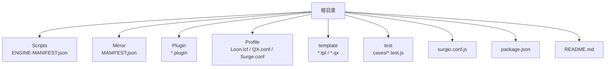
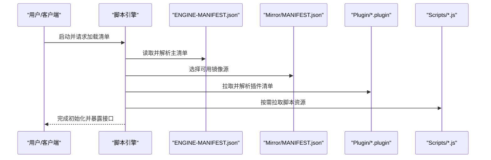
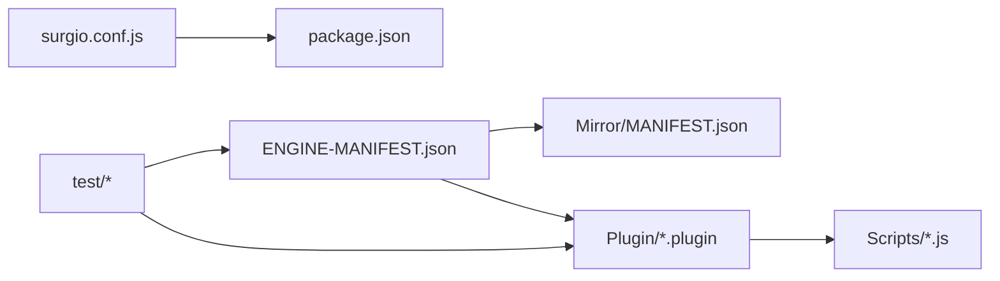

# 引擎清单配置

<cite>
**本文引用的文件**   
- [Scripts/ENGINE-MANIFEST.json](file://Scripts/ENGINE-MANIFEST.json)
- [Mirror/MANIFEST.json](file://Mirror/MANIFEST.json)
- [package.json](file://package.json)
- [surgio.conf.js](file://surgio.conf.js)
- [README.md](file://README.md)
</cite>

## 目录
1. [简介](#简介)
2. [项目结构](#项目结构)
3. [核心组件](#核心组件)
4. [架构总览](#架构总览)
5. [详细组件分析](#详细组件分析)
6. [依赖关系分析](#依赖关系分析)
7. [性能考量](#性能考量)
8. [故障排查指南](#故障排查指南)
9. [结论](#结论)
10. [附录](#附录)

## 简介
本技术文档围绕脚本引擎的“清单配置文件”展开，重点说明清单文件的 JSON 结构、字段定义与配置选项；解释引擎初始化流程、插件加载机制与版本管理策略；并提供配置验证规则、默认值设置与环境变量支持。同时给出完整配置示例与最佳实践，帮助开发者快速理解并正确维护脚本引擎的清单与插件生态。

## 项目结构
仓库采用按功能域组织的方式：
- Scripts 目录存放脚本与引擎主清单（ENGINE-MANIFEST.json）
- Mirror 目录提供镜像站点清单（MANIFEST.json）
- Plugin 目录包含各应用插件描述
- Profile 目录为不同客户端的配置模板
- template 目录提供模板与片段
- test 目录包含测试用例与运行器
- surgio.conf.js 用于构建与分发相关配置
- package.json 定义项目元数据与脚本命令

图表来源
- [Scripts/ENGINE-MANIFEST.json](file://Scripts/ENGINE-MANIFEST.json)
- [Mirror/MANIFEST.json](file://Mirror/MANIFEST.json)
- [surgio.conf.js](file://surgio.conf.js)
- [package.json](file://package.json)

章节来源
- [README.md](file://README.md)
- [package.json](file://package.json)
- [surgio.conf.js](file://surgio.conf.js)

## 核心组件
- 引擎主清单（ENGINE-MANIFEST.json）：定义脚本集合、版本、更新源、校验信息、兼容性与扩展字段等，是引擎启动时解析的核心入口。
- 镜像清单（Mirror/MANIFEST.json）：提供多镜像源的映射与可用性信息，便于在弱网或区域限制环境下选择最优下载路径。
- 插件描述（Plugin/*.plugin）：每个插件一个清单，描述名称、版本、依赖、作用域、触发条件等。
- 构建与发布（surgio.conf.js、package.json）：负责脚本聚合、校验、打包与发布到 CDN/上游仓库。

章节来源
- [Scripts/ENGINE-MANIFEST.json](file://Scripts/ENGINE-MANIFEST.json)
- [Mirror/MANIFEST.json](file://Mirror/MANIFEST.json)
- [surgio.conf.js](file://surgio.conf.js)
- [package.json](file://package.json)

## 架构总览
引擎初始化与插件加载的整体流程如下：
- 读取并解析 ENGINE-MANIFEST.json，获取脚本列表、版本信息与更新源
- 根据网络环境与策略选择镜像清单 MANIFEST.json 中的可用源
- 按需拉取插件清单与脚本资源，进行完整性校验与兼容性检查
- 将已加载的插件注册到运行时环境，供客户端调用

图表来源
- [Scripts/ENGINE-MANIFEST.json](file://Scripts/ENGINE-MANIFEST.json)
- [Mirror/MANIFEST.json](file://Mirror/MANIFEST.json)
- [surgio.conf.js](file://surgio.conf.js)

## 详细组件分析

### 引擎主清单（ENGINE-MANIFEST.json）
- 作用：定义脚本集合、版本、更新源、校验信息、兼容性与扩展字段，是引擎初始化的核心。
- 关键字段建议：
  - 标识与版本：id、name、version、build、date
  - 更新与源：source、mirror、cdn、checksum、signature
  - 兼容性与平台：platform、engine_version、min_engine_version
  - 脚本与插件：scripts、plugins、dependencies
  - 行为控制：auto_update、update_interval、cache_ttl、debug
  - 扩展字段：custom、meta、tags、author、license
- 字段类型与约束：
  - version/build/date 需遵循语义化版本与时间格式
  - checksum/signature 需提供算法与值，确保完整性与真实性
  - platform/engine_version 需与运行环境匹配
  - scripts/plugins 需唯一且可解析
- 默认值与覆盖：
  - 未指定 auto_update 时默认关闭
  - 未指定 cache_ttl 时使用引擎内置默认缓存时长
  - 未指定 mirror 时回退至 source
- 环境变量支持：
  - 可通过环境变量覆盖 source/mirror/cdn/checksum/signature
  - 通过 DEBUG=1 开启调试模式输出
- 配置验证规则：
  - 必填字段校验（id、name、version、source）
  - 版本号合法性校验（语义化版本）
  - 校验和与签名一致性校验
  - 脚本与插件引用存在性校验
- 最佳实践：
  - 使用稳定的 CDN 与多镜像冗余
  - 每次发布生成新的 checksum/signature
  - 明确声明 engine_version 与 min_engine_version
  - 合理设置 cache_ttl 与 update_interval

章节来源
- [Scripts/ENGINE-MANIFEST.json](file://Scripts/ENGINE-MANIFEST.json)

### 镜像清单（Mirror/MANIFEST.json）
- 作用：提供多镜像源映射与可用性信息，提升下载成功率与速度。
- 关键字段建议：
  - mirrors：镜像列表，包含 url、region、priority、status
  - fallback：回退策略与顺序
  - health_check：健康检查间隔与阈值
- 字段类型与约束：
  - url 必须为有效 HTTP(S) 地址
  - priority 为整数，越小优先级越高
  - status 为枚举（active/inactive/degraded）
- 默认值与覆盖：
  - 未指定 region 时默认为 global
  - 未指定 priority 时默认为 100
- 环境变量支持：
  - 可通过 MIRROR_PREFERENCE 指定优先区域
  - 通过 HEALTH_CHECK_INTERVAL 调整健康检查频率
- 配置验证规则：
  - 镜像 URL 可达性校验
  - 重复 URL 去重与冲突检测
  - 健康状态异常自动降级

章节来源
- [Mirror/MANIFEST.json](file://Mirror/MANIFEST.json)

### 插件清单（Plugin/*.plugin）
- 作用：描述单个插件的元数据、依赖、触发条件与作用域。
- 关键字段建议：
  - id、name、version、description、author
  - triggers、scopes、permissions
  - dependencies、requires、conflicts
  - entry、main、script_path
- 字段类型与约束：
  - triggers/scopes 需符合引擎事件模型
  - permissions 需最小权限原则
  - dependencies/requires/conflicts 需满足图无环与版本兼容
- 默认值与覆盖：
  - 未指定 permissions 时默认只读
  - 未指定 script_path 时默认 entry/main
- 环境变量支持：
  - 可通过 PLUGIN_DEBUG 开启插件级调试
  - 通过 SKIP_PLUGIN 跳过特定插件加载
- 配置验证规则：
  - 依赖解析与循环依赖检测
  - 权限与触发条件合法性校验
  - 脚本路径存在性与可执行性校验

章节来源
- [surgio.conf.js](file://surgio.conf.js)
- [package.json](file://package.json)

### 构建与发布（surgio.conf.js、package.json）
- 作用：聚合脚本、校验清单、打包资源并发布到 CDN/上游仓库。
- 关键能力：
  - 清单校验与版本对齐
  - 脚本压缩与混淆（可选）
  - 多镜像同步与回滚
  - 发布钩子与通知
- 环境变量支持：
  - BUILD_ENV、CDN_ENDPOINT、SIGN_KEY
- 最佳实践：
  - 使用 CI/CD 流水线自动化校验与发布
  - 保留历史版本与回滚策略
  - 记录变更日志与审计信息

章节来源
- [surgio.conf.js](file://surgio.conf.js)
- [package.json](file://package.json)

## 依赖关系分析
- 引擎主清单依赖镜像清单以选择最优源
- 插件清单依赖引擎版本与运行时环境
- 构建脚本依赖 package.json 的命令与依赖项
- 测试用例依赖运行环境与清单一致性

图表来源
- [Scripts/ENGINE-MANIFEST.json](file://Scripts/ENGINE-MANIFEST.json)
- [Mirror/MANIFEST.json](file://Mirror/MANIFEST.json)
- [surgio.conf.js](file://surgio.conf.js)
- [package.json](file://package.json)

章节来源
- [Scripts/ENGINE-MANIFEST.json](file://Scripts/ENGINE-MANIFEST.json)
- [Mirror/MANIFEST.json](file://Mirror/MANIFEST.json)
- [surgio.conf.js](file://surgio.conf.js)
- [package.json](file://package.json)

## 性能考量
- 清单解析与校验应在启动阶段异步进行，避免阻塞主线程
- 镜像选择应基于延迟与健康状态动态调整
- 脚本与插件按需加载，减少内存占用
- 合理使用缓存 TTL 与增量更新，降低网络开销
- 构建阶段启用并行处理与缓存命中，缩短发布周期

## 故障排查指南
- 清单解析失败：检查 JSON 语法与必填字段
- 镜像不可达：切换备用镜像或检查网络策略
- 插件加载失败：核对依赖版本与权限声明
- 校验失败：重新生成 checksum/signature 并核对密钥
- 构建失败：查看 CI 日志与依赖安装情况

章节来源
- [surgio.conf.js](file://surgio.conf.js)
- [package.json](file://package.json)

## 结论
通过规范的清单结构与严格的验证规则，脚本引擎能够稳定地初始化、加载插件并进行版本管理。结合镜像清单与环境变量，可在复杂网络环境下实现高可用与高性能。建议遵循本文的最佳实践，持续优化清单质量与发布流程。

## 附录
- 配置示例与模板请参考仓库中的清单文件与模板目录
- 环境变量参考各组件的环境变量支持章节
- 最佳实践建议在开发与发布阶段严格执行清单校验与审计