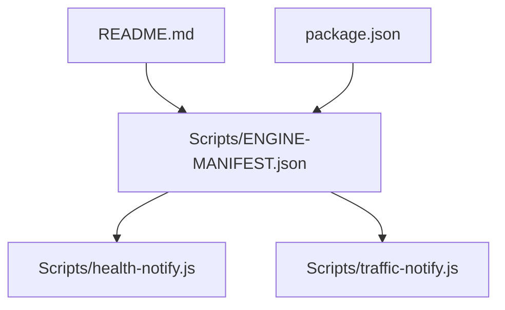
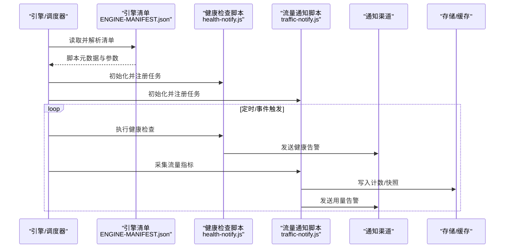
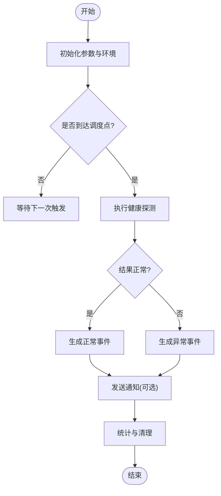
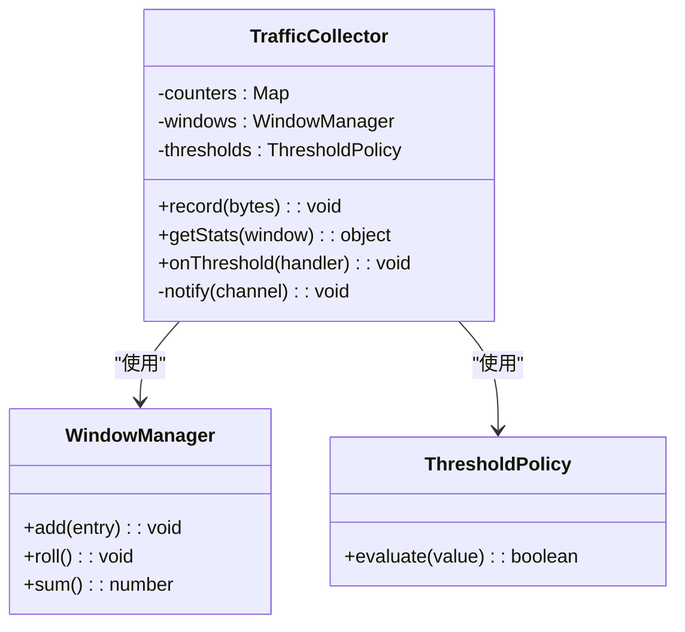
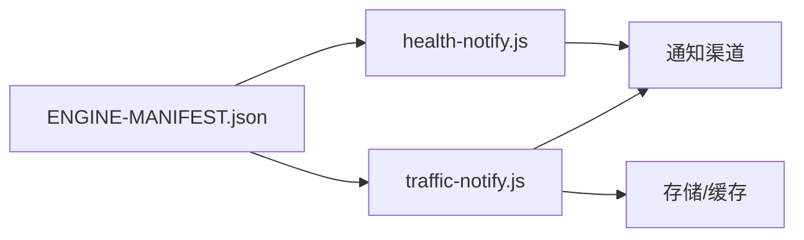

# 核心脚本

<cite>
**本文引用的文件**   
- [Scripts/ENGINE-MANIFEST.json](file://Scripts/ENGINE-MANIFEST.json)
- [Scripts/health-notify.js](file://Scripts/health-notify.js)
- [Scripts/traffic-notify.js](file://Scripts/traffic-notify.js)
- [README.md](file://README.md)
- [package.json](file://package.json)
</cite>

## 目录
1. [简介](#简介)
2. [项目结构](#项目结构)
3. [核心组件](#核心组件)
4. [架构总览](#架构总览)
5. [详细组件分析](#详细组件分析)
6. [依赖分析](#依赖分析)
7. [性能考虑](#性能考虑)
8. [故障排查指南](#故障排查指南)
9. [结论](#结论)
10. [附录](#附录)

## 简介
本技术文档聚焦于仓库中的“核心脚本模块”，围绕以下目标展开：
- 解释引擎清单文件的结构与配置选项，说明其如何驱动脚本加载与运行。
- 详解健康检查与流量通知脚本的实现原理、执行环境、API接口与调用模式。
- 描述脚本的生命周期管理、错误处理机制与性能优化策略。
- 提供使用示例与集成指南，帮助快速接入并稳定运行。

## 项目结构
核心脚本位于 Scripts 目录，包含多个业务脚本与两个关键系统脚本：
- health-notify.js：健康检查与通知
- traffic-notify.js：流量统计与通知
- ENGINE-MANIFEST.json：引擎清单，定义脚本元数据、版本、入口与运行参数等

此外，根目录的 README.md 与 package.json 提供了项目背景与构建/测试相关信息，有助于理解整体工程化上下文。

图表来源
- [Scripts/ENGINE-MANIFEST.json](file://Scripts/ENGINE-MANIFEST.json)
- [Scripts/health-notify.js](file://Scripts/health-notify.js)
- [Scripts/traffic-notify.js](file://Scripts/traffic-notify.js)
- [README.md](file://README.md)
- [package.json](file://package.json)

章节来源
- [README.md](file://README.md)
- [package.json](file://package.json)

## 核心组件
- 引擎清单（ENGINE-MANIFEST.json）
  - 作用：集中声明脚本元数据、版本、入口路径、运行参数、依赖关系、启用开关等，供上层引擎或调度器解析后按需加载。
  - 关键字段建议：id、name、version、entry、env、params、enabled、depends、schedule、tags、description。
- 健康检查脚本（health-notify.js）
  - 作用：周期性或事件触发地探测服务/节点健康状态，并在异常时发送通知。
  - 典型能力：HTTP/TCP/ICMP 探测、阈值判定、去抖与重试、通知渠道聚合。
- 流量通知脚本（traffic-notify.js）
  - 作用：采集网络流量指标，按规则计算用量与趋势，达到阈值时触发通知。
  - 典型能力：计数器累加、窗口统计、阈值比较、告警分级、上报与持久化。

章节来源
- [Scripts/ENGINE-MANIFEST.json](file://Scripts/ENGINE-MANIFEST.json)
- [Scripts/health-notify.js](file://Scripts/health-notify.js)
- [Scripts/traffic-notify.js](file://Scripts/traffic-notify.js)

## 架构总览
下图展示了引擎清单驱动的脚本加载与执行流程，以及健康检查与流量通知两大子系统之间的交互关系。

图表来源
- [Scripts/ENGINE-MANIFEST.json](file://Scripts/ENGINE-MANIFEST.json)
- [Scripts/health-notify.js](file://Scripts/health-notify.js)
- [Scripts/traffic-notify.js](file://Scripts/traffic-notify.js)

## 详细组件分析

### 引擎清单（ENGINE-MANIFEST.json）
- 设计目标
  - 统一描述所有脚本的元数据与运行约束，便于引擎动态加载、版本管理与灰度发布。
- 关键配置项（建议）
  - id：唯一标识
  - name：显示名称
  - version：语义化版本
  - entry：脚本入口路径
  - env：环境变量键值对
  - params：运行时参数（如阈值、间隔、超时）
  - enabled：是否启用
  - depends：依赖脚本或服务
  - schedule：调度策略（cron/interval/event）
  - tags：分类标签
  - description：功能描述
- 解析与校验
  - 引擎在启动时解析清单，进行字段完整性与类型校验，失败则跳过对应脚本并记录日志。
- 扩展性
  - 通过 tags 与 depends 实现模块化组合；通过 env/params 实现多环境适配。

章节来源
- [Scripts/ENGINE-MANIFEST.json](file://Scripts/ENGINE-MANIFEST.json)

### 健康检查脚本（health-notify.js）
- 职责边界
  - 负责探测目标的健康状态，将结果转换为标准化事件，并触发通知。
- 执行环境
  - 由引擎根据清单注入运行环境（变量、定时器、网络库、日志等）。
- 生命周期
  - 初始化：解析参数、建立连接池、注册回调
  - 运行：按调度策略执行探测、聚合结果、判断阈值
  - 清理：释放资源、关闭连接、输出统计
- API 与调用模式
  - 对外暴露：check(target, options)、onResult(handler)、onError(handler)
  - 内部调用：网络探测、阈值判定、通知发送
- 错误处理
  - 区分可恢复与不可恢复错误，支持重试与退避；异常上抛至引擎并记录上下文。
- 性能优化
  - 并发探测、连接复用、结果缓存、批量通知、最小化序列化开销。

图表来源
- [Scripts/health-notify.js](file://Scripts/health-notify.js)

章节来源
- [Scripts/health-notify.js](file://Scripts/health-notify.js)

### 流量通知脚本（traffic-notify.js）
- 职责边界
  - 采集与聚合流量数据，基于阈值与趋势产生告警或报表。
- 执行环境
  - 由引擎注入计时器、计数器、存储接口与通知通道。
- 生命周期
  - 初始化：加载配置、准备计数器与窗口
  - 运行：增量更新、窗口滚动、阈值比较、触发通知
  - 清理：持久化快照、导出统计、释放资源
- API 与调用模式
  - 对外暴露：record(bytes), getStats(window), onThreshold(handler)
  - 内部调用：计数器累加、滑动窗口计算、阈值判定、通知发送
- 错误处理
  - 对 I/O 与计算异常进行捕获与降级，保证主流程不中断。
- 性能优化
  - 增量更新、内存映射、批处理写入、异步通知、低精度采样。

图表来源
- [Scripts/traffic-notify.js](file://Scripts/traffic-notify.js)

章节来源
- [Scripts/traffic-notify.js](file://Scripts/traffic-notify.js)

## 依赖分析
- 内部依赖
  - 两个脚本均依赖引擎提供的运行时能力（定时器、日志、网络、存储、通知）。
  - 清单文件为两者的加载与参数注入提供依据。
- 外部依赖
  - 通知渠道（短信、邮件、IM 等）、存储后端（本地/远程）、网络探测目标。
- 耦合与解耦
  - 通过清单与标准 API 降低脚本与引擎的耦合；通过事件与回调解耦探测与通知。

图表来源
- [Scripts/ENGINE-MANIFEST.json](file://Scripts/ENGINE-MANIFEST.json)
- [Scripts/health-notify.js](file://Scripts/health-notify.js)
- [Scripts/traffic-notify.js](file://Scripts/traffic-notify.js)

章节来源
- [Scripts/ENGINE-MANIFEST.json](file://Scripts/ENGINE-MANIFEST.json)
- [Scripts/health-notify.js](file://Scripts/health-notify.js)
- [Scripts/traffic-notify.js](file://Scripts/traffic-notify.js)

## 性能考虑
- 清单解析
  - 启动时一次性解析并缓存，避免重复 IO。
- 健康检查
  - 并发探测与连接池复用；失败快速返回；结果缓存减少重复请求。
- 流量统计
  - 增量计数与滑动窗口；批处理写入；异步通知；必要时降采样。
- 资源管理
  - 明确初始化与清理阶段，防止句柄泄漏；限制最大并发与队列长度。

[本节为通用指导，无需引用具体文件]

## 故障排查指南
- 常见问题定位
  - 清单解析失败：检查字段完整性与类型；查看引擎日志中解析错误位置。
  - 健康检查误报：确认目标可达性与超时设置；增加重试与退避策略。
  - 流量统计偏差：核对计数器累加逻辑与窗口对齐；检查存储写入是否成功。
  - 通知未送达：验证渠道配置与限流策略；查看重试与回执。
- 调试建议
  - 开启详细日志；隔离单脚本独立运行；使用最小化清单复现问题。
  - 对关键路径添加埋点与指标上报。

章节来源
- [Scripts/ENGINE-MANIFEST.json](file://Scripts/ENGINE-MANIFEST.json)
- [Scripts/health-notify.js](file://Scripts/health-notify.js)
- [Scripts/traffic-notify.js](file://Scripts/traffic-notify.js)

## 结论
本仓库的核心脚本模块以清单驱动的方式组织与运行，健康检查与流量通知两大脚本各司其职，并通过统一的 API 与事件模型与引擎协作。通过合理的生命周期管理、错误处理与性能优化策略，可在复杂环境中保持稳定与高效。建议在生产部署前完成清单校验、阈值调优与通知链路联调。

[本节为总结性内容，无需引用具体文件]

## 附录
- 使用示例（步骤）
  - 在清单中添加脚本条目，指定入口、参数与调度策略。
  - 启动引擎，观察脚本初始化与首次执行日志。
  - 调整阈值与通知渠道，验证告警触发与送达。
- 集成指南
  - 确保引擎具备所需的外部依赖（网络、存储、通知）。
  - 使用环境变量与参数分离不同环境的配置。
  - 通过 CI 校验清单与脚本语法，保障质量。

[本节为通用指导，无需引用具体文件]