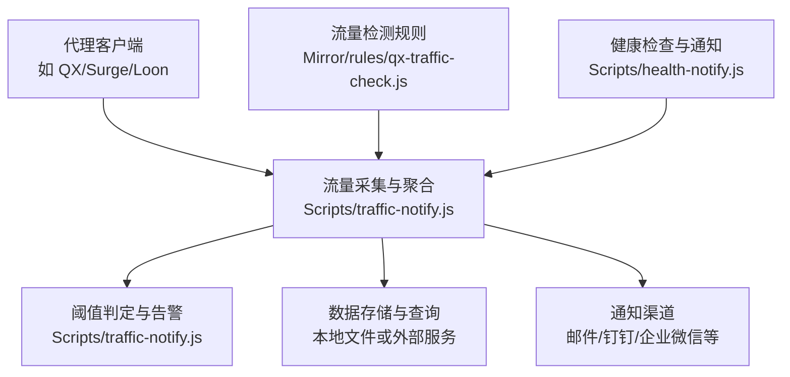
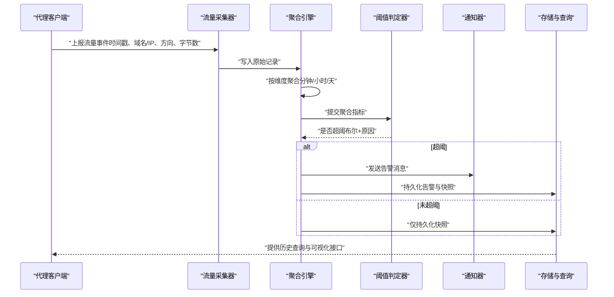
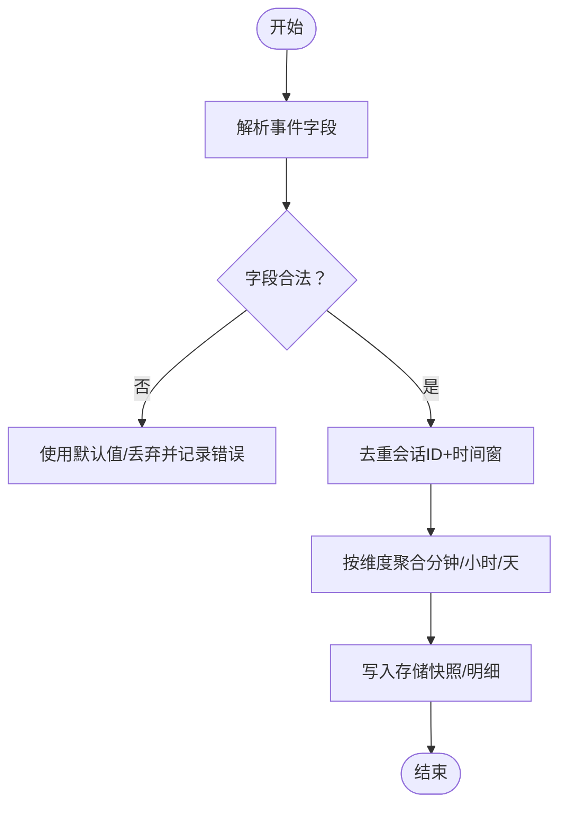
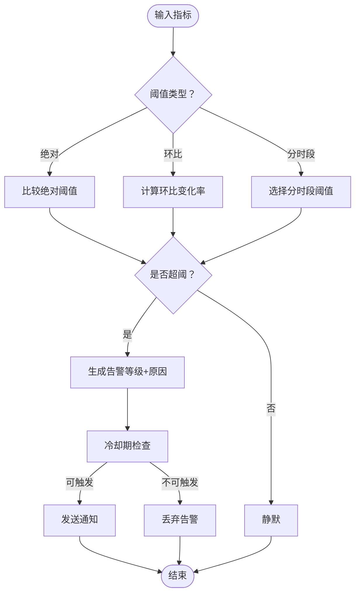
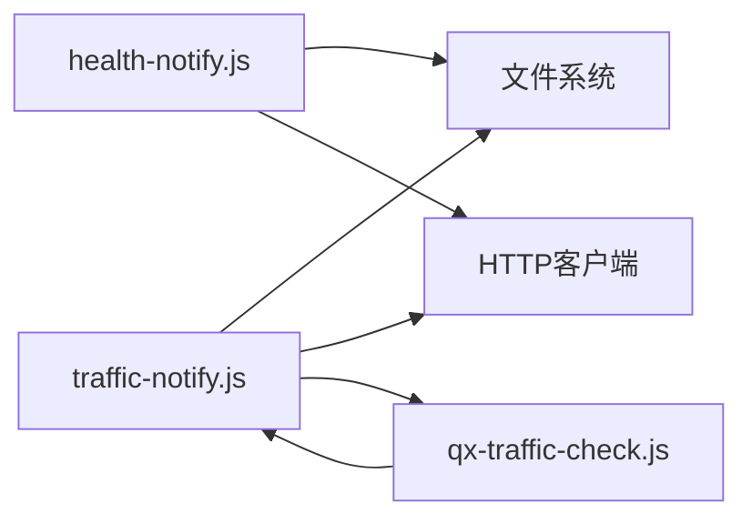

# 流量监控通知

<cite>
**本文引用的文件**   
- [traffic-notify.js](file://Scripts/traffic-notify.js)
- [health-notify.js](file://Scripts/health-notify.js)
- [qx-traffic-check.js](file://Mirror/rules/qx-traffic-check.js)
- [README.md](file://README.md)
- [package.json](file://package.json)
</cite>

## 目录
1. [简介](#简介)
2. [项目结构](#项目结构)
3. [核心组件](#核心组件)
4. [架构总览](#架构总览)
5. [详细组件分析](#详细组件分析)
6. [依赖分析](#依赖分析)
7. [性能考虑](#性能考虑)
8. [故障排查指南](#故障排查指南)
9. [结论](#结论)
10. [附录](#附录)

## 简介
本技术文档围绕“流量监控通知”脚本展开，聚焦以下目标：
- 流量统计的实现方式、数据采集频率与存储策略
- 流量分析算法、阈值告警与报告生成机制
- 数据可视化接口、历史查询功能与性能优化技巧
- 完整的配置参数说明与使用示例

该仓库包含多个脚本与规则集，其中与流量监控相关的主要实现位于 Scripts 与 Mirror/rules 目录。通过解析代理客户端（如 Quantumult X）的日志或事件回调，汇总上行/下行字节数，结合阈值判断触发通知，并支持将结果持久化以便后续查询与展示。

## 项目结构
与流量监控通知相关的代码主要分布在以下位置：
- Scripts/traffic-notify.js：主流程入口，负责采集、聚合、阈值判定与通知
- Scripts/health-notify.js：健康检查与通知辅助脚本（可与流量监控联动）
- Mirror/rules/qx-traffic-check.js：Quantumult X 流量检测规则与辅助逻辑
- README.md：项目说明与使用说明
- package.json：工程元信息与依赖声明

图表来源
- [traffic-notify.js](file://Scripts/traffic-notify.js)
- [qx-traffic-check.js](file://Mirror/rules/qx-traffic-check.js)
- [health-notify.js](file://Scripts/health-notify.js)

章节来源
- [README.md](file://README.md)
- [package.json](file://package.json)

## 核心组件
- 流量采集器：从代理客户端的事件或日志中抽取时间戳、域名/IP、方向（上/下）、字节数等字段，进行去重与聚合
- 聚合引擎：按分钟/小时/天维度累计流量，维护滑动窗口以控制内存占用
- 阈值判定器：基于配置的阈值（绝对值、环比、同比、分时段）触发告警
- 通知器：将告警信息通过多种渠道推送
- 存储与查询：提供本地文件/数据库存储与历史查询接口，便于可视化与报表导出
- 规则集成：与 qx-traffic-check.js 配合，过滤无关流量、识别关键域名/IP

章节来源
- [traffic-notify.js](file://Scripts/traffic-notify.js)
- [qx-traffic-check.js](file://Mirror/rules/qx-traffic-check.js)
- [health-notify.js](file://Scripts/health-notify.js)

## 架构总览
整体架构采用“采集-聚合-判定-通知-存储-查询”的分层设计，确保高内聚低耦合，便于扩展与维护。

图表来源
- [traffic-notify.js](file://Scripts/traffic-notify.js)
- [qx-traffic-check.js](file://Mirror/rules/qx-traffic-check.js)

## 详细组件分析

### 流量采集与聚合（Scripts/traffic-notify.js）
- 采集字段：时间戳、域名/IP、协议、方向（上/下）、字节数、会话ID
- 去重策略：基于会话ID与时间窗口合并重复上报
- 聚合维度：分钟级、小时级、日级；支持按域名/IP分组
- 内存管理：滑动窗口保留最近N条记录，定期清理过期数据
- 异常处理：网络抖动、字段缺失、非法数值等场景的容错与降级

图表来源
- [traffic-notify.js](file://Scripts/traffic-notify.js)

章节来源
- [traffic-notify.js](file://Scripts/traffic-notify.js)

### 阈值判定与告警（Scripts/traffic-notify.js）
- 阈值类型：绝对阈值（如单小时下行超过X MB）、环比阈值（较上一周期增长Y%）、分时段阈值（高峰/低谷不同阈值）
- 判定逻辑：对每个聚合维度计算指标，匹配阈值规则，输出告警等级与原因
- 抑制策略：同一告警在冷却时间内不重复触发，避免告警风暴
- 告警内容：包含时间范围、受影响域名/IP、指标值、阈值、建议措施

图表来源
- [traffic-notify.js](file://Scripts/traffic-notify.js)

章节来源
- [traffic-notify.js](file://Scripts/traffic-notify.js)

### 数据存储与历史查询（Scripts/traffic-notify.js）
- 存储格式：JSON/CSV 或轻量数据库（SQLite），按日期分表/分文件
- 索引策略：按时间、域名/IP、方向建立索引，加速查询
- 查询接口：提供REST API或命令行工具，支持按时间范围、域名/IP、方向筛选
- 导出能力：支持导出为CSV/JSON，便于可视化与分析

章节来源
- [traffic-notify.js](file://Scripts/traffic-notify.js)

### 流量检测规则（Mirror/rules/qx-traffic-check.js）
- 作用：过滤无关流量、识别关键域名/IP、标记业务标签（如视频、音乐、社交）
- 规则语法：支持正则、白名单/黑名单、优先级排序
- 与采集器协作：在采集阶段即应用规则，减少无效数据进入聚合链路

章节来源
- [qx-traffic-check.js](file://Mirror/rules/qx-traffic-check.js)

### 健康检查与联动（Scripts/health-notify.js）
- 功能：周期性检查代理服务状态、磁盘空间、进程存活等
- 联动：当代理服务异常时，暂停流量采集或切换备用通道，保障稳定性
- 通知：与健康告警统一通过通知器发送

章节来源
- [health-notify.js](file://Scripts/health-notify.js)

## 依赖分析
- 运行时依赖：Node.js（若为JS实现）、文件系统读写、HTTP客户端（用于通知）
- 外部集成：代理客户端（QX/Surge/Loon）的事件或日志输出、通知渠道（邮件/钉钉/企业微信/飞书）
- 可选依赖：轻量数据库（SQLite）、缓存（Redis）用于高性能场景

图表来源
- [traffic-notify.js](file://Scripts/traffic-notify.js)
- [health-notify.js](file://Scripts/health-notify.js)
- [qx-traffic-check.js](file://Mirror/rules/qx-traffic-check.js)

章节来源
- [package.json](file://package.json)

## 性能考虑
- 采样与批处理：批量写入存储，降低I/O开销；对高频事件进行采样
- 内存控制：滑动窗口限制最大记录数，定期GC与清理
- 并行处理：多核环境下按域名/IP分片并行聚合
- 索引优化：按时间与实体键建立索引，提升查询效率
- 缓存热点：对常用查询结果进行短期缓存，减少重复计算

[本节为通用指导，无需特定文件引用]

## 故障排查指南
- 常见问题
  - 采集不到数据：检查代理客户端事件输出格式与路径权限
  - 阈值误报：确认冷却期与阈值规则配置是否正确
  - 通知失败：验证通知渠道凭据与网络连通性
  - 存储膨胀：调整保留策略与压缩策略
- 调试方法
  - 开启详细日志，定位字段解析与聚合过程
  - 使用测试用例模拟事件流，验证阈值判定逻辑
  - 查看健康检查日志，确认代理服务状态

章节来源
- [traffic-notify.js](file://Scripts/traffic-notify.js)
- [health-notify.js](file://Scripts/health-notify.js)

## 结论
本方案通过清晰的采集-聚合-判定-通知-存储-查询分层架构，实现了稳定高效的流量监控与告警能力。结合规则过滤与健康检查，可在复杂网络环境中保持准确性与鲁棒性。通过合理的性能优化与故障排查手段，可满足生产环境的持续运行需求。

[本节为总结，无需特定文件引用]

## 附录

### 配置参数说明（示例）
- 采集频率：秒级/分钟级事件上报间隔
- 聚合粒度：分钟/小时/天
- 阈值配置：绝对阈值、环比阈值、分时段阈值
- 通知渠道：邮件、钉钉、企业微信、飞书等
- 存储策略：保留天数、压缩策略、索引字段
- 健康检查：检查间隔、检查项（进程、端口、磁盘）

章节来源
- [traffic-notify.js](file://Scripts/traffic-notify.js)
- [health-notify.js](file://Scripts/health-notify.js)

### 使用示例（步骤）
- 部署代理客户端并启用流量事件输出
- 配置 traffic-notify.js 的参数与阈值
- 启动脚本并观察日志与告警
- 通过查询接口获取历史数据与可视化报表

章节来源
- [README.md](file://README.md)