# 维护工具脚本

<cite>
**本文引用的文件**   
- [README.md](file://README.md)
- [package.json](file://package.json)
- [deploy-all-v8.sh](file://deploy-all-v8.sh)
- [eslint.config.mjs](file://eslint.config.mjs)
- [surgio.conf.js](file://surgio.conf.js)
- [Scripts/ENGINE-MANIFEST.json](file://Scripts/ENGINE-MANIFEST.json)
- [Mirror/MANIFEST.json](file://Mirror/MANIFEST.json)
- [Scripts/cleanup.sh](file://Scripts/cleanup.sh)
- [Scripts/complete-cleanup.sh](file://Scripts/complete-cleanup.sh)
- [Scripts/update-readme.sh](file://Scripts/update-readme.sh)
- [test/harness.js](file://test/harness.js)
- [test/run-tests.js](file://test/run-tests.js)
- [test/cases/purify-scripts.test.js](file://test/cases/purify-scripts.test.js)
- [test/cases/qidian-wrapper.test.js](file://test/cases/qidian-wrapper.test.js)
- [test/cases/zhihu-cainiao.test.js](file://test/cases/zhihu-cainiao.test.js)
- [test/cases/zhihuifangdong.test.js](file://test/cases/zhihuifangdong.test.js)
- [Scripts/script-engine-v4.js](file://Scripts/script-engine-v4.js)
- [Scripts/optimize-configuration-v8.js](file://Scripts/optimize-configuration-v8.js)
- [Scripts/performance-validator-v8.js](file://Scripts/performance-validator-v8.js)
- [Scripts/mitm-cert-manager-v3.js](file://Scripts/mitm-cert-manager-v3.js)
- [Scripts/mitm-secure-traffic-v3.js](file://Scripts/mitm-secure-traffic-v3.js)
- [Scripts/dns-perf-test-v2.js](file://Scripts/dns-perf-test-v2.js)
- [Scripts/perf-monitor-suite-v3.js](file://Scripts/perf-monitor-suite-v3.js)
- [Scripts/perf-test-adblock-v2.js](file://Scripts/perf-test-adblock-v2.js)
- [Scripts/surgio-config-builder-v2.js](file://Scripts/surgio-config-builder-v2.js)
- [Scripts/health-notify.js](file://Scripts/health-notify.js)
- [Scripts/traffic-notify.js](file://Scripts/traffic-notify.js)
- [ad-filter-v8.7/experiments/model-quantization-int8.js](file://ad-filter-v8.7/experiments/model-quantization-int8.js)
- [ml-monitoring-v8.7/dashboard.js](file://ml-monitoring-v8.7/dashboard.js)
- [provider/tokyo.js](file://provider/tokyo.js)
- [provider/tokyo-enhanced.js](file://provider/tokyo-enhanced.js)
- [template/loon.tpl](file://template/loon.tpl)
- [template/quantumultx.tpl](file://template/quantumultx.tpl)
- [template/surge.tpl](file://template/surge.tpl)
- [template/loon-adblock-ultra-v8.1.tpl](file://template/loon-adblock-ultra-v8.1.tpl)
- [template/loon-dns-full-v8.2.tpl](file://template/loon-dns-full-v8.2.tpl)
- [template/loon-dns-optimized-v8.2.tpl](file://template/loon-dns-optimized-v8.2.tpl)
- [template/loon-mitm-secured-v8.3.tpl](file://template/loon-mitm-secured-v8.3.tpl)
- [template/loon-optimized-v8.tpl](file://template/loon-optimized-v8.tpl)
- [template/snippet/ai-services.qx](file://template/snippet/ai-services.qx)
- [template/snippet/bank-ad-reject.qx](file://template/snippet/bank-ad-reject.qx)
- [template/snippet/developer.qx](file://template/snippet/developer.qx)
- [template/snippet/social.qx](file://template/snippet/social.qx)
- [template/snippet/streaming.qx](file://template/snippet/streaming.qx)
</cite>

## 目录
1. [简介](#简介)
2. [项目结构](#项目结构)
3. [核心组件](#核心组件)
4. [架构总览](#架构总览)
5. [详细组件分析](#详细组件分析)
6. [依赖关系分析](#依赖关系分析)
7. [性能考量](#性能考量)
8. [故障排查指南](#故障排查指南)
9. [结论](#结论)
10. [附录](#附录)

## 简介
本仓库是一个面向网络代理与规则集生态的“维护工具脚本”集合，围绕 Loon、Quantumult X、Surge 等客户端的配置生成、脚本引擎、性能测试、健康检查、证书管理、流量通知以及镜像清单管理等能力构建。通过统一的脚本工程化（ESLint、测试套件、CI 工作流）和模板化配置，实现多平台配置的自动化构建与发布。

## 项目结构
仓库采用按功能域划分的目录组织方式：
- Scripts：脚本引擎、配置优化、性能测试、证书与流量通知等核心维护脚本
- template：各客户端模板与片段，用于生成最终配置文件
- test：单元测试与测试运行器
- provider：上游或区域化数据源提供者
- Mirror：镜像清单与资源解析脚本
- ad-filter-v8.7 / ml-monitoring-v8.7：广告过滤实验与监控面板
- .github/workflows：CI/CD 流水线定义
- 根级脚本与配置：部署脚本、ESLint 配置、Surgio 配置、包管理元数据

```mermaid
graph TB
A["根目录"] --> B["Scripts/"]
A --> C["template/"]
A --> D["test/"]
A --> E["provider/"]
A --> F["Mirror/"]
A --> G["ad-filter-v8.7/"]
A --> H["ml-monitoring-v8.7/"]
A --> I[".github/workflows/"]
A --> J["根级脚本与配置<br/>deploy-all-v8.sh, eslint.config.mjs,<br/>surgio.conf.js, package.json"]
B --> B1["script-engine-v4.js"]
B --> B2["optimize-configuration-v8.js"]
B --> B3["performance-validator-v8.js"]
B --> B4["mitm-cert-manager-v3.js"]
B --> B5["mitm-secure-traffic-v3.js"]
B --> B6["dns-perf-test-v2.js"]
B --> B7["perf-monitor-suite-v3.js"]
B --> B8["perf-test-adblock-v2.js"]
B --> B9["surgio-config-builder-v2.js"]
B --> B10["health-notify.js"]
B --> B11["traffic-notify.js"]
C --> C1["loon.tpl / quantumultx.tpl / surge.tpl"]
C --> C2["loon-*.tpl 系列模板"]
C --> C3["snippet/*.qx 片段"]
D --> D1["harness.js / run-tests.js"]
D --> D2["cases/*.test.js"]
E --> E1["tokyo.js / tokyo-enhanced.js"]
F --> F1["MANIFEST.json / amdc.js / applet.js / bilibili-json.js"]
G --> G1["experiments/model-quantization-int8.js"]
H --> H1["dashboard.js"]
```

图表来源
- [Scripts/script-engine-v4.js](file://Scripts/script-engine-v4.js)
- [Scripts/optimize-configuration-v8.js](file://Scripts/optimize-configuration-v8.js)
- [Scripts/performance-validator-v8.js](file://Scripts/performance-validator-v8.js)
- [Scripts/mitm-cert-manager-v3.js](file://Scripts/mitm-cert-manager-v3.js)
- [Scripts/mitm-secure-traffic-v3.js](file://Scripts/mitm-secure-traffic-v3.js)
- [Scripts/dns-perf-test-v2.js](file://Scripts/dns-perf-test-v2.js)
- [Scripts/perf-monitor-suite-v3.js](file://Scripts/perf-monitor-suite-v3.js)
- [Scripts/perf-test-adblock-v2.js](file://Scripts/perf-test-adblock-v2.js)
- [Scripts/surgio-config-builder-v2.js](file://Scripts/surgio-config-builder-v2.js)
- [Scripts/health-notify.js](file://Scripts/health-notify.js)
- [Scripts/traffic-notify.js](file://Scripts/traffic-notify.js)
- [template/loon.tpl](file://template/loon.tpl)
- [template/quantumultx.tpl](file://template/quantumultx.tpl)
- [template/surge.tpl](file://template/surge.tpl)
- [template/loon-adblock-ultra-v8.1.tpl](file://template/loon-adblock-ultra-v8.1.tpl)
- [template/loon-dns-full-v8.2.tpl](file://template/loon-dns-full-v8.2.tpl)
- [template/loon-dns-optimized-v8.2.tpl](file://template/loon-dns-optimized-v8.2.tpl)
- [template/loon-mitm-secured-v8.3.tpl](file://template/loon-mitm-secured-v8.3.tpl)
- [template/loon-optimized-v8.tpl](file://template/loon-optimized-v8.tpl)
- [template/snippet/ai-services.qx](file://template/snippet/ai-services.qx)
- [template/snippet/bank-ad-reject.qx](file://template/snippet/bank-ad-reject.qx)
- [template/snippet/developer.qx](file://template/snippet/developer.qx)
- [template/snippet/social.qx](file://template/snippet/social.qx)
- [template/snippet/streaming.qx](file://template/snippet/streaming.qx)
- [test/harness.js](file://test/harness.js)
- [test/run-tests.js](file://test/run-tests.js)
- [provider/tokyo.js](file://provider/tokyo.js)
- [provider/tokyo-enhanced.js](file://provider/tokyo-enhanced.js)
- [Mirror/MANIFEST.json](file://Mirror/MANIFEST.json)
- [ad-filter-v8.7/experiments/model-quantization-int8.js](file://ad-filter-v8.7/experiments/model-quantization-int8.js)
- [ml-monitoring-v8.7/dashboard.js](file://ml-monitoring-v8.7/dashboard.js)

章节来源
- [README.md](file://README.md)
- [package.json](file://package.json)

## 核心组件
- 脚本引擎与运行时
  - script-engine-v4.js：统一脚本执行入口与生命周期管理
  - optimize-configuration-v8.js：配置优化与合并策略
  - performance-validator-v8.js：性能校验与指标采集
- 安全与证书
  - mitm-cert-manager-v3.js：中间人证书管理与安装流程
  - mitm-secure-traffic-v3.js：安全流量处理与加密通道建立
- 性能与基准
  - dns-perf-test-v2.js：DNS 性能测试套件
  - perf-monitor-suite-v3.js：综合性能监控套件
  - perf-test-adblock-v2.js：广告拦截性能测试
- 配置生成与构建
  - surgio-config-builder-v2.js：基于 Surgio 的配置构建器
  - template/*：各客户端模板与片段
- 健康与通知
  - health-notify.js：健康检查与告警通知
  - traffic-notify.js：流量统计与通知
- 测试与质量保障
  - test/harness.js、test/run-tests.js：测试框架与运行器
  - test/cases/*.test.js：用例集合
- 镜像与清单
  - Mirror/MANIFEST.json：镜像清单描述
  - Scripts/ENGINE-MANIFEST.json：脚本引擎清单

章节来源
- [Scripts/script-engine-v4.js](file://Scripts/script-engine-v4.js)
- [Scripts/optimize-configuration-v8.js](file://Scripts/optimize-configuration-v8.js)
- [Scripts/performance-validator-v8.js](file://Scripts/performance-validator-v8.js)
- [Scripts/mitm-cert-manager-v3.js](file://Scripts/mitm-cert-manager-v3.js)
- [Scripts/mitm-secure-traffic-v3.js](file://Scripts/mitm-secure-traffic-v3.js)
- [Scripts/dns-perf-test-v2.js](file://Scripts/dns-perf-test-v2.js)
- [Scripts/perf-monitor-suite-v3.js](file://Scripts/perf-monitor-suite-v3.js)
- [Scripts/perf-test-adblock-v2.js](file://Scripts/perf-test-adblock-v2.js)
- [Scripts/surgio-config-builder-v2.js](file://Scripts/surgio-config-builder-v2.js)
- [template/loon.tpl](file://template/loon.tpl)
- [template/quantumultx.tpl](file://template/quantumultx.tpl)
- [template/surge.tpl](file://template/surge.tpl)
- [Scripts/health-notify.js](file://Scripts/health-notify.js)
- [Scripts/traffic-notify.js](file://Scripts/traffic-notify.js)
- [test/harness.js](file://test/harness.js)
- [test/run-tests.js](file://test/run-tests.js)
- [Mirror/MANIFEST.json](file://Mirror/MANIFEST.json)
- [Scripts/ENGINE-MANIFEST.json](file://Scripts/ENGINE-MANIFEST.json)

## 架构总览
整体架构以“脚本引擎 + 模板渲染 + 构建器 + 测试/监控”为核心，配合 CI/CD 工作流完成从代码到配置的端到端交付。

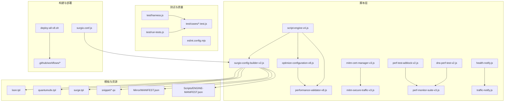

图表来源
- [Scripts/script-engine-v4.js](file://Scripts/script-engine-v4.js)
- [Scripts/optimize-configuration-v8.js](file://Scripts/optimize-configuration-v8.js)
- [Scripts/performance-validator-v8.js](file://Scripts/performance-validator-v8.js)
- [Scripts/mitm-cert-manager-v3.js](file://Scripts/mitm-cert-manager-v3.js)
- [Scripts/mitm-secure-traffic-v3.js](file://Scripts/mitm-secure-traffic-v3.js)
- [Scripts/dns-perf-test-v2.js](file://Scripts/dns-perf-test-v2.js)
- [Scripts/perf-monitor-suite-v3.js](file://Scripts/perf-monitor-suite-v3.js)
- [Scripts/perf-test-adblock-v2.js](file://Scripts/perf-test-adblock-v2.js)
- [Scripts/surgio-config-builder-v2.js](file://Scripts/surgio-config-builder-v2.js)
- [template/loon.tpl](file://template/loon.tpl)
- [template/quantumultx.tpl](file://template/quantumultx.tpl)
- [template/surge.tpl](file://template/surge.tpl)
- [template/snippet/ai-services.qx](file://template/snippet/ai-services.qx)
- [template/snippet/bank-ad-reject.qx](file://template/snippet/bank-ad-reject.qx)
- [template/snippet/developer.qx](file://template/snippet/developer.qx)
- [template/snippet/social.qx](file://template/snippet/social.qx)
- [template/snippet/streaming.qx](file://template/snippet/streaming.qx)
- [Mirror/MANIFEST.json](file://Mirror/MANIFEST.json)
- [Scripts/ENGINE-MANIFEST.json](file://Scripts/ENGINE-MANIFEST.json)
- [test/harness.js](file://test/harness.js)
- [test/run-tests.js](file://test/run-tests.js)
- [eslint.config.mjs](file://eslint.config.mjs)
- [deploy-all-v8.sh](file://deploy-all-v8.sh)
- [surgio.conf.js](file://surgio.conf.js)

## 详细组件分析

### 脚本引擎与配置优化
- script-engine-v4.js：提供统一的脚本加载、参数解析、上下文注入与错误上报机制；作为其他脚本的运行基座。
- optimize-configuration-v8.js：负责读取模板与片段，进行变量替换、条件分支合并、冗余规则清理与输出规范化。
- performance-validator-v8.js：在构建阶段对生成的配置进行静态校验与性能预估，返回可观测指标。

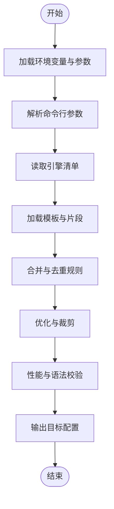

图表来源
- [Scripts/script-engine-v4.js](file://Scripts/script-engine-v4.js)
- [Scripts/optimize-configuration-v8.js](file://Scripts/optimize-configuration-v8.js)
- [Scripts/performance-validator-v8.js](file://Scripts/performance-validator-v8.js)
- [Scripts/ENGINE-MANIFEST.json](file://Scripts/ENGINE-MANIFEST.json)

章节来源
- [Scripts/script-engine-v4.js](file://Scripts/script-engine-v4.js)
- [Scripts/optimize-configuration-v8.js](file://Scripts/optimize-configuration-v8.js)
- [Scripts/performance-validator-v8.js](file://Scripts/performance-validator-v8.js)
- [Scripts/ENGINE-MANIFEST.json](file://Scripts/ENGINE-MANIFEST.json)

### 证书与安全流量
- mitm-cert-manager-v3.js：检测系统证书状态，自动下载、安装与更新中间人证书，确保 HTTPS 解密可用。
- mitm-secure-traffic-v3.js：在证书就绪后建立安全隧道，处理 TLS 握手与流量转发，保证通信安全。

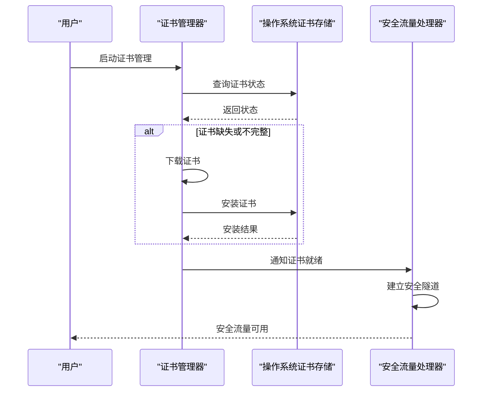

图表来源
- [Scripts/mitm-cert-manager-v3.js](file://Scripts/mitm-cert-manager-v3.js)
- [Scripts/mitm-secure-traffic-v3.js](file://Scripts/mitm-secure-traffic-v3.js)

章节来源
- [Scripts/mitm-cert-manager-v3.js](file://Scripts/mitm-cert-manager-v3.js)
- [Scripts/mitm-secure-traffic-v3.js](file://Scripts/mitm-secure-traffic-v3.js)

### 性能测试与监控
- dns-perf-test-v2.js：针对 DNS 解析延迟、成功率与稳定性进行基准测试。
- perf-monitor-suite-v3.js：聚合多项性能指标，输出报告并支持持续集成。
- perf-test-adblock-v2.js：评估广告拦截规则对性能的影响，辅助规则优化。

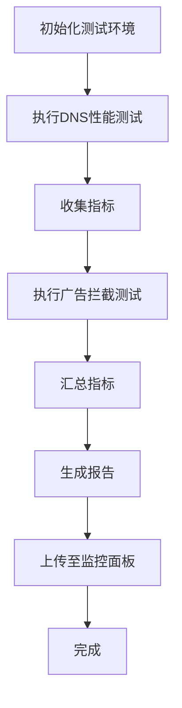

图表来源
- [Scripts/dns-perf-test-v2.js](file://Scripts/dns-perf-test-v2.js)
- [Scripts/perf-monitor-suite-v3.js](file://Scripts/perf-monitor-suite-v3.js)
- [Scripts/perf-test-adblock-v2.js](file://Scripts/perf-test-adblock-v2.js)

章节来源
- [Scripts/dns-perf-test-v2.js](file://Scripts/dns-perf-test-v2.js)
- [Scripts/perf-monitor-suite-v3.js](file://Scripts/perf-monitor-suite-v3.js)
- [Scripts/perf-test-adblock-v2.js](file://Scripts/perf-test-adblock-v2.js)

### 配置构建与模板渲染
- surgio-config-builder-v2.js：基于 surgio.conf.js 与模板，生成 Loon、Quantumult X、Surge 等多平台配置。
- template/*：包含基础模板与领域片段（如 AI、银行广告拒绝、开发者、社交、流媒体），支持组合拼装。

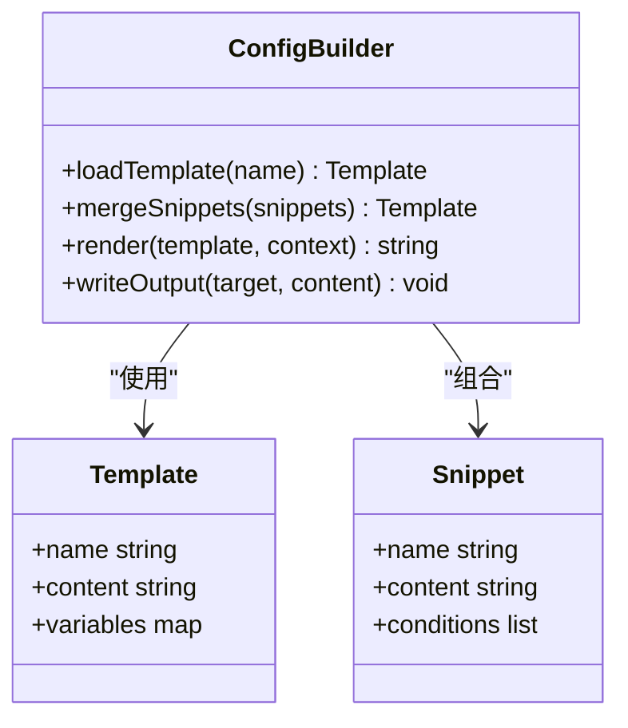

图表来源
- [Scripts/surgio-config-builder-v2.js](file://Scripts/surgio-config-builder-v2.js)
- [template/loon.tpl](file://template/loon.tpl)
- [template/quantumultx.tpl](file://template/quantumultx.tpl)
- [template/surge.tpl](file://template/surge.tpl)
- [template/snippet/ai-services.qx](file://template/snippet/ai-services.qx)
- [template/snippet/bank-ad-reject.qx](file://template/snippet/bank-ad-reject.qx)
- [template/snippet/developer.qx](file://template/snippet/developer.qx)
- [template/snippet/social.qx](file://template/snippet/social.qx)
- [template/snippet/streaming.qx](file://template/snippet/streaming.qx)

章节来源
- [Scripts/surgio-config-builder-v2.js](file://Scripts/surgio-config-builder-v2.js)
- [template/loon.tpl](file://template/loon.tpl)
- [template/quantumultx.tpl](file://template/quantumultx.tpl)
- [template/surge.tpl](file://template/surge.tpl)
- [template/snippet/ai-services.qx](file://template/snippet/ai-services.qx)
- [template/snippet/bank-ad-reject.qx](file://template/snippet/bank-ad-reject.qx)
- [template/snippet/developer.qx](file://template/snippet/developer.qx)
- [template/snippet/social.qx](file://template/snippet/social.qx)
- [template/snippet/streaming.qx](file://template/snippet/streaming.qx)

### 健康检查与通知
- health-notify.js：定期探测服务健康状态，异常时触发通知。
- traffic-notify.js：统计流量使用情况，达到阈值时发送提醒。

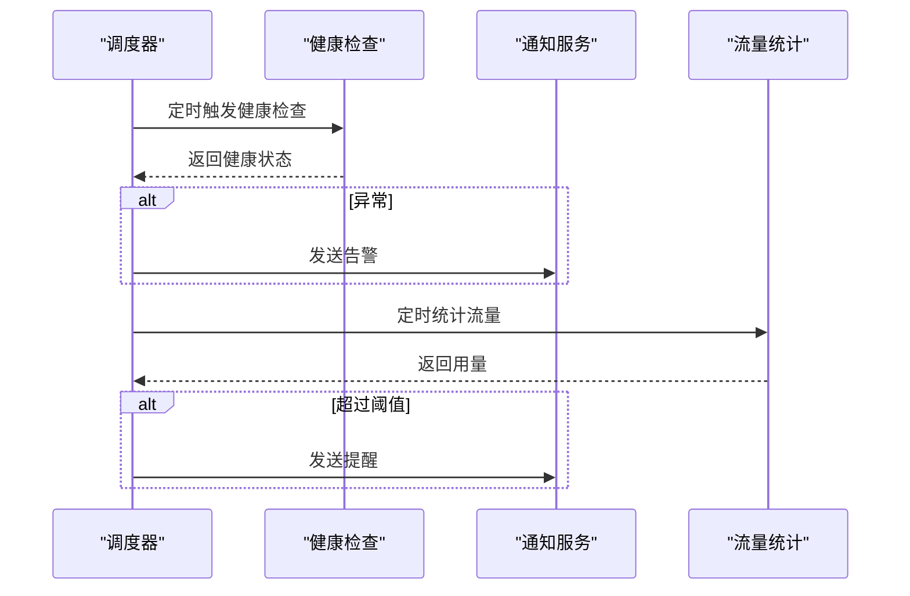

图表来源
- [Scripts/health-notify.js](file://Scripts/health-notify.js)
- [Scripts/traffic-notify.js](file://Scripts/traffic-notify.js)

章节来源
- [Scripts/health-notify.js](file://Scripts/health-notify.js)
- [Scripts/traffic-notify.js](file://Scripts/traffic-notify.js)

### 测试框架与用例
- test/harness.js：测试夹具与断言封装
- test/run-tests.js：测试运行器，支持并行与报告输出
- test/cases/*.test.js：具体业务用例，覆盖脚本净化、包装器、跨应用联动等场景

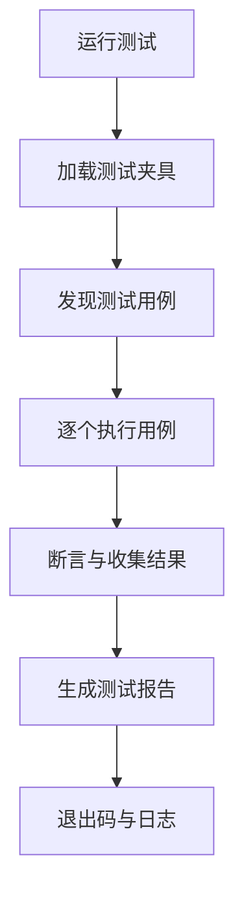

图表来源
- [test/harness.js](file://test/harness.js)
- [test/run-tests.js](file://test/run-tests.js)
- [test/cases/purify-scripts.test.js](file://test/cases/purify-scripts.test.js)
- [test/cases/qidian-wrapper.test.js](file://test/cases/qidian-wrapper.test.js)
- [test/cases/zhihu-cainiao.test.js](file://test/cases/zhihu-cainiao.test.js)
- [test/cases/zhihuifangdong.test.js](file://test/cases/zhihuifangdong.test.js)

章节来源
- [test/harness.js](file://test/harness.js)
- [test/run-tests.js](file://test/run-tests.js)
- [test/cases/purify-scripts.test.js](file://test/cases/purify-scripts.test.js)
- [test/cases/qidian-wrapper.test.js](file://test/cases/qidian-wrapper.test.js)
- [test/cases/zhihu-cainiao.test.js](file://test/cases/zhihu-cainiao.test.js)
- [test/cases/zhihuifangdong.test.js](file://test/cases/zhihuifangdong.test.js)

### 镜像清单与资源解析
- Mirror/MANIFEST.json：定义镜像版本、哈希与依赖关系
- Scripts/ENGINE-MANIFEST.json：定义脚本引擎版本、兼容性与加载顺序

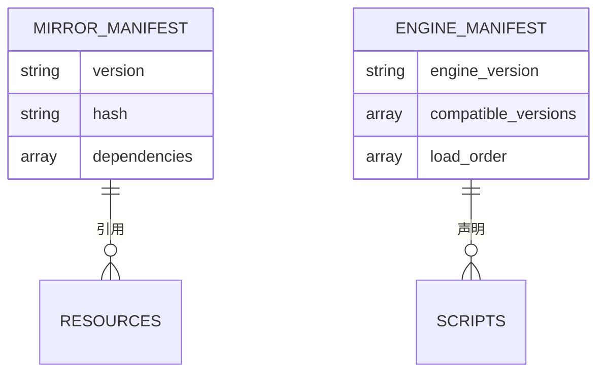

图表来源
- [Mirror/MANIFEST.json](file://Mirror/MANIFEST.json)
- [Scripts/ENGINE-MANIFEST.json](file://Scripts/ENGINE-MANIFEST.json)

章节来源
- [Mirror/MANIFEST.json](file://Mirror/MANIFEST.json)
- [Scripts/ENGINE-MANIFEST.json](file://Scripts/ENGINE-MANIFEST.json)

### 清理与维护脚本
- Scripts/cleanup.sh：常规清理临时文件与缓存
- Scripts/complete-cleanup.sh：深度清理，包括构建产物与历史日志
- Scripts/update-readme.sh：根据变更自动生成 README 内容

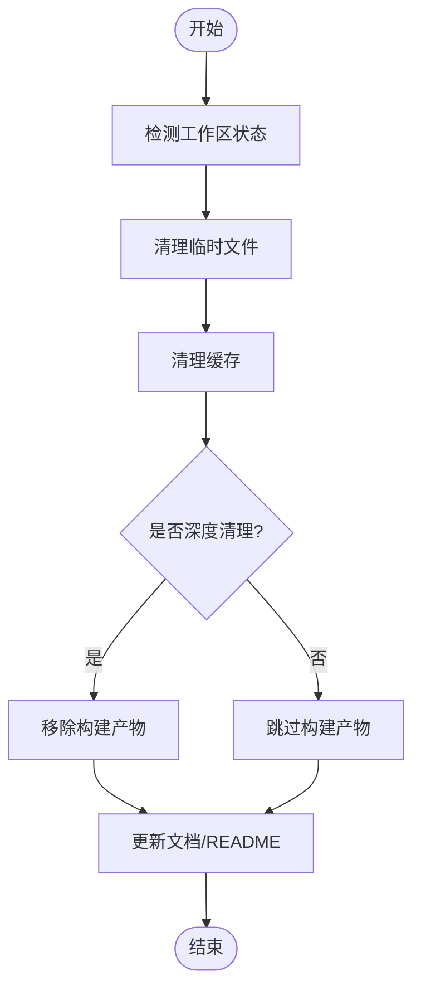

图表来源
- [Scripts/cleanup.sh](file://Scripts/cleanup.sh)
- [Scripts/complete-cleanup.sh](file://Scripts/complete-cleanup.sh)
- [Scripts/update-readme.sh](file://Scripts/update-readme.sh)

章节来源
- [Scripts/cleanup.sh](file://Scripts/cleanup.sh)
- [Scripts/complete-cleanup.sh](file://Scripts/complete-cleanup.sh)
- [Scripts/update-readme.sh](file://Scripts/update-readme.sh)

### 实验与监控
- ad-filter-v8.7/experiments/model-quantization-int8.js：广告过滤模型的量化实验脚本
- ml-monitoring-v8.7/dashboard.js：机器学习监控面板的数据聚合与展示

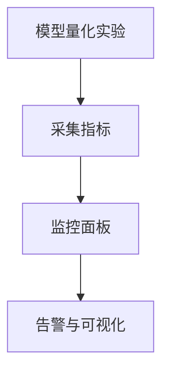

图表来源
- [ad-filter-v8.7/experiments/model-quantization-int8.js](file://ad-filter-v8.7/experiments/model-quantization-int8.js)
- [ml-monitoring-v8.7/dashboard.js](file://ml-monitoring-v8.7/dashboard.js)

章节来源
- [ad-filter-v8.7/experiments/model-quantization-int8.js](file://ad-filter-v8.7/experiments/model-quantization-int8.js)
- [ml-monitoring-v8.7/dashboard.js](file://ml-monitoring-v8.7/dashboard.js)

### 提供者与数据源
- provider/tokyo.js、provider/tokyo-enhanced.js：东京区域数据源提供者，增强版提供更丰富的字段与容错逻辑

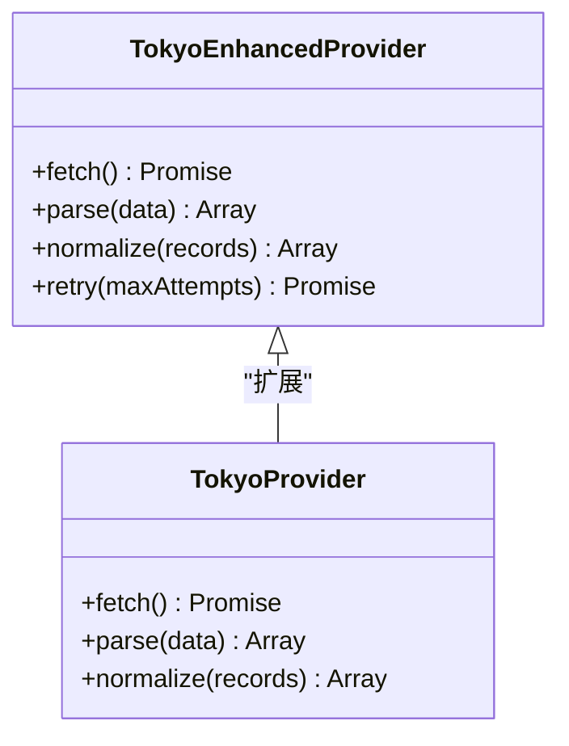

图表来源
- [provider/tokyo.js](file://provider/tokyo.js)
- [provider/tokyo-enhanced.js](file://provider/tokyo-enhanced.js)

章节来源
- [provider/tokyo.js](file://provider/tokyo.js)
- [provider/tokyo-enhanced.js](file://provider/tokyo-enhanced.js)

## 依赖关系分析
- 工程化依赖
  - package.json：定义脚本命令、依赖与开发工具链
  - eslint.config.mjs：代码风格与静态检查规则
  - surgio.conf.js：Surgio 构建配置，驱动模板渲染与输出
- 运行时依赖
  - Scripts/ENGINE-MANIFEST.json：脚本引擎版本与兼容性约束
  - Mirror/MANIFEST.json：镜像资源版本与依赖关系
- 构建与部署
  - deploy-all-v8.sh：一键部署脚本，串联构建、测试与发布
  - .github/workflows/*：CI/CD 流水线，涵盖验证、测试、构建与发布

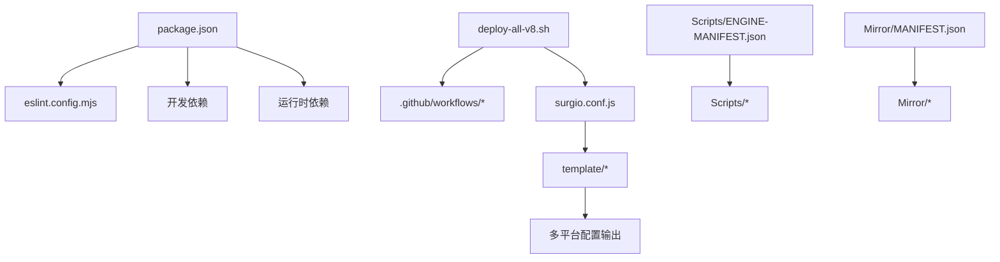

图表来源
- [package.json](file://package.json)
- [eslint.config.mjs](file://eslint.config.mjs)
- [surgio.conf.js](file://surgio.conf.js)
- [deploy-all-v8.sh](file://deploy-all-v8.sh)
- [Scripts/ENGINE-MANIFEST.json](file://Scripts/ENGINE-MANIFEST.json)
- [Mirror/MANIFEST.json](file://Mirror/MANIFEST.json)

章节来源
- [package.json](file://package.json)
- [eslint.config.mjs](file://eslint.config.mjs)
- [surgio.conf.js](file://surgio.conf.js)
- [deploy-all-v8.sh](file://deploy-all-v8.sh)
- [Scripts/ENGINE-MANIFEST.json](file://Scripts/ENGINE-MANIFEST.json)
- [Mirror/MANIFEST.json](file://Mirror/MANIFEST.json)

## 性能考量
- 构建阶段优化
  - 模板合并与去重减少冗余规则，降低配置体积
  - 静态校验提前发现潜在性能问题
- 运行时优化
  - 证书管理与安全流量建立避免重复握手
  - DNS 性能测试与监控帮助定位解析瓶颈
- 测试与回归
  - 性能基准与广告拦截测试确保规则变更不引入退化
  - 监控面板与告警提升问题发现效率

[本节为通用指导，无需特定文件来源]

## 故障排查指南
- 常见问题定位
  - 证书安装失败：检查系统权限与证书路径，确认证书管理器日志
  - 配置生成错误：核对模板变量与片段依赖，查看构建器输出
  - 性能退化：对比基准测试结果，定位新增规则或外部依赖影响
  - 通知未触发：检查通知服务配置与阈值设置
- 调试建议
  - 启用详细日志与断点
  - 使用测试运行器隔离问题用例
  - 逐步回滚变更并复现

章节来源
- [Scripts/mitm-cert-manager-v3.js](file://Scripts/mitm-cert-manager-v3.js)
- [Scripts/mitm-secure-traffic-v3.js](file://Scripts/mitm-secure-traffic-v3.js)
- [Scripts/surgio-config-builder-v2.js](file://Scripts/surgio-config-builder-v2.js)
- [Scripts/dns-perf-test-v2.js](file://Scripts/dns-perf-test-v2.js)
- [Scripts/perf-monitor-suite-v3.js](file://Scripts/perf-monitor-suite-v3.js)
- [Scripts/health-notify.js](file://Scripts/health-notify.js)
- [Scripts/traffic-notify.js](file://Scripts/traffic-notify.js)
- [test/run-tests.js](file://test/run-tests.js)

## 结论
该维护工具脚本体系以脚本引擎为核心，结合模板化配置、性能测试、证书管理与健康通知，形成完整的配置构建与运维闭环。通过工程化与 CI/CD 的支撑，能够在多平台环境下稳定高效地生成与发布配置，同时保持性能与安全性。

[本节为总结性内容，无需特定文件来源]

## 附录
- 快速上手
  - 安装依赖：参考 package.json 中的脚本命令
  - 本地构建：运行部署脚本以生成多平台配置
  - 运行测试：使用测试运行器执行用例并查看报告
- 扩展指南
  - 新增模板：在 template 目录下添加新模板与片段
  - 新增提供者：在 provider 目录下实现数据源接口
  - 新增监控：在 ml-monitoring 中扩展指标与面板

[本节为补充信息，无需特定文件来源]