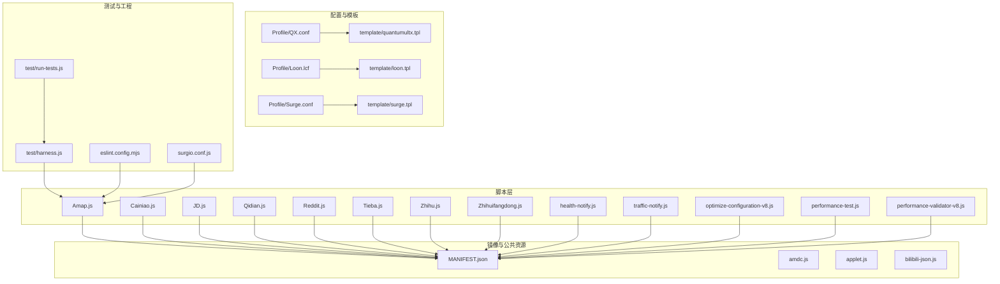
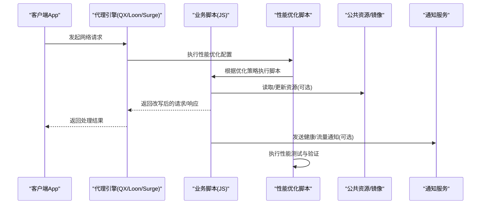
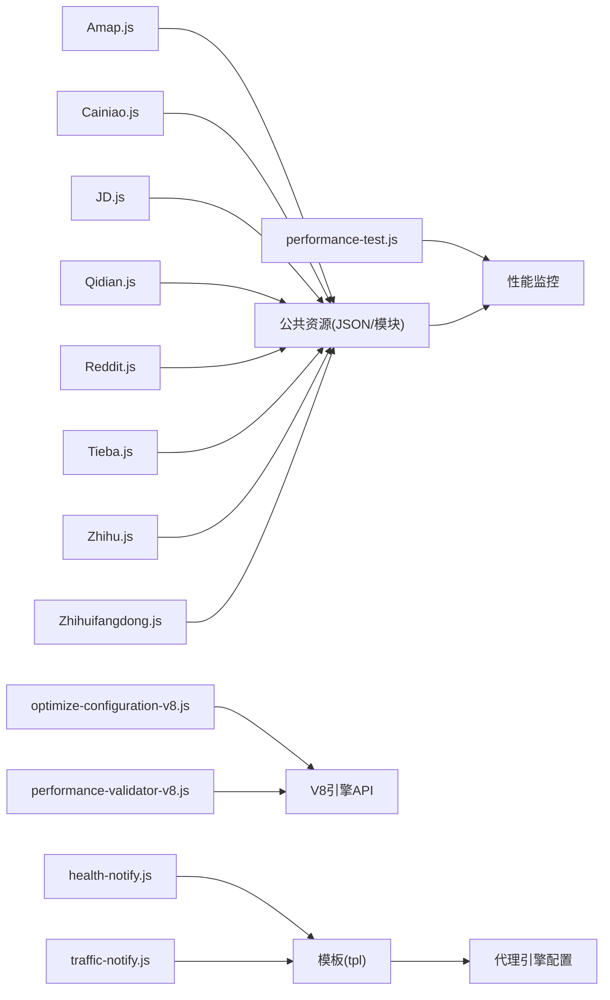

# 脚本库

<cite>
**本文引用的文件**   
- [README.md](file://README.md)
- [package.json](file://package.json)
- [surgio.conf.js](file://surgio.conf.js)
- [Scripts/ENGINE-MANIFEST.json](file://Scripts/ENGINE-MANIFEST.json)
- [Mirror/MANIFEST.json](file://Mirror/MANIFEST.json)
- [Scripts/Amap.js](file://Scripts/Amap.js)
- [Scripts/Cainiao.js](file://Scripts/Cainiao.js)
- [Scripts/JD.js](file://Scripts/JD.js)
- [Scripts/Qidian.js](file://Scripts/Qidian.js)
- [Scripts/Reddit.js](file://Scripts/Reddit.js)
- [Scripts/Tieba.js](file://Scripts/Tieba.js)
- [Scripts/Zhihu.js](file://Scripts/Zhihu.js)
- [Scripts/Zhihuifangdong.js](file://Scripts/Zhihuifangdong.js)
- [Scripts/health-notify.js](file://Scripts/health-notify.js)
- [Scripts/traffic-notify.js](file://Scripts/traffic-notify.js)
- [Scripts/optimize-configuration-v8.js](file://Scripts/optimize-configuration-v8.js)
- [Scripts/performance-test.js](file://Scripts/performance-test.js)
- [Scripts/performance-validator-v8.js](file://Scripts/performance-validator-v8.js)
- [test/harness.js](file://test/harness.js)
- [test/run-tests.js](file://test/run-tests.js)
- [test/cases/purify-scripts.test.js](file://test/cases/purify-scripts.test.js)
- [test/cases/qidian-wrapper.test.js](file://test/cases/qidian-wrapper.test.js)
- [test/cases/zhihu-cainiao.test.js](file://test/cases/zhihu-cainiao.test.js)
- [test/cases/zhihuifangdong.test.js](file://test/cases/zhihuifangdong.test.js)
- [eslint.config.mjs](file://eslint.config.mjs)
- [template/quantumultx.tpl](file://template/quantumultx.tpl)
- [template/loon.tpl](file://template/loon.tpl)
- [template/surge.tpl](file://template/surge.tpl)
</cite>

## 更新摘要
**所做更改**
- 新增三个核心性能优化脚本的详细说明
- 更新架构总览以包含新的性能测试和验证组件
- 增强性能考虑章节，涵盖V8引擎优化相关内容
- 扩展详细组件分析，包含新脚本的功能说明和使用方法

## 目录
1. [简介](#简介)
2. [项目结构](#项目结构)
3. [核心组件](#核心组件)
4. [架构总览](#架构总览)
5. [详细组件分析](#详细组件分析)
6. [依赖分析](#依赖分析)
7. [性能考虑](#性能考虑)
8. [故障排查指南](#故障排查指南)
9. [结论](#结论)
10. [附录](#附录)

## 简介
本仓库是一个面向网络增强与广告拦截的脚本库，围绕 Quantumult X、Loon、Surge 等代理工具提供 JavaScript 脚本与规则配置。脚本主要用于：
- 请求/响应改写、去广告、隐私保护
- 应用功能增强（如地图、音乐、社交、电商）
- 健康与流量通知、资源解析与检测
- **新增**：V8引擎配置优化、性能测试与验证、性能监控与分析

文档目标：
- 说明脚本架构设计、API 接口与调用模式
- 解释执行环境、安全限制与性能考量
- 给出常用脚本的功能说明与使用示例
- 提供开发指南、最佳实践、通信机制与数据共享方式
- 包含测试与调试方法

## 项目结构
仓库采用按"引擎/平台"和"功能域"组织的方式：
- Scripts：各业务脚本（JS），由不同代理引擎加载执行
- Mirror：镜像与通用资源（含清单与公共 JS）
- Plugin：插件式配置（针对特定 App）
- Profile：代理配置文件（QX/Loon/Surge）
- template：模板（用于生成不同引擎的配置片段）
- test：测试用例与运行器
- doc：工程与审计文档
- surgio.conf.js：构建与分发配置

图表来源
- [Scripts/ENGINE-MANIFEST.json](file://Scripts/ENGINE-MANIFEST.json)
- [Mirror/MANIFEST.json](file://Mirror/MANIFEST.json)
- [template/quantumultx.tpl](file://template/quantumultx.tpl)
- [template/loon.tpl](file://template/loon.tpl)
- [template/surge.tpl](file://template/surge.tpl)
- [test/harness.js](file://test/harness.js)
- [test/run-tests.js](file://test/run-tests.js)
- [eslint.config.mjs](file://eslint.config.mjs)
- [surgio.conf.js](file://surgio.conf.js)

章节来源
- [README.md](file://README.md)
- [package.json](file://package.json)
- [surgio.conf.js](file://surgio.conf.js)

## 核心组件
- 脚本清单与元数据
  - Scripts/ENGINE-MANIFEST.json：定义脚本在代理引擎中的元数据、匹配规则与加载顺序
  - Mirror/MANIFEST.json：镜像资源清单，供脚本按需拉取或本地缓存
- 业务脚本
  - Amap.js、Cainiao.js、JD.js、Qidian.js、Reddit.js、Tieba.js、Zhihu.js、Zhihuifangdong.js：各应用增强与去广告逻辑
  - health-notify.js、traffic-notify.js：健康检查与流量统计通知
  - **新增** optimize-configuration-v8.js：V8引擎配置优化脚本
  - **新增** performance-test.js：性能测试框架与基准测试
  - **新增** performance-validator-v8.js：V8引擎性能验证器
- 公共资源
  - amdc.js、applet.js、bilibili-json.js：通用模块与数据解析工具
- 模板与配置
  - template/*.tpl：为 QX/Loon/Surge 生成配置片段
  - Profile/*.conf/.lcf：最终注入到代理客户端的规则与脚本引用
- 测试与工程化
  - test/*：单元测试与集成测试
  - eslint.config.mjs：代码规范
  - surgio.conf.js：构建与发布流程

章节来源
- [Scripts/ENGINE-MANIFEST.json](file://Scripts/ENGINE-MANIFEST.json)
- [Mirror/MANIFEST.json](file://Mirror/MANIFEST.json)
- [Scripts/Amap.js](file://Scripts/Amap.js)
- [Scripts/Cainiao.js](file://Scripts/Cainiao.js)
- [Scripts/JD.js](file://Scripts/JD.js)
- [Scripts/Qidian.js](file://Scripts/Qidian.js)
- [Scripts/Reddit.js](file://Scripts/Reddit.js)
- [Scripts/Tieba.js](file://Scripts/Tieba.js)
- [Scripts/Zhihu.js](file://Scripts/Zhihu.js)
- [Scripts/Zhihuifangdong.js](file://Scripts/Zhihuifangdong.js)
- [Scripts/health-notify.js](file://Scripts/health-notify.js)
- [Scripts/traffic-notify.js](file://Scripts/traffic-notify.js)
- [Scripts/optimize-configuration-v8.js](file://Scripts/optimize-configuration-v8.js)
- [Scripts/performance-test.js](file://Scripts/performance-test.js)
- [Scripts/performance-validator-v8.js](file://Scripts/performance-validator-v8.js)
- [Mirror/amdc.js](file://Mirror/amdc.js)
- [Mirror/applet.js](file://Mirror/applet.js)
- [Mirror/bilibili-json.js](file://Mirror/bilibili-json.js)
- [template/quantumultx.tpl](file://template/quantumultx.tpl)
- [template/loon.tpl](file://template/loon.tpl)
- [template/surge.tpl](file://template/surge.tpl)
- [test/harness.js](file://test/harness.js)
- [test/run-tests.js](file://test/run-tests.js)
- [eslint.config.mjs](file://eslint.config.mjs)
- [surgio.conf.js](file://surgio.conf.js)

## 架构总览
整体架构遵循"代理引擎 + 脚本 + 规则"的分层模型，现已增强性能优化能力：
- 代理引擎（Quantumult X / Loon / Surge）负责网络请求拦截与脚本调度
- 脚本层实现具体业务逻辑（请求/响应改写、数据解析、通知）
- 规则层通过模板与清单驱动脚本加载与匹配
- 公共资源层提供通用能力（如 JSON 解析、小程序适配）
- **新增** 性能优化层：V8引擎配置优化、性能测试与验证

图表来源
- [template/quantumultx.tpl](file://template/quantumultx.tpl)
- [template/loon.tpl](file://template/loon.tpl)
- [template/surge.tpl](file://template/surge.tpl)
- [Scripts/ENGINE-MANIFEST.json](file://Scripts/ENGINE-MANIFEST.json)
- [Mirror/MANIFEST.json](file://Mirror/MANIFEST.json)
- [Scripts/optimize-configuration-v8.js](file://Scripts/optimize-configuration-v8.js)
- [Scripts/performance-test.js](file://Scripts/performance-test.js)
- [Scripts/performance-validator-v8.js](file://Scripts/performance-validator-v8.js)

## 详细组件分析

### 脚本清单与元数据（ENGINE-MANIFEST.json）
- 作用：集中声明脚本名称、版本、描述、匹配域名/路径、执行时机与参数
- 关键点：
  - 每个脚本条目需包含唯一标识与版本，便于升级与回滚
  - 匹配规则决定脚本何时被触发，避免误伤无关请求
  - 执行时机（请求前/响应后）影响可改写的字段范围
- 建议：
  - 保持最小匹配集合，减少不必要的脚本执行
  - 对敏感操作增加白名单校验

章节来源
- [Scripts/ENGINE-MANIFEST.json](file://Scripts/ENGINE-MANIFEST.json)

### 镜像清单（MANIFEST.json）
- 作用：维护静态资源与远程资源的索引，支持按需加载与缓存策略
- 关键点：
  - 资源哈希校验保证完整性
  - 版本号控制与增量更新
- 建议：
  - 大资源分片加载，降低首屏延迟
  - 失败重试与降级策略

章节来源
- [Mirror/MANIFEST.json](file://Mirror/MANIFEST.json)

### 业务脚本（以 Amap.js、Cainiao.js、JD.js、Qidian.js、Reddit.js、Tieba.js、Zhihu.js、Zhihuifangdong.js 为例）
- 共同职责：
  - 解析请求/响应体，识别广告或无用数据
  - 替换或过滤内容，提升用户体验
  - 与公共资源交互，获取最新规则或字典
- 差异点：
  - 不同应用的 API 结构与数据格式各异
  - 部分脚本需要鉴权或会话上下文
- 建议：
  - 统一错误码与日志格式
  - 对第三方接口做超时与重试保护

章节来源
- [Scripts/Amap.js](file://Scripts/Amap.js)
- [Scripts/Cainiao.js](file://Scripts/Cainiao.js)
- [Scripts/JD.js](file://Scripts/JD.js)
- [Scripts/Qidian.js](file://Scripts/Qidian.js)
- [Scripts/Reddit.js](file://Scripts/Reddit.js)
- [Scripts/Tieba.js](file://Scripts/Tieba.js)
- [Scripts/Zhihu.js](file://Scripts/Zhihu.js)
- [Scripts/Zhihuifangdong.js](file://Scripts/Zhihuifangdong.js)

### 通知脚本（health-notify.js、traffic-notify.js）
- 作用：
  - health-notify.js：周期性健康检查，异常时推送通知
  - traffic-notify.js：统计流量消耗，阈值告警
- 关键点：
  - 定时任务与节流策略
  - 通知渠道（系统通知/第三方服务）
- 建议：
  - 限频与退避，避免频繁打扰
  - 失败重试与离线队列

章节来源
- [Scripts/health-notify.js](file://Scripts/health-notify.js)
- [Scripts/traffic-notify.js](file://Scripts/traffic-notify.js)

### V8引擎优化脚本（optimize-configuration-v8.js）
- 作用：针对V8引擎进行配置优化，提升脚本执行性能
- 核心功能：
  - V8引擎参数调优
  - 内存管理优化
  - JIT编译配置
  - 垃圾回收策略调整
- 使用场景：
  - 高性能要求的网络请求处理
  - 大量数据处理场景
  - 长时间运行的代理服务
- 配置选项：
  - 内存上限设置
  - 线程池大小
  - 编译优化级别

章节来源
- [Scripts/optimize-configuration-v8.js](file://Scripts/optimize-configuration-v8.js)

### 性能测试框架（performance-test.js）
- 作用：提供完整的性能测试框架，支持基准测试和压力测试
- 核心功能：
  - 基准测试套件
  - 性能指标收集
  - 测试结果对比
  - 自动化测试流程
- 测试类型：
  - CPU使用率测试
  - 内存占用测试
  - 网络请求性能测试
  - 并发处理能力测试
- 输出报告：
  - 性能指标汇总
  - 趋势分析报告
  - 回归测试对比

章节来源
- [Scripts/performance-test.js](file://Scripts/performance-test.js)

### V8性能验证器（performance-validator-v8.js）
- 作用：专门针对V8引擎的性能验证和监控
- 核心功能：
  - V8引擎状态监控
  - 性能瓶颈识别
  - 内存泄漏检测
  - 执行效率分析
- 验证指标：
  - 脚本启动时间
  - 内存峰值使用
  - GC频率和耗时
  - JIT编译效率
- 告警机制：
  - 性能阈值监控
  - 异常行为检测
  - 自动恢复策略

章节来源
- [Scripts/performance-validator-v8.js](file://Scripts/performance-validator-v8.js)

### 公共资源（amdc.js、applet.js、bilibili-json.js）
- amdc.js：模块化加载与依赖管理
- applet.js：小程序环境适配与兼容
- bilibili-json.js：B站相关 JSON 数据结构解析工具
- 建议：
  - 保持向后兼容，避免破坏性变更
  - 提供类型提示与校验函数

章节来源
- [Mirror/amdc.js](file://Mirror/amdc.js)
- [Mirror/applet.js](file://Mirror/applet.js)
- [Mirror/bilibili-json.js](file://Mirror/bilibili-json.js)

### 模板与配置（template/*.tpl）
- 作用：将脚本与规则注入到不同代理引擎的配置中
- 关键点：
  - 变量替换与条件编译
  - 多引擎差异化处理
- 建议：
  - 模板与脚本解耦，便于独立迭代
  - 提供语法检查与预览

章节来源
- [template/quantumultx.tpl](file://template/quantumultx.tpl)
- [template/loon.tpl](file://template/loon.tpl)
- [template/surge.tpl](file://template/surge.tpl)

### 测试框架（test/*）
- harness.js：测试夹具与断言封装
- run-tests.js：测试入口与并行执行
- cases/*：具体用例（如 qidian-wrapper.test.js、zhihu-cainiao.test.js）
- 建议：
  - 覆盖关键路径与边界条件
  - Mock 外部依赖，确保稳定性

章节来源
- [test/harness.js](file://test/harness.js)
- [test/run-tests.js](file://test/run-tests.js)
- [test/cases/purify-scripts.test.js](file://test/cases/purify-scripts.test.js)
- [test/cases/qidian-wrapper.test.js](file://test/cases/qidian-wrapper.test.js)
- [test/cases/zhihu-cainiao.test.js](file://test/cases/zhihu-cainiao.test.js)
- [test/cases/zhihuifangdong.test.js](file://test/cases/zhihuifangdong.test.js)

## 依赖分析
- 内部依赖
  - 脚本依赖公共资源（JSON 解析、模块加载）
  - 模板依赖脚本清单与规则
  - **新增** 性能优化脚本依赖V8引擎API
- 外部依赖
  - 代理引擎提供的运行时 API（请求拦截、响应改写、通知）
  - 第三方服务（镜像源、通知通道）
  - **新增** V8引擎特定API和性能监控接口
- 风险点
  - 循环依赖与版本冲突
  - 外部接口不稳定导致脚本失败
  - **新增** V8引擎兼容性问题和性能波动

图表来源
- [Scripts/Amap.js](file://Scripts/Amap.js)
- [Scripts/Cainiao.js](file://Scripts/Cainiao.js)
- [Scripts/JD.js](file://Scripts/JD.js)
- [Scripts/Qidian.js](file://Scripts/Qidian.js)
- [Scripts/Reddit.js](file://Scripts/Reddit.js)
- [Scripts/Tieba.js](file://Scripts/Tieba.js)
- [Scripts/Zhihu.js](file://Scripts/Zhihu.js)
- [Scripts/Zhihuifangdong.js](file://Scripts/Zhihuifangdong.js)
- [Scripts/health-notify.js](file://Scripts/health-notify.js)
- [Scripts/traffic-notify.js](file://Scripts/traffic-notify.js)
- [Scripts/optimize-configuration-v8.js](file://Scripts/optimize-configuration-v8.js)
- [Scripts/performance-test.js](file://Scripts/performance-test.js)
- [Scripts/performance-validator-v8.js](file://Scripts/performance-validator-v8.js)
- [template/quantumultx.tpl](file://template/quantumultx.tpl)
- [template/loon.tpl](file://template/loon.tpl)
- [template/surge.tpl](file://template/surge.tpl)

章节来源
- [surgio.conf.js](file://surgio.conf.js)
- [eslint.config.mjs](file://eslint.config.mjs)

## 性能考虑
- 脚本执行
  - 避免阻塞主线程，尽量异步处理
  - 减少正则与字符串操作开销
  - **新增** 利用V8引擎JIT编译优化
  - **新增** 合理使用内存分配和释放
- 网络请求
  - 合并请求、连接复用
  - 合理设置超时与重试次数
  - **新增** 请求优先级管理和负载均衡
- 内存管理
  - 及时释放临时对象与大数组
  - 避免全局状态泄漏
  - **新增** 监控内存使用峰值和GC频率
- 缓存策略
  - 热点数据本地缓存，设置过期时间
  - 资源增量更新，减少带宽占用
  - **新增** 多级缓存策略（内存/磁盘/网络）
- **新增** V8引擎优化
  - 配置合适的堆大小和线程数
  - 启用适当的编译优化级别
  - 监控JIT编译效率和热点函数
- **新增** 性能监控
  - 实时跟踪关键性能指标
  - 建立性能基线和回归检测
  - 自动化性能测试和报告生成

[本节为通用指导，不直接分析具体文件]

## 故障排查指南
- 常见问题
  - 脚本未触发：检查匹配规则与清单配置
  - 请求失败：确认网络可达性与鉴权信息
  - 通知未送达：检查通知权限与通道可用性
  - **新增** V8引擎问题：检查引擎配置和兼容性
  - **新增** 性能问题：分析性能监控数据和瓶颈点
- 调试方法
  - 启用代理引擎日志，定位脚本执行点
  - 使用测试用例模拟请求与响应
  - 逐步缩小问题范围，隔离外部依赖
  - **新增** 使用性能分析工具定位性能瓶颈
  - **新增** 启用V8引擎调试模式和性能追踪
- 恢复策略
  - 快速回滚到上一稳定版本
  - 关闭有问题的脚本，保障基础功能
  - **新增** 动态禁用性能优化脚本
  - **新增** 自动降级到保守配置模式

章节来源
- [test/harness.js](file://test/harness.js)
- [test/run-tests.js](file://test/run-tests.js)
- [eslint.config.mjs](file://eslint.config.mjs)

## 结论
本脚本库通过清晰的层次划分与模板化配置，实现了跨代理引擎的统一脚本管理与扩展。现已增强性能优化能力，包括V8引擎配置优化、性能测试框架和性能验证器。建议在后续迭代中：
- 完善脚本 API 文档与类型定义
- 强化测试覆盖率与自动化流水线
- 优化性能与错误恢复机制
- 建立社区贡献与审核流程
- **新增** 持续集成性能测试和监控
- **新增** 建立性能基准数据库和回归检测

[本节为总结性内容，不直接分析具体文件]

## 附录
- 常用脚本功能速览
  - Amap.js：地图相关请求优化与广告过滤
  - Cainiao.js：物流查询体验增强
  - JD.js：电商页面去广告与界面简化
  - Qidian.js：阅读类应用增强
  - Reddit.js：社交平台内容过滤
  - Tieba.js：贴吧去广告与体验优化
  - Zhihu.js：知乎去广告与界面定制
  - Zhihuifangdong.js：租房信息聚合与过滤
  - health-notify.js：健康检查与异常通知
  - traffic-notify.js：流量统计与阈值告警
  - **新增** optimize-configuration-v8.js：V8引擎配置优化
  - **新增** performance-test.js：性能测试框架
  - **新增** performance-validator-v8.js：V8性能验证器
- 开发最佳实践
  - 单一职责：每个脚本专注一个应用或功能
  - 防御性编程：输入校验、异常捕获、降级处理
  - 可观测性：结构化日志与指标上报
  - 安全性：最小权限原则，避免敏感信息泄露
  - **新增** 性能优先：编写高效的JavaScript代码
  - **新增** 监控先行：建立完善的性能监控体系
  - **新增** 渐进优化：基于数据驱动的持续优化

[本节为概念性内容，不直接分析具体文件]