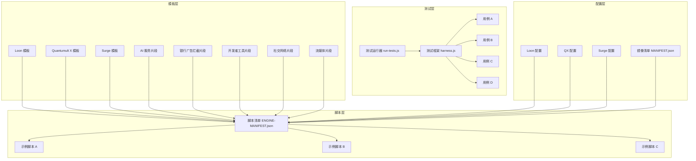
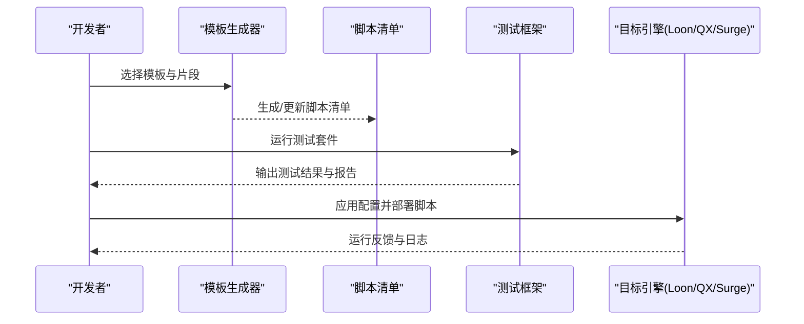
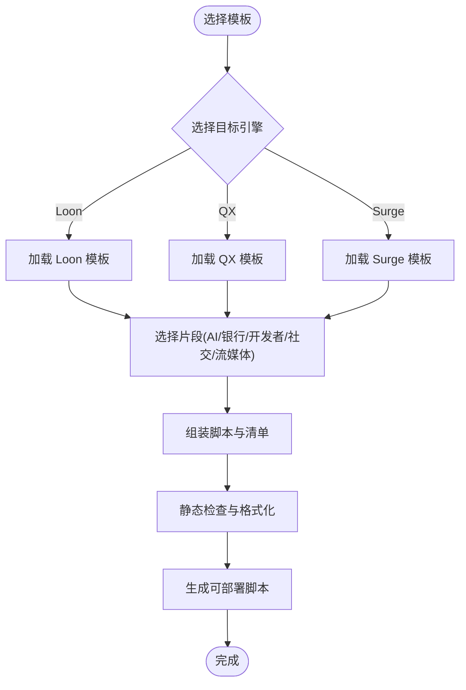
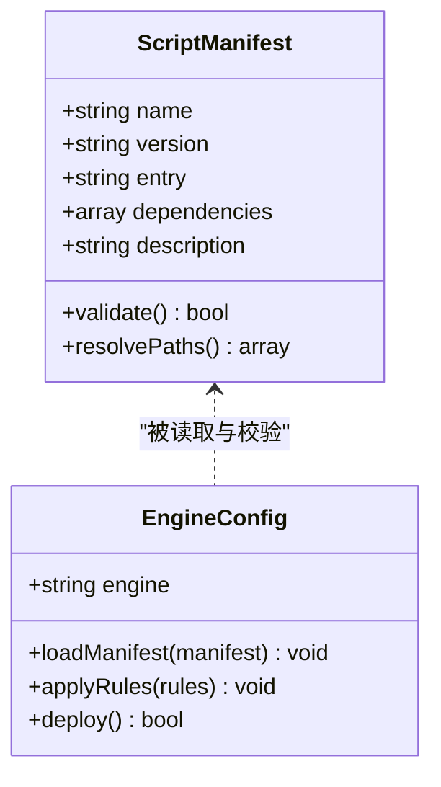
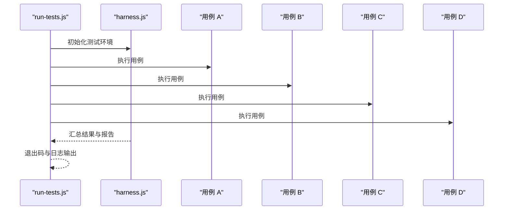
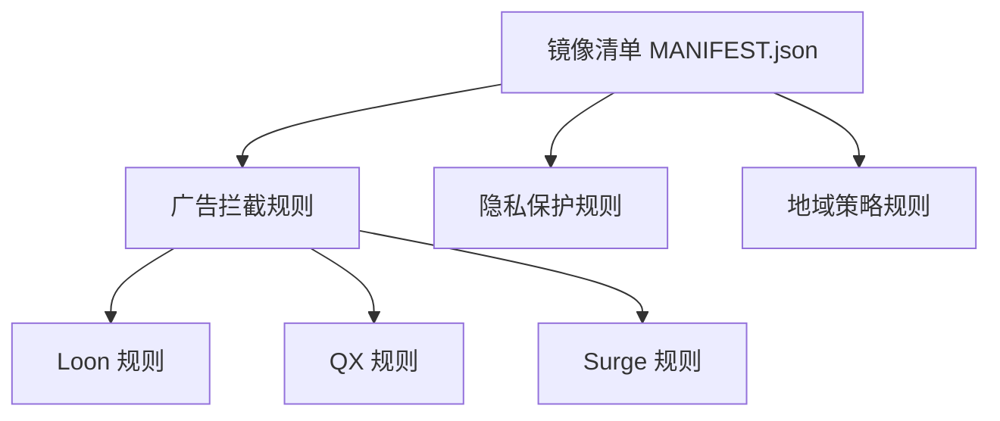
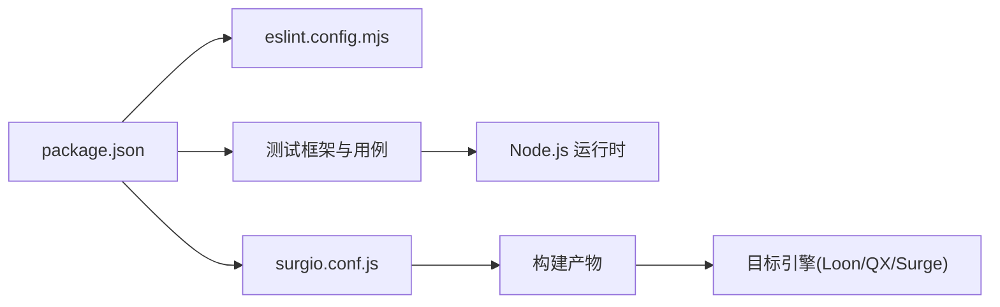

# 脚本开发指南

<cite>
**本文档引用的文件**   
- [README.md](file://README.md)
- [package.json](file://package.json)
- [eslint.config.mjs](file://eslint.config.mjs)
- [surgio.conf.js](file://surgio.conf.js)
- [template/loon.tpl](file://template/loon.tpl)
- [template/quantumultx.tpl](file://template/quantumultx.tpl)
- [template/surge.tpl](file://template/surge.tpl)
- [template/snippet/ai-services.tpl](file://template/snippet/ai-services.tpl)
- [template/snippet/bank-ad-reject.tpl](file://template/snippet/bank-ad-reject.tpl)
- [template/snippet/developer.tpl](file://template/snippet/developer.tpl)
- [template/snippet/social.tpl](file://template/snippet/social.tpl)
- [template/snippet/streaming.tpl](file://template/snippet/streaming.tpl)
- [Scripts/ENGINE-MANIFEST.json](file://Scripts/ENGINE-MANIFEST.json)
- [test/harness.js](file://test/harness.js)
- [test/run-tests.js](file://test/run-tests.js)
- [test/cases/purify-scripts.test.js](file://test/cases/purify-scripts.test.js)
- [test/cases/qidian-wrapper.test.js](file://test/cases/qidian-wrapper.test.js)
- [test/cases/zhihu-cainiao.test.js](file://test/cases/zhihu-cainiao.test.js)
- [test/cases/zhihuifangdong.test.js](file://test/cases/zhihuifangdong.test.js)
- [Mirror/MANIFEST.json](file://Mirror/MANIFEST.json)
- [Profile/Loon.lcf](file://Profile/Loon.lcf)
- [Profile/QX.conf](file://Profile/QX.conf)
- [Profile/Surge.conf](file://Profile/Surge.conf)
</cite>

## 目录
1. [简介](#简介)
2. [项目结构](#项目结构)
3. [核心组件](#核心组件)
4. [架构总览](#架构总览)
5. [详细组件分析](#详细组件分析)
6. [依赖分析](#依赖分析)
7. [性能考虑](#性能考虑)
8. [故障排查指南](#故障排查指南)
9. [结论](#结论)
10. [附录](#附录)

## 简介
本指南面向脚本开发者，提供从环境搭建、模板使用、API参考到测试与调试的完整流程说明。仓库包含多引擎（Loon、Quantumult X、Surge）的配置模板与脚本清单，以及面向AI服务、银行广告拦截、开发者工具、社交网络、流媒体等场景的脚本模板与示例。通过统一的工程化配置与测试框架，帮助开发者快速构建、验证和发布高质量脚本。

## 项目结构
仓库采用按功能域与目标引擎分层组织：
- template：各引擎与脚本片段模板
- Scripts：脚本清单与示例脚本
- test：测试框架与用例
- Profile：各引擎配置文件样例
- Mirror：镜像与规则集
- .github/workflows：CI/CD流水线
- 根级工程配置：package.json、eslint.config.mjs、surgio.conf.js

图表来源
- [template/loon.tpl](file://template/loon.tpl)
- [template/quantumultx.tpl](file://template/quantumultx.tpl)
- [template/surge.tpl](file://template/surge.tpl)
- [Scripts/ENGINE-MANIFEST.json](file://Scripts/ENGINE-MANIFEST.json)
- [test/harness.js](file://test/harness.js)
- [test/run-tests.js](file://test/run-tests.js)
- [Profile/Loon.lcf](file://Profile/Loon.lcf)
- [Profile/QX.conf](file://Profile/QX.conf)
- [Profile/Surge.conf](file://Profile/Surge.conf)
- [Mirror/MANIFEST.json](file://Mirror/MANIFEST.json)

章节来源
- [README.md](file://README.md)
- [package.json](file://package.json)

## 核心组件
- 模板系统：为不同引擎生成标准化脚本与规则，支持片段式组合（AI、银行广告拦截、开发者工具、社交、流媒体）。
- 脚本清单：集中管理脚本元数据、依赖与版本，便于批量校验与分发。
- 测试框架：基于Node.js的轻量测试运行器与断言封装，提供用例组织、并行执行与报告输出。
- 工程化配置：ESLint代码规范、Surgio构建配置、CI工作流集成。

章节来源
- [Scripts/ENGINE-MANIFEST.json](file://Scripts/ENGINE-MANIFEST.json)
- [test/harness.js](file://test/harness.js)
- [test/run-tests.js](file://test/run-tests.js)
- [eslint.config.mjs](file://eslint.config.mjs)
- [surgio.conf.js](file://surgio.conf.js)

## 架构总览
整体架构围绕“模板生成—脚本清单—测试验证—配置分发”闭环展开：
- 模板层定义结构与片段，供生成器组装成具体脚本。
- 脚本清单统一描述脚本能力、依赖与版本。
- 测试框架对脚本进行静态检查与运行时验证。
- 配置层将生成的脚本注入到各引擎配置中，完成部署。

图表来源
- [template/loon.tpl](file://template/loon.tpl)
- [template/quantumultx.tpl](file://template/quantumultx.tpl)
- [template/surge.tpl](file://template/surge.tpl)
- [Scripts/ENGINE-MANIFEST.json](file://Scripts/ENGINE-MANIFEST.json)
- [test/run-tests.js](file://test/run-tests.js)
- [Profile/Loon.lcf](file://Profile/Loon.lcf)
- [Profile/QX.conf](file://Profile/QX.conf)
- [Profile/Surge.conf](file://Profile/Surge.conf)

## 详细组件分析

### 模板系统
- Loon 模板：定义插件与脚本的组织方式、入口声明与依赖注入点。
- Quantumult X 模板：遵循QX脚本规范，包含请求拦截、响应处理与通知机制。
- Surge 模板：适配Surge的Lua/JS脚本接口与规则语法。
- 片段模板：
  - AI 服务：用于接入大模型或AI API的通用封装。
  - 银行广告拦截：针对银行类App的广告与追踪请求过滤。
  - 开发者工具：调试、日志、抓包辅助脚本。
  - 社交网络：社交平台去广告、增强体验。
  - 流媒体：视频/音乐平台去广告与优化。

图表来源
- [template/loon.tpl](file://template/loon.tpl)
- [template/quantumultx.tpl](file://template/quantumultx.tpl)
- [template/surge.tpl](file://template/surge.tpl)
- [template/snippet/ai-services.tpl](file://template/snippet/ai-services.tpl)
- [template/snippet/bank-ad-reject.tpl](file://template/snippet/bank-ad-reject.tpl)
- [template/snippet/developer.tpl](file://template/snippet/developer.tpl)
- [template/snippet/social.tpl](file://template/snippet/social.tpl)
- [template/snippet/streaming.tpl](file://template/snippet/streaming.tpl)

章节来源
- [template/loon.tpl](file://template/loon.tpl)
- [template/quantumultx.tpl](file://template/quantumultx.tpl)
- [template/surge.tpl](file://template/surge.tpl)
- [template/snippet/ai-services.tpl](file://template/snippet/ai-services.tpl)
- [template/snippet/bank-ad-reject.tpl](file://template/snippet/bank-ad-reject.tpl)
- [template/snippet/developer.tpl](file://template/snippet/developer.tpl)
- [template/snippet/social.tpl](file://template/snippet/social.tpl)
- [template/snippet/streaming.tpl](file://template/snippet/streaming.tpl)

### 脚本清单与引擎集成
- 脚本清单集中管理脚本名称、版本、依赖、入口与描述，便于批量校验与分发。
- 各引擎配置文件引用清单，确保脚本在目标环境中正确加载。

图表来源
- [Scripts/ENGINE-MANIFEST.json](file://Scripts/ENGINE-MANIFEST.json)
- [Profile/Loon.lcf](file://Profile/Loon.lcf)
- [Profile/QX.conf](file://Profile/QX.conf)
- [Profile/Surge.conf](file://Profile/Surge.conf)

章节来源
- [Scripts/ENGINE-MANIFEST.json](file://Scripts/ENGINE-MANIFEST.json)
- [Profile/Loon.lcf](file://Profile/Loon.lcf)
- [Profile/QX.conf](file://Profile/QX.conf)
- [Profile/Surge.conf](file://Profile/Surge.conf)

### 测试框架与用例
- 测试运行器：负责发现用例、设置上下文、收集结果与输出报告。
- 测试框架：提供断言、模拟网络请求、环境变量注入与异步处理。
- 用例组织：按功能域划分，覆盖脚本解析、包装器、跨脚本协作与特定业务逻辑。

图表来源
- [test/run-tests.js](file://test/run-tests.js)
- [test/harness.js](file://test/harness.js)
- [test/cases/purify-scripts.test.js](file://test/cases/purify-scripts.test.js)
- [test/cases/qidian-wrapper.test.js](file://test/cases/qidian-wrapper.test.js)
- [test/cases/zhihu-cainiao.test.js](file://test/cases/zhihu-cainiao.test.js)
- [test/cases/zhihuifangdong.test.js](file://test/cases/zhihuifangdong.test.js)

章节来源
- [test/run-tests.js](file://test/run-tests.js)
- [test/harness.js](file://test/harness.js)
- [test/cases/purify-scripts.test.js](file://test/cases/purify-scripts.test.js)
- [test/cases/qidian-wrapper.test.js](file://test/cases/qidian-wrapper.test.js)
- [test/cases/zhihu-cainiao.test.js](file://test/cases/zhihu-cainiao.test.js)
- [test/cases/zhihuifangdong.test.js](file://test/cases/zhihuifangdong.test.js)

### 镜像与规则集
- 镜像清单：统一管理镜像源、版本与校验信息，便于分发与回滚。
- 规则集：针对不同引擎的规则格式，提供广告拦截、隐私保护与地域策略。

图表来源
- [Mirror/MANIFEST.json](file://Mirror/MANIFEST.json)

章节来源
- [Mirror/MANIFEST.json](file://Mirror/MANIFEST.json)

## 依赖分析
- 工程依赖：Node.js生态下的测试与代码质量工具。
- 构建依赖：Surgio用于脚本构建与分发。
- 外部依赖：各引擎提供的脚本API与运行时环境。

图表来源
- [package.json](file://package.json)
- [eslint.config.mjs](file://eslint.config.mjs)
- [surgio.conf.js](file://surgio.conf.js)

章节来源
- [package.json](file://package.json)
- [eslint.config.mjs](file://eslint.config.mjs)
- [surgio.conf.js](file://surgio.conf.js)

## 性能考虑
- 模板复用：优先使用片段模板组合，减少重复代码与体积。
- 请求优化：合并请求、缓存热点数据、避免阻塞主线程。
- 资源控制：限制并发、合理超时、失败重试与降级策略。
- 日志与监控：仅在调试阶段开启详细日志，生产环境精简输出。

[本节为通用建议，不直接分析具体文件]

## 故障排查指南
- 模板生成失败：检查模板语法与片段依赖是否完整。
- 脚本清单错误：确认字段类型与必填项是否符合规范。
- 测试失败：查看用例断言与模拟环境是否正确配置。
- 引擎加载异常：核对配置文件路径与权限，确认引擎版本兼容性。

章节来源
- [test/harness.js](file://test/harness.js)
- [test/run-tests.js](file://test/run-tests.js)
- [Scripts/ENGINE-MANIFEST.json](file://Scripts/ENGINE-MANIFEST.json)

## 结论
本指南提供了从模板使用、脚本清单管理到测试与部署的全链路开发方法。通过统一的工程化配置与测试框架，开发者可以高效构建、验证并发布适用于多引擎的高质量脚本。建议在实际项目中结合CI/CD流水线，持续集成代码质量与自动化测试，保障脚本的稳定与安全。

## 附录
- 环境搭建
  - 安装Node.js与包管理器
  - 安装依赖与工具链（ESLint、Surgio）
  - 配置本地测试与构建命令
- API参考
  - 各引擎脚本API概览（请求拦截、响应处理、通知）
  - 模板变量与片段接口说明
- 最佳实践
  - 代码规范与命名约定
  - 安全考虑（输入校验、敏感信息保护）
  - 性能优化（缓存、并发、超时）

[本节为概念性内容，不直接分析具体文件]