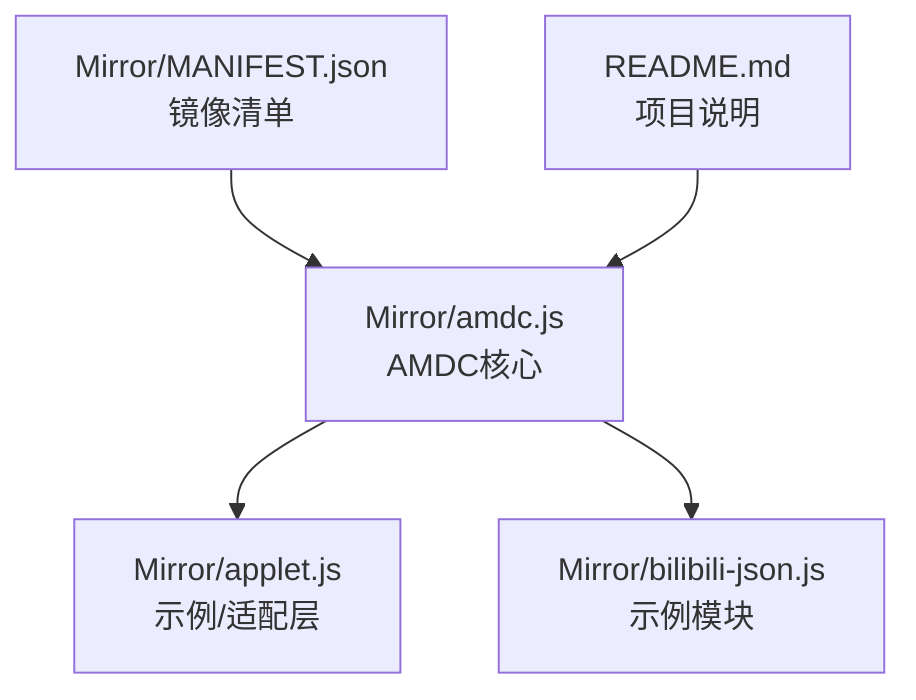
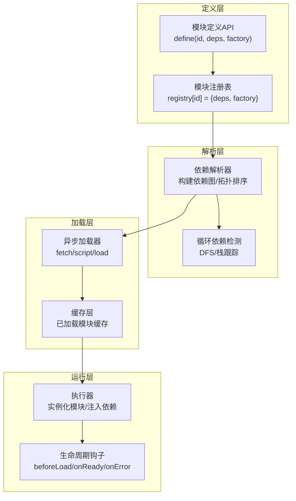
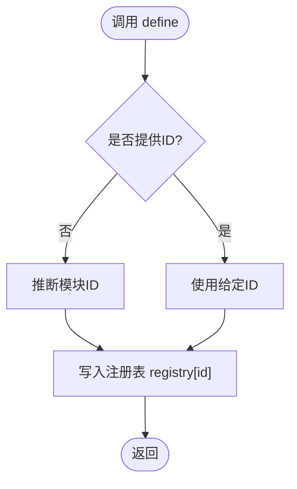
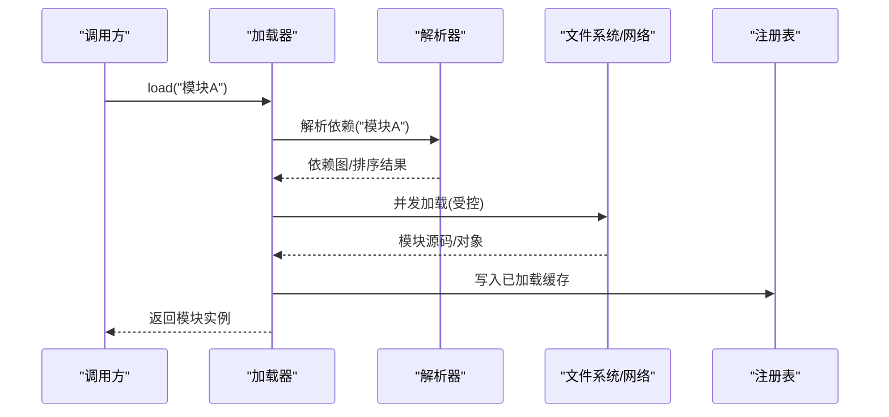
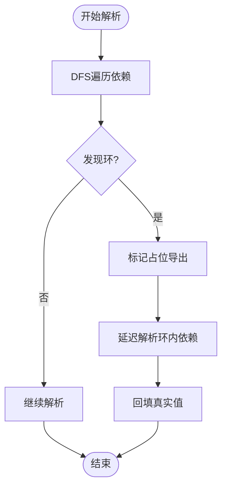
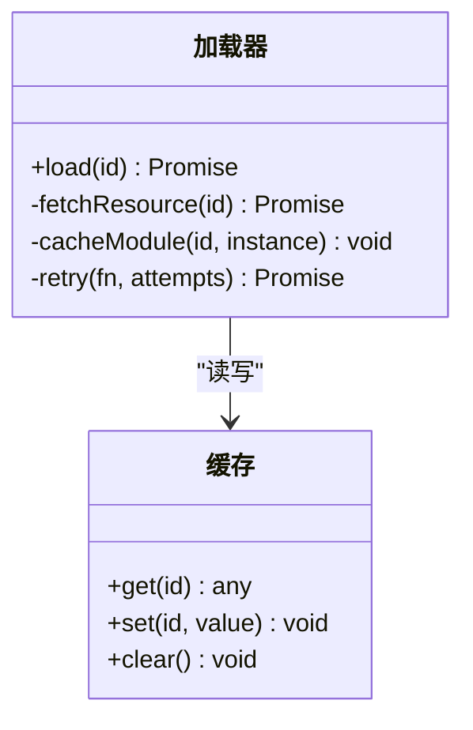
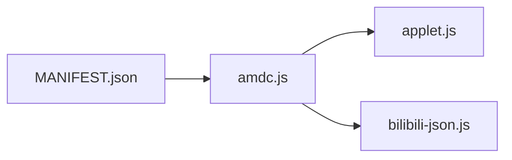

# AMDC模块加载器

<cite>
**本文引用的文件**   
- [amdc.js](file://Mirror/amdc.js)
- [applet.js](file://Mirror/applet.js)
- [bilibili-json.js](file://Mirror/bilibili-json.js)
- [MANIFEST.json](file://Mirror/MANIFEST.json)
- [README.md](file://README.md)
</cite>

## 目录
1. [简介](#简介)
2. [项目结构](#项目结构)
3. [核心组件](#核心组件)
4. [架构总览](#架构总览)
5. [详细组件分析](#详细组件分析)
6. [依赖分析](#依赖分析)
7. [性能考虑](#性能考虑)
8. [故障排查指南](#故障排查指南)
9. [结论](#结论)
10. [附录](#附录)

## 简介
本技术文档围绕AMDC（Async Module Definition Component）模块加载器，系统阐述其工作原理与实现机制，包括模块定义、依赖解析、异步加载、注册表管理、加载顺序控制以及循环依赖处理等高级特性。同时提供模块编写最佳实践与性能优化建议，并通过具体代码示例展示如何定义和使用自定义模块。

## 项目结构
仓库采用按功能域组织的方式，核心AMDC实现位于Mirror目录下，包含：
- amdc.js：AMDC模块加载器的核心实现
- applet.js：小程序/轻量应用适配层或示例模块
- bilibili-json.js：B站相关数据/模块示例
- MANIFEST.json：镜像清单，描述可用资源与版本信息

图表来源
- [amdc.js](file://Mirror/amdc.js)
- [applet.js](file://Mirror/applet.js)
- [bilibili-json.js](file://Mirror/bilibili-json.js)
- [MANIFEST.json](file://Mirror/MANIFEST.json)
- [README.md](file://README.md)

章节来源
- [README.md](file://README.md)
- [MANIFEST.json](file://Mirror/MANIFEST.json)

## 核心组件
- 模块定义与注册：通过统一接口声明模块ID、依赖列表与工厂函数，并写入全局模块注册表。
- 依赖解析：基于依赖图进行拓扑排序，确保正确的加载顺序。
- 异步加载：支持按需加载与并发控制，避免阻塞主线程。
- 循环依赖处理：检测环并给出降级策略（如延迟注入或占位导出）。
- 生命周期钩子：在模块加载前、后及错误时触发回调，便于监控与调试。

章节来源
- [amdc.js](file://Mirror/amdc.js)

## 架构总览
AMDC整体由“定义层—解析层—加载层—运行层”构成，配合清单与配置完成资源定位与版本管理。

图表来源
- [amdc.js](file://Mirror/amdc.js)

## 详细组件分析

### 模块定义与注册
- 模块定义API：接收模块ID、依赖数组与工厂函数；若未显式指定ID，则根据上下文推断。
- 注册表结构：以ID为键存储依赖与工厂，支持覆盖与版本选择。
- 批量注册：支持一次性注册多个模块，提升初始化效率。

图表来源
- [amdc.js](file://Mirror/amdc.js)

章节来源
- [amdc.js](file://Mirror/amdc.js)

### 依赖解析与加载顺序
- 依赖图构建：将每个模块的依赖展开为有向图，记录入度以便拓扑排序。
- 拓扑排序：保证无环情况下按依赖顺序加载；遇到环则进入循环依赖处理流程。
- 并发控制：限制并行加载数量，避免网络拥塞与内存峰值过高。

图表来源
- [amdc.js](file://Mirror/amdc.js)

章节来源
- [amdc.js](file://Mirror/amdc.js)

### 循环依赖处理
- 检测策略：深度优先搜索+路径栈，快速定位环。
- 降级策略：对环内模块提供占位导出，待所有模块加载完成后回填真实值。
- 诊断输出：打印环路径与受影响模块，便于开发者修复。

图表来源
- [amdc.js](file://Mirror/amdc.js)

章节来源
- [amdc.js](file://Mirror/amdc.js)

### 异步加载与缓存
- 加载方式：支持脚本注入、JSON获取、预编译模块等多种策略。
- 缓存策略：按ID缓存已加载模块，避免重复请求与执行。
- 错误重试：对失败请求进行有限次重试与退避。

图表来源
- [amdc.js](file://Mirror/amdc.js)

章节来源
- [amdc.js](file://Mirror/amdc.js)

### 示例模块与适配层
- applet.js：演示如何在轻量环境中使用AMDC加载模块，或作为适配层桥接宿主环境。
- bilibili-json.js：展示数据型模块的定义与消费方式，适合静态资源配置。

章节来源
- [applet.js](file://Mirror/applet.js)
- [bilibili-json.js](file://Mirror/bilibili-json.js)

## 依赖分析
- 直接依赖：AMDC核心依赖清单文件用于资源定位与版本校验。
- 间接依赖：示例模块依赖AMDC提供的define与load API。
- 外部集成：可与CDN、本地缓存或打包工具链集成，实现按需分发。

图表来源
- [MANIFEST.json](file://Mirror/MANIFEST.json)
- [amdc.js](file://Mirror/amdc.js)
- [applet.js](file://Mirror/applet.js)
- [bilibili-json.js](file://Mirror/bilibili-json.js)

章节来源
- [MANIFEST.json](file://Mirror/MANIFEST.json)
- [amdc.js](file://Mirror/amdc.js)

## 性能考虑
- 减少重复加载：充分利用缓存，避免重复下载与执行。
- 控制并发：合理设置并发上限，平衡速度与稳定性。
- 按需加载：仅加载当前页面所需模块，降低首屏开销。
- 体积优化：拆分大模块为小粒度单元，结合Tree-shaking与压缩。
- 预取与预热：对热点模块进行预取，缩短用户交互延迟。

[本节为通用指导，不直接分析具体文件]

## 故障排查指南
- 常见问题
  - 模块未找到：检查ID映射与清单配置是否正确。
  - 循环依赖报错：查看环路径，调整依赖方向或引入占位导出。
  - 加载超时：检查网络状况与重试策略。
- 诊断手段
  - 启用调试日志：输出依赖图、加载顺序与错误堆栈。
  - 断点与快照：在关键节点插入断点，观察状态变化。
  - 最小复现：剥离无关模块，聚焦问题根因。

章节来源
- [amdc.js](file://Mirror/amdc.js)

## 结论
AMDC模块加载器通过清晰的定义—解析—加载—运行分层，提供了稳定高效的模块化能力。其依赖解析、异步加载与循环依赖处理机制，能够满足复杂前端场景的需求。遵循本文的最佳实践与性能建议，可显著提升模块系统的可维护性与运行效率。

[本节为总结性内容，不直接分析具体文件]

## 附录

### 模块编写最佳实践
- 明确模块边界：单一职责，避免跨层耦合。
- 显式声明依赖：减少隐式依赖带来的不确定性。
- 避免深层嵌套：扁平化依赖结构，降低复杂度。
- 合理使用占位导出：在必须存在循环依赖时，先占位后回填。
- 提供默认值与容错：增强鲁棒性，避免崩溃。

[本节为通用指导，不直接分析具体文件]

### 性能优化建议
- 合并小模块：减少HTTP请求与解析开销。
- 懒加载非关键路径：优先保障核心功能。
- 利用浏览器缓存：合理设置缓存头与版本号。
- 监控与度量：采集加载耗时与失败率，持续优化。

[本节为通用指导，不直接分析具体文件]

### 代码示例指引
- 定义模块：参考模块定义API的使用位置与调用方式。
- 加载模块：参考加载入口与参数约定。
- 处理依赖：参考依赖数组与工厂函数的写法。
- 错误处理：参考异常捕获与重试逻辑。

章节来源
- [amdc.js](file://Mirror/amdc.js)
- [applet.js](file://Mirror/applet.js)
- [bilibili-json.js](file://Mirror/bilibili-json.js)