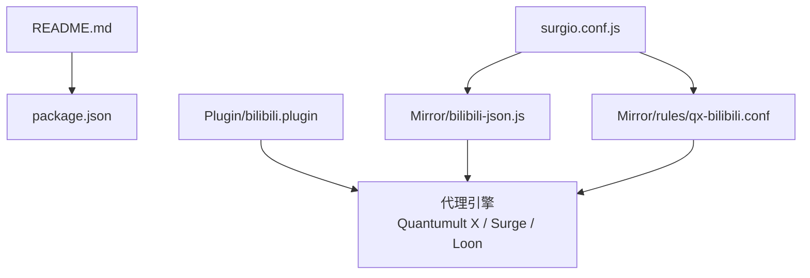
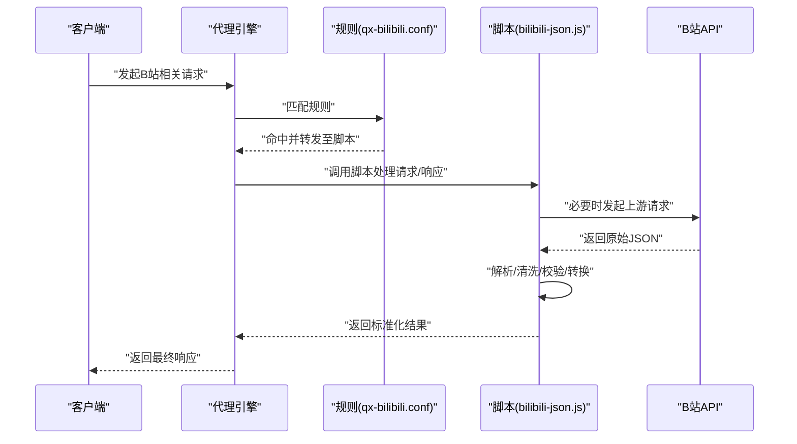
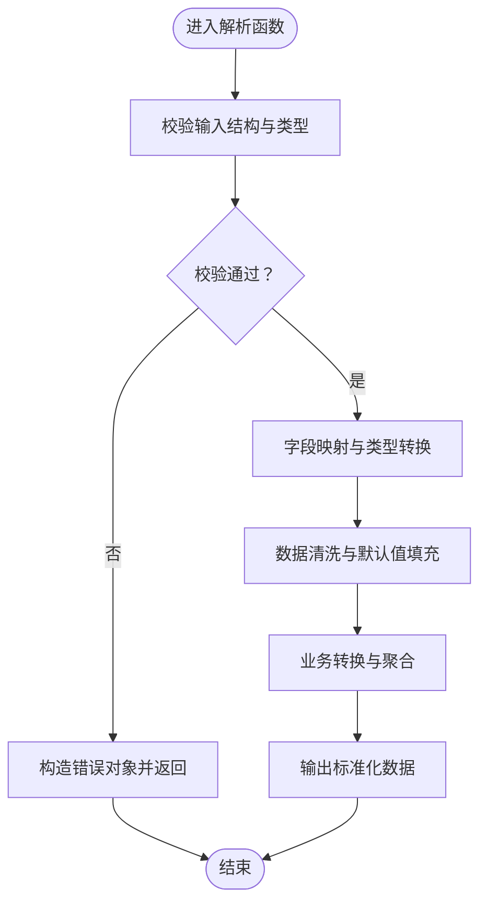
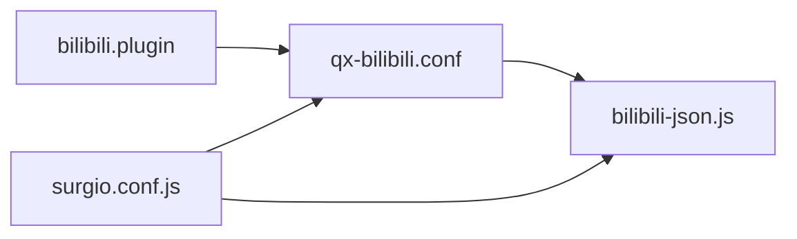

# B站JSON数据处理服务

<cite>
**本文档引用的文件**   
- [README.md](file://README.md)
- [package.json](file://package.json)
- [bilibili-json.js](file://Mirror/bilibili-json.js)
- [bilibili.plugin](file://Plugin/bilibili.plugin)
- [qx-bilibili.conf](file://Mirror/rules/qx-bilibili.conf)
- [surgio.conf.js](file://surgio.conf.js)
</cite>

## 目录
1. [简介](#简介)
2. [项目结构](#项目结构)
3. [核心组件](#核心组件)
4. [架构总览](#架构总览)
5. [详细组件分析](#详细组件分析)
6. [依赖关系分析](#依赖关系分析)
7. [性能考虑](#性能考虑)
8. [故障排查指南](#故障排查指南)
9. [结论](#结论)
10. [附录](#附录)

## 简介
本技术文档围绕B站JSON数据处理服务展开，聚焦于该仓库中与B站相关的JSON数据解析、字段映射与转换能力。通过梳理脚本、规则与插件的协作方式，说明请求参数处理、响应数据格式化、数据清洗与验证以及错误处理的实现要点，并提供集成与使用指引，帮助开发者快速理解并正确接入该服务。

## 项目结构
本项目采用多引擎适配与规则/脚本分离的组织方式：
- Mirror 目录存放面向不同代理引擎的规则与脚本，其中包含B站相关资源解析脚本与Quantumult X规则。
- Plugin 目录提供各平台（含B站）的插件配置，便于在代理工具中启用对应功能。
- surgio.conf.js 用于统一生成或管理多引擎配置。
- package.json 定义项目元信息与脚本命令。
- README.md 提供项目概览与使用说明。

图表来源
- [README.md](file://README.md)
- [package.json](file://package.json)
- [surgio.conf.js](file://surgio.conf.js)
- [bilibili-json.js](file://Mirror/bilibili-json.js)
- [qx-bilibili.conf](file://Mirror/rules/qx-bilibili.conf)
- [bilibili.plugin](file://Plugin/bilibili.plugin)

章节来源
- [README.md](file://README.md)
- [package.json](file://package.json)
- [surgio.conf.js](file://surgio.conf.js)

## 核心组件
- bilibili-json.js：负责B站API响应的JSON数据解析、字段映射与格式转换，输出供上层逻辑使用的标准化数据结构。
- qx-bilibili.conf：Quantumult X侧的B站规则，用于匹配请求/响应、触发脚本执行与数据改写。
- bilibili.plugin：B站插件配置，为不同代理引擎提供统一的启用入口与参数设置。
- surgio.conf.js：集中式配置，协调多引擎规则与脚本的生成与分发。

章节来源
- [bilibili-json.js](file://Mirror/bilibili-json.js)
- [qx-bilibili.conf](file://Mirror/rules/qx-bilibili.conf)
- [bilibili.plugin](file://Plugin/bilibili.plugin)
- [surgio.conf.js](file://surgio.conf.js)

## 架构总览
下图展示了从请求进入、规则匹配、脚本解析到返回数据的整体流程，体现“规则驱动 + 脚本处理”的架构模式。

图表来源
- [qx-bilibili.conf](file://Mirror/rules/qx-bilibili.conf)
- [bilibili-json.js](file://Mirror/bilibili-json.js)

## 详细组件分析

### 组件A：bilibili-json.js（B站JSON解析与转换）
职责
- 解析B站API返回的原始JSON，提取关键字段并进行类型转换。
- 将非标准字段映射为统一的数据模型，便于上层消费。
- 对缺失或异常字段进行清洗与默认值填充，提升鲁棒性。
- 根据上下文决定是否需要二次请求以补充信息。

关键流程
- 输入校验：检查必要字段是否存在与类型是否符合预期。
- 字段映射：将B站特有字段映射为标准字段名。
- 数据清洗：去除空值、去重、规范化枚举值。
- 错误处理：捕获解析异常并返回结构化错误信息。

图表来源
- [bilibili-json.js](file://Mirror/bilibili-json.js)

章节来源
- [bilibili-json.js](file://Mirror/bilibili-json.js)

### 组件B：qx-bilibili.conf（Quantumult X规则）
职责
- 匹配B站域名与路径，识别需要脚本处理的请求与响应。
- 指定脚本执行时机（如响应体到达后）。
- 传递上下文参数（如URL、Headers、Body）给脚本。

关键点
- 规则优先级与覆盖范围需合理设置，避免误伤其他站点。
- 针对分页、列表接口与详情接口的差异化处理策略。
- 缓存策略与重试机制的配置建议。

章节来源
- [qx-bilibili.conf](file://Mirror/rules/qx-bilibili.conf)

### 组件C：bilibili.plugin（B站插件）
职责
- 为不同代理引擎暴露统一的启用开关与参数项。
- 维护版本兼容性与更新策略。
- 提供调试日志开关与限流阈值等运行时配置。

章节来源
- [bilibili.plugin](file://Plugin/bilibili.plugin)

### 组件D：surgio.conf.js（多引擎配置协调）
职责
- 统一管理各引擎的规则与脚本引用。
- 生成或合并最终配置文件，确保一致性。
- 支持环境差异化的变量注入与条件编译。

章节来源
- [surgio.conf.js](file://surgio.conf.js)

## 依赖关系分析
- bilibili-json.js 被规则层（qx-bilibili.conf）在特定条件下触发，作为数据处理的核心模块。
- bilibili.plugin 作为上层入口，控制是否启用B站相关能力。
- surgio.conf.js 协调上述组件，保证在多引擎环境下行为一致。

图表来源
- [bilibili.plugin](file://Plugin/bilibili.plugin)
- [qx-bilibili.conf](file://Mirror/rules/qx-bilibili.conf)
- [bilibili-json.js](file://Mirror/bilibili-json.js)
- [surgio.conf.js](file://surgio.conf.js)

章节来源
- [bilibili.plugin](file://Plugin/bilibili.plugin)
- [qx-bilibili.conf](file://Mirror/rules/qx-bilibili.conf)
- [bilibili-json.js](file://Mirror/bilibili-json.js)
- [surgio.conf.js](file://surgio.conf.js)

## 性能考虑
- 解析阶段尽量使用增量解析与短路判断，减少不必要的遍历。
- 对重复字段进行缓存，避免重复计算。
- 对大体积响应体进行分块处理，降低内存峰值。
- 合理设置超时与重试次数，避免阻塞主流程。
- 在规则层做粗粒度过滤，减少脚本调用频率。

[本节为通用指导，不直接分析具体文件]

## 故障排查指南
常见问题与定位步骤
- 规则未命中：检查域名、路径与正则表达式是否正确；确认规则优先级。
- 脚本未执行：确认代理引擎已加载脚本路径；检查脚本权限与语法。
- 解析失败：查看输入JSON结构是否与预期一致；增加日志打印关键字段。
- 字段缺失：核对字段映射表；为必填字段设置默认值与降级策略。
- 性能问题：统计脚本调用次数与耗时；优化循环与字符串操作。

章节来源
- [bilibili-json.js](file://Mirror/bilibili-json.js)
- [qx-bilibili.conf](file://Mirror/rules/qx-bilibili.conf)
- [bilibili.plugin](file://Plugin/bilibili.plugin)

## 结论
本服务通过“规则+脚本”的解耦设计，实现了B站JSON数据的稳定解析与转换。建议在开发过程中遵循严格的输入校验与错误处理规范，结合性能优化手段，确保在高并发场景下的稳定性与可维护性。同时，保持规则与脚本的版本同步，有助于在多引擎环境中保持一致的行为。

[本节为总结，不直接分析具体文件]

## 附录
- 集成建议
  - 在代理引擎中启用 bilibili.plugin，并确保规则与脚本路径正确。
  - 在 surgio.conf.js 中统一声明依赖，避免重复配置。
  - 开启调试日志以便快速定位问题，生产环境关闭以提升性能。
- 参考文件
  - README.md：项目概览与使用说明
  - package.json：项目元信息与脚本命令

章节来源
- [README.md](file://README.md)
- [package.json](file://package.json)
- [surgio.conf.js](file://surgio.conf.js)
- [bilibili.plugin](file://Plugin/bilibili.plugin)
- [qx-bilibili.conf](file://Mirror/rules/qx-bilibili.conf)
- [bilibili-json.js](file://Mirror/bilibili-json.js)