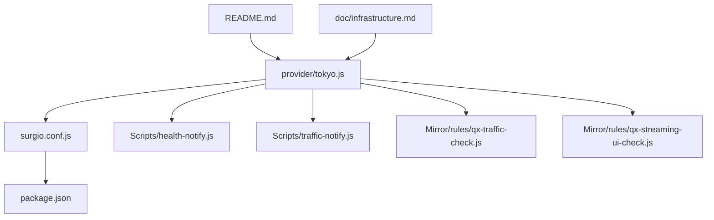
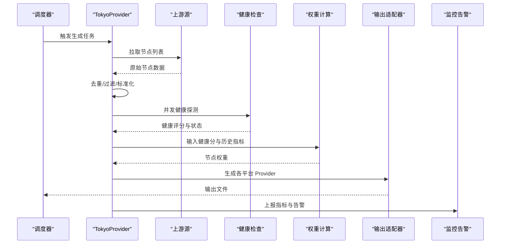
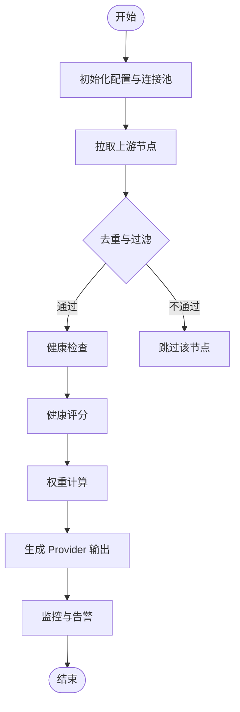
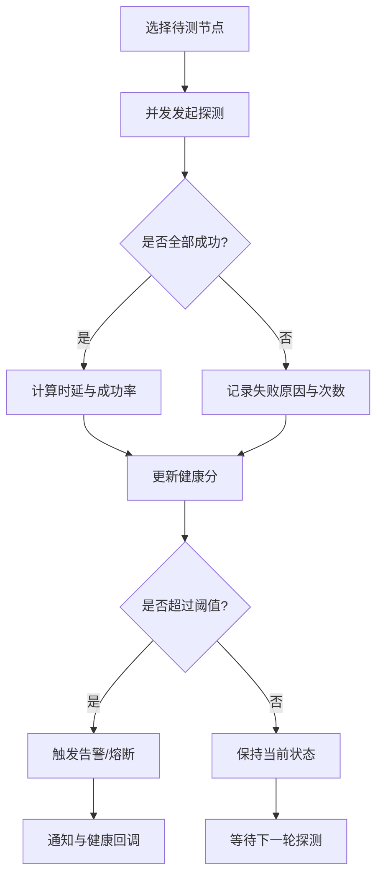
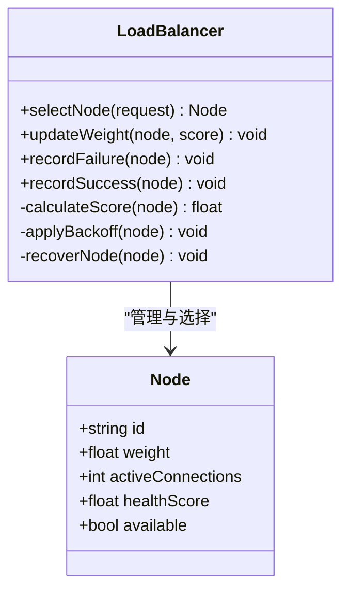
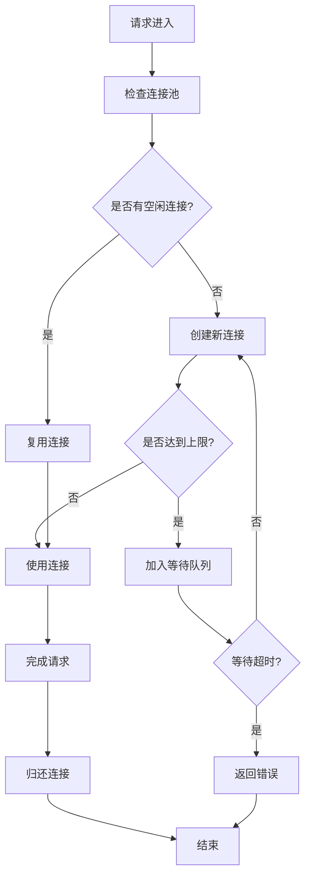
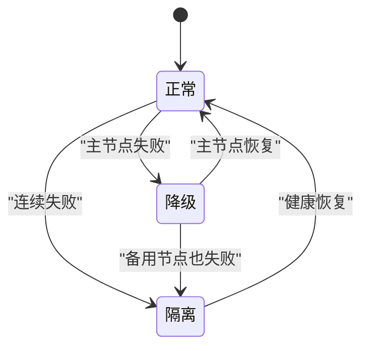
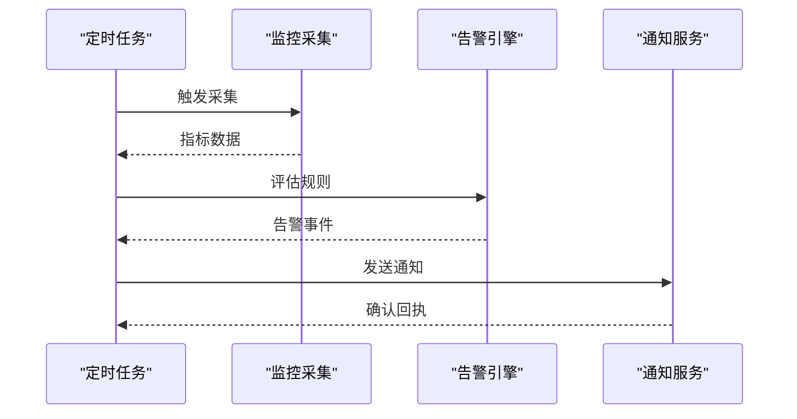
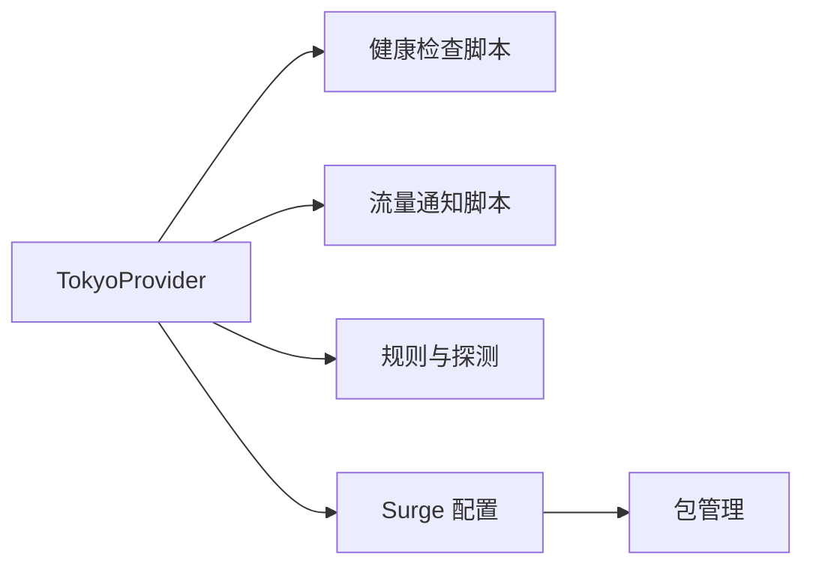

# 东京节点提供商

<cite>
**本文引用的文件**   
- [provider/tokyo.js](file://provider/tokyo.js)
- [README.md](file://README.md)
- [package.json](file://package.json)
- [surgio.conf.js](file://surgio.conf.js)
- [Scripts/health-notify.js](file://Scripts/health-notify.js)
- [Scripts/traffic-notify.js](file://Scripts/traffic-notify.js)
- [Mirror/rules/qx-traffic-check.js](file://Mirror/rules/qx-traffic-check.js)
- [Mirror/rules/qx-streaming-ui-check.js](file://Mirror/rules/qx-streaming-ui-check.js)
- [doc/infrastructure.md](file://doc/infrastructure.md)
</cite>

## 目录
1. [简介](#简介)
2. [项目结构](#项目结构)
3. [核心组件](#核心组件)
4. [架构总览](#架构总览)
5. [详细组件分析](#详细组件分析)
6. [依赖关系分析](#依赖关系分析)
7. [性能考量](#性能考量)
8. [故障排查指南](#故障排查指南)
9. [结论](#结论)
10. [附录](#附录)

## 简介
本技术文档面向“东京节点提供商”的维护者与使用者，聚焦以下目标：
- 节点发现机制：如何动态获取、校验与更新东京区域可用节点。
- 健康检查算法：基于网络可达性、延迟与吞吐的综合评估策略。
- 负载均衡策略：多节点间的流量分配与权重调整。
- 配置参数：节点来源、超时、重试、阈值等关键开关。
- 连接池管理：并发连接复用、资源回收与容量控制。
- 故障转移逻辑：异常检测、快速切换与回切策略。
- 监控与告警：指标采集、可视化与通知渠道。
- 部署与维护：安装、升级、巡检与排障流程。

## 项目结构
本项目采用模块化组织，东京节点相关逻辑集中在 provider 目录，脚本与规则在 Scripts 与 Mirror/rules 中，构建与运行由 surgio 工具链驱动。

图表来源
- [provider/tokyo.js](file://provider/tokyo.js)
- [surgio.conf.js](file://surgio.conf.js)
- [Scripts/health-notify.js](file://Scripts/health-notify.js)
- [Scripts/traffic-notify.js](file://Scripts/traffic-notify.js)
- [Mirror/rules/qx-traffic-check.js](file://Mirror/rules/qx-traffic-check.js)
- [Mirror/rules/qx-streaming-ui-check.js](file://Mirror/rules/qx-streaming-ui-check.js)
- [README.md](file://README.md)
- [doc/infrastructure.md](file://doc/infrastructure.md)

章节来源
- [README.md](file://README.md)
- [package.json](file://package.json)
- [surgio.conf.js](file://surgio.conf.js)

## 核心组件
- 东京节点提供者（provider/tokyo.js）
  - 负责从上游源拉取节点列表、去重与校验、健康探测、权重计算与输出为 Surge/Loon/QX 格式。
  - 内置或调用健康检查脚本与流量统计脚本，形成闭环监控。
- 构建与编排（surgio.conf.js）
  - 定义 Provider 生成任务、输入源、输出路径与模板渲染。
- 健康与流量脚本
  - health-notify.js：健康状态变化时的通知与告警。
  - traffic-notify.js：周期性上报流量与带宽使用。
- 规则与探测
  - qx-traffic-check.js：基于规则的流量探测与统计。
  - qx-streaming-ui-check.js：针对流媒体场景的 UI 可用性检查。

章节来源
- [provider/tokyo.js](file://provider/tokyo.js)
- [surgio.conf.js](file://surgio.conf.js)
- [Scripts/health-notify.js](file://Scripts/health-notify.js)
- [Scripts/traffic-notify.js](file://Scripts/traffic-notify.js)
- [Mirror/rules/qx-traffic-check.js](file://Mirror/rules/qx-traffic-check.js)
- [Mirror/rules/qx-streaming-ui-check.js](file://Mirror/rules/qx-streaming-ui-check.js)

## 架构总览
东京节点提供者的整体工作流如下：
- 数据源接入：从远程地址或本地缓存读取候选节点。
- 预处理：去重、过滤无效条目、标准化字段。
- 健康检查：并发探测延迟、丢包率、连通性与业务可用性。
- 权重计算：根据健康分、历史成功率、时延分布计算权重。
- 输出适配：生成 Surge/Loon/QX 所需的 Provider 文本。
- 监控告警：周期上报指标，异常触发通知。

图表来源
- [provider/tokyo.js](file://provider/tokyo.js)
- [Scripts/health-notify.js](file://Scripts/health-notify.js)
- [Scripts/traffic-notify.js](file://Scripts/traffic-notify.js)

## 详细组件分析

### TokyoProvider（provider/tokyo.js）
职责
- 节点发现：支持多上游源聚合、增量更新与缓存失效策略。
- 健康检查：TCP/HTTP 探测、DNS 解析验证、业务接口可用性。
- 负载均衡：加权轮询、最少连接、失败退避与快速恢复。
- 连接池：并发上限、空闲回收、超时与重试。
- 故障转移：主备切换、降级策略与回切条件。
- 监控统计：QPS、延迟分布、错误码、带宽与告警事件。

关键流程
- 初始化：加载配置、预热连接池、注册钩子。
- 拉取：按策略拉取上游，合并去重，标记来源。
- 探测：并行健康检查，记录结果与耗时。
- 评分：综合时延、成功率、抖动计算健康分。
- 权重：基于健康分与历史成功率计算权重。
- 输出：渲染模板，写入文件并触发校验。
- 监控：上报指标，异常触发告警。

图表来源
- [provider/tokyo.js](file://provider/tokyo.js)

章节来源
- [provider/tokyo.js](file://provider/tokyo.js)

### 健康检查算法（Scripts/health-notify.js 与 qx-traffic-check.js）
算法要点
- 探测类型：TCP 握手、HTTP GET/HEAD、DNS 解析、业务接口。
- 指标采集：时延、丢包率、成功率、首字节时间、错误码。
- 评分模型：指数衰减加权、滑动窗口、抖动抑制。
- 阈值策略：连续失败阈值、快速熔断、恢复阈值。
- 通知机制：状态变更触发告警，包含节点、指标与上下文。

图表来源
- [Scripts/health-notify.js](file://Scripts/health-notify.js)
- [Mirror/rules/qx-traffic-check.js](file://Mirror/rules/qx-traffic-check.js)

章节来源
- [Scripts/health-notify.js](file://Scripts/health-notify.js)
- [Mirror/rules/qx-traffic-check.js](file://Mirror/rules/qx-traffic-check.js)

### 负载均衡策略（provider/tokyo.js）
策略说明
- 加权轮询：依据健康分与历史成功率动态调整权重。
- 最少连接：优先选择活跃连接数最少的节点。
- 失败退避：对连续失败的节点降低权重或暂停使用。
- 快速恢复：当健康分恢复到阈值以上时逐步提升权重。
- 地域亲和：优先选择东京节点，必要时跨区降级。

图表来源
- [provider/tokyo.js](file://provider/tokyo.js)

章节来源
- [provider/tokyo.js](file://provider/tokyo.js)

### 连接池管理（provider/tokyo.js）
管理要点
- 容量控制：最大连接数、每节点连接上限、全局并发限制。
- 生命周期：创建、复用、空闲回收、超时关闭。
- 错误处理：连接失败重试、指数退避、熔断保护。
- 监控指标：活跃连接、队列长度、命中率、平均持有时间。

图表来源
- [provider/tokyo.js](file://provider/tokyo.js)

章节来源
- [provider/tokyo.js](file://provider/tokyo.js)

### 故障转移逻辑（provider/tokyo.js）
转移策略
- 主备切换：主节点不可用时自动切换到备用节点。
- 降级策略：部分功能不可用时降级到基础能力。
- 回切条件：主节点恢复且稳定后逐步回切。
- 隔离机制：对不稳定节点进行隔离，避免雪崩。

图表来源
- [provider/tokyo.js](file://provider/tokyo.js)

章节来源
- [provider/tokyo.js](file://provider/tokyo.js)

### 监控与告警（Scripts/traffic-notify.js 与 health-notify.js）
监控内容
- 节点指标：时延、成功率、错误码、带宽。
- 系统指标：CPU、内存、连接数、队列长度。
- 业务指标：请求量、响应时间、转化率。
告警规则
- 阈值告警：时延过高、成功率过低、错误率突增。
- 趋势告警：持续恶化、突发峰值。
- 通知渠道：日志、消息推送、Webhook。

图表来源
- [Scripts/traffic-notify.js](file://Scripts/traffic-notify.js)
- [Scripts/health-notify.js](file://Scripts/health-notify.js)

章节来源
- [Scripts/traffic-notify.js](file://Scripts/traffic-notify.js)
- [Scripts/health-notify.js](file://Scripts/health-notify.js)

### 规则与探测（qx-streaming-ui-check.js）
用途
- 针对流媒体场景的 UI 可用性检查。
- 结合业务特征判断节点质量。
- 辅助健康评分与权重调整。

章节来源
- [Mirror/rules/qx-streaming-ui-check.js](file://Mirror/rules/qx-streaming-ui-check.js)

## 依赖关系分析
- 内部依赖
  - provider/tokyo.js 依赖健康检查与流量统计脚本。
  - surgio.conf.js 定义 Provider 生成任务与模板。
- 外部依赖
  - 上游节点源（HTTP/HTTPS）。
  - DNS 解析服务。
  - 监控与告警通道（日志、消息推送、Webhook）。

图表来源
- [provider/tokyo.js](file://provider/tokyo.js)
- [surgio.conf.js](file://surgio.conf.js)
- [package.json](file://package.json)

章节来源
- [surgio.conf.js](file://surgio.conf.js)
- [package.json](file://package.json)

## 性能考量
- 并发控制：合理设置连接池大小与全局并发，避免资源耗尽。
- 探测优化：批量探测、超时与重试策略调优。
- 缓存策略：节点列表与健康结果的短期缓存。
- 输出优化：增量更新与模板预编译。
- 监控开销：采样与异步上报，避免阻塞主流程。

## 故障排查指南
常见问题
- 节点无法拉取：检查上游源可达性与认证。
- 健康检查失败：确认端口、协议与业务接口。
- 权重异常：查看健康分与历史成功率。
- 连接池耗尽：检查连接泄漏与超时设置。
- 告警风暴：调整阈值与去抖策略。

排查步骤
- 查看日志：定位错误信息与堆栈。
- 检查配置：核对超时、重试与阈值。
- 模拟测试：手动触发健康检查与权重计算。
- 监控回溯：分析指标趋势与异常点。

章节来源
- [provider/tokyo.js](file://provider/tokyo.js)
- [Scripts/health-notify.js](file://Scripts/health-notify.js)
- [Scripts/traffic-notify.js](file://Scripts/traffic-notify.js)

## 结论
东京节点提供商通过模块化的设计实现了高可用的节点发现、健康检查与负载均衡。配合完善的监控与告警机制，能够有效保障东京区域的网络服务质量。建议在生产环境中持续优化参数与策略，确保系统的稳定性与性能。

## 附录
- 部署指南
  - 安装依赖：根据 package.json 安装所需模块。
  - 配置 Provider：编辑 surgio.conf.js 设置上游源与输出路径。
  - 启动任务：运行构建命令生成 Provider 文件。
- 维护操作
  - 定期更新：配置定时任务自动刷新节点列表。
  - 参数调优：根据监控指标调整超时、重试与阈值。
  - 故障演练：模拟节点故障验证故障转移逻辑。
- 参考文档
  - 基础设施说明：[doc/infrastructure.md](file://doc/infrastructure.md)
  - 项目说明：[README.md](file://README.md)