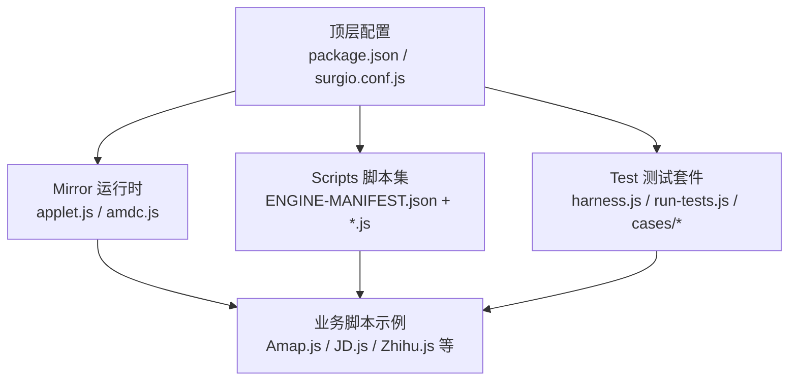
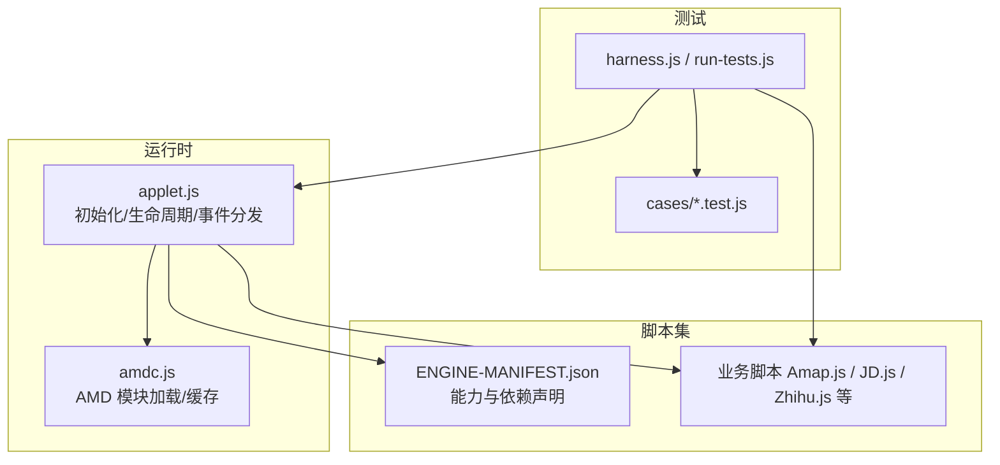
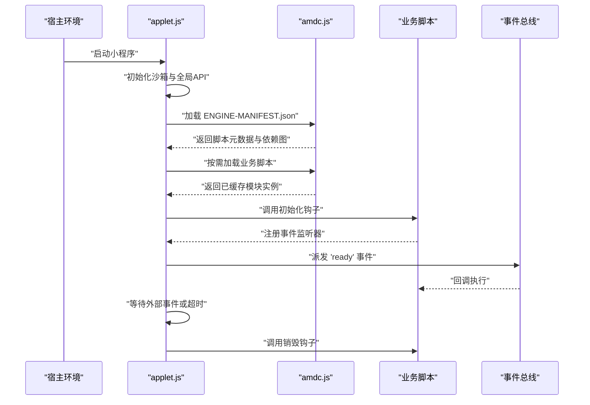
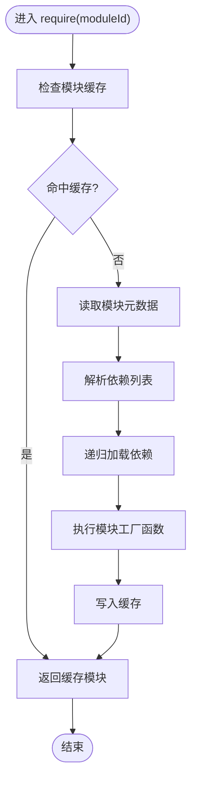
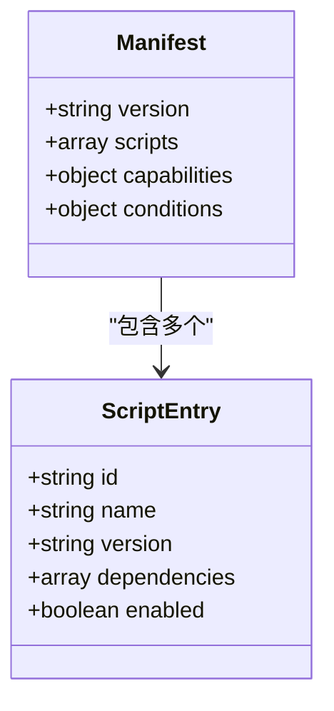
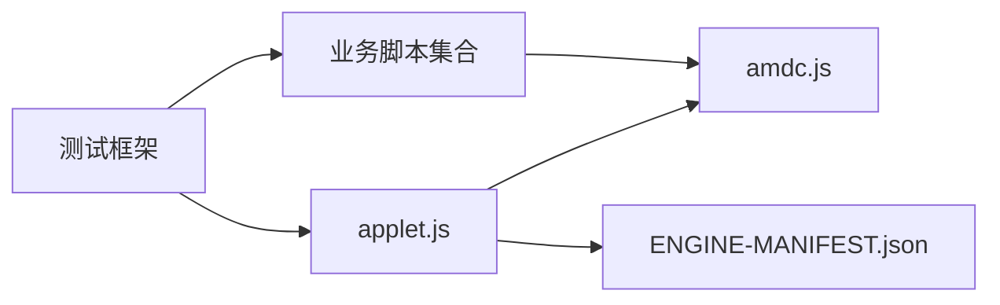

# 小程序脚本引擎

<cite>
**本文档引用的文件**   
- [README.md](file://README.md)
- [package.json](file://package.json)
- [surgio.conf.js](file://surgio.conf.js)
- [Mirror/applet.js](file://Mirror/applet.js)
- [Mirror/amdc.js](file://Mirror/amdc.js)
- [Scripts/ENGINE-MANIFEST.json](file://Scripts/ENGINE-MANIFEST.json)
- [Scripts/Amap.js](file://Scripts/Amap.js)
- [Scripts/Cainiao.js](file://Scripts/Cainiao.js)
- [Scripts/JD.js](file://Scripts/JD.js)
- [Scripts/Qidian.js](file://Scripts/Qidian.js)
- [Scripts/Reddit.js](file://Scripts/Reddit.js)
- [Scripts/Tieba.js](file://Scripts/Tieba.js)
- [Scripts/Zhihu.js](file://Scripts/Zhihu.js)
- [Scripts/Zhihuifangdong.js](file://Scripts/Zhihuifangdong.js)
- [Scripts/health-notify.js](file://Scripts/health-notify.js)
- [Scripts/traffic-notify.js](file://Scripts/traffic-notify.js)
- [test/harness.js](file://test/harness.js)
- [test/run-tests.js](file://test/run-tests.js)
- [test/cases/purify-scripts.test.js](file://test/cases/purify-scripts.test.js)
- [test/cases/qidian-wrapper.test.js](file://test/cases/qidian-wrapper.test.js)
- [test/cases/zhihu-cainiao.test.js](file://test/cases/zhihu-cainiao.test.js)
- [test/cases/zhihuifangdong.test.js](file://test/cases/zhihuifangdong.test.js)
</cite>

## 目录
1. [简介](#简介)
2. [项目结构](#项目结构)
3. [核心组件](#核心组件)
4. [架构总览](#架构总览)
5. [详细组件分析](#详细组件分析)
6. [依赖关系分析](#依赖关系分析)
7. [性能考量](#性能考量)
8. [故障排查指南](#故障排查指南)
9. [结论](#结论)
10. [附录](#附录)

## 简介
本技术文档围绕“小程序脚本引擎”展开，聚焦于运行环境、沙箱机制、API限制、内存管理、生命周期管理、脚本初始化流程、事件处理与数据通信方式。同时提供开发最佳实践、调试技巧、常见问题解决方案与性能优化策略。该仓库以多平台规则与脚本为核心，结合镜像脚本与测试框架，形成一套可复用的小程序脚本生态。

## 项目结构
仓库采用分层组织：
- 顶层配置与工程化：包含包管理、工作流、构建与发布配置等。
- Mirror 层：提供小程序运行时入口与通用库（如 AMD 模块加载器）。
- Scripts 层：具体业务脚本与引擎清单，定义脚本能力与依赖。
- Test 层：测试用例与测试运行器，覆盖脚本行为与兼容性。
- 其他：模板、插件、配置文件等辅助资源。

图表来源
- [package.json:1-200](file://package.json#L1-L200)
- [surgio.conf.js:1-200](file://surgio.conf.js#L1-L200)
- [Mirror/applet.js:1-200](file://Mirror/applet.js#L1-L200)
- [Mirror/amdc.js:1-200](file://Mirror/amdc.js#L1-200)
- [Scripts/ENGINE-MANIFEST.json:1-200](file://Scripts/ENGINE-MANIFEST.json#L1-L200)

章节来源
- [README.md:1-200](file://README.md#L1-L200)
- [package.json:1-200](file://package.json#L1-L200)
- [surgio.conf.js:1-200](file://surgio.conf.js#L1-L200)

## 核心组件
- 运行时入口 applet.js：负责小程序脚本的加载、初始化、生命周期钩子与事件分发。
- 模块加载器 amdc.js：提供 AMD 风格的模块解析与缓存，确保脚本间依赖稳定。
- 引擎清单 ENGINE-MANIFEST.json：声明可用脚本、版本、依赖与能力边界。
- 业务脚本集合：各站点或功能脚本实现具体逻辑，遵循统一接口约定。
- 测试框架 harness.js 与 run-tests.js：提供统一的测试执行环境与断言工具。

章节来源
- [Mirror/applet.js:1-200](file://Mirror/applet.js#L1-L200)
- [Mirror/amdc.js:1-200](file://Mirror/amdc.js#L1-200)
- [Scripts/ENGINE-MANIFEST.json:1-200](file://Scripts/ENGINE-MANIFEST.json#L1-L200)
- [test/harness.js:1-200](file://test/harness.js#L1-L200)
- [test/run-tests.js:1-200](file://test/run-tests.js#L1-L200)

## 架构总览
小程序脚本引擎采用“运行时 + 模块加载 + 脚本集”的分层架构。运行时负责沙箱隔离、生命周期管理与事件调度；模块加载器保证依赖解析与缓存；脚本集按清单注册并暴露标准化 API。测试框架贯穿开发与发布流程，保障稳定性与兼容性。

图表来源
- [Mirror/applet.js:1-200](file://Mirror/applet.js#L1-L200)
- [Mirror/amdc.js:1-200](file://Mirror/amdc.js#L1-200)
- [Scripts/ENGINE-MANIFEST.json:1-200](file://Scripts/ENGINE-MANIFEST.json#L1-L200)
- [test/harness.js:1-200](file://test/harness.js#L1-L200)
- [test/run-tests.js:1-200](file://test/run-tests.js#L1-L200)

## 详细组件分析

### 运行时入口 applet.js
- 职责：加载引擎清单、初始化沙箱、挂载全局 API、触发生命周期钩子、分发事件。
- 关键点：
  - 沙箱隔离：为每个脚本创建独立上下文，限制对宿主环境的访问。
  - 生命周期：提供启动、就绪、销毁等阶段钩子，便于脚本接入。
  - 事件总线：统一的事件注册与派发，支持跨脚本通信。
  - API 白名单：仅暴露安全且必要的 API，避免越权操作。

图表来源
- [Mirror/applet.js:1-200](file://Mirror/applet.js#L1-L200)
- [Mirror/amdc.js:1-200](file://Mirror/amdc.js#L1-200)
- [Scripts/ENGINE-MANIFEST.json:1-200](file://Scripts/ENGINE-MANIFEST.json#L1-L200)

章节来源
- [Mirror/applet.js:1-200](file://Mirror/applet.js#L1-L200)

### 模块加载器 amdc.js
- 职责：实现 AMD 风格模块加载、依赖解析、循环依赖检测与缓存。
- 关键点：
  - define/require：标准接口，便于脚本模块化。
  - 缓存策略：首次加载后缓存模块实例，提升性能。
  - 错误处理：对缺失依赖、语法错误进行友好提示。

图表来源
- [Mirror/amdc.js:1-200](file://Mirror/amdc.js#L1-200)

章节来源
- [Mirror/amdc.js:1-200](file://Mirror/amdc.js#L1-200)

### 引擎清单 ENGINE-MANIFEST.json
- 职责：声明可用脚本、版本、依赖关系、能力边界与启用条件。
- 关键点：
  - 脚本注册：列出所有可加载脚本及其元信息。
  - 依赖图：描述脚本间的依赖关系，供加载器使用。
  - 能力开关：根据环境动态启用或禁用某些脚本。

图表来源
- [Scripts/ENGINE-MANIFEST.json:1-200](file://Scripts/ENGINE-MANIFEST.json#L1-200)

章节来源
- [Scripts/ENGINE-MANIFEST.json:1-200](file://Scripts/ENGINE-MANIFEST.json#L1-L200)

### 业务脚本示例
- 代表性脚本：Amap.js、Cainiao.js、JD.js、Qidian.js、Reddit.js、Tieba.js、Zhihu.js、Zhihuifangdong.js、health-notify.js、traffic-notify.js。
- 共同模式：
  - 通过 amdc.js 的 define/require 进行模块化。
  - 在生命周期钩子中完成初始化与资源准备。
  - 通过事件总线与其他脚本或宿主交互。
  - 严格遵循 API 白名单，避免非法访问。

章节来源
- [Scripts/Amap.js:1-200](file://Scripts/Amap.js#L1-L200)
- [Scripts/Cainiao.js:1-200](file://Scripts/Cainiao.js#L1-L200)
- [Scripts/JD.js:1-200](file://Scripts/JD.js#L1-L200)
- [Scripts/Qidian.js:1-200](file://Scripts/Qidian.js#L1-L200)
- [Scripts/Reddit.js:1-200](file://Scripts/Reddit.js#L1-L200)
- [Scripts/Tieba.js:1-200](file://Scripts/Tieba.js#L1-L200)
- [Scripts/Zhihu.js:1-200](file://Scripts/Zhihu.js#L1-L200)
- [Scripts/Zhihuifangdong.js:1-200](file://Scripts/Zhihuifangdong.js#L1-L200)
- [Scripts/health-notify.js:1-200](file://Scripts/health-notify.js#L1-L200)
- [Scripts/traffic-notify.js:1-200](file://Scripts/traffic-notify.js#L1-L200)

### 测试框架 harness.js 与 run-tests.js
- 职责：提供统一的测试执行环境、断言工具与报告输出。
- 关键点：
  - 测试用例组织：按功能或脚本划分测试文件。
  - 模拟环境：注入宿主 API 与事件，便于单元测试。
  - 覆盖率与失败定位：快速定位问题脚本与回归点。

章节来源
- [test/harness.js:1-200](file://test/harness.js#L1-L200)
- [test/run-tests.js:1-200](file://test/run-tests.js#L1-L200)
- [test/cases/purify-scripts.test.js:1-200](file://test/cases/purify-scripts.test.js#L1-L200)
- [test/cases/qidian-wrapper.test.js:1-200](file://test/cases/qidian-wrapper.test.js#L1-L200)
- [test/cases/zhihu-cainiao.test.js:1-200](file://test/cases/zhihu-cainiao.test.js#L1-L200)
- [test/cases/zhihuifangdong.test.js:1-200](file://test/cases/zhihuifangdong.test.js#L1-L200)

## 依赖关系分析
- 运行时依赖：applet.js 依赖 amdc.js 进行模块加载，依赖 ENGINE-MANIFEST.json 获取脚本元数据。
- 脚本依赖：业务脚本通过 amdc.js 的 require 引入共享模块或彼此依赖。
- 测试依赖：测试框架依赖运行时与脚本，用于验证行为与兼容性。

图表来源
- [Mirror/applet.js:1-200](file://Mirror/applet.js#L1-L200)
- [Mirror/amdc.js:1-200](file://Mirror/amdc.js#L1-L200)
- [Scripts/ENGINE-MANIFEST.json:1-200](file://Scripts/ENGINE-MANIFEST.json#L1-L200)
- [test/harness.js:1-200](file://test/harness.js#L1-L200)
- [test/run-tests.js:1-200](file://test/run-tests.js#L1-L200)

章节来源
- [Mirror/applet.js:1-200](file://Mirror/applet.js#L1-L200)
- [Mirror/amdc.js:1-200](file://Mirror/amdc.js#L1-L200)
- [Scripts/ENGINE-MANIFEST.json:1-200](file://Scripts/ENGINE-MANIFEST.json#L1-L200)
- [test/harness.js:1-200](file://test/harness.js#L1-L200)
- [test/run-tests.js:1-200](file://test/run-tests.js#L1-L200)

## 性能考量
- 模块缓存：利用 amdc.js 的缓存机制减少重复加载开销。
- 懒加载：仅在需要时加载脚本，降低初始启动时间。
- 事件去抖与节流：对高频事件进行处理，避免主线程阻塞。
- 内存管理：及时释放不再使用的对象与监听器，防止内存泄漏。
- 清单优化：精简 ENGINE-MANIFEST.json，移除未用脚本与冗余依赖。

[本节为通用指导，不直接分析具体文件]

## 故障排查指南
- 常见错误：
  - 模块加载失败：检查依赖声明与路径是否正确。
  - 生命周期未触发：确认初始化顺序与钩子注册时机。
  - 事件未响应：检查事件名称与监听器绑定是否一致。
  - 内存溢出：排查大对象引用与未清理的定时器。
- 调试技巧：
  - 使用测试框架复现问题，缩小范围。
  - 在关键路径添加日志输出，观察数据流。
  - 逐步禁用脚本，定位冲突源。

章节来源
- [test/harness.js:1-200](file://test/harness.js#L1-L200)
- [test/run-tests.js:1-200](file://test/run-tests.js#L1-L200)
- [test/cases/purify-scripts.test.js:1-200](file://test/cases/purify-scripts.test.js#L1-L200)
- [test/cases/qidian-wrapper.test.js:1-200](file://test/cases/qidian-wrapper.test.js#L1-L200)
- [test/cases/zhihu-cainiao.test.js:1-200](file://test/cases/zhihu-cainiao.test.js#L1-L200)
- [test/cases/zhihuifangdong.test.js:1-200](file://test/cases/zhihuifangdong.test.js#L1-L200)

## 结论
本引擎通过清晰的运行时、模块加载与脚本集分层，实现了安全、可扩展的小程序脚本生态。借助测试框架与清单管理，保障了脚本的质量与兼容性。开发者应遵循 API 白名单与生命周期约定，合理使用事件与缓存，以获得稳定高效的运行体验。

[本节为总结性内容，不直接分析具体文件]

## 附录
- 开发最佳实践：
  - 模块化设计：将功能拆分为独立模块，便于维护与测试。
  - 错误处理：对异常进行捕获与上报，避免崩溃。
  - 性能监控：记录关键指标，持续优化。
- 调试技巧：
  - 使用控制台输出关键变量与状态。
  - 编写单元测试覆盖边界情况。
  - 利用测试框架模拟复杂场景。

[本节为补充说明，不直接分析具体文件]