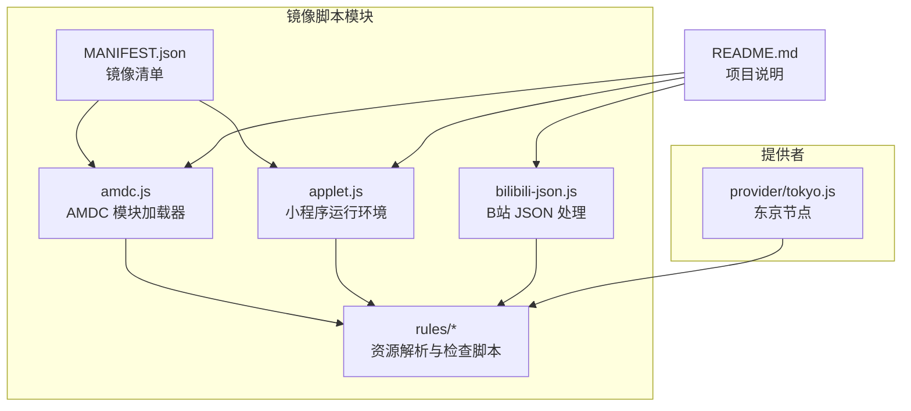
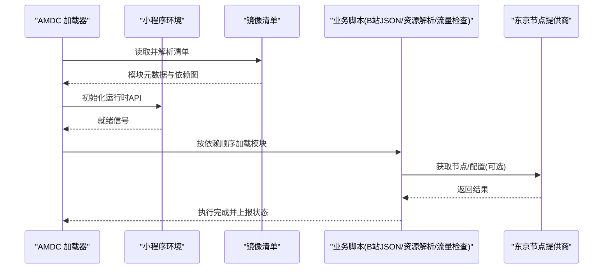
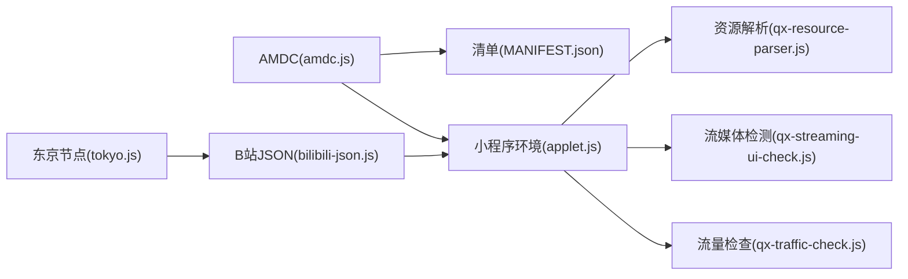

# 镜像脚本

<cite>
**本文引用的文件**   
- [amdc.js](file://Mirror/amdc.js)
- [applet.js](file://Mirror/applet.js)
- [bilibili-json.js](file://Mirror/bilibili-json.js)
- [MANIFEST.json](file://Mirror/MANIFEST.json)
- [qx-resource-parser.js](file://Mirror/rules/qx-resource-parser.js)
- [qx-streaming-ui-check.js](file://Mirror/rules/qx-streaming-ui-check.js)
- [qx-traffic-check.js](file://Mirror/rules/qx-traffic-check.js)
- [tokyo.js](file://provider/tokyo.js)
- [README.md](file://README.md)
</cite>

## 目录
1. [简介](#简介)
2. [项目结构](#项目结构)
3. [核心组件](#核心组件)
4. [架构总览](#架构总览)
5. [详细组件分析](#详细组件分析)
6. [依赖关系分析](#依赖关系分析)
7. [性能考量](#性能考量)
8. [故障排查指南](#故障排查指南)
9. [结论](#结论)
10. [附录](#附录)

## 简介
本技术文档围绕“镜像脚本”模块展开，重点覆盖以下方面：
- AMDC 模块加载器的工作原理与配置方式
- 小程序脚本的运行环境与限制
- B站 JSON 数据处理脚本的功能与用法
- 东京节点提供商的配置与使用
- 脚本调试技巧与性能优化建议

该模块主要服务于规则与脚本的镜像分发、资源解析与数据加工，常见于移动端网络工具（如 Quantumult X、Loon、Surge）等生态中。

## 项目结构
镜像脚本模块的核心位于 Mirror 目录，包含：
- amdc.js：AMDC 模块加载器实现
- applet.js：小程序运行环境适配层
- bilibili-json.js：B站 JSON 数据处理脚本
- MANIFEST.json：镜像清单与版本信息
- rules/：各类资源解析与检查脚本（如资源解析、流媒体 UI 检测、流量检查）

此外，provider/tokyo.js 提供东京节点相关能力；根级 README.md 提供整体说明。

图表来源
- [amdc.js](file://Mirror/amdc.js)
- [applet.js](file://Mirror/applet.js)
- [bilibili-json.js](file://Mirror/bilibili-json.js)
- [MANIFEST.json](file://Mirror/MANIFEST.json)
- [qx-resource-parser.js](file://Mirror/rules/qx-resource-parser.js)
- [qx-streaming-ui-check.js](file://Mirror/rules/qx-streaming-ui-check.js)
- [qx-traffic-check.js](file://Mirror/rules/qx-traffic-check.js)
- [tokyo.js](file://provider/tokyo.js)
- [README.md](file://README.md)

章节来源
- [README.md](file://README.md)

## 核心组件
- AMDC 模块加载器（amdc.js）
  - 负责模块注册、依赖解析、按需加载与缓存
  - 支持相对路径与别名映射，便于在镜像环境中稳定引用
- 小程序运行环境（applet.js）
  - 为脚本提供运行时 API 适配（如网络请求、存储、日志）
  - 屏蔽平台差异，统一入口与生命周期管理
- B站 JSON 数据处理（bilibili-json.js）
  - 对 B站返回的 JSON 进行清洗、去广告、字段规范化
  - 提供可插拔的处理器链，便于扩展新接口或字段
- 镜像清单（MANIFEST.json）
  - 声明脚本版本、依赖、入口与校验信息
  - 供加载器与更新机制使用
- 规则与检查脚本（rules/*）
  - 资源解析、UI 检测、流量统计等通用能力
  - 被 AMDC 与小程序环境统一调度执行

章节来源
- [amdc.js](file://Mirror/amdc.js)
- [applet.js](file://Mirror/applet.js)
- [bilibili-json.js](file://Mirror/bilibili-json.js)
- [MANIFEST.json](file://Mirror/MANIFEST.json)
- [qx-resource-parser.js](file://Mirror/rules/qx-resource-parser.js)
- [qx-streaming-ui-check.js](file://Mirror/rules/qx-streaming-ui-check.js)
- [qx-traffic-check.js](file://Mirror/rules/qx-traffic-check.js)

## 架构总览
AMDC 作为模块加载中枢，结合小程序运行环境，将各业务脚本（如 B站 JSON 处理、资源解析、流量检查）组织为可组合的插件体系。镜像清单驱动加载顺序与依赖解析，确保在不同平台间行为一致。

图表来源
- [amdc.js](file://Mirror/amdc.js)
- [applet.js](file://Mirror/applet.js)
- [MANIFEST.json](file://Mirror/MANIFEST.json)
- [bilibili-json.js](file://Mirror/bilibili-json.js)
- [qx-resource-parser.js](file://Mirror/rules/qx-resource-parser.js)
- [qx-streaming-ui-check.js](file://Mirror/rules/qx-streaming-ui-check.js)
- [qx-traffic-check.js](file://Mirror/rules/qx-traffic-check.js)
- [tokyo.js](file://provider/tokyo.js)

## 详细组件分析

### AMDC 模块加载器
- 设计要点
  - 模块注册表：维护模块 ID 到实现的映射
  - 依赖解析：基于清单构建依赖图，避免循环依赖
  - 懒加载与缓存：首次加载后缓存结果，提升后续调用性能
  - 错误隔离：单个模块异常不影响其他模块
- 典型流程
  - 启动时加载清单，解析依赖
  - 根据入口模块递归加载所需依赖
  - 注入运行时 API 并执行模块初始化逻辑
- 配置项
  - 模块别名与路径映射
  - 加载策略（同步/异步）
  - 缓存策略（内存/持久化）
- 性能优化
  - 预取关键依赖
  - 并行加载无环依赖
  - 按需拆分大模块

章节来源
- [amdc.js](file://Mirror/amdc.js)
- [MANIFEST.json](file://Mirror/MANIFEST.json)

### 小程序运行环境
- 职责
  - 提供统一的网络、存储、日志、定时器等 API
  - 屏蔽不同宿主环境的差异
  - 管理脚本生命周期（初始化、执行、销毁）
- 安全与限制
  - 受限的网络访问白名单
  - 禁止直接访问系统敏感 API
  - 沙箱隔离，防止全局污染
- 扩展点
  - 自定义 API 注入
  - 事件总线用于模块通信
  - 错误上报与诊断钩子

章节来源
- [applet.js](file://Mirror/applet.js)

### B站 JSON 数据处理脚本
- 功能概述
  - 接收原始 JSON，执行清洗、过滤、字段标准化
  - 支持多阶段处理器链，便于新增规则
  - 输出结构化数据供上层消费
- 处理器链
  - 输入校验 → 去重 → 去广告 → 字段映射 → 输出
  - 每个处理器可独立测试与替换
- 配置方式
  - 启用/禁用特定处理器
  - 自定义过滤条件与映射规则
  - 开关调试模式以输出中间结果
- 适用场景
  - 列表页精简、详情页字段增强
  - 广告与推荐内容过滤
  - 兼容不同版本的接口变化

章节来源
- [bilibili-json.js](file://Mirror/bilibili-json.js)

### 东京节点提供商
- 作用
  - 提供东京地区节点信息与选择策略
  - 与业务脚本解耦，便于切换与扩展
- 配置项
  - 节点列表来源（本地/远程）
  - 健康检查与自动剔除
  - 负载均衡策略（随机/轮询/延迟优先）
- 使用方式
  - 通过 AMDC 加载后，由业务脚本按需调用
  - 支持热更新与降级回退

章节来源
- [tokyo.js](file://provider/tokyo.js)

### 规则与检查脚本
- 资源解析（qx-resource-parser.js）
  - 解析静态资源与动态接口响应
  - 提取关键指标与特征
- 流媒体 UI 检测（qx-streaming-ui-check.js）
  - 判断当前页面是否为流媒体场景
  - 触发相应优化策略
- 流量检查（qx-traffic-check.js）
  - 统计请求/响应大小与耗时
  - 生成诊断报告

章节来源
- [qx-resource-parser.js](file://Mirror/rules/qx-resource-parser.js)
- [qx-streaming-ui-check.js](file://Mirror/rules/qx-streaming-ui-check.js)
- [qx-traffic-check.js](file://Mirror/rules/qx-traffic-check.js)

## 依赖关系分析
- 模块耦合
  - AMDC 与清单强耦合，清单变更需同步更新
  - 业务脚本通过小程序环境间接依赖运行时 API
  - 东京节点提供商为可选依赖，业务脚本应做降级处理
- 外部集成
  - 与宿主环境（Quantumult X、Loon、Surge）的 API 适配
  - 网络请求受限于宿主的安全策略
- 潜在风险
  - 循环依赖需在清单中显式规避
  - 第三方接口变更可能导致解析失败

图表来源
- [amdc.js](file://Mirror/amdc.js)
- [applet.js](file://Mirror/applet.js)
- [bilibili-json.js](file://Mirror/bilibili-json.js)
- [MANIFEST.json](file://Mirror/MANIFEST.json)
- [qx-resource-parser.js](file://Mirror/rules/qx-resource-parser.js)
- [qx-streaming-ui-check.js](file://Mirror/rules/qx-streaming-ui-check.js)
- [qx-traffic-check.js](file://Mirror/rules/qx-traffic-check.js)
- [tokyo.js](file://provider/tokyo.js)

章节来源
- [amdc.js](file://Mirror/amdc.js)
- [applet.js](file://Mirror/applet.js)
- [bilibili-json.js](file://Mirror/bilibili-json.js)
- [MANIFEST.json](file://Mirror/MANIFEST.json)
- [tokyo.js](file://provider/tokyo.js)

## 性能考量
- 加载性能
  - 使用懒加载减少初始开销
  - 合并小模块降低 I/O 次数
  - 利用缓存命中热点数据
- 运行性能
  - 避免在主线程执行重型计算
  - 批量处理 JSON 以减少 GC 压力
  - 合理设置超时与重试策略
- 监控与诊断
  - 开启性能埋点（加载时长、解析耗时）
  - 定期导出慢查询与错误堆栈
  - 建立回归测试用例保障稳定性

[本节为通用指导，不直接分析具体文件]

## 故障排查指南
- 常见问题
  - 模块加载失败：检查清单依赖与路径映射
  - JSON 解析异常：确认字段兼容性与空值处理
  - 节点不可用：验证健康检查与回退策略
- 调试技巧
  - 启用调试模式输出中间结果
  - 使用断点与日志定位问题
  - 构造最小复现用例快速验证
- 恢复策略
  - 一键回滚到上一版本清单
  - 动态关闭有问题的处理器
  - 切换到备用节点或数据源

章节来源
- [bilibili-json.js](file://Mirror/bilibili-json.js)
- [tokyo.js](file://provider/tokyo.js)
- [qx-resource-parser.js](file://Mirror/rules/qx-resource-parser.js)

## 结论
镜像脚本模块通过 AMDC 加载器与小程序运行环境，构建了可扩展、可维护的脚本生态。B站 JSON 处理与东京节点提供商提供了面向业务的实用能力。遵循本文档的配置与优化建议，可在保证稳定性的前提下持续提升性能与用户体验。

[本节为总结性内容，不直接分析具体文件]

## 附录
- 术语解释
  - AMDC：异步模块定义与加载框架
  - 镜像清单：描述脚本版本、依赖与入口的配置文件
  - 处理器链：按顺序执行的多个数据处理步骤
- 参考链接
  - 项目说明：[README.md](file://README.md)
  - 清单示例：[MANIFEST.json](file://Mirror/MANIFEST.json)
  - 资源解析：[qx-resource-parser.js](file://Mirror/rules/qx-resource-parser.js)
  - 流媒体检测：[qx-streaming-ui-check.js](file://Mirror/rules/qx-streaming-ui-check.js)
  - 流量检查：[qx-traffic-check.js](file://Mirror/rules/qx-traffic-check.js)
  - 东京节点：[tokyo.js](file://provider/tokyo.js)