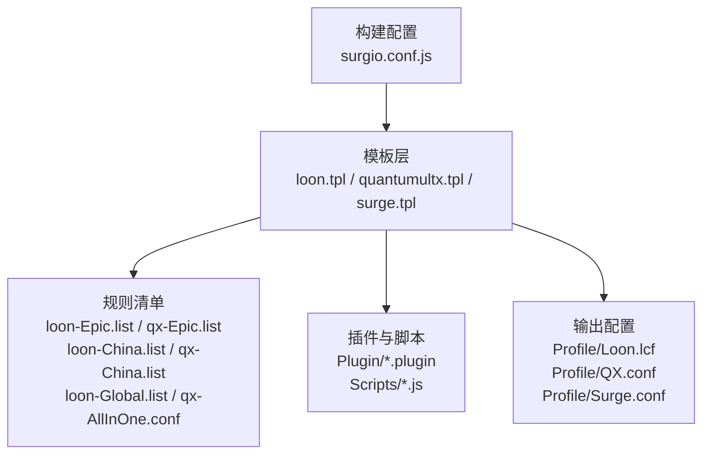
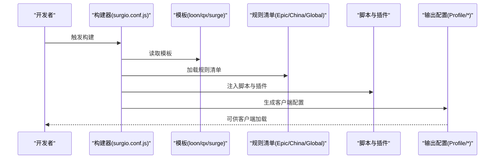
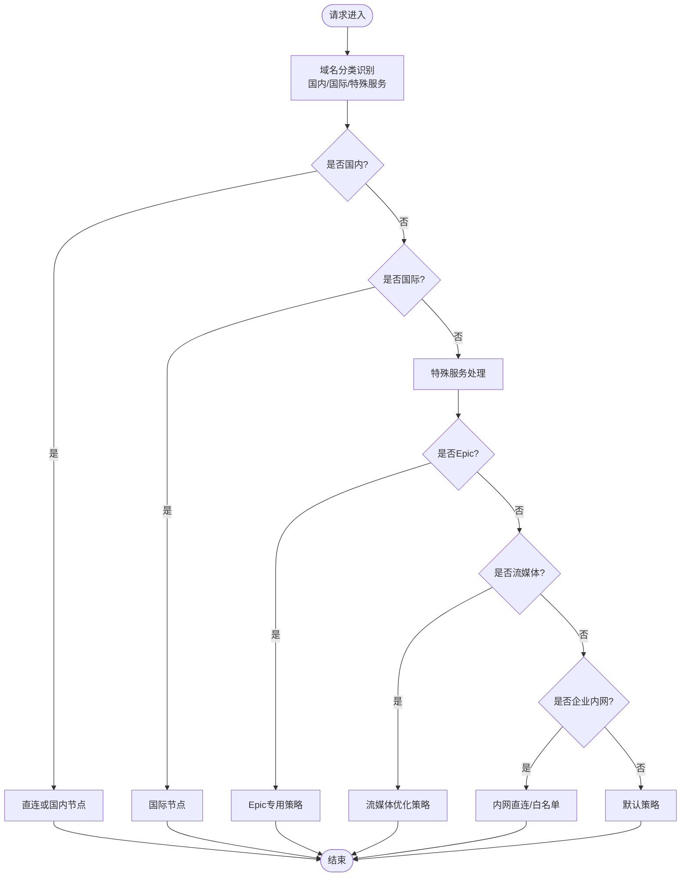
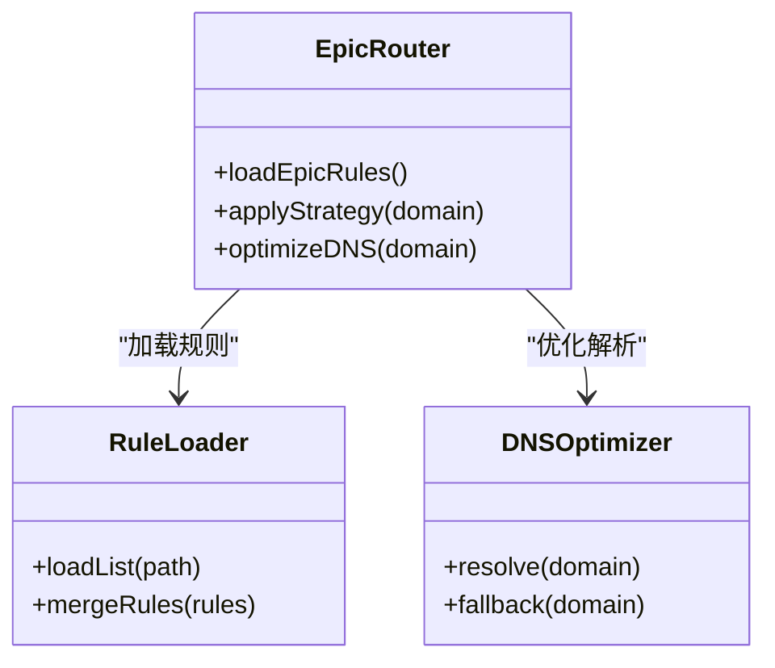
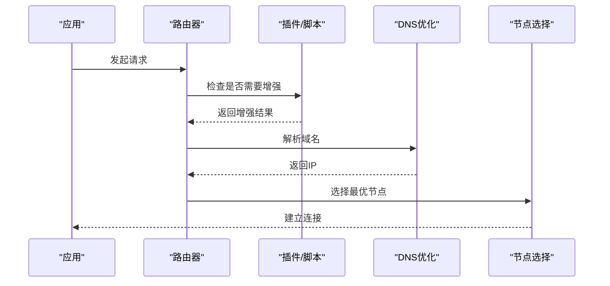
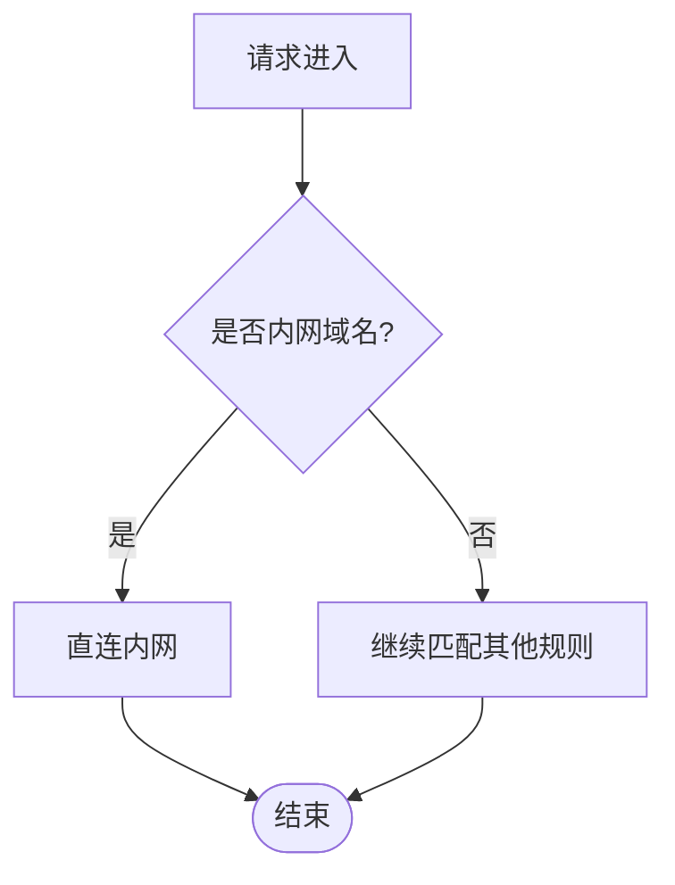
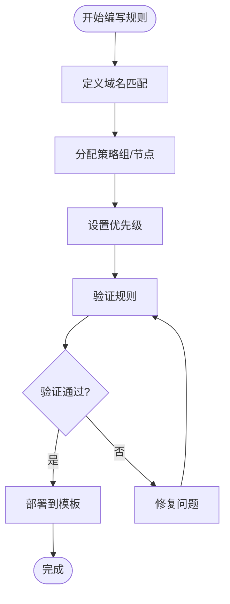
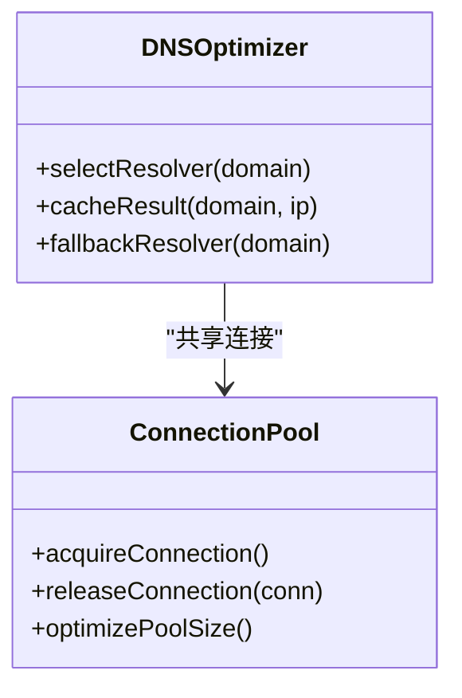
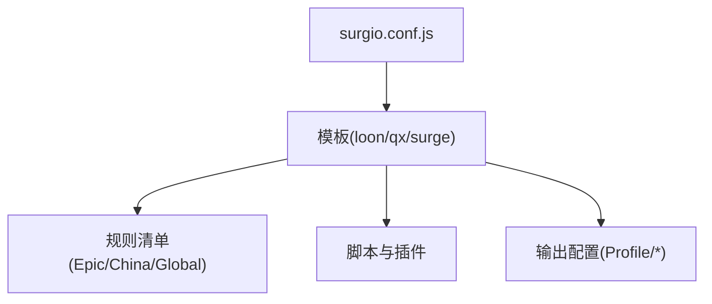

# 域名路由规则

<cite>
**本文引用的文件**   
- [surgio.conf.js](file://surgio.conf.js)
- [template/loon.tpl](file://template/loon.tpl)
- [template/quantumultx.tpl](file://template/quantumultx.tpl)
- [template/surge.tpl](file://template/surge.tpl)
- [Profile/Loon.lcf](file://Profile/Loon.lcf)
- [Profile/QX.conf](file://Profile/QX.conf)
- [Profile/Surge.conf](file://Profile/Surge.conf)
- [Mirror/rules/loon-Epic.list](file://Mirror/rules/loon-Epic.list)
- [Mirror/rules/qx-Epic.list](file://Mirror/rules/qx-Epic.list)
- [Mirror/rules/loon-China.list](file://Mirror/rules/loon-China.list)
- [Mirror/rules/qx-China.list](file://Mirror/rules/qx-China.list)
- [Mirror/rules/loon-Global.list](file://Mirror/rules/loon-Global.list)
- [Mirror/rules/qx-AllInOne.conf](file://Mirror/rules/qx-AllInOne.conf)
- [Plugin/bilibili.plugin](file://Plugin/bilibili.plugin)
- [Plugin/netease.plugin](file://Plugin/netease.plugin)
- [Plugin/wechat.plugin](file://Plugin/wechat.plugin)
- [Scripts/Amap.js](file://Scripts/Amap.js)
- [Scripts/JD.js](file://Scripts/JD.js)
- [Scripts/Reddit.js](file://Scripts/Reddit.js)
- [doc/infrastructure.md](file://doc/infrastructure.md)
</cite>

## 目录
1. [简介](#简介)
2. [项目结构](#项目结构)
3. [核心组件](#核心组件)
4. [架构总览](#架构总览)
5. [详细组件分析](#详细组件分析)
6. [依赖关系分析](#依赖关系分析)
7. [性能考量](#性能考量)
8. [故障排查指南](#故障排查指南)
9. [结论](#结论)
10. [附录](#附录)

## 简介
本文件面向使用 Surge、Quantumult X、Loon 等代理工具的用户与开发者，系统化说明本仓库的域名路由规则体系：包括域名分类（国内、国际、特殊服务）、路由策略与流量分发机制、Epic 游戏服务与流媒体平台的特殊处理、企业内网访问策略、自定义规则编写方法与优先级配置，以及 DNS 解析优化与连接池管理机制。文档以“从模板到生成配置”的构建流程为主线，结合具体配置文件与规则清单，帮助读者快速理解并扩展路由能力。

## 项目结构
本项目采用“模板 + 规则清单 + 插件脚本 + 构建配置”的组织方式：
- 模板层：为不同客户端（Surge、QX、Loon）提供统一的结构化模板，集中定义分组、策略组、DNS、分流与脚本注入点。
- 规则层：按平台与用途拆分规则清单，如 Epic、China、Global、AllInOne 等，便于维护与复用。
- 插件与脚本：针对特定应用或场景提供增强逻辑（如广告屏蔽、地理定位、流量统计）。
- 构建配置：通过 surgio.conf.js 将模板与规则组合，输出各客户端的最终配置文件。

**图示来源**
- [surgio.conf.js](file://surgio.conf.js)
- [template/loon.tpl](file://template/loon.tpl)
- [template/quantumultx.tpl](file://template/quantumultx.tpl)
- [template/surge.tpl](file://template/surge.tpl)
- [Profile/Loon.lcf](file://Profile/Loon.lcf)
- [Profile/QX.conf](file://Profile/QX.conf)
- [Profile/Surge.conf](file://Profile/Surge.conf)

**章节来源**
- [surgio.conf.js](file://surgio.conf.js)
- [doc/infrastructure.md](file://doc/infrastructure.md)

## 核心组件
- 构建配置（surgio.conf.js）：负责加载模板、合并规则、注入脚本与插件，生成目标客户端的配置。
- 模板（loon.tpl、quantumultx.tpl、surge.tpl）：定义分组、策略组、DNS、分流规则、脚本注入点与通用开关。
- 规则清单（Epic、China、Global、AllInOne 等）：按业务域划分，明确域名匹配与路由目标。
- 插件与脚本（Plugin/*.plugin、Scripts/*.js）：实现应用级增强（如广告拦截、地理位置修正、流量通知）。
- 输出配置（Profile/*）：最终供客户端加载使用的配置文件。

**章节来源**
- [surgio.conf.js](file://surgio.conf.js)
- [template/loon.tpl](file://template/loon.tpl)
- [template/quantumultx.tpl](file://template/quantumultx.tpl)
- [template/surge.tpl](file://template/surge.tpl)
- [Mirror/rules/loon-Epic.list](file://Mirror/rules/loon-Epic.list)
- [Mirror/rules/qx-Epic.list](file://Mirror/rules/qx-Epic.list)
- [Mirror/rules/loon-China.list](file://Mirror/rules/loon-China.list)
- [Mirror/rules/qx-China.list](file://Mirror/rules/qx-China.list)
- [Mirror/rules/loon-Global.list](file://Mirror/rules/loon-Global.list)
- [Mirror/rules/qx-AllInOne.conf](file://Mirror/rules/qx-AllInOne.conf)
- [Plugin/bilibili.plugin](file://Plugin/bilibili.plugin)
- [Plugin/netease.plugin](file://Plugin/netease.plugin)
- [Plugin/wechat.plugin](file://Plugin/wechat.plugin)
- [Scripts/Amap.js](file://Scripts/Amap.js)
- [Scripts/JD.js](file://Scripts/JD.js)
- [Scripts/Reddit.js](file://Scripts/Reddit.js)

## 架构总览
整体路由架构遵循“模板驱动 + 规则分层 + 脚本增强”的模式：
- 模板层定义统一的分组与策略组，确保多客户端一致性。
- 规则层按业务域拆分，支持增量更新与独立维护。
- 脚本层在关键节点注入逻辑，完成动态判断与增强功能。
- 构建阶段将模板与规则合并，输出可直接被客户端加载的配置。

**图示来源**
- [surgio.conf.js](file://surgio.conf.js)
- [template/loon.tpl](file://template/loon.tpl)
- [template/quantumultx.tpl](file://template/quantumultx.tpl)
- [template/surge.tpl](file://template/surge.tpl)
- [Mirror/rules/loon-Epic.list](file://Mirror/rules/loon-Epic.list)
- [Mirror/rules/qx-Epic.list](file://Mirror/rules/qx-Epic.list)
- [Mirror/rules/loon-China.list](file://Mirror/rules/loon-China.list)
- [Mirror/rules/qx-China.list](file://Mirror/rules/qx-China.list)
- [Mirror/rules/loon-Global.list](file://Mirror/rules/loon-Global.list)
- [Mirror/rules/qx-AllInOne.conf](file://Mirror/rules/qx-AllInOne.conf)
- [Profile/Loon.lcf](file://Profile/Loon.lcf)
- [Profile/QX.conf](file://Profile/QX.conf)
- [Profile/Surge.conf](file://Profile/Surge.conf)

## 详细组件分析

### 域名分类体系与路由策略
- 国内域名（China）：优先直连或走国内节点，降低延迟与成本。
- 国际域名（Global）：默认走国际出口，保障海外访问体验。
- 特殊服务（Epic、流媒体、企业内网等）：根据业务特性定制策略，必要时进行 DNS 劫持或脚本增强。

**图示来源**
- [Mirror/rules/loon-China.list](file://Mirror/rules/loon-China.list)
- [Mirror/rules/qx-China.list](file://Mirror/rules/qx-China.list)
- [Mirror/rules/loon-Global.list](file://Mirror/rules/loon-Global.list)
- [Mirror/rules/loon-Epic.list](file://Mirror/rules/loon-Epic.list)
- [Mirror/rules/qx-Epic.list](file://Mirror/rules/qx-Epic.list)
- [Mirror/rules/qx-AllInOne.conf](file://Mirror/rules/qx-AllInOne.conf)

**章节来源**
- [Mirror/rules/loon-China.list](file://Mirror/rules/loon-China.list)
- [Mirror/rules/qx-China.list](file://Mirror/rules/qx-China.list)
- [Mirror/rules/loon-Global.list](file://Mirror/rules/loon-Global.list)
- [Mirror/rules/loon-Epic.list](file://Mirror/rules/loon-Epic.list)
- [Mirror/rules/qx-Epic.list](file://Mirror/rules/qx-Epic.list)
- [Mirror/rules/qx-AllInOne.conf](file://Mirror/rules/qx-AllInOne.conf)

### Epic 游戏服务特殊处理
- 规则清单：分别提供 Loon 与 QX 的 Epic 域名列表，确保跨客户端一致性。
- 路由策略：Epic 相关域名通常走低延迟节点或专用出站，避免游戏抖动。
- DNS 优化：对 Epic 域名启用精准解析，减少解析失败与回退。

**图示来源**
- [Mirror/rules/loon-Epic.list](file://Mirror/rules/loon-Epic.list)
- [Mirror/rules/qx-Epic.list](file://Mirror/rules/qx-Epic.list)
- [template/quantumultx.tpl](file://template/quantumultx.tpl)
- [template/surge.tpl](file://template/surge.tpl)
- [template/loon.tpl](file://template/loon.tpl)

**章节来源**
- [Mirror/rules/loon-Epic.list](file://Mirror/rules/loon-Epic.list)
- [Mirror/rules/qx-Epic.list](file://Mirror/rules/qx-Epic.list)
- [template/quantumultx.tpl](file://template/quantumultx.tpl)
- [template/surge.tpl](file://template/surge.tpl)
- [template/loon.tpl](file://template/loon.tpl)

### 流媒体平台特殊处理
- 典型平台：Bilibili、NetEase 音乐等，通过插件与脚本实现广告屏蔽、地域解锁与画质优化。
- 路由策略：优先选择低延迟、高带宽节点，必要时进行 DNS 劫持以获取最优 IP。
- 脚本增强：在请求生命周期中注入逻辑，提升用户体验。

**图示来源**
- [Plugin/bilibili.plugin](file://Plugin/bilibili.plugin)
- [Plugin/netease.plugin](file://Plugin/netease.plugin)
- [Scripts/Amap.js](file://Scripts/Amap.js)
- [Scripts/JD.js](file://Scripts/JD.js)
- [Scripts/Reddit.js](file://Scripts/Reddit.js)

**章节来源**
- [Plugin/bilibili.plugin](file://Plugin/bilibili.plugin)
- [Plugin/netease.plugin](file://Plugin/netease.plugin)
- [Scripts/Amap.js](file://Scripts/Amap.js)
- [Scripts/JD.js](file://Scripts/JD.js)
- [Scripts/Reddit.js](file://Scripts/Reddit.js)

### 企业内网特殊处理
- 白名单机制：企业内网域名直接直连，避免经过代理导致延迟或阻断。
- 路由策略：优先匹配内网规则，确保内部资源可访问性。
- DNS 优化：对内网域名禁用外部 DNS，防止解析污染。

**图示来源**
- [Mirror/rules/qx-AllInOne.conf](file://Mirror/rules/qx-AllInOne.conf)
- [template/quantumultx.tpl](file://template/quantumultx.tpl)
- [template/surge.tpl](file://template/surge.tpl)
- [template/loon.tpl](file://template/loon.tpl)

**章节来源**
- [Mirror/rules/qx-AllInOne.conf](file://Mirror/rules/qx-AllInOne.conf)
- [template/quantumultx.tpl](file://template/quantumultx.tpl)
- [template/surge.tpl](file://template/surge.tpl)
- [template/loon.tpl](file://template/loon.tpl)

### 自定义路由规则编写方法与优先级配置
- 编写方法：在规则清单中添加域名匹配表达式，指定目标策略组或节点。
- 优先级配置：通过模板中的规则顺序与条件判断控制优先级，确保关键规则优先命中。
- 验证方法：使用测试用例与日志输出验证规则生效情况。

**图示来源**
- [Mirror/rules/loon-Epic.list](file://Mirror/rules/loon-Epic.list)
- [Mirror/rules/qx-Epic.list](file://Mirror/rules/qx-Epic.list)
- [Mirror/rules/loon-China.list](file://Mirror/rules/loon-China.list)
- [Mirror/rules/qx-China.list](file://Mirror/rules/qx-China.list)
- [Mirror/rules/loon-Global.list](file://Mirror/rules/loon-Global.list)
- [Mirror/rules/qx-AllInOne.conf](file://Mirror/rules/qx-AllInOne.conf)

**章节来源**
- [Mirror/rules/loon-Epic.list](file://Mirror/rules/loon-Epic.list)
- [Mirror/rules/qx-Epic.list](file://Mirror/rules/qx-Epic.list)
- [Mirror/rules/loon-China.list](file://Mirror/rules/loon-China.list)
- [Mirror/rules/qx-China.list](file://Mirror/rules/qx-China.list)
- [Mirror/rules/loon-Global.list](file://Mirror/rules/loon-Global.list)
- [Mirror/rules/qx-AllInOne.conf](file://Mirror/rules/qx-AllInOne.conf)

### DNS 解析优化与连接池管理
- DNS 优化：针对不同域名类型启用不同的解析策略，如本地解析、远程解析与缓存策略。
- 连接池管理：复用已建立的连接，减少握手开销，提升并发性能。
- 故障恢复：当主解析失败时自动切换到备用解析源，确保可用性。

**图示来源**
- [template/quantumultx.tpl](file://template/quantumultx.tpl)
- [template/surge.tpl](file://template/surge.tpl)
- [template/loon.tpl](file://template/loon.tpl)

**章节来源**
- [template/quantumultx.tpl](file://template/quantumultx.tpl)
- [template/surge.tpl](file://template/surge.tpl)
- [template/loon.tpl](file://template/loon.tpl)

## 依赖关系分析
- 模板与规则：模板依赖规则清单提供具体的域名匹配与路由目标。
- 脚本与插件：模板在构建时注入脚本与插件，增强运行时行为。
- 构建配置：统一管理模板、规则与脚本的加载顺序与合并策略。

**图示来源**
- [surgio.conf.js](file://surgio.conf.js)
- [template/loon.tpl](file://template/loon.tpl)
- [template/quantumultx.tpl](file://template/quantumultx.tpl)
- [template/surge.tpl](file://template/surge.tpl)
- [Mirror/rules/loon-Epic.list](file://Mirror/rules/loon-Epic.list)
- [Mirror/rules/qx-Epic.list](file://Mirror/rules/qx-Epic.list)
- [Mirror/rules/loon-China.list](file://Mirror/rules/loon-China.list)
- [Mirror/rules/qx-China.list](file://Mirror/rules/qx-China.list)
- [Mirror/rules/loon-Global.list](file://Mirror/rules/loon-Global.list)
- [Mirror/rules/qx-AllInOne.conf](file://Mirror/rules/qx-AllInOne.conf)
- [Profile/Loon.lcf](file://Profile/Loon.lcf)
- [Profile/QX.conf](file://Profile/QX.conf)
- [Profile/Surge.conf](file://Profile/Surge.conf)

**章节来源**
- [surgio.conf.js](file://surgio.conf.js)
- [template/loon.tpl](file://template/loon.tpl)
- [template/quantumultx.tpl](file://template/quantumultx.tpl)
- [template/surge.tpl](file://template/surge.tpl)
- [Mirror/rules/loon-Epic.list](file://Mirror/rules/loon-Epic.list)
- [Mirror/rules/qx-Epic.list](file://Mirror/rules/qx-Epic.list)
- [Mirror/rules/loon-China.list](file://Mirror/rules/loon-China.list)
- [Mirror/rules/qx-China.list](file://Mirror/rules/qx-China.list)
- [Mirror/rules/loon-Global.list](file://Mirror/rules/loon-Global.list)
- [Mirror/rules/qx-AllInOne.conf](file://Mirror/rules/qx-AllInOne.conf)
- [Profile/Loon.lcf](file://Profile/Loon.lcf)
- [Profile/QX.conf](file://Profile/QX.conf)
- [Profile/Surge.conf](file://Profile/Surge.conf)

## 性能考量
- 规则精简：避免过多复杂匹配表达式，提升匹配效率。
- 缓存策略：合理使用 DNS 与连接缓存，减少重复开销。
- 节点选择：基于延迟与带宽动态选择最优节点，提升用户体验。
- 脚本优化：避免阻塞式操作，确保请求链路流畅。

## 故障排查指南
- 规则未生效：检查规则清单语法与优先级，确认模板正确加载。
- 解析失败：查看 DNS 配置与解析源，启用备用解析。
- 连接超时：检查节点状态与网络连通性，调整超时参数。
- 脚本错误：查看脚本日志，定位异常位置并修复。

**章节来源**
- [Mirror/rules/loon-Epic.list](file://Mirror/rules/loon-Epic.list)
- [Mirror/rules/qx-Epic.list](file://Mirror/rules/qx-Epic.list)
- [Mirror/rules/loon-China.list](file://Mirror/rules/loon-China.list)
- [Mirror/rules/qx-China.list](file://Mirror/rules/qx-China.list)
- [Mirror/rules/loon-Global.list](file://Mirror/rules/loon-Global.list)
- [Mirror/rules/qx-AllInOne.conf](file://Mirror/rules/qx-AllInOne.conf)
- [template/quantumultx.tpl](file://template/quantumultx.tpl)
- [template/surge.tpl](file://template/surge.tpl)
- [template/loon.tpl](file://template/loon.tpl)

## 结论
本仓库通过模板化与规则化的方式，实现了灵活、可扩展的域名路由体系。通过对国内、国际与特殊服务的精细化分类与策略配置，结合 DNS 优化与连接池管理，有效提升了网络访问体验与系统稳定性。用户可根据实际需求扩展规则与脚本，满足多样化场景需求。

## 附录
- 最佳实践：定期更新规则清单，监控解析与连接指标，持续优化性能。
- 参考文档：详见 doc/infrastructure.md，了解基础设施设计与演进方向。

**章节来源**
- [doc/infrastructure.md](file://doc/infrastructure.md)