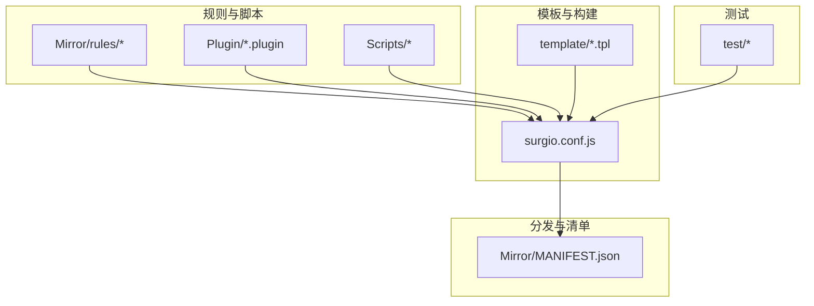
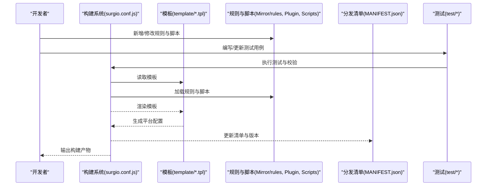
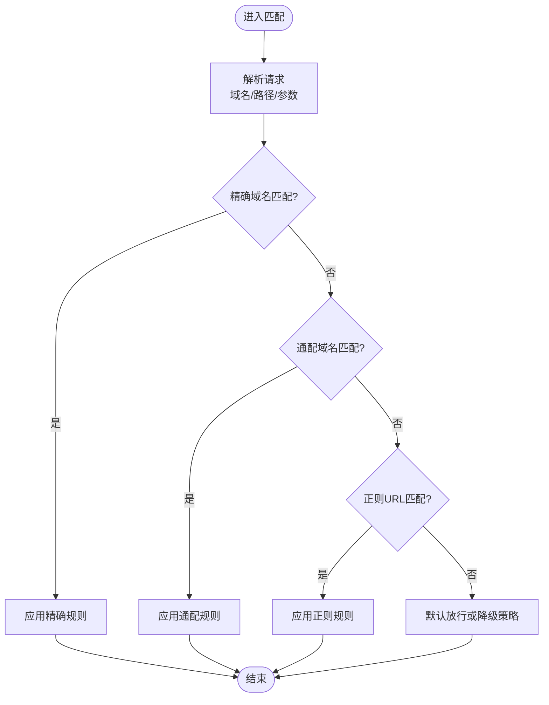
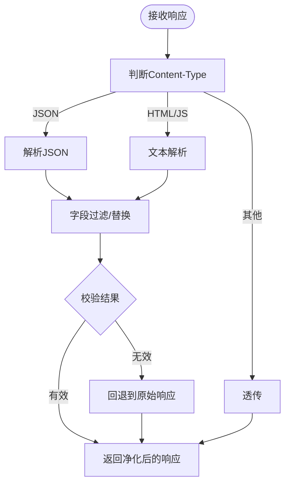
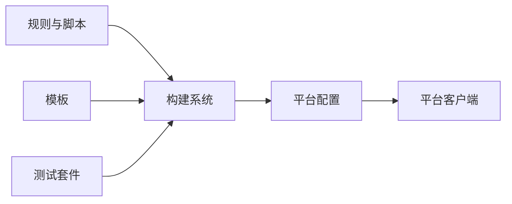

# 广告拦截规则

<cite>
**本文引用的文件**   
- [README.md](file://README.md)
- [surgio.conf.js](file://surgio.conf.js)
- [template/quantumultx.tpl](file://template/quantumultx.tpl)
- [template/loon.tpl](file://template/loon.tpl)
- [template/surge.tpl](file://template/surge.tpl)
- [Mirror/MANIFEST.json](file://Mirror/MANIFEST.json)
- [Mirror/rules/loon-Hijacking.list](file://Mirror/rules/loon-Hijacking.list)
- [Mirror/rules/qx-Hijacking.list](file://Mirror/rules/qx-Hijacking.list)
- [Mirror/rules/loon-Advertising.list](file://Mirror/rules/loon-Advertising.list)
- [Mirror/rules/qx-AllInOne.conf](file://Mirror/rules/qx-AllInOne.conf)
- [Mirror/rules/qx-ddgksf-WeChat.conf](file://Mirror/rules/qx-ddgksf-WeChat.conf)
- [Mirror/rules/qx-bilibili.conf](file://Mirror/rules/qx-bilibili.conf)
- [Plugin/bilibili.plugin](file://Plugin/bilibili.plugin)
- [Plugin/wechat.plugin](file://Plugin/wechat.plugin)
- [Scripts/ENGINE-MANIFEST.json](file://Scripts/ENGINE-MANIFEST.json)
- [test/harness.js](file://test/harness.js)
- [test/run-tests.js](file://test/run-tests.js)
</cite>

## 目录
1. [简介](#简介)
2. [项目结构](#项目结构)
3. [核心组件](#核心组件)
4. [架构总览](#架构总览)
5. [详细组件分析](#详细组件分析)
6. [依赖关系分析](#依赖关系分析)
7. [性能考虑](#性能考虑)
8. [故障排查指南](#故障排查指南)
9. [结论](#结论)
10. [附录](#附录)

## 简介
本仓库提供多平台（Quantumult X、Loon、Surge）的广告拦截与净化规则集，覆盖域名识别、URL模式匹配、响应体过滤、劫持防护与恶意软件检测等能力。通过模板化生成与清单驱动的分发机制，实现规则的集中维护与跨平台复用；同时提供脚本增强与测试框架，便于持续验证与优化。

## 项目结构
- 规则与脚本
  - Mirror/rules：按平台分类的规则清单与脚本（如 Hijacking、Advertising、AllInOne 等）
  - Plugin：应用级插件（如 bilibili、wechat 等），用于精细化拦截与功能增强
  - Scripts：运行时脚本与引擎清单，支持更复杂的响应体处理与业务逻辑
- 模板与构建
  - template：各平台的模板文件，统一生成最终配置
  - surgio.conf.js：构建入口，负责合并、转换与输出
- 分发与清单
  - Mirror/MANIFEST.json：镜像与版本清单，驱动发布与更新
- 测试
  - test：测试用例与运行器，保障规则质量与稳定性

图表来源
- [surgio.conf.js](file://surgio.conf.js)
- [template/quantumultx.tpl](file://template/quantumultx.tpl)
- [template/loon.tpl](file://template/loon.tpl)
- [template/surge.tpl](file://template/surge.tpl)
- [Mirror/MANIFEST.json](file://Mirror/MANIFEST.json)

章节来源
- [README.md](file://README.md)
- [surgio.conf.js](file://surgio.conf.js)
- [Mirror/MANIFEST.json](file://Mirror/MANIFEST.json)

## 核心组件
- 规则清单（Rules）
  - 域名与URL模式：用于识别广告、追踪、弹窗与劫持相关请求
  - 响应体过滤：基于正则或关键字对HTTP响应进行净化
  - 平台差异：不同平台使用各自语法，由模板统一转换
- 插件（Plugins）
  - 针对特定App的精细化策略，如去广告、功能开关、UI净化
- 脚本（Scripts）
  - 复杂场景下的请求/响应处理，如JSON解析、动态替换、条件分支
- 构建与模板（Build & Templates）
  - 将通用规则转换为各平台可用配置，保证一致性与可维护性
- 清单与分发（Manifest & Distribution）
  - 版本管理、镜像地址、校验与更新流程

章节来源
- [Mirror/rules/loon-Hijacking.list](file://Mirror/rules/loon-Hijacking.list)
- [Mirror/rules/qx-Hijacking.list](file://Mirror/rules/qx-Hijacking.list)
- [Mirror/rules/loon-Advertising.list](file://Mirror/rules/loon-Advertising.list)
- [Mirror/rules/qx-AllInOne.conf](file://Mirror/rules/qx-AllInOne.conf)
- [Mirror/rules/qx-ddgksf-WeChat.conf](file://Mirror/rules/qx-ddgksf-WeChat.conf)
- [Mirror/rules/qx-bilibili.conf](file://Mirror/rules/qx-bilibili.conf)
- [Plugin/bilibili.plugin](file://Plugin/bilibili.plugin)
- [Plugin/wechat.plugin](file://Plugin/wechat.plugin)
- [Scripts/ENGINE-MANIFEST.json](file://Scripts/ENGINE-MANIFEST.json)

## 架构总览
整体流程：规则与脚本作为输入，经模板与构建系统转换为各平台配置，并通过清单进行分发与更新。测试套件在构建前后对规则进行静态检查与行为验证。

图表来源
- [surgio.conf.js](file://surgio.conf.js)
- [template/quantumultx.tpl](file://template/quantumultx.tpl)
- [template/loon.tpl](file://template/loon.tpl)
- [template/surge.tpl](file://template/surge.tpl)
- [Mirror/MANIFEST.json](file://Mirror/MANIFEST.json)
- [test/harness.js](file://test/harness.js)
- [test/run-tests.js](file://test/run-tests.js)

## 详细组件分析

### 域名识别与URL模式匹配
- 域名识别
  - 基于黑名单域名集合，精确匹配与通配符匹配结合，优先命中更具体的规则
  - 支持子域继承与白名单豁免，避免误杀
- URL模式匹配
  - 路径段、查询参数与片段标识的组合匹配
  - 正则表达式用于复杂场景（如动态ID、时间戳参数）
- 优先级与短路
  - 规则按优先级排序，命中即停止后续匹配，提升性能
  - 冲突规则通过命名空间与标签隔离

章节来源
- [Mirror/rules/loon-Hijacking.list](file://Mirror/rules/loon-Hijacking.list)
- [Mirror/rules/qx-Hijacking.list](file://Mirror/rules/qx-Hijacking.list)
- [Mirror/rules/loon-Advertising.list](file://Mirror/rules/loon-Advertising.list)
- [Mirror/rules/qx-AllInOne.conf](file://Mirror/rules/qx-AllInOne.conf)

### 响应体过滤机制
- 内容类型判断
  - 根据Content-Type选择JSON、HTML、JS或文本处理路径
- 关键字与正则替换
  - 对广告标记、追踪字段、弹窗触发点进行替换或删除
- 结构化数据清洗
  - JSON字段删除、数组过滤、对象重组，保持数据结构完整性
- 错误与回退
  - 解析失败时记录日志并回退到原始响应，确保可用性

章节来源
- [Mirror/rules/qx-ddgksf-WeChat.conf](file://Mirror/rules/qx-ddgksf-WeChat.conf)
- [Mirror/rules/qx-bilibili.conf](file://Mirror/rules/qx-bilibili.conf)
- [Plugin/bilibili.plugin](file://Plugin/bilibili.plugin)
- [Plugin/wechat.plugin](file://Plugin/wechat.plugin)
- [Scripts/ENGINE-MANIFEST.json](file://Scripts/ENGINE-MANIFEST.json)

### 各类广告的拦截策略
- 视频广告
  - 识别播放列表、预加载、插播接口，阻断或替换为占位数据
  - 对弹幕、推荐流、相关推荐进行净化
- 横幅广告
  - 屏蔽图片资源、样式注入与DOM节点插入
  - 清理页面中的广告容器与占位元素
- 弹窗广告
  - 拦截弹窗触发API、延迟加载脚本与浮层渲染逻辑
  - 禁用自动跳转与下载引导
- 追踪与统计
  - 阻断埋点上报、设备指纹采集与用户画像接口
  - 清理Cookie与本地存储中的追踪信息

章节来源
- [Mirror/rules/loon-Advertising.list](file://Mirror/rules/loon-Advertising.list)
- [Mirror/rules/qx-AllInOne.conf](file://Mirror/rules/qx-AllInOne.conf)
- [Plugin/bilibili.plugin](file://Plugin/bilibili.plugin)
- [Plugin/wechat.plugin](file://Plugin/wechat.plugin)

### 劫持防护与恶意软件检测
- 劫持防护
  - DNS劫持检测：比对解析结果与预期IP段，异常则告警
  - HTTP劫持检测：响应篡改、强制重定向、中间人注入
  - 证书与HTTPS校验：证书链异常与自签证书告警
- 恶意软件检测
  - 特征码匹配：已知恶意域名、哈希值、签名
  - 行为分析：异常下载、静默安装、权限滥用
  - 沙箱与隔离：可疑请求隔离与上报

章节来源
- [Mirror/rules/loon-Hijacking.list](file://Mirror/rules/loon-Hijacking.list)
- [Mirror/rules/qx-Hijacking.list](file://Mirror/rules/qx-Hijacking.list)

### 自定义广告规则编写指南
- 规则格式
  - 域名规则：精确域名、通配符、子域继承
  - URL规则：路径、查询参数、正则表达式
  - 响应体规则：关键字、正则替换、JSON字段操作
- 最佳实践
  - 明确命名与注释，便于维护与审计
  - 使用最小必要范围，避免过度匹配
  - 分层组织规则，按模块与优先级划分
- 调试方法
  - 启用详细日志，捕获请求与响应
  - 使用测试用例验证规则命中与效果
  - 逐步缩小范围，定位问题根因

章节来源
- [template/quantumultx.tpl](file://template/quantumultx.tpl)
- [template/loon.tpl](file://template/loon.tpl)
- [template/surge.tpl](file://template/surge.tpl)
- [test/harness.js](file://test/harness.js)
- [test/run-tests.js](file://test/run-tests.js)

### 测试方法与验证流程
- 单元测试
  - 针对单个规则或脚本的输入输出验证
  - 模拟网络请求与响应，断言拦截效果
- 集成测试
  - 端到端流程验证，包括构建、分发与部署
  - 多平台兼容性测试，确保规则一致性
- 回归测试
  - 变更影响评估，防止引入新问题
  - 性能基准测试，监控规则开销

章节来源
- [test/harness.js](file://test/harness.js)
- [test/run-tests.js](file://test/run-tests.js)

### 规则更新机制
- 版本管理
  - 通过清单文件定义版本号、发布日期与变更说明
  - 增量更新与全量更新策略
- 镜像与分发
  - 多区域镜像加速下载
  - 校验和验证确保完整性
- 自动化流水线
  - CI/CD集成，自动构建、测试与发布
  - 健康检查与回滚机制

章节来源
- [Mirror/MANIFEST.json](file://Mirror/MANIFEST.json)
- [surgio.conf.js](file://surgio.conf.js)

## 依赖关系分析
- 内部依赖
  - 规则与脚本被构建系统加载并渲染到模板
  - 模板依赖规则变量与上下文数据
  - 测试套件依赖构建产物与规则集
- 外部依赖
  - 平台客户端（Quantumult X、Loon、Surge）的语法与能力
  - 网络环境与DNS解析服务
  - 第三方规则源与上游更新

图表来源
- [surgio.conf.js](file://surgio.conf.js)
- [template/quantumultx.tpl](file://template/quantumultx.tpl)
- [template/loon.tpl](file://template/loon.tpl)
- [template/surge.tpl](file://template/surge.tpl)
- [test/harness.js](file://test/harness.js)
- [test/run-tests.js](file://test/run-tests.js)

章节来源
- [surgio.conf.js](file://surgio.conf.js)
- [Mirror/MANIFEST.json](file://Mirror/MANIFEST.json)

## 性能考虑
- 规则优化
  - 减少正则复杂度，优先使用精确匹配
  - 合并相似规则，降低匹配次数
  - 使用索引与缓存提升命中率
- 脚本优化
  - 避免阻塞式I/O，采用异步处理
  - 限制内存占用，及时释放临时对象
  - 批量处理请求，减少上下文切换
- 构建优化
  - 增量构建，仅重新编译变更部分
  - 并行处理任务，缩短构建时间
  - 压缩与分片，优化传输体积

## 故障排查指南
- 常见问题
  - 规则不生效：检查优先级与命中顺序
  - 误拦截：核对白名单与例外规则
  - 性能下降：分析慢查询与复杂正则
- 诊断工具
  - 启用详细日志，捕获请求与响应
  - 使用抓包工具验证网络行为
  - 运行测试套件定位问题
- 修复步骤
  - 逐步缩小范围，定位根因
  - 更新规则与脚本，回归测试验证
  - 提交变更并通知团队

## 结论
本仓库通过模块化规则、模板化构建与清单驱动分发，实现了跨平台的广告拦截与净化能力。结合脚本增强与测试框架，确保了规则的质量与可维护性。建议持续优化规则性能与覆盖率，加强劫持防护与恶意软件检测，为用户提供更安全、纯净的网络体验。

## 附录
- 术语表
  - 劫持：指网络请求被非法篡改或重定向的行为
  - 响应体过滤：对HTTP响应内容进行清洗与替换
  - 清单：描述版本、镜像与校验信息的配置文件
- 参考链接
  - 平台文档：Quantumult X、Loon、Surge官方文档
  - 上游规则源：社区贡献的规则集与脚本