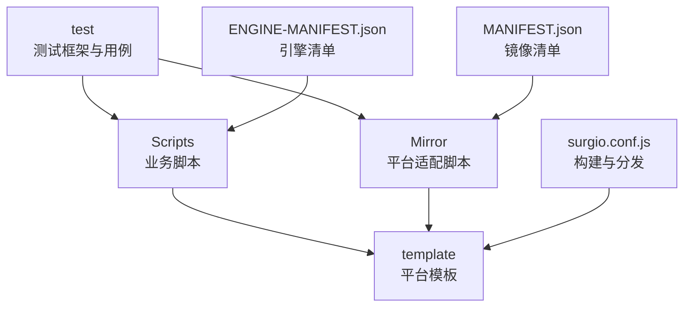
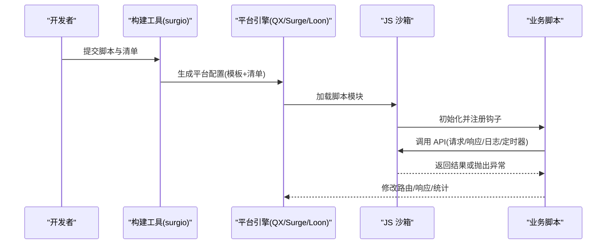
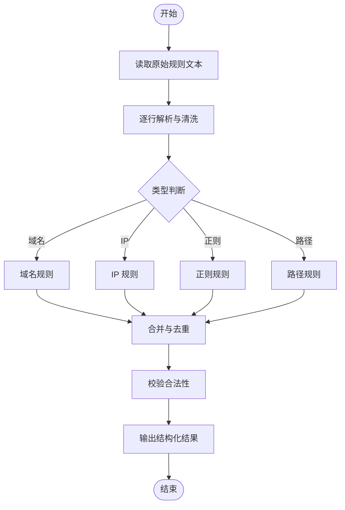
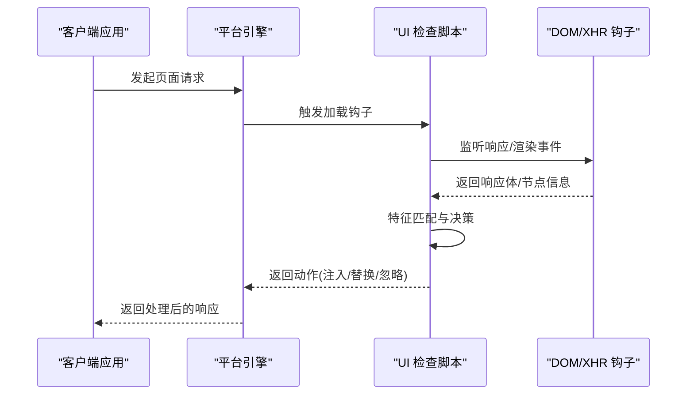
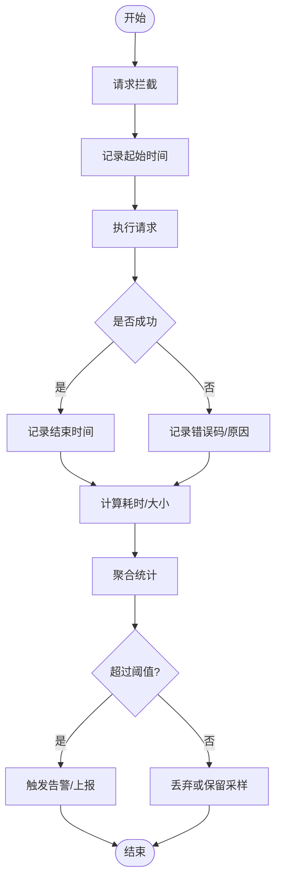
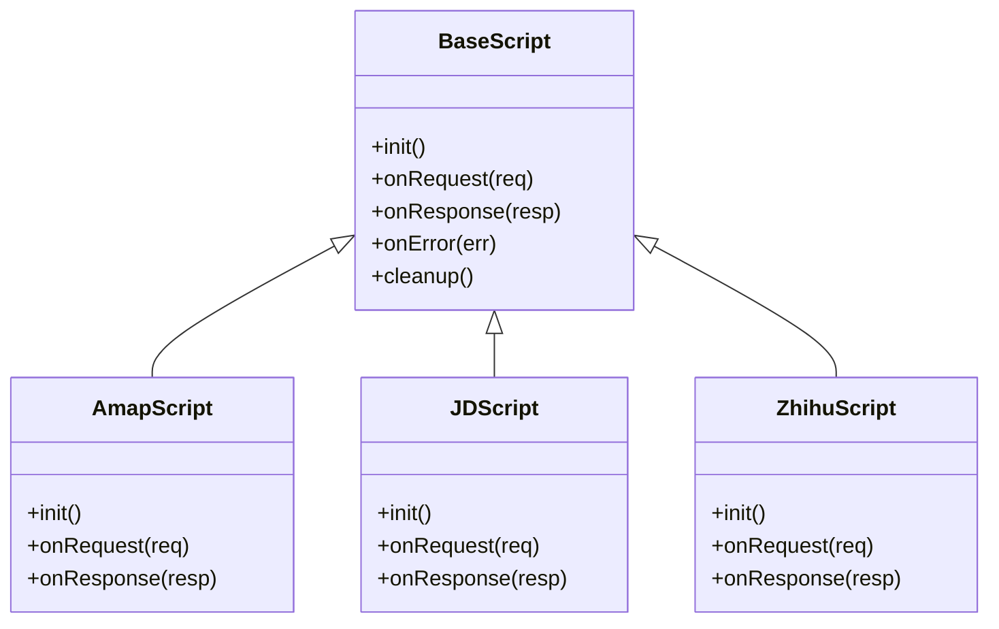
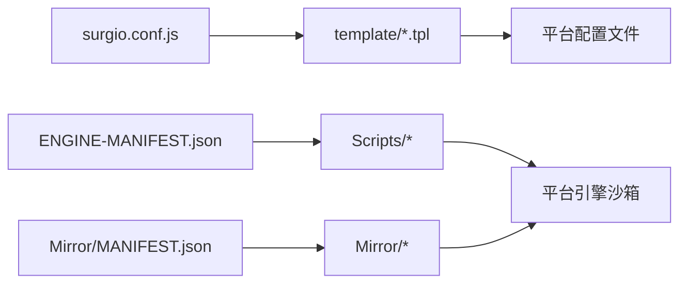

# 脚本规则系统

<cite>
**本文引用的文件**   
- [README.md](file://README.md)
- [package.json](file://package.json)
- [surgio.conf.js](file://surgio.conf.js)
- [Scripts/ENGINE-MANIFEST.json](file://Scripts/ENGINE-MANIFEST.json)
- [Mirror/MANIFEST.json](file://Mirror/MANIFEST.json)
- [Mirror/qx-resource-parser.js](file://Mirror/qx-resource-parser.js)
- [Mirror/qx-streaming-ui-check.js](file://Mirror/qx-streaming-ui-check.js)
- [Mirror/qx-traffic-check.js](file://Mirror/qx-traffic-check.js)
- [Scripts/Amap.js](file://Scripts/Amap.js)
- [Scripts/Cainiao.js](file://Scripts/Cainiao.js)
- [Scripts/JD.js](file://Scripts/JD.js)
- [Scripts/Qidian.js](file://Scripts/Qidian.js)
- [Scripts/Reddit.js](file://Scripts/Reddit.js)
- [Scripts/Tieba.js](file://Scripts/Tieba.js)
- [Scripts/Zhihu.js](file://Scripts/Zhihu.js)
- [Scripts/Zhihuifangdong.js](file://Scripts/Zhihuifangdong.js)
- [Scripts/health-notify.js](file://Scripts/health-notify.js)
- [Scripts/traffic-notify.js](file://Scripts/traffic-notify.js)
- [test/harness.js](file://test/harness.js)
- [test/run-tests.js](file://test/run-tests.js)
- [template/quantumultx.tpl](file://template/quantumultx.tpl)
- [template/surge.tpl](file://template/surge.tpl)
- [template/loon.tpl](file://template/loon.tpl)
</cite>

## 目录
1. [简介](#简介)
2. [项目结构](#项目结构)
3. [核心组件](#核心组件)
4. [架构总览](#架构总览)
5. [详细组件分析](#详细组件分析)
6. [依赖关系分析](#依赖关系分析)
7. [性能考虑](#性能考虑)
8. [故障排查指南](#故障排查指南)
9. [结论](#结论)
10. [附录](#附录)

## 简介
本仓库是一个面向 Quantumult X、Surge、Loon 等网络工具的脚本与规则集合，提供资源解析器、流媒体 UI 检查、流量分析与健康通知等能力。通过统一的引擎清单与模板化配置，将 JavaScript 脚本嵌入到不同平台的规则引擎中执行，实现可插拔的脚本生命周期管理、错误处理与性能监控。文档重点解释：
- JavaScript 脚本在规则引擎中的执行环境与 API 接口
- 资源解析器、流媒体 UI 检查、流量分析脚本的实现要点
- 脚本生命周期管理、错误处理与性能监控
- 脚本开发指南、调试方法与沙箱安全机制
- 脚本与核心规则引擎的集成方式

## 项目结构
仓库采用“按功能域组织”的结构：
- Scripts：各业务脚本（地图、电商、社区、健康与流量通知等）
- Mirror：平台适配脚本与清单（资源解析、流媒体 UI 检查、流量检查等）
- template：Quantumult X、Surge、Loon 的模板配置文件
- test：测试框架与用例
- surgio.conf.js：构建与分发配置
- ENGINE-MANIFEST.json / MANIFEST.json：引擎与镜像清单

图表来源
- [surgio.conf.js:1-200](file://surgio.conf.js#L1-L200)
- [Scripts/ENGINE-MANIFEST.json:1-200](file://Scripts/ENGINE-MANIFEST.json#L1-L200)
- [Mirror/MANIFEST.json:1-200](file://Mirror/MANIFEST.json#L1-L200)

章节来源
- [README.md:1-200](file://README.md#L1-L200)
- [package.json:1-200](file://package.json#L1-L200)
- [surgio.conf.js:1-200](file://surgio.conf.js#L1-L200)

## 核心组件
- 引擎清单与镜像清单：定义脚本元数据、入口、版本、依赖与发布策略
- 平台模板：为 QX/Surge/Loon 生成最终配置文件，注入脚本与规则
- 脚本运行时：在各平台沙箱中加载并执行 JS 脚本，暴露统一 API
- 测试框架：基于 Node 的测试 harness，用于静态校验与行为验证

章节来源
- [Scripts/ENGINE-MANIFEST.json:1-200](file://Scripts/ENGINE-MANIFEST.json#L1-L200)
- [Mirror/MANIFEST.json:1-200](file://Mirror/MANIFEST.json#L1-L200)
- [template/quantumultx.tpl:1-200](file://template/quantumultx.tpl#L1-L200)
- [template/surge.tpl:1-200](file://template/surge.tpl#L1-L200)
- [template/loon.tpl:1-200](file://template/loon.tpl#L1-L200)

## 架构总览
整体流程：构建阶段读取清单与模板，生成目标平台配置；运行阶段由平台内核加载脚本，进入沙箱环境执行；脚本通过统一 API 访问请求、响应、日志、定时器等能力；异常被捕获并上报或降级。

图表来源
- [surgio.conf.js:1-200](file://surgio.conf.js#L1-L200)
- [template/quantumultx.tpl:1-200](file://template/quantumultx.tpl#L1-L200)
- [template/surge.tpl:1-200](file://template/surge.tpl#L1-L200)
- [template/loon.tpl:1-200](file://template/loon.tpl#L1-L200)

## 详细组件分析

### 资源解析器(qx-resource-parser.js)
职责：
- 解析上游资源列表（如广告、分流、域名/IP 白名单），转换为平台可用格式
- 支持增量更新与去重，降低内存占用
- 输出结构化数据供后续规则匹配使用

关键点：
- 输入：文本型规则集（正则、域名、IP、路径）
- 处理：规范化、分类、合并、过滤
- 输出：平台模板所需的片段或中间数据结构

图表来源
- [Mirror/qx-resource-parser.js:1-200](file://Mirror/qx-resource-parser.js#L1-L200)

章节来源
- [Mirror/qx-resource-parser.js:1-200](file://Mirror/qx-resource-parser.js#L1-L200)

### 流媒体 UI 检查(qx-streaming-ui-check.js)
职责：
- 检测流媒体应用界面元素或特定响应特征，触发本地优化或提示
- 根据检测结果动态调整 UI 或行为（如隐藏广告、切换清晰度）

关键点：
- 事件：页面加载完成、DOM 就绪、XHR/Fetch 回调
- 判定：基于 URL、响应体关键字、状态码、头部字段
- 动作：注入样式、替换内容、记录指标

图表来源
- [Mirror/qx-streaming-ui-check.js:1-200](file://Mirror/qx-streaming-ui-check.js#L1-L200)

章节来源
- [Mirror/qx-streaming-ui-check.js:1-200](file://Mirror/qx-streaming-ui-check.js#L1-L200)

### 流量分析(qx-traffic-check.js)
职责：
- 采集请求/响应的关键指标（大小、耗时、状态码、域名）
- 聚合统计并按阈值告警或上报
- 支持采样与节流，避免影响主链路性能

关键点：
- 采集点：请求前、响应后、错误回调
- 存储：内存缓存 + 周期性落盘（可选）
- 上报：按需触发，限制频率

图表来源
- [Mirror/qx-traffic-check.js:1-200](file://Mirror/qx-traffic-check.js#L1-L200)

章节来源
- [Mirror/qx-traffic-check.js:1-200](file://Mirror/qx-traffic-check.js#L1-L200)

### 业务脚本示例（以 Amap.js、JD.js、Zhihu.js 为例）
共性模式：
- 入口函数：初始化、注册钩子、订阅事件
- 生命周期：启动 -> 监听 -> 处理 -> 清理
- API 使用：请求封装、响应改写、日志记录、定时器调度
- 错误处理：try/catch、降级策略、重试与限流

图表来源
- [Scripts/Amap.js:1-200](file://Scripts/Amap.js#L1-L200)
- [Scripts/JD.js:1-200](file://Scripts/JD.js#L1-L200)
- [Scripts/Zhihu.js:1-200](file://Scripts/Zhihu.js#L1-L200)

章节来源
- [Scripts/Amap.js:1-200](file://Scripts/Amap.js#L1-L200)
- [Scripts/JD.js:1-200](file://Scripts/JD.js#L1-L200)
- [Scripts/Zhihu.js:1-200](file://Scripts/Zhihu.js#L1-L200)

### 健康与流量通知（health-notify.js、traffic-notify.js）
职责：
- 健康检查：周期探测服务可用性，失败时通知
- 流量通知：统计周期内流量消耗，超限提醒

关键点：
- 调度：定时器/事件驱动
- 通知：平台通知 API 或外部回调
- 容错：网络异常、权限不足、重复通知抑制

章节来源
- [Scripts/health-notify.js:1-200](file://Scripts/health-notify.js#L1-L200)
- [Scripts/traffic-notify.js:1-200](file://Scripts/traffic-notify.js#L1-L200)

### 其他业务脚本（Cainiao.js、Qidian.js、Reddit.js、Tieba.js、Zhihuifangdong.js）
- 遵循统一基类与生命周期约定
- 针对各自业务场景定制请求/响应处理逻辑
- 保持低耦合、高内聚，便于独立维护与测试

章节来源
- [Scripts/Cainiao.js:1-200](file://Scripts/Cainiao.js#L1-L200)
- [Scripts/Qidian.js:1-200](file://Scripts/Qidian.js#L1-L200)
- [Scripts/Reddit.js:1-200](file://Scripts/Reddit.js#L1-L200)
- [Scripts/Tieba.js:1-200](file://Scripts/Tieba.js#L1-L200)
- [Scripts/Zhihuifangdong.js:1-200](file://Scripts/Zhihuifangdong.js#L1-L200)

## 依赖关系分析
- 构建期依赖：surgio 配置与模板引擎，负责生成平台配置
- 运行期依赖：平台内核提供的 JS 沙箱 API（请求、响应、日志、定时器）
- 脚本间依赖：通过清单声明入口与模块关系，避免循环依赖

图表来源
- [surgio.conf.js:1-200](file://surgio.conf.js#L1-L200)
- [Scripts/ENGINE-MANIFEST.json:1-200](file://Scripts/ENGINE-MANIFEST.json#L1-L200)
- [Mirror/MANIFEST.json:1-200](file://Mirror/MANIFEST.json#L1-L200)

章节来源
- [surgio.conf.js:1-200](file://surgio.conf.js#L1-L200)
- [Scripts/ENGINE-MANIFEST.json:1-200](file://Scripts/ENGINE-MANIFEST.json#L1-L200)
- [Mirror/MANIFEST.json:1-200](file://Mirror/MANIFEST.json#L1-L200)

## 性能考虑
- 资源解析器：增量解析、去重、惰性加载，减少内存峰值
- 流量分析：采样率控制、批量聚合、异步上报，避免阻塞主线程
- UI 检查：最小化 DOM 操作，延迟绑定事件，条件启用
- 脚本生命周期：及时释放定时器与监听器，防止泄漏
- 错误处理：快速失败与降级，避免级联失败

[本节为通用指导，不直接分析具体文件]

## 故障排查指南
常见问题与定位方法：
- 脚本未生效：检查清单入口与模板注入是否正确
- 请求被拦截：查看请求钩子与匹配规则优先级
- 响应改写失败：确认响应体结构与字段名
- 性能抖动：开启采样与慢查询日志，定位热点代码
- 通知未送达：检查权限与平台通知通道

调试建议：
- 使用测试框架进行静态校验与断言
- 在本地模拟请求/响应，复现问题
- 逐步缩小范围，定位具体脚本与钩子

章节来源
- [test/harness.js:1-200](file://test/harness.js#L1-L200)
- [test/run-tests.js:1-200](file://test/run-tests.js#L1-L200)

## 结论
本脚本规则系统通过清单与模板化的方式，将 JavaScript 脚本无缝集成到多平台规则引擎中。资源解析器、流媒体 UI 检查与流量分析脚本各司其职，配合统一的生命周期管理与错误处理机制，形成可扩展、可观测、可维护的规则体系。建议在开发中遵循统一基类与 API 约定，强化沙箱安全与性能优化，确保稳定与高效。

[本节为总结性内容，不直接分析具体文件]

## 附录
- 开发指南：
  - 新建脚本：复制基类，实现 init/onRequest/onResponse/onError/cleanup
  - 清单注册：在 ENGINE-MANIFEST.json 中添加元数据与入口
  - 模板注入：在对应平台模板中引入脚本片段
  - 单元测试：编写用例覆盖关键分支与边界条件
- 调试方法：
  - 使用测试 harness 模拟请求/响应
  - 打印关键路径日志，避免敏感信息泄露
  - 分步启用脚本，定位问题范围
- 安全沙箱：
  - 限制全局对象与危险 API
  - 白名单域名与协议
  - 超时与内存上限保护

[本节为补充说明，不直接分析具体文件]