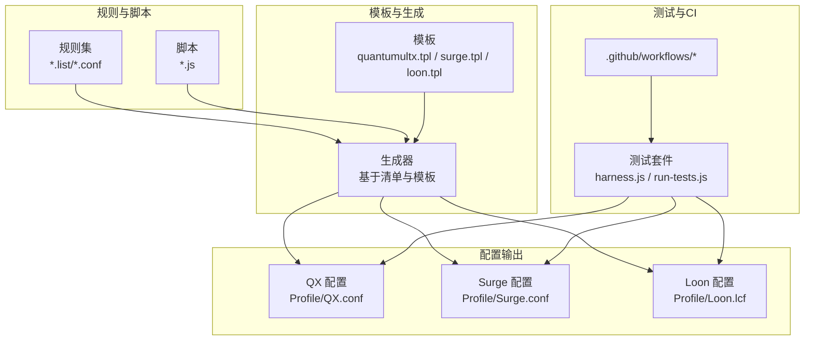
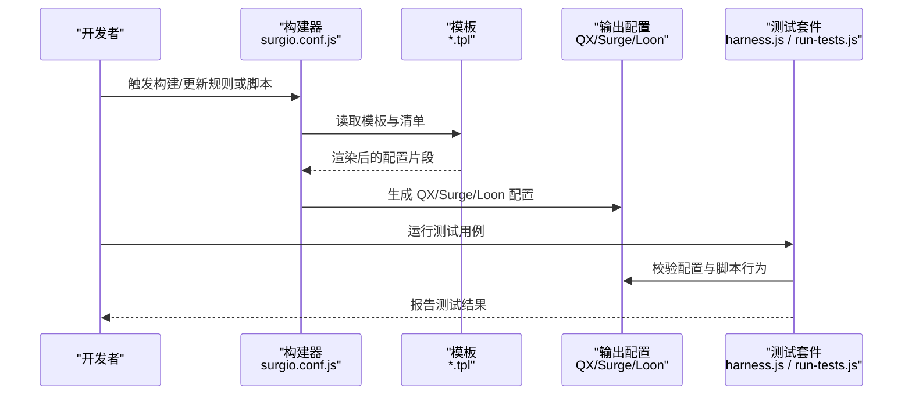
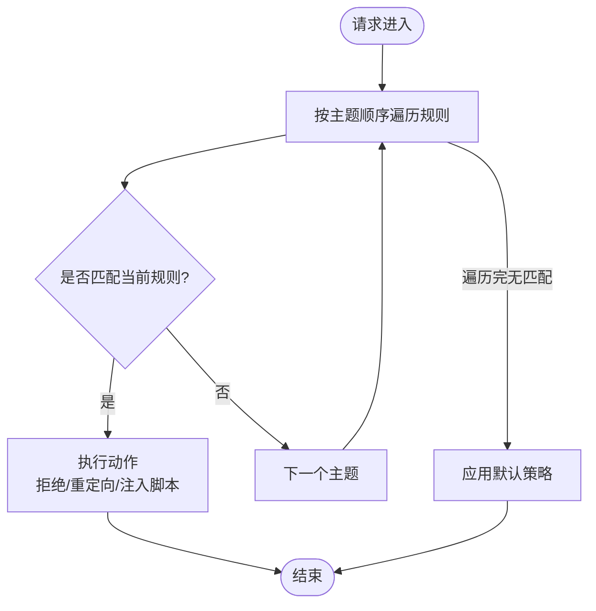
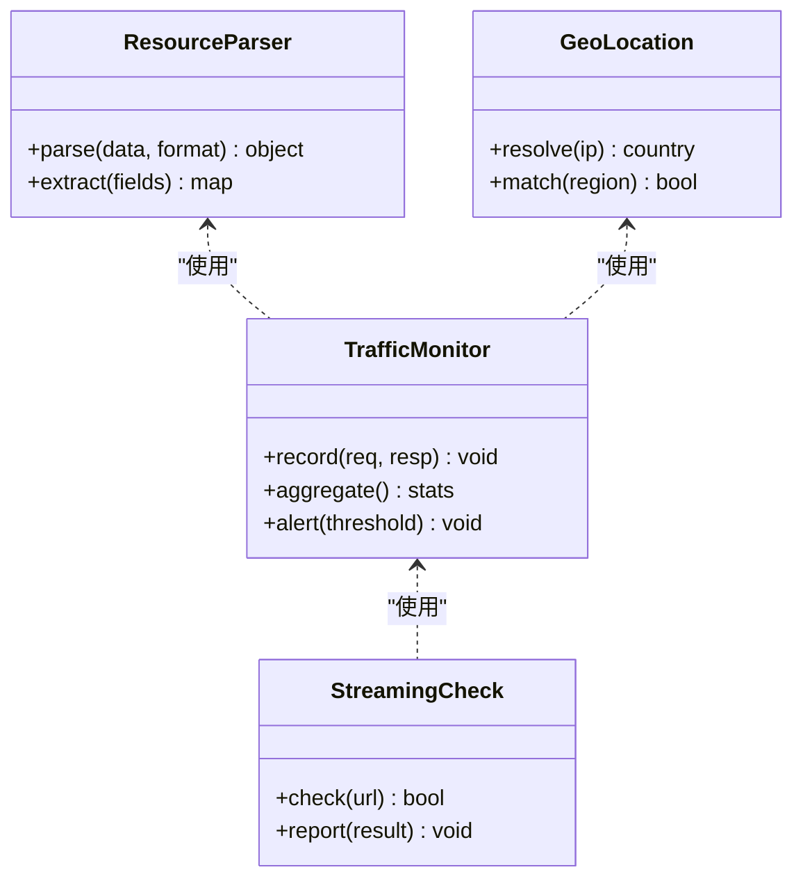
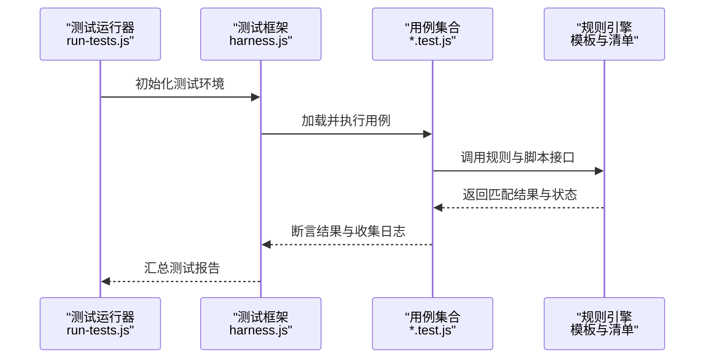
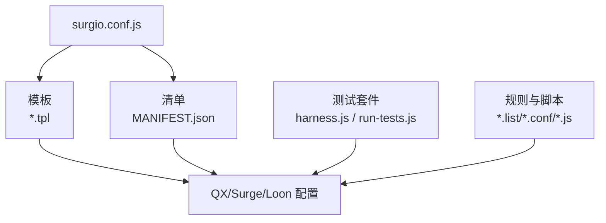

# 规则引擎

<cite>
**本文引用的文件**   
- [README.md](file://README.md)
- [surgio.conf.js](file://surgio.conf.js)
- [package.json](file://package.json)
- [template/quantumultx.tpl](file://template/quantumultx.tpl)
- [template/surge.tpl](file://template/surge.tpl)
- [template/loon.tpl](file://template/loon.tpl)
- [Mirror/MANIFEST.json](file://Mirror/MANIFEST.json)
- [Scripts/ENGINE-MANIFEST.json](file://Scripts/ENGINE-MANIFEST.json)
- [test/harness.js](file://test/harness.js)
- [test/run-tests.js](file://test/run-tests.js)
- [test/cases/purify-scripts.test.js](file://test/cases/purify-scripts.test.js)
- [test/cases/qidian-wrapper.test.js](file://test/cases/qidian-wrapper.test.js)
- [test/cases/zhihu-cainiao.test.js](file://test/cases/zhihu-cainiao.test.js)
- [test/cases/zhihuifangdong.test.js](file://test/cases/zhihuifangdong.test.js)
- [Mirror/rules/loon-Advertising.list](file://Mirror/rules/loon-Advertising.list)
- [Mirror/rules/loon-Hijacking.list](file://Mirror/rules/loon-Hijacking.list)
- [Mirror/rules/loon-China.list](file://Mirror/rules/loon-China.list)
- [Mirror/rules/loon-Epic.list](file://Mirror/rules/loon-Epic.list)
- [Mirror/rules/loon-Global.list](file://Mirror/rules/loon-Global.list)
- [Mirror/rules/loon-Privacy.list](file://Mirror/rules/loon-Privacy.list)
- [Mirror/rules/qx-China.list](file://Mirror/rules/qx-China.list)
- [Mirror/rules/qx-Epic.list](file://Mirror/rules/qx-Epic.list)
- [Mirror/rules/qx-Hijacking.list](file://Mirror/rules/qx-Hijacking.list)
- [Mirror/rules/qx-AllInOne.conf](file://Mirror/rules/qx-AllInOne.conf)
- [Mirror/rules/qx-bilibili.conf](file://Mirror/rules/qx-bilibili.conf)
- [Mirror/rules/qx-ddgksf-AmapAds.conf](file://Mirror/rules/qx-ddgksf-AmapAds.conf)
- [Mirror/rules/qx-ddgksf-BiliBiliComicsAds.conf](file://Mirror/rules/qx-ddgksf-BiliBiliComicsAds.conf)
- [Mirror/rules/qx-ddgksf-CaiYunAds.conf](file://Mirror/rules/qx-ddgksf-CaiYunAds.conf)
- [Mirror/rules/qx-ddgksf-CainiaoAds.conf](file://Mirror/rules/qx-ddgksf-CainiaoAds.conf)
- [Mirror/rules/qx-ddgksf-FakeiOSAds.conf](file://Mirror/rules/qx-ddgksf-FakeiOSAds.conf)
- [Mirror/rules/qx-ddgksf-GoofishAds.conf](file://Mirror/rules/qx-ddgksf-GoofishAds.conf)
- [Mirror/rules/qx-ddgksf-KeepAds.conf](file://Mirror/rules/qx-ddgksf-KeepAds.conf)
- [Mirror/rules/qx-ddgksf-NeteaseAds.conf](file://Mirror/rules/qx-ddgksf-NeteaseAds.conf)
- [Mirror/rules/qx-ddgksf-QiShuiMusicAds.conf](file://Mirror/rules/qx-ddgksf-QiShuiMusicAds.conf)
- [Mirror/rules/qx-ddgksf-RedditAds.conf](file://Mirror/rules/qx-ddgksf-RedditAds.conf)
- [Mirror/rules/qx-ddgksf-SmzdmAds.conf](file://Mirror/rules/qx-ddgksf-SmzdmAds.conf)
- [Mirror/rules/qx-ddgksf-TaoPiaoPiaoAds.conf](file://Mirror/rules/qx-ddgksf-TaoPiaoPiaoAds.conf)
- [Mirror/rules/qx-ddgksf-TieBaAds.conf](file://Mirror/rules/qx-ddgksf-TieBaAds.conf)
- [Mirror/rules/qx-ddgksf-WeChat.conf](file://Mirror/rules/qx-ddgksf-WeChat.conf)
- [Mirror/rules/qx-geo-location.js](file://Mirror/rules/qx-geo-location.js)
- [Mirror/rules/qx-ip-api.js](file://Mirror/rules/qx-ip-api.js)
- [Mirror/rules/qx-resource-parser.js](file://Mirror/rules/qx-resource-parser.js)
- [Mirror/rules/qx-streaming-ui-check.js](file://Mirror/rules/qx-streaming-ui-check.js)
- [Mirror/rules/qx-traffic-check.js](file://Mirror/rules/qx-traffic-check.js)
- [Profile/QX.conf](file://Profile/QX.conf)
- [Profile/Surge.conf](file://Profile/Surge.conf)
- [Profile/Loon.lcf](file://Profile/Loon.lcf)
</cite>

## 目录
1. [简介](#简介)
2. [项目结构](#项目结构)
3. [核心组件](#核心组件)
4. [架构总览](#架构总览)
5. [详细组件分析](#详细组件分析)
6. [依赖关系分析](#依赖关系分析)
7. [性能考量](#性能考量)
8. [故障排查指南](#故障排查指南)
9. [结论](#结论)
10. [附录](#附录)

## 简介
本仓库是一个面向多客户端（Quantumult X、Surge、Loon）的规则与脚本工程，提供广告拦截、域名重定向、流量分析与健康检查等能力。通过模板化生成与清单驱动的方式，将规则集与脚本统一编排，并支持测试验证与持续集成。文档重点解释规则匹配算法、优先级机制与执行流程，说明不同规则格式的语法与用法，给出编写指南、性能优化建议，以及动态加载与热更新思路，并介绍规则测试与验证工具的使用方法。

## 项目结构
本项目采用“规则+脚本+模板+配置”的分层组织方式：
- 规则集：按客户端格式分类存放（.list/.conf），涵盖广告、劫持、中国直连、隐私、全球化等主题。
- 脚本：JS 实现增强逻辑（如资源解析、流量检测、地理定位等）。
- 模板：为不同客户端生成最终配置文件（QX/Surge/Loon）。
- 清单：集中声明规则与脚本的元数据，便于构建与分发。
- 测试：用例与运行器用于校验脚本与规则行为。
- 配置文件：Profile 目录包含各客户端的最终配置入口。

图表来源
- [surgio.conf.js](file://surgio.conf.js)
- [template/quantumultx.tpl](file://template/quantumultx.tpl)
- [template/surge.tpl](file://template/surge.tpl)
- [template/loon.tpl](file://template/loon.tpl)
- [Mirror/MANIFEST.json](file://Mirror/MANIFEST.json)
- [Scripts/ENGINE-MANIFEST.json](file://Scripts/ENGINE-MANIFEST.json)
- [test/harness.js](file://test/harness.js)
- [test/run-tests.js](file://test/run-tests.js)

章节来源
- [README.md](file://README.md)
- [surgio.conf.js](file://surgio.conf.js)
- [package.json](file://package.json)

## 核心组件
- 规则集管理：以 .list/.conf 形式维护多主题规则，按客户端适配输出。
- 脚本引擎：JS 脚本用于资源解析、流量统计、UI 检查、地理定位等增强功能。
- 模板系统：根据目标客户端（QX/Surge/Loon）渲染最终配置。
- 清单驱动：MANIFEST 文件声明规则与脚本的来源、版本与依赖，支撑构建与分发。
- 测试框架：基于 Node.js 的测试运行器与用例集合，覆盖脚本行为与规则匹配。

章节来源
- [Mirror/MANIFEST.json](file://Mirror/MANIFEST.json)
- [Scripts/ENGINE-MANIFEST.json](file://Scripts/ENGINE-MANIFEST.json)
- [test/harness.js](file://test/harness.js)
- [test/run-tests.js](file://test/run-tests.js)

## 架构总览
整体架构围绕“规则与脚本输入 → 模板渲染 → 客户端配置输出 → 测试验证”展开。清单文件作为中心索引，协调规则与脚本的装配；模板负责将抽象规则映射到具体客户端语法；测试套件确保变更安全。

图表来源
- [surgio.conf.js](file://surgio.conf.js)
- [template/quantumultx.tpl](file://template/quantumultx.tpl)
- [template/surge.tpl](file://template/surge.tpl)
- [template/loon.tpl](file://template/loon.tpl)
- [test/harness.js](file://test/harness.js)
- [test/run-tests.js](file://test/run-tests.js)

## 详细组件分析

### 规则匹配算法与优先级机制
- 匹配维度：通常包括域名、IP、URL 关键字、路径、请求方法、响应体特征等。不同客户端对匹配粒度与语法存在差异，模板会进行规范化转换。
- 优先级策略：
  - 精确优先于模糊：更具体的域名/IP 规则优先于泛配。
  - 显式优于隐式：明确指定的重定向/拒绝规则优先于默认策略。
  - 主题顺序：广告拦截、劫持处理、直连/代理等主题按固定顺序合并，后者优先覆盖前者的冲突项。
- 执行流程：
  - 入站请求进入匹配阶段，按主题顺序逐条尝试匹配。
  - 命中后执行动作（拒绝、重定向、放行、注入脚本等）。
  - 若未命中，则回退到默认策略（通常为直连或全局代理）。

章节来源
- [Mirror/rules/loon-Advertising.list](file://Mirror/rules/loon-Advertising.list)
- [Mirror/rules/loon-Hijacking.list](file://Mirror/rules/loon-Hijacking.list)
- [Mirror/rules/qx-Hijacking.list](file://Mirror/rules/qx-Hijacking.list)
- [Mirror/rules/qx-AllInOne.conf](file://Mirror/rules/qx-AllInOne.conf)

### 规则格式与语法（按客户端）
- Quantumult X（.conf/.list）：
  - 支持域名、IP、URL 关键字、路径、方法、响应体等多维匹配。
  - 支持脚本注入与变量替换，适合复杂场景（如广告去噪、UI 检查）。
- Surge（.conf）：
  - 强调规则分组与策略组，常用于分流与重定向。
  - 支持条件表达式与脚本扩展。
- Loon（.lcf/.plugin）：
  - 插件化规则，适合模块化管理与按需加载。
  - 支持脚本与规则组合，便于细粒度控制。

章节来源
- [Profile/QX.conf](file://Profile/QX.conf)
- [Profile/Surge.conf](file://Profile/Surge.conf)
- [Profile/Loon.lcf](file://Profile/Loon.lcf)
- [Mirror/rules/qx-AllInOne.conf](file://Mirror/rules/qx-AllInOne.conf)
- [Mirror/rules/loon-Advertising.list](file://Mirror/rules/loon-Advertising.list)

### 脚本引擎与增强能力
- 资源解析：解析 JSON/XML 等资源，提取关键信息用于匹配或统计。
- 流量分析：统计请求/响应大小、频率，输出告警或报表。
- UI 检查：针对特定页面进行内容校验，辅助定位问题。
- 地理定位：结合 IP 库或服务，判断地理位置，用于分流或合规。

图表来源
- [Mirror/rules/qx-resource-parser.js](file://Mirror/rules/qx-resource-parser.js)
- [Mirror/rules/qx-traffic-check.js](file://Mirror/rules/qx-traffic-check.js)
- [Mirror/rules/qx-geo-location.js](file://Mirror/rules/qx-geo-location.js)
- [Mirror/rules/qx-streaming-ui-check.js](file://Mirror/rules/qx-streaming-ui-check.js)

章节来源
- [Mirror/rules/qx-resource-parser.js](file://Mirror/rules/qx-resource-parser.js)
- [Mirror/rules/qx-traffic-check.js](file://Mirror/rules/qx-traffic-check.js)
- [Mirror/rules/qx-geo-location.js](file://Mirror/rules/qx-geo-location.js)
- [Mirror/rules/qx-streaming-ui-check.js](file://Mirror/rules/qx-streaming-ui-check.js)

### 广告拦截规则类型与用法
- 域名级拦截：直接阻断指定域名或子域。
- URL 关键字拦截：匹配请求路径中的关键词，适用于 API 或静态资源。
- 响应体过滤：基于正则或字段匹配，剔除广告片段。
- 白名单与例外：允许特定域名或路径绕过拦截。

章节来源
- [Mirror/rules/loon-Advertising.list](file://Mirror/rules/loon-Advertising.list)
- [Mirror/rules/qx-ddgksf-AmapAds.conf](file://Mirror/rules/qx-ddgksf-AmapAds.conf)
- [Mirror/rules/qx-ddgksf-BiliBiliComicsAds.conf](file://Mirror/rules/qx-ddgksf-BiliBiliComicsAds.conf)
- [Mirror/rules/qx-ddgksf-CaiYunAds.conf](file://Mirror/rules/qx-ddgksf-CaiYunAds.conf)
- [Mirror/rules/qx-ddgksf-CainiaoAds.conf](file://Mirror/rules/qx-ddgksf-CainiaoAds.conf)
- [Mirror/rules/qx-ddgksf-FakeiOSAds.conf](file://Mirror/rules/qx-ddgksf-FakeiOSAds.conf)
- [Mirror/rules/qx-ddgksf-GoofishAds.conf](file://Mirror/rules/qx-ddgksf-GoofishAds.conf)
- [Mirror/rules/qx-ddgksf-KeepAds.conf](file://Mirror/rules/qx-ddgksf-KeepAds.conf)
- [Mirror/rules/qx-ddgksf-NeteaseAds.conf](file://Mirror/rules/qx-ddgksf-NeteaseAds.conf)
- [Mirror/rules/qx-ddgksf-QiShuiMusicAds.conf](file://Mirror/rules/qx-ddgksf-QiShuiMusicAds.conf)
- [Mirror/rules/qx-ddgksf-RedditAds.conf](file://Mirror/rules/qx-ddgksf-RedditAds.conf)
- [Mirror/rules/qx-ddgksf-SmzdmAds.conf](file://Mirror/rules/qx-ddgksf-SmzdmAds.conf)
- [Mirror/rules/qx-ddgksf-TaoPiaoPiaoAds.conf](file://Mirror/rules/qx-ddgksf-TaoPiaoPiaoAds.conf)
- [Mirror/rules/qx-ddgksf-TieBaAds.conf](file://Mirror/rules/qx-ddgksf-TieBaAds.conf)
- [Mirror/rules/qx-ddgksf-WeChat.conf](file://Mirror/rules/qx-ddgksf-WeChat.conf)

### 域名重定向规则类型与用法
- 域名重定向：将请求指向新的域名或 IP。
- 路径重写：在保留原域名的前提下改写路径。
- 条件重定向：基于用户代理、地区、时间等条件选择目标。
- 回退策略：当目标不可达时回退至原始地址或默认策略。

章节来源
- [Mirror/rules/loon-Hijacking.list](file://Mirror/rules/loon-Hijacking.list)
- [Mirror/rules/qx-Hijacking.list](file://Mirror/rules/qx-Hijacking.list)
- [Mirror/rules/qx-AllInOne.conf](file://Mirror/rules/qx-AllInOne.conf)

### 流量分析规则类型与用法
- 请求计数：统计特定域名或路径的请求次数。
- 带宽统计：累计上传/下载字节数。
- 异常告警：阈值触发通知或阻断。
- 可视化报表：导出统计数据供分析。

章节来源
- [Mirror/rules/qx-traffic-check.js](file://Mirror/rules/qx-traffic-check.js)
- [Scripts/traffic-notify.js](file://Scripts/traffic-notify.js)

### 规则编写指南
- 命名规范：规则名称应清晰表达意图（如“某服务广告”、“某渠道劫持”）。
- 粒度控制：尽量使用精确匹配，减少泛配带来的误伤。
- 主题分离：将广告、劫持、直连等主题分文件管理，便于维护。
- 注释与版本：每条规则附带来源与更新日期，便于追溯。
- 测试先行：新增或修改规则后，运行测试用例验证行为。

章节来源
- [Mirror/MANIFEST.json](file://Mirror/MANIFEST.json)
- [Scripts/ENGINE-MANIFEST.json](file://Scripts/ENGINE-MANIFEST.json)

### 性能优化建议
- 规则排序：高频命中规则前置，降低平均匹配成本。
- 去重合并：合并重复或高度相似的规则，减少冗余。
- 懒加载：按需加载大型规则集或脚本，避免冷启动开销。
- 缓存策略：对解析结果与查询结果进行短期缓存。
- 异步处理：耗时操作（如网络查询）采用异步与超时保护。

章节来源
- [surgio.conf.js](file://surgio.conf.js)
- [template/quantumultx.tpl](file://template/quantumultx.tpl)
- [template/surge.tpl](file://template/surge.tpl)
- [template/loon.tpl](file://template/loon.tpl)

### 动态加载与热更新机制
- 清单驱动：通过 MANIFEST 声明规则与脚本的版本与来源，构建时拉取最新资源。
- 增量更新：仅变更部分规则或脚本时，只重新渲染受影响模块。
- 运行时切换：客户端支持在线更新规则集，无需重启服务。
- 回滚机制：保留上一版本配置，失败时可快速回滚。

章节来源
- [Mirror/MANIFEST.json](file://Mirror/MANIFEST.json)
- [Scripts/ENGINE-MANIFEST.json](file://Scripts/ENGINE-MANIFEST.json)
- [surgio.conf.js](file://surgio.conf.js)

### 规则测试与验证工具使用方法
- 测试运行器：使用 harness.js 与 run-tests.js 执行用例。
- 用例组织：按功能模块划分测试文件，覆盖正常与异常路径。
- 断言与日志：每个用例包含预期结果与实际输出对比，并记录关键日志。
- 持续集成：GitHub Actions 在提交时自动运行测试与构建。

图表来源
- [test/harness.js](file://test/harness.js)
- [test/run-tests.js](file://test/run-tests.js)
- [test/cases/purify-scripts.test.js](file://test/cases/purify-scripts.test.js)
- [test/cases/qidian-wrapper.test.js](file://test/cases/qidian-wrapper.test.js)
- [test/cases/zhihu-cainiao.test.js](file://test/cases/zhihu-cainiao.test.js)
- [test/cases/zhihuifangdong.test.js](file://test/cases/zhihuifangdong.test.js)

章节来源
- [test/harness.js](file://test/harness.js)
- [test/run-tests.js](file://test/run-tests.js)
- [test/cases/purify-scripts.test.js](file://test/cases/purify-scripts.test.js)
- [test/cases/qidian-wrapper.test.js](file://test/cases/qidian-wrapper.test.js)
- [test/cases/zhihu-cainiao.test.js](file://test/cases/zhihu-cainiao.test.js)
- [test/cases/zhihuifangdong.test.js](file://test/cases/zhihuifangdong.test.js)

## 依赖关系分析
- 构建依赖：surgio.conf.js 协调模板与清单，生成各客户端配置。
- 运行时依赖：规则与脚本在客户端中执行，依赖其内置能力（如脚本引擎、网络栈）。
- 测试依赖：Node.js 环境与测试框架用于本地与 CI 验证。

图表来源
- [surgio.conf.js](file://surgio.conf.js)
- [template/quantumultx.tpl](file://template/quantumultx.tpl)
- [template/surge.tpl](file://template/surge.tpl)
- [template/loon.tpl](file://template/loon.tpl)
- [Mirror/MANIFEST.json](file://Mirror/MANIFEST.json)
- [Scripts/ENGINE-MANIFEST.json](file://Scripts/ENGINE-MANIFEST.json)
- [test/harness.js](file://test/harness.js)
- [test/run-tests.js](file://test/run-tests.js)

章节来源
- [surgio.conf.js](file://surgio.conf.js)
- [package.json](file://package.json)

## 性能考量
- 规则规模控制：定期清理过期规则，合并相似条目。
- 匹配效率提升：优先精确匹配，减少正则复杂度。
- 脚本优化：避免阻塞式 I/O，合理使用缓存与批处理。
- 内存占用：限制大对象生命周期，及时释放引用。
- 并发控制：在高并发场景下限流与降级。

[本节为通用指导，不直接分析具体文件]

## 故障排查指南
- 常见错误：
  - 规则语法错误：检查 .list/.conf 语法是否符合客户端规范。
  - 脚本执行异常：查看控制台日志与断点调试。
  - 匹配失效：确认规则优先级与命中顺序。
  - 热更新失败：检查清单版本与网络可达性。
- 诊断步骤：
  - 启用详细日志，定位失败节点。
  - 缩小范围，逐步隔离问题规则或脚本。
  - 使用测试用例复现问题，修复后回归验证。

章节来源
- [test/harness.js](file://test/harness.js)
- [test/run-tests.js](file://test/run-tests.js)

## 结论
本项目通过模板化与清单驱动，实现了跨客户端的规则与脚本统一管理，具备广告拦截、域名重定向、流量分析等丰富能力。遵循良好的编写规范与测试流程，可保障规则质量与系统稳定性。结合性能优化与动态更新机制，可在大规模场景下保持高效与可靠。

[本节为总结性内容，不直接分析具体文件]

## 附录
- 术语表：
  - 规则集：一组按主题组织的匹配与动作定义。
  - 模板：用于生成客户端配置的抽象描述。
  - 清单：声明规则与脚本元数据的索引文件。
  - 测试套件：用于验证规则与脚本行为的用例集合。
- 参考文件：
  - README.md：项目概述与使用说明。
  - surgio.conf.js：构建与生成逻辑。
  - package.json：依赖与脚本命令。
  - template/*.tpl：客户端模板。
  - Mirror/MANIFEST.json 与 Scripts/ENGINE-MANIFEST.json：清单文件。
  - test/*：测试框架与用例。

章节来源
- [README.md](file://README.md)
- [surgio.conf.js](file://surgio.conf.js)
- [package.json](file://package.json)
- [template/quantumultx.tpl](file://template/quantumultx.tpl)
- [template/surge.tpl](file://template/surge.tpl)
- [template/loon.tpl](file://template/loon.tpl)
- [Mirror/MANIFEST.json](file://Mirror/MANIFEST.json)
- [Scripts/ENGINE-MANIFEST.json](file://Scripts/ENGINE-MANIFEST.json)
- [test/harness.js](file://test/harness.js)
- [test/run-tests.js](file://test/run-tests.js)