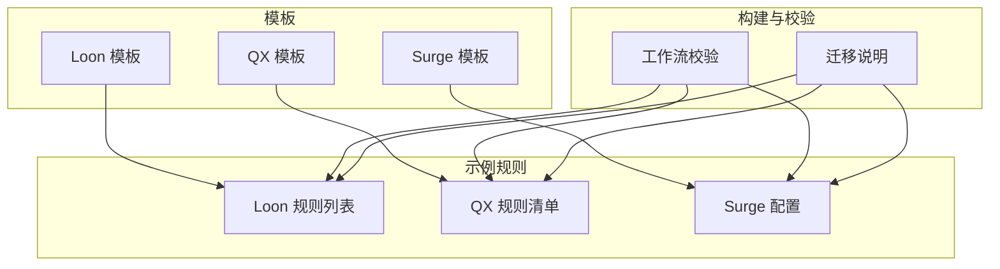
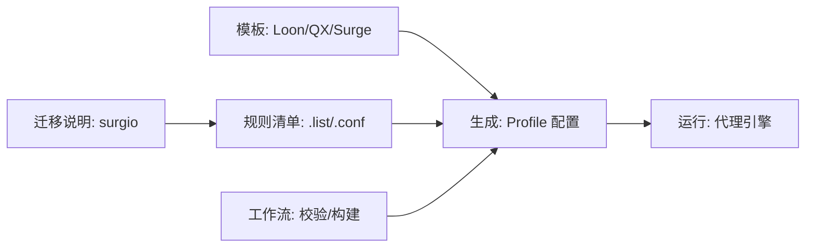
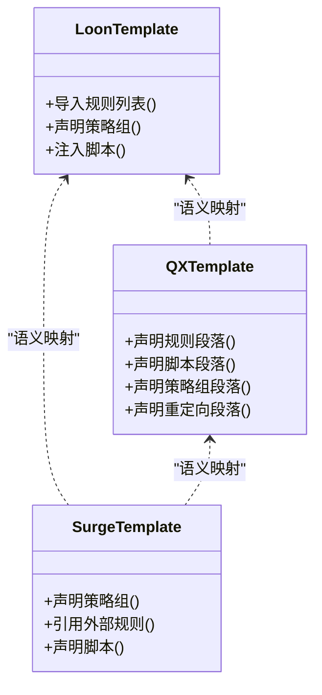
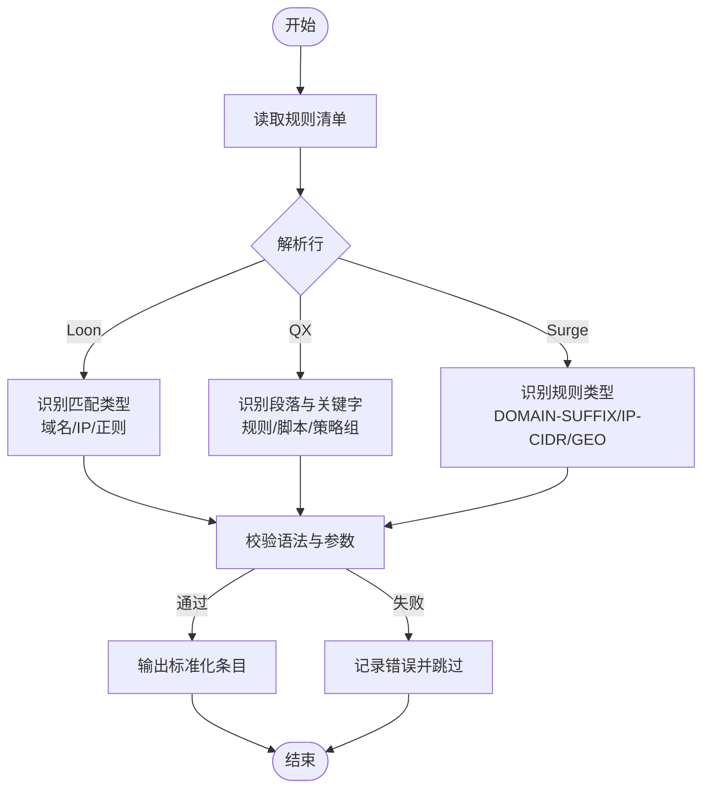
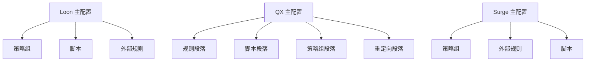
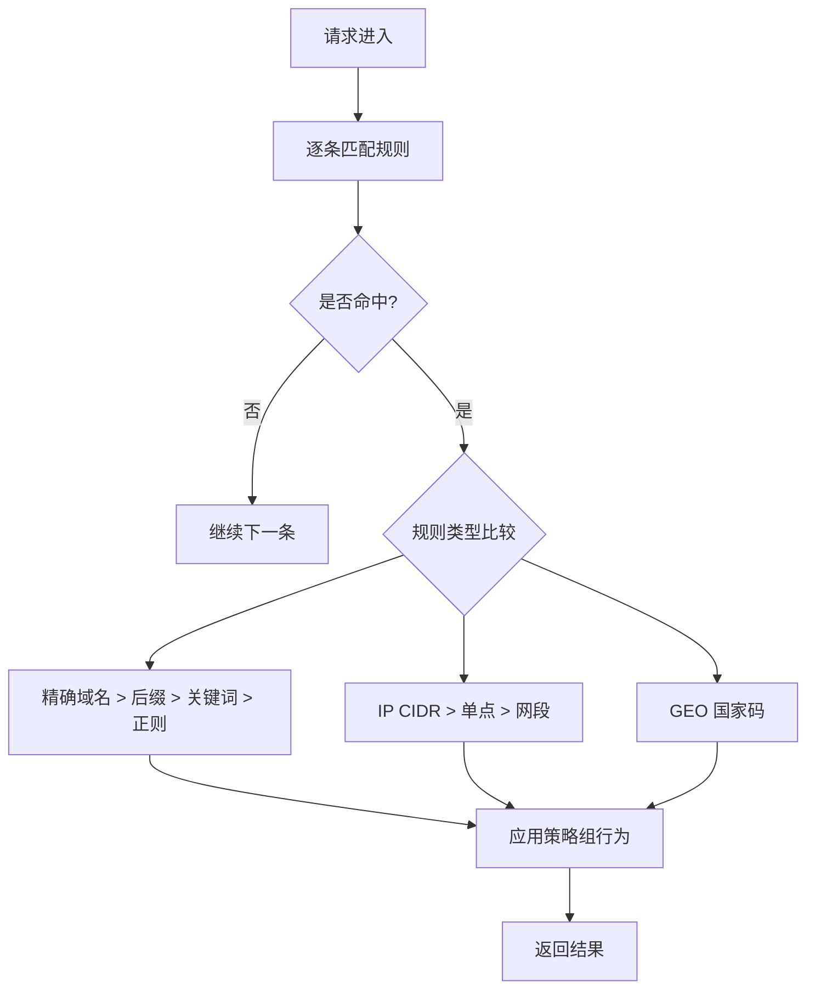
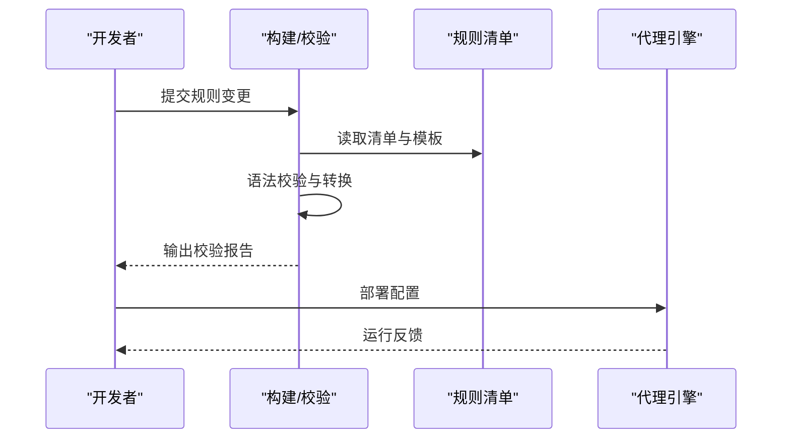
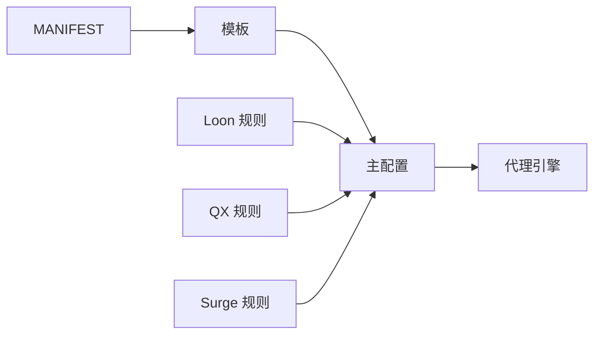

# 规则格式规范

<cite>
**本文档引用的文件**   
- [README.md](file://README.md)
- [surgio.conf.js](file://surgio.conf.js)
- [template/loon.tpl](file://template/loon.tpl)
- [template/quantumultx.tpl](file://template/quantumultx.tpl)
- [template/surge.tpl](file://template/surge.tpl)
- [Profile/Loon.lcf](file://Profile/Loon.lcf)
- [Profile/QX.conf](file://Profile/QX.conf)
- [Profile/Surge.conf](file://Profile/Surge.conf)
- [Mirror/rules/loon-Advertising.list](file://Mirror/rules/loon-Advertising.list)
- [Mirror/rules/qx-China.list](file://Mirror/rules/qx-China.list)
- [Mirror/rules/qx-Epic.list](file://Mirror/rules/qx-Epic.list)
- [Mirror/rules/qx-Hijacking.list](file://Mirror/rules/qx-Hijacking.list)
- [Mirror/rules/qx-bilibili.conf](file://Mirror/rules/qx-bilibili.conf)
- [Mirror/rules/qx-ddgksf-WeChat.conf](file://Mirror/rules/qx-ddgksf-WeChat.conf)
- [Mirror/MANIFEST.json](file://Mirror/MANIFEST.json)
- [doc/surgio-migration.md](file://doc/surgio-migration.md)
</cite>

## 目录
1. [简介](#简介)
2. [项目结构](#项目结构)
3. [核心组件](#核心组件)
4. [架构总览](#架构总览)
5. [详细组件分析](#详细组件分析)
6. [依赖关系分析](#依赖关系分析)
7. [性能考虑](#性能考虑)
8. [故障排查指南](#故障排查指南)
9. [结论](#结论)
10. [附录](#附录)

## 简介
本规范面向 Loon、Quantumult X（QX）与 Surge 三类代理工具的配置规则，系统阐述其语法差异、兼容性边界、配置文件结构、关键字定义与参数选项、规则优先级与匹配模式、作用域控制，并提供格式转换方法与验证流程。文档基于仓库中的模板、示例配置与迁移说明进行归纳，帮助读者在三种生态间高效编写、维护与转换规则。

## 项目结构
仓库围绕“模板 + 示例 + 构建/校验”组织：
- 模板层：提供 Loon、QX、Surge 的通用模板，用于生成或对齐不同引擎的规则与脚本片段。
- 示例层：包含各引擎的实际规则清单与插件，覆盖广告拦截、分流、脚本增强等场景。
- 构建与校验：通过工作流与脚本对规则进行一致性检查与发布。

**图表来源** 
- [template/loon.tpl](file://template/loon.tpl)
- [template/quantumultx.tpl](file://template/quantumultx.tpl)
- [template/surge.tpl](file://template/surge.tpl)
- [Profile/Loon.lcf](file://Profile/Loon.lcf)
- [Profile/QX.conf](file://Profile/QX.conf)
- [Profile/Surge.conf](file://Profile/Surge.conf)
- [Mirror/MANIFEST.json](file://Mirror/MANIFEST.json)
- [doc/surgio-migration.md](file://doc/surgio-migration.md)

**章节来源**
- [README.md](file://README.md)
- [Mirror/MANIFEST.json](file://Mirror/MANIFEST.json)

## 核心组件
- 模板系统：为 Loon、QX、Surge 提供统一的结构化模板，确保关键字、段落与引用方式一致。
- 规则清单：按引擎分类的规则集合，涵盖域名、IP、地理区域、应用标识等匹配维度。
- 配置文件：各引擎的主配置入口，声明策略组、脚本、外部规则与行为控制。
- 迁移与校验：将规则在不同引擎间转换并校验语法正确性。

**章节来源**
- [template/loon.tpl](file://template/loon.tpl)
- [template/quantumultx.tpl](file://template/quantumultx.tpl)
- [template/surge.tpl](file://template/surge.tpl)
- [Profile/Loon.lcf](file://Profile/Loon.lcf)
- [Profile/QX.conf](file://Profile/QX.conf)
- [Profile/Surge.conf](file://Profile/Surge.conf)

## 架构总览
下图展示从模板到具体配置的生成路径，以及规则清单在各引擎中的使用方式。

**图表来源** 
- [template/loon.tpl](file://template/loon.tpl)
- [template/quantumultx.tpl](file://template/quantumultx.tpl)
- [template/surge.tpl](file://template/surge.tpl)
- [Profile/Loon.lcf](file://Profile/Loon.lcf)
- [Profile/QX.conf](file://Profile/QX.conf)
- [Profile/Surge.conf](file://Profile/Surge.conf)
- [Mirror/MANIFEST.json](file://Mirror/MANIFEST.json)
- [doc/surgio-migration.md](file://doc/surgio-migration.md)

## 详细组件分析

### 模板系统与关键字对照
- Loon 模板：强调插件式扩展与脚本注入，规则以列表形式引入，支持域名、正则、IP 段等匹配。
- QX 模板：结构化较强，常用段落包括规则、脚本、策略组、重定向等，关键字与参数需严格遵循引擎约定。
- Surge 模板：注重策略组与外部规则的引用，规则类型丰富，支持 GEO、DOMAIN-SUFFIX、REGEX 等。

**图表来源** 
- [template/loon.tpl](file://template/loon.tpl)
- [template/quantumultx.tpl](file://template/quantumultx.tpl)
- [template/surge.tpl](file://template/surge.tpl)

**章节来源**
- [template/loon.tpl](file://template/loon.tpl)
- [template/quantumultx.tpl](file://template/quantumultx.tpl)
- [template/surge.tpl](file://template/surge.tpl)

### 规则清单结构与语法要点
- Loon 规则清单：通常以 .list 结尾，行级规则包含匹配类型与目标，如域名后缀、正则表达式、IP 网段等；可结合策略组名称输出行为。
- QX 规则清单：以 .conf 或 .list 结尾，段落化组织，常见关键字包括规则、脚本、策略组、重定向等；支持更丰富的参数与条件。
- Surge 规则清单：以 .conf 或 .list 结尾，规则类型明确，如 DOMAIN-SUFFIX、DOMAIN-KEYWORD、IP-CIDR、GEO等；与策略组联动。

**图表来源** 
- [Mirror/rules/loon-Advertising.list](file://Mirror/rules/loon-Advertising.list)
- [Mirror/rules/qx-China.list](file://Mirror/rules/qx-China.list)
- [Mirror/rules/qx-Epic.list](file://Mirror/rules/qx-Epic.list)
- [Mirror/rules/qx-Hijacking.list](file://Mirror/rules/qx-Hijacking.list)
- [Mirror/rules/qx-bilibili.conf](file://Mirror/rules/qx-bilibili.conf)
- [Mirror/rules/qx-ddgksf-WeChat.conf](file://Mirror/rules/qx-ddgksf-WeChat.conf)

**章节来源**
- [Mirror/rules/loon-Advertising.list](file://Mirror/rules/loon-Advertising.list)
- [Mirror/rules/qx-China.list](file://Mirror/rules/qx-China.list)
- [Mirror/rules/qx-Epic.list](file://Mirror/rules/qx-Epic.list)
- [Mirror/rules/qx-Hijacking.list](file://Mirror/rules/qx-Hijacking.list)
- [Mirror/rules/qx-bilibili.conf](file://Mirror/rules/qx-bilibili.conf)
- [Mirror/rules/qx-ddgksf-WeChat.conf](file://Mirror/rules/qx-ddgksf-WeChat.conf)

### 配置文件结构与作用域控制
- Loon 主配置：声明全局设置、策略组、脚本与外部规则引用；作用域通过段落与键值控制。
- QX 主配置：分段清晰，规则、脚本、策略组、重定向各自独立；可通过段落名与作用域限定生效范围。
- Surge 主配置：策略组为核心，外部规则通过 URL 引用；脚本与重定向作为补充能力。

**图表来源** 
- [Profile/Loon.lcf](file://Profile/Loon.lcf)
- [Profile/QX.conf](file://Profile/QX.conf)
- [Profile/Surge.conf](file://Profile/Surge.conf)

**章节来源**
- [Profile/Loon.lcf](file://Profile/Loon.lcf)
- [Profile/QX.conf](file://Profile/QX.conf)
- [Profile/Surge.conf](file://Profile/Surge.conf)

### 规则优先级与匹配模式
- 匹配模式：
  - 域名相关：精确域名、后缀、关键词、正则。
  - IP 相关：CIDR、单点、网段。
  - 地理位置：国家码映射。
- 优先级原则（通用经验）：
  - 更具体的规则优先于泛规则（例如精确域名 > 域名后缀 > 正则）。
  - 先匹配的外部规则或本地规则取决于引擎加载顺序，通常后加载覆盖先加载。
  - 策略组内节点选择由调度策略决定，不影响规则匹配结果。
- 作用域控制：
  - 通过段落或键值限定规则生效范围（如仅对特定策略组或脚本上下文）。
  - 脚本中可使用上下文变量限制匹配范围。

[此图为概念性流程图，不直接映射具体源码文件]

### 格式转换工具与验证方法
- 转换工具：
  - 基于模板与清单，将 Loon/QX/Surge 的规则与脚本进行相互转换。
  - 使用迁移说明文档指导关键字映射与段落结构调整。
- 验证方法：
  - 工作流中包含语法校验与一致性检查步骤。
  - 通过 MANIFEST 清单管理版本与依赖，确保规则集完整性。

**图表来源** 
- [Mirror/MANIFEST.json](file://Mirror/MANIFEST.json)
- [doc/surgio-migration.md](file://doc/surgio-migration.md)

**章节来源**
- [Mirror/MANIFEST.json](file://Mirror/MANIFEST.json)
- [doc/surgio-migration.md](file://doc/surgio-migration.md)

### 实际配置示例与最佳实践
- 示例参考：
  - Loon 广告拦截清单与插件组合。
  - QX 中国地区规则、B站与微信专项规则。
  - Surge 策略组与外部规则引用。
- 最佳实践：
  - 保持规则粒度合理，避免过度泛化导致误伤。
  - 使用明确的策略组命名与分层，便于维护。
  - 定期校验规则有效性，清理过期条目。
  - 脚本与规则分离，提升可读性与复用性。

**章节来源**
- [Mirror/rules/loon-Advertising.list](file://Mirror/rules/loon-Advertising.list)
- [Mirror/rules/qx-China.list](file://Mirror/rules/qx-China.list)
- [Mirror/rules/qx-bilibili.conf](file://Mirror/rules/qx-bilibili.conf)
- [Mirror/rules/qx-ddgksf-WeChat.conf](file://Mirror/rules/qx-ddgksf-WeChat.conf)
- [Profile/Surge.conf](file://Profile/Surge.conf)

## 依赖关系分析
规则清单与模板、主配置之间的依赖关系如下：

**图表来源** 
- [Mirror/MANIFEST.json](file://Mirror/MANIFEST.json)
- [template/loon.tpl](file://template/loon.tpl)
- [template/quantumultx.tpl](file://template/quantumultx.tpl)
- [template/surge.tpl](file://template/surge.tpl)
- [Profile/Loon.lcf](file://Profile/Loon.lcf)
- [Profile/QX.conf](file://Profile/QX.conf)
- [Profile/Surge.conf](file://Profile/Surge.conf)

**章节来源**
- [Mirror/MANIFEST.json](file://Mirror/MANIFEST.json)

## 性能考虑
- 规则数量与复杂度直接影响匹配性能，建议：
  - 合并重复或相近规则，减少冗余。
  - 优先使用精确匹配，降低正则开销。
  - 按需加载外部规则，避免一次性全量加载。
- 脚本执行应避免阻塞，尽量异步处理。

[本节为通用指导，不直接分析具体文件]

## 故障排查指南
- 常见问题：
  - 语法错误：检查段落名、关键字拼写与参数顺序。
  - 匹配失效：确认规则优先级与作用域是否正确。
  - 脚本异常：查看日志定位上下文变量与返回值。
- 排查步骤：
  - 使用工作流校验报告定位错误位置。
  - 逐步缩小规则范围，复现问题。
  - 借助 MANIFEST 清单核对版本与依赖。

**章节来源**
- [Mirror/MANIFEST.json](file://Mirror/MANIFEST.json)
- [doc/surgio-migration.md](file://doc/surgio-migration.md)

## 结论
通过模板化与清单化管理，Loon、QX、Surge 的规则可以在保证语法正确性的前提下实现跨引擎兼容与转换。遵循本规范的关键字定义、优先级与最佳实践，能够显著提升配置的可维护性与运行效率。

[本节为总结性内容，不直接分析具体文件]

## 附录
- 关键字速查：
  - 域名：精确、后缀、关键词、正则。
  - IP：CIDR、单点、网段。
  - 地理：国家码。
- 段落与作用域：
  - 规则、脚本、策略组、重定向等段落划分。
  - 通过键值与上下文控制生效范围。
- 转换与校验：
  - 基于模板与清单的自动转换。
  - 工作流校验与 MANIFEST 版本管理。

[本节为补充信息，不直接分析具体文件]